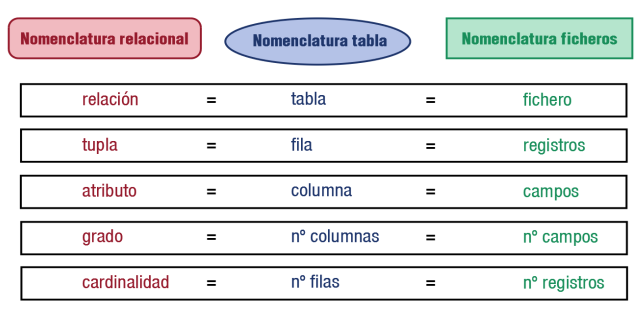

## 1. Modelo de datos

**Modelo de datos**: Lenguaje utilizado para la descripción de una base de datos. Permite describir las **estructuras** (tipos de datos y relaciones entre ellos), las **restricciones de integridad** (condiciones que deben cumplir según necesidades del modelo) y las **operaciones de manipulación de los datos** (insertado, modificación, borrado de datos).

----
Otra definición: Conjunto de herramientas conceptuales para describir la representación de la información en términos de datos. Comprenden: Estructuras y tipos de datos, operaciones y restricciones. 

Los modelos se clasifican según su nivel de abstracción en:
- **Modelos de datos conceptuales**: Describen estructuras de datos y restricciones de integridad. Usados en la etapa de análisis del problema dado. Ej.: Modelo E-R
- **Modelos de datos lógicos**: Se centran en operaciones y se implementan en algún SGBD. Ej.: Modelo Relacional
- **Modelos de datos físicos**: Estructuras de datos a bajo nivel implementadas dentro del propio SGBD.
----
El modelo de datos es un lenguaje que presenta dos sublenguajes:
DDL para describir, abstractamente, las estructuras de datos y las relaciones de integridad
DML para describir operaciones de manipulación de datos.

## 2. Terminología del modelo relacional

Modelo relacional fue propuesto por Codd en los laboratiros de IBM. Es un modelo lógico que establece estructura sobre lo datos independientemente de la forma en la que luego se almacenen. 
El modelo relacional viene de la relación entre este modelo y el concepto matemático de relación: Dados A y B, una relación entre ellos es un subconjunto de $A \times B$
### 2.1. Relación o tabla. Tuplas. Dominios

- Una **relación** es una **tabla con filas y columnas**.
- Las **tuplas** son **filas**.
- Los **atributos** son **columnas**.

El orden de las filas y columnas es irrelevante.

**Atributos**: **Cada dato que se almacena en la relación (tabla)**
- El atributo no puede tomar cualquier valor en la tupla, sino que tiene asociado un dominio de valores.

A menudo el dominio se define a través de la declaración de un tipo para el atributo. Una característica principal de los dominios es que sean atómicos (no puedan ser separados en dominios más simples). 
El dominio debe tener:
- Nombre: Sueldo
- Definición lógica: Sueldo neto del empleado
- Tipo de datos: Número entero
- Formato: 9.999€

**Tuplas**: Cada elemento de la relación. Si la tabla guarda datos de un cliente como DNI o nombre, una tupla o registro es ese DNI y nombre concreto del cliente. 
Cada tupla debe cumplir que:
- Se corresponde con un elemento del mundo real
- No hay dos tuplas iguales.

### 2.2. Grado. Cardinalidad

**Grado**: Tamaño de una tabla en base a su número de atributos (columnas). A mayor grado, mayor complejidad para trabajar con ella.
**Cardinalidad**: Número de tuplas o filas de una relación o tabla.  Resultan de realizar el producto cartesiano de los dominios (Todas las combinaciones posibles que podría haber)
### 2.3. Sinónimos


## 3. Relaciones. Características de una relación (tabla)

- Cada tabla tiene un nombre distinto
- Cada atributo de la tabla toma un solo valor en cada tupla (fila)
- Cada atributo (columna) tiene un nombre distinto en cada tabla, pudiendo coincidir en tablas distintas
- No puede haber dos tuplas (filas) completamente iguales
- El orden de las tuplas (filas) no importa
- El orden de los atributos (columnas) no importa
- Los datos de un atributo (columna) deben ser del mismo dominio.

## 3.1. Tipos de relaciones (tablas)

Las clasificamos en:
- **Persistentes**: Solo pueden ser borradas por los usuarios
- **Base**: Independientes. Se crean indicando su estructura y sus ejemplares (conjunto de tuplas o filas)
- **Vistas**: Solo almacenan una definición de consulta, de la que se produce una tabla cuyos datos proceden de bases o de otras vistas. Si los datos de la base cambian, los de la vista también
- **Instantáneas:** Son vistas que almacenan los datos que muestran además de la consulta. Solo modifican el resultado cuando el sistema se refresca. Es como una fotografía de la relación, válida durante un periodo de tiempo concreto.
- **Temporales**: Tablas eliminadas automáticamente por el sistema. 

### 4. Tipos de datos

Con la asignación de tipos de datos se selecciona un dominio para el atributo.
Cada campo o atributo debe poseer un nombre y un tipo de dato (texto, numérico, fecha/hora, Si/no, autonumérico, memo (texto largo), moneda (representa dinero), objeto OLE (Object Linking and Embedding, enlazado e incrustación de objetos), almacena gráficos, imágenes o textos creados por otras aplicaciones).

## 5. Claves

**Superclave**: Atributo o conjunto de atributos que identifican de forma única las tuplas (filas) de una relación (tabla).
Toda la fila como conjunto es una superclave, al no poder haber dos tuplas completamente iguales. 

**Clave candidata**: Atributo o conjunto de atributos que identifican unívoca y mínimamente a cada una de las tuplas de la relación. Siempre hay al menos una clave candidata formada por el conjunto de todos los atributos (superclave), aunque puede haber más de una.

Si la clave candidata está formada por más de un atributo, entonces es una clave **compuesta**, en caso contrario es **simple**.

La clave candidata debe cumplir la **UNICIDAD** (no hay dos tuplas con los mismos valores) y la **IRREDUCIBILIDAD** (si se elimina algún atributo ya no es única)

Para ver las claves candidatas no nos fijamos en un momento concreto sino que conocemos el significado real de los atributos, mirando los posibles valores que podemos llegar a tener. 

**Clave principal**: Clave candidata elegida para identificar cada una de las tuplas. La tabla solo puede tener una clave principal.

**Clave alternativa:** Clave candidata no elegida como principal

**Clave externa, ajena o secundaria**: Clave candidata exportada a otra tabla que permite relacionar una o varias tuplas de la tabla receptora con una tupla de la tabla exportadora.
Otra definición: Atributo o conjunto de atributos de una relación cuyos valores coinciden con los valores de la clave primaria de alguna otra relación (o de la misma).
**Representan relaciones entre datos**. 
Son los datos de atributos de una tabla cuyos valores están relacionados con atributos de otra tabla.
Las claves ajenas sí pueden repetirse en la tabla.

## 6. Índices. Características

Índice es una estructura de datos que permite acceder a diferentes filas a través de un campo o campos, permitiendo un acceso mucho más rápido a los datos. (Similar a, en la vida real, distribuir por hojas y crear un índice para consultar las palabras que comienzan por la letra que queremos).

- Son útiles para consultas frecuentes a un rango de filas o fila de una tabla. (Ej.: Usuarios con fecha de ingreso anterior a fecha concreta). 
- Los índices son independientes física y lógicamente de los datos, pueden ser creados y eliminados sin afectar ni a las tablas, ni entre ellos.
- No hay límite de columnas a indexar aunque lo que tiene sentido es crearlo para ciertas columnas al agilizar las operaciones de búsqueda en bases de datos grandes.
- Las operaciones de agregar, actualizar o borrar se incorporan automáticamente a los índices aunque las operaciones se ralentizan ya que es necesario actualizar tanto la tabla como el índice.
- Si se elimina un índice, puede observarse una ralentización en el acceso a datos.

## 7. Valor NULL. Operaciones con este valor

Cuando el valor del campo se desconoce, se le asigna el valor especial `NULL`.
Al trabajar con claves secundarias el valor nulo indica que la tupla o fila no está relacionada con ninguna otra tupla o fila.

No es lo mismo NULL que espacio en blanco o cero.
El valor nulo no es ni verdadero ni falso. (Indefinido)
- TRUE AND NULL  -> NULL  (Porque aunque la izquierda es verdadero, la derecha es null)
- FALSE AND NULL -> FALSE (Porque la izquierda es falso)
- TRUE OR NULL -> TRUE (Porque la izquierda es verdadero)
- FALSE OR NULL -> NULL (Porque la izquierda es falso y se evalua el derecho)
- NOT NULL -> NULL
- IS NULL devuelve verdadero si el valor que se compara es NULL

Información adicional: https://es.wikipedia.org/wiki/Null_%28SQL%29

## 8. Vistas

Una **vista** es una tabla "virtual" cuya filas o columnas se obtienen a partir de una o varias tablas del modelo. Es un filtro de las tablas a las que hace referencia. (O de otras vistas, o de otras tablas o de otras vistas de otras bases de datos).

No hay restricción a la hora de consultar vistas y muy pocas restricciones al modificar datos de ellas.

Al actualizar una vista, realmente actualizamos la tabla (y viceversa). Oracle no permite actualizar vistas. SQL Server y MySQL Server sí aunque con muchas restricciones. 

Ventajas:
- Seguridad: No permitir acceso a toda la tabla
- Comodidad: Evita sentencias muy complejas

## 9. Usuarios. Roles. Privilegios

#### Usuarios
Usuario: Conjunto de permisos que se aplican a una conexión de base de datos. Tiene funciones como:
- Ser el propietario de ciertos objetos (tablas, vistas)
- Realizar copias de seguridad
- Definir cuota de almacenamiento
- Definir el tablespace (unidad lógica de almacenamiento dentro de BBDD Oracle) por defecto
#### Privilegios
Permiso dado a un usuario para realizar ciertas operaciones que pueden ser:
- Del sistema. 
- Del objeto
#### Roles
Agrupación de permisos del sistema y de objeto.

## 10. SQL

Structured Query Language (SQL) es el lenguaje fundamental de los Sistemas de Gestión de Bases de Datos relacionales. Es un lenguaje declarativo que define qué se desea hacer en lugar de cómo hacerlo (eso lo hace el SGBD).

Es necesario consultar la documentación del SGBD para conocer la sintaxis concreta porque algunos comandos, tipos... pueden no seguir el estandar.

SQL se caracteriza por su potencia, versatilidad, facilidad de aprendizaje. 
Permite:
- Consultar datos
- Definir la estructura de los datos
- Manipulación
- Especificación de conexiones seguras
### 10.1. Elementos del lenguaje. Normas de escritura

Diferenciamos entre:
- Comandos: Instrucciones que pueden crearse en SQL. Distinguimos entre:
	- Definición de datos: DDL (Data Definicion Language) crear y definir nuevas BBDD, tablas, campos
	- Manipulación de datos: DML (Data Manipulation Language) generar consultas para ordenar, filtrar y extraer datos
	- Control y seguridad de datos: DCL (Data Control Language) administran derechos y restricciones de los usuarios
- Cláusulas: Palabras especiales que permiten modificar el funcionamiento de un comando
- Operadores: Permiten crear expresiones complejas y pueden ser aritméticos o lógicos
- Funciones: Consiguen valores complejos
- Literales: Son constantes o valores completos.

Las instrucciones:
- Siempre terminan con punto y coma
- No distinguen entre mayúsculas o minúsculas
- Los comandos pueden separarse con saltos de línea o espacios. Se pueden tabular líneas.
- Los comentarios son con `/* */ ` (casi siempre, salvo algún SGBD)

## 11. Lenguaje de descripción de datos (DDL)

Las instrucciones DDL generan acciones que no se pueden deshacer. Deben usarse con precaución y realizar copias de seguridad.

Con MySQL Workbench se puede:
- Realizar el diseño de la BBDD con Data Modeling e implantar con ingeniería directa la base de datos en el servidor o generar el script SQL con las sentencias DDL para cargarlo posteriormente
- Trabajar en modo gráfico con esta herramientas

En Oracle cada usuario de una base de datos tiene un esquema que tendrá el mismo nombre que el usuario con el que se ha accedido y sirve para almacenar los objetos que posea ese usuario. 
Los objetos podrán ser tablas, vistas, índices u otros objetos relacionados con la definición de la BBDD. Podrá crear y manipularlos el usuario y los administradores de la BBDD (en principio, salvo modificaciones de los permisos)

### 11.1. Creación y borrado de bases de datos. Objetos de la base de datos

Según el SGBD quizás haya que definir un espacio de nombres separado para cada conjunto de tablas (esquemas o usuarios en Oracle).
Crear base de datos implica indicar archivos y ubicaciones y otras indicaciones técnicas y administrativas (lo hace el Administrador).

### Crear 
```sql
CREATE DATABASE nombreDeLaBaseDeDatos;
-- MySQL
CREATE SCHEMA nombreDeLaBaseDeDatos;
CREATE DATABASE nombreDeLaBaseDeDatos;
CREATE SCHEMA IF NOT EXISTS nombreDeLaBaseDeDatos;
CREATE DATABASE IF NOT EXISTS nombreDeLaBaseDeDatos;
```

### Borrar
```sql
DROP DATABASE nombreDeLaBaseDeDatos;
```

### 11.2. Creación de tablas

Los objetos básicos de SQL son las tablas. Es bueno tener planificado:
- El nombre de la tabla
- El nombre de sus columnas
- El tipo y tamaño de datos en cada columna
- Las restricciones sobre los datos
- La información adicional
- Las reglas para los nombres de tablas (No puede estar duplicada la tabla en el mismo esquema, debe comenzar por carácter alfabético, longitud máxima 30 caracteres, solo se permiten letras del alfabeto inglés-dígitos-guion bajo, no puede usarse palabras reservadas de SQL, no distingue entre mayúsculas y minúsculas, si tiene espacios en blanco hay que entrecomillarlo con comillas dobles y en el estándar SQL99 (respetado por Oracle)  si se crea entre comillas dobles se hará sensible a mayúsculas. 

La sintaxis básica es
```sql
CREATE TABLE [esquema.]NOMBRE_TABLA(
	columna1 tipo_dato,
	columna2 tipo_dato,
	...
	columnaN tipo_dato);
```

En MySQL
```SQL
CREATE TABLE [IF NOT EXISTS] [esquema.]NOMBRE_TABLE(
	columna1 tipo_dato [restricciones de columna]
	columna2 tipo_dato [restricciones de columna]
	...
	[reestricciones de tabla])
	[{ENGINE|TYPE} = Tipo_tabla];
)
```

ENGINE indica el tipo de almacenamiento para la tabla mediante Tipo_Tabla. Ej.: Las tablas MyISAM y las tablas InnoDB (Tipos de almacenamiento pueden verse con `SHOW ENGINES;`)

**Restricciones de columna**: Afectan solo a esa columna (clave primaria, no nulo, etc.)
**Restricciones de tabla**: se indican después de especificar todas las columnas, se les puede asignar un nombre y pueden afectar a varias columnas.

**SOLO PUEDEN CREARSE TABLAS SI SE POSEEN LOS PERMISOS NECESARIOS**

## 11.2.1. Tipos de datos

### MySQL

**Numéricos**
**BIT** o **BOOL** (0 o 1)
**TINYINT** o **UNSIGNED TINYINT** (-128 a 127. Con unsigned 0 a 255)
**SMALLINT** o **UNSIGNED SMALLINT**
**MEDIUMINT** o **UNSIGNED SMALLINT**
**INT**
**BIGINT**
**FLOAT(m,d)** m ancho de pantalla, d parte decimal
**DOUBLE**
**DECIMAL**

**Caracteres** 
**CHAR(n)**.  De 1 a 255 caracteres. De longitud fija.
**VARCHAR**.  De 1 a 255 caracteres. De longitud variable. 
**TINYTEXT**, **TINYBLOB**.  Text es para texto plano sin formato y sin distinguir mayúsculas y minúsculas. BLOB es para objetos binario (cualquier info desde texto hasta imagenes o archivos de sonido y video)
**TEXT** y **BLOB**. Rango de 255 - 65535 caracteres. TEXT compara contenido sin distinguir mayus y munus, BLOB sí distingue
**MEDIUMTEXT**, **MEDIUMBLOB**
**LONGTEXT**, **LONGBLOB**

**Varios**
**DATE**. Fecha. Formato por defecto YYYY MM DD
**DATETIME**. Fecha y hora. 
**TIMESTAMP**. Desde 1-01-1970 hasta 2037
**TIME**. Almacena una hora. 
**YEAR**. Almacena un año
**SET**. Ninguno uno o varios valores de una lista
**ENUM**. Solo puede almacenar un valor de la lista. 
### Oracle

**Numéricos**
**NUMBER** Números fijos y en punto flotante. Admiten hasta 28 dígitos de precisión. Puede indicarse la precisión y la escala.
**FLOAT** Datos numéricos en punto flotante.


**Caracteres**
**CHAR(n)**. De longitud fija. Aunque se introduzca un valor más corto, se rellana al tamaño indicado. 
**VARCHAR2(n)**. De longitud variable.
**VARCHAR(n).** En desuso. Se usar VARCHAR2(n)
**NCHAR(n)**. De longitud fija.  Solo caracteres Unicode.
**NVARCHAR2**. De longitud variable. Solo caracteres Unicode.
**LONG** o **LONG RAW**  o **RAW** Caracteres de longitud variable / Cadenas binarias de ancho variable. Como máximo hasta 2GB. Deberán ser convertidos al moverse entre sistemas. Es un tipo de datos obsoleto. Se usan los datos de tipo LOB y Oracle recomienda que se convierta si aun se está usando. No puede usarse en WHERE, GROUP BY.... La tabla solo puede contener una columna de tipo LONG y solo soporta acceso secuencial. 
**LOB (BLOG CLOB NCLOB BFILE)**. Permite almacenar y manipular bloques grandes de datos no estructurados en formato binario o de carácter. Admite hasta 8 TB. Puede contener varias columnas de ese tipo. Soportan acceso aleatorio. Las tablas con columnas de tipo LOB no pueden ser replicadas.
**BLOB** Datos binarios no estructurados. Hasta 8TB.
**NCLOB**. Datos de tipo carácter. Hasta 8TB. Según Unicode nacional.
**BFILE**. Datos binarios no estructurados en archivos del sistema operativo, fuera de la base de datos. La columna BFILE almacena localizador del archivo a uno externo que contiene los datos. Debe asegurarse de que exista el archivo y de que los procesos de Oracle tengan permisos de lectura.
**ROWID**. Dirección única de cada fila de la tabla de la BBDD. Este campo no aparece en las operaciones del CRUD, es un tipo de dato usado exclusivamente por oracle. 
> OOOOOOFFFBBBBBBRRR OOOOOO (Segmento de la base de datos) FFF (Número de fichero del tablespace que contiene la fila) BBBBBB (Bloque de datos que contiene la fila) RRR (Número de fila en el bloque)
UROWID es ROWID universal en tablas que no sean Oracle, externas.

**Otros**
**DATE** Fecha y hora
**TIMESTAMP** Datos de tipo hora, fraccionando los segundos
**TIMESTAMP WITH TIMEZONE** Con zona horaria
**TIMESTAMP WITH LOCAL TIME ZONE.** Se ajustará la hora en el SELECT a la zona horaria de la sesión actual
**XMLType**. Tipo de datos abstracto. Se trata de un clob. Se asocia a un esquema XML para la definición de su estructura.

## 11.2.2. Creación de secuenciales en Oracle

Los _sequence_ son objetos de la bnase de datos con los que los usuarios pueden generar números únicos. 
- Pueden usarse para generar claves primarias automáticamente. 
- Se incrementan independientemente del commit o el rollback de la transacción. 
- Un usuario nunca puede adquirir el sequence generado por otro usuario. 
- Estos son independientes de las tablas pudiéndose usar para una o varias tablas. 
- Los posibles saltos de secuenciales pueden deberse a transacciones revertidas.


```sql
CREATE SEQUENCE nombre_secuencial
 START WITH 1000
 INCREMENT BY 1
 MINVALUE 1 -- Menor o igual al START WITH y menor que MAXVALUE. Hay NOMINVALUE.
 MAXVALUE 1000000000000 -- Por defecto es NOMAXVALUE (10^27)
  /*PREALMACENAR*/
 NOCACHE -- Los valores de la secuencia no están preasignados (Si omite CACHE y NOCACHE, almacena en cache 20 sequence de forma predeterminada. Con CACHE se puede definir)
  /*REINICIAR*/
 NOCYCLE; -- No continuar generando valores al alcanzar los límites. Es lo predeterminado. Con CYCLE volvería a reiniciarse. 
 /*ORDENADOS*/
 -- ORDER garantiza que los secuenciales se generen en orden de peticiones. Util si se estan usando numeros de secuencia como timestamps. NOORDER no se generan en orden de peticion. Es el valor por defecto.
```
### 11.3. Restricciones

Condición que una o varias columnas deben cumplir obligatoriamente. 
Cada restricción lleva un nombre  (importante que sea un nombre que ayude a identificarla y que sea único para cada esquema -usuario-). Si no se le pone, el SGBD lo pondrá automáticamente.

Como consejo se puede usar:
- Tres letras para el nombre de tabla
- _
- Tres letras para la columna afectada
- _
- Dos letras para el tipo de restricción (PK Primary Key, FK Foreign Key, NN Not Null, UK Unique, CK Check (Validación))

Para indicar las restricciones a nivel de columna, la sentencia en SQL estándar es:
```sql
CREATE TABLE NOMBRETABLA (
     Columna1 Tipo_Dato
          [CONSTRAINT nombredelarestricción]
          [NOT NULL]
          [UNIQUE]
          [DEFAULT valor]
          [CHECK condición]
          [PRIMARY KEY]
          [FOREIGN KEY]          
          [REFERENCES nombreTabla [(columna [, columna ])]
          [ON DELETE CASCADE]],          
     Columna2 Tipo_Dato
          [CONSTRAINT nombredelarestricción]
          [NOT NULL]
          [UNIQUE]
          [DEFAULT valor]
          [CHECK condición]
          [PRIMARY KEY]
          [FOREIGN KEY]          
          [REFERENCES nombreTabla [(columna [, columna ])]
          [ON DELETE CASCADE]]
          [CHECK condición],...);
```

Ejemplito en Oracle:
```sql
CREATE TABLE USUARIOS(
	login VARCHAR(15) CONSTRAINT usu_log_PK PRIMARY KEY,
	password VARCHAR(8) NOT NULL,
	fecha_ingreso DATE DEFAULT SYSDATE;
);
```

Ejemplito en MySQL:
```sql
CREATE TABLE USUARIOS(
	login VARCHAR(15) PRIMARY KEY,
	password VARCHAR(8) NOT NULL,
	fecha_infreso TIMESTAMP DEFAULT CURRENT_TIMESTAMP;
)
```

Otra restricción puede ser `[AUTO_INCREMENT]` en MySQL con la que se asigna un identificador único a cada fila generando secuenciaa de números de forma automática comenzando por el 1.  (En Oracle están los sequence).

Igualmente, también se pueden definir las columnas de la tabla y después especificar las restricciones pudiendo referir varias columnas en una única restricción.

```sql
-- Crear la tabla sin restricciones
CREATE TABLE USUARIOS (
    Login VARCHAR(15),
    Password VARCHAR(8) NOT NULL,
    Fecha_Ingreso DATE DEFAULT SYSDATE
);

-- Añadir la restricción PRIMARY KEY
ALTER TABLE USUARIOS
ADD CONSTRAINT usu_log_PK PRIMARY KEY (Login);

-- Añadir la restricción NOT NULL
ALTER TABLE USUARIOS
MODIFY Password VARCHAR(8) NOT NULL;
```
#### NOT NULL

Se obliga a que la columna tenga un valor. 
```sql
CREATE TABLE USUARIOS(
	f_nacimiento DATE NOT NULL);
```

#### UNIQUE

Para que no se repitan valores en la columna. Oracle crea un índice automáticamente cuando se habilita esta restricción yl o borra al deshabilitarla.
Ejemplo Oracle:
```sql
CREATE TABLE USUARIOS (
    Login VARCHAR(25)
        CONSTRAINT Usu_Log_UK UNIQUE);
```

Ejemplo MySQL y Oracle
```sql
CREATE TABLE USUARIOS (
    Login VARCHAR(25) UNIQUE);
);
```

y a la vez

```sql
CREATE TABLE USUARIOS (
    Login VARCHAR (25),
    Correo VARCHAR (25),
    CONSTRAINT Usuario_UK UNIQUE (Login, Correo));
```

La restricción fijate que es independiente a "Correo" y común a "Login" y a "Correo". Se está especificando que la combinación de AMBOS VALORES ha de ser única.
#### PRIMARY KEY

Oracle y MySQL
```sql
CREATE TABLE USUARIOS (
Login VARCHAR (25) PRIMARY KEY);
```

Oracle poniendo nombre
```sql
CREATE TABLE USUARIOS (
     Login VARCHAR (25)
          CONSTRAINT Usu_log_PK PRIMARY KEY);
```

Claves compuestas obligatoriamente deben ser restricciones de tabla tras haber declarado las columnas:
```sql
CREATE TABLE USUARIOS (
	Nombre VARCHAR (25),
	Apellidos VARCHAR (30),
	F_Nacimiento DATE,
	CONSTRAINT Usu_PK PRIMARY KEY(Nombre, Apellidos, F_Nacimiento));
```

#### REFERENCES. FOREIGN KEY

Al indicar la clave ajena debe hacerse referencia a la tabla (CONSTRAINT) y a los campos de donde procede (REFERENCES).
En Oracle puede ponerse la restricción junto al campo que va a ser la clave ajena.
```sql
 CREATE TABLE USUARIOS (
    Login VARCHAR (25) PRIMARY KEY, 
       Cod_Partida INTEGER(8)  CONSTRAINT Cod_Part_FK  REFERENCES PARTIDAS(Cod_Partida));
```

Si el campo al que hace referencia es la clave principal en su tabla no es necesario indicar el `REFERENCES`
```
CREATE TABLE USUARIOS ( 
       Login VARCHAR (25) PRIMARY KEY,<br />       Cod_Partida INTEGER(8) 
       CONSTRAINT Cod_Part_FK 
       REFERENCES PARTIDAS); 
```

En MySQL la clave ajena se pone al final y debe indicarse `FOREIGN_KEY` para indicar a qué campo se refiere
```sql
CREATE TABLE USUARIOS (
    Login VARCHAR (25) PRIMARY KEY,
    Cod_Partida INTEGER(8), 
    F_Partida DATE, 
    CONSTRAINT Partida_Cod_F_FK FOREIGN KEY (Cod_Partida) 
    REFERENCES PARTIDAS(Cod_Partida)); 

CREATE TABLE USUARIOS (
    Login VARCHAR (25) PRIMARY KEY,
     Cod_Partida INTEGER(8),  
    F_Partida DATE, 
    CONSTRAINT Partida_Cod_F_FK FOREIGN KEY (Cod_Partida, F_Partida)  
    REFERENCES PARTIDAS(Cod_Partida, F_Partida)); 
```

Al relacionar campos se necesita que el dato del campo que es clave ajena haya sido incluido en la tabla de procedencia. --> Integridad referencial.

Si se hace referencia una tabla no creada, dará fallo. Deben crearse primero las que no tengan claves ajenas.
Si se quieren borrar las tablas tienen que borrarse las de claves ajenas antes.

Otras soluciones es añadir tras la cláusula `REFERENCE`:
- ON DELETE CASCADE: Borra todos los registros cuya clave ajena sea igual al registro borrado
- ON DELETE SET NULL: Coloca el valor NULL en todas las claves ajenas relacionadas con la borrada
- ON DELETE RESTRICT: (Igual que NOACTON en MySQL) no permite borrar el registro principal si hay registros asociados.
- ON UPDATE CASCADE: Modificar el valor de la clave ajena de todos los registros cuya clave ajena sea igual a la del registro modificado.
- ON UPDATE SET NULL: Coloca el valor NULL en todas las ajenas relacionadas con la modificada.
- ON UPDATE RESTRICT: (Igual que NOACTON en MySQL) no permite modificar la clave primaria del registro principal si hay registros asociados con ese valor en su clave ajena. 

```sql
CREATE TABLE USUARIOS (
    Login VARCHAR (25) PRIMARY KEY,<br />    Cod_Partida INTEGER(8), 
    F_Partida DATE, 
    CONSTRAINT Partida_Cod_F_FK FOREIGN KEY (Cod_Partida)
    REFERENCES PARTIDAS(Cod_Partida) ON DELETE CASCADE); 
```

Por defecto en MySQL si no se indica nada son ON DELETE RESTRICT y ON UPDATE RESTRICT

#### DEFAULT Y VALIDACION

Para asignarle un valor por defecto `DEFAULT`. 
En Oracle pueden añadirse expresiones, constantes, funciones SQL y variables. Como en DATE la función SYSDATE.
En MySQL no pueden añadirse expresiones o SQL, solo en el caso del TIMESTAMP para CURRENT_TIMESTAMP.

Para comprobar que los valores son adecuados se usa `CHECK` comprobando una condición determinada:
```sql
CREATE TABLE USUARIOS (Login VARCHAR (25) PRIMARY KEY),
    Credito FLOAT(4) CHECK (Crédito BETWEEN 0 AND 2000));
```
Para poner varios CHECK a la misma columna se ponen varios CONSTRAINT seguidos y separados por comas.

En MySQL existe el tipo de datos ENUM para crear enumeraciones (campos que admiten solo valores fijos):
```sql
CREATE TABLE USUARIOS (
     Login VARCHAR (25) PRIMARY KEY,
     Pais ENUM ('España', 'Francia', 'Bélgica'));
```
### 11.4. Eliminación de tablas

Las tablas se eliminan con el comando `DROP TABLE`
```sql
DROP TABLE tabla1, tabla2...
```

En Oracle no se permite el borrado de varias tablas y además puede usarse `CASCADE CONSTRAINT` para que se borren las restricciones donde es clave ajena y después la tabla en cuestion.
```sql
DROP TABLE tabla [CASCADE CONSTRAINT];
```

Al borrar la tabla desaparecen sus datos, las vistas siguen existiendo pero no funcionan. 
Se dispone de `TRUNCATE TABLE` que permite eliminar los datos pero sin eliminar su estructura. 

### 11.5. Modificación de tablas

**Cambiar el nombre de una tabla:**
`RENAME TABLE NombreViejo TO NombreNuevo`

**Añadir columnas a la tabla:**
```sql 
ALTER TABLE NombreTabla ADD
(ColumnaNueva1 TipoDato [Propiedades]
ColumnaNueva1 TipoDato [Propiedades]);
```

**Eliminar columnas de la tabla:**
```sql
ALTER TABLE NombreTabla DROP COLUMN
(Columna1, Columna2...);
```

**Modificar columnas de una tabla:**
```sql
ALTER TABLE NombreTabla MODIFY 
(Columna1 TipoDatos [prop],
Columna2 TipoDatos [prop]);
```

**Renombrar columnas de una tabla**
```sql
-- En Oracle
ALTER TABLE NombreTabla RENAME COLUMN NombreAntiguo TO NombreNuevo;
-- En MySQL
ALTER TABLE NombreTabla CHANGE COLUMN NombreAntiguo NombreNuevo definicionColumna;
```

Ejemplo:
```sql
-- En Oracle
ALTER TABLE USUARIOS RENAME COLUMN User TO Login;
-- En MySQL
ALTER TABLE USUARIOS CHANGE COLUMN User Login VARCHAR(10);
```

**Borrar restricciones**
```sql
--Oracle
ALTER TABLE NombreTabla DROP CONSTRAINT NombreRestriccion;
```
**Modificar el nombre de las restricciones**
```sql
--Oracle
ALTER TABLE NombreTabla RENAME CONSTRAINT NombreViejo To NombreNuevo;
```
**Activar o desactivar restricciones**
```sql
--Oracle
ALTER TABLE NombreTabla DISABLE CONSTRAINT NombreRestriccion [CASCADE];
ALTER TABLE NombreTabla ENABLE CONSTRAINT NombreRestriccion [CASCADE];
```

Con CASCADE se desactivan/activan también las que dependan de esta.

**En MySQL**
```sql
-- Si queremos añadir restricciones, por ejemplo la restricción UNIQUE:
    ALTER TABLA NombreTabla ADD [CONSTRAINT [nombrecons]]        UNIQUE [INDEX|KEY] [nombre_indice];
-- Si queremos eliminar una clave primaria:
 ALTER TABLE NombreTabla DROP PRIMARY KEY;
--Si queremos añadir una restricción de clave ajena:
ALTER TABLE NombreTabla ADD [CONSTRAINT [nombrecons]] FOREIGN KEY [nombre_indice] (nombre_columna_indice,...);
```

----

Ejemplo: Queremos poner una restricción a sueldo para que tome valores entre 1000 y 1200,

```sql
ALTER TABLE EMPLEADOS ADD CONSTRAINT emp_sue_CK CHECK (Sueldo BETWEEN 1000 AND 1200);
```

### 11.6. Creación y eliminación de índices

Puede crearse con `CREATE INDEX NombreIndice ON NombreTabla (Columna1, Columna2...)`

También cuando se crea la tabla con la opción INDEX:
```sql
CREATE TABLE NombreTabla
campo1 tipoDato,
campo2 tipoDato,...
INDEX [nombreIndice] (campos);
```
O con un `ALTER TABLE`:
```sql
ALTER TABLE NombreTabla
ADD INDEX [nombreIndice] (campo);
```

El índice puede eliminarse con:
```
DROP INDEX NombreIndice ON NombreTabla;
```

Los que hay pueden verse con 
```sql
SHOW INDEX FROM NombreBaseDeDatos.NombreTabla;
```

La mayoría de los índices se crean de forma implícita al poner las restricciones PRIMARY KEY, FOREIGN KEY o UNIQUE

### 11.7. Creación y eliminación de vistas


```sql
-- CREACION
CREATE VIEW nombre_vista AS sentencia_select;
--Ejemplo
CREATE VIEW vista_empleado AS SELECT nombre, oficina FROM empleado;

-- MODIFICACION
CREATE OR REPLACE VIEW nombre_vista AS sentencia_select;
ALTER VIEW nombre_vista AS sentencia_select;
-- Alter solo puede usarse cuando la vista ya esta creada

-- ELIMINACION
DROP VIEW nombre_vista;
```


## 12. Lenguaje de control de datos (DCL)

### 12.1 Creación de usuarios

Cuando se crea el usuario se establecen las claves de acceso que podrá modificar el Administrador o el propietario. La BBDD almacena encriptadas las claves en la tabla del diccionario `DBA_USERS`. En MySQL están encriptadas en la BBDD `mysql` en la tabla `user`.

Pueden crear el que tenga cuenta con privilegios de administrador. Los usuarios creados pueden verse con las vistas `ALL_USERS` y `DBA_USERS`.  Para ver en mi sesión los usuarios que existen se pone: `DESC SYS.ALL_USERS;`
#### Crear usuarios en Oracle
```sq
CREATE USER quinidio
IDENTIFIED BY prueba123
[DEFAULT TABLESPACE tablespace]
[TEMPORARY TABLESPACE tablespace]
[QUOTA int {K | M} ON tablespace]
[QUOTA UNLIMITED ON tablespace]
[PROFILE perfil];
```

TABLESPACE: Se almacenan los objetos que el usuario cree. Si no se especifica TABLESPACE será SYSTEM.
QUOTA: Espacio en Megabytes o Kilobytes en el Tablespace asignado. Si no se especifica el usuario no tendrá espacio y no puede crear objetos.
PROFILE: Perfil al usuario. Si no, se le asignas el por defecto. 

Pueden modificarse los usuarios con `ALTER USER`:
```sql 
ALTER USER quinidio
IDENTIFIED BY clave_acceso
[DEFAULT TABLESPACE tablespace ]
[TEMPORARY TABLESPACE tablespace]
[QUOTA int {K | M} ON tablespace]
[QUOTA UNLIMITED ON tablespace]
[PROFILE perfil];
```

El usuario sin privilegios de admin solo puede cambiar su clave de acceso.

Para eliminar usuario se usa el comando `DROP USER`:
```sql
DROP USER quinidio [CASCADE]
```

Con CASCADE se borran todos los objetos del usuario antes de borrarlo. Sin esa opción no dejará borrar al usuario si tiene tablas creadas.
#### Crear usuarios en MySQL
```sql
CREATE USER quinidio@`equipo`
IDENTIFIED BY `miclave`
```

En equipo se pone el nombre del equipo desde el que el usuario puede conectarse (localhost, una ip, % cualquier máquina).

Los usuarios creados pueden verse con `select * from mysql.user;`
### 12.2 Permisos

Aunque se tenga el usuario, si intentamos crear una tabla no habrá permisos para ello. Los permisos pueden agruparse formando **roles**.

### Dar permisos
Los permisos se otorgan con el comando `GRANT`

####  En Oracle

Si pongo `GRANT ALL `doy todos los privilegios
Si pongo `TO PUBLIC` estará disponible para todos los usuarios
Puedo poner `TO 'miRol'` para otorgar al rol 'milRol'

**Privilegios de objetos**
```sql
GRANT SELECT, INSERT, UPDATE, DELETE ON mytable TO quinidio;
```

añadir `WITH GRANT OPTION`  permite que el receptor del privilegio se lo asigne a otros

**Privilegios de sistema**
Asigno un rol, doy permisos para ejecutar un tipo de comando SQL o realizar acciones sobre objetos (CREATE USER, ALTER, CREATE, CREATE VIEW...)

Voy a crear un rol:
```sql
CREATE ROLE CONNECT;
GRANT SELECT ON SELECT_MYAPP TO CONNECT;
```

Ahora se lo asigno a un usuario concreto:
```sql
GRANT CONNECT TO quinidio;
```

Añadir `WITH ADMIN OPTION` permite que el receptor de los privilegios los conceda a otros usuarios o roles

#### En MySQL
```sql
GRANT SELECT, INSERT, UPDATE, DELETE ON mytable TO quinidio;
```

_Nota. En versiones de MySQL anteriores a la versión 8.x, el comando GRANT también permitía crear a un usuario en el momento de concederle permisos._

```sql
GRANT {permiso[(listacolumnas)] [, permiso[(listacolumnas)]...|ALL]}
ON [tipoobjeto]{nombretabla | *.* | basedatos.*}
TO {usuario1 [IDENTIFIED BY [PASSWORD] contraseña} [,<code>usuario1 [IDENTIFIED BY [PASSWORD] contraseña] ...
[WITH GRANT OPTION];
```

### Revocar permisos
Los permisos se revocan con el comando `REVOKE`

####  En Oracle
Sobre objetos
```sql
REVOKE INSERT, UPDATE ON mytable TO 'quinidio'@'%';
```
Sobre sistema o roles
```
REVOKE CONNECT FROM quinidio; -- Le quito el rol connect
REVOKE DROP USER FROM alejandro; -- Le quito el permiso de eliminar usuarios
```
#### En MySQL
```sql
REVOKE INSERT, UPDATE ON mytable TO quinidio;

REVOKE DROP USER FROM usuario1@'%';
```

