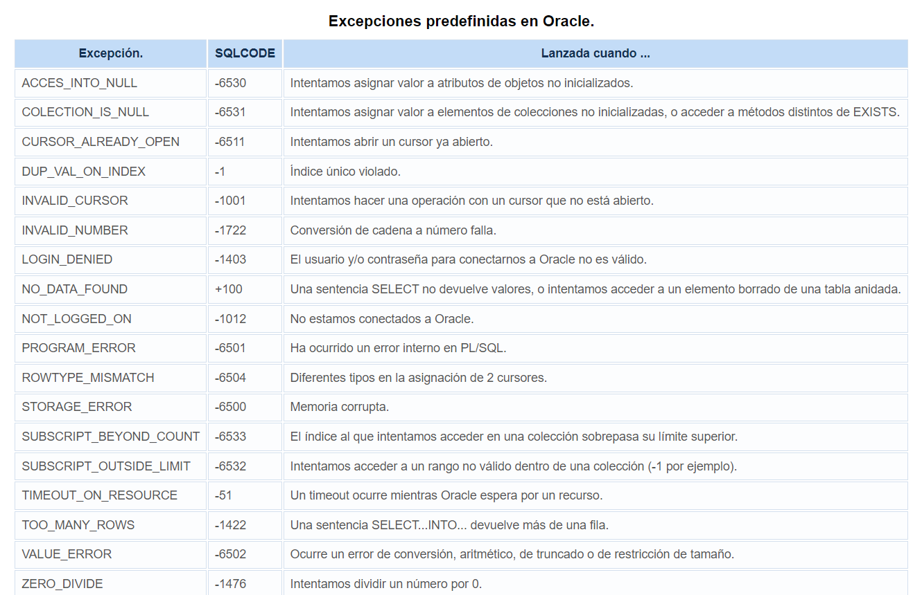
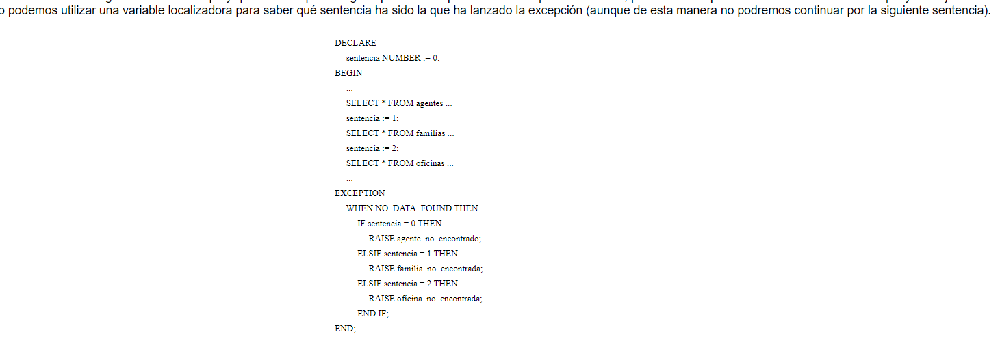
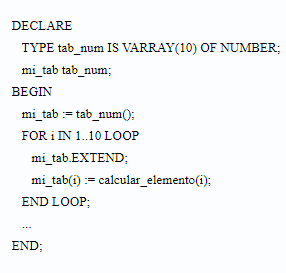
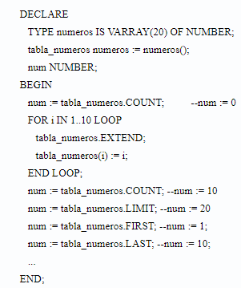
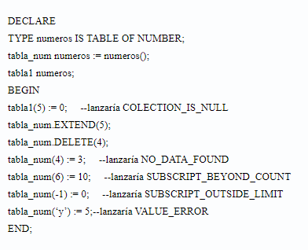
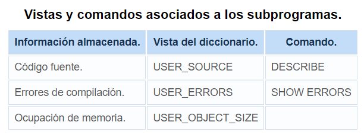
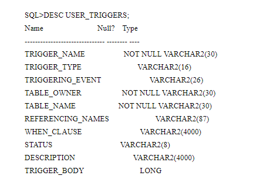

## 1. Introducción

**PL/SQL** es un lenguaje procedimental estructurado en bloques que permite utilizar sentencias SQL para manipular datos y sentencias de control de flujo para procesar los datos. Combina la potencia de SQL para manipular datos, con la potencia de los lenguajes procedimentales para procesarlos.

Fue ideado por Oracle (podemos probarlo en la aplicación gráfica Oracle 11g o con SQL Developer), aunque todos los gestores de bases de datos utilizan un lenguaje procedimental parecido hoy día.  (Procedimientos almacenados en MySQL o PL/pgSQL en PostgreSQL)

El motor PL/SQL acepta como entrada bloques PL/SQL o subprogramas -> ejecuta sentencias procedimentales -> envía sentencias SQL al servidor de bases de datos.

PL/SQL permite mejor rendimiento en entornos red cliente-servidor porque permite mandar bloques PL/SQL desde el cliente al servidor a través de la red, sin tener que mandar una  a una las sentencias correspondientes. 

https://docs.oracle.com/en/database/oracle/oracle-database/19/sqlrf/CREATE-SEQUENCE.html

## 2. Conceptos básicos
### 2.1. Variables y constantes

Declaración de variable:  Nombre de la variable, tipo de dato y opcionalmente una asignación (con el operador `:=`  o con `DEFAULT`).
Declaración de constante: Igual que una variable, anteponiendo la palabra constant al tipo de dato.
Puede forzarse que no sea nula indicando `NOT NULL` y, si no se le asigna valor lanzará error en tiempo de ejecución `VALUE_ERROR`

```sql
id SMALLINT;
hoy DATE := sysdate;
hoy DATE DEFAULT sysdate;
pi CONSTANT REAL := 3.1415;
id SMALLINT NOT NULL := 9999; -- ¿Ves? La tengo que inicializar
```

**Conversión de tipos**
- Conversión implícita. En tipos parecidos se puede hacer. 
- Conversión explícita. Es la recomendada para evitar errores inesperados. Con funciones de conversión como `TO_CHAR`, `TO_DATE`, `TO_NUMBER`

**Precedencia de operadores**: La habitual del lenguaje matemático (Exponenciación, negación lógica; Identidad, negación; Multiplicación, división; Suma, resta, concatenación; Comparaciones; Conjunción lógica; Disyunción lógica)

### 2.2. Unidades léxicas

- Elementos más pequeños con sentido propio** y que **al combinarlos siguiendo las reglas de sintaxis dan lugar a sentencias válidas** sintácticamente.
- Es no sensible a mayúsculas (es equivalente, salvo en literales cadena o carácter)
- Cada unidad léxica puede separarse por espacios, saltos de líneas o tabuladores.

Las unidades léxicas pueden ser:
- **Delimitadores**


- **Identificadores**
Usados para nombres elementos. Es una letra seguida opcionalmente de letras, números `$ _ #`
No pueden usarse palabras reservadas.
Nos permite definir identificadores acotados en los que se puede usar cualquier carácter (longitud máxima 30 caracteres).
Hay identificadores predefinidos que son palabras reservadas y no se pueden usar
Algunas palabras reservadas en PL/SQL no lo son para SQL  (ej. type lo está.  Habría que usarlo en PL/SQL como "type" si una columna se llama así)
- Literales
Notación decimal o exponencial en literales numércios
Tipos carácter y cadena delimitados por comillas
Literales lógicos TRUE y FALSE
Literal NULL expresa una variable sin valor
- Comentarios
Igual que en SQL  Una línea ' --'  o Varias `/* */`

### 2.3. Tipos de datos simples y subtipos

**Numéricos**
- **BINARY_INTEGER**: Subtipos NATURAL, NATURALN, POSITIVE, POSITIVEN, SIGNTYPE
- **NUMBER**: Almacena números racionales. Puede indicarse escala y precisión. Subtipos DEC, DECIMAL, DOUBLE PRECISION, FLOAT, INTEGER, INT, NUMERIC, REAL, SMALLINT
- **PLS_INTEGER**: Mismo rango que BINARY_INTEGER pero con representación distinta por lo que sus operaciones aritméticas serán más eficientes. 

**Alfanuméricos**
- **CHAR(n)**: Array de caracteres. Máximo 2000 bytes.
- **LONG**: Array de caracteres. Máximo 32760 bytes.
- **RAW**: Array de bytes. Máximo de 2000.
- **LONG RAW**: Array de bytes. Máximo 32760.
- **VARCHAR2**: Cadenas de longitud variable. Máximo 32760.

**Grandes objetos**
- **BFILE**: Puntero a fichero del sistema operativo.
- **BLOP**: Objeto binario 4 GB
- **CLOB**: Objeto carácter 2 GB.

**Otros**
- **BOOLEAN**: TRUE/FALSE
- **DATE**:  Del 1 de enero de 4712ac al 31 de diciembre de 4712dc

### 2.4. Subtipos

Se pueden definir **subtipos de tipos de datos** para darles un nombre diferente que aumente la legibilidad de los programas. Se les podrán aplicar las mismas operaciones que a los tipos originales.

Con `%TYPE` puede indicarse el tipo de dato de una variable (columna) de la base de datos.
Con `%ROWTYPE` puede indicarse el tipo de un cursor o tabla de una base de datos.

```sql
SUBTYPE id_familia IS familias.identificador%TYPE;
SUBTYPE agente IS agente%ROWTYPE;

-- Si queremos restringir un subtipo se puede usar una variable para que nos lo permita
SUBTYPE apodo IS varchar2(20); -- No se puede D:

aux VARCHAR2(20);
SUBTYPE apodo IS aux%TYPE; -- Sí se puede :) 
```

Los subtipos pueden intercambiarse con su tipo base o entre sí siempre que tengan el mismo tipo base o pertenezcan a la misma familia (si están relacionados de alguna manera y tienen similitudes en su comportamiento o estructura: Ej.: `literal` y `sentencia` como subtipos de `CHAR` y `VARCHAR2` que son tipos de datos de caracteres)

Ejemplo absurdo de los apuntes: 
```sql
DECLARE
	SUBTYPE numero IS NUMBER;
	numero_tres_digitos NUMBER(3);
	mi_numero_de_la_suerte numero;
	SUBTYPE encontrado IS BOOLEAN;
	SUBTYPE resultado IS BOOLEAN;
	lo_he_encontrado encontrado;
	resultado_busqueda resultado;
	SUBTYPE literal IS CHAR;
	SUBTYPE sentencia IS VARCHAR2;
	literal_nulo literal;
	sentencia_vacia sentencia;
BEGIN
	...
	numero_tres_digitos := mi_numero_de_la_suerte;
	...
	lo_he_encontrado := resultado_busqueda;
	..
	sentencia_vacia := literal_nulo;
```

## 3. Bloque PL/SQL: Estructuras de control y excepciones

El bloque PL/SQL tiene tres zonas:
- **Declaraciones**: `DECLARE` Definición de variables, constantes, cursores y excepciones
- **Proceso**: `BEGIN`  Contiene sentencias ejecutables
- **Excepciones**:  Manejo de errores en tiempo de ejecución

`BEGIN` y `END` son los obligatorios

```sql
[DECLARE]
	[declaraciones]
BEGIN
	[sentencias]
[EXCEPTION]
	[manejadores]
END;
```

```sql
DECLARE
     aux number := 10;
BEGIN
     DECLARE
          aux number := 5;          
     BEGIN
          ...
          IF aux = 10 THEN     --evalúa a FALSE, no entraría
          ...
     END;
END;
```

### 3.1. Estructuras de control condicionales

Van entre `IF`  y `END IF`

**Sentencia IF-THEN**
```sql
IF (b<>0) THEN
	c := a/b;
END IF;
```

**Sentencia IF-THEN-ELSE**
```sql
IF (b<>0) THEN
	c := a/b;
ELSE
	c := a+b;
END IF;
```

Sentencia **IF-THEN-ELSIF**
```sql
IF (b=0) THEN
	c := a/b;
ELSIF (b=1)
	c := a+b;
ELSE
	c := a+b+2;
END IF;
```

### 3.2. Estructuras de control iterativas

Van entre `LOOP` y `END LOOP`

Bucle infinito
```sql
	LOOP
		sentencias
	END LOOP;
```

While
```sql 
WHILE condicion LOOP
	sentencias
END LOOP;
```

For
```sql
FOR contador IN [REVERSE] limiteinferior..limitesuperior LOOP
	sentencias
END LOOP;
```

Exit
```sql
LOOP
	sentencias
	IF condicion THEN
		EXIT
	END IF
END LOOP;
```

Exit when

```sql
LOOP
	sentencias
	EXIT WHEN encontrado;
END LOOP;
```

----

(MariaDB) REPEAT
```sql
REPEAT
	secuencia
UNTIL condicion
END REPEAt
```
### 3.3. Excepciones

Hay excepciones predefinidas internamente o excepciones definidas por el usuario (en la parte de las declaraciones de cualquier bloque) con: `EXCEPTION;`
Y luego deben ser arrojadas con: `RAISE`
Y capturadas en el bloque de `EXCEPTION`

```sql
DECLARE
	mi_excepcion EXCEPTION;
BEGIN
	...
	IF loquesea THEN
		RAISE mi_exception
	ENDIF
	...
EXCEPTION
	WHEN mi_exception THEN
		haz cosas
END;
```

Si se redefine una excepción que ya es global prevalece la definición local frente a la global (y la global no podrá ser capturada a menos que el bloque en el que estaba definida fuese un bloque nombrado y pueda definirse con `nombre_bloque.nombre_excepcion`). Las excepciones predefinidas están definidas globalmente.

Para poder continuar por la sentencia que la lanzó... puede encerrarse la sentencia dentro de un bloque  y ahí capturar la excepción para seguir con la sentencia:
```sql
DECLARE
	declaraciones
BEGIN
	...
	BEGIN
		cosas
	EXCEPTION
		WHEN laexcepcionquesea THEN
			cosas
	END
	...
END;
```

Imagina que quieres intentar una transacción hasta que no te dé ningún error. En un bucle, se encapsula la transacción en un bloque y se capturan en él las posibles excepciones. 

```sql
DECLARE
     id_fam NUMBER;
     nombre VARCHAR2(40);
     oficina NUMBER;
BEGIN
     ...
     LOOP
          BEGIN
               SAVEPOINT inicio;
               INSERT INTO familias VALUES 
(id_fam, nombre, NULL, oficina);
               ...
               COMMIT;
               EXIT;
          EXCEPTION
               WHEN DUP_VAL_ON_INDEX THEN
                    ROLLBACK TO inicio;
                    id_fam := id_fam + 1;
          END;
     END LOOP;
     ...
END;
```



#### Propagación de excepciones



## 4. Tipos de datos compuestos

### 4.1. Registros

Registro: Grupo de elementos relacionados almacenados en campos, cada uno con su propio nombre y tipo de dato.
Se declara con `TYPE nombre_registro IS RECORD (declaracion_campo, declaracion_campo,...);`

Cualquier tipo de dato es válido para el registro salvo `REF CURSOR`. Para acceder a los campos se usa notación de punto.

```sql
TYPE direccion IS RECORD
(
calle          VARCHAR2(50),
numero          INTEGER(4) NOT NULL := 1
provincia     VARCHAR2(20),
pais          VARCHAR2(20) := ‘España’
);
mi_direccion direccion;

mi_direccion.calle := ‘Ramirez Arellano’;
mi_direccion.numero := 15;
```

Un registro solo puede asignarse a otro cuando sean del mismo tipo (no basta que tengan mismo número de campos y emparejar). 
No pueden compararse registros aunque sea del mismo tipo. 
No puede comprobarse si el registro es nulo.
Se puede hacer SELECT de registros, pero no INSERT. 

### 4.2. Colecciones: Arrays de longitud variable `VARRAY`

**Colecciones de elementos con límite superior fijo**. Al crearlos **indicamos su tamaño máximo y el array crecerá dinámicamente hasta alcanzar ese tamaño**. Su límite mínimo es 1 y su límite máximo es el tamaño máximo. 
Se declara como: `TYPE nombre IS {VARRAY | VARYING} (tamaño_maximo) OF tipo_elementos [NOT_NULL]`

- Si el tipo de elemento es un registro, todos los campos deben ser de tipo escalar.
- Al definir el `VARRAY` este es nulo. 
- Debe inicializarse con un constructor
```sql
TYPE familias_hijas IS VARRAY(100) OF familia;
familias_hijas1 familias_hijas := familias_hijas(familia(100, `Fam100`, 10, null)), ... , familia(105, 'Fam105', 10, null));
```
- Pueden usarse constructores vacíos `familias_hijas2 familias_hijas := familias_hijas();`

- Un array puede ser asignado a otro si ambos son del mismo tipo
- El VARRAY puede extenderse usando `EXTEND`. Sin parámetros se extiende en un elemento nulo el VARRAY. VARRAY(n) Con parámetros añade n elementos al VARRAY.  VARRAY(n,i) añade n copias del i-ésimo elemento. 
- `COUNT` dice el número de elementos del VARRAY
- `LIMIT` el número máximo del VARRAY
- `FIRST` siempre es 1
- `LAST` es COUNT
- `PRIOR` y `NEXT` devuelven antecesores y sucesores del elemento.
- Pueden saltar elecciones: `COLLECTION_IS_NULL`, `SUBSCRIPT_BEYOND_COUNT`, `SUBSCRIPT_OUTSIDE_LIMIT, `VALUE_ERROR`






### 4.3. Colecciones: Tablas anidadas

Son **colecciones de elementos sin límite superior fijo**. Aumentan dinámicamente su tamaño. Pueden borrarse elementos individuales.
Se declaran con `TYPE nombre IS TABLE OF tipo_elementos [NOT NULL]`

- Tienen las mismas restricciones que los VARRAY
- Automáticamente son nulas, deben inicializarse antes de usarse
- Puede usarse constructor nulo
- Para referenciar elementos se usa la misma sintaxis que los VARRAY
- Se usa `EXTEND` para extender la tabla.
- `LIMIT` no tiene sentido, devuelve `NULL`
- `EXITS(n)` devuelve si existe o si no (si fue borrado...)
- `TRIM` borra elemento del final de la tabla `TRIM(n)` borra n elementos del final. Opera internamente. Si se encuentra con un elemento borrado con `DELETE lo incluye para ser eliminado de la colección`
- `DELETE(n)` borra el n-esimo elemento. `DELENTE(n,m)` borra del n al m. (Devolvería FALSE al consultar con `EXITS(n))`




## 5. Cursores

El **cursor** es una estructura que almacena el conjunto de filas devuelto por una consulta a la base de datos.

Oracle usa áreas de trabajo para ejecutar sentencias SQL y almacenar la información procesada.

Distinguimos entre implícitos y explícitos. PL/SQL declara implícitamente un cursor para todas las sentencias SQL de manipulación de datos, incluyendo consultas que devuelven una fila de resultados. Para consultas que devuelven más de una fila se debe declarar explícitamente un cursor para procesarlas individualmente. 

#### Atributos del cursor
Permiten obtener información sobre las sentencias SQL recientemente ejecutadas. Pueden usarse en PL/SQL pero no en SQL. Pueden usarse en implícitos, aunque su sentido está en los explícitos.
- `%FOUND`: Cuando está abierto y, antes del primer `FETCH`, `%FOUND` devuelve NULL. Después del primer `FETCH` devuelve TRUE si el último FETCH devolvió una fila y FALSE en caso contrario. En implícitos, devuelve TRUE si un INSERT, UPDATE, SELECT, DELETE afectan o devuelven una o más filas. En caso contrario, devuelve FALSE. 
- `%NOTFOUND`:  Lo contrario a `%FOUND`
- `%ISOPEN`: Saber si está abierto. Cursores implícitos son cerrados por Oracle automáticamente.
- `%ROWCOUNT`: Cuando está abierto y, antes del primer  `FETCH`, `%ROWCOUNT` es 0. Después de cada FETCH, `%ROWCOUNT` se incrementa e indica el número de filas procesadas. En implícitos, número de filas afectadas o devueltas por INSERT, UPDATE, SELECT, DELETE. 

### 5.1. Cursores implícitos

Abierto implícitamente por Oracle para procesar sentencia SQL no asociada a un cursor declarado. No pueden usarse los comandos del cursor explicito. Sí pueden usarse los atributos del cursor.

```sql
DECLARE
	vNombre VARCHAR2(30);
	vFecha DATE;
	vEmpresa VARCHAR2(30);
BEGIN
	SELECT nombre, fechanac, empresa INTO vNombre, vFecha, vEmpresa
	FROM ASISTENTE WHERE CODIGO = 'AS0001';
	DBMS_OUTPUT.PUT_LINE(vNombre || ' - '  || vFecha || ' - ' || vEmpresa);
END;

-- Output: "Mario - 16/11/70 - BK Programación"
```

### 5.2. Cursores explícitos

Para recorrer una sentencia con varios resultados debemos introducirla en un cursor explícito que hayamos declarado.

El cursor se declara dándole un nombre y asociándolo con una consulta: `CURSOR nombre_cursor [(parametro...) RETURN tipo_devuelto] IS consulta_sql`

Ejemplos:
```sql
CURSOR cAgentes IS SELECT * FROM agentes;
CURSOR cFamilias RETURN familias%ROWTYPE IS SELECT * FROM familias WHERE...
```

- El cursor no puede tener restricción NOT NULL
- El cursor puede tomar parámetros, que pueden aparecer en la consulta como si fuesen constantes. 
`CURSOR c1 (cat INTEGER DEFAULT 0) IS SELECT * FROM agentes WHERE categoria = cat;`

- `OPEN`: Al abrir el cursor se ejecuta consulta asociada y se identifica el conjunto resultado que son todas las filas que emparejan con ese criterio de búsqueda.  `OPEN nombre_cursor`

- `FETCH`: Devuelve una fila del conjunto resultado. Tras cada FETCH avanza a la próxima fila.
`FETCH cFamilias INTO mi_id, mi_nom, mi_fam, mi_ofi;`
- Por cada valor de columna devuelto debe haber una variable que se corresponda después del `INTO`
- El cursor se procesa por medio de un bucle
- `CLOSE`: Al final del todo, el cursor debe cerrarse. Después podrá reabrirse. Si se intentan hacer operaciones con el cursor cerrado se lanza `INVALID_CURSOR`. 

```sql
DECLARE

CURSOR cAsistentes IS 
SELECT nombre, fechanac, empresa FROM ASISTENTE;

vNombre VARCHAR2(30);
vFecha DATE;
vEmpresa VARCHAR2(30);

BEGIN

OPEN cAsistentes; -- abro cursor
FETCH cAsistentes INTO vNombre, vFecha, vEmpresa; -- Cojo 1 y meto en variables

WHILE cAsistentes%FOUND LOOP -- Mientras hatya registros
	DBMS_OUTPUT.PUT_LINE(vNombre || ' - '  || vFecha || ' - ' || vEmpresa);
	FETCH cAsistentes INTO vNombre, vFecha, vEmpresa; -- Cojo siguiente
END LOOP;

END;

/* Output: 
Mario - 16/11/70 - BK Programación
María - 12/01/94 - 
*/

```

Puedo crear si quiero una única variable que sea de tipo cAsistentes (así no tengo que definir una a una).  (Bucles para cursores)

```sql
DECLARE

CURSOR cAsistentes IS 
SELECT nombre, fechanac, empresa FROM ASISTENTE;

vMiReg cAsistentes%ROWTYPE; -- Registro que incluye las variables del cursor

BEGIN

OPEN cAsistentes; -- abro cursor
FETCH cAsistentes INTO vMiReg; -- Cojo 1 y meto en variables

WHILE cAsistentes%FOUND LOOP -- Mientras hatya registros
	DBMS_OUTPUT.PUT_LINE(vMiReg.nombre || ' - '  || vMiReg.fechanac || ' - ' || vMiReg.empresa);
	FETCH cAsistentes INTO vMiReg; -- Cojo siguiente
END LOOP;

END;

/* Output: 
Mario - 16/11/70 - BK Programación
María - 12/01/94 - 
*/

```

```sql
BEGIN
     ...
     FOR cFamilias_rec IN cFamilias LOOP
          --Procesamos las filas accediendo a 
          --cFamilias_rec.identificador, cFamilias_rec.nombre,
          --cFamilias_rec.familia, ...
     END LOOP;
     ...
END;
```


### 5.3.  Cursores variables

- Son punteros a cursores
- Pueden usarse para referirse a cualquier tipo de consulta (dinámicos; los otros serían estáticos)

1. Se debe definir un tipo `REF CURSOR` y declarar una variable de ese tipo.

```sql
TYPE tipo_cursor IS REF CURSOR RETURN agentes%ROWTYPE;
cAgentes tipo_cursor;
```

2.  Después de definir el cursor variable debe asociarse a una consulta (dinámicamente en la parte de ejecución) con la sentencia `OPEN - FOR` 
```sql
OPEN nombre_variable_cursor FOR sentencia_select;
OPEN cAgentes FOR SELECT * FROM agentes WHERE oficina = 1;
```

- El cursor variable no puede tomar parámetros
- Pueden usarse los atributos de los cursores
- Se pueden usar varios OPEN-FOR para diferentes consultas. No necesita cerrarse antes de reabrirse; al abrir cursor variable para consulta diferente, la consulta previa se pierde. 
- Tras su apertura es como un cursor normal.

```sql
DECLARE
TYPE cursor_Agentes IS REF CURSOR RETURN agentes%ROWTYPE;
cAgentes cursor_Agentes;
agente cAgentes%ROWTYPE;
BEGIN
...
OPEN cAgentes FOR SELECT * FROM agentes WHERE oficina = 1;
LOOP
     FETCH cAgentes INTO agente;
     EXIT WHEN cAgentes%NOTFOUND;
     ...
END LOOP;
CLOSE cAgentes;
...
END;
```

## 6. Abstracción en PL/SQL

### 6.1. Subprogramas

Los subprogramas pueden definirse al final de la parte declarativa de cualquier bloque. (Cualquier identificador, como es el caso de los subprogramas, debe definirse antes de usarse).

Para subprogramas en orden debe usarse la definición hacia adelante, para evitar errores de compilación. (Los que se usen por el subprograma y luego el subprograma, etc. )

Dentro de los subprogramas tenemos FUNCIONES (devuelven un valor) y PROCEDIMIENTOS (no devuelven un valor).

Una función se declara como:
```sql
FUNCTION nombre [parametros]
RETURN tipo_dato IS
[declaraciones locales]
BEGIN
sentencias
[EXCEPTION
manejadores]
END [nombre];
```

Un procedimiento se declara como:
```sql
PROCEDURE nombre [parametros] IS
[declaraciones locales]
BEGIN
sentencias
[EXCEPTION
manejadores]
END [nombre];
```

Como es obvio:
- No puede imponerse NOT NULL a los parámetros
- No pueden especificarse RESTRICCIONES
- La función debe acabar con la sentencia RETURN

- Se pueden **sobrecargar** funciones o procedimientos (llamar con el mismo nombre a subprogramas con el mismo cometido y distinto número y/o tipo de parámetros). No puede sobrecargarse programas que acepten el mismo número y tipo de parámetros. Tampoco subprogramas con mismo número y tipos diferentes pero de la misma familia o subtipos basados en la misma familia. 

- Se puede aplicar **recursividad** (método que se llama a sí mismo)

#### 6.1.1 Almacenar subprogramas en base de datos

Los subprogramas se almacenan en base de datos usando la misma sintaxis con la que se crean pero anteponiendo `CREATE` o `CREATE OR REPLACE` a `PROCEDURE` o a `FUNCTION` y finalizando el subprograma con una línea que contenga el caracter "/" para indicar que termina ahí. 

El subprograma se invoca mencionándolo. 
Si se quiere invocar desde SQL\*Plus se usa sintaxis 
```sql
EXECUTE nombre_procedimiento [(parametros)]
EXECUTE :variable_sql := nombre_funcion [(parametros)]
```

Si hay algún error en el programa almacenado en base de datos se sabrá porque este es compilado antes. Se informará de los mismos y debe corregirse con la clausula OR REPLACE antes de poder ser utilizado. 

Hay algunas vistas del diccionario de datos que ayudan a ver su código y los errores. También hay algunos comandos:



Con la vista **USER_OBJECTS** se puede obtener el nombre de todos los subprogramas almacenados.
#### 6.1.2 Parámetros de subprogramas

**Parámetros actuales**: Son las variables pasadas como parámetros a un subprograma
**Parámetros formales**: Son las variables referenciadas en la especificación del subprograma como parámetros.

Al llamar a un subprograma los parámetros actuales pueden pasarse (asociación entre parámetros actuales y formales) con notación posicional o nombrada.

Notación posicional: Primer parámetro formal, segundo con el segundo y así el resto
Notación nombrada: Operador (=>) para asociar el parámetro actual al parámetro formal. También puede usarse notación mixta.

Parámetros pueden ser de entrada, salida o de entrada/salida. Si no se especifica el modo será de entrada. 
Si el parámetro es de salida o entrada/salida, este debe ser una variable.

- **Parámetro de entrada**: Para pasarle valores al subprograma. No puede ser modificado en el cuerpo. Puede ser constante o variable. Pueden inicializarse a un valor por defecto (puede invocarse en ese caso el subprograma prescindiendo del parámetro o pasándoselo y sobreescribiendo dicho valor).
- **Parámetro de salida**: Para devolver valores. Dentro del subprograma es como una variable no inicializada. Siempre debe ser una variable.
- **Parámetro de entrada/salida**. Para pasarle y devolver valores. Siempre debe ser una variable. 

Para prescindir de parámetro entre medias de otros, debemos usar notación nombrada o si los parámetros restantes tienen valor por defecto, omitirlos todos.

##### Notación mixta

```sql
DECLARE
     PROCEDURE prueba( formal1 NUMBER, formal2 VARCHAR2) IS
     BEGIN
          ...
     END;
     actual1 NUMBER;
     actual2 VARCHAR2;
BEGIN
     ...
     prueba(actual1, actual2);               --posicional
     prueba(formal2=>actual2,formal1=>actual1);     --nombrada
     prueba(actual1, formal2=>actual2);          --mixta
END;
```

##### Parámetros de entrada

```sql
FUNCTION categoria( id_agente IN NUMBER ) 
RETURN NUMBER IS
     cat NUMBER;
BEGIN
     ...
     SELECT categoria INTO cat FROM agentes 
WHERE identificador = id_agente;
RETURN cat;
EXCEPTION
     WHEN NO_DATA_FOUND THEN
          id_agente := -1; --ilegal, parámetro de entrada
END;
```
##### Parámetros de salida

```sql
PROCEDURE nombre( id_agente NUMBER, nombre OUT VARCHAR2) IS
BEGIN
     IF (nombre = 'LUIS') THEN     --error de sintaxis
     END IF;
     ...
END;
```

### 6.1.3. Ejemplillos de subprogramas
```sql
CREATE OR REPLACE PROCEDURE ListadoAsistentes(pEmpresa VARCHAR2)
AS 
CURSOR cursorAsistentes IS select nombre, apellido1, apellido2 from asistente where empresa = pEmpresa;
vRegistro cursorAsistentes%ROWTYPE;
BEGIN -- Con cursor explícito
OPEN cursorAsistentes;
FETCH cursorAsistentes INTO vRegistro;
WHILE cursorAsistentes%FOUND LOOP
	dbms_output.put_line(vRegistro.nombre || ' - ' || vRegistro.apellido1 || ' - ' || vRegistro.apellido2);
	FETCH cursorAsistentes INTO vRegistro;
END LOOP;
CLOSE cursorAsistentes; -- No lo dejes abierto!!
END ListaAsistentes;
```

```
begin
listadoasistentes('BigSoft');
end;
```

Luego ya le damos al PLAY (introducimos el parámetro) y hace lo que le pedimos.

```sql
CREATE OR REPLACE FUNCTION CantAsistentesConfe(pRefConfe VARCHAR2)
RETURN NUMBER
AS
vCantidad NUMBER;

BEGIN -- Con cursor implícito
SELECT COUNT(A.CODASISTENTE) INTO vCantidad
FROM CONFERENCIA C, ASISTIR A
WHERE C.REFERENCIA = A.REFCONFERENCIA
AND C.REFERENCIA=pRefConfe;
RETURN vCantidad;
END CantAsistentesConfe;
```

```
begin
CantAsistentesconfe('SEG1314');
end;
```

## 6.2. Paquetes

Los **paquetes** agrupan tipos, elementos y subprogramas. Tienen dos partes:
- Especificación: Declaramos interfaz.
- Cuerpo (a veces este no es necesario): Se implementa.

El paquete se declara con la sintaxis
```sql
CREATE [OR REPLACE] PACKAGE nombre AS
 [declaraciones públicas especificaciones de subprogramas]
END;
CREATE [OR REPLACE] PACKAGE BODY nombre AS
 [declaraciones privadas y cuerpo]
[BEGIN
	sentencias de inicializacion]
END [nombre]
```

La inicialización solo se ejecuta la primera vez que se referencia el paquete. 
Las partes visibles del paquete se referencian con notación de punto (`call_center.borra_agente(10)`)

### Paquete DBMS_Output 

Paquete público con el que pueden enviarse mensajes desde subprogramas almacenados, paquetes y disparadores.

SQL\*Plus permite visualizar los mensajes que hay en el buffer por medio del comando SET SERVEROUTPUT ON. Puede usarse para depurar subprogramas.

El paquete ofrece:
- **ENABLE**. Habilitar llamadas a los otros subprogramas. No es necesario con SERVEROUTPUT activado. Se puede pasar parámetro del tamaño del buffer.
```sql
ENABLE
ENABLE(buffer_size IN INTEGER DEFAULT 2000);
```

- **DISABLE**. Deshabilita llamadas a subprogramas y purga el buffer. Tampoco es necesario si usamos la opción SERVEROUTPUT
```sql
DISABLE
DISABLE();
```

- **PUT**. Coloca elementos en el buffer, convirtiéndolos a VARCHAR2
```sql
PUT
PUT(item IN NUMBER);
PUT(item IN VARCHAR2);
PUT(item IN DATE);
```

- ***PUT_LINE***. Coloca elementos en el buffer y los termina con salto de línea.
```sql
PUT_LINE
PUT_LINE(item IN NUMBER);
PUT_LINE(item IN VARCHAR2);
PUT_LINE(item IN DATE);
```

- **NEW_LINE**. Coloca salto de línea en el buffer.
```sql
NEW_LINE
NEW_LINE();
```

- **GET_LINE**. Lee línea del buffer colocandola en el parámetro line y obviando el salto de línea. Devuelve 0 en status si ha traído alguna línea y 1 en caso contrario.
```sql
GET_LINE
GET_LINE(line OUT VARCHAR2, status OUT VARCHAR2);
```

- **GET_LINES**. Lee las líneas contenidas en numlines. Una vez ejecutado, numlines contiene el número de líneas que se ha traído. Las coloca en CHARARR, definido el paquete DBMS_OUTPUT como una tabla VARCHAR2(255);
```sql
GET_LINES
GET_LINES(lines OUT CHARARR, numlines IN OUT INTEGER);
```
## 6.3. Objetos

Tipo de objeto: Tipo de dato compuesto que encapsula datos y funciones y procedimientos para manejar esos datos. 

- Las variables son atributos; Los subprogramas métodos. 

- Tipos de objetos tienen: Especificación (declara atributos y métodos en ese orden; interfaz) y cuerpo (implementa la especificación).
- Todos los atributos son públicos.
- No pueden declararse atributos en el cuerpo, aunque sí declarar subprogramas locales que serán visibles en el cuerpo. 


- No puede inicializarse un atributo en la declaración. Tampoco imponer NOT NULL.

El **método** es subprograma declarado en la especificación del tipo de objeto por medio de **MEMBER**. No puede llamarse igual que el tipo de objeto o que un atributo. Para cada método en la especificación debe haber un método implementando el cuerpo con la misma cabecera.

Los métodos en un tipo de objeto aceptan como primer parámetro una instancia de su tipo (parámetro **SELF**) y siempre está accesible a un método.
Si lo declaramos explícitamente debe ser el primer parámetro con el nombre SELF y el tipo del tipo de objeto.
Si SELF no está declarado explícitamente por defecto será IN para funciones e IN OUT para procedimientos.

Los métodos pueden sobrecargarse. Pero no si solo difieren en el modo o pertenecen a la misma familia. Tampoco si solo difiere en el tipo devuelto. 

El objeto sigue las reglas y visibilidad que cualquier otra variable.
Cuando no se declara es automáticamente NULL. Deja de ser nulo al inicializarse o al asignarle otro. Si se intenta acceder a los atributos de NULL sale la excepción **ACCESS_INTO_NULL**
Los objetos tienen constructores por defecto con el mismo nombre que el tipo de objeto y que aceptan tantos parámetros como atributos del tipo de objeto y con el mismo tipo. 

Un tipo de objeto puede tener a otro entre sus atributos. Este tipo debe ser conocido por Oracle. Si son mutuamente dependientes puede usarse declaración hacia adelante.

#### Ejemplito
```sql
CREATE OBJECT Oficina;     --Definición hacia delante
CREATE OBJECT Familia AS OBJECT (
     identificador     NUMBER,
     nombre          VARCHAR2(20),
     familia_     Familia,
     oficina_     Oficina,
     ...
);
CREATE OBJECT Agente AS OBJECT (
     identificador     NUMBER,
     nombre          VARCHAR2(20),
     familia_     Familia,
     oficina_     Oficina,
     ...
);
CREATE OBJECT Oficina AS OBJECT (
     identificador     NUMBER,
     nombre          VARCHAR2(20),
     jefe          Agente,
     ...
);
```

### 6.3.1. Funciones mapa y de orden

Los tipos de objetos no tienen orden predefinido por lo que no pueden ser comparados ni ordenados. 
Puede definirse el orden que seguirá el tipo de objeto por las funciones mapa y de orden.

**Función miembro mapa**: Función sin parámetros que devuelve un tipo de dato: DATE, NUMBER, VARCHAR2 y es similar a función hash. Se define anteponiendo la palabra MAP y solo puede haber una para cada tipo de objeto.

**Función miembro de orden**: Función que acepta parámetro del mismo tipo del tipo de objeto y devuelve número negativo si el objeto pasado es menor, cero si son iguales y positivo si es mayor. Anteponiendo la palabra ORDEN. 

```sql
CREATE TYPE Familia AS OBJECT (
identificador      NUMBER,
nombre           VARCHAR2(20),
familia_          NUMBER,
oficina_          NUMBER,
MAP MEMBER FUNCTION orden RETURN NUMBER,
...
);
     
CREATE TYPE BODY Familia AS
MAP MEMBER FUNCTION orden RETURN NUMBER IS
BEGIN
     RETURN identificador;
END;
...
END;

CREATE TYPE Oficina AS OBJECT (
     identificador          NUMBER,
     nombre               VARCHAR2(20),
     ...
     ORDER MEMBER FUNCTION igual ( ofi Oficina ) RETURN INTEGER,
     ...
);
     
CREATE TYPE BODY Oficina AS
     ORDER MEMBER FUNCTION igual ( ofi Oficina ) RETURN INTEGER IS
     BEGIN
          IF (identificador < ofi.identificador) THEN
               RETURN –1;
          ELSIF (identificador = ofi.identificador) THEN
               RETURN 0;
          ELSE
               RETURN 1;
          END IF;
     END;
     ...
END;
```


## 6.4. Disparadores (Triggers)

Un **disparador** es un procedimiento ejecutado cuando se realiza una sentencia de manipulación de datos sobre una tabla dada y bajo unas circunstancias establecidas a la hora de definirlo.
Usos: Auditorías, integridad, generación de valores... 
No deberían: Duplicar funcionalidades de Oracle, deben limitarse y ser codificados por medio de subprogramas que se llamen desde el disparador, debe cuidarse los disparadores recursivos.

Clasificación
- Si va a hacerse antes o después (Disparadores BEFORE y disparadores AFTER)
- Si va a lanzarse una vez por sentencia o una vez por fila (Disparadores de sentencia y disparadores de fila)
- Si va a lanzarse al insertar, actualizar, borrar (Disparadores INSERT, UPDATE, DELETE o mezclados)

**La sintaxis es:**

```sql
CREATE [OR REPLACE] TRIGGER nombre 
momento acontecimiento ON tabla
[[REFERENCING (old AS alias_old|new AS alias_new) 
FOR EACH ROW 
[WHEN condicion]]
bloque_PL/SQL;
```

nombre: Se indica el nombre del disparador.
momento: Se indica cuándo será lanzado el disparador (BEFORE o AFTER)
acontecimiento: Acción que provoca el lanzamiento del disparador (INSERT UPDATE DELETE)
REFERENCING Y WHEN solo con algunos disparadores 
- REFERENCING: Asignar alias a valores NEW y/o OLD de las filas afectadas por la operación
- WHEN: Que solo sea disparado cuando sea verdadera una condición evaluada para cada fila afectada

En los disparadores de fila pueden accederse a valores antiguos y nuevos con `:old` y `:new`.
Si el disparador se lanza al insertar el valor antiguo no tiene sentido; el nuevo es la que se inserrta.
Si lanza al actualizar los dos tienen sentido
Si se lanza al borrar solo tiene sentido el valor antiguo.

En el cuerpo del disparador puede accederse a predicados que indican qué tipo de operación se lleva a cabo: INSERTING, UPDATING, DELETING.

El disparador de fila no puede acceder a tabla asociada. Esa tabla está mutando.
Si el disparador es lanzado en cascada por otro disparador ,no puede acceder a ninguna de las tablas asociadas y así recursivamente. 

```sql
CREATE TRIGGER prueba BEFORE UPDATE ON agentes
FOR EACH ROW
BEGIN
     ...
     SELECT identificador FROM agentes WHERE ...     
/*devolvería el error ORA-04091: table AGENTES is mutating, trigger/function may not see it*/
     ...
END;
/
```

Si tenemos varios tipos de disparadores sobre una misma tabla, el orden de ejecución será:

- Triggers before de sentencia.
- Triggers before de fila.
- Triggers after de fila.
- Triggers after de sentencia.

Existe vista del diccionario de datos con información sobre los disparadores: `USER_TRIGGERS`



#### Ejemplitos

```sql
/*Cuando asistente se inscriba en tabla ASISTIR, que se actualice el campo RECAUDACIÓN de la tabla CONFERENCIAS con la suma*/
CREATE OR REPLACE TRIGGER actualizaRecaudacion
AFTER INSERT ON asistir
FOR EACH ROW
BEGIN
	UPDATE conferencia SET recaudacion = recaudacion + precio
	WHERE referencia = :NEW.refconferencia;
END actualizaRecaudacion;
```

```sql
/*Almacenar en auditoría los movimientos de otras tablas*/
CREATE OR REPLACE TRIGGER auditarGratificacion
AFTER UPDATE ON participar
FOR EACH ROW
DECLARE
	usuario VARCHAR2(20);
BEGIN
	SELECT SYS_CONTEXT('userenv', 'current_user') INTO usuario FROM dual;
	INSERT INTO autoria_gratificacion
	VALUES (usuario, sysdate, :OLD.codponente, :OLD.refconferencia, :NEW.geatificacion, :NEW.gratificacion);
END auditarGratificacion;
```

```sql
/*Como un agente debe pertenecer a una familia o una oficina pero no puede pertenecer a una familia y a una oficina a la vez, deberemos implementar un disparador para llevar a cabo esta restricción que Oracle no nos permite definir.*/
CREATE OR REPLACE TRIGGER integridad_agentes
BEFORE INSERT OR UPDATE ON agentes
FOR EACH ROW
BEGIN
     IF (:new.familia IS NULL and :new.oficina IS NULL) THEN
          RAISE_APPLICATION_ERROR(-20201, 'Un agente no puede ser huérfano');
     ELSIF (:new.familia IS NOT NULL and :new.oficina IS NOT NULL) THEN
          RAISE_APPLICATION_ERROR(-20202, 'Un agente no puede tener dos padres');
     END IF;
END;
```

```sql
/*Actualizar secuencial*/
create or replace TRIGGER "operacionTrigger" BEFORE INSERT ON OPERACION
FOR EACH ROW 
BEGIN
  <<COLUMN_SEQUENCES>>
  BEGIN
    IF :NEW.ID IS NULL THEN
      SELECT OPERACION_SEQUENCE.NEXTVAL INTO :NEW.ID FROM DUAL;
    END IF;
  END COLUMN_SEQUENCES;
END;
```

<<COLUMN_SEQUENCES>> actúa como un marcador o etiqueta que indica dónde comienza y termina un bloque de código dentro del trigger relacionado con la generación secuencial de valores para la columna ID.


## 6.5. Temporizadores

Un temporizador es un objeto que inicia la ejecución de un programa en momentos determinados por el creador del temporizador. Los hay de dos tipos:
• De un solo disparo (oneshot). Se programan para un momento determinado en el futuro.
Cuando llega ese instante se disparan y se eliminan.  
• De disparo recurrente (periodical). Se programan para que se disparen a intervalos definidos.
Después de cada disparo el temporizador se rearma, espera el intervalo y se vuelve a disparar.
Esto se realiza continuamente hasta que se eliminan manualmente.

(MariaDB)
```sql
CREATE EVENT nombre ON SCHEDULE tiempo [ON COMPLETION PRESERVE]
[activacion] DO sentencia;

CREATE EVENT limpia_cuentas_2018 ON SCHEDULE AT '2018-01-01
00:00:00' DO DELETE FROM usuarios WHERE ultimoAcceso < '2017-06-30
23:59:59';
DROP EVENT IF EXISTS limpia_cuentas_2018;
ALTER EVENT limpia_cuentas_mensual ENABLE;
```

## 6.6.Interfaces de programación de aplicaciones para lenguajes externos

Las primeras APIs para acceder a bases de datos Oracle fueron proporcionadas por Oracle: Pro\*C (el más usado por la popularidad de C, C++), Pro\*Fortran y Pro\*Cobol. Permitían embeber llamadas a BBDD en el programa y al compilarlo debía pasarse el precompilador adecuado que trasladaba esas llamadas embebidas en llamadas a  una librería usada en tiempo de ejecución. 

Después... JDBC (Java Database Connectivity), Java DB, Java Data Objects (JDO).
Open Database Connectivity (ODBC).


