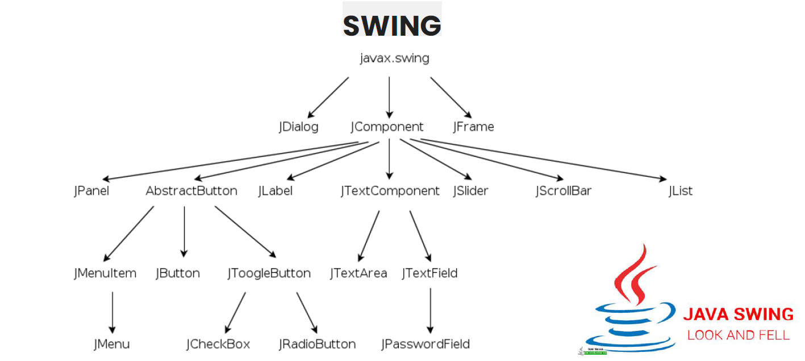

## 0. Entornos de desarrollo integrados (IDEs)

Para confeccionar interfaces se utilizan los IDE (Entornos de desarrollo integrados). Estos se caracterizan por permitir la codificación, compilación, depuración y testeo de los diferentes programas.

Así es una solución software que incluye:
- Editor de código
- Compilador
- Depurador
- Constructor de interfaz

### Visual Studio

Creado por Microsoft. El núcleo del desarrollo de esta empresa se da alrededor de esta solución. 
Existen versiones baja licencia y versiones gratuitas con menos funcionalidades. 

- **Creación de un proyecto**
- **Área de trabajo** 
- **Explorador de soluciones**:  Permite visualizar de forma jerárquica los diferentes archivos que forman el proyecto. 
- **Ventana de propiedades**: Según el elemento que seleccione el usuario, esta se divide en dos vistas principales: la vista de propiedades (para configurar la apariencia del elemento) y vista de eventos (para configurar el comportamiento del elemento).
- **Menú**: Diferenciable entre las opciones del trabajo desarrollado en el sistema de archivos (Menú Archivo) y la configuración del proyecto (Menú Proyecto).
	- Menú Archivo. Permite generar y gestionar nuevos proyectos.
	- Menú Proyecto. Permite gestionar los repositorios de control de versiones. Además, un archivo de solución (.sln) permite agrupar un conjunto de proyectos para realizar operaciones comunes como la compilación. 

**Ventajas**: Para todas las plataformas; gratuito; libertad de copia, modificación y mejora; el usuario no depende del autor del software
**Inconvenientes**: Interfaces menos amigables, menor compatibilidad con el hardware

### NetBeans

Creado por Sun MicroSystems. Es libre y gratuita. Desarrollada en Java (multiplataforma), con posibilidad de codificación de programas en otros lenguajes (XML, HTML, PHP, Javascript, JavaDoc, Groovy, JSP)

- Creación de un proyecto: Con File > New project. Posee un listado de plantillas de proyectos ordenadas por categorías. 
- Área de trabajo: En ella se diferencia entre
	- Panel de estructura de los archivos creados en el proyecto, organizados en paquetes
	- Panel de métodos y propiedades de la clase seleccionada
	- Zona de área principal de trabajo para modificar el código o la interfaz gráfica elegida.
	- Menú principal junto con la barra de herramientas.

Asimismo, los elementos con interfaz tienen ventanas adicionales de las que se puede destacar la **paleta de objetos** (Swing Controls, Swing Containers, Swing Menus,...) y la **paleta de propìedades del objeto** de la librería Java Swing que se selecciona.

La paleta de propiedades se divide en las pestañas:
- _Properties_ (Propiedades): Propiedades del elemento, con posibilidad de modificarlas
- _Binding_ (Enlace): Configurar las fuentes de datos que necesitan las propiedades del elemento
- _Events_ (Eventos): Eventos del objeto definidos para su control, definiendo un tipo de manejador para los eventos seleccionados. 
- _Code_ (Código): Permite asignar especificadores (variable, modificadores de acceso) dentro del código para el elemento seleccionado. 

### Eclipse

Desarrollado en Java. Permite incluir funcionalidades adicionales y soportar otros lenguajes y diferentes tipos de proyectos a través de extensiones (plugins). De código abierto. 

Tiene un área de trabajo donde:
- se pueden combinar los archivos organizados jerárquicamente
- tiene un editor en el área central para el proceso de codificación o el diseño de interfaces WYSWYG

**Creación de un proyecto**:Asistente para la creación. Con plantillas para Java y para crear proyectos en Javascript, HTML, PHP...

**Área de trabajo:** Permite tener abiertos diferentes editores organizados en ventanas para cambiar de forma dinámica la vista del área de trabajo. Visualizar tanto la interfaz generada como el código.  Personalizable de forma sencilla por el usuario. 

**Explorador de paquetes:** (Workspace) En el espacio de trabajo se organizan los datos de un proyecto determinado y su metainformación. Dentro del proyecto, permite mostrar de forma ordenada sus partes, divididas en paquetes. 

(NetBeans y Eclipse)
**Ventajas**: Compatibilidad con el hardware; Facilidad de instalación; Interfaces gráficas mejor diseñadas

**Inconvenientes**: Desarrollado para Windows, no puede ser modificado por el usuario final al no ser código libre, coste de aplicaciones mayor, soporte exclusivo del propietario. 

## 1. Librerías de componentes disponibles para los distintos sistemas operativos y lenguajes de programación. Características.

### AWT (Abstract Window Toolkit)

- Actualmente obsoleta. 
- Primera generación de librerías.
- Diseñada en Java
- Base de la librería Swing
- Diseño práctico y eficiente; pero no cuenta con controles muy avanzados
- Varía su aspecto según el sistema operativo

### Swing

- Herramienta de interfaces gráficas de usuario (GUI)
- Segunda generación de librerías
- Diseñada en Java puro, a partir de AWT (Kit de GUI antiguo que sí depende de la plataforma)
- Buscaba solucionar los problemas de AWT; tiene controles de bastantes funcionalidades
- En Java 5 y Java 6 se convierte en framework de desarrollo de interfaces para nuevas aplicaciones. 
- Tiene carencias como el filtrado y organización de datos en controles como tipo tabla y árbol (necesita hacerse manualmente)

**Ventajas**:
- Permite dibujar sus propios componentes
- Diseño en Java puro tiene menos limitaciones de plataforma
- Desarrollo de componentes Swing es más activo
- Soportan más características

**Inconvenientes**:
- Componentes son más lentos
- Su aspecto varía. No siempre tienen el mismo que en el sistema en el que se diseñaron. 

### SWT (Standard Widget Toolkit)

- Creada por IBM para Eclipse, mejorando la versión de Swing de ese momento
- Tercera generación de librerías, aunque no está muy relacionada con AWT y Swing.
- Librería de bajo nivel que usa widgets nativos de la plataforma que ejecuta con JNI (Java Native Interface)
- No puede ejecutarse en todas las plataformas
- La API de la librería es complicada de usar y no muy intuitiva

### SwingX

- Basada en Swing para desarrollar aplicaciones RIA (Rich Internet Application: Aplicación web que tiene la mayoría de las características de las aplicaciones de escritorio tradicionales. Usan un navegador web y por medio de complementos o mediante máquina virtual se agregan las características adicionales)
- En Java. Gran parte de sus componentes se desarrollan sobre Swing.
- Multiplataforma
### JavaFX

 - Desarrollada por Java (Oracle). Open source
 - Multiplataforma. Basada en desarrollo de aplicaciones RIA.
 - Agrupa tecnologías como JavaFX Mobile y JavaFX Script

### Otras
#### Apache Pivot

- De código abierto. Usada en Apache Project
- Desarrollo de aplicaciones RIA
- Basada en Java y otros lenguajes de la JVM

#### Qt Jambi

- Desarrollado en C++/C
- Empaquetado para Java sobre la librería Qt. Usa librería nativas; no es multiplataforma
- De gran aceptación, potente, fácil de utilizar

#### Librerías OpenGL (Open Graphics Librery)

- Permite realizar componentes gráficos 2D y 3D. Multilenguaje. Multiplataforma. 
- Múltiples funciones para 3D
- Funciones: Creación de juegos, industria aeroespacial,..

#### API DirectX

- Plataforma de Microsoft Windows
- Simplificar tareas de funciones de videojuegos.
- Aprovecha las arquitecturas de procesadores de varios núcleos.
	- Direct2D: API (C++) 2D
	- Direct3D:  API 3D
	- DirectCompute: API Genera diseño y procesa interfaces.

#### Qt

- Desarrollada en C++. Basada en diferentes bibliotecas multiplataforma para desarrollar interfaces gráficas.
- Usa la POO para hacer uso de otros lenguajes de programación.
- Permite acceso a BBDD, usa XML, soporte de red...

#### GTK+
- Basada en diferentes bibliotecas multiplataforma (Linux, Mac, Windows). 
- Sigue estándar de software libre (Licencia GPL). Es muy utilizada por GNOME.
- Orientada a objetos

## 2. Enlaces de componentes a orígenes de datos

- En una aplicación, la capa de datos lógica de esta puede contener uno o más almacenes de datos.
- Principalmente muchas aplicaciones utilizan una base de datos relacional. 
- Los **componentes de acceso a datos**: Ofrecen una interfaz sencilla de programación para realizar operaciones CRUD (insertar, eliminar, recuperar y actualizar los datos). Internamente sus implementaciones harán usos de `ResultSet` (`DataReader` en C#) para recuperar los datos de la base de datos. El `ResultSet` funciona como un cursor en la base de datos, permitiendo recorrer fila por fila el conjunto de resultados de la consulta SQL.
- También puede haber un **componente de ayuda de acceso a datos** para centralizar la administración de la conexión y el código relacionado con un origen de datos específico. 


## 3. Componentes: características y campos de aplicación

Se llama **componente** a un objeto escrito de acuerdo con unas especificaciones, las cuales hacen que el objeto se convierta en componente adquiriendo características como, por ejemplo, la reusabilidad.

Definición de verdad: Clase creada para ser reutilizada y que puede ser manipulada por una herramientas de desarrollo de aplicaciones visual. Se define por su _estado_ que se almacena en un conjunto de **propiedades**, que pueden ser modificadas para adaptar el componente al programa en el que se inserta. Tiene un **comportamiento** que se define por los _eventos_ antes los que responde y los _métodos_ que ejecuta ante dichos eventos. 

Los componentes tienen un nivel de abstracción más elevado que los objetos. No comportante estado y la comunicación se produce a través de mensajes que contienen datos.

Un componente de software es un elemento de un sistema que ofrece servicios predefinidos y puede comunicarse con otros componentes. 

**Programación Orientada a Componentes (POC)**: Rama de ingeniería del software que hace énfasis en la descomposición de sistemas en componentes funcionales con interfases bien definidas para la comunicación entre componentes. 

La POC busca construir componentes software y reutilizar los ya diseñados y testados para desarrollar aplicaciones rápidas y robustas. 

Los componentes son como cajas negras que encapsulan cierta funcionalidad y son diseñadas sin saber cuándo se van a usar. Son conocidos por sus interfaces y requisitos. 

El diseño del componente requiere que este esté:
- Completamente documentado
- Diseñado pensando en su uso de formas imprevistas
- Probado profundamente: Robusto (validez de entradas), capaz de enviar mensajes de error apropiados. 

## 4. Eventos, escuchadores y acciones a eventos

**Evento**: Acción que puede realizar un usuario cuando actúa sobre un componente en concreto de la aplicación. Cuando se realiza un evento se producen acciones que tiene definidas. 

Ej.: Al pulsar un botón, se produce un sonido; Al salir de un campo de texto en un formulario. 

Los eventos deben definirse en la aplicación junto con las acciones que se realizarán al interactuar con cada una de ellos (**administrador de eventos**)

En la **Programación dirigida a eventos** cuando empiece la ejecución del programa se realizan las inicializaciones y el resto del código inicial y, a continuación, el programa se bloqueará hasta que se produzca cualquier evento. 
Una vez se ha disparado el evento, el programa ejecuta el código del correspondiente administrador de eventos. 

Esta programación se considera la base de la interfaz de usuario, aunque también puede usarse para desarrollar interfaces entre componentes software o módulos de núcleo. 

-------

Los primeros programas eran secuenciales (programas _batch_). Este, una vez iniciado, lee los parámetros de entrada, los procesa y genera un resultado de forma lineal y sin intervención del usuario.

Con el surgimiendo del PC, se hizo necesaria el programa que gestione los eventos provocados por la interacción con el usuario recogiéndolos y tratándolos. 

```csharp
while (true) {
	switch (event) {
		case mouse_click():
			// ...
		case key_pressed():
			// ...
		case else:
			// ...
	}
}
```

El **escuchador de eventos** (event **listener**) es un mecanismo asíncrono ante ciertas circunstancias que ocurren en clases diferentes. 
Esperan a que el evento se produzca (mientras están a la escucha). Dependen del evento. Cada listener tiene unos métodos que dene implementarse. 
Por ejemplo, detecta si un botón ha sido pulsado. Para usarlo debe:
- Implementarse la interfaz del escuchador
- Registrarse el escuchador en el objeto que genera el evento, indicándole el objeto que los recogerá
- Implementar los métodos `callback` correspondientes
## 5. Edición del código generado por las herramientas de diseño

En la creación de una interfaz gráfica se pueden usar IDE que facilitan este trabajo. 

## 6. Clases propiedades y métodos

**Clase**: Plantilla que se utiliza para crear objetos de datos según un modelo predefinido. Representan entidades o conceptos. Cada clase es un modelo que define su **estado** (conjunto de variables) y su **comportamiento** (métodos que permiten operar con dichos datos)

Se llama **instancia de la clase** a un objeto creado a partir de la clase.

Las clases permiten abstraer los datos y sus operaciones a modo de caja negra. Una clase puede tener una representación (**metaobjeto**) que proporciona apoyo en tiempo de ejecución para manipular los metadatos relacionados con la clase.

Las clases se componen de:
- **Campos de datos**: Se usan para contener datos que reflejan el estado de la clase. Pueden estar almacenados en variables o en estructuras más complejas (como `structs`). Habitualmente las variables son privadas al objeto (principio de ocultación) y su acceso es mediante propiedades o métodos. 
- **Métodos**: Implementan funcionalidad asociada al objeto. Desde ellos se puede acceder a las variables de la clase de forma implícita. Al realizar una acción sobre un objeto se dice que se le manda un mensaje invocando a un método que realizará la acción.
- **Propiedades**: Tipo especial de métodos. Las variables suelen ser privadas para controlar el acceso y mantener la coherencia. Son métodos que permiten realizar consultas o modificar su valor `getVariable`(), `setVariable()`


```java
public class Coche {
	String marca;
	String modelo;
	Int potencia;
	
	// Constructor, se llamará cuando se cree la clase
	public Coche () {
		marca = ‘Ford’;
		modelo = ‘Focus’;
		potencia = 150;
	}
	// Métodos para insertar valores, conocidos como setters
	public void setMarca(String marca) {
		this.marca = marca;
	}
	public void setPotencia(int potencia) {
		this.potencia = potencia;
	}

	// Métodos para obtener valores, conocidos como getters
	public String getMarca() {
		return marca;
	}
	public int getPotencia() {
		return potencia;
	}
}
```

## 7. Crear un proyecto de interfaz visual en Netbeans

- Crear New Project > Java with Maven > Java Application > Formulario de crear el proyecto
- Nuevo >  `JFrame Form`


## 8. Java Swing. El árbol del paquete `javax.swing`



- Todos los componentes están incluidos en la clase `JComponents`

Tipos de contenedores: 
- `JFrame`
- `JPanel`
- `JDialog`
Tipos de elementos:
- `JButton`
- ``JTextArea`
- `JList`
- `JCheckBox`
- `JRadioButton`


