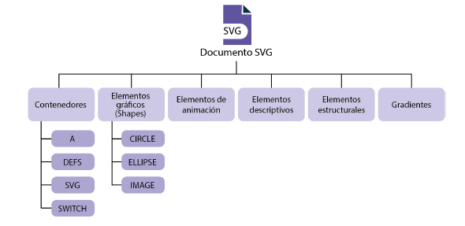

## 1. Lenguajes de descripción de interfaces basadas en XML. Ámbito de aplicación

**Lenguaje de marcas:** Forma de codificar un documento mediante etiquetas o marcas que contiene información sobre la estructura del texto o su presentación.

**XML (Extensible Markup Language)**. Especificación para diseñar lenguajes de marcado. Permite definir etiquetas personalizadas para descripción y organización de datos. 

**Ventajas de describir interfaces con el lenguaje de marcas XML:**
- Fácil aprendizaje
- Permiten definir interfaz separada de la lógica de la aplicación.  (**Separar totalmente las capas de presentación de la capa lógica**. Consigue distribución modular y bajo acoplamiento).
## 2. XAML (Extensible Application Markup Language)

- L**enguaje  declarativo basado en XML, optimizado para describir gráficamente interfaces de usuario visuales**. (Ej.: Creadas con Flash, XUL, UIML). Se utiliza para cerrar e inicializar objetos .NET con relaciones jerárquicas.
- Cada elemento gráfico se define por una etiqueta de apertura, otra de cierre y por un conjunto de atributos que definen el aspecto y el comportamiento. 
- Se puede aplicar al desarrollo de interfaces de escritorio y de web
- Puede usarse con editores como Visual Studio y Blend; haciendo uso de C#

- El elemento raiz de la ventana es `<Window>`. Dentro de ella deben declararse los distintos espacios de nombres junto con sus referencias. Los namespaces deben asociar los elementos descritos en el documento con los controles de WPF (Windows Presentation Foundation) que están en el espacio de nombres System > Windows > Controls del framework .NET.

- Permite desarrollar distintas interfaces mediante su asociación con .NET. Se corresponden de forma directa con otros elementos pertenecientes a este lenguaje. 

**Windows Presentation Foundation (WPF)**: Marco de interfaz de usuario que crea aplicaciones de cliente de escritorio. Admite un amplio conjunto de características de desarrollo de aplicaciones. 

Veamos un fragmento: 

```xml
<StackLayout
	Orientation="Horizontal"
	BindableLayout.ItemsSource="{Binding People}">
	<BindableLayout.ItemTemplate>
		<DataTemplate>
			<Grid>
				<imageCircle:CircleImage
				Source="{Binding Photo}"
				Aspect="AspectFit"
				Style="{StaticResource PhotoStyle}"/>
			</Grid>
		</DataTemplate>
	<BindableLayout.ItemTemplate>
<StackLayout>
```

### 2.1. Sintaxis en XAML

#### Atributos

- **Atributo name**: Identificador único del documento. Usado para referencias en código. (**x:Name**)
- **Atributo key**: Identificador para los elementos definidos en el diccionario (fichero de recursos con pares clave-valor). (**x:Key**)
- **{Binding}**: Elemento definido dentro de un valor de un atributo definiendo un enlace a fuente de datos (fichero, base de datos...) 
- **{StaticResource}**: Como el {Binding} pero hace referencia a elemento del diccionario de recursos
- **{Null}**: Valor nulo

#### Ejemplos

**Forma 1**: Basada en atributo. Sencilla pero sin riqueza de presentación de ciertos valores

```xml
<Button Witdh="125" Height="75">
	Aceptar
</Button>
```

**Forma 2**: Basada en propiedad. Usa elementos gráficos. Representación más compleja. 

```xml
<Button Witdh="125" Height="75">
	<Button.Background>
		...
	</Button.Background>
	Aceptar
</Button>
```

### 2.2. Contenido de texto

Veamos diversas formas: 

```xml
<Button Witdh="125" Height="75">
	<Button.Content>Aceptar</Button.Content>
</Button>

<Button Witdh="125" Height="75" Content="Aceptar">
</Button>

<Button Width=”100” Height=”75”>
	Contenido texto
	<Button.Background>
		<SolidColorBrush Color=”Red” />
	</Button.Background>
</Button>

<Button Width=”100” Height=”75”>
	<Button.Background>
		<SolidColorBrush Color=”Red” />
	</Button.Background>
	Contenido texto
</Button>
```


### 2.3. Representación de contenedores

Los **contenedores** permiten tener organizada toda la información.
En XAML existen **cinco tipos de contenedores**:
- `StackPanel`
- `DockPanel`
- `WrapPanel`
- `Canvas`
- `Grid`

#### A. StackPanel
Permite aplicar los elementos de forma horizontal (atributo `Orientation="Horizontal"`) o vertical (atributo `Orientation="Vertical"`)

#### B. DockPanel
Permite anclaje de los diferentes elementos en los márgenes izquierdo, derecho, superior e inferior, situándose en un lugar determinado. Puede determinarse que el último elemento ocupe todo el contenido con la propiedad `LastChildFill` (ej.: cuando se quiere tener el explorador de archivos ocupando todo teniendo en la parte izquierda las opciones de menú y barras de navegación o auxiliares...)

#### C. WrapPanel
Permite unificar los elementos orientándolos en vertical u horizontal (solo elementos que caben en una fila). Bueno para galerías de imágenes, botones de acciones rápidas...

#### D. Canvas
Permite agrupar los elementos en diversas coordenadas absolutas aunque estas también se pueden determinar por coordenadas relativas. Haciendo uso de referencias `Canvas.Left`, `Canvas.Right`... Es muy utilizado y que cuenta con gran número de opciones. Pero puede haber problemas ¿al no ser responsivo?.

#### E. Grid
Permite declarar los elementos ordenándolos en forma de tablas por filas y columnas. Pueden unirse celdas, columnas... Se parece a las tablas de HTML. Puede determinarse alineación vertical y horizontal de cada celda, además de otros elementos. Diseños complejos y adaptativos. Es muy socorrido y versátil. 

#### Resumidamente...
1. **No usar posiciones fijas a través de coordenadas absolutas**. Preferible usar atributos `Alignment` y `Margin`
2. **No asignar tamaños fijos a los elementos**. Preferible usar propiedad `auto`
3. **Solo usar `Canvas` cuando sea necesario** evitando uso masivo
4. En **botones de diálogo** usar **StackPanel**
5. En **interfaz de entrada de datos estática** usar **GridPanel**

### 2.4 Cuadros de diálogo

- Definen la relación entre la interfaz y el usuario.
- Son ventanas de pequeño tamaño que permanecen abiertas hasta que el usuario decide cerrarlas.
- Mientras están abiertas el usuario no puede interactuar con la ventana principal
- Fundamentalmente son **mensajes** (notificar información al usuario) y **controles de diálogo** (notificar mediante la pulsación una respuesta de la ventana de diálogo)

### 2.5. Flujo de eventos

- Especificar el funcionamiento y la propagación de los diferentes eventos (captura de elementos lanzados mediante **eventos burbuja** que permiten describir cómo un contenedor se puede capturar y manejar por el propio contenedor)

### 2.6. Crear una interfaz simple con XAML

- Instalar Visual Studio Community
- "Obtener herramientas y características"  Desarrollo de escritorio .NET.  Instalar. 
- Crear un proyecto
- Buscar XAML para "Aplicación de WPF (.NET Framework) en C#".  (También se podría hacer esta prueba con Visual Basic, pero se ha obtado por C#)
- Completar nombre del proyecto y Crear (.NET Framework 4.7.2. se está usando)

Se muestra una interfaz de usuario que permite realizar cambios que se aplicarán al código. 


**Introducir un botón con el texto "Soy un botón"**

```xml
<Window x:Class="MiVentana.MainWindow"
        xmlns="http://schemas.microsoft.com/winfx/2006/xaml/presentation"
        xmlns:x="http://schemas.microsoft.com/winfx/2006/xaml"
        xmlns:d="http://schemas.microsoft.com/expression/blend/2008"
        xmlns:mc="http://schemas.openxmlformats.org/markup-compatibility/2006"
        xmlns:local="clr-namespace:MiVentana"
        mc:Ignorable="d"
        Title="MainWindow" Height="450" Width="800">
    <Grid>
    
    <Button x:Name="btnMiBoton" Grid.Row="2" Content="Soy un botón" Height="50"
    Width="150"/>

    </Grid>
</Window>

```


**Interfaz de la calculadora en ventana de 300x300**

Definamos en el `<Grid.RowDefinitions>` una fila de tamaño `Auto` y otra con la altura que quede. 
El primer grid `Grid.Row="0"` será para el campo de texto.
en el segundo   `Grid.Row="1"` otro grid con los botones. Definiremos cinco filas con el mismo peso de altura y cuatro columnas con la misma ancho.
En la última fila del segundo grid, se indicará que se expanda cuatro columnas ` Grid.ColumnSpan="4"`.


```xml
<Window x:Class="Ej02Calculadora.MainWindow"
        xmlns="http://schemas.microsoft.com/winfx/2006/xaml/presentation"
        xmlns:x="http://schemas.microsoft.com/winfx/2006/xaml"

        Title="Calculadora" Height="300" Width="300">
 <Grid>
        <Grid.RowDefinitions>
            <RowDefinition Height="Auto"/>
            <RowDefinition Height="*"/>
        </Grid.RowDefinitions>
        
        <TextBox Grid.Row="0" x:Name="display" Text="0" HorizontalAlignment="Right" VerticalAlignment="Center" 
                 TextAlignment="Right" IsReadOnly="True" FontSize="20"/>
        
        <Grid Grid.Row="1">
            <Grid.RowDefinitions>
                <RowDefinition Height="*"/>
                <RowDefinition Height="*"/>
                <RowDefinition Height="*"/>
                <RowDefinition Height="*"/>
                <RowDefinition Height="*"/>
            </Grid.RowDefinitions>
            <Grid.ColumnDefinitions>
                <ColumnDefinition Width="*"/>
                <ColumnDefinition Width="*"/>
                <ColumnDefinition Width="*"/>
                <ColumnDefinition Width="*"/>
            </Grid.ColumnDefinitions>
            
            <Button Grid.Row="0" Grid.Column="0" Content="7" FontSize="20" Click="Button_Click"/>
            <Button Grid.Row="0" Grid.Column="1" Content="8" FontSize="20" Click="Button_Click"/>
            <Button Grid.Row="0" Grid.Column="2" Content="9" FontSize="20" Click="Button_Click"/>
            <Button Grid.Row="0" Grid.Column="3" Content="/" FontSize="20" Click="Button_Click"/>
            
            <Button Grid.Row="1" Grid.Column="0" Content="4" FontSize="20" Click="Button_Click"/>
            <Button Grid.Row="1" Grid.Column="1" Content="5" FontSize="20" Click="Button_Click"/>
            <Button Grid.Row="1" Grid.Column="2" Content="6" FontSize="20" Click="Button_Click"/>
            <Button Grid.Row="1" Grid.Column="3" Content="*" FontSize="20" Click="Button_Click"/>
            
            <Button Grid.Row="2" Grid.Column="0" Content="1" FontSize="20" Click="Button_Click"/>
            <Button Grid.Row="2" Grid.Column="1" Content="2" FontSize="20" Click="Button_Click"/>
            <Button Grid.Row="2" Grid.Column="2" Content="3" FontSize="20" Click="Button_Click"/>
            <Button Grid.Row="2" Grid.Column="3" Content="-" FontSize="20" Click="Button_Click"/>
            
            <Button Grid.Row="3" Grid.Column="0" Content="0" FontSize="20" Click="Button_Click"/>
            <Button Grid.Row="3" Grid.Column="1" Content="." FontSize="20" Click="Button_Click"/>
            <Button Grid.Row="3" Grid.Column="2" Content="C" FontSize="20" Click="Button_Click"/>
            <Button Grid.Row="3" Grid.Column="3" Content="+" FontSize="20" Click="Button_Click"/>
            
            <Button Grid.Row="4" Grid.Column="0" Content="=" FontSize="20" Click="Button_Click" 
                    Grid.ColumnSpan="4" HorizontalAlignment="Stretch"/>
        </Grid>
        
    </Grid>
</Window>

```

```csharp
using System;
using System.Windows;

namespace Ej02Calculadora
{
    public partial class MainWindow : Window
    {
        private string _input = string.Empty;   // Entrada del usuario
        private string _operator = string.Empty; // Operador seleccionado (+, -, *, /)
        private double _firstNumber = 0;        // Primer número
        private double _secondNumber = 0;       // Segundo número
        private bool _operatorSelected = false; // Verificar si ya se seleccionó un operador

        public MainWindow()
        {
            InitializeComponent();
        }

        // Evento click para los botones
        private void Button_Click(object sender, RoutedEventArgs e)
        {
            string buttonContent = (string)((System.Windows.Controls.Button)e.OriginalSource).Content;

            // Lógica para botones numéricos y el punto
            if (double.TryParse(buttonContent, out _) || buttonContent == ".")
            {
                if (_operatorSelected)
                {
                    // Iniciar nuevo número después del operador
                    _input += buttonContent;
                    display.Text = _input;
                }
                else
                {
                    // Continuar ingresando el primer número
                    _input += buttonContent;
                    display.Text = _input;
                }
            }
            // Lógica para los operadores
            else if (buttonContent == "+" || buttonContent == "-" || buttonContent == "*" || buttonContent == "/")
            {
                if (!_operatorSelected && _input != string.Empty)
                {
                    _firstNumber = double.Parse(_input);
                    _operator = buttonContent;
                    _input = string.Empty; // Reiniciar entrada para el segundo número
                    _operatorSelected = true;
                }
            }
            // Lógica para el botón "="
            else if (buttonContent == "=")
            {
                if (_input != string.Empty && _operatorSelected)
                {
                    _secondNumber = double.Parse(_input);
                    // Funcion del DataTable... 
                    double result = Calculate(_firstNumber, _secondNumber, _operator);
                    display.Text = result.ToString();
                    _firstNumber = result; // Para permitir continuar con nuevas operaciones
                    _input = string.Empty;
                    _operatorSelected = false;
                }
            }
            // Lógica para el botón "C" (Clear)
            else if (buttonContent == "C")
            {
                Clear();
            }
        }

        // Método para realizar el cálculo
        private double Calculate(double num1, double num2, string oper)
        {
            switch (oper)
            {
                case "+":
                    return num1 + num2;
                case "-":
                    return num1 - num2;
                case "*":
                    return num1 * num2;
                case "/":
                    return num1 / num2;
                default:
                    return 0;
            }
        }

        // Método para limpiar la calculadora
        private void Clear()
        {
            _input = string.Empty;
            _operator = string.Empty;
            _firstNumber = 0;
            _secondNumber = 0;
            _operatorSelected = false;
            display.Text = "0";
        }
    }
}
```

**Selector RGB**

```xml
<Window x:Class="MiVentana.MainWindow"
        xmlns="http://schemas.microsoft.com/winfx/2006/xaml/presentation"
        xmlns:x="http://schemas.microsoft.com/winfx/2006/xaml"
        xmlns:d="http://schemas.microsoft.com/expression/blend/2008"
        xmlns:mc="http://schemas.openxmlformats.org/markup-compatibility/2006"
        xmlns:local="clr-namespace:MiVentana"
        mc:Ignorable="d"
        Title="Ejercicio3RGB" Height="300" Width="400">
    <Grid>

        <Grid.RowDefinitions>
            <RowDefinition Height="50"/>
            <RowDefinition Height="*"/>
            <RowDefinition Height="70"/>
        </Grid.RowDefinitions>

        <Label Grid.Row="0" Content="Selecciona un color RGB:" FontSize="24" HorizontalAlignment="Center"/>
        
        <Grid Grid.Row="1">
            <Grid.RowDefinitions>
                <RowDefinition Height="Auto"/>
                <RowDefinition Height="Auto"/>
                <RowDefinition Height="Auto"/>
            </Grid.RowDefinitions>
            <Grid.ColumnDefinitions>
                <ColumnDefinition Width="*"/>
                <ColumnDefinition Width="90"/>
            </Grid.ColumnDefinitions>
            <Label Content="Rojo" Grid.Row="0" Grid.Column="0" FontSize="20" HorizontalAlignment="Center"/>
            <ComboBox x:Name="comboRojo" Grid.Row="0" Grid.Column="1" Width="Auto"/>
            
            <Label Content="Verde" Grid.Row="1" Grid.Column="0" FontSize="20" HorizontalAlignment="Center"/>
            <ComboBox x:Name="comboVerde" Grid.Row="1" Grid.Column="1" Width="Auto"/>
            
            <Label Content="Azul" Grid.Row="2" Grid.Column="0" FontSize="20" HorizontalAlignment="Center"/>
            <ComboBox x:Name="comboAzul" Grid.Row="2" Grid.Column="1" Width="Auto"/>
        </Grid>

        <Button x:Name="btnPinta" Grid.Row="2" Content="Pinta color" Width="Auto" Margin="10,10,10,10"/>

    </Grid>
</Window>
```

## 3. XUL (Extensible User Interface Language)

Lenguaje comúnmente llamado **Gecko**.
Toma datos tipo HTML, XML y diferente información de tipo CSS o XLS para visualizar en pantalla el resultado de lo obtenido tras aplicar el formato a los diferentes datos. 

### 3.1. Contenedores - Control box

Tiene contenedores definidos en XUL por el control box que a su vez puede contener otros elementos. Casos de control box:

#### A. Box
 Es uno de los contenedores más utilizados. Basado en principio de división de ventanas en diferentes cajas posicionando los elementos hijos dentro de cada una de ellas. Los elementos hijo se pueden solicitar de forma vertical u horizontal.

La interfaz podría obtenerse a través de una agrupación de estructuras de cajas, la orientación de los hijos dentro de las cajas, la aplicación de las hojas de estilo. Existe otra opción en la que se aplican distintos elementos `<spacer>` con atributos `flex` y `pack`.

**Definición de una caja**

Formas de definir caja horizontal
```xml
<hbox>
	<!-- caja horizontal-->
</hbox>

<box orient="horizontal"> </box>
```

Formas de definir caja vertical
```xml
<vbox>
	<!-- caja vertical-->
</vbox>

<box orient="vertical"> </box>
```

#### B. Stack

Parecido al elemento `Box`. Los hijos se colocan uno encima de otros.
El elemento hijo con mayor tamaño es el que determina el tamaño del elemento, aunque también es posible definir mediante hojas de estilo sus valores de ancho y de alto. 

#### C. Deck

Similar al `stack` pero solo puede visualizar el primer elemento hijo. 

Ejemplo.: Se definen tres elementos (páginas).  Con `selectedIndex="2"` la página seleccionada por defecto será la tercera (el índice inicializa en 0).


```xml
<deck selectedIndex="2">
	<description value=”Esta es la primera página”/>
	<button label=”Esta es las segunda página”/>
	<box>
		<stack>
			<button label=”Portero” left=”5” top=”5”/>
			<button label=”Delantero” left=””60
			top=”20”/>
			<button label=”Defensa” left=”10” top=”60”/>
		</stack> 
		<description value=”Esta es la tercera página”/>
		<button label=”Esta también es la tercera página”/>
	</box>
</deck>
```

Se pueden definir las coordenadas relativas que referencias a los elementos hijos dentro de un contenedor mediante `left` y `top`

Cuando es una pila, el tamaño viene determinado por las posiciones de los elementos hijo que son los que siempre van a estar visibles. Estos valores son alterables usando hojas de estilo. 

#### D. Grid

Organizada en filas y columnas. 

```xml
<grid flex=”1”>
	<columns>
		<column flex=”2”/>
		<column flex=”1”/>
	</columns>
	<rows>
		<row>
			<button label=”Conejo”/>
			<button label=”Elefante”/>
		</row>
		<row>
			<button label=”Koala”/>
			<button label=”Gorila”/>
		</row>
	</rows>
</grid>
```

Si se coloca el elemento deseado fuera de las etiquetas (aunque dentro de `rows`) el botón ocupará todo el ancho del elemento contenedor `<grid>`. Igual si en lugar de hacerlo en las filas se hiciera en las columnas. 

```xml
<grid>
	<columns>
		<column flex=”1”/>
		<column flex=”1”/>
	</columns>
	<rows>
		<row>
			<label value=”Noroeste”/>
			<label value=”Noreste”/>
		</row>
		<button label=”Ecuador”/>
		<row>
			<label value=”Sureste”/>
			<label value=”Suroeste”/>
		</row>
	</rows>
</grid>
```

#### E. Tabbox

Se usan para organizar diferente información a través de contenedores en diferentes pestañas. 
- El `Tabbox` es el elemento más externo que contiene al resto de elementos.
- `Tabs` es el elemento contenedor de las distintas pestañas.
- `Tab` es la pestaña determinada de la colección. 
- `Tabpanels`: Elemento contenedor de las páginas
- `Tabpanel`: Página determinada de la colección.

```xml
<tabbox id=”tablist”>
	<tabs>
	<!--contenido-->
	</tabs>
	<tabpanels>
	<!--contenido -->
	</tabpanels>
</tabbox>
```

- Con el atributo `selected` se puede seleccionar por defecto una pestaña (o llevarla a cabo a través de Javascript)
- La posición de las pestañas de un elemento se puede indicar con `orient` vertical y horizontal, además del atributo `dir` con valor `reverse`

#### F. Paneles

Con ellos puede insertarse información de otras páginas o documentos. Por ejemplo `iframe`. 

#### G. Buscadores

Integración con `browser`por lo que el elemento funciona de forma muy parecida a un navegador. Elementos `tabbrowser` comportamiento parecido al `tabbox` permitiendo modificar las páginas en las que existe un browser. 

#### H. Cuadros de diálogo

Usando `<dialog></dialog>` como elemento raíz. 
```xml
<dialog xmlns=”http://www.mozilla.org/keymaster/
gatekeeper/there.is.only.xul”
Id=”dcg” tittle=”MiDialogo”
buttons=”aceptar, cancelar”
ondialogaccept=”return onAccept();”
ondialogaccept=”return onCancel();”>
```
Hay distintos tipos de botones: `accept` (OK); `cancel` (Cancelar); `Disclosure` (Más información); `Help` (Ayuda), `Extra1`, `Extra2` (Sin función determinada)

#### I. FilePicker

Para elegir archivos o directorios. Tiene comportamiento de ventana modal. Con funciones que dependen de un método determinado (`Open`, `GetFolder`, `Save`).

```csharp
var miFilePicker=Components.interfaces.nslFile-
Picker;
var fp=Components.classes[“@mozilla.org/filepicker;
1”].createInstance(miFilePicker);
fp.init(window,”Seleccionar un archivo”,miFipeîcker.
modeOpen);
```

La ventana modal puede devolver tres valores diferentes (`returnOK`, `returnCancel`, `returnReplace` (para reemplazar un archivo seleccionando el que va a sustituirlo y sobreescribirlo))

## 4. SVG (Scalable Vectorial Graphics)

- Se utiliza para definir gráficos vectoriales en 2D.
- Se pueden definir figuras simples o complejas que pueden especificarse a través de ecuaciones matemáticas o incluso expresiones algebraicas.



Se puede diferenciar entre:
- **Elementos contenedores**: Contienen a su vez otros SVG. Permite ramificación y escalabilidad
- **Elementos gráficos**: Formados por segmentos rectos y curvas (círculos, rectángulos, elipses, etc.). Representaciones en 2D o imágenes. 
- **Elementos de animación**: Efectos para aplicar a otros SVG dando dinamismo
- **Elementos descriptivos**: Información referente al padre que los contiene
- **Elementos de gradiente**: Definición de gradientes de calor aplicables a otros elementos
- **Elementos estructurales**: Estructura primaria de los documentos `defs`, `g`, `svg`, `symbol`, `use`

**Uso de referencias**
El lenguaje SVG permite referenciar distintos elementos de tal forma que se pueden aplicar sobre ellos efectos y animaciones. También permite realizar esas animaciones sobre otros elementos dispersos en el SVG mediante sus referencias. 

**Agrupación de elementos** Pueden agruparse varios elementos en un mismo contenedor

**Atributos de evento**: Se puede especificar el script que debe ejecutarse para un determinado evento asociado a un SVG. Así se puede especificar por ejemplo qué hay que ejecutar cuando se le aplica una animación a un objeto (`onbegin`) o cuando va a finalizar la animación (`onend`),...
Las animaciones pueden realizarse con funciones del DOM (si el objeto es considerado XML) o mediante modelo de objetos propios de SVG (si se considera como SVG).

## 5. UIML (User Interface Markup Language)

Permite crear una página web para usarla en cualquier interfaz o dispositivo.
Creado por Harmonia. Permitiría que el contenido web se cree solo una vez independientemente del dispositivo y que el desarrollador haga uso de un lenguaje de marcado para describir los elementos.

### 5.1. Sintaxis UIML

Tiene estructura parecida a documento HTML.
Para apertura y cierre se utiliza `<UIML></UIML>`

Hay tres tipos de secciones:
- **HEAD**: Información referente al propio archivo como autor, fecha, versión.
- **APP**: Estructura correspondiente a la interfaz. Tiene dos elementos para diseñarla `<GROUP>` y `<ELEM>`. 
- **DEFINE**: Permite definir nombres de grupo y elementos correspondientes a la sección APP con más detalles a través de `<PROPERTIES>`

### 5.2. La sección `<APP>`

- Etiqueta `<GROUP>`. Agrupar diferentes elementos que pertenecen a la interfaz.  `<GROUP CLASS="Dialog" NAME="PrintFinishedDialog"/>`
- Atributo `CLASS` definir su estilo. Clase de la interfaz de usuario de los determinados objetos a los que pertenece. 
- Atributo `NAME`. Asignar nombre. Pueden crearse una serie de botones con función específica en cuyo caso se puede asignar a todos la misma clase pero distinto name.
- Puede definirse elemento `ELEM` sin ningún hijo. `<ELEM CLASS="DialogMessage" NAME="PrintFinishedMsg"/>`
- Con `PROPERTIES` pueden definirse con detalle las principales características de un objeto de la interfaz determinado por `NAME`
- Respuestas de la interfaz a las a las acciones del usuario. `<ACTION VALUE="PrintFinishesdDialog.Existes=False" TRIGGER="select" />`

- Al atributo puede accederse como `Elemento.Atributo=valor`

Los atributos que pueden modificarse son `Visible`, `Exits`, `Enabled`


### 5.3. Estilo

Los estilos definidos en UIML pueden heredarse de padres a hijos. Hay dos que se definen al aplicarse estilos:
- **Elementos Toolkit**: Declaran el conjunto de los elementos que pueden usarse en la interfaz procedentes de la librería que se utilice
- **Rendering**: Tipo de elemento que se trata. Pueden ir acompañados de `RENDERING-PREFIX` que define un prefijo que corresponde con el nombre del paquete que tiene el elemento UI.

### 5.4. Cuadros de diálogo
Comportamiento parecido a otros lenguajes. 

Ejemplo:

```xml
<UIML>
	<HEAD>
		<AUTHOR>Stephen King</AUTHOR>
		<DATE>October 14, 2013</DATE>
		<VERSION>1.0</VERSION>
	</HEAD>
	<APP CLASS “App”>
		<GROUP CLASS=”Dialog” NAME=”PrintFinishedDialog”>
			<ELEM CLASS=”DialogButton” NAME=”OKButton”/>
		</GROUP>
	</APP>
	<DEFINE NAME=”OKButton”>
		<PROPERTIES>
			<ACTION VALUE=”PrintFinishedDialog.EXISTS=false”/>
		</PROPERTIES>
	</DEFINE>
</UIML>
```

## 6. MXML (Macromedia Extensible Markup Language)

- Se usa unido a aplicaciones **AdobeFlex**. 
- Su elemento raíz es el `Application`
- Al compilar archivo **MXML** se obtiene un fichero `.swf`

- Las etiquetas deben comentar por mx. La posición de loselementos se establece usando los atributos x e y.  `<mx:Label text=”Ejemplo de mxml” x=20 y=30/>`

- Cuenta con bastantes posibilidades de controles como Button, ComboBox, Label , Image, CheckBox, DataGrid, LinkButton, HSlider, ColorPicker, DateField, List, HorizontalList.

- Actúan como contenedores de otros controles MXML como Canvas, ControlBar, Form, FormHeading, Grid, HBox, HDrivedBox. 

## 7. Generación de código para diferentes plataformas

Los XML son procesados a través de analizadores (leen el contenido, lo interpretan y generan salida basada en los contenidos y la descripción de la marca utilizada)
Los procesadores hacen posible la distribución y visualización de los documentos XML.

**Parsing XML**: Para obtener información de un fichero XML la aplicación debe leer información del fichero de texto codificado, cargar información en memoria, procesar los datos y obtener los resultados.

Hay dos tipos de analizadores: 
- Analizadores dirigidos por la estructura (parsers DOM)
- Analizadores orientados a eventos (parsers SAX). SAX está formado por dos interfaces en su núcleo: XMLReader que representa al parser y ContentHandler que recibe los datos del parser. 

XML es la base para realizar creación de interfaces gráficas de muchos generadores de código o IDE como Netbeans, Visual Studio y Eclipse. 

## 8. Herramientas libres y propietarias para la creación de interfaces de usuario multiplataforma. Herramientas para crear interfaces, editor XML

- **Netbeans**:  Entorno gráfico para implementación de varios lenguajes incluido XML.
- **Visual Studio**: Herramienta de Microsoft. Orientada a implementar código en lenguajes basados en Microsoft como C# y en lenguajes tipificados como XML.
- **Blend**: Para desarrollo rápido de interfaces.
- **SharpDevelop**: Herramienta libre. Orientada a .NET. Con licencia GPL. Alternativa buena a Visual Studio. 
- **Xamarin Studio**: Usa C# y permite exportar a Android, iOS y Windows Phone
- **Gtk+**: Librerías multiplataforma para desarrollar entornos gráficos. Con código abierto orientado a ser usado en Linux aunque puede usarse en cualquier plataforma. 

## 9. Edición del documento XML 

- El documento XML tiene parte **lógica** y parte **física**.
- Es un documento compuesto por entidades identificadas con un nombre.
- Se compone de elementos, atributos y valores
- Al finalizar la implementación debe analizarse mediante un **parser** para comprobar si el documento es válido
- Los **analizadores XML** transforman el código XML en código legible (Ej.: Xerces).
- Puede usarse cualquier editor de texto plano aunque algunos editores facilitan su implementación con código sobresaltando las marcas claves con colores y técnicas para visualizar a simple vista las partes que lo componen. 

