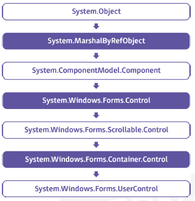

Las **interfaces GUI (graphic user interface)** han ayudado a mejorar la productividad de muchas tareas y permiten que el usuario se acerque al mundo informático sin necesidad de poseer un conocimiento técnico. 

Las librerías se componen de clase y cada clase tiene unos métodos para su uso en la creación de GUIs: 
- **Component**: Superclase de todas las clases de la interfaz gráfica 
- **Container**: Agrupación de componentes
- **JComponent**: Se dibujan directamente los lienzos (canvas)

**Elementos básicos de la GUI**
- `JFrame`: Ventana principal de la aplicación (no contenida en más ventanas)
- `JDialog`: Cuadro de diálogo
- `JApplet`: DESAPARECIDÍSIMO!!!! Para crear applets tipo Swing. Subclase de `Applet`.
- `JPanel`: Contenedor invisible que mantiene componentes de la interfaz y que se puede anidar colocándose en otros paneles o ventanas. Sirve también de lienzo.
- `JScrollPane`: Panel con barras de desplazamiento. 

## 1. Concepto de componente y características

El **componente** tiene autonomía y funcionalidad para existir por sí solo y se puede adaptar a diferentes situaciones. 

El diseño de componentes permite diseño modular, con bajo acoplamiento.
Ejemplos: Conversos de monedas, conversiones de archivos,...

Las ventajas del **desarrollo de software basado en componentes** son:
- Reutiliza software
- Simplifica las pruebas: Pruebas probando cada componente antes de probar el conjunto completo
- Simplifica el mantenimiento del sistema: Desarrollador puede actualizar y/o agregar componentes según sea necesario
- Mayor calidad: La calidad de la aplicación basada en componentes mejora con el tiempo

Puede comprarse componentes a terceros que ya los tengan implementados permitiendo:
- Ciclos de desarrollo más cortos
- Mejor retorno sobre la inversión (ROI)
- Mejorar la funcionalidad

## 2. Propiedades y atributos

Veamos los controles predefinidos en Visual Studio. Los que pueden seleccionarse están definidos en una lista (caja de herramientas), siendo los más comunes en el diseño de interfaces: etiquetas, botones, desplegables.

En las **librerías WPF** los componentes se crean a partir de la clase `UserControl` y permiten heredar todas sus propiedades métodos y eventos. Debe elegirse la clase que más se acerque a las necesidades del usuario para ayudar al diseño en un menor tiempo de implementación.



## 3. Elementos generales

**Importante**: La propiedad `name` debe definirse para todos los elementos de la interfaz para así conocer de forma rápida qué tipo de control representa ese identificador (en lugar de dejar su nombre por defecto).

Veamos elementos generales y alguna de sus propiedades

**Button**: Realiza una acción u otra de forma exclusiva.
- **Content**: Texto a mostrar
- **IsCancel**: Acción cuando se pulsa Esc
- **IsDefault**: Acción cuando se pulsa Intro
- **DataContext**: Controles dentro de un control contenedor de un origen de datos
- **IsEnabled**: Control activo o no
- **ToolTip**: Trozo de texto visualizable cuando se posiciona el puntero del ratón sobre el control

**TextField**: Caja de texto en la que el usuario puede introducir información
- **Text**: Texto que se introduce
- **UndoLimit**: Cantidad de operaciones de deshacer permitidas

**ListBox**: Lista con una serie de elementos que pueden ser seleccionados por el usuario.
- **Items**: Conjunto de elementos de la lista
- **ItemsSource**: Origen de los datos
- **SelectedIndex**: Elemento de la lista. Asigna el valor de -1 si no existe el elemento.

**ComboBox**: Lista de cajas de texto con sus propiedades correspondientes.
- **IsDropDownOpen**: Permite seleccionar un elemento de la lista
- **IsEditable**: Si la caja de texto es editable permite introducir texto
- **IsReadOnly**: No permite modificar los elementos. Es de solo lectura

**CheckBox**: Elemento que se va a utilizar para definir diferentes opciones pudiendo seleccionar más de una opción. 
- **ClickMode**: Especifica si puede liberarse el evento click. Tiene opciones Release (cuando se libera la pulsación), Press (cuando se produce la pulsación), Hover (cuando se pasa por encima)
- **Content**: Texto asociado al elemento
- **IsChecked**: Estado del elemento (seleccionado o no)
- **IsThreeState**: Especifica los tres estados diferentes que puede tener el control

**RadioButton**: Como el CheckBox pero con opciones excluyentes unas de otras. 

**Image**: Añadir imágenes en una interfaz haciendo referencia a los diferentes recursos.
- **Source**: Ruta del archivo
- **Strech**: Ajustar el tamaño de una imagen al espacio disponible de la aplicación
- **StrechDirection**: Forma en la que se lleva a cabo el ajuste

### 3.1. Creación básica de un componente WPF

Para crear un componente WPF puede partirse de la clase `UserControl` o reutilizar alguno(s) control(es).

- **Control personalizado**: Se puede partir de un control sencillo como el TextField. La caja de texto permite solo valores numéricos y, si se introduce otra cosa, avisa con mensaje de error. Puede iniciarse con el control propio `TextBox` y extender esta clase añadiendo la funcionalidad deseada. Puede añadirse la librería `PresentationFramework` dentro del proyecto. 
- **Definición de propiedades**: Las propiedades asociadas a los componentes gráficos se definen usando aquellas propiedades determinadas de una clase para hacer uso de sus comportamientos. Pueden ser simples o indexadas.
- **Testing del componente**: Para probarlo, es necesario otro proyecto que pueda ejecutarse por sí mismo. (Ej.: La aplicación de un formulario)
- **Métodos**: Crear métodos para componentes gráficos es similar a crear una función perteneciente a una clase que defina al componente. 

## 4. Eventos, asociación de acciones a eventos

**Evento**: Representa a la acción determinada que puede desempeñar un usuario y que está asociada a un componente específico. Al ejecutar un evento se producen una serie de acciones. 
### Creación de un evento

Se llama evento a la función que se desencadena tras haber realizado una acción sobre un componente en cuestión.
El **principal elemento de un evento** es el **manejador (handler)** especificado mediante:
```csharp
This.TextChanged+=new System.Windows.Controls.TextChangedEventHandler(manejador);
```

Siendo `manejador` una rutina que tiene una firma que cumple todos los requisitos que tiene asignados.

### Diseño de eventos

Se pueden diseñar de dos formas:
- Haciendo uso de un evento ya definido y modificarlo hasta conseguir adaptarlo a las necesidades del usuario
- Creando un evento desde cero partiendo de un nuevo componente

El manejador puede hacerse en la clase parcial de código asociada al archivo XAML. Es un método que tiene un subrutina (0pública o privada) en la clase. La subrutina cuenta con dos parámetros:
- El primero: **sender**. Representa el objeto asociado al manejador
- El segundo: con información específica sobre un determinado evento. 

### Eventos enrutados

El evento enrutado permite pasar un evento desde un hijo hasta sus padres (estructura de árbol).
Al propagarlo con una ruita ascendente, los manejadores asociados al evento puede compartir la instancia de datos del evento por lo que, con un cambio, este es propagado a partir de ese punto. En este caso el objeto **sender** cambiará siendo el elemento que esté asociado al manejador. 
### Escuchadores (listeners)

Encargados de controlar los eventos. Están a la escucha, esperando que el evento se produzca. Según cuál sea es necesario un listener u otro ya que estos están formados por una serie de métodos que se deben implementar aunque solo se use uno. Los listeners se encuentran en **java.awt.event**
### Asociación de acciones a eventos

#### Acciones

| MÉTODOS                                       | EVENTOS                                             | ESCUCHADOR                                                                              |
| --------------------------------------------- | --------------------------------------------------- | --------------------------------------------------------------------------------------- |
| `public void actionPerformed (ActionEvent e)` | `JButton`: Clic o pulsar Intro cuando tiene el foco | `ACTIONLISTENER`: Clic sobre el componente o si se hace Intro cuando este tiene el foco |
|                                               | `JList`: Doble clic en un elemento de una lista     |                                                                                         |
|                                               | `JMenuItem`: Seleccionar una opción del menú        |                                                                                         |
|                                               | `JTextField`: Pulsar Intro cuando tiene el foco     |                                                                                         |
#### Tecla del teclado

| MÉTODOS                               | EVENTOS                                 | ESCUCHADOR                                                          |
| ------------------------------------- | --------------------------------------- | ------------------------------------------------------------------- |
| `public void keyTyped(KeyEvent e)`    | `keyTyped`: Al pulsar y soltar la tecla | `KEYLISTENER`: Al pulsar la tecla. Cambia la forma según el método. |
| `public void keyPressed(KeyEvent e)`  | `keyPressed`: Al pulsar la tecla        |                                                                     |
| `public void keyReleased(KeyEvent e)` | `keyReleased`: Al soltar la tecla       |                                                                     |

#### Focus

| MÉTODOS                                 | EVENTOS                               | ESCUCHADOR                                                                             |
| --------------------------------------- | ------------------------------------- | -------------------------------------------------------------------------------------- |
| `public void focusGained(FocusEvent e)` | `LostFocus`: Cuando se pierde el foco | `FOCUSLISTENER`: Cuando un componente gana o pierde el foco (el que está seleccionado) |
| `public void focusLost(FocusEvent e)`   |                                       |                                                                                        |

#### Click de ratón

| MÉTODOS                                   | EVENTOS                                          | ESCUCHADOR                                                          |
| ----------------------------------------- | ------------------------------------------------ | ------------------------------------------------------------------- |
| `public void mouseClicked(MouseEvent e)`  | `mouseClicked`: Pinchar y soltar                 | `MOUSELISTENER`:  Cuando se lleva a cabo alguna acción con el ratón |
| `public void mouseEntered(MouseEvent e)`  | `mouseEntered`: Entrar en componente con puntero |                                                                     |
| `public void mouseExited(MouseEvent e)`   | `mouseExited`: Salir de componente con puntero   |                                                                     |
| `public void mousePressed(MouseEvent e)`  | `mousePressed`: Presiona el botón                |                                                                     |
| `public void mouseReleased(MouseEvent e)` | `mouseReleased: Soltar el botón                  |                                                                     |
#### Movimiento de ratón

| MÉTODOS                                  | EVENTOS                                                    | ESCUCHADOR                                  |
| ---------------------------------------- | ---------------------------------------------------------- | ------------------------------------------- |
| `public void mouseDragged(MouseEvent e)` | `mouseDragged`: Click y arrastrar un componente            | `MOUSEMOTIONLISTENER`: Movimiento del ratón |
| `public void mouseMoved(MouseEvent e)`   | `mouseMoved`: Cuando se mueve un puntero sobre un elemento |                                             |

## 5. Persistencia del componente

La **persistencia** permite almacenar, recuperar y transferir el estado de los objetos. 

### 5.1. Serialización (Marshalling)

Se codifica un objeto en un medio de almacenamiento para transmitirlo a través de una conexión de red (en bits, en formato XML...). Pueden usarse esos formatos para replicar objetos idénticos al original, incluyendo su estado interno. 

Utilizado para transportar objetos a través de un red, para hacer persistente un objeto en un archivo o en una base de datos o para distribuir objetos idénticos en varios aplicaciones o localizaciones. 

### 5.2. Base de datos orientada a objetos

En este SGBD los objetos de la BBDD son objetos del lenguaje de programación. Así pueden trabajar bien con lenguajes como Java, C++, C# o Visual Basic.NET, mejorando el rendimiento a la hora de manipular tipos de datos complejos. Generan costes de desarrollo más bajos. 
### 5.3. Motor de persistencia

Traduce de objetos a registros y de registros a objetos. Tanto cuando se quiere grabar un objeto como cuando se quiere recuperarlo.
El motor de persistencia es el mismo para todas las aplicaciones. 

## 6. Herramientas para desarrollo de componentes visuales

El diseño de componentes visuales como botones e iconos puede hacerse con herramientas como:
- **GIMP**: Libre y versátil. Importante guardar relación adecuada en las dimensiones a la hora de diseñar un componente visual.
- **Adobe Photoshop**: Editor de gráficos rasterizados. Usado en retoque de fotografías y gráficos y también para crearlos; en buena calidad. 
- **Glade y Blend**: Glade permite desarrollar de forma rápìda interfaces de usuario almacenadas en XML. Blend permite crear interfaces de usuario en aplicaciones de escritorio Windows.

