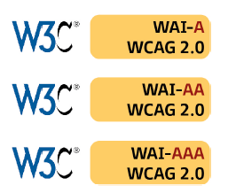

La **interfaz gráfica de usuario (GUI)** hace referencia a cómo los distintos elementos gráficos permiten comunicarse con un sistema informático. Sus principales objetivos son:

- **Funcionalidad**: Facilitar las tareas que se lleven a cabo
- **Amistosa**: Hacer su manejo sencillo
Siempre se recomienda que tengan apariencias amigables y fáciles de manejar para que el usuario pueda guiarse por las distintas opciones que necesite. 

**Principios básicos del diseño de una buena interfaz**
- **Sencilla**: Con elementos que ayuden y que guíen. Evitando interfaces sobrecargadas.
- **Clara**: Permitir que la información se visualice de forma fácil, siguiendo criterio de organización sencillo, lógico y jerárquico.
- **Predecible**: Para las mismas funciones deben suceder las mismas respuestas.
- **Flexible**: Homogénea para poder ser utilizada en distintas plataformas.
- **Consistente**: Conveniente que los elementos permanezcan en una misma área una vez organizados. La página que más variaciones tendrá es la principal, aunque permanecerán igual las funciones.
- **Intuitiva**: El usuario debe poder acceder a cualquier función sin dificultad (si la interfaz es sencilla)
- **Coherente**: Conseguir que sea entendible añadiendo palabras, frases a los elementos como pueden ser gráficos y colores. 

## 1. Concepto de usabilidad

Se llama **usabilidad** a la medida en la cual un producto puede ser usado por usuarios específicos para conseguir objetivos específicos con _efectividad_, _eficiencia_ y _satisfacción_ en un contexto de uso especificado. 

La usabilidad se basa en facilitar tareas de forma que cuando un determinado usuario visualice una interfaz pueda ser capaz de encontrar la información que necesita.

La usabilidad de la interfaz se puede considerar una medida de utilidad, fácil uso y aprendizaje para una tarea, usuario y contexto determinados. 

- **Facilidad de aprendizaje**: Mide la capacidad del nuevo usuario para interactuar de forma efectiva con la interfaz
- **Eficiencia**: Mide el tiempo que tarda en realizar una tarea el usuario una vez que ha aprendido el funcionamiento básico del diseño
- **Cualidad de ser recordado**: Mide cuánto tarda el usuario en volver a utilizar eficientemente la interfaz tras un largo periodo de tiempo sin haberlo tuilizado
- **Eficacia**: Mide los errores que comete el usuario a la hora de realizar una tarea y cuánto de rápido solucionan estos errores
- **Satisfacción**: Mide cómo de agradable y sencillo le resulta al usuario realizar las tareas

#### Atributos
- Tiempo de aprendizaje
- Eficacia de uso
- Retención a través del tiempo
- Confiabilidad en el uso
- Satisfacción a largo plazo
- Eficacia
- Entendimiento
- Adaptabilidad
- Primera impresión
- Elementos extra
- Desempeño inicial
- Evolucionable

#### Problemas detectados

Jakob Nielsen definició en 1990 **los diez principios del diseño basado en el usuario** :

- 1. **Visibilidad del estado del sistema**: Debe mostrarse al usuario qué está pasando y en qué punto de la navegación se encuentra. Ej.: Se indica con un color diferente el elemento de menú en el que nos encontramos.
- 2. **Relación entre el sistema y el mundo real**: El sistema debe tener asociaciones con el mundo real que el usuario pueda entender. Ej.: Una lupa está relacionada con buscar contenido.
- 3. **Control y libertad de usuario**: Ofrecer al usuario opciones de deshacer y rehacer para que el usuario pueda volver a estados anteriores en caso de error.
- 4. **Consistencia y estándares**: Palabras y acciones deben ser consistentes. Mismas palabras y acciones, mismos efectos. Diferentes palabras y acciones, diferentes efectos.  No es labor de los usuarios reflexionar acerca de casuísticas sistintas.
- 5. **Prevención de errores**: Es más importante que diseñar buenos mensajes de error.
- 6. **Reconocimiento antes que recuerdo**: Objetos, acciones y opciones deben ser claramente visibles. El usuario no debe tener que recordar cómo continuar sino que debe contar con instrucciones que le ayuden a llegar a dónde quiere. 
- 7. **Flexibilidad y eficiencia de uso**: Shortcuts de teclado que permitan interactuar rápidamente a usuarios más expertos. 
- 8. **Estética y diseño minimalista**: Los diálogos no deben contener información que no sea importante
- 9. **Ayudar a los usuarios a reconocer, diagnosticar y recuperarse de errores**: Los mensajes de error deben mostrarse de forma concisa y clara, facilitando reconocer la causa del problema.
- 10. **Ayuda y documentación**: Contar con ayudas a las que recurrir en caso de error. No debe ser muy complicada, sino de fácil acceso. 

#### Beneficios de la usabilidad

Los principales beneficios de la usabilidad son:
- Reducir costes de aprendizaje y esfuerzo
- Disminuir costes de asistencia y ayuda al usuario
- Disminuir la tasa de errores provocados por el usuario
- Optimizar los costes de diseño, rediseño y mantenimiento
- Aumentar la tasa de conversión de visitantes en clientes en un sitio web
- Aumentar la satisfacción y comodidad del usuario
- Mejorar la imagen y el prestigio
- Mejorar la calidad de vida de los usuarios

#### Estándares de la usabilidad 

El **estándar ISO 9241** está centrada en la calidad de la usabilidad y ergonomía tanto de hardware como de software. Fue creado por ISO y la IEC y actualizada y mejorada hasta ISO/IEC 9241-9:2001.

Permite ofrecer requisitos relacionados con tributos de hardware, software y entorno y permite definir la usabilidad y los principios ergonómicos.

**Estandarizaciones relativas a la usabilidad**
- ISO **13407**: **Principios que deben observarse durante un proceso de diseño centrado en el usuario** para sistemas interactivos
- ISO/TR **16982**: Lista de **métodos que soportan diseño centrado en el usuario y pueden ser aplicados en las diferentes etapas del ciclo de un diseño**. Con ventajas y desventajas.
- ISO **9241-10**: **Principios para diálogos**. Diseño y evaluación de diálogos entre usuario y sistema informático.
- ISO **9241-11**:  Especificaciones y **medidas de usabilidad**.
- ISO **9241-12**: **Presentación de la información**. Organización de información, objetos gráficos y codificación.
- ISO **9241-13**: **Guía del usuario**. Ayudas al usuario.
- ISO **9241-14**: **Diálogo de menús**. Tipo de interacción con los menús según características de los usuarios.
- ISO **9241-15**: **Diálogos de lenguaje de órdenes**.
- ISO **9241-16**: **Diálogo de manipulación directa**. Feedback, manipulación de objetos, selección, dimensionamiento, iconos,...
- ISO **9241-17**: Diálogos por cumplimentación de **formularios**. Aborda la estructura de los formularios, campos y etiquetas. El feedback, las entradas y la navegación. 
- ISO **14915**: Ergonomía para interfaces de usuario con **contenido multimedia**. 

## 2. Medidas de usabilidad

Las **medidas de usabilidad** permiten valorar el grado al que han conseguido llegar el usuario y las organizaciones para que se le pueda proporcionar una información a diseñadores y desarrolladores para mejorar el estado de la interfaz.

Los métodos de evaluación varían según el grado de formalidad y la participación del usuario. 

El método más adecuado dependerá del producto evaluado, de la disponibilidad que tengan los usuarios más representativos y de las restricciones añadidas.

La **evaluación** se basa en:
- El **usuario** que ofrece información relacionada con la tarea que se va a realizar
- El **exporto** que describe la falta de conformidad que hay con las normas o directrices de diseño. 

#### Objetivos principales

**1. Diagnóstico de problemas de usabilidad**
- Métodos basados en el usuario como Evaluación participativa, Evaluación de diagnóstico, Análisis de incidentes críticos
- Completados por el experto o la evaluación heurística. 
Utilizados para mejorar los primeros diseños. 

**2. Evaluación para comprobar si se han conseguido los objetivos referentes a la usabilidad**
- Requisitos para satisfacción y desarrollo del usuario se pueden evaluar mediante el uso de pruebas de rendimiento, carga de trabajo cognitivo,..
- Otros objetivos diferentes que se puedan evaluar mediante la evaluación de expertos. 

Es conveniente que todos estos métodos se usen para probar los diseños finales. 
La información de diagnóstico podrá ser usada para mejorar o añadir requisitos en posteriores versiones. 

Para la evaluación se usan entrevistas, test, prototipos y cuestionarios. 

### 2.1. Métricas
#### Tipo de métrica

##### A. Métrica directa: 
- Fundamentada en la expresión numérica de un atributo
- Permite evaluar diferentes situaciones del mundo real

Algunos ejemplos:
- Longitud del texto del cuerpo de una página (en palabras)
- Cantidad de enlaces rotos internos de una web (errores 404)
- Cantidad máxima de frames que tiene un sitio web (etiquetas`<FRAMESET>`)
- Cantidad de imágenes con texto alternativo de un sitio web (propiedades `<ALT>`)

#### B. Métrica indirecta
- Relación entre dos o más atributos
- Permite medir características y subcaracterísticas

Algunos ejemplos:
- Porcentaje de enlaces rotos de un sitio (Nº rotos interno + Nº rotos externos) / Nº total enlaces * 100 

- Porcentaje de la presencia de ALT (Nº imágenes ALT / Nº total imágenes) * 100

#### C. Otras métricas

- **Métrica interna**: Valor numérico del atributo que involucra al valor en sí. Independientemente de si se obtuvo por vía directa o indirecta. 
- **Métrica externa**: Valor resultante del atributo cuando se aplica métrica indirecta. Involucra al sujeto junto con el comportamiento del entorno.
- **Métrica objetiva**: Valor resultante del atributo en un determinado sujeto. Es posible con esta métrica distinguir entre grados de objetividad.
- **Métrica subjetiva**: Valor numérico que siempre involucra al usuario mediante heurísticas o distintos criterios de preferencia. 

-------


**Métrica**: Optimizar código y cuantificar. Al trabajar en un aplicativo debe proporcionarse calidad en las fases de análisis, diseño, implementación, pruebas y mantenimiento.

**Calidad**: Proceso eficaz de software que se aplica para crear un producto útil al que proporciona un valor que puede ser medida.

Desde el punto de vista del **usuario**, tiene calidad si le satisface
Desde el punto de vista del **producto**, puede definirse la calidad como las funcionalidades y características de este

A base de repetir los procesos de calidad se reducen los costes.
En la **fase de entrega del software** al usuario es cuando más errores se pueden encontrar. Deben realizarse revisiones técnicas adecuadas en esa fase (para evitar que no quede del todo corregido o que el proceso se ralentice)

**Métricas en el código:** Medidas cuantitativas sobre el grado en el que un componente  o proceso posee un atributo determinado.

**Metrica de Halstead**
Una de las métricas más usadas es la de Halstead que asignó unas normas que se pueden aplicar una vez que el código está ya generado. 

n_1 Número de operadores distintos en un programa
n_2 Número de operandos distintos que aparecen en un programa
N_1 Número total de ocurrencias del operador
N_2 Número total de ocurrencias del operando

**Para medir el código**
- **Longitud** de un programa: N = n_1 * log2(n_1) + n_2 * log2(n_2)
- **Volumen** de un programa (en bits): V = N * log2(n_1 + n_2)

Para optimizar el código es necesario responder a las necesidades del entorno e incluir herramientas de automatización.


## 3. Pautas de diseño de interfaces

Un **diseño preciso** permite que el usuario aprecie que se encuentra ante una buena interfaz, independientemente de si los elementos gráficos son o no llamativos.
### 3.1. Pauta de la estructura

**Importante**: Realizar un diseño correcto de la estructura de la interfaz para conseguir un manejo fácil y comprensible al usuario.

Recomendaciones que se pueden verificar:
- **Jerarquía**: Orden en el diseño que haga que los elementos principales sean fácilmente identificables y transmita una idea de orden en dichos elementos.
- **Foco**: Zona importante. Esquina superior izquierda. 
- **Homogeneidad**: Estructura entre ventanas uniforme para que la interfaz se interprete bien.
- **Relaciones entre elementos**: Los elementos deben estar relacionados en la misma zona de forma limpia y concisa para facilitar la lectura de la interfaz. 

**Reglas de alineación**
- Si los textos tienen la misma longitud, deben alinearse los cuadros de texto a la izquierda
- Si hay un conjunto de etiquetas de diferentes longitudes, hay que alinear los textos a la derecha
- Si hay un conjunto de etiquetas con las mismas longitudes se alinean los textos a la izquierda
- La distancia entre la etiqueta y el elemento no debe ser demasiado grande para que la relación entre ellos sea fácil
- Deben agruparse todos los elementos usando encabezados y espaciados. Los espaciados permiten organizar mentalmente cómo va a ser la interfaz para mejorar su interactividad.
- Los criterios de tamaño y alineación deben ser los mismos para todas las ventanas.
- Debe evitarse que el usuario tenga que acceder a diferentes zonas de la aplicación continuamente (efecto de mareo)

**Acceso rápido**: Consiste en hacer uso de combinaciones de teclas para conseguir acceso más rápido a las opciones de la interfaz. Se pueden considerar un atajo (shortcut).

**Layout**: Se conoce como layout a la ubicación de los diferentes elementos dentro de la interfaz. 
### 3.2. Cuadro de diálogo

- Deben ser lo más sencillos posibles. Porque buscan simplificar la resolución de una función que se encuentra dentro de la interfaz principal.
- Envían al usuario mensajes informativos, de error, etc. 
- Pueden tener uno o varios botones o incluso solicitar información al usuario en forma de cuadro de texto o combo desplegable.
- Se crean con el objeto `JOptionPane`

```java
JOptionPane.showMessageDialog(rootPane, "Mensaje informativo", "Título del mensaje", HEIGHT);
```

### 3.3. Desplegables

Las **listas desplegables** ofrecen la posibilidad de seleccionar un elemento según las necesidades que existan. 

- **Flujo de ejecución**: Ofrece al usuario el flujo de ejecución que puede existir entre las diferentes ventanas. Se puede establecer en varias aplicaciones el uso de `TabOrder` que informa sobre cómo se moverá el cursor cada vez que se pulse la tecla Tab. 
- **Integración**: Permite crear diferentes elementos gráficos en lugares en los que se va a utilizar. 
### 3.4. Fuentes

Las fuentes utilizadas provocan diferentes reacciones en los usuarios. Así se recomienda:
- Utilizar una **semántica clara** para el texto. Elementos iguales deben estar referenciados con la misma semántica para indicar que se trata de la misma acción.
- No utilizar **la misma etiqueta** en un mismo formulario
- Tener **estandarizado el uso de fuentes**. Muchos tipos dificultan la lectura.
- Se pueden usar **recursos gráficos** pero no se recomienda ponerlos de fondo de pantalla porque dificulta la visión.
- Se recomienda usar **mayúsculas** de forma limitada. Solo en lugares como encabezados y no de forma generalizada.
- Se debe usar **lenguaje** apto para todo el público. Centrar en conceptos clave. Evitar uso de palabras negativas (error, fallo,...). Indicar mismos mensajes para mismas acciones.
- Al producirse **errores** debe resaltarse más cómo puede solucionarse que a qué corresponde ese tipo de error.
### 3.5. Colores

Los **colores** pueden provocar una mejora de la percepción de la interfaz ya que permite resultar tareas principales.
Por el contrario, un abuso de ellos puede complicar la lectura de la interfaz. 

- **No** se recomienda usar **más de cuatro colores** en una misma **ventana**. Ni más de **siete** en toda la **aplicación**.
- Se debe hacer **uso de los colores de forma uniforme**, usando el mismo color para las mismas funciones
- Se puede **modificar el color para indicar el estado de una acción al usuario**. Verde para correcto; rojo para error. 
- Se puede usar un color para **destacar las zonas principales de la interfaz**.
- **No deben usarse combinaciones de colores que dificulten la lectura.** 
### 3.6. Gráficos

Con el uso de gráficos se puede facilitar una lectura rápida a los usuarios. Estos elementos ocupan más espacio que el texto por lo que pueden también provocar una sobrecarga mayor. 

Los iconos son muy usados, sobre todo en entornos móviles en los que el espacio es fundamental. **Los iconos deben estar diseñados para que su función se pueda identificar de forma rápida**

- Deben conseguir **captar la atención del usuario**
- **Deben optimizar el espacio**: transmitir una función sin tener que especificarlo por texto

## 4. W3C

W3C Consorcio internacional que desarrolla pautas para desarrollo de tecnologías web. 

La **web** está diseñada para que todos los usuarios puedan interactuar con ella independientemente del software que se utilice, del lenguaje, de la localización y de la habilidad que se pueda tener. 

Una **web** debe tener como **objetivo** ser accesible para el mayor número de usuarios posibles. 
Tim Berners-Lee director del W3C e inventor de www -> Acceso universal a pesar de las diferentes capacidades.

Debe considerarse la eliminación de las barreras de acceso tanto en comunicación como en interacción. 

**Accesibilidad web**: Conseguir que quienes presentan discapacidad puedan participar en la web como las demás.

#### WCAG 1.0
Dispone de 14 pautas necesarias para conseguir un diseño accesible al alcance de todos los usuarios. Cada pauta cuenta con una serie de puntos para determinar las distintas áreas. 

Cada pauta WCAG 2.0 desarrolla diferentes criterios de éxito, existiendo hasta 60 criterios o puntos de verificación que permiten **determinar el nivel de accesibilidad** (A, AA, AAA)

Prioridad 1: Puntos que se deben cumplir. De no ser así, algunos grupos de usuario no pueden tener accesibilidad.
Prioridad 2: Puntos que se deberían cumplir. Si no se cumplen, algunos usuarios tendrían muchos para acceder. 
Prioridad 3: Puntos que se podrían cumplir para evitar dificultades de algunos grupos. 

Los criterios de éxito están ordenados según el nivel de cumplimiento (A, AA, AAA).

**Una web cumple con las pautas WCAG 2.0** si cumple con unos **requisitos de conformidad**:
- **Nivel de conformidad A**: Satisface puntos de verificación de prioridad 1. (debe)
- **Nivel de conformidad AA (doble A)**:  Satisface puntos de prioridad 1 y 2. (debe, debería)
- **Nivel de conformidad AAA (triple A)**: Satisface puntos de prioridad 1, 2 y 3. (debe, debería, podría)

Las páginas que cumplen las pautas WCAG reciben una **declaración** que informa a los usuarios de que se cumple con ellas. El nivel de conformidad se puede representar con un logotipo. 



Al hacer uso del logotipo, este debe estar acompañado de:
- Fecha de revisión del cumplimiento
- Título, versión y URI de las pautas WCAG 2.0
- Nivel de conformidad alcanzado (A, AA, AAA). Solo aplicable a la web completa (no puede excluirse una parte de la web)
- Alcance: Enumeración de las páginas que cumplen con WCAG 2.0
- Lista de las diferentes tecnologías de las que depende el contenido. 
