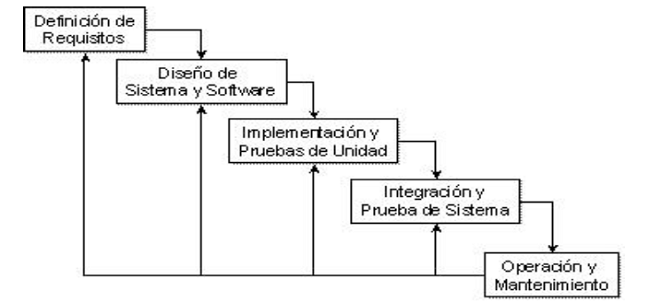
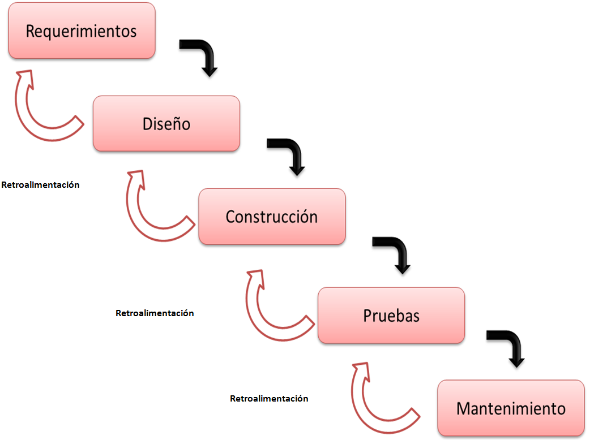
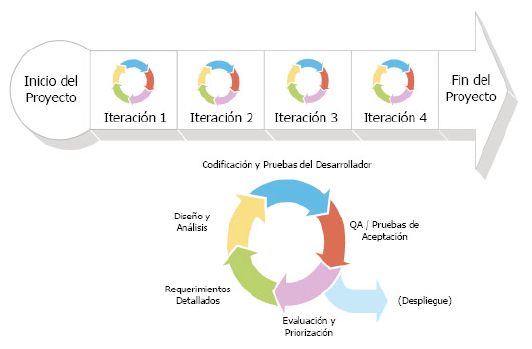
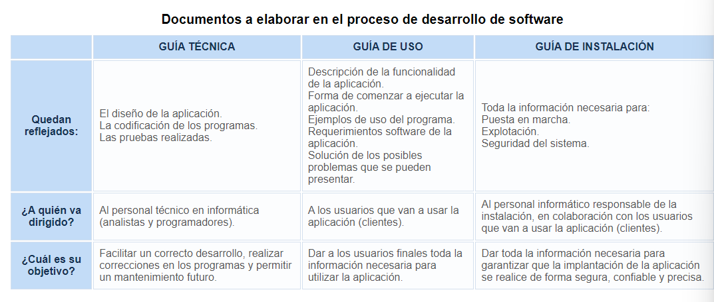

## 1a. Tipos de software 

Software: Conjunto de programas informáticos que actúan sobre el hardware para ejecutar lo que el usuario desee.

Se distinguen tres tipos de software:
- **Sistema operativo**: Software base que debe estar instalado para que las aplicaciones se puedan ejecutar.
- **Software de programación**: herramientas que permitan desarrollar programas informáticos.
- **Aplicaciones**: Conjunto de programas con una finalidad más o menos concreta. Los programas son un conjunto de instrucciones escritas en un lenguaje de programación.

## 1b. Relación hardware-software

La relación hardware-software puede plantearse desde dos puntos de vista:

- El sistema operativo: Coordina el hardware de forma transparente durante el funcionamiento del ordenador. Es el intermediario entre este y las aplicaciones, consumidoras de recursos hardware (Tiempo de CPU, espacio de RAM, interrupciones, dispositivos de E/S)

- Las aplicaciones: El hardware del equipo debe interpretar y ejecutar el código en el que están escritos las aplicaciones. El código es entendible por el humano; el hardware entiende señales eléctricas (ausencia o presencia de tensión -binario-). Hay, por tanto, un proceso de traducción de código para que el ordenador ejecute las sentencias escritas en el lenguaje de programación.

## 2. Desarrollo de software

  Proceso desde que se concibe una idea hasta que el programa está implementado y funcionando. 
  Debe tener etapas de obligado cumplimiento para garantizar que los programas sean eficientes, fiables, seguros y respondan a la necesidad del usuario final. Exige de coordinación y disciplina del grupo de trabajo que lo desarrolla. 
Estas etapas se adoptan siguiendo un modelo o ciclo de vida del software.
   
## 2.1 Ciclos de vida del software

Lo más conocidos y utilizados son:

1. **Modelo en Cascada**
- Modelo clásico de vida del software. Las etapas pasan de una a otra sin retorno posible (se presupone que no habrá errores, ni variaciones del software)
- Prácticamente imposible de utilizar, requiere conocer todos los requisitos del sistema. Solo **aplicable a pequeños desarrollos**

2. **Modelo en Cascada con Realimentación**
- Variación del modelo en cascada, con realimentación entre etapas de forma que se pueda volver atrás para corregir, modificar o depurar.
- Si se prevén muchos cambios durante el desarrollo no es el más adecuado.
- Modelo perfecto si el **modelo es rígido** (pocos cambios, poca evolución) y los **requisitos están claros** 

3. **Modelos Evolutivos**
	Más modernos, tienen en cuenta la naturaleza cambiante y evolutiva del software
	3.1. **Modelo Iterativo-Incremental**
		- Basado en el modelo en cascada con realimentación.
		- Las fases se repiten y refinan. Van propagando su mejora a las fases siguientes.
		- Proyecto se desarrolla en pequeñas porciones (incremental) en sucesivas iteraciones **(sprints)** al final de las cuales se puede ver lo que se ha desarrollado y, antes de comenzar la siguiente iteración (sprint) se pueden ver los requerimientos que no se conocen o estan mal implementados o incluso introducir nuevos requerimientos (adaptativo).  
		- Cada sprint debe dar un resultado completo (incremento del valor del producto final) listo para entregar al cliente.  

	3.2. **Modelo en Espiral**
		- Combinación del modelo iterativo-incremental con el modelo en cascada. 
		- El software se construye repetidamente con versiones cada vez mejores porque incrementan la funcionalidad en cada versión. Modelo bastante complejo. 

## 2.2 Herramientas de apoyo al desarrollo de software

**Herramientas CASE** (Computed Aided Software Engineering) son aplicaciones que se usan en el desarrollo de software para ahorrar costes y tiempos del proceso. Buscan automatizar las fases de desarrollo de software ya que permiten:
- Mejorar planificación
- Agilizar proceso
- Reutilizar partes en proyectos futuros
- Que las aplicaciones respondan a estándares
- Mejorar el mantenimiento de los programas
- Mejorar el proceso de desarrollo, visualizando fases de forma gráfica. 

**Desarrollo rápido de aplicaciones RAD** (Rapid Application Development) es proceso de desarrollo de software que incluye el desarrollo iterativo, la construcción de prototipos y el uso de utilidades CASE. 

Según la fase del ciclo de vida en la que ofrecen ayuda pueden clasificarse en:
- **U-CASE** En planificación y análisis de requisitos
- **M-CASE** En análisis y diseño
- **L-CASE** En programación de software, detección de errores de código, depuración de programas y pruebas y en generación de documentación. Podríamos citar herramientas de generación semiautomática de código, editores UML, de refactorización de código, de sistemas de control de versiones. Ej.: ArgoUML, Use Case Maker, ObjectBuilder...

## 3. Lenguajes de programación

## 3.1. Definición, características y clasificación

**Lenguaje de programación**: Idioma creado de forma artificial, formado por un conjunto de símbolos y normas que se aplican sobre un alfabeto para obtener código que el hardware de la computadora pueda entender y ejecutar. 

Puede definirse como el conjunto de **ALFABETO** (símbolos permitidos), **SINTAXIS** (normas de construcción permitidas con el alfabeto), **SEMÁNTICA** (significado de las construcciones para hacer acciones válidas.)

- Nos permiten comunicarnos con el hardware del ordenador.
- Su elección depende de las características del problema a resolver
- Evolucionan hacia la mayor usabilidad de los mismos 
- Java, C, C++, PHP y Visual Basic concentran 60% del interés de la comunidad (Mentira, eso era hace siglos... pero aprendámoslo por si acaso)
-----

**A. Según el nivel de abstracción
- Lenguaje máquina
- Lenguaje ensamblador
- De bajo nivel: Próximos al funcionamiento de la computadora
- De alto nivel: Próximos al razonamiento humano

**LENGUAJE MÁQUINA**
- El ordenador lo entiende directamente
- Instrucciones como combinaciones de unos y ceros
- Es el primer lenguaje utilizado pero hoy día no se usa
- Único para cada procesador

**LENGUAJE ENSAMBLADOR**
- Sustituyó al lenguaje máquina y se traduce a este para poder ejecutarse
- Se programa con mnemotécnicos (instrucciones complejas)
- Las instrucciones son sentencias que hacen referencia a la ubicación física
- Difícil de usar

**LENGUAJE DE ALTO NIVEL BASADO EN CÓDIGO**
- Sustituyó al ensamblador
- Se programa con sentencias y órdenes derivadas del idioma inglés
- Cercanos al razonamiento humano

**LENGUAJES VISUALES**
- Sustituirían a los de alto nivel (Que te has creído tú eso)
- Se programa diseñando gráficamente con el ratón
- El código es autogenerado
- Portables de un equipo a otro
- Deben traducirse a lenguaje máquina

**B. Según la técnica de programación utilizada**
- Lenguajes de programación estructurada (Pascal, C)
- Lenguajes de programación orientada a objetos (C++, Java, Ada, Delphi, VB.NET, PowerBuilder...)
- Lenguajes de programación visuales (Visual Basic Net, Borland Delphi,...)

https://www.monografias.com/trabajos38/tipos-lenguajes-programacion/tipos-lenguajes-programacion2#interp

## 3.2. Lenguajes de programación estructurados

- Técnica que permite el uso de Sentencias secuenciales (una detrás de otra en el orden en el que fueron escritas), sentencias selectivas (condicionales), sentencias repetitivas (iteraciones o bucles)

	Comentemos algunas cosas
			Iteraciones: `if`, `else` ,  `then` (En bash para separar la condición de lo que debe ejecutarse)
			Bucles: `while`, `do`, `done` (En bash para indicar que el bucle finalizó)

- A partir de ellos se evoluciona a otros más complejos (orientado a objetos, orientado a eventos)
- Los requerimientos actuales son más complejos de lo que esta técnica puede hacer. 
- Fue sustituida por la programación modular ("divide y vencerás")

VENTAJAS: Son fáciles de leer, sencillos, rápidos, fácil mantenimiento, estructura clara
INCONVENIENTES: El programa se concentra en un único bloque (difícil de mantener), no puede reutilizarse eficazmente el código al no estar codificado en módulos y cloques

## 3.3. Lenguajes de programación orientados a objetos

- Los programas se componen de objetos independientes entre sí que colaboran para realizar acciones. 
- Clase: Colección de objetos con características similares. Mediante métodos los objetos se comunican con otros cambiando el estado de los mismos. Los objetos tienen atributos que los diferencian unos de otros. 
VENTAJAS: Los objetos son reutilizables por proyectos futuros. Los errores son más fácil de localizar y de depurar
INCONVENIENTES: Programación no tan intuitiva. 

## 4. Fases en el desarrollo y ejecución del software

Las etapas que siempre se deben construir son:

- **ANÁLISIS DE REQUISITOS**: Especificar requisitos funcionales y no funcionales del sistema
- **DISEÑO**: Dividir sistema en partes y determinar la función de cada una
- **CODIFICACIÓN**: Elegir lenguaje de programación y codificar
- **PRUEBAS**: Probar programas para detectar errores y depurar
- **DOCUMENTACIÓN**: Documentar y guardar información de todas las etapas
- **EXPLOTACIÓN**: Instalar, configurar y probar aplicación en equipos del cliente
- **MANTENIMIENTO**: Contacto con el cliente para actualizar y modificar la aplicación en el futuro

## 4.1. Análisis

¿Qué hay qué hacer?
- La fase más importante. Todo lo demás depende de lo bien que se haya detallado esta. Es la más complicada, no se puede automatizar y depende de la capacidad del analista. Es fundamental la comunicación entre analista y cliente para que cumpla las expectativas.
- Se analizan requisitos funcionales (funciones de la aplicación, respuesta ante las entradas, comportamiento en situaciones inesperadas) y no funcionales (tiempos de respuesta, legislación aplicable, tratamiento ante simultaneidad de peticiones).

- En el documento ERS (Especificación de Requisitos de Software) se especifican: La planificación de las reuniones, relación de los objetivos del cliente - sistema, relación de requisitos funcionales y no funcionales, objetivos prioritarios y temporización, reconocimiento de requisitos mal planteados o que conllevan contradicciones. 

## 4.2. Diseño

¿Cómo hacerlo?
Debe dividirse el sistema en partes y establecer relaciones entre ellas. Decidir qué hará exactamente cada parte. 
Debe crearse modelo funcional-estructura de los requerimientos del sistema para poder dividirlo y afrontar partes por separado.

Tomar decisiones importantes como:
- Entidades y relaciones de BBDD
- Lenguaje de programación a usar
- Selección del SGBD
- Diagrama de clases
- Diagrama de colaboración
- Diagrama de paso de mensajes
- Diagrama de casos de uso

## 4.3. Codificación.

Elegir un lenguaje de programación, codificar la información y llevarlo al código fuente. 

Tiene que cumplir con los datos impuestos en el análisis y el diseño de la aplicación.

Todo código debería cumplir:
- Modularidad: Dividido en trozos más pequeños
- Corrección: Que haga lo que se pide
- Fácil de leer: Fácil desarrollo y mantenimiento
- Eficiencia: Buen uso de los recursos
- Portabilidad: Que se implemente en cualquier equipo

## 4.3.1. Fases en la obtención de código

El código pasará por
**CÓDIGO FUENTE** Escrito por el programador en editor de texto con lenguaje de programación de alto nivel y contiene instrucciones necesarias. 

- Debe partirse de las etapas de análisis y diseño
- Es importante elaboración previa de un **algoritmo** (pasos a seguir para obtener solución del problema), diseñado en pseudocódigo (expresión de ideas en lenguaje a medio camino entre humano y programación). Gracias al algoritmo, la codificación será más rápida y directa. 
- Elegir lenguaje de alto nivel apropiado
- Codificar el algoritmo

Finalmente se obtiene un documento con todos los módulos (parte de la aplicación con funcionalidad concreta), funciones (parte de código muy pequeña con finalidad concreta), bibliotecas y procedimientos (funciones que no devuelven ningún valor). 

Será necesario traducirlo a código binario (código objeto)

Importante tener en cuenta su licencia distinguiendo entre código fuente abierto y código fuente cerrado.

---------

 **CÓDIGO OBJETO**: Código binario resultado de compilar el código fuente. Consiste en bytecode (código binario) distribuido en varios archivos, cada uno es un programa fuente compilado.  El código objeto es código intermedio, no es inteligible inicialmente por el ser humano, tampoco por la computadora. 
 
 _Compilación_: Traducción de una sola vez con código objeto usando compilador. _Interpretación_: Traducción y ejecución del programa línea a línea usando intérprete. Los programas interpretados no producen código objeto -> Paso de fuente a ejecutable es directo. Es un proceso más lento que en compilación pero recomendable cuando se es inexperto al dar detección de errores más detallada. 

--------

**CÓDIGO EJECUTABLE**: Resultante de enlazar código objeto con rutinas y bibliotecas necesarias mediante un software llamado linker. Es un único archivo que puede ser directamente ejecutado por computadora, sin aplicación externa. El sistema operativo carga el código ejecutable en la RAM. Este código es el conocido como código máquina, inteligible por la computadora. 

La generación de ejecutables.  Editor se escribe código fuente en algún lenguaje; Código fuente se compila a código objeto o bytecode; Bytecode a través de máquina virtual pasa a código máquina ejecutable por computadora. 

## 4.3.2. Máquinas virtuales

Tipo especial de software que separa el funcionamiento del ordenador de los componentes de hardware instalados. 
Así puede desarrollar y ejecutar una aplicación sobre cualquier equipo, independientemente de sus características.

Funciones:
- Aplicaciones portables
- Reservar memoria y liberar la no utilizada
- Comunicarse con el sistema donde se instala la aplicación (host) para controlar los hardware implicados
- Cumplir normas de seguridad de aplicaciones
- Se aisla la aplicación de los detalles físicos del equipo. Con el bytecode se puede ejecutar en cualquier máquina si se tiene independencia independencia respecto al hardware que se vaya a usar. La máquina funciona como capa de software de bajo nivel, puente entre bytecode y dispositivos físicos. Verifica todo el bytecode y protege las direcciones de memoria. 

### 4.3.2.1 Frameworks

Los **frameworks** son estructuras de ayuda al programador que permiten desarrollar proyectos sin partir desde cero. Plataforma software que tiene definidos programas soporte, bibliotecas, lenguaje interpretado.. para desarrollar y unir los módulos o partes de un proyecto. 
Permite pasar más tiempo con requerimientos del sistema y especificaciones técnicas en lugar de perder tiempo en detalles de programación.

Ventajas: 
- Desarrollo rápido de software
- Reutilización de código
- Diseño uniforme
- Portabilidad de aplicaciones

Inconvenientes:
- Dependencia del código respecto al framework (cambiar de framework = reescribir gran parte de la aplicación)
- Recursos del sistema por tener el framework

Ejemplos: .NET para desarrollar aplicaciones Windows (Visual Studio .net para desarrollarlas, motor "Net framework" para ejecutarlas).  Spring en Java. 

### 4.3.2.2 Entornos de ejecución

Servicio de máquina virtual que sirve como base software para la ejecución de programas. Puede pertenecer al sistema operativo o instalarse como software independiente que funcionará por debajo de la aplicación. Es un conjunto de utilidades que permiten la ejecución del programa. 

Los entornos se encargan:
- Configurar memoria principal disponible en el sistema
- Enlazar archivos del programa con bibliotecas existentes (subprogramas para desarrollar o comunicar componentes que ya existen previamente) y con nuestros subprogramas
- Depurar programas comprobando errores semánticos del lenguaje

El funcionamiento:
- Formado por la máquina virtual y los APIs (bibliotecas de clases estándar para que la aplicación se ejecute). Se distribuyen conjuntamente porque deben ser compatibles entre sí.

El entorno es intermediario entre lenguaje fuente y sistema operativo.
Para desarrollar nuevas aplicaciones necesitaremos un "Entorno de desarrollo"

El entorno en tiempo de ejecución de Java es el JRE (Java Runtime Environment). Se compone de utilidades que permiten la ejecución. Y está formado (como hemos comentado) por la máquina virtual de Java (JMV) que interpreta el código fuente de Java y las bibliotecas de clase estándar del API de Java. 

## 4.6. Pruebas

Se verá en UD-03 así que solo comentar que la realización de pruebas es
- Imprescindible para asegurar validación y verificación del código
- El periodo de prueba debe ser pactado con el cliente
- La prueba final se denomina "Beta Test" y se realiza por el entorno de producción dónde el software va a ser usado por el cliente (en equipos del cliente, con funcionamiento normal de la empresa)

## 4.7. Documentación

El proyecto debe documentarse en todas las fases del mismo para pasar de una a otra de forma clara y definida. Correcta documentación permite reutilización de parte de los programas en otras aplicaciones, si estos se han desarrollado con diseño modular. 

En el desarrollo de software debería elaborarse:

## 4.8. Explotación

Fase en que los usuarios finales conocen la aplicación y empiezan a utilizarla. Es la instalación, puesta a punto y funcionamiento en el equipo final del cliente. 

Sucede cuando las pruebas demuestran que el software es fiable y sin errores y se han documentado todas las fases.
Algunos autores consideran explotación y mantenimiento como una única etapa.

**Instalación**: Programas transferidos al computador del usuario, configurados y verificados. Recomendable que clientes estén presentes y explicárselo. (Momento de las Beta Test con cargas normales de trabajo)

**Configuración:** Asignamos parámetros de funcionamiento normal de la empresa y se prueba que la aplicación es operativa. Podrían también hacerlo los usuarios a veces con la guía de instalación o podría hacerse automáticamente. Si el software es "a medida", es aconsejable que lo haga la empresa que fabrica el software.

**Fase de producción normal**. La aplicación pasa a manos de los usuarios finales y comienza la explotación del software.
## 4.9 Mantenimiento

Proceso de control, mejora y optimización del software. 

La construcción del software no termina con la entrega. La etapa de mantenimiento es la más larga de todo el ciclo de vida. 

Tipos de cambios:
- **Perfectivos**: Mejorar la funcionalidad del software
- **Evolutivos**: Nuevas necesidades del cliente. Necesarias modificaciones, expansiones o eliminaciones. 
- **Adaptativos**: Modificaciones, actualizaciones... para nuevas tendencias de mercado, nuevos componentes de hardware, seguridad...
- **Correctivos**: Aplicación tendrá errores en el futuro

## 5. Entornos de desarrollo

Aunque puede aprenderse a programar usando editor de texto (escritura de código), compilador (detectar errores sintácticos) y depurador (seguir las variables de código al ejecutar) por separado; en el terreno profesional se utiliza un entorno integrado de desarrollo IDE. Este tiene editor de código fuente, compilador y/o intérprete, depurador, interfaz gráfico, automatización de generación de herramientas. 

Los primeros entornos nacen en los 70 y se popularizan en los 90. Normalmente para un lenguaje aunque tienden a ser compatibles con varios mediante instalación de plugins (Eclipse, NetBeans, VSCode...)

Al principio no se usaban los IDEs. Se programaba con tarjetas perforadas (tarjeta que almacenaba información que era leído por un lector) los programas estaban escritos con diagramas de flujo (gráfico que plasma entradas y salidas de las variables de un programa)

El primer IDE, Maestro, (principios de los 70) fue usado por BASIC (que abandonó las tarjetas perforadas). Estaba basado en consola de comandos (sistemas operativos con interfaz gráfica no salen hasta los 90) pero era uso parecido a los IDEs actuales. 

Debe elegirse el entornos de desarrollo dependiendo del lenguaje de programación que se quiera emplear. 

Las funciones de los IDE son: 
- Editor de código: Coloración de la sintaxis
- Autocompletado de código, atributos y métodos de clases
- Identificación de código
- Herramientas de concepción visual para manipular componentes visuales
- Asistentes de gestión y generación de código
- Archivos fuentes en unas carpetas y compilados en otras
- Compilación de proyectos complejos en un solo paso
- Control de versiones 
- Cambios de usuarios de forma simultánea
- Generador de documentación
- Detección de errores
- Refactorización de código
- Introducción de tabulaciones y espaciados
- Depuración: Seguimiento de variables, puntos de ruptura, mensajes de error del intérprete
- Funcionalidades a través de gestión de sus módulos y plugins
- Administración de interfaces y configuraciones de usuario

Los entornos de desarrollo tienen en su estructura los siguientes componentes:
- **EDITOR DE TEXTOS**: Resalta y colorea la sintaxis, autocompleta código, lista parámetros de funciones y métodos, inserta automáticamente paréntesis, tabulaciones...

- **COMPILADOR / INTÉRPRETE**: Detección de errores de sintaxis en tiempo real. Compilador traduce de una sola pasada genera archivo ejecutable que puede ser ejecutado sin necesidad del código original, cambios necesitan recompilar; Intérprete ejecuta línea por línea y no genera ningún ejecutable durante el proceso de interpretación, pueden ser más lentos, sus cambios no es necesario recompilar. 

- **DEPURADOR**: Botón de ejecución y traza, puntos de ruptura, seguimiento de variables. Posibilidad de depurar en servidores remotos.

- **GENERADOR DE HERRAMIENTAS**: Creación y manipulación de componentes visuales, uso de asistentes y utilidades de gestión y generación de código.

- **INTERFAZ GRÁFICA**: Programar varios lenguajes con el mismo IDE (bibliotecas, plugins...)
