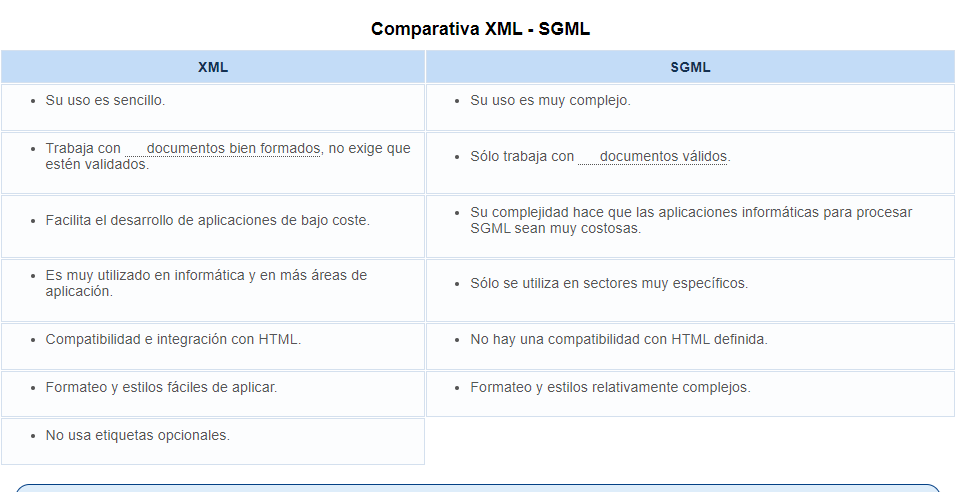

## 1. Definición y clasificación de lenguajes de marcas

Los lenguajes de marcas sirven para **codificar un documento** donde, junto con el texto, se incorporan etiquetas, marcas o anotaciones con información adicional sobre la estructura del texto o su forma de presentarlo. 
El lenguaje de marcas especifica cuáles son las etiquetas posibles, dónde deben colocarse y el significado que tendrá cada una de ellas. 
Puede explicitar la estructura del documento, su contenido semántico o cualquier información que quiera hacerse presente.

Los lenguajes de marcas están definidos en un documento (DTD) en el que se establecen las marcas, los elementos usados por el lenguaje, sus etiquetas, atributos, sintaxis y normas de uso.

Usos:
- Dar formato a los documentos de texto
- Definir la estructura de datos de un documento
- Intercambio de ficheros entre aplicaciones y plataformas

Los lenguajes de marcas pueden clasificarse en tres grupos:
- **Orientados a presentación**: Usados por los procesadores de textos y codifican cómo ha de presentarse el documento. Ej.: Palabra en negrita, espacio entre caracteres. Las marcas se ocultan al usuario (WYSIWYG)
- **De procedimientos**: Orientados a presentación pero dentro de un marco que permite definir macros (secuencias o acciones). El programa debe interpretar el código en el mismo orden en el que aparece (TeX, laTeX, Postcript)
- **Descriptivos o semánticos**: Indican qué es esa información. No especifica cómo deben representarse.

#### Ejemplos de lenguajes de marcado
- Documentación electrónica:
**RTX** Formato de texto enriquecido. Intercambio de documentos de texto entre procesadores de texto. 
**TeX**. Ecuaciones matemáticas
**Wikitexto**: Páginas wiki en servidores preparados
**DocBook**: Generar documentos separando la estructura lógica del documento de su formato.

- Tecnologías de internet
**HTML, XHTML**. Creación de webs.
**RSS**. Difusión de contenidos web

- Otros
- **MathML**: Formalismo matemático para ser entendido por sistemas y aplicaciones
- **VoiceXML**: Intercambio de información entre usuario y app de reconocimiento de voz
- **MusicXML**: Intercambio de partitura entre editores de partiruas

## 2. Evolución de los lenguajes de marcas

Los lenguajes de marcas surgen a finales de los 60 para introducir anotaciones en documentos electrónicos (lenguajes informáticos distintos de los lenguajes de programación y orientados a la gestión de información)
También surgen los  los lenguajes y sistemas de bases de datos, lenguajes orientados a representación, almacenamiento y consulta de grandes cantidades de datos.

Inicialmente LLMM surgen como lenguajes formados por códigos de formato que los procesadores de texto introducen para dirigir el proceso de presentación mediante una impresora. 
Ligados a las características de máquina, programa, procesador concreto... (Idea de marca de negrita, subrayado...)

Después, medio de presentación a la pantalla. Es suficiente con pulsar combinación de teclas o botones para los resultados requeridos. 

#### GML y SSGML

Para resolver el problema de falta de estandarización en los formatos de información usados por los programas. 
IBM construcción de sistema de edición, almacenamiento y búsqueda de documentos legales. Necesidad de un formato estándar. Válido para los distintos tipos de documentos. --> Se crea GML para describir los documentos de forma independiente a la plataforma y aplicación. --> Evoluciona hasta SGML (ISO 8879). Era complejo y requería de herramientas caras, relegado a aplicaciones industriales.

#### HTML

1989/1990. Tim Berners-Lee crea World Wide Web y, conociendo SGML, se encuentra con la necesidad de organizar, enlazar y compatibizar gran cantidad de información. A partir de SGML creó HTML, combinación de los dos estándares existentes:
- ASCII: Formato que permite transferencia de datos entre ordenadores al ser fácilmente interpretable
- SGML: Permite dar estructura al texto, resaltando títulos o aplicando formato

HTML es hoy día el tipo de documento más empleado del mundo. Gran sencillez. Pero caos debido a su facilidad de uso, provocando muchos documentos pero mal estructurados y sin respetar estándares. 

#### XML

En respuesta, aparece XML (1998), lenguaje de marcas estructural sin información de diseño que permite crear etiquetas adaptadas a necesidades (extensible). 
Es un metalenguaje y permite:
- Definir etiquetas propias
- Asignar atributos a etiquetas
- Usar esquema para definir de forma exacta etiquetas y atributos
- Estructura independiente del diseño 

>- **XSL**, eXtensible Style Language. Permite definir hojas de estilo para los documentos XML e> incluye capacidad para la transformación de documentos.
>- **XML Linking Language**, incluye Xpath, Xlink y Xpointer. Determinan aspectos sobre los enlaces entre documentos XML.
>- **XML Namespaces**. Proveen un contexto al que se aplican las marcas de un documento de XML y que sirve para diferenciarlas de otras con idéntico nombre válidas en otros contextos.
>- **XML Schemas**. Permiten definir restricciones que se aplicarán a un documento XML. Actualmente los más usados son las DTD.

## 3. Etiquetas elementos y atributos

- **Etiquetas** (tag): Encerradas entre "<" y ">". Normalmente una de inicio y otra de fin. 
- **Elementos**: Se organiza el contenido del documento o acciones que se desencadenan. Tiene etiqueta de inicio, de fin y lo que hay entre ambas.
- **Atributos**:  Par nombre-valor. Dentro de la etiqueta de inicio del elemento. Indica propiedades que deben llevar asociados. 

## 4. Herramientas de edición

Para trabajar en XML es necesario editar documentos y luego procesarlos.

"Un blog de notas y un navegador"

**Editores XML**
Basta un editor de texto para construir documento XML (texto plano). Importante que no formatee el texto para evitar código basura.
Para más complejos usar software de edición XML. Ayudará a crear estructuras, etiquetas... DTD, CSS, XSL... Amaya, Notepad++, Sublime Text, Netbeans...

**Procesadores XML**
Permite leer los documentos XML y acceder a contenido y estructura. Es un conjunto de módulos de software entre los que se encuentra un parser o analizador de XML, que comprueba que se cumplen las normas establecidas. Puede ser necesario que sea válido (validadores) o solo que esté bien formado. (no validadores). Siguen recomendaciones de W3C.

Para publicar XML en internet se usan procesadores XSLT para generar HTML a partir de XML.
Puesto que XML se usa para intercambio de datos se puede recurrir a motores que se ejecutan sin que nos demos cuenta (XML para Java de IBM, JAXP de Sun...)
Puede usarse cualquier navegador. 