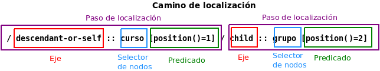

Con frecuencia es necesario transformar la información de un documento XML en otro.

Para transformar los documentos entran en juego tres especificaciones:
- XSL o **XSLT** (eXtensible Stylesheet Language Transformations): Definir modo de transformar un XML en otro
- **XSL-FO** (eXtensible Stylesheet Language Transformations - Formatting Objects): Transformar XML en formato legible e imprimible por una persona, como un PDF
- **Xpath**(Ruta X): Acceso a componentes de documento XML

La parte de transformaciones ganó en importancia y se llega a la terminología actual que comprende a las anteriores:  **XSL** (eXtensible Stylesheet Language).
Es un lenguaje que interpreta hojas de estilo.


	En 1997 se propone a W3C un lenguaje basado en XML que especificase el formato de documentos XML (como CSS a HTML), separando contenido de presentación. Se empieza a desarrollar XSL (con formato y contenido junto en el mismo documento). Para mantener la independencia se tomó como criterio que el documento con formato se generaría a partir del documento con los contenidos (se desarrolla XSLT; obteniendo por el camino XPath para localizar partes de un XML; observando el potencial de XSLT para transformar en cualquier otro contenido XML, lazando XSL-FO. XSLT y Xpath se siguen usando y se siguieron lanzando especificaciones desgajadas de XLS, que, a su vez, se renombró a XSL-FO. Este no ha tenido mucho éxito ya que es complejo y hay otros estándares CSS que hacen lo mismo.)

Para realizar las transformaciones se usan **procesadores XSL**. A ellos se les indica el archivo de entrada XML y XSL. Si no tienen errores, generan el archivo deseado. 

## 1. XPath

Lenguaje, no basado en XML, que permite localizar o acceder a una parte de un documento XML

- Se basa en una relación de parentesco entre los nodos del documento:  representación del documento XML llamada árbol de nodos o modelo de datos XPath
- Inicialmente diseñado para ser usado con XSLT y XPointer. Hoy día es usado en XSLT, XML Schema, XQuery, Xlink, Xpointer, Xforms...
- Su notación es **similar a las rutas de los ficheros**, salvo que XPath está diseñado para selecciones múltiples.

El documento XML en primer lugar debe ser procesado por un analizador o parser XML que:
- verifica que el documento XML está bien formado
- lo valida contra el DTD / XSD correspondiente
- construye el árbol de nodos
### 1.1. Modelo de datos de XPath: El árbol de nodos

Un árbol es una estructura que representa una serie de elementos (nodos) unidos por líneas (vértices). Entre dos nodos cualesquiera solo ha y un único camino y ninguno de ellos forma un bucle. Tiene forma de copa de árbol invertida. 

Hay siete distintos tipos de nodos.

- **Nodo raíz**: Primer nodo del árbol. No tiene padre. No debe confundirse con el elemento raíz del documento XML. Tiene como hijos al ejemplar (elemento raíz del XML) y, en su caso, los comentarios e instrucciones que formen parte del prólogo XML. Se indentifica con "/".
- **Nodos elemento**: Hay uno por cada elemento XML. Tienen un solo padre que puede ser otro nodo elemento o el nodo raíz. Pueden tener un identiificador único, para lo cual debe estar declarado de tipo ID en su DTD o en el XML Schema asociado.
- **Nodos atributo***: Almacenan los atributos del documento XML. El nodo atributo está asociado a un único nodo elemento que es padre de este. Desde el punto de vista del nodo elemento no se considera a sus atributos como nodos hijos. Los nodos atributos son nodos hoja, no pueden tener nodos hijos. 
- **Nodos texto** (o contenido): Almacenan los valores alfanuméricos de los contenidos de los elementos XML. Son nodos hoja (sin hijos). Los valores de los atributos no se almacenan en un nodo texto.
- **Nodos de comentario**  y **Nodo de instrucciones de proceso.** Se generan para elementos con comentario e instrucciones de proceso. Son hijos del elemento en el que aparezcan o del nodo raíz si están situados fuera del elemento raíz. Por estos elementos el nodo raíz del modelo no coincide con el elemento raíz del documento ya que puede haber comentarios o instrucciones fuera del raíz.
- **Nodo espacio de nombres**: Cada nodo elemento puede tener un conjunto asociado de nodos espacios de nombres, uno para cada uno de los distintos prefijos de espacio de nombres incluyendo, si es el caso, el espacio de nombres por defecto. Tiene un funcionamiento parecido a los atributos. El nodo espacio de nombres tiene un único nodo elemento como padre. Desde el punto de vista del nodo elemento no son considerados como nodos hijos de este. Son nodos hoja. 

(Las etiquetas permiten estructuras la información del documento XML pero no son consideradas nodos)

----------


Observa que del nodo raíz (que no corresponde con el elemento raíz del XML) cuelga el ejemplar y el comentario.  También que los valores de los atributos no aparecen en nodos texto sino junto al identificador del atributo en el nodo atributo (identificador y valor).

### 1.1.1. Las relaciones entre nodos

En primer lugar definamos:

- **Nodo actual**: El que se menciona al evaluar una expresión XPath
- **Nodo contexto**: Cada expresión está formada por subexpresiones que se evalúan antes de resolver la siguiente. Los nodos obtenidos tras evaluar una expresión, usada para evaluar la siguiente son el nuevo contexto. -> Es el nodo en el que nos posicionamos para establecer una relación.
- **Tamaño del contexto**: Número de nodos que se evalúan en un momento dado en una expresión XPath. 

Hay trece relaciones entre nodos que serán usadas como ejes en los pasos de localización.

**EJES**:
- **self**: Nodo de contexto 
- **child**: Hijos del nodo de contexto
- **descendant**: Hijos del nodo de contexto y todos sus descendientes
- **descendant-or-self**: Nodo contexto y sus descendientes
- **parent**: Padre del nodo contexto, si lo hay
- **ancestor**: Ancentros del nodo de contexto: Padre, padre de su padre,... Incluye al nodo raíz salvo que el nodo contexto sea el nodo raíz.
- **ancestor-or-self**: Nodo de contexto y sus ancestros. Incluirá siempre al nodo raíz. 
- **preceding**: Nodos del mismo documento que el nodo contexto que están antes de este según el orden del documento excluyendo ancestros, nodos atributo y nodos de espacios de nombres
- **preceding-sibling**: Hermanos precedentes del nodo contexto; Si el nodo contexto es un nodo atributo o un nodo espacio de nombres este eje está vacío.
- **following**: Todos los nodos del mismo documento que el nodo contexto que están después de este según el orden del documento, excluyendo los descendientes y los nodos atributo y nodos de espacios de nombres
- **following-sibling**: Hermanos del nodo contexto. Si el nodo contexto es un nodo atributo o nodo espacio de nombres, este eje está vacío.


- **attribute**: Atributos del nodo contexto. Es vacía si el nodo contexto no es un nodo elemento (otros no pueden tener atributos)
- **namespaces**: Nodos espacio de nombres del nodo contexto. Relación será vacía si el nodo contexto no es nodo elemento (otros no pueden tener espacios de nombres)

### 1.2. Expresiones de la sintaxis de XPath y su resultado

Es parecida a la que se usa en los árboles de directorios y archivos de los sistemas operativos. 

Se tiene una versión completa:

```xpath
descendant-or-self::curso[position()=1]/child::grupo[position()=2]/child::alumno[last()]/child::nombre/child::node()
```

Y una **versión simplificada** (Que es la que habitualmente se usa):

```xpath
//curso[1]/grupo[2]/alumno[last()]/nombre/text()
```

En la expresión XPath se pueden usar llamadas a funciones, operaciones matemáticas y operaciones lógicas.

El camino de localización XPath se evalúa devolviendo un resultado que puede ser: 
- **Conjunto de nodos (node-set)**. Una lista de nodos. El orden en el que aparecen en la lista es el mismo en que aparecen en el documento. Se devuelve cuando los operadores usados seleccionan nodos del modelo. Se considera que todos los elementos del node-set son hermanos, independientemente de lo que fuesen originalmente. Los subárboles de un nodo no se consideran elementos del conjunto (hijos de los nodos del node-set, que son accesibles)  
	Los nodos pueden ser de 7 tipos: Elemento, Atributo, Texto, Espacio de nombres, Instrucción de procesamiento, Comentario, Raíz, Booleano, Número y Cadena.
- **boolean**: Valor verdadero o falso, devuelto con operadores lógicos o de comparación
- **number**: Un número en punto flotante. Se devuelve con operadores numéricos. 
- **string**: Cadena de caracteres. Cuando se seleccionan nodos de texto, comentarios o atributos. 

Existen como palabras reservadas:
- Los ejes: `ancestor`, `ancestor-or-self`, `descendent`, `descendent-or-self`, `following`, `following-sibling`, `namespace`, `parent`, `preceding`, `preceding-sibling`, `self`
- Los selectores de nodos: `node()`, `text()`, `comment()`, `procesing-instruction()`
- Operaciones lógicas: `and`, `or`, `not()`
- Operaciones matemáticas: `div`, `mod`

Los siguientes símbolos tienen una función definida:
- Agrupación de operaciones con paréntesis `()`
- Predicados con corchetes `[]`
- Abreviatura elemento actual `.`
- Abreviatura elemento padre `..`
- Abreviatura atributo `@`
- Todos los tipos de nodos `*`
- Separador eje-selector `::`
- Separador de pasos de localización `/`
- Abreviación del paso `descendant-or-self::node()` `//`
- Referencia a variable `$`
- Unión de conjuntos de nodos `|`
- Coma `,`
- Operaciones lógicas: `=', ' !=', '<', '>', '<=', '>='
- Operaciones matemáticas `+`, ' -', `*`

También se usan:
- Nombres cualificados de los identificadores del documento XML
- Nombres de las funciones
- Nombres de referencias a variables (anteponiendo $)
- Números y literales (Con comillas simples o dobles, posibilidad de anidar alternando comillas)


Ejemplo: Alumnos de 2 ESO A

`/child::colegio/child::curso[@nivel="2"]/child::grupo[@orden="A"]/child::alumno
`
`//colegio/curso[@nivel="2"]/grupo[@orden="A"]/alumno`

Ejemplo: Alumnas llamadas Ana

`descendant-or-self::alumno[nombre="Ana"]
`
`//alumno[nombre="Ana"]`

Ejemplo: Nombre del con la nota más alta

`descendant-or-self::alumno[child::nota_media=max(/descendant-or-self::nota_media)]/child::nombre
`
`descendant-or-self::alumno[nota_media=max(//nota_media)]/nombre`

### 1.3. Caminos de localización y pasos de localización 



- Los **caminos de localización** son la ruta que hay que seguir por el árbol de datos para localizar un nodo. No son lo más común en XPath, pero sí lo más importante. 
- Están compuestos por **pasos de localización** separados entre sí por `/`.
- Los pasos de localización se separan en **eje** y **selector de nodos**  por `::`. En algunos pasos de localización hay instrucciones entre corchetes `[]` después del selector de nodos que reciben el nombre de **predicados**

Los caminos de localización pueden ser:
- Absolutos: Comienzan en el nodo raíz. Fácilmente reconocible por empezar con la barra simple: `/child::colegio/child::curso/child::grupo/attribute::*`
- Relativo: Relativo al nodo contexto que esté posicionado en un determinado lugar: `child::grupo/atribute::*`

Es posible usar el operador de unir para unir el resultado de dos caminos de localización para que devuelvan conjuntos de nodos: `descendant-or-self::apellidos | descendant-or-self::nota_media`

Dentro de los **pasos de localización**:
- El eje: Especifica relación jerárquica entre los nodos seleccionados por el paso de localización y el nodo contextual
- Selector de nodos o prueba de nodos: Especifica el tipo de nodo de los nodos seleccionados por el paso de localización
- Predicados: Usan expresiones lógicas para refinar el conjunto de nodos seleccionados. 

#### Ejes
Respecto a los ejes, recordar que para seleccionar atributos o espacios de nombres deben usarse de forma explícita los ejes `::attribute` o `::namespace`, ya que no estarán contenidos en los otros ejes. 
#### Selectores de nodos
Cada eje tiene un tipo principal de nodos. Si un eje pùede contener elementos, el nodo principal son los elementos. Si no, son los que el eje contenga (attribute atributos; namespace espacios de nombres; el resto elementos).

Los selectores de nodos son
- Nombre cualificado (QName)
- Todos `*`
- `text()`
- `comment()`
- `processing-instruction()`
- `node()`
También se han añadido en versiones posteriores
- `element()`
- `attribute()`
- `document-node()`

`child::alumno` Selecciona los elementos alumno hijos del nodo contexto. Si no lo tiene, selecciona un conjunto de nodos  vacíos.
`attribute::nivel`. Selecciona el atributo nivel del nodo contexto. Si no lo tiene, selecciona un conjunto de nodos vacío.
`text()` Para cualquieer nodo de texto.  `child::text()`, nodos de texto hijos del nodo contexto
`comment()` Cierto para cualquier nodo comentario
`procesing-instruction()`, puede tener un argumento literal; verdadero para cualquier instrucción de procesamiento con nombre igual al literal
`node()` Cierto para cualquier nodo

Ejemplos:
`/descendant-or-self::alumno/child::nombre`  (Elementos `<nombre>`)
`/descendant-or-self::grupo/attribute::*`  (Atributos de `<grupo>`)
`/descendant-or-self::apellidos/text()` (Texto del elemento de apellidos)
`/descendant-or-self::colegio/child::comment()` (Comentarios del elemento colegio)
`/descendant-or-self::grupo/child::node()` (Todos los elementos contenidos en el `<grupo>`)

#### Sintaxis abreviada

`child::` puede ser omitida en los pasos   `child::colegio/child::curso`  equivale a `/colegio/curso`

`attribute::` puede abreviarse como `@`   `[attribute::orden="A"]` equivale a `@attribute=orden"A"`

`//` es abreviatura de `descendant-or-self::node()`  `/descendant-or-self::node()/child::alumno` equivale a `//alumno`.  Igualmente `child::curso/descendant-or-self::node()/child::alumno`equivale a `curso//alumno`

`descendant-or-self::node()/child::nota_media` se abrevia en  `//nota_media`
child::colegio/child::curso/attribute::etapa se abrevia en  `colegio/curso/@etapa`   (camino relativo)
`descendant-or-self::alumno/parent::node()/attribute::*` se abrevia en  `//alumno/../@*`
`self::node()/descendant::telefono` se abrevia en  `./descendant::telefono `  (camino relativo)
### 1.4. Predicados

Los predicados filtran un conjunto de nodos con respecto a un eje y a un selector de nodos para producir un nuevo conjunto de nodos. 
El paso del localización puede tener cero, uno o más predicados en cascada.
Un camino de localización `grupo[2]` es equivalente a `grupo[position()=2`] .

Ejemplos:
a) Primer alumno de 2 ESO A.
`//curso[@nivel="2"]/grupo[@orden="A"]/alumno[1]`
b) Apellidos de los alumnos con nota superior a 8.
`//alumno[nota_media>8]/apellidos` 
c) Nombre de los alumnos que no nacieron en el 2017 y tienen media superior a 7.
`//alumno[anno_nac!=2017][nota_media>7]/nombre`
`//alumno[anno_nac!=2017 and nota_media>7]/nombre`
d) Apellidos de los alumnos que nacieron en el 2019 y que están suspensos.
`//alumno[anno_nac=2019 or nota_media<5]/apellidos`

### 1.3. Funciones

#### Funciones de conjuntos de nodos
- `last()`: Último de los nodos del contexto seleccionado. 

```xpath
//alumno[position()=1]/nombre 
//alumno[1]/nombre
```

- `position()`: Posición del nodo actual dentro de los nodos del contexto seleccionado (inicializa en 1)

```xpath
//curso[@nivel="2"]//alumno[last()]/(nombre|apellidos)
```

- `count(node-set)`: Número de nodos del conjunto de nodos pasado como argumento

```xpath
count(//alumno[anno_nac=2018])
//curso[@nivel="2"]/grupo/count(alumno)
count(//curso[@nivel="1"]/grupo/alumno)
```

* `name(?node-set)`: Nombre cualificado del nodo del conjunto de nodos pasado como argumento. Si no se pasa argumento, toma el nodo contexto como argumento. Si no se declara espacio de nombres da el mismo resultado que `local-name()`
* `local-name(?node-set)`: Nombre local (sin URI) del espacio de nombres del nodo del conjunto de nodos pasado por argumento. Si no se pasa el argumento toma nodo contexto como argumento
* `namespace-uri(?node-set)`: Devuelve la URI del espacio de nombres, si nel nombre local de los nodos pasados como argumento. Si no se pasa, toma el nodo contexto como argumento.
* `id(object)`: Selecciona elementos mediante el identificador único. Los nodos deben estar declarados con ese ID en el DTD o XSD.
#### Funciones de cadenas de caracteres

- `string(object?)`: Convierte objeto en cadena de caracteres
- `concat(...)`: concatenación de argumentos
- `starts-with(string, with)`: si comienza por la segunda cadena
- `contains(string, contains)`: si contiene la segunda cadena
- `substring-before(string, string)`: subcadena de la primera cadena que precede a la aparición de la segunda
- `substring-after(string, string)`: subcadena de la primera cadena que sigue a la aparición de la segunda
- `substring(string, number, ?number)`: substring comienza en posición especificada en el segundo y tiene longitud especificada en el tercero
- `string-length(string?)`: Longitud
- `normalize-space(string?)`: normalización de espacios en blanco
- `translate(string, string, string)`: el primer argumento se traducen las apariciones del segundo con lo indicado en el tercero

Ejemplos:
a) Alumnos que su nombre comiencen por 'Al'
`//alumno[starts-with(nombre,"Al")]`
b) Nombre y apellidos de los alumnos que se apelliden 'Carmona' tanto de primero como de segundo apellido.
`//alumno[contains(apellidos,"Carmona")]/(nombre|apellidos)/text()`
c) Del texto "En un lugar de la Mancha" extrae todo lo que hay delante de 'de'.
`substring-before("En un lugar de la Mancha","de")`
d) Del texto "En un lugar de la Mancha" extrae todo lo que hay detrás de 'de'.
`substring-after("En un lugar de la Mancha","de")`
e) Del texto "En un lugar de la Mancha" extrae todo lo que hay detrás de 'de'.
`substring-after("En un lugar de la Mancha","de")`
f) Del texto "En un lugar de la Mancha" extrae todo lo que hay a partir del carácter número 9.
`substring("En un lugar de la Mancha",9)`
g) Del texto "En un lugar de la Mancha" calcula el número de caracteres que tienes. 
`string-length("En un lugar de la Mancha")`
h) Normaliza un texto, quitando los espacios iniciales y finales y poniendo un único espacio entre palabras.
`normalize-space(" Esto    es      una   prueba      ")`
g) Sustituir los caracteres en el primer texto que aparecen en el segundo texto por los del tercero.
`translate("abcdefghi","bdg","BDG")`

#### Funciones lógicas y numéricas

- `boolean(object)`: Argumento convertidfo a booleano
- `not(boolean)`
- `true()`
- `false()`
- `lang(string)` Verdadero o falso si el lenguaje del nodo especificado en `xml:lang` es igual que o sublenguaje del especificado como argumento
- `number(object?)`: Pasa a número
- `sum(node-set)`: Suma de los nodos del conjunto de nodos
- `floor()`: Redondeo hacia abajo
- `ceiling()`: Redondeo hacia arriba
- `round()`: Número más proximo al argumento y que sea entero

### 1.3. Estrategias de uso

- Buscar en el XML la posición del atributo y del elemento que se pregunten
- Ver cuál debe ser el resultado que queremos obtener y partir de ahí.
- Posicionar predicado:
	- Ponerlo en el primer elemento padre común
	- Mezclar ambos caminos de localización
- Simplificar

Al trabajar con información en distintos niveles es importante no usar doble barra en mitad de los caminos de localización ya que la búsqueda la reiniciará desde el elemento raíz y no con el elemento ya establecido. 

A veces habrá que hacer consultas anidadas.

A veces no querremos repetidos (esto se puede hacer con ayuda del eje `preceding`
`//alumno[not(nombre=preceding::nombre)]/nombre`

-------------------

```xml
<?xml version="1.0" encoding="UTF-8"?>
<!DOCTYPE universidad>
<universidad>
    <nombre>Universidad de Victoria</nombre>
    <pais>España</pais>
    <carreras>
        <carrera id="c01">
            <nombre>I.T. Informática</nombre>
            <plan>2003</plan>
            <creditos>250</creditos>
            <centro>Escuela de Informática</centro>
        </carrera>
        <carrera id="c02">
            <nombre>Dipl. Empresariales</nombre>
            <plan>2001</plan>
            <creditos>275</creditos>
            <centro>Facultad de Ciencias Sociales</centro>
        </carrera>
        <carrera id="c03">
            <nombre>Dipl. Relaciones Laborales</nombre>
            <plan>2001</plan>
            <creditos>280</creditos>
            <centro>Facultad de Ciencias Sociales</centro>
        </carrera>
        <carrera id="c05">
            <nombre>Lic. Biologia</nombre>
            <plan>2001</plan>
            <creditos>175</creditos>
            <centro>Facultad de Ciencias Experimentales</centro>
            <subdirector>Alonso Pérez</subdirector>
        </carrera>
        <carrera id="c06">
            <nombre>Lic. Humanidades</nombre>
            <plan>1980</plan>
            <creditos>475</creditos>
            <centro>Facultad de Humanidades</centro>
            <subdirector>Jesús Martínez</subdirector>
        </carrera>
    </carreras>
    <asignaturas>
        <asignatura id="a01" titulacion="c01">
            <nombre>Ofimática</nombre>
            <creditos_teoricos>3</creditos_teoricos>
            <creditos_practicos>1.5</creditos_practicos>
            <trimestre>l</trimestre>
        </asignatura>
        <asignatura id="a02" titulacion="c01">
            <nombre>Ingeniería del Software</nombre>
            <creditos_teoricos>6</creditos_teoricos>
            <creditos_practicos>1.5</creditos_practicos>
            <trimestre>2</trimestre>
        </asignatura>
        <asignatura id="a03" titulacion="c02">
            <nombre>Me la invento</nombre>
            <creditos_teoricos>6</creditos_teoricos>
            <creditos_practicos>1.5</creditos_practicos>
            <trimestre>2</trimestre>
        </asignatura>
    </asignaturas>
    <alumnos>
        <alumno id="e01">
            <apellido1>Rivas</apellido1>
            <apellido2>Santos</apellido2>
            <nombre>Víctor Manuel</nombre>
            <sexo>Hombre</sexo>
            <estudios>
                <carrera codigo="c01" />
                <asignaturas>
                    <asignatura codigo="a01" />
                    <asignatura codigo="a03" />
                    <asignatura codigo="a05" />
                </asignaturas>
            </estudios>
        </alumno>
        <alumno id="e02" beca="si">
            <apellido1>Pérez</apellido1>
            <apellido2>García</apellido2>
            <nombre>Luisa</nombre>
            <sexo>Mujer</sexo>
            <estudios>
                <carrera codigo="c02" />
                <asignaturas>
                    <asignatura codigo="a02" />
                    <asignatura codigo="a01" />
                </asignaturas>
                <proyecto>Web de IBM.com</proyecto>
            </estudios>
        </alumno>
    </alumnos>
</universidad>
```

**1 - Nombre de la Universidad:**
`/universidad`

**2 - País de la Universidad:**
`/universidad/pais`

**3 - Nombres de las Carreras:**
`/universidad/carreras/carrera/nombre`
`universidad/carreras/carrera/nombre`
`/universidad/carreras/carrera/nombre/text()`

**4 - Años de plan de estudio de las carreras:**
`/universidad/carreras/carrera/plan`

`/universidad//carrera/plan`  (Dentro de Universidad hay un elemento carrera, puede haber intermedios, no tiene por qué ser hijos directos)

`/universidad//*/carrera/plan` 

**5 - Nombres de todos los alumnos:**

`//alumnos/alumno/nombre`  (Cualquier estructura pero que después encuentre eso)

**6 - Identificadores de todas las carreras:**

`//carreras/carrera/@id`

**7 - Datos de la carrera cuyo id es c01:**
Hagamos un predicado (filtro):

`//carreras/carrera[@id='c01']`

Nombre de la carrera cuyo id es c01: `//carreras/carrera[@id='c01']/nombre`

Contenido del elemento carrera (llaves): `//carreras/carrera[@id='c01']/*`

**8 - Centro en que se estudia de la carrera cuyo id es c02:**

`/universidad/carreras/carrera[@id='c02']/centro`
`//carreras/carrera[@id='c02']/centro`
`//carreras/carrera/centro[../@id='c02']`

----
(Ojo, filtro en carrera y no en carreras. Porque si filtro en carreras, no va a encontrar un hijo id )

`//carreras[carrera/@id='c02']/carrera/centro`  Aquí estoy preguntando ¿existe alguna carrera con identificador c02, sí; pues pinto todas. 

**9 - Nombre de las carreras que tengan subdirector:**
`//carreras/carrera[subdirector]/nombre/text()
`
**10 - Nombre de los alumnos que están haciendo proyecto:**
`//alumnos/alumno[estudios/proyecto]/nombre/text()`

`//alumnos/alumno[./estudios/proyecto]/nombre` 
 `//alumnos/alumno[.//proyecto]/nombre` (Partiendo del directorio actual, que busque descendientes)
----
MAL Ruta absoluta: (Ojo, aqui uso ruta absoluta y le estoy preguntando que exista algún proyecto en TODO EL ARBOL. Cuidado con las rutas absolutas)
`//alumnos/alumno[//proyecto]/nombre`

**11 - Nombre de las carreras en las que hay algún alumno matriculado:**
`//carreras/carrera[@id=//alumnos/alumno//carrera/@codigo]/nombre/text()`
`//carreras/carrera[@id=//alumnos/alumno/estudios/carrera/@codigo]/nombre/text()`

**12 - Apellido y nombre de alumnos con beca:**

```
//alumnos/alumno[./@beca="si"]/nombre | 
//alumnos/alumno[./@beca="si"]/apellido1 |
//alumnos/alumno[./@beca="si"]/apellido2
```

**13 - Nombre de las asignaturas de la titulación c04:**

`//asignaturas/asignatura[./@titulacion="c01"]/nombre/text()`

**14 - Nombre de las asignaturas de segundo trimestre**

`//asignaturas/asignatura[./trimestre="2"]/nombre/text()`
`//asignaturas/asignatura[trimestre="2"]/nombre/text()`

**15 - Nombre de las asignaturas que no tienen 6 créditos teóricos:**

`//asignaturas/asignatura[creditos_teoricos!="6"]/nombre/text()`
`//asignaturas/asignatura[not(creditos_teoricos="6")]/nombre/text()`
`//asignaturas/asignatura[not(creditos_teoricos=6)]/nombre/text()`

**16 - Código de la carrera que estudia el último alumno:**
(Inicializa en "1")
`//alumnos/alumno[last()]//carrera/@codigo`

(El penúltimo) `//alumnos/alumno[last()-1]//carrera/@codigo`

(Las que no son 1) `//alumnos/alumno[position()!=1]//carrera/@codigo`

**17 - Código de las asignaturas que estudian mujeres:** 

`//alumnos/alumno[sexo="Mujer"]/estudios/asignaturas/asignatura/@codigo` (Se repetirian)

Mejor, sin repetir códigos
`//asignaturas/asignaturas[@id=//alumnos/alumno[sexo="Mujer"]//asignatura/@codigo]/@id`

-----------
-------------
-------------

## 2. XSLT

Gracias a XSL Transformations (XSLT) los procesadores pueden tranformar un documento XML en otros documentos XML, HTML o de texto plano con estructuras y contenidos distintos de los originales.   (No PDF)

La transformación expresada en XSLT da reglas para transformar un árbol de nodos origen en un árbol de nodos resultado. 
Se consigue asociado patrones definidos en la plantilla `xsl:template`. Un patrón, expresado en XPath, se compara con los elementos del árbol de origen. 
Si cumplen alguna de las reglas de la plantilla, pasan a formar parte del árbol de nodos resultado.
La estructura del árbol de nodos resultado puede ser completamente diferente a la estructura del árbol de origen.

En la hoja pueden usarse:
- **Elementos asociados al URI** http://www.w3.org/1999/XSL/Transform usando el prefijo `xsl`
- **Elementos de extensión**. Usados por los desarrolladores para funcionalidades extras
- **Elementos de resultado literal**: Se añaden al árbol de nodos resultado y no pertenecen al espacio de nombres (Elementos HTML, texto...)

El XLST se asocia al XML con la instrucción de procesamiento:
`<?xml-stylesheet type="text/xsl" href="colegio.xsl" ?>`
En cualquier caso al ejecutar el procesador XSLT se le puede indicar los documentos XML y XSL de la transformación.

### 2.1. Estructura de una hoja XSLT

Debe incluirse el prólogo XML. 
La hoja de estilos se declara así, con el siguiente espacio de nombres: 

```xsl
<?xml version="1.0" encoding="UTF-8"?>
<xsl:stylesheet xmlns:xsl="http://www.w3.org/1999/XSL/Transform" version="1.0">
...
</xsl:stylesheet>
```

Sinónimo de `<xsl:stylesheet>` es `<xsl:transform>`.
Como atributos se le puede indicar `version` que es "1.0" o "2.0", generalmente "1.0"

##### Simplificación de hojas de estilo con elementos de contenido literal

Si son elementos de contenido literal puede simplificarse:

```xml
<?xml version="1.0" encoding="UTF-8"?>
<xsl:stylesheet xmlns:xsl="http://www.w3.org/1999/XSL/Transform" version="1.0">
  <xsl:output method="html"/>
  <xsl:template match="/">
    <html>
      <head>
        <title>Colegio Cervantes</title>
      </head>
      <body>
        <h1>Nombre del colegio: <xsl:value-of select="colegio/nombre"/></h1>
        <p>Teléfono: <xsl:value-of select="colegio/telefono"/></p>
        <p>Suma de notas: <xsl:value-of select="sum(//nota_media)"/></p>
      </body>
    </html>
  </xsl:template>
</xsl:stylesheet>
```

Porque puede omitirse `<xml:stylesheer>` y `<xsl:output>`como elemento raíz y poner en su lugar `<html>`agregándole el espacio de nombres de XSLT y su versión (atributo obligatorio). 
Desde el contenido literal se puede acceder a las instrucciones del espacio de nombres xsl como si se hubiese seleccionado como patrón (`match="/"`) el nodo raíz del árbol de nodos origen.

Después pueden usarse instrucciones que no sean de nivel superior sin problema.
```xml
<html xsl:version="1.0"
      xmlns:xsl="http://www.w3.org/1999/XSL/Transform">
  <head>
    <title>Colegio Cervantes</title>
  </head>
  <body>
    <h1>Nombre del colegio: <xsl:value-of select="colegio/nombre"/></h1>
    <p>Teléfono: <xsl:value-of select="colegio/telefono"/></p>
    <p>Suma de notas: <xsl:value-of select="sum(//nota_media)"/></p>
  </body>
</html>
```


### 2.2. Elementos XSLT  de nivel superior

Son elementos del nivel superior aquellos que son hijos directos de `<xsl:transform>` o `<xsl:stylesheet>`
Su ámbito de aplicación es toda la hoja de estilos que se declara. Son estructuras contenedoras de instrucciones.  Pueden aparecer varias veces o no aparecer. Salvo `xsl:import` que debe aparecer en primer lugar, el  orden de aparición no es relevante.
Estos no pueden usarse dentro de otros elementos salvo `xsl:variable` y `xsl:param`

`xsl:template`: 

Tienen el atributo `match` donde se indican los nodos seleccionados  (o el atributo `name` que sirve para hacer referencia una plantilla mediante `xsl:call-template`. O uno u otro serán obligatorios). 
El atributo match no puede incluir uso de variables. 

El contenido que tiene las reglas que se ejecutarán cuando la plantillas sea usada.

En la hoja de estilos puede haber más de una plantilla. Cada plantilla puede hacerse coincidir con un nodo determinado.
- Plantilla vacía: Si hay una plantilla que se corresponde con un nodo y no tiene nada, no se muestra nada.
- Nodo sin plantilla asociada: Se muestra el contenido textual del nodo (sin atributos)

A veces puede haber varias plantillas y que no se comporten cómo esperamos. 
Por ejemplo quizás tenemos dos plantillas y vemos que a la segunda "no le hace caso" (porque ya recorrió todo el árbol de origen la primera). (No le pusimos `<xsl:apply-templates>)

De forma habitual se puede usar una única plantilla que acceda al elemento raíz. Dentro de esta, usar expresiones XPath para seleccionar las partes que se quieran e instrucciones de recorrido para construir la estructura que se desee.

Ejemplo:

```xml
<?xml version="1.0" encoding="UTF-8"?>
<xsl:stylesheet xmlns:xsl="http://www.w3.org/1999/XSL/Transform" version="1.0">
	  <xsl:output method="text" />
	  <xsl:strip-space elements="*"/>
	  <xsl:template match="/">
		    <xsl:apply-templates select="//alumno"/>
	  </xsl:template>
	  <xsl:template match="//alumno">
		    <xsl:apply-templates/>
	  </xsl:template>  
	  <xsl:template match="//anno_nac">
		    <xsl:text>privado</xsl:text>
	  </xsl:template>  
</xsl:stylesheet>
```

Simplificado a:

```xml
<?xml version="1.0" encoding="UTF-8"?>
<xsl:stylesheet xmlns:xsl="http://www.w3.org/1999/XSL/Transform" version="1.0">
  <xsl:output method="text" />
  <xsl:template match="/">
        <xsl:for-each select="//alumno">
          <xsl:value-of select="nombre"/>
          <xsl:value-of select="apellidos"/>
          <xsl:text>privado</xsl:text>
          <xsl:value-of select="nota_media"/>
        </xsl:for-each>
  </xsl:template>
</xsl:stylesheet>
```

`xsl:variable` y `xsl:param`: 
Nombre que se vincula a un valor. Tiene atributo `name` obligatorio. 
Cuando se use, debe ponerse el atributo name con el símbolo $ delante.

Otro atributo es `select` que si se le especifica una expresión xpath almacena el resultado en la variable.

`xsl:param` es predeterminado que se usa pero que puede ser sobreescrito cuando se invoca a una plantilla con `xsl:with-param`. `xsl:variable`, no.

`xsl:output`: 

Especifica el formato de salida deseado. Puede omitirse ya que el procesador XSLT devolverá el resultado como secuencias de caracteres.
Puede especificarse características como:
- method: Formato de salida (xml, html, text
- version: Versión del método de salida
- indent: Espacios en blanco adicionales (yes/no)
- encoding: Codificación
- standalone: Relación con otros documentos (yes/no)
- media-type, doctype-system, doctype-public, omit-xml-declaration, cdata-section-elements

`xsl:import`: y `xsl:include`:  Añadir contenido a la hoja de estilo (Import: con menor preferencia que los de la hoja. Include: con la misma). Ambos tienen un atributo `href`  para indicar dónde se encuentran.  

`xsl:strip-space` y `xsl:preserve-space`: Para indicar comportamiento respecto a los espacios.  

`xsl:key`:  Declarar elemento como clave para que pueda usarse como tipos de datos ID, IDREF, IDREFS. Declara una clave que puede usarse en otro lugar de la hoja de estilos con función `key()`  

`xsl:decimal-format`: Define formato para convertir números en cadenas de caracteres.  

`xsl:namespace-alias`: Prefijo alternativo para el espacio de nombres.  

`xsl:attribute-set`: Grupos de atributos reutilizables en los elementos `xsl:element` y `xsl:copy` mediante el atributo use-attribute-sets.  

### 2.3. Otros elementos XSLT

#### Instrucciones de manipulación de plantillas

`xls:apply-templates`:  Indicar que queremos que se continúe la búsqueda de plantillas en los elementos hijos (sin pasar al siguiente elemento hermano). Se indica mediante el atributo `select`, indicando el conjunto de nodos hijos que queremos que se recorran y buscando plantillas que se correspondan con ellos.  Puede aparecer como contenido `xsl:sort` para ordenar los resultados antes de aplicar la plantilla .También puede estar `xsl:with-param` para pasar valores a la plantilla que sobreescriben los por defecto indicados en `xsl:param`

```xml
<?xml version="1.0" encoding="UTF-8"?>
<xsl:stylesheet xmlns:xsl="http://www.w3.org/1999/XSL/Transform" version="1.0">
  <xsl:output method="text" />
  <xsl:strip-space elements="*"/>

  <xsl:template match="/">
    <xsl:apply-templates select="//alumno"/>
  </xsl:template>

  <xsl:template match="//alumno">
    <xsl:apply-templates/>
  </xsl:template>  

  <xsl:template match="//anno_nac">
    <xsl:text>privado</xsl:text>
  </xsl:template> 

</xsl:stylesheet>
```

Y en una sola plantilla:

```xml
<?xml version="1.0" encoding="UTF-8"?>
<xsl:stylesheet xmlns:xsl="http://www.w3.org/1999/XSL/Transform" version="1.0">
  <xsl:output method="text" />

  <xsl:template match="/">
        <xsl:for-each select="//alumno">
          <xsl:value-of select="nombre"/>
          <xsl:value-of select="apellidos"/>
          <xsl:text>privado</xsl:text>
          <xsl:value-of select="nota_media"/>
        </xsl:for-each>
  </xsl:template>

</xsl:stylesheet>
```

`xls:call-template`:  Invocar  a una plantilla declarada con atributo `name`

`xsl:with-param`:  Pasar valores a una plantilla que sobreescribirán los indicados por el elemento `xsl:param` que tengan el mismo atributo name.

#### Instrucciones de control

`xsl:for-each` : Bucle que recorre de uno en uno todos los nodos indicados. Se hace  en el orden en el que son procesados salvo usar `xsl:sort`

`xsl:if`: Bloque condicional. Solo se ejecuta parte de la plantilla si se cumple la condición en el atributo `test`

Vamos a realizar una transformación en la que vamos a ordenar los alumnos por orden de apellido descendente y de cada uno de ellos mostraremos su nombre y su fecha de nacimiento o su nota media dependiendo de si su posición es par o impar.

```xml
<?xml version="1.0" encoding="UTF-8"?>
<xsl:stylesheet xmlns:xsl="http://www.w3.org/1999/XSL/Transform" version="1.0">
  <xsl:output method="html" version="5.0" indent="yes" />
    
  <xsl:template match="/">
    <html>
      <body>
        <ol>
          <xsl:for-each select="//alumno">
            <xsl:sort select="apellidos" order="descending"/>
            <li>
              <xsl:if test="((position() mod 2)=1)">
                <xsl:value-of select="nombre"/>
                <xsl:text>. Fecha de nacimiento: </xsl:text>
                <xsl:value-of select="anno_nac"/>
              </xsl:if>
              <xsl:if test="((position() mod 2)=0)">
                <xsl:value-of select="nombre"/>
                <xsl:text>. Nota media: </xsl:text>
                <xsl:value-of select="nota_media"/>
              </xsl:if>
            </li>            
          </xsl:for-each>
        </ol>
      </body>
    </html>
  </xsl:template>
    
</xsl:stylesheet>
```

Esta misma transformación también se podría hacer sustituyen el xsl:for-each por una llamada recursiva a otra plantilla mediante `xsl:apply-templates`.

`xsl:choose`, `xsl:when`, `xsl:otherwise`: 
Permite evaluar condicionales con más de un caso posible.
Secuencia de elementos `xsl:when` seguidos de elemento `xsl:otherwise`
Los `when` tienen atributos `test` donde se especifica la expresión. 

`xsl:sort`: Ordenar elementos. Debe agregarse como elemento hijo de `xsl:apply-templates` o `xsl:for-each` (En este caso debe ser el primer hijo). En el atributo `select` se indica una expresión que devuelva una cadena de caracteres que servirá como clave de ordenación. El valor por defecto del atributo es el nodo actual (.)
Otros atributos son `order` (ascending, descending); `lang` para el lenguaje de la clave (alfabeto); `data-type` para el tipo de dato (text, number, nombre cualificado): `case-order` para casos especiales (upper-first, lower-first, para text por ejemplo)

```xml
<?xml version="1.0" encoding="UTF-8"?>
<xsl:stylesheet xmlns:xsl="http://www.w3.org/1999/XSL/Transform" version="1.0">
  <xsl:output method="html" version="5.0" indent="yes" />
    
  <xsl:template match="/">
    <html>
      <head>
        <style>
          .aprobado {color:green;}
          .suspenso {color:red;}
          .sobresaliente {color:blue}
        </style>
      </head>
      <body>
        <table border="0">
          <thead style="background-color:gray; color:white;">
            <th>NOMBRE</th>
            <th>APELLIDOS</th>
            <th>NOTA MEDIA</th>
          </thead>
          <tbody style="background-color:white;">
          <xsl:for-each select="//alumno">
            <xsl:sort select="apellidos"/>
            <xsl:element name="tr">
              <xsl:attribute name="class">
                <xsl:choose>
                  <xsl:when test="nota_media < 5">suspenso</xsl:when>
                  <xsl:when test="nota_media < 9">aprobado</xsl:when>
                  <xsl:otherwise>sobresaliente</xsl:otherwise>
                </xsl:choose>
              </xsl:attribute>
              <td><xsl:value-of select="nombre"/></td>
              <td><xsl:value-of select="apellidos"/></td>
              <td style="text-align: center;"><xsl:value-of select="nota_media"/></td>
            </xsl:element>
          </xsl:for-each>
          </tbody>
        </table>
      </body>
    </html>
  </xsl:template>
    
</xsl:stylesheet>
```

#### Instrucciones de salida

`xsl:value-of`: Generar texto extrayéndolo del árbol de origen ,usando expresión XPath o insertando el valor de una variable. Crea un nodo text en el árbol de nodos destinos. Tiene un atributo obligatorio `select` para la expresión que será evaluada. 
Para añadir un conjunto de nodos usar en lugar de este, `xsl:copy-of`

`xsl:number`: Insertar número formateado. Se especifica en el atributo `value`. La expresión se evalúa y el objeto se convierte a número que se redondea a entero y se convierte a cadena de caracteres. Hay atributos que controlan la numeración `level` (niveles del árbol de origen que se usan: single, multiple, any; por defecto single). `count` qué nodos serán contados (semejantes al nodo contexto por defecto); `from` desde donde empezar a contar. 

`xsl:element`: Crear elemento con el nombre indicado por `name`. En `namespace` puede indicársele atributo opcional.

`xsl:attribute`: Añadir atributos a los elementos creados en una plantilla mediante `xsl:element`o directamente con etiquetas de apertura y cierre. Se indicará mediante `name`, puede indicársele `namespace`. Puede construirse con uso de llaves (attribute value template): Construir con etiqueta y el valor ponerlo entre llaves. Si tiene varios atributos o atributo que se quiere reutilizar usar `attribute-set`

`xsl:text`: Crear nodos textos. Aplica lo que se haya especificado en `xsl:strip-space` y `xsl:preserve-space`

`xsl:comment`: Crear nodo comentarios en árbol de nodos destino.

`xsl:processing-instruction`: Crear nodo de instrucciones de procesamiento. Atributo `name` debe especificar nombre o clase de la instrucción de procesamiento. 


##### Ejemplito: 

```xml
<?xml version="1.0" encoding="UTF-8"?>
<xsl:stylesheet xmlns:xsl="http://www.w3.org/1999/XSL/Transform" version="1.0">
  <xsl:output method="xml" version="1.0" indent="yes" />
  <xsl:template match="/">
<xsl:text>
</xsl:text>
    <xsl:comment>Documento de estilos CSS vinculado al archivo XML resultante</xsl:comment>
<xsl:text>
</xsl:text>
    <xsl:processing-instruction name="xml-stylesheet">href="style.css" type="text/css"</xsl:processing-instruction>
<xsl:text>
</xsl:text>
    <xsl:element name="listado">
    <xsl:comment>Listado de alumnos ordenados por notas cuyo nombre empieza por A</xsl:comment>
      <xsl:for-each select="//alumno[starts-with(nombre,'A')]">
        <xsl:sort select="nota_media" order="descending" data-type="number"/>
        <xsl:element name="persona">
          <xsl:attribute name="calificacion">
            <xsl:value-of select="nota_media"/>
          </xsl:attribute>
          <xsl:attribute name="num_orden">
            <xsl:number value="position()" format="&#x30A2;"/>
          </xsl:attribute>
          <xsl:value-of select="nombre"/>
          <xsl:text> </xsl:text>
          <xsl:value-of select="apellidos"/>
        </xsl:element>
      </xsl:for-each>
    </xsl:element>
  </xsl:template>
</xsl:stylesheet>
```

#### Otras instrucciones XSLT

`xsl:copy`: Añade el nodo actual al árbol de destinos. **Se copian también sus nodos de espacios de nombres pero no los nodos atributos ni los hijos.** Puede usar `use-attribute-sets`para añadir conjuntos de atributos declarados anteriormente. Solo puede usarse con nosotros que puedan tener atributos o eleentos hijos, (nodo raiz y nodos elemento)   

`xsl:copy-of`: Añadir fragmento completo del árbol de nodos origen al árbol de destino. No es necesario convertirlo a cadena de caracteres. Tiene atributo `select` donde debe indicarse expresión XPath del árbol a copiar. **Copia propio elemento y nodos atributos, espacios de nombres e hijos**

`xsl:apply-imports`:  Indicar cuándo realizar importación para sobreescribir regla de plantillas

`xls:fallback`:  Secuencia ordenada de ejecución

### 2.4. Funciones propias de XSLT

`document()` Puede accederse a los datos de otros ficheros (Se usa en XPath pero es propia de XSLT). 
- `document(URI)`  (Elemento raíz del documento XML que se localiza en esa URI)
- `document(nodo)` Conjunto de nodos cuya raíz es el nodo nado.
- si no se indica parámetro, se toma el documento actual.

`key(string, object)`: Similar a `id()` de XPath. Primer parámetro nombre de la clave que debe ser nombre cualificado indicado en elemento `xsl:key`. Segundo argumento debe ser el valor de la clave. Devuelve el conjunto de nodos que cumplen esas condiciones. 

`format-number(number, number, string?)`:  Convierte el primer parámetro a una cadena de caracteres siguiendo el patrón indicado en el segundo parámetro. El tercer argumento es el nombre del `xsl:decimal-format` que se usará., 

`current()`:  Devuelve el valor del nodo contexto. Normalmente se sustituye por su versión abreviada. `<xsl:value-of select="current()"/>`  equivale a `<xsl:value-of select="."/>`.

`generate-id(node-set?)`: Genera identificador único para el conjunto de nodos pasados por parámetro o del contexto actual.

Otras funciones: ` unparsed-entity-uri()`, `system-property()`, `element-available() `y `function-available()`.


### 3. Procesadores XSLT

Un **procesador XSLT** es una aplicación que realiza transformación partiendo de documento XML y siguiendo las reglas indicadas en un documento XSLT para dar lugar a uno de los formatos permitidos: XML, HTML, texto plano.

>El procesador XSLT cuando lee el archivo XML inicial y crea una árbol de nodos origen. A continuación va procesando las instrucciones de la hoja de estilos recogida en el documento XSLT. Esta hoja de estilos contendrá una o varias plantillas. Cada plantilla tendrá una expresión de emparejamiento. Estas expresiones serán buscada en el archivo XML original y si encuentra elementos compatibles se ejecutan las instrucciones oportunas. Estas instrucciones irán generando un árbol de nodos destino. Una vez recorridas todas las plantillas y generado todo el árbol de nodos destino este será escrito en un archivo de salida.

Empresas de procesadores XSLT:
- Saxon
- Gnome
- Apache
- Microsoft
Procesadores XSLT de línea de comandos (xsltproc, saxonb-xslt, xalan), como librerías de distintos lenguajes de programación, en páginas web accesibles con nuestro navegador ([http://xsltransform.net/,](http://xsltransform.net/,) [https://xslttest.appspot.com/](https://xslttest.appspot.com/)) o integrados en editores específicos de XML (XML Copy Editor, Oxygen XML Editor, Altova XMLSpy, Liquid XML Studio, Stylus Studio) o generales (Netbeans, Visual Studio, IntelliJ IDEA, Eclipse).

### Depuración

Seguir la generación del documento a partir de XMl aplicándole XSLT.

Facilitan la localización y corrección de errores: código paso a paso, ejecutar hasta el cursor, hasta el final, salir, pausar, detener.

Editores XML como Oxygen XML, Editix, Liquid XML Studio, Stylus Studio, Altova XML Spy (de pago todos) incluyen depurador. También editores algo más "open source" como IntelliJ Idea + Plugin XSLT Debugger | Eclipse + Plugin EclipseXML Editors and Tools | NetBeans + plugin netbeans-xslt-debugger (obsoleto)

