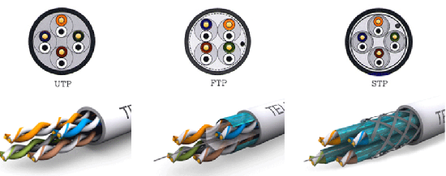
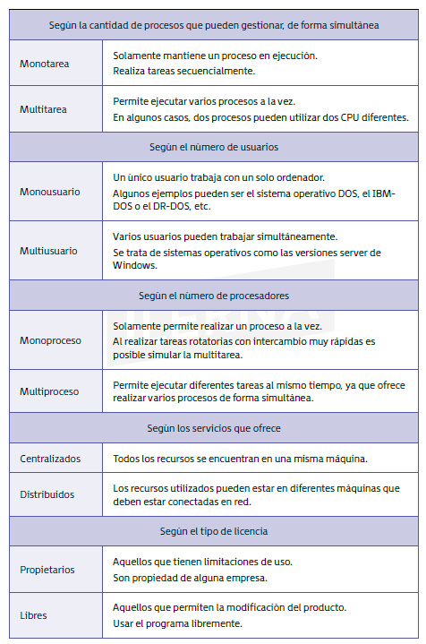

## 0. Introducción

**Sistema informático**: Sistema que almacena y procesa información interrelacionando el hardware y el software de un ordenador.
Todo sistema informático estará compuesto de hardware (recursos físicos) y de software (recursos lógicos).
En un sentido de comprensión más amplio se deberá añadir a los usuarios (recursos humanos) y a la información. 

**Software libre**: Los usuarios pueden modificar, copiar, ejecutar, mejorar dicho programa. 

Para cubrir las necesidades que se plantean en el ámbito de la informática se debe:
- **Conocer en profundidad el hardware**: Se debe tener presente en qué equipos se instalan el sistema operativo y las aplicaciones. Características técnicas, conectividad, prestaciones. Si están en red se debe tener muy clara la estructura de la red con la que se alcanzará el máximo rendimiento
- **Conocer en profundidad el software**: Conocer el tipo de programa que se necesita, funcionalidades y licencia bajo la que se distribuye. 

## 1. Estructura y componentes de un sistema informático. Periféricos y adaptadores para la conexión de dispositivos

## 1.1. Estructura
El **sistema informático** se compone del ordenador (parte central que procesa la información) y los periféricos (facilitan entrada y salida de información).

En el ordenador se diferencias los componentes lógicos o programas (software: Sistema operativos y aplicaciones) y _componentes físicos_ y electrónicos (hardware)

## 1.2. Componentes físicos

- **Caja**: Recinto en el que se alojan los principales componentes que forman un ordenador y que se encarga de su protección. Suele ser metálico o de plástico.
- **Fuente de alimentación**: Transformador de corriente alterna del sistema eléctrico en corriente continua con un voltaje apropiado para el funcionamiento de los componentes que forman el ordenador.
- **Placa madre** o **Placabase** (_motherboard_ o _mainboard_): Elemento principal del ordenador en el que se conectan todos los componentes. Es un **componente integrador**
- **CPU** (Unidad Central de Procesamiento): Encargada de interpretar y procesar las instrucciones de un programa informático a través de operaciones aritméticas, lógicas y entrada/salida del sistema. Se considera el cerebro de cualquier dispositivo. 
- **Disco duro**: Funciona como memoria del ordenador. Almacena datos, archivos, programas con el ordenador apagado
- **Memoria RAM** (Random Access Memory): Permite intercambiar información entre el sistema operativo, software, procesador y otros dispositivos. tiene gran velocidad de lectura y escritura y está en plena comunicación con gran parte de los componentes del ordenador. Tipo de memoria volátil, los datos no se quedan almacenados cundo el ordenador está apagado. 
- **Tarjeta gráfica** o **tarjeta de video**: Se encarga de procesar los datos que son enviados desde el ordenador y transformar los datos visibles y comprensibles para el usuario
- **Tarjeta de sonido** o **placa de sonido**: Tarjeta de expansión que permite al ordenador enviar información de audio a un dispositivo de audio como auriculares o altavoces.
- **Tarjeta de red**: Da posibilidad a la máquina de acceder a una red y compartir sus recursos
- **Unidades de almacenamiento adicionales**: CDROM, discos secundarios,...
- **Periféricos de entrada y salida**: Monitor, teclado, etc. 


> En Windows desde el `Administrador de dispositivos` se ve una lista de todos los componentes hardware del ordenador; permitiendo actualizar o instalar drivers (cuando los periféricos no están totalmente configurados en un estado inicial del sistema)

## 1.3. Arquitectura interna del sistema informático

### Unidad central de proceso (CPU, procesador central)

Elemento esencial del ordenador. Permite ejecutar las instrucciones de un programa. 
Físicamente conformada por circuitos integrados en un chip llamado microprocesador. Está compuesto de: La **unidad de control**, la **unidad aritmético-lógica** y los **buses de entrada y salida de datos**.
#### Unidad de control (UC)

Recibe información para interpretarla y procesarla mediante órdenes que envía al resto de componentes del sistema. 

#### Unidad aritmético-lógica (ALU)

Circuito digital que calcula operaciones aritméticas y lógicas.

#### Buses

Vía de comunicación que conecta componentes del ordenador. Es un medio de transmisión compartido. Al bus se conectan varios dispositivos y una señal transmitida por cualquiera de ellos puede ser recibida por el resto de las unidades conectadas. Sus funciones son:
- Soportar la información a transmitir
- Garantizar la correcta comunicación entre los elementos que lo comparten

### Memoria principal (Memoria central, memoria RAM)

Permite procesar la información ya que, para que la CPU pueda procesar un programa, este debe estar almacenado en la memoria principal. 


### Ciclo de instrucción

Pasos que se realizan al procesar una instrucción de un programa.
Formado por:
- Fase de búsqueda
- Fase de ejecución

El ordenador admitirá muchos periféricos físicos y si se quiere **ampliar a nivel de hardware** es indispensable conocer la arquitectura y conectividad.
Las **características del hardware** condicionan qué software se ejecutará correctamente en él, la elección del sistema operativo y las aplicaciones. 
También es importante conocer **las características técnicas de la red** que se emplea y su **tipo de cableado** (Apartado _Red de Windows_ da perspectiva general de qué equipos está conectados a la misma).

La **conectividad** es la capacidad de los equipos y dispositivos para conectarse entre sí. Da igual que se piense en el sistema informático como un único equipo o como un conjunto de equipos en red; es, en cualquier caso, un aspecto clave de la disciplina. 
La conectividad puede ser facilitada mediante el uso de **adaptadores**. Ej.: Adaptador de red extraíble mediante puerto USB en ordenadores que no cuentan con tarjetas de red wifi. 


## 2. Redes informáticas (Extraído del libro y del Anexo 1)

Una **red informática** es un conjunto de dispositivos conectados entre sí para compartir recursos e información, facilitando la comunicación. Para ello es necesario que los ordenadores dispongan de una tarjeta de red, cables de conexión, dispositivos periféricos y software adecuado.

Pueden incluir ordenadores, servidores, impresoras,... Las redes permiten a los usuarios compartir archivos, acceder a internet, utilizar aplicaciones compartidas y comunicarse a través de correos electrónicos o mensajes instantáneos, etc...

Son fundamentales en la infraestructura tecnológica moderna tanto en hogares como en empresas. Columna vertebral para comunicación e intercambio de datos en el mundo digital, permitiendo **interconexión de dispositivos y acceso a recursos compartidos de forma eficiente y segura**

### 2.1. Características que definen las redes informáticas

- **Compartición de recursos**: Varios dispositivos comparten recursos (archivos, impresoras, conexiones a internet), optimizando su uso
- **Escalabilidad**: Pueden crecer fácilmente agregando nuevos dispositivos sin afectar al rendimiento general. Adaptables a las necesidades cambiantes de una organización
- **Seguridad**: Se pueden implementar con capas de seguridad como firewalls, encriptación y control de acceso para proteger la información transmitida y almacenada
- **Fiabilidad**: Para ser fiables tienen redundancia y mecanismos de recuperación ante fallos que aseguran la disponibilidad continua de los servicios de red
- **Velocidad de transmisión**: Capacidad de una red para transmitir datos entre dispositivos, medida en términos de velocidad de transmisión que varía según la tecnología de la red.
- **Latencia**: Tiempo que tarda el paquete de datos en viajar desde la fuente hasta el destino. En el diseño de la red se busca minimizar la latencia para garantizar comunicación rápida y eficiente.

### 2.2. Ventajas e inconvenientes

**Ventajas**
- **Acceso compartido a recursos:** Los usuarios pueden compartir recursos, aumentando eficiencia y reduciendo.
- **Comunicación eficiente:** Redes permiten comunicación instantánea entre usuarios, mejorando la colaboración 
- **Centralización de datos:** La información se puede almacenar y respaldar en servidores, mejorando la gestión y seguridad de la información
- **Movilidad y flexibilidad:** Redes inalámbricas permiten a los usuarios conectarse desde cualquier lugar el el área de cobertura. Se incrementa la flexibilidad y movilidad en el trabajo.
- **Escalabilidad**: Redes pueden expandirse fácilmente para incluir nuevos dispositivos y usuarios, adaptándose al crecimiento de la organización

**Inconvenientes**
- **Costos de implementación:** Establecer una red informática puede implicar costos significativos en términos de hardware, software y mantenimiento
- **Seguridad:** Las redes son susceptibles a ataques cibernéticos (_malware, phishing_, intrusiones)
- **Dependencia de la red:** Si una red falla, todos los dispositivos a ella conectados pueden quedar inutilizados, perjudicando a la productividad.
- **Complejidad de administración:** Las redes requieren administración y mantenimiento constante, que puede ser complejo y requerir personal especializado. 

### 2.3. Tipos de redes

Según su extensión se puede diferenciar entre:

1. **Redes de área personal (PAN, Personal Area Network):** 
Equipos situados a pocos metros y utilizados solo para uso personal. Aparecieron para que, con el avance tecnológico, el usuario no tuviera solo un equipo informático sino también otros dispositivos personales  (móvil, ordenadores, tablets). Red entre todos los dispositivos del mismo usuario. Tienen configuración sencilla y automática, se comunican de forma inalámbrica, no tienen ningún coste. (Conexión del ratón inalámbricos o conexión del móvil a la televisión)
Son _redes pequeñas_, para un solo usuario., típicamente mediante Bluetooth o USB.

2. **Redes de área local (LAN, Local Area Network):**

 _Área limitada_ como casa, oficina o edificio. Comunes en hogares y pequeñas empresas; permiten interconexión de dispositivos y recursos compartidos. Dispone de un concentrador. A él se conectan todos los nodos de un edificio mediante un router.

3. **Red LAN inalámbrica (WLAN, Wireless Local Area Network):** 

Usan ondas de radio para _conectar dispositivos sin necesidad de cables_. La más común es el Wi-Fi, usado en hogares, oficinas y lugares públicos. 

4. **Redes de área metropolitana (MAN):**

 _Ciudad o área metropolitana_, conectando varias LAN. Usadas por universidades, gobiernos locales o grandes empresas que necesitan conectividad en región extensa. Ej.: Televisión por cable. 

5.  **Redes de área amplia (WAN):**
 
 _Grandes áreas geográficas_ como países o continentes. Internet es una gran WAN. Interconectan múltiples LAN a partir de enlaces dedicados o infraestructura de comunicaciones. Presentan una mejor velocidad de transmisión y, por tanto, su tasa de error es mayor (debido a la extensión que abarcan)

6. **Redes privadas virtuales (VPN):** 

Usan la _infraestructura de una red pública (internet) para proporcionar acceso seguro a la red privada de una organización_. Cifran los datos para garantizar la privacidad y la seguridad.

### 2.4. Componentes de una red informática

#### 2.4.1. Dispositivos de red

- **Routers**: Dirigen el tráfico entre diferentes redes
- **Switches**: Conectan dispositivos dentro de la misma red, permitiendo que se comuniquen entre sí
- **Access Points (AP):** Permiten la conexión de dispositivos inalámbricos a la red
- **Firewalls**: Protegen la red de accesos no autorizados y ataques cibernéticos

#### 2.4.2. Medios de transmisión

- **Cables de cobre (Ethernet):** Usados en redes LAN para conectar dispositivos entre sí
- **Fibra óptica:** Usados para conexiones de alta velocidad y larga distancia, como en redes WAN
- **Medios inalámbricos:** Incluyen Wi-Fi y bluetooth para permitir la conexión sin cables

#### 2.4.3 Dispositivos finales

- **Ordenadores:** Usados por los usuarios para acceder a la red
- **Servidores:** Almacenan, procesan y gestionan datos, aplicaciones y recursos compartidos
- **Impresoras y otros periféricos compartidos:** Pueden ser usados por varios usuarios en la red

#### 2.4.4. Software de red

- **Sistemas operativos de red (NOS):** Software que gestiona los recursos de la red y las comunicaciones entre dispositivos (Windows Server, Linux)
- **Protocolos de comunicación:** Definen cómo los datos se envían y reciben en la red. Ej.: TCP/IP, UDP, HTTP, FTP entre otros.

### 2.5 Topologías de red

Toda red presenta un diseño específico en sus planos físico y lógico (una topología diferente). La red es, en esencia, un conjunto de equipos (nodos) interconectados. La manera en que se establecen las conexiones entre ellos es la que define su topología de red.

- **Topología de punto a punto:** Un canal para comunicar solamente dos nodos
- **Topología en bus:** Los dispositivos están conectados a un único canal (cable principal o bus). Ventaja: Fácil de instalar. Inconveniente: Si el cable falla, toda la red se cae.
- **Topología en estrella:** Los dispositivos se conectan a un nodo central (switch o hub) y todas las comunicaciones pasan por él. Ventaja: Fácil de gestionar. Inconveniente: Todo depende del nodo central.
- **Topología en anillo:** Los dispositivos se conectan a un bucle cerrado, donde cada dispositivo tiene exactamente dos vecinos. Su disposición es en círculo, de forma que cada equipo está conectado al siguiente y el último al primero. Ventaja: Es fiable. Inconveniente: El fallo de un dispositivo puede afectar a toda la red.
- **Topología en doble anillo**: Igual que la topología en anillo pero poseyendo un segundo anillo que conecta también todos los nodos.
- **Topología en malla:** Cada dispositivo está conectado a todos los demás dispositivos. Para ir de un lugar al otro, la información puede seguir diversos caminos. Ventaja: Alta redundancia y fiabilidad. Inconveniente: Costosa y compleja de implementar. 
-  **Topología totalmente conexa**: Mismas características que la topología en malla, aunque con más conexiones ya que todos los nodos están conectados entre sí. 
- **Topología en árbol:** Estructura como un árbol, en el que los dispositivos o estaciones ejercen de ramas. Combinación de topologías en estrella y en bus. Permiten la expansión de la red de forma jerárquica. Es común en redes grandes.
- **Topología híbrida**: Combina varias de las topologías anteriores.


### 2.6 Tipos de cableado y conectores

**1. Cables de par trenzado (UTP/STP)**
- **UTP (Unshielded Twisted Pair)**: Tipo más común de cable en redes LAN. Económico y fácil de instalar pero susceptible a interferencias electromagnéticas. 
- **STP (Shielded Twisted Pair)**: Similar al UTP pero con blindaje adicional que reduce interferencias (cada par va recubierto por una malla conductora que actúa de apantallamiento). Se usa en entornos con mucho ruido electromagnético.
- **FTP (Foiled Twisted Pair)**: Aunque sus pares no están apantallados, sí que tiene una apantalla global para mejorar su nivel de protección frente interferencias externas.



**2. Cables de fibra óptica**: Usan luz para transmitir los datos a alta velocidad y largas distancias. Más caros que cables de cobre pero con mayor ancho de banda y no susceptibles a interferencias electromagnéticas.

**3. Cables coaxiales**: Usados en redes antiguas y sistemas de televisión por cable. Tienen alta resistencia a la interferencia pero han sido reemplazados en gran medida por UTP y fibra óptica en redes modernas.

**4. Conectores**: 
 - **Conectores BNC**: Conectores usados en cables coaxiales. Es la más compleja de configurar. Actualmente se encuentran en desuso.
- **Conectores RJ-45**: Conector más común para cables UTP en Ethernet. (Cables ethernet de 8 pines, uso aún frecuente en redes cableadas).
- **SC, LC, ST**: Conectores usados en cables de fibra óptica. 

## 3. El modelo OSI. El mapa físico y lógico de una red

### 3.1. Modelo OSI 

La descripción de una red se fundamenta en las bases del modelo OSI (Open System Interconnection), creado en los años ochenta para sentar unos estándares de referencia. 
Este modelo se estructura en capas, definiéndose las diferentes etapas por las que deben circular los datos para pasar de un dispositivo a otro en la red.

| Capa                 | Descripción/Función                                                          |
| -------------------- | ---------------------------------------------------------------------------- |
| **Aplicación**       | Capa más próxima al usuario (aplicaciones)                                   |
| **Presentación**     | Que la información enviada a la capa de aplicación pueda ser leida con éxito |
| **Sesión**           | Garantizar la comunicación entre dos puertos                                 |
| **Transporte**       | Transportar los datos del emisor hasta el receptor                           |
| **Red**              | Responsable de que exista conectividad entre dos hosts diferentes            |
| **Vínculo de datos** | Acceso al medio                                                              |
| **Física**           | Transmitir las señales                                                       |

### 3.2. Mapa físico y lógico de una red

**Mapa físico**: Representación gráfica de una red en el mundo real. Ej.: En qué planta se encuentra cada ordenador, en qué lugar, etc. Los mapas físicos se realizarán de forma manual por los técnicos, aunque existen aplicaciones propias de las marcas de los equipos que se utilicen en la red para crearlos, subir los mapas como archivos en determinados formatos, interactuar con los diferentes componentes,... 

**Mapa lógico:** Hace referencia a los aspectos internos de la red. Saber qué dirección IP tiene asignada cada ordenador, a qué subred pertenece, etc. Es una representación mucho más técnica que la anterior, que facilitan el mantenimiento de la red y la incorporación de nuevos nodos a esta. Los proveedores de hardware proporcionan entornos preparados para mostrar esta información. Los entornos de los sistemas operativos dan aplicaciones preinstaladas que ayudan a obtener la información necesaria de los equipos (IP, DHCP, DNS,...); aunque en redes grandes es más usual utilizar la consola de comandos por ser más liviana y ofrecer toda la información necesaria con comandos adecuados. 

## 4. Cumplimiento de las normas de prevención de riesgos laborales (Extraído del Anexo 1.1)

En el montaje y desmontaje de una computadora se manipulan componentes eléctricos, siendo fundamental cumplir medidas en materia de PRL.

### 4.1. Cumplimiento de normativa PRL. Conceptos básicos

- **Prevención**: Es el conjunto de actividades previstas para evitar futuros riesgos en el trabajo.
- **Daños derivados en el trabajo:** Lesiones o daños ocasionados o derivados por el trabajo.
- **Condiciones del trabajo**: Es cualquier rasgo que puede influir en el desempeño del trabajo en cualquier ámbito.

La Constitución Española recoge en su artículo 40.2 el marco legal de prevención de riesgos laborales: Se exige que los poderes jurídicos velen por la seguridad e higiene del puesto de trabajo.

El Estatuto de los Trabajadores establece en el artículo 19 el derecho de los trabajadores a una protección en el ámbito de seguridad e higiene y su deber de cumplir una normativas en materia de prevención.
### 4.2. Técnicas de prevención e identificación de causas más frecuentes de accidentes

Las técnicas de prevención se pueden dividir en los siguientes grupos:
**Seguridad**: 
- **Medidas de prevención**: Anticiparse para evitar ocasionar accidentes de trabajo
- **Medidas de protección**: Para eliminar o evitar los riesgos y proteger a trabajadores

**Higiene**: Técnicas que se estudian para velar por la salud de los trabajadores

**Ergonomía**: Cuidar condiciones de trabajo para que este se sienta cómodo en su puesto

**Psicosociología**: Técnicas que tratan de prevenir daños psicológicos del trabajador debido a la organización empresarial y a los hábitos laborales de cada día (ej.: estres)

#### Medidas de prevención
- Evitar riesgos para evitar posibilidades de que ocurran accidentes
- Evaluar riesgos inevitables de las actividades realizadas en el puesto de trabajo
- Combatir los riesgos con soluciones a largo plazo
- Adaptar el puesto de trabajo a características del trabajador
- Planificar el plan de prevención para evaluar que las medidas de prevención y protección funcionan correctamente
- Informar a los trabajadores de las medidas de prevención existentes y de los derechos y deberes que existen en la propia empresa

#### Medidas de protección
Hay medidas de **protección grupal** que afectan a toda la plantilla de trabajadores. (Señalización de seguridad)
Medidas de **protección individual** como los equipos de protección individual (EPI)

### 4.3. Prevención de riesgos laborales en procesos de montaje y mantenimiento de equipos informáticos. Equipos de protección individual

Relacionado con el montaje y mantenimiento de equipos informáticos se puede mencionar. 

#### Trabajo con instalaciones eléctricas

Los riesgos más graves de trabajar con equipos informáticos son los riesgos eléctricos.
Los ordenadores funcionan con corriente eléctrica suministrada a una tensión de 220 V que puede llevar a sufrir una descarga eléctrica sino se manipula con prevención y seguridad.
Internamente se manejan tensiones de 5V o como mucho 12V con los que no se sufrirán descargas pero sí que pueden dañarse algunos componentes. 

La **electrocución** por contacto directo o indirecto puede causar quemaduras o paradas cardiorrespiratorias a consecuencia de ese riesgo.
Las **sobreintensidades** pueden ser causa de muchos incendios, sobre todo en los elementos eléctricos como la fuente de alimentación.
Las **medidas de carácter preventivo** deben maximizar las precauciones y asegurarse de desconectar cualquier aparato eléctrico antes de ser manipulado. 

Medidas específicas:
- Manipular equipos eléctricos con manos totalmente secas
- Desconectar dispositivos con interruptor habilitado para tal fin
- Necesario que el ordenador cuente con ventilador y alejarlo de fuentes de calor externa que puedan aumentar la temperatura del dispositivo
- No alterar los aislantes y las carcasas de protección para que puedan cumplir con su función
- No conectar muchos equipos al mismo enchufe para evitar sobrecarga
- Poseer extintores, sistemas de detección y alarmas contra incendios posicionados en los lugares necesarios y adecuados. 

#### Trabajo con herramientas

El técnico informático trabaja con herramientas como alicates, destornilladores o martillos que pueden provocar accidentes como golpes o cortes, lesiones en los ojos y descargas eléctricas.

Medidas preventivas generales:
- Hacer uso de herramientas con certificado de calidad, dándoles el uso para el que fueron diseñadas
- Transporte adecuado de herramientas 
(Considerar la dadas por el Instituto Nacional de Seguridad e Higiene del trabajo con la guía técnica que publican para cada herramientas)

#### Manejo de cargas

Cargar con equipos pesados puede provocar esguinces u otras lesiones si no se manejan de forma adecuada. 

#### Ergonomía

Uno de los riesgos más frecuentes se derivan de la forma de sentarse y la posición que se adopta ante la pantalla. La postura errónea puede provocar sobrecarga muscular y daños derivados. 
Medidas preventivas:
- Postura adecuada
- Adaptar mobiliario de oficina al perfil del trabajador

#### Entorno de trabajo. Orden y limpieza

El entorno de trabajo adecuado consiste en un área de trabajo iluminada, bien ventilada y con temperatura apropiada, que posee todo el mobiliario necesario para que el trabajador desempeñe sus funciones cómodamente, a la altura adecuada y con una mesa de trabajo despejada y organizada. 

Un puesto de trabajo que no cumple condiciones adecuadas de ventilación y temperatura puede provocar falta de confort, desmayos, resfriados, golpes de calor,...
Un puesto de trabajo mal iluminado puede provocar que el trabajo no se realice bien (montaje del equipo de forma incorrecta)
Un puesto de trabajo poco limpio/organizado puede provocar riesgos graves a la salud (ejemplo: suelo húmedo y descargas eléctricas)

> “En cualquier actividad laboral, para conseguir un grado de
seguridad aceptable, tiene especial importancia el asegurar y mantener
el orden y la limpieza”. 
 Artículo 481 de Reglamento de Prevención de Riesgos Laborales. 

### 4.4. Cumplimiento de normativa de protección ambiental

Los componentes informáticos pueden contaminar el medio ambiente ya que son fabricados con materiales peligrosos para este. Además el uso de estos conllevará también el empleo de materiales no biodegradables (papel, tóner, tinta,...)

La principal medida estipulada es la **recogida selectiva** para tratar de la mejor manera posible estos materiales

#### Normativas de protección ambiental
- **Constitución Española de 1978**: Recoge derecho de todos a disfrutar del medio ambiente así como el deber de conservarlo y usar sus recursos de una manera racional
- *Real Decreto 208/2005* y **Ley 22/2011 de 28 de Julio**: Estas normativas recogen disposiciones orientadas a la recogida de forma gratuita de los componentes eléctricos una vez que el usuario quiera deshacerse de ellos y normas para los fabricantes para facilitar la recogida selectiva de estos en instalaciones autorizadas. 

#### Medidas medioambientales en montaje y mantenimiento de equipos

El técnico reparador informático debe concienciarse sobre el uso de las tres R como reglas de preservación del medio ambiente.

- **Reducir**: Reducir al mínimo los recursos disponibles para realizar su tarea diaria. Ej.: Uso de menos papel.
- **Reutilizar**: Concienciación de alargar la vida de un equipo informático lo máximo posible. Se reducen costes en la empresa y la basura tecnológica creada. Pueden donarse a asociaciones u organizaciones sin ánimo de lucro los equipos que han quedado en desuso para la actividad diaria.
- **Reciclar**: Cuando se detecta que el equipo informático debe ser sustituido y no puede ser reutilizado, debe llevarse a un punto de recogida de equipos en el que se trate de acuerdo a las normas medioambientales. 

El **consumo de energía** también debe ser tenido en cuenta. Por ejemplo, no manteniendo el ordenador encendido si no se está usando. Aunque los fabricantes cada vez implementan más medidas para reducir el consumo de energía cuando no se utilizan, como la funcionalidad de ahorro de energía de móviles, tabletas y portátiles. 

## 5. Sistemas operativos

Un **sistema operativo** es un software de sistema que gestiona los recursos de hardware y software de un ordenador. Da servicios comunes para programas de ordenador y actúa como intermediario entre el usuario y el hardware del equipo, facilitando la interacción del usuario con el ordenador y permitiendo la ejecución eficiente de aplicaciones.

Definición más cateta: Software encargado de poner en marcha un ordenador garantizando su correcto funcionamiento. Se sitúa de intermediario entre el usuario y el hardware.

Usuario | Aplicación | Sistema operativo | Hardware

### 5.0. Funciones del sistema operativo (Del libro)

- Administración de procesos
- Administración de recursos
- Control de operaciones de entrada y salida
- Administración de la memoria
- Recuperación de errores
- Gestión de usuarios y permisos
- Control de seguridad

**Administración de procesos:**
Al existir varios programas en espera, el sistema operativo debe decidir el orden de procesamiento de estos y asignar los recursos necesarios para su proceso.

**Administración de recursos:**
El sistema operativo tiene la capacidad de distribuir de forma adecuada los diferentes recursos (memoria, dispositivos, etc.) entre los diversos programas que se encuentran en proceso. Para hacerse cargo de este proceso lleva un registro que le permite conocer qué recursos están disponibles, cuáles están siendo utilizados, por cuánto tiempo, por quién, etc. 

**Control de operaciones de entrada y de salida:**
El sistema operativo decide qué proceso hará uso del recurso, durante cuánto tiempo y en qué momento

**Administración de la memoria:**
Supervisa qué áreas de la memoria están en uso y cuáles están libres. Determina cuánta memoria asignará a un proceso y en qué momento. Libera la memoria cuando no es requerida para el proceso.

**Recuperación de errores:**
Rutinas que evitan perder el control de una tarea cuando se suscitan errores en la transferencia de información hacia y desde los dispositivos de entrada y salida. Son:
- Gestión y asignación de la memoria y la CPU
- Gestión de las unidades de almacenamiento de la información
- Gestión de las operaciones de entrada/salida
- Mediación entre el hardware y el software a través de los drivers

**Gestión de usuarios y permisos:**
Aplica una serie de permisos a los usuarios que les permiten acceder al sistema y así poder evitar acciones que afecten al trabajo que está realizando otro usuario. 

**Control de seguridad:**
Necesario tener en cuenta la seguridad, tanto para el software como para los usuarios, así como también para la información que se encuentra almacenada en el sistema. 

### 5.1. Descripción y características (Del anexo 1.2)

**Gestión de procesos**
El SO gestiona los procesos (ejecución de programas). Realizando:
- **Planificación de procesos**: Orden y tiempo de ejecución de los procesos
- **Creación y terminación de procesos**: Permite la creación de nuevos procesos y terminación de los existentes
- **Sincronización e intercomunicación de procesos**: Coordina la comunicación entre procesos y se asegura de que no interfieran entre sí

**Gestión de memoria**
Importante su gestión para conseguir eficiencia y estabilidad. Se realiza:
- **Asignación de memoria**: Dar memoria a los procesos que lo necesitan
- **Liberación de memoria**: Recupera la memoria liberando los recursos cuando ya no es necesario
- **Memoria virtual**: Uso de técnicas como la paginación y la segmentación para extender la memoria física disponible. 

**Gestión de almacenamiento**
Se gestiona el almacenamiento de los datos en los dispositivos de almacenamiento. Se caracteriza por:
- **Sistema de archivos**: Organiza y controla cómo se almacenan y se recuperan los datos
- **Control de acceso**: Gestiona los permisos de lectura, escritura y ejecución.
- **Manejo de espacio en disco:** Monitoriza y optimiza el uso del espacio disponible

**Gestión de dispositivos**
Maneja la comunicación entre el hardware del ordenador y los programas de software. Sus características son: 
- **Controladores de dispositivos**: Poseen software que permite al sistema operativo interactuar con el hardware
- **Gestión de entradas y salidas:** Coordina y controla el flujo de datos entre el hardware y el software
- **Interfaz uniforme:** Da una interfaz estándar para que las aplicaciones accedan a los dispositivos de hardware

**Interfaz de usuario (GUI)**
Proporcionan interfaces que permiten a los usuarios interactuar con el ordenador. Se caracteriza por:
- **Interfaz de línea de comandos (CLI)**: Permite a los usuarios escribir comandos para realizar tareas
- **Interfaz gráfica de usuario (GUI):** Proporciona una interfaz visual con ventanas, iconos y menús
- **Interacción multitáctil**: Permite la interacción mediante gestos y toques en pantallas táctiles

**Seguridad y protección**
Para proteger datos y recursos del sistema. Sus características son:
- **Control de acceso**: Define quién puede acceder a qué recursos y en qué condiciones
- **Autenticación:** Verifica la identidad de los usuarios que intentan acceder al sistema
- **Cifrado**: Protege los datos mediante técnicas de codificación

### 5.2. Arquitectura de un sistema operativo

Se pueden distinguir en todos los sistemas operativos los siguientes elementos clave:
- Núcleo del sistema
- API del núcleo
- Sistema de archivos
- Controladores o drivers
#### Núcleo del sistema o kernel
Componente del sistema que se ejecuta permanentemente en la memoria. Se encarga de gestionar los recursos del ordenador (asigna CPU y memoria a los procesos...)

#### API del núcleo
Conjunto de servicios que ofrece el sistema operativo a las aplicaciones (llaman al SO para valerse de él). Algunos de ellos son abrir archivos, modificarlos, cerrarlos,... Instrucciones de entrada y salida para operaciones relacionadas con gráficos y sonido, comunicaciones,...

#### Sistema de archivos
Con él se obtiene la estructura lógica de la información grabada en las unidades de disco y se puede trabajar con directorios y archivos. Es frecuente que forme parte del núcleo dada su importancia.

#### Controladores o drivers
Permiten que el sistema interactúe con los diversos dispositivos de hardware del equipo. Ej.: Disco Duro Serial ATA, necesario contar con el driver para trabajar con él.

La gestión se lleva a cabo mediante las órdenes que el sistema operativo recibe para lo cual se puede usar una interfaz gráfica o un intérprete de comandos tipo DOS. 

### 5.3. Ejemplos de sistemas operativos 

- **Windows**: Desarrollado por Microsoft. Con interfaz gráfica de usuario amigable y amplia compatibilidad de software. (Ordenadores personales, servidores)
- **macOS**: Desarrollado por Apple. Diseño intuitivo y estrecha integración con hardware de Apple. (Ordenadores personales de Apple)
- **Linux**: De código abierto y altamente configurable. (Usado en variedad de dispositivos desde servidores hasta dispositivos móviles. Servidores, sistemas embebidos, ordenadores personales)
- **Android**: Basado en Linux y desarrollado por Google. (Ampliamente usado en dispositivos móviles, smartphones, tablets)
- **iOS**: Desarrollado por Apple. Famoso por su rendimiento y seguridad. (iPhones, iPads)

### 5.4. Evolución histórica de los sistemas operativos

La evolución de los sistemas operativos ha sido un proceso continuo y dinámico, influenciado por los avances tecnológicos y las necesidades crecientes de los usuarios. Han pasado de ser simples programas de control a complejas plataformas multifuncionales que gestionan diversos tipos de hardware y aplicaciones. Han habilitado nuevas capacidades y mejorado la experiencia de usuario. 

#### Años 1950-1960: Primeros sistemas operativos
- **Primeros ordenadores y batch processing**: En la década de 1950 surgen los primeros sistemas operativos para gestionar procesos de _batch processing_ (procesamiento por lotes) en grandes _mainframes_. Permitían ejecutar una serie de trabajos de forma secuencial y sin intervención del usuario. Ej.: **GM-NAA I/O**, desarrollado por General Motors y North American Aviation en **1956** es considerado **uno de los primeros sistemas operativos.** 

- **Sistemas de tiempo compartido**: A finales de 1960, se desarrollan sistemas de tiempo compartido que permitían a múltiples usuarios acceder a un ordenador simultáneamente mediante terminales. Ej.: Time-Sharing-System (CTSS) del MIT en 1961

#### Años 1970: Diversificación y Unix

- **Unix**: (1969) Jen Thompson, Dennis Ritchie et col en Bell Labs desarrollan Unix, sistema operativo de tiempo compartido que introduce el sistema de archivos jerárquico y el uso de lenguaje de programación de nivel más alto (C) en su desarrollo. Unix se convierte en la base de muchos sistemas operativos modernos debido a su portabilidad, flexibilidad y diseño modular.

- **Sistemas operativos en red**: Avances en redes de ordenadores llevan al desarrollo de sistemas operativos capaces de gestionar recursos y comunicaciones en red. ARPENET fue la precursora de Internet, usando sistemas operativos que permitían la comunicación entre diferentes ordenadores. 

#### Años 1980: Era de ordenadores personales

- **MS-DOS**: (1981) Lanzado por Microsoft. Estándar para los primeros ordenadores personales. Era un sistema operativo de línea de comandos que gestionaba archivos y dispositivos de hardware básico.

- **Apple y macOS**: (1984) Apple lanza el Macintosh con un sistema operativo que ofrecía una interfaz gráfica de usuario (GUI) basada en el trabajo de Xerox PARC. maOs introdujo conceptos como el uso del mouse y de ventanas.

- **Unix y sistemas derivados**: Unix evolucionó dando lugar a derivados como BSD (Berkeley Software Distribution) y Solaris.

#### Años 1990: Popularización de Windows y Linux

- **Windows**: (1990) Microsoft lanzó Windows 3.0 con una GUI más avanzada y compatibilidad con aplicaciones de MS-DOS. Windows 95, lanzado en 1995 integró una interfaz gráfica mejorada y soporte para nuevas tecnologías como Plug and Play. Windows se convierte en el sistema operativo dominante para ordenadores personales.

- **Linux:** (1991) Linux Torvalds desarrolló el kernel de Linux, sistema operativo de código abierto basado en Unix. Linux se hizo popular gracias a su flexibilidad, seguridad y comunidad de desarrollo activa. 

#### Años 2000: Dispositivos móviles y computación en la nube

- **Windows XP y Vista:** (2001) Microsoft lanzó Windows XP (uno de los sistemas operativos más usados de la historia), conocido por su estabilidad y usabilidad, seguido de Windows Vista en 2007.

- **macOS X**:(2001) Apple lanzó macOS, basado en Unix. Sólida base del ecosistema de Apple e incluyendo integración con dispositivos móviles.

- **Android e iOS**: Google lanzó Android en 2008 y Apple lanzó iOS en 2007. Estos dos sistemas han dominado el mercado de smartphones.

- **Computación en la nube**: Se desarrollaron sistemas operativos optimizados para servidores en la nube como Amazon Web Services (AWS) y Google Cloud Platform (GCP)

#### Años 2010-presente: Convergencia y nuevas tecnologías

- **Windows 10:** (2015) Introduce características como integración con dispositivos móviles y asistente digital Cortana. Se consolida la presencia de Microsoft en PC's, tablets, consolas...

- **macOS e iOS**: Mejora de iOS. Integración fluida entre macOS y dispositivos iOS.

- **Linux y Open Source:** Distribuciones populares como Ubuntu, CentOS, Red Hat Enterprise Linux ampliamente usadas en servidores y entornos de desarrollo. Linux es fundamental en la infraestructura de internet, servidores y desarrollo de software.

- **Sistemas operativos para IoT y dispositivos inteligentes:** Proliferación de dispositivos inteligentes e internet de las cosas llevando al desarrollo de sistemas operativos especializados como Google Fuchsia y Amazon FreeRTOS, permitiendo la gestión eficiente y segura de dispositivos conectados. 

### 5.5. Clasificación de los sistemas operativos 



**Según el número de procesos o tareas**
- **Monotarea**: MS-DOS
- **Multitarea**: Windows, macOS, Linux

**Según el número de usuarios**
- **Monousuario**: MS-DOS y algunas versiones de Windows en modo personal
- **Multiusuario**: Unix, Linux, Windows Server

**Según la licencia**
- **Código cerrado o propietario**: Windows, macOS, iOS
- **Código abierto o libre**: Linux, FreeBSD, Android(AOSP)

**Según el tipo de ordenador**
- **De escritorio**: Diseñados para ordenadores personales (PC) usados en entornos domésticos y de oficina. Ej.: Microsoft Windows, macOS, Linux (Ubuntu, Fedora)
- **De servidor**: Optimizados para gestionar recursos en servidores, dando servicios a múltiples usuarios a través de una red. Ej.: Windows Server, Linux (CentOS, Red Hat Enterprise, Linux), Unix (Solaris)
- **Móviles**: Ej.: Android, iOS
- **De tiempo real (RTOS)**: En sistemas embebidos y aplicaciones con tiempo de respuesta muy corto. Ej.: FreeRTOS, VsWorks, QNX
- **De mainframe**: En grandes sistemas empresariales que requieren alta disponibilidad y procesamiento masivo de datos. Ej.: z/OS (IBM), Unisys OS 2200

**Según la interacción con el usuario**
- **De línea de comandos (CLI)**: Interacciona a través de comandos escritos en terminal. Ej.: MS-DOS, Unix Shell (Bash)
- **Con interfaz gráfica de usuario (GUI)**: Interfaz visual con ventanas, iconos, menús y punteros. Ej.: Windows, macOS, Ubuntu (GNOME, KDE).

**Según el modo de uso**
- **De tiempo compartido:** Permiten que múltiples usuarios compartan el tiempo de CPU de forma eficiente, dando la ilusión de tener su propio procesador. Ej.: Unix, Linux, Multics
- **De tiempo real:** Garantizan tiempos de respuesta predecibles y rápidos, cruciales para alta precisión temporal. Ej.: RTLinux, VxWorks, QNX
- **Distribuidos:** Gestiona un conjunto de ordenadores independientes y las presentan a los usuarios como si fueran un único sistema coherente. Ej.: Google Fuchsia, Plan 9 from Bell Labs. 
## 6. Tipos de aplicaciones

**Según dónde se encuentran y ejecutan**
- **Aplicaciones locales:** Almacenadas en la unidad de disco local de un equipo. Solo este tiene acceso a ellas.
- **Aplicaciones en red**: Ejecutadas en un entrono de red local. Las aplicaciones tienen dos componentes: Uno ejecutado de forma local y el otro de forma remota.
- **Aplicaciones web o en la nube**: La mayor parte del software se ejecuta en un servidor remoto y queda accesible a través de internet. Con frecuencia los datos también se almacenan online.

**Según el fin para el que fueron programadas**
- **Ofimática**: Word, Excel,...
- **Optimización del sistema**: CCleaner, Defraggle
## 7. Licencias y tipos de licencias

**Según el tipo de software**
- **Gratuitas (freeware)**: Permite la redistribución de la aplicación. NO es software libre, ni permite modificar el código fuente.
- **Libres**: Disponible para que cualquier usuario pueda utilizarlo, copiarlo o distribuirlo ya sea en forma original o habiendo realizado modificaciones
- **Propietarios:** Sus copias, redistribuciones o modificaciones están prohibidas por el propietario. Para realizarlas, debe pedirse permiso al propietario o pagar por ello.
- **Comerciales**: Aplicaciones desarrolladas por una empresa para obtener beneficio de su uso. 


- Shareware: El usuario puede evaluar de forma gratuita el producto, pero con limitaciones en el tiempo de uso. 

**Según las licencias de distribución, el software comercial puede ser**:
- **OEM**: La licencia forma parte de un equipo nuevo. Una vez activada, el hardware queda unido a ella. Una vez adquirida queda en propiedad del comprador pero los fabricantes ponen limitaciones del máximo de veces que el software puede reinstalarse, estando totalmente prohibida su venta y cesión a terceros.
- **Retail:** La licencia tiene un coste más elevado que las licencias OEM, permitiendo reinstalar el software tantas veces como se necesite al ser entera propiedad del usuario, que puede cederlo a terceros e incluso venderlo.
- **Licencia por volumen**: Destinado a grandes usuarios como empresas. Son similares a OEM pero sin afectar a nuevos equipos. Se determina el número de equipos para los que se usará, quedando el fabricante autorizado para comprobar las licencias en uso. La licencia no se puede ceder a terceros. 
## 8. Gestores de arranque

Un **gestor de arranque** es un pequeño programa que se ejecuta una vez iniciada la BIOS. Su función es preparar los elementos más básicos que precisa el sistema operativo para funcionar y brindar opciones antes de iniciar el sistema operativo en sí. 

Cuando se tienen varios sistemas operativos, el gestor de arranque (como GRUB en Linux) permite elegir el que se desee.  Las versiones de Windows actuales también ofrece un gestor de arranque que combina diferentes sistemas operativos.

## 9. Virtualización

La **virtualización** es una tecnología consistente en la creación de una versión virtual de algo (servidor, sistema operativo, dispositivo de almacenamiento o recurso de red), mediante un software permitiendo que múltiples entornos de simulación o sistemas operativos se ejecuten simultáneamente en un solo servidor físico, dividiendo y compartiendo los recursos de hardware entre diversas instancias virtuales. Ha transformado la manera en la que las organizaciones implementan, administran y optimizan sus infraestructuras.

La virtualización mejora la eficiencia, la flexibilidad y la escalabilidad de los recursos informáticos.

### 9.1 Tipos de virtualización
- **Virtualización de servidores**: Permite que múltiples sistemas operativos se ejecuten en un solo servidor físico mediante la creación de máquinas virtuales. Así se mejora el uso de recursos, se reduce la cantidad de hardware físico necesario, se facilita la recuperación ante desastres y migración de cargas de trabajo. 

- **Virtualización de escritorios**: Proporciona entornos de escritorio virtualizados a los usuarios permitiendo que accedan a sus escritorios desde cualquier dispositivo y ubicación. Así se proporciona un entorno de trabajo consistente, se mejora la seguridad al centralizar los datos y se simplifica la administración de escritorios y aplicaciones. 

- **Virtualización de almacenamiento**: Combina múltiples dispositivos de almacenamiento físico en una única unidad de almacenamiento virtual. Así se mejora la gestión y el uso del almacenamiento, se facilita la escalabilidad y la predictibilidad y se permite la administración centralizada del almacenamiento. 

- **Virtualización de redes**: Crea redes virtuales que se comportan como redes físicas, permitiendo una mayor flexibilidad y eficiencia en gestión de redes. Así se facilita la segmentación y el aislamiento de redes, se mejora la eficiencia en el uso de recursos de red y se simplifica la configuración y gestión de redes complejas. 

### 9.2 Ventajas de la virtualización

- **Eficiencia y utilización de recursos**: Uso más eficiente del hardware al ejecutar múltiples máquinas virtuales en un solo servidor físico
- **Reducción de costes**: Ya que reduce la necesidad de hardware físico y mejora la eficiencia energética. 
- **Flexibilidad y escalabilidad**: Facilita la creación y gestión de entornos virtuales, permitiendo a las organizaciones escalar recursos de forma rápida y sencilla.
- **Recuperación ante desastres y continuidad del negocio**: Mejora la capacidad de recuperación al permitir rápida copia de seguridad y restauración de máquinas virtuales.
- **Gestión simplificada**: Da herramientas de administración centralizada que simplifican la gestión y el monitoreo de recursos. 

### 9.3 Componentes clave de la virtualización

- **Hipervisor**: También conocido como VMM (_Virtual Machine Monitor_) es el software que crea y gestiona las máquinas virtuales, dando capa de abstracción entre el hardware físico y los sistemas operativos virtuales.

- **Tipos de hipervisores**: 
	- Tipo 1 (bare metal): Ejecutado directamente sobre el hardware físico. Ej.: VMware ESXi, Microsoft Hyper-V
	- Tipo 2 (hosted): Ejecutado sobre un sistema operativo anfitrion Ej.: VMware Workstation, Oracle VirtualBox

- **Máquinas virtuales (VM)**: Entornos de ejecución independientes que contienen un sistema operativo y aplicaciones, simulando un sistema informático completo. 

- **Administradores de virtualización**: Herramientas y plataformas que facilitan la gestión, monitoreo y orquestación de entornos virtuales. Ej.: VMware vCenter, Microsoft System Center

### 9.4 Desafíos de la virtualización 

- **Seguridad**: Asegurar entornos virtuales puede ser complejo debido a la mayor superficie de ataque y la necesidad de gestionar múltiples capas de software. 

- **Gestión de recursos**: Sobrecarga de recursos físicos si no se gestionan adecuadamente las máquinas virtuales puede afectar al rendimiento

- **Compatibilidad**: Compatibilidad de aplicaciones y sistemas operativos de entornos virtualizados puede ser un desafío, especialmente si el software es legacy (heredado)

Virtualización: Transforma forma de gestión de infraestructura IT en organizaciones, permite creación de entornos virtuales eficientes y flexibles, mejora uso de recursos, reduce costos, facilita gestión y recuperación ante desastres. Pese a sus desafíos, es una herramienta indispensable en organizaciones modernas. 

### 9.5. Máquinas virtuales

Las **máquinas virtuales** permiten instalar sistemas operativos de tal forma que el sistema crea que está instalado en otro equipo distinto.

Hay dos tipos diferentes: De sistema y de proceso, siendo las más conocidas las de sistemas.

Las **máquinas virtuales de un sistema** emulan un ordenador completo y permiten ejecutar un sistema operativo en su interior.
Estas usan el hardware real instalado en la máquina, aunque simulan tener un componente aparte. 

Es importante considerar que no se podrá instalar más potencia de hardware de la que se disponga en la máquina anfitrión. 

Otros componentes como disqueteras CD-ROM o tarjetas de red también pueden crearse dependiendo del tipo de software que se emplee. 

El equipo de la máquina virtual funciona independiente del anfitrión (aparentemente) y existen herramientas a disposición para permitir la comunicación (Por ejemplo, en VirtualBox existen las **Guest Additions** que permiten tener carpetas compartidas, portapapeles compartido, controladores de vídeo personalizados, sincronización del uso horario, acceder a los puertos USB de la máquina anfitriona, pantalla completa,...)

Las **máquinas virtuales de proceso** no emulan todo el equipo sino un proceso concreto como una aplicación. Son útiles a la hora de crear aplicaciones multiplataforma ya que estas crean un entorno de ejecución que permite lidiar con el sistema operativo evitando programar específicamente para un sistema operativo. Es famoso el caso de Java y su JVM (Java Virtual Machine). Se puede crear un aplicativo en este tipo de lenguaje y ejecutarlo en diferentes sistemas operativos donde estará instalada la JVM.
## 11. Consideraciones previas a la instalación de sistemas operativos libres y propietarios

Además del tipo de licencia del sistema operativo a instalar, debe considerarse.
- **Requisitos de hardware**: La documentación de los SO ofrece información exhaustiva de las características mínimas requeridas.
- **Medio desde el que se llevará a cabo la instalación del sistema operativo**: El equipo debe contar periféricos para leer los ficheros de instalación del sistema (lector DVD, puertos USB, tarjeta de red)
- **Unidad de destino del sistema operativo**: El sistema se debe instalar en el disco o partición que brinde mayor rapidez en lectura y escritura de datos. También debe planificarse dónde almacenar los archivos de usuario (lo ideal es que el sistema operativo y los archivos estén en particiones diferentes). En la instalación del sistema operativo, se producirá la destrucción de los datos de la partición elegida por lo que, antes de llevarla a cabo, se debe realizar una copia de seguridad de los datos. 

## 12. Instalación de sistemas operativos. Requisitos, versiones y licencias

El sistema operativo necesita unos requisitos porque, en el fondo, es un programa que va a grabarse en una parte del disco duro y que, al iniciarse, tiene una parte de él que necesita ser cargada en memoria. También necesita una tarjeta gráfica y un procesador adecuados. 

En definitiva, los requisitos principales que deben tenerse en cuenta son:
- Tipo y velocidad de CPU
- Cantidad de memoria RAM instalada
- Espacio requerido en disco duro
- Tipo de tarjeta gráfica
- Dispositivos necesarios (DVD, puerto USB, etc.)

También hay requisitos recomendados que, no siendo obligatorios, sí que deben cumplirse para obtener un rendimiento óptimo. 
Si no se poseen los requisitos, puede utilizarse una versión más antigua del sistema operativo.

También debe considerarse **qué modalidad de sistema operativo** se encesita.
Por ejemplo, Windows 10 se distribuye en versiones que van desde la _Starter_  a la _Ultimate_ (más funcionalidades y personalización).

En la instalación se preguntará qué componentes se desean agregar para personalizar el sistema operativo, o bien se hará de forma automática. 

----

Las **particiones** son divisiones lógicas en el disco físico. El sistema operativo trata cada partición como si fuese un disco independiente. Pueden tenerse diferentes sistemas operativos en particiones distintas. Pueden ser: 
- **Particiones primarias**: Pueden ser reconocidas como particiones de arranque. Cuando el disco está recien formateado cuenta con una única partición primaria que abarca todo el espacio disponible. **Solo puede haber cuatro particiones primarias**.
- **Particiones extendidas o secundarias**: Actúan como complemento o ampliación de las particiones primarias y permiten definir más unidades lógicas.
### 12.1. Instalación de un sistema Windows

**Windows 10**

**Requisitos previos**
- Medio de instalación: DVD o unidad USB con archivos de Windows
- Clave de producto de Windows al ser software propietario
- Conexión a Internet (opcional pero recomendable) para descargar las actualizaciones
- Copia de seguridad de datos importantes porque los archivos previos pueden ser borrados. 

**Pasos**
1. Cambiar el orden de arranque de dispositivos en la BIOS (Acceso con F2 F10 Supr o Esc > Sessión boot) para que se ejecute la instalación desde el DVD. Puede sustituirse por la opción de modificar el dispositivo de arranque sin acceder a la BIOS.
2. Introducir DVD o USB con ISO
3. Arrancar PC
4. Siguiente
5. Instalar ahora
6. Aceptar términos de licencia
7. Decidir si actualizar usando versión anterior o realizar una instalación nuevs
8. Particionar el disco duro. En opciones de unidad se creará partición nueva indicando el tamaño deseado. 
9. Una vez creadas las particiones, se formatean (_Formatear_) y se inicia el proceso de instalación propiamente dicho.
10. Se define nombre de usuario y de equipo
11. Se introduce la clave del producto
12. Se activan las actualizaciones de seguridad
13. Se define la fecha y la hora
14. Se elige la configuración de red.
15. Instalar controladores del hardware del equipo si es necesario desde el sitio web del fabricante
16. Instalar aplicaciones esenciales según la necesidad

**Consejos adicionales**
- Si es un sistema antiguo o limitado de recursos, desactivar efectos visuales o funciones que consuman recursos
- Configurar un punto de restauración del sistema una vez se hayan instalado todos los controladores y software

**Resumen visual (pasos clave)**
1. Configura la BIOS para arrancar desde el DVD/USB.
2. Selecciona idioma y formato de teclado.
3. Elige instalación personalizada.
4. Configura particiones y selecciona dónde instalar.
5. Sigue la configuración inicial de Windows.
6. Instala actualizaciones y controladores.
### 12.2. Instalación de sistema Linux

**Ubuntu 12**

**Requisitos previos**
- Medio de instalación: DVD o unidad USB con imagen de Ubuntu
- Conexión a Internet (opcional pero recomendable) para descargar las actualizaciones
- Copia de seguridad de datos importantes porque los archivos previos pueden ser borrados. 

**Pasos**
- Descargar Ubuntu
- Crear medio de instalación (USB grabando la imagen ISO mediante Rufus o Etcher para crear USB de arranque / booteable. Debe tener al menos 4GB; DVD grabando la imagen iso con ImgBurn o Braser)
1. Se configura la BIOS para que arranque desde el DVD o pendrive
2. Se reinicia el PC con el DVD o prendrive insertado
3. Desde GRUB, se puede probar Ubuntu sin instalarlo o, como en este caso, darle a instalar
4. Se inicia el asistente y se elige el idioma
5. Se confirma que se reunen los requisitos mínimos. 
6. Se elige si se van a descargar las actualizaciones del sistema u otras características
7. Se definen las particiones del disco (Eliminar el sistema anterior e instalar; instalar junto con Windows; Particionar el disco manualmente)
> Lo ideal es definir tres particiones:
> - Partición root (/): Se instala el sistema con formato EXT4
> - Partición home: Se almacenan los documentos
> - Partición swap: Se usa para grabar archivos temporales cuando se acaba la memoria RAM. (De 2 GB a 8GB, dependiendo de la cantidad de RAM)
8. Se instala
9. Se define la zona horaria
10. Se configura el teclado
11. Se da de alta un nombre de usuario y una contraseña
12. Se realizan actualizaciones configuracion > software y actualizaciones > actualizar
13. Instalar controladores adicionales. software y actualizaciones > controladores adicionales
14. Instalar software adicional desde la tienda de aplicaciones de Ubuntu. También puede usarse el terminal para instalar software utilizando comandos `sudo apt install nombre_del_programa`

Resumen Visual (Pasos Clave)
1. Descarga Ubuntu y crea un medio de instalación.
2. Configura la BIOS para arrancar desde el USB/DVD.
3. Selecciona el idioma y configuración del teclado.
4. Decide si deseas borrar todo el disco o instalar junto a otro sistema operativo.
5. Configura particiones (opcional).
6. Establece la zona horaria y crea una cuenta de usuario.
7. Reinicia y realiza actualizaciones.

### 12.3. Instalación en VirtualBox

1.  Se descarga e instala VirtualBox
2. Se ejecuta el software (A la izquierda aparecen máquinas virtuales ya creadas; A la derecha el estado de la máquina; En el área superior el control de la máquina virtual)
3. Se crea máquina virtual pulsando en nueva
4. Se elige el sistema operativo a instalar
5. Se define la memoria RAM que se le asigna al sistema operativo
6. Se configura el disco duro virtual: estableciendo su nombre, tamaño y resto de opciones. Se escoge _Dinámico_ para que su tamaño aumente conforme aumente el espacio que se precisa
7. Se hace click en Crear
8. Se introduce el disco de instalación del sistema (Desde almacenamiento, se indica la unidad escogida)
9. Se inicia la máquina y el proceso de instalación del sistema operativo comienza. 

En VMware Workstation el proceso será similar.

### 13.9. Documentación de la instalación e incidencias 

La **documentación** es esencial para asegurar que los procesos de instalación y resolución de problemas sean eficientes y consistentes.

### 13.9.1. Documentación de instalación del sistema operativo

Debe ser: 
- clara, detallada y fácil
- incluir todas las etapas del proceso de instalación, desde requisitos previos hasta configuración tras la instalación.

Se deben incluir los siguientes elementos clave:
**1. Introducción**
- **Propósito**: describir el objetivo de la documentación.
- **Alcance**: especificar el sistema operativo y las versiones cubiertas por la documentación.

**2. Requisitos previos**
- **Hardware**: detallar los requisitos mínimos y recomendados de hardware.
- **Software**: listar cualquier software adicional necesario para la instalación.
- **Prerrequisitos**: incluir configuraciones de BIOS/UEFI, conexión a internet, y cualquier preparación necesaria del disco duro.

**3. Preparación del medio de instalación**
- **Descarga del SO**: proveer enlaces y pasos para descargar la imagen del sistema operativo.
- **Creación del medio de instalación**: instrucciones para crear un USB de arranque o grabar un DVD con la imagen del sistema operativo.

**4. Proceso de instalación**
- **Inicio del instalador**: instrucciones para iniciar el proceso de instalación desde el medio de instalación.
- **Configuración inicial**: detallar los pasos para seleccionar el idioma, zona horaria, y configuración del teclado.
- **Particionado del disco**: guía para el particionado del disco duro, incluyendo particiones recomendadas y configuraciones avanzadas.
- **Selección de paquetes**: describir cualquier selección de software adicional o configuraciones específicas durante la instalación.
- **Configuración de red**: instrucciones para configurar la red durante la instalación.
- **Creación de usuarios**: detallar el proceso para crear usuarios y asignar contraseñas.

**5. Configuración posterior a la instalación**
- **Actualización del sistema:** instrucciones para actualizar el sistema operativo después de la instalación.
- **Instalación de controladores**: proveer pasos para instalar controladores específicos necesarios.
- **Configuraciones adicionales**: incluir cualquier configuración adicional recomendada, como configuraciones de seguridad, ajustes de rendimiento, y personalizaciones.

**6. Solución de problemas comunes**
- **Errores comunes**: listar errores comunes que pueden ocurrir durante la instalación y sus soluciones.
- **Recursos adicionales**: proveer enlaces a documentación oficial, foros de soporte y recursos adicionales.
### 13.9.2.1. Detalle instalando Kali Linux

Tras instalarlo aremos configuraciones posteriores a la instalación como estas....
```bash
# Actualizacion del sistema
sudo apt update
sudo apt full-upgrade

# Instalacion de controladores adicionales (por ejemplo instalar el de Nvidia)
sudo apt install nvidia-driver

# Configurar el cortafuegos
sudo apt install ufw
sudo ufw enable

# Herramientas adicionales
sudo apt install kali-tools-top10
```

### 13.9.2. Documentación de incidencias

La documentación de incidencias es fundamental para el seguimiento, la resolución y la prevención de problemas futuros. Debe ser detallada y seguir un formato consistente para facilitar la revisión y el análisis. 

Los elementos clave que deben incluirse son los siguientes: 

**1. Identificación de la incidencia**
- **Número de incidencia**: asignar un identificador único a cada incidencia.
- **Fecha y hora**: registrar la fecha y hora en que se reportó la incidencia.

**2. Descripción de la incidencia**
- **Resumen**: proveer un resumen breve y claro de la incidencia.
- **Detalles**: describir detalladamente el problema, incluyendo los síntomas, el entorno (hardware y software), y cualquier otra información relevante.

**3. Impacto de la incidencia**
- **Usuarios afectados**: detallar cuántos y qué usuarios se ven afectados.
- **Servicios afectados**: describir qué servicios o sistemas están impactados.
- **Gravedad**: asignar un nivel de severidad (baja, media, alta, crítica).

**4. Diagnóstico inicial**
- Pasos realizados: documentar los pasos iniciales realizados para diagnosticar el problema.
- Hallazgos: registrar cualquier hallazgo relevante durante el diagnóstico.

**5. Resolución de la Incidencia**
- **Acciones tomadas**: describir las acciones tomadas para resolver la incidencia.
- **Solución implementada**: detallar la solución implementada y los cambios realizados.
- **Resultados**: registrar los resultados después de la implementación de la solución y confirmar que la incidencia ha sido resuelta.

**6. Prevención futura**
- **Causas raíz**: analizar y documentar la causa raíz de la incidencia.
- **Medidas preventivas**: proponer y documentar medidas preventivas para evitar que la incidencia ocurra nuevamente.

**7. Cierre de la incidencia**
- **Confirmación de resolución**: confirmar que la incidencia ha sido completamente resuelta y que no hay problemas pendientes.
- **Firma y fecha**: incluir la firma del responsable y la fecha de cierre
de la incidencia.

**8. Documentación de seguimiento**
- **Lecciones aprendidas**: documentar cualquier lección aprendida durante la gestión de la incidencia.
- **Mejoras sugeridas**: proponer mejoras en los procesos basadas en la experiencia de manejar la incidencia

Documentación detallada y bien estructurada facilita la ejecución de tareas y la resolución de problemas y es un valioso recurso para formación y referencia futura.
Se asegura la eficiencia, la consistencia y la capacidad de recuperación en la gestión de sistemas informáticos.
### 5.9.2.1. Ejemplo de documentación de incidencias


## 14. Instalación y desinstalación de aplicaciones. Requisitos, versiones y licencias

Antes de instalar aplicaciones debe revisarse lo especificado en la documentación:
- **Requisitos**: El hardware y el SO deben ser aptos
- **Versiones**: No necesariamente la más reciente; debe usarse la adecuada para los fines
- **Licencia**: Actuar de acuerdo a la legalidad.

La **instalación** suele disponerse de asistente (aunque en algunas ocasiones se distribuirán en forma portable en un comprimido).
La **desinstalación** desde Panel de control > Agregar o quitar programas, también mediante un asistente que eliminará los archivos de la aplicación en sí y las trazas que hayan quedado de ficheros de configuración en el sistema operativo.

Las instalaciones y desinstalaciones sucesivas van dejando restos en los ficheros de configuración que, a la larga, pueden incidir negativamente en el rendimiento del sistema por lo que se recomienda agregar solo los programar imprescindibles.

Para una desinstalación más rigurosa que borre trazas más profundas dejadas por los programas se pueden usar aplicaciones como RevoUnistaller.

## 15. Actualización de sistemas operativos y aplicaciones

### 15.1. Actualización de aplicaciones

Con una nueva versión de una aplicación pueden darse dos posibilidades:
- **Actualización**: Basta con instalar una nueva versión sin desinstalar la previa
- **Instalación en limpio**: Se desinstala la previa y se instala la nueva.

La documentación indica como proceder y, generalmente, la interfaz avisará de que existen actualizaciones disponibles. 

### 15.2. Actualización de sistemas operativos

Los sistemas operativos también advierten de que hay actualizaciones disponibles. 

En Windows se usa el módulo de Windows Update. 
En Linux se utilizan los comandos _update_ y _upgrade_ para comprobar si requieren actualizaciones. También hay aplicaciones GUI como el Centro de Software de Ubuntu para comprobar el estado de actualizaciones del sistema y no tener que usar el entorno de texto.
#### 15.2.1. Motivos por los que es necesario

- **Seguridad**: Corrigen vulnerabilidades y, de no actualizar, es más vulnerable a virus, malware, ransomware...
- **Estabilidad y rendimiento**: Incluyen mejoras en la estabilidad del sistema y optimizaciones de rendimiento
- **Compatibilidad:** Garantizan que en el sistema operativo se pueda seguir ejecutando software y hardware nuevos y mantener compatibilidad con otros dispositivos o servicios en red
- **Nuevas funcionalidades**: Introducen nuevas características que mejoran la experiencia de usuario y aumentan la productividad.
#### 15.2.2. Problemas de no actualizar
- **Vulnerabilidades de seguridad**: Las brechas conocidas permanecen abiertas
- **Incompatibilidad con software y hardware**: Los sistemas operativos desactualizados no pueden ejecutar nuevas versiones de aplicaciones o controladores de hardware, dando problemas de funcionamiento.
- **Problemas de estabilidad y rendimiento**: Los sistemas pueden contener bugs, que las actualizaciones solucionan.
- **Pérdida de soporte técnico**: Los fabricantes suelen ofrecer parches solo para versiones recientes. Si no se actualiza, se puede perder el soporte del fabricante.
- **Exposición a ataques dirigidos**: Los ataques van a versiones específicas desactualizadas, con vulnerabilidades conocidas.

#### 15.2.3. Ciclo de vida del lanzamiento de software y cómo se aplica a los sistemas operativos

El ciclo de vida de software sigue varias etapas que ayudan a garantizar que el producto evolucione con el tiempo, mejorando en seguridad, rendimiento y funcionalidad. Estas etapas son:

- **Fase de desarrollo**: Se crea el software y se prueban sus funcionalidades. Los desarrolladores detectan y __corrigen errores antes de que el sistema operativo se lance__ al público.
- **Lanzamiento inicial**: Se lanza la primera versión pública. El sistema está bajo un estrecho escrutinio y pueden surgir __parches rápidos__ en respuesta a errores iniciales.
- **Soporte activo**:  El sistema operativo recibe __actualizaciones regulares__ con nuevas funciones (evolutivos, adaptativos), mejoras de seguridad y corrección de errores (correctivos). En este periodo es cuando el sistema es más compatibles con nuevos programas y hardware. 
- **Soporte extendido**: Periodo en el que las __actualizaciones son principalmente de seguridad y corrección de errores__. No se agregan nuevas características. Es común en sistemas que han alcanzado la madurez pero aún tienen una base de usuarios significativa.
- **Fin de vida (end of life, EOL)**: El sistema deja de recibir cualquier tipo de soporte, incluidas actualizaciones de seguridad. Los usuarios que sigan usando el sistema son especialmente vulnerables a problemas de seguridad y vulnerabilidad. 

El ciclo de vida dicta cuando es crucial actualizar a una nueva versión y los usuarios deben ser conscientes de la etapa en la que se encuentra su sistema para tomar decisiones informadas sobre cuando debe ser actualizado  o reemplazado. 

#### 15.2.4. Las versiones LTS

Se llama **long-term support** (LTS) a las versiones de software, incluidos los sistemas operativos, que reciben soporte a largo plazo. Son diseñadas para ser estables y fiables y se mantienen por los desarrolladores durante periodos extendidos que van generalmente de 5 a 10 años.

En distribuciones de Linux como Ubuntu son comunes las versiones LTS. Allí estas reciben soporte durante al menos 5 años.

Las versiones LTS se caracterizan por:
- **Estabilidad**: Diseñadas para ser estables y confiables. Ideales para entornos de producción que necesitan rendimiento predecible y sólido. 
- **Soporte prolongado**: Garantizan actualizaciones y seguridad durante largo periodo. No hay que preocuparse por la obsolescencia a corto plazo.
- **Actualizaciones de seguridad y mantenimiento**: Reciben actualizaciones de seguridad regulares, así como correcciones de errores críticos sin introducir cambios drásticos que puedan romper la compatibilidad.
- **Menos cambios drásticos**: No suelen recibir las últimas características o tecnologías que sí que pueden estar en versiones más recientes ya que el objetivo no es la vanguardia tecnológica, sino la estabilidad.

Las versiones LTS son ideales para usuarios que buscan un entorno estable y a largo plazo (servidores, estaciones de trabajo empresariales). Estas versiones mantienen la fiabilidad y la seguridad, evitando cambios disruptivos.


## 16. Archivos de inicio de sistemas operativos

En líneas generales los pasos de inicio de un ordenador son los siguientes: 

1. En un primer momento, la BIOS inicia la pantalla y el teclado y verifica la memoria RAM, la fecha y otros datos. El orden de arranque de los periféricos será clave para que el sistema se inicie correctamente.
2. Se carga el gestor de arranque y el sistema operativo en sí. Aquí se ejecutan los archivos de inicio que cargan en memoria los servicios y los programas residentes (como el antivirus).

Los **archivos de inicio** pueden editarse con un editor simple de textos aunque también existe software específico como en Windows (Win + R >  "Ejecutar" > `msconfig`)

## 17. Registro del sistema

En Windows:
Se proporciona un registro a través del cual se centraliza la configuración del sistema operativo, sus servicios y las aplicaciones instaladas. (Win + R >  "Ejecutar" > `regedit`)

Hay otras herramientas como el `Visor de eventos` para complementar la información de los registros del sistema, pudiéndolo agrupar en diferentes clasificaciones. 

Para funcionamiento idóneo del registro se debe realizar regularmente un mantenimiento y limpieza. 
## 18. Actualización y mantenimiento de controladores de dispositivos

Los drivers o controladores de los dispositivos incluidos por los fabricantes son progresivamente actualizados para optimizar el rendimiento del hardware, corregir posibles errores,...

Es conveniente actualizar los controladores para maximizar el rendimiento y minimizar la posibilidad de que surjan problemas en el futuro. 

Esto es posible:
- **Actualizando desde el propio sistema**: El sistema permite comprobar si hay nuevas versiones (Por ejemplo desde el _Administrador de dispositivos_)
- **Descarga online**: Los fabricantes disponen de webs para descargar nuevas versiones.

Es ideal respaldarlos cuando veamos que todos funciona correctamente. Así, si es necesario reinstalar el sistema operativo, podrán restaurarse sin tener que buscarlos y descargarlos individualmente. Esto puede realizarse con aplicaciones como Double Driver. 


## 19. Aplicaciones informáticas de propósito general (Anexo 5)

Las **aplicaciones informáticas de propósito general** son programas de software diseñados para realizar una amplia variedad de tareas y funciones no limitadas a un uso específico.
Ej.: Procesadores de texto, hojas de cálculo, navegadores web, programas de presentación, sistemas de gestión de bases de datos, software de correo electrónico.

- Están destinadas a ser usadas por una amplia gama de usuarios
- Pueden adaptarse a múltiples contextos
- Son versátiles y ofrecen diversas funcionalidades en ámbitos personales y profesionales

### ### 19.1. Concepto de software y puntos clave de este

- **Software** es el conjunto de instrucciones, datos o programas que se utilizan para operar ordenadores y ejecutar tareas específicas. Es intangible y da la funcionalidad necesaria para que el hardware realice actividades concretas.
- **Hardware** son los componentes físicos de un sistema informático.

#### 19.1.1. Puntos clave
- **Instrucciones y datos**: Códigos escritos en diversos lenguajes de programación que indican al ordenador cómo realizar tareas específicas.
- **Intangibilidad**: Se almacena en dispositivos de almacenamiento y se carga en memoria pero no puede "tocarse"
- **Funcionalidad**: Permite a los usuarios realizar gran variedad de tareas
- **Actualización y mantenimiento**: Debe ser actualizado y mejorado con nuevas funcionalidades (evolutivo), mejora del rendimiento y corrigen errores.
- **Licencias y derechos**: El uso del software está regulado por licencias que determinan cómo y por quién puede ser utilizado.
- **Interacción con el hardware**: Actúa de intermediario entre el usuario y el hardware, traduciendo las instrucciones del usuario en acciones que el hardware puede ejecutar. 

#### 19.1.2. Tipos de software
- **Software de sistema**: Sistemas operativos, controladores de dispositivos y utilizados que gestionan recursos del hardware
- **Software de aplicación**: Programas diseñados para realizar tareas específicas para el usuario (procesadores de textos, hoja de cálculo, navegadores web)
- **Software de desarrollo**: Herramientas y entornos utilizados para crear, depurar y mantener otras aplicaciones

### 19.2. Aplicaciones ofimáticas y trabajo colaborativo

Las **aplicaciones ofimáticas** son programas diseñados para realizar tareas de oficina (procesamiento de textos, hojas de cálculo, gestión de bases de datos). 

 Las aplicaciones de **trabajo colaborativo** permiten la colaboración en tiempo real entre múltiples usuarios permitiéndoles trabajar juntos en los mismos recursos, proyectos y documentos. 

#### 19.2.1. Componentes de aplicaciones ofimáticas

**Procesador de textos**: Crea, editar y formatear documentos de texto. Permiten edición y formato avanzado, revisión ortográfica, colaboración en tiempo real y comentarios. Ej.: Microsoft Word, Google Docs, LibreOffice Writer.

**Hojas de cálculo**: Gestión y análisis de datos numéricos en formato tabular. Tienen funciones matemáticas y estadísticas, creación de gráficos y tablas dinámicas, colaboración en tiempo real y control de versiones. Ej.: Microsoft Excel, Google sheets, LibreOffice Calc.

**Presentaciones**: Crear presentaciones visuales compuestas de diapositivas. Variedad de plantillas y temas, herramientas de animación y transición, colaboración y comentarios en tiempo real. Ej.: Microsoft PowerPoint, Google Slides, LibreOffice Impress.

**Gestión de bases de datos**: Software para la creación, gestión y manipulación de bases de datos. Creación de tablas y relaciones, consultas y generación de informes, interfaces de usuario personalizables. Ej.: Microsoft Access, LibreOffice Base, FileMaker.

#### 19.2.2. Componentes de aplicaciones de trabajo colaborativo

**Sistemas de gestión de proyectos**: Diseñadas para planificar, organizar y gestionar proyectos. Tienen tareas y subtareas asignables, diagramas de Gantt, integración con otras herramientas. Ej.: Asana, Trello, Microsoft Project.

**Plataformas de comunicación**: Para comunicarse en tiempo real con chat en tiempo real y videoconferencias, canales temáticos, integración con otras herramientas. Ej.: Slack, Microsoft Teams, Zoom

**Sistemas de almacenamiento en la nube**: Permiten almacenar y compartir archivos en línea. Almacenamiento seguro y accesible desde cualquier dispositivo. Control de versiones y recuperación de archivos. Compartición de archivos y carpetas con permisos configurables. Ej.: Google Drive, Dropbox, OneDrive. 

#### 19.2.3. Importancia

- **Mejora de la productividad**: Automatización de tareas repetitivas. Reducción del tiempo dedicado a tareas administrativas, centrándose en tareas estratégicas
- **Flexibilidad y accesibilidad**: Acceso a documentos desde cualquier lugar con conexión a internet. Facilidad para trabajo remoto y colaboración entre equipos distribuidos geográficamente.
- **Colaboración en tiempo real**: Capacidad para que múltiples usuarios trabajen en el mismo documento. Mejora la comunicación, reduce errores y duplicación.
- **Control y seguridad**: Gestionar el acceso y las versiones de los documentos. Protección de la información sensible y control sobre quien puede ver o editar documentos. 

#### 19.2.4. Ejemplos de integración y uso

**1. Proyecto de marketing:**
- **Aplicaciones utilizadas**: Google Docs para la creación de planes
de marketing, Trello para la gestión de tareas, Slack para la
comunicación del equipo.   
- **Beneficios**: coordinación eficiente, fácil seguimiento del progreso
y colaboración fluida.

**2. Análisis de datos financieros:**
- **Aplicaciones utilizadas**: Microsoft Excel para el análisis de datos,
Microsoft Teams para la comunicación, OneDrive para el
almacenamiento seguro de archivos.
- **Beneficios**: análisis preciso y compartición segura de informes
financieros.

**3. Desarrollo de producto:**
- **Aplicaciones utilizadas**: Asana para la gestión de proyectos,
Zoom para reuniones de equipo, Google Drive para el almacenamiento
y colaboración en documentos técnicos.
- **Beneficios**: gestión efectiva del proyecto, reuniones regulares
para alineación del equipo y colaboración en documentos
técnicos.

### 19.3. Aplicaciones de seguridad en el equipo

Las **aplicaciones de seguridad en el equipo** son esenciales para proteger dispositivos y datos de los usuarios contra amenazas cibernéticas. 

#### 19.3.1. Tipos

**Antivirus***: Diseñado para detectar, bloquear y eliminar virus y otros tipos de malware. Caracterizado por el escaneo en tiempo real y bajo demanda, actualizaciones automáticas de las definiciones de virus y protección contra el malware (troyanos, gusanos, spyware). Ej.: Norton Antivirus, McAfee, Bitdefender


**Antimalware**: Especializadas en detectar y eliminar malware que va más allá de virus tradicionales (spyware, adware, ransomware). Escanea y elimina el software malicioso, protege en tiempo real contra amenazadas, remedia infecciones, restaura sistemas. Ej.: Malwarebytes, Spybot Search & Destroy, Emsisoft Anti-Malware. 

**Firewalls**: Software (o hardware) que monitorea y controla el tráfico de red entrante y saliente basado en reglas de seguridad predeterminadas. Filtra paquetes y monitorea tráfico, protege contra intrusiones, permite configurar reglas personalizadas de acceso. Ej.: ZoneAlarm, Windows Defender Firewall, pfSense (hardware)

**Software de cifrado**: Codifica datos para que solo personas autorizadas accedan a ellos. Cifra archivos y discos duros completos, genera y gestiona claves de cifrado y protege datos en tránsito y en reposo. Ej.: VeraCrypt, BitLocker, AxCrypt.

**Administradores de contraseñas**: Ayuda a generar, almacenar y gestionar contraseñas de forma segura. Genera contraseñas fuertes, almacena credenciales de forma cifrada y tiene funcionalidad de autocompletado en sitios webs y aplicaciones. Ej.: LastPass, 1Password, KeePass.

**Software de seguridad en la nube**: Protegen datos almacenados en servicios de nube contra accesos no autorizados y amenazas cibernéticas. Cumple la normativa de seguridad y privacidad. Ej.: Zscaler, McAfee MVISION Cloud, Microsoft Cloud App Security. 

#### 19.3.2. Importancia

- **Protección contra amenazas cibernéticas**: Fundamentales para proteger los equipos contra las amenazas, protegiendo la información personal y corporativa de accesos no autorizados y robos.
- **Mantenimiento de la privacidad**: Protege la información personal y corporativa garantizando la privacidad de los datos.
- **Mejora de la confiabilidad del sistema**: Mejora la estabilidad y el rendimiento general del sistema evitando interrupciones por infecciones y mejorando la vida útil del hardware
- **Facilitación del cumplimiento normativo**: Cumple las normativas requeridas en muchas industrias (GDPR, HIPAA, PCI DSS) y evita sanciones legales

#### 19.3.3. Ejemplos de integración y uso

**1. Pequeñas empresas:**
- **Configuración**: implementación de un paquete de seguridad
completo que incluye antivirus, firewall y software de cifrado.
- **Beneficios**: protección integral contra amenazas cibernéticas,
mantenimiento de la privacidad de los datos del cliente y cumplimiento
de normativas.

**2. Usuarios domésticos:**
- **Configuración**: uso de un antivirus y un administrador de
contraseñas para proteger el ordenador personal y gestionar
credenciales de manera segura.
- **Beneficios**: protección contra malware y phishing, y mayor seguridad
en la gestión de contraseñas.

**3. Grandes corporaciones:**
- **Configuración**: implementación de soluciones avanzadas de
seguridad en la nube, software de cifrado y administración centralizada
de seguridad.
93
- **Beneficios**: protección escalable y robusta para datos y
aplicaciones en la nube, y cumplimiento con normativas internacionales
de seguridad.

### 19.4. Aplicaciones de transferencia de ficheros

Las **aplicaciones de transferencia de ficheros** permiten a los usuarios mover datos entre diferentes sistemas de forma eficiente y segura. Así se pueden compartir documentos, realizar copias de seguridad, sincronizar archivos,...
#### 19.4.1. Tipos de transferencia

- **Protocolo de transferencia de archivos (FTP)**: Es el protocolo estándar para transferir archivos entre cliente y servidor en red TCP/IP. Tiene soporte para la autenticación de usuarios y opciones de configuración para diferentes niveles de acceso y permisos. Ej.: FileZilla, WinSCP, Cyberduck.
- **Protocolo seguro de transferencia de archivos (SFTP)**: Es una extensión del protocolo SSH que da una transferencia de archivos segura. Se caracteriza por encriptación de datos en tránsito, autenticación basada en SSH y soporte para comandos de manipulación de archivos (crear, eliminar, renombrar). Ej.: OpenSSH SFTP, Bitvise SSH Client, SolarWinds SFTP/SCP Server
- **Transferencia de archivos en la nube**: Son servicios que permiten la transferencia y la sincronización de archivos a través de Internet utilizando almacenamiento en la nube. Se caracteriza por almacenamiento de la sincronización de archivos en múltiples dispositivos, compartición de archivos mediante enlaces seguros y opciones de colaboración en tiempo real. Ej. Google Drive, Dropbox, Microsoft OneDrive.
- **Transferencia de archivos mediante HTTP/HTTPS**: Transferencia de archivos usando protocolos web estándar, facilitando el acceso a través de navegadores. Se caracterizan por soporte para encriptación mediante HTTP, transferencia de archivos mediante interfaz web, opciones de autenticación y permisos de acceso. Ej.: OwnCloud, Nextcloud, Highttall.
- **Transferencia de archivos entre dispositivos**: Herramientas que permiten la transferencia de archivos directamente entre dispositivos mediante tecnologías como Bluetooth, Wi-Fi Direct o aplicaciones específicas. Se caracterizan por transferencia rápida de archivos sin usar internet, compatibilidad con múltiples dispositivos, interfaces fáciles de usar para la transferencia directa. Ej.: AirDrop (Apple), SHAREiot, Zapya. 

#### 19.4.2. Características

- **Seguridad**: Busca garantizar la seguridad de los datos durante la transferencia mediante: Encriptación de datos en tránsito (SFTP, HTTPS), Autenticación de usuarios para prevenir accesos no autorizados, Integridad de los datos asegurada mediante algoritmos de hash y sumas de verificación.
- **Velocidad y eficiencia:** Busca minimizar el tiempo de espera en la transferencia de archivos. Ello motiva: La compresión de archivos para reducir el tamaño de los datos transferidos, el soporte para transferir simultáneamente múltiples archivos, la optimización de la transferencia según el año de banda disponible.
- **Facilidad de uso:** Interfaces intuitivas que faciliten la transferencia de archivos para todo tipo de usuarios. Se caracteriza por: Permitir arrastrar y soltar para transferir archivos, interfaces gráficas de usuario (GUI) amigables, asistentes de configuración y transferencia.
- **Compatibilidad y flexibilidad:** Soporte para múltiples sistemas operativos y tipos de archivos. Se caracterizan por la compatibilidad con Windows, Linux, macOS y dispositivos móviles, soporte para una amplia variedad de formatos, opciones de configuración para adaptarse a diferentes entornos de red y requisitos de usuario.
- **Colaboración y compartición:** Funciones que faciliten la colaboración en archivos compartidos. Se caracterizan por: Acceso multiusuario con permisos configurables, historial de versiones y auditoría de cambios, la integración con otras herramientas de colaboración (Google Workspace, Microsoft 365)
#### 19.4.3. Ejemplos

Debe implementarse la aplicación adecuada según las necesidades específicas del usuario o de la organización para maximizar la eficiencia y la seguridad en la transferencia de archivos.

**FileZilla**
Cliente FTP gratuito y de código abierto. Soporta FTP, SFTP, FTPS. Transferencia segura, interfaz intuitiva, herramientas de administración de sitios y colas de transferencia. 

**Google Drive**
Servicio de almacenamiento en la nube que permite almacenar, compartir y colaborar. Tiene sincronización en múltiples dispositivos, colaboración en tiempo real, compartición de archivos con enlaces seguros.

**WinSCP**
Cliente SFTP y FTP gratuito para Windows. Se caracteriza por: Transferencia de archivos segura mediante SFTP y SCP. Soporte para sincronización de directorios. Interfaz gráfica y de línea de comandos.

**Dropbox**
Servicio de almacenamiento en la nube que facilita la sincronización y compartición de archivos. Sincronización automática de archivos, opciones de compartición y control de versiones, integración con herramientas de productividad. 

**SHAREIt**
Permite la transferencia rápida de archivos entre dispositivos mediante Wi-Fi Direct. No necesita conexión a internet, tiene soporte para múltiples plataformas y permite la compartición de archivos de forma eficiente. 

## 19.5. Aplicaciones de recuperación de datos

Las **aplicaciones de recuperación de datos** son herramientas diseñadas para recuperar archivos y datos que se han perdido, eliminado o dañado debido a diversas causas (fallos del sistema, errores humanos, malware, daños físicos...). Son esenciales para minimizar la pérdida de datos críticos, garantizar la continuidad del negocio y la seguridad de la información personal.

#### 19.5.1. Funciones y tipos de recuperación de datos

- **Recuperación de archivos eliminados**: Recuperación de archivos que han sido eliminados accidentalmente tras haber sido vaciados de la papelera. No se borran inmediatamente sino que el espacio se marca como disponible para sobrescribir. Las herramientas de recuperación pueden buscar estos archivos y restaurarlos siempre que no hayan sido sobrescritos.
- **Recuperación de particiones perdidas o dañadas**: Pueden escanear el disco para reconstruir tablas de particiones eliminadas, formateadas o dañadas.
- **Recuperación de discos dañados**: Usan técnicas avanzadas para acceder a los datoa en sectores dañados y reconstruir archivos legibles en discos duros que han sufrido daños físicos o lógicos.
- **Recuperación de datos de dispositivos externos**: Similar a la recuperación de discos duros internos, también pueden recuperar datos en dispositivos de almacenamiento externo con técnicas adaptadas a este tipo de dispositivos. 
- **Recuperación de datos en RAID**: Recuperación de datos en configuraciones RAID (_Redundant Array of Independent Disk_) que han fallado. Analizan la configuración RAID y reconstruyen los datos distribuidos a través de múltiples discos. 

#### 19.5.2. Características clave de este tipo de aplicaciones

- **Interfaz intuitiva**: Facilidad de uso para usuarios no técnicos con asistentes paso a paso y visualización previa de los archivos recuperables.
- **Compatibilidad con múltiples sistemas de archivos**: Compatibilidad con amplia variedad de sistemas como NTFS, FAT32, exFAT, HF5+, EXT3/EXT4 y capacidad para manejar particiones y discos de diferentes tamaños. 
- **Opciones de escaneo personalizadas**: Modos de escaneo rápido para recuperación inmediata de archivos o profundo para búsqueda exhaustiva de archivos antiguos o fragmentados.
- **Capacidad de recuperación de datos específicos**: Recuperación selectiva de datos específicos de archivos (fotos, vídeos, documentos, correos electrónicos). Búsqueda por nombre de archivo, fecha de modificación, tipo de archivos.
- **Soporte para dispositivos de almacenamiento variados**: Capaces de recuperar datos de una variedad de dispositivos. Se caracteriza por soporte para discos duros internos y externos, SSDs, unidades USB, tarjetas SD...

#### 19.5.3. Importancia

- **Protección contra pérdida de datos**: Minimizar el impacto de pérdida de datos en operaciones comerciales y personales.
- **Recuperación rápida y eficiente**: Permitir la recuperación rápida sin necesidad de conocimientos técnicos avanzados, ahorrando tiempo y recursos.
- **Soporte para diversos escenarios de recuperación**: Adaptables a diversas situaciones desde eliminación accidental hasta fallos complejos.
- **Seguridad y confidencialidad**: Asegurar que los datos recuperados se manejen de forma segura y confidencial. 
#### 19.5.4. Ejemplos

**Recuva**
Herramienta fácil de usar para Windows con escaneo rápido y profundo, recuperación de archivos en diversos dispositivos y visualización previa.

**EaseUS Data Recovery Wizard**
Software profesional para Windows y macOS. Recuperación de datos de diversos dispositivos, soporte para particiones perdidas y dañadas, búsqueda de más de 1000 tipos de archivos diferentes.

**Disk Drill**
Aplicación para Windows y macOS. Recupera datos de sistemas HF5+, FAT32, NTFS, EXT3/EXT4. Tiene protección de datos con Recovery Vault y opciones de copia de seguridad. Contempla escaneo rápido y profundo.

**Stellar Data Recovery**
Aplicación para Windows y macOS. Recupera archivos eliminados, particiones perdidas, discos formateados. Soporte para recuperación de datos de dispositivos RAID. Posibilidad de visualización previa y filtrado de archivos.

**R-Studio**
Software avanzado para profesionales disponible en Windows, macOS y Linux. Tiene soporte para recuperar datos en configuraciones RAID. Análisis avanzado del sistema de archivos. Opciones de escaneo rápido y detallado.

## 19.6. Aplicaciones de mantenimiento del sistema

Las **aplicaciones de mantenimiento del sistema** son herramientas dedicadas a optimizar el rendimiento de los ordenadores, resolver problemas y prolongar su vida útil. Abarcan una gran variedad de funciones como limpieza de archivos innecesarios, desfragmentación del disco, etc. 
#### 19.6.1. Tipos

**Limpieza de archivos innecesarios**: Eliminación de archivos temporales, cachés y otros datos redundantes que ocupan espacio en el disco. Se escanea, se identifican y se liberan los archivos. Aumenta el espacio y mejora el rendimiento del sistema.
**Desfragmentación de disco**: Reorganizar los datos en el disco para mejorar la velocidad de acceso y la eficiencia del almacenamiento. Se mueven fragmentos de archivos dispersos para que queden continuos, reduciendo el tiempo de acceso y mejorando el rendimiento del sistema.
**Gestión de programas de inicio**: Controlar las aplicaciones que se inician automáticamente; acelerando el tiempo de arranque del sistema.
**Actualización de controladores**: Verificar y actualizar los controladores hardware para garantizar la compatibilidad y el rendimiento óptimo. Implica escanear el sistema en busca de controladores obsoletos y actualizarlos a sus versiones más recientes.
**Optimización de la memoria**: Gestión eficiente de la memoria RAM, mejorando el rendimiento general del sistema. (Se libera memoria ocupada por aplicaciones en segundo plano, optimizando el uso de la RAM)
**Detección y corrección de errores en disco**: Analizar y reparar errores en el sistema de archivos y los sectores del disco duro. Se previenen fallos y pérdida de datos.
#### 19.6.2. Características clave

**Interfaz intuitiva**: Facilidad de uso para todo tipo de usuarios. 
**Escaneo y limpieza automáticos**: Programar escaneos y limpiezas con programación de tareas de mantenimiento, notificaciones y alertas sobre problemas y opciones de limpieza personalizadas.
**Monitoreo en tiempo real**: Supervisión constante del sistema para resolver problemas de inmediato. Con monitoreo del uso de la CPU, memoria y disco; detección de picos de uso anormales; generación de informes detallados sobre el rendimiento.
**Compatibilidad con múltiples sistemas operativos**: Soporte para plataformas diversas (Windows, Linux, macOS).
**Optimización integral del sistema**: Herramientas para mejorar el rendimiento general del sistema. Desfragmentación del disco y optimización del SSD, limpieza del registro de Windows, gestión de procesos y servicios en segundo plano.

#### 19.6.3. Importancia

- **Mejora del rendimiento del sistema**: Optimizar los recursos del sistema para asegurar funcionamiento fluido y rápido, que resulta en un aumento de la velocidad de arranque, reducción el tiempo de carga y mejora general del rendimiento.
- **Prolongación de la vida útil del hardware**: Gracias al mantenimiento regular que previene el desgaste prematuro de los componentes, reduciendo el riesgo de fallos y extendiendo la vida útil de discos duros y otros elementos.
- **Seguridad y protección de datos**: Eliminación de archivos innecesarios y recuperación de errores que podrían comprometer la seguridad del sistema, mejorando la protección de los datos y previniendo la pérdida de información.
- **Facilidad de uso y ahorro de tiempo**: Herramientas automatizadas que simplifican el mantenimiento del sistema sin requerir intervención manual constante, permitiendo a los usuarios ahorrar tiempo en estas tareas y enfocarse en otras más productivas.

#### 19.6.4. Ejemplos

**CCleaner**
Herramienta popular en Windows y macOS para limpieza de archivos temporales y cachés, gestión de programas de inicio, limpieza y recuperación del registro de Windows y desinstalación de aplicaciones. 

**Defraggler**
Aplicación de desfragmentación de discos para Windows hecha por los creadores de CCleaner. Permite desfragmentar discos, escaneo rápido, programación de desfragmentaciones, generación de informes detallados. 

**Advanced SystemCare**
Suite de optimización para Windows. Permite la limpieza profunda de archivos basura, optimización de la velocidad de internet, protección de la privacidad en línea, reparación y optimización del sistema.

**Glary Utilities**
Conjunto de herramientas de mantenimiento y optimización para Windows. Permite la limpieza de disco y registro, gestión de programas de inicio, recuperación de archivos eliminados, optimización de la memoria RAM.

**CleanMyMac X**
Herramientas de limpieza para macOS. Permite eliminar archivos de basura y cachés, desinstalar aplicaciones, optimizar el rendimiento del sistema y protección contra malware y adware. 
