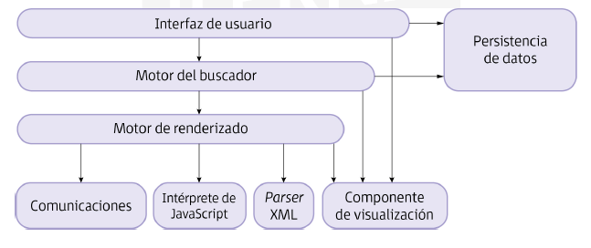
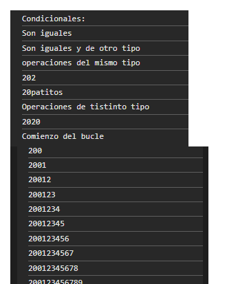
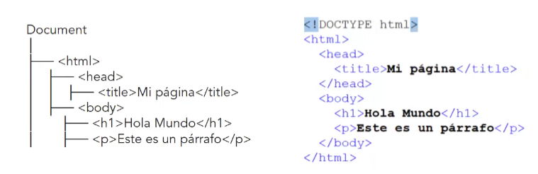

(UF1 Sintaxis del lenguaje. Objetos predefinidos del lenguaje)

Originalmente la página web se creaba mediante el lenguaje de marcas HTML, estando alojada en un servidor 24/7 y a través de peticiones esta página estática era transmitida a los equipos que la hubiesen pedida. 
El **hipertexto** es una palabra o frase que al acceder a ella conduce a una información relacionada. Las páginas webs estaban basadas en este contexto.
Posteriormente, el auge de las webs lleva a crear un consorcio que estandarizó el lenguaje y dio especificaciones al respecto, ocupándose de desarrollar y mantener los estándares web (**W3C**)

El **desarrollo web** es importante para implementar las tecnologías webs; se ve condicionado y requiere dominar diversos aspectos del proceso de desarrollo: funcionamiento interno y diseño digital, captación de necesidades y presentación del producto final.  Es un campo multidisciplinar.

El **programador web** debe:
- dominar todas las fases por las que pasa el proyecto
- captar las necesidades del cliente
- definir unos objetivos y una estrategia
- desarrollar interfaz gráfica
- elaborar prototipos y presentación final
- conocer el orden de cada fase y qué realizar en cada una de ellas
## 1. Modelos de ejecución de código

**Campos que comprende el diseño web**
El diseño web (multidisciplinar) comprende los siguientes campos:
- **Visual**: Es de los aspectos demás importantes. Su objetivo es **la comunicación e intentar atraer a los clientes**. Si se causa buena sensación a los visitantes, aumentan las posibilidades de que estos vuelvan a visitar la web.
- **Tecnología:** **Decidir cómo se va  implementar el sitio web o qué tecnologías se van a utilizar** es uno de los aspectos más influentes y de ello dependen las características del sitio web (página web dinámica o estática; bases de datos que se usarán, etc.)
- **Distribución**: **Velocidad y fiabilidad de la transmisión de datos**
- **Propósito:** Todo proyecto debe tener un objetivo. En la mayoría de los casos la finalidad es **económica** intentando conseguir una gran difusión del producto en el mercado laboral. También puede ser **informativa** para difundir algún acto o evento general que pueda interesar al público.

**Arquitectura que presentan los sitios web**
Está basada en el **modelo cliente-servidor**. Este tiene los siguientes tres elementos comunes:
- **El servidor**: En él están instalados los elementos hardware y software, así como las técnicas incrustadas y los lenguajes de programación instalados en la máquina. Se aconseja para implementar estas tecnologías web un lenguaje de programación multihilo.
- **La máquina cliente**: En él se tienen implementados los programas que realizan la petición de solicitud web al servidor a través de los navegadores, que deben ser capaces de soportar las tecnologías del sitio web (HTML, CSS) y otros lenguajes como JavaScript y controles como ActiveX.
- **La conectividad de la red** y las **características utilizadas para el sitio web**

**El objetivo de un navegador es presentar la información, escrita normalmente en lenguaje HTML y que se encuentra alojada en un servidor con el servicio web instalado**

Se debe diferenciar entre:
- **Lenguajes basados en entorno cliente**: Son ejecutados por los clientes, normalmente en un navegador web
- **Lenguajes basados en entorno servidor**: Son lenguajes que se ejecutan en el servidor
## 2. Lenguajes de programación en entorno cliente

Debido al gran abanico disponible orientados a la programación web es muy importante saber elegir el lenguaje web que será implementado. Cada uno presenta ventajas e inconvenientes y también depende del lenguaje con el que mejor se desenvuelva el desarrollador y su opinión. 

Al hablar de **páginas web dinámicas** los lenguajes de cliente y de servidor **se complementan a la hora de crear un sitio web**:
Un sitio web que se crea con lenguaje orientado a entorno servidor necesita recoger las peticiones que se realizan desde un lenguaje de entorno cliente y tener la posibilidad de guardar la información en una base de datos.

Ej.: Es necesario comprobar la información recogida en un formulario web antes de que esta se almacene en la base de datos del servidor. La validación se realiza mediante un lenguaje de cliente y el almacenamiento en base de datos se realiza mediante un lenguaje de servidor.

En el **entorno cliente** para tener una página lo más completa posible **se recomienda la combinación de varios lenguajes**. Se puede diferenciar entre:
- Lenguajes que permiten dar formato al texto y estilo de la página (HTML, CSS)
- Lenguajes que permiten crear páginas dinámicas con lenguajes de script (JavaScript)

**JavaScript** es un lenguaje útil en el lado del cliente y que soportan la mayoría de navegadores y sistemas operativos.

Se pueden considerar **cuatro capas de desarrollo en el lado del cliente**:

| Capas en entorno cliente                   |                                         |
| ------------------------------------------ | --------------------------------------- |
| Capa de comportamiento (JavaScript)        |                                         |
| Capa de presentación (CSS)                 |                                         |
| Capa de estructura (DOM / Estructura HTML) | Contenido estructurado (Documento HTML) |
| Capa de contenido (Texto, imágenes, etc.)  | Contenido estructurado (Documento HTML) |

## 3. Mecanismos de ejecución de código en un navegador web

Cada **navegador web tiene su propia forma de interpretar la interacción con un usuario**.

La interacción se inicia cuando el usuario indica la dirección del recurso al cual quiere acceder y finaliza con la visualización de este en un navegador.

El proceso depende del propósito del navegador y de la configuración de este. Un navegador puede estar centrado en ofrecer una respuesta más rápida o una respuesta más fiel al contenido del recurso obtenido o en priorizar aspectos de seguridad de comunicaciones con el servidor, etc. 

### 3.1. Arquitectura de referencia

**La arquitectura del navegador**: Cada navegador está formado por una serie de elementos y componentes determinados. En la mayoría de ellos coinciden una serie de componentes básicos y comunes llamados **arquitectura de referencia**



- **Interfaz de usuario**: Capa que actúa como interfaz entre el usuario y el motor del buscador. Funcionalidades:
	- Visualización de barras de herramientas
	- Progreso de la carga de la página
	- Gestión inteligente de las descargas
	- Preferencias de configuración de usuario o impresión
	- En algunos casos, mantener comunicación con el sistema operativo para manejo de sesiones y preferencias de visualización o configuración
- **Motor del buscador**: Ofrece una interfaz para el motor de renderizado. Su principal función es cargar una dirección determinada (URI o URL) y soportar mecanismos básicos como volver a la página anterior o siguiente o recargar la página. Es el componente que carga las alertas de JavaScript.
- **Motor de renderizado**: Presenta de forma visual el recurso obtenido a partir del acceso a una dirección web. Interpreta el código de la web en función de los lenguajes utilizados. Es capaz de mostrar documentos HTML, XML, CSS e incluso documentos embebidos en la página (audio/vídeo) e imágenes.
- **Subsistema de comunicaciones**: Implementa los protocolos de transferencia de archivos y los documentos que se utilizan en Internet. 
- **Intérprete de JavaScript**: Responsable de analizar y ejecutar el código de JavaScript como los eventos de ratón o teclado u otro código intercalado para ciertas funcionalidades.
- **Parser XML**: Facilitar el acceso a los contenidos definidos en un documento HTML. Permite cargar en memoria una representación en árbol (DOM) de la página. Facilita y agiliza el acceso a los elementos de una página.
- **Componente de visualización**: Funcionalidades para la visualización del contenido de un documento HTML
- **Subsistema de persistencia de datos**: Almacena diferentes tipos de datos para los principales subsistemas del navegador como historiales de navegación, mantenimiento de sesiones de usuario o preferencias de configuración del navegador. A nivel más bajo también almacena certificados de seguridad y cookies.

## 4. Capacidades y limitaciones de ejecución

Cualquier sitio web que funcione de forma dinámica está gestionado por lenguajes de script ubicados en el lado del servidor. A su vez en el lado cliente **se recomienda el uso de JavaScript por las siguientes razones**: 
- JavaScript no puede escribir ficheros en el entorno servidor, una de sus funcionalidades es preparar los datos que van a ser enviados o ceder los datos para que sean tratados en otro lenguaje.
- Se debe preparar el sitio web para que sea navegable sin la opción de JavaScript. Se utiliza JavaScript para crear una navegación web rápida/moderna/divertida pero si el navegador no lo tuviera habilitado la web no debería quedarse inactiva
- Los datos obtenidos desde el lado del servidor serán examinados mediante este lenguaje y actualizará las diferentes secciones o partes de la web

El lenguaje JavaScript está orientado para dar algunas de estas soluciones:
- Dar un feedback al usuario desde formularios o hipertexto
- Ofrecer interfaz amigable
- Controlar los plugins, marcos de navegación o applets de Java
- Procesar los datos del formulario antes de ser enviados
- Modificar de forma dinámica los estilos y contenidos en los navegadores

## 5. Programación de guiones

Los guiones se pueden colocar en uno de los dos sitios posibles de un documento HTML:
- Entre las etiquetas `<head>` y `</head>` (encabezado del guion)
- Entre las etiquetas `<body>` y `</body>` (cuerpo del guion).

`<script>` es la etiqueta contenedora HTML que designa los guiones.

```html
<script type="text/javascript">
	document.write("¡Hola Online!");
</script>
```

(Etiqueta de apertura de guión). Esta le comunica al navegador que espere código JavaScript en lugar de HTML.
Contenido de JavaScript, indicando ; para que el ínterprete sepa que la línea ha terminado
(Etiqueta de cierre de guión)
## 6. Integración de código con las etiquetas HTML

Los navegadores aceptan la integración del código HTML en varias formas.

- **Con `<script>` y el atributo `type` (que indicará el tipo de lenguaje que se utiliza)**

```html
<script type="text/javascript">
	// Código en JavaScript
</script>
```

- **Mediante un fichero externo que contenga el código**
Es la forma más recomendada, permite considerar de forma independiente los códigos implementados en distintos lenguajes y correspondientes a distintas partes de la web (estructura, formato y tratamiento). 

Se tiene la opción de compartir el mismo fichero para varios HTML, facilitar la depuración de errores, contribuir a la claridad en el entendimiento del código, modularidad, seguridad y rapidez. 

Se hace uso del atributo `src` con el nombre del fichero (si es JavaScript tendrá normalmente extensión .js)

Se puede usar la ruta **relativa** (direccionar la ruta desde el directorio en el que nos encontramos), la ruta **absoluta** (desde el directorio raíz o ruta de la unidad en cuestión) o la ruta **remota** (se comienza con el protocolo http)

```html
<script text="text/javascript" src="tucodigo.js"></script>
<script text="text/javascript" src="http://www.midominio.com/tucodigo.js"></script>
<script text="text/javascript" src="../js/tucodigo.js"></script>
```

Cuando el navegador no soporte los scripts que se implementan, se puede informar al usuario usando la marca `<noscript>`

**Para insertar código JavaScript en XHTML debe considerarse algún detalle...**
(XHTML sirviéndose como `application/xhtml+xml`)

```xhtml
    <script type="text/javascript">
//<![CDATA[
      function saludar() {
        alert("Hola desde XHTML con JavaScript!");
      }
//]]>
    </script>
```

**Licencia del código**
También puede añadirse licencia al código para que cuando lo use otro creador, visualice la licencia de su creador Creative Commons.
## 7. Herramientas de programación sobre clientes web. Herramientas y lenguajes asociados

Para desarrollar código se puede usar un editor simple de texto tanto para HTML como para JavaScript.
Aunque también hay gran variedad de editores que pueden ser usados **a elección del desarrollador**.

Algunas pautas:
- **No utilizar editores orientados a modificar contenidos y presentación** como FrontPage o Dreamweaver ya que lo que interesa es desarrollar código
- **La facilidad para almacenar ficheros HTML y para el desarrollo de la programación web** son de los aspectos más importantes a tener en cuenta: codificación de colores, verificación de la sintaxis, inserción de comentarios, generación de bloques de código, disposición de opciones extra (por ej. clientes FTP). 
- Algunos editores gratuitos son Notepad++, Eclipse, NetBeans, KompoZer y Bluefish
- Para programar no se necesita conexión a Internet, solo un navegador que soporte la lectura de código JavaScript (Mozilla, Firefox, Google Chrome, Safari, Opera, Internet Explorer)
- Se recomienda tener dos o tres navegadores para poder realizar cualquier comprobación

**Para realizar un portal web se recomienda:**
1. **Empezar codificando** el código HTML, JavaScript y CSS
2. **Guardarlo con sus respectivas extensiones y ejecutarlo en los navegadores**. Si en cualquier momento se realizan modificaciones, simplemente debe recargarse el navegador para visualizar los cambios ocasionados
3. La **validación** es el último paso para finalización del portal web. Se ahorran horas de comprobaciones, se asegura la validez del código y se detectan las imperfecciones que poseen los distintos archivos que componen el portal web. Cuánto más se ajuste a las especificaciones del estándar, mejor resultado se obtendrá entre los diferentes tipos de navegadores. La estandarización del consorcio W3C rige las validaciones pudiéndose acceder a http://validator.w3.org

### 8. Algún ejemplo de JavaScript y cosillas varias

```html
<!DOCTYPE html>
<html lang="en">
<head>
  <meta charset="UTF-8">
  <title>Title</title>

  <style type="text/css">
    a{
      background-color: black;
      color: white;
      font-size: xx-large;
    }
  </style>

</head>
<body>
<script type="text/javascript" src="ejemplo1.js"></script>
  <a class="boton" onclick="eje()">PULSAME</a>
</body>
</html>

```

```javascript
function eje() {
  var a = "20";
  var b = 20.0;

  console.log("Condicionales:")
  if (a == b) {
    console.log("Son iguales")
  }
  if (a === b) {
    console.log("Son iguales y del mismo tipo")
  } else {
    console.log("Son iguales y de otro tipo")
  }
//------------------------------------------------------------------
//------------------------------------------------------------------
  console.log("operaciones del mismo tipo")
  var suma = a + 2;  // String + 2  lo asimila a String y lo concatena "202"
  console.log(suma)
  var suma = b + "patitos" // Float + String.  Lo asimila a String y lo concatena.
  console.log(suma)
  console.log("Operaciones de tistinto tipo")
  console.log(a + b) // String + Float. Lo asimila a String y lo concatena "2020"
  console.log("Comienzo del bucle")
  for (var i = 0; i < 10; i++) {
    a = a + i // Los asimila a String y los concatena. 
    console.log(a)
  }
}
```



#### Diferencias entre var/let

#### var
- Ámbito de **función**
- Su valor es `undefined` hasta que se asigna un valor
- Se puede declarar más de una vez en el mismo ámbito
#### let
- Ámbito de **bloque**
- Solo se puede acceder en el bloque "{}"
- No puede ser usada antes de su declaración, produce error si se usa antes
- No se puede declarar más de una vez en la misma función

```javascript
function ejemploVar() {
	var nombre = "Ana";
	if (true) {
	// Sobreescribe la original
		var nombre = "Carlos";
	}
	console.log(nombre); // Imprime "Carlos"
}


function ejemploLet() {
	let edad = 25;
	if (true) {
		// La edad solo existe dentro del bloque
		let edad = 30;
	}
	console.log(edad);
}

console.log(x); // ❌ ReferenceError: Cannot access 'x' before initialization
let x = 10;
console.log(x); // ✅ 10

console.log(y); // Undefined
var y = 10;
console.log(y); // ✅ 10
```


## Modelo de Objetos del Documento (DOM)

- Representación interna del documento HTML en el navegador como un árbol de objetos
- Cada etiqueta se considera un elemento y cada elemento se considera un objeto. Estos objetos tienen propiedades a las que se puede acceder y modificar. 
- Con JavaScript se puede acceder a métodos depe4ndendiendo del tipo de objeto. 



**Objeto**: `var nombreObjeto = new Object()`
**Propiedades**:  `nombreObjeto.propiedad`
**Método**: `nombreObjeto.metodo([parametros])`

## Objetos nativos de JavaScript

### String

Manipular cadenas de caracteres.
(developer.mozilla.org/es/docs/Web/JavaScript/Reference/Global_Objects/String)

**Propiedades**
- `lenght`: Devuelve el número de caracteres
**Métodos**
- `chatAt(posicion)`: Carácter en una posición
- `concat("cadenaNueva"`: Añade a continuación del string la cadena, "cadenaNueva"

```javascript
var texto = new String("Hola");
console.log(texto.length);
console.log(texto.indexOf("1"))
var otroTexto = "Hola";

//¡Atento!
console.log(typeof texto); // Object
console.log(texto instanceof String); // true
console.log(texto == "Hola"); // false

console.log(typeof otroTexto); // "string"
console.log(otroTexto instanceof String); // false
console.log(otroTexto == "Hola") // true

```

### Math

Permite realizar operaciones matemáticas

**Propiedades**
- `PI`: Valor de PI
**Métodos**
- `cos(valor)`: Valor de coseno
- `sqrt(valor)`:Valor de raíz cuadrada

### Number

Trabajar con valores numéricos a niveles absolutos de la máquina o con características específicas.

**Propiedades**
- `MAX_VALUE`: Valor más alto del que se dispone
- `MIN_VALUE`: Valor más bajo del que se dispone
**Métodos**
-` isInteger()` :  Indica si es un entero


### Date

Permite realizar operacion fechas. Se considera como fecha inicial el inicio del Timestamp (1 de enero de 1970).

**Constructor**
```javascript
new Date();
new Date(milisegundos);
new Date(cadena de Fecha);
new Date(año, mes, dia, hor, min, seg, mil);
```
**Métodos**
```javascript
getDate(); Día del mes
getMonth(); Número de mes (0-11)
setMonth(); Establecer valores...
```

```javascript
var fechaHoy = new Date();
fechaHoy.setDate(13);
fechaHoy.setMonth(9);
fechaHoy.setYear(2021);
```


**toISOString** 

```javascript
let fecha = new Date();
let fechaISO = fecha.toISOString(); 
console.log(fechaISO); // Ejemplo de salida: "2025-03-08T12:45:30.000Z"
```

**toLocaleDateString**
```javascript
let fecha = new Date();

// Formato con opciones
let opciones = { weekday: 'long', year: 'numeric', month: 'long', day: 'numeric' };
let fechaFormateada = fecha.toLocaleDateString('es-ES', opciones);
console.log(fechaFormateada);  // Ejemplo de salida: "sábado, 8 de marzo de 2025"
```

### Window

Controla la ventana del navegador. Permite crear y manejar otras ventanas.

**Propiedades**
- `document`: Accede a los elementos del documento
- `location`: URL de barra de direcciones
**Métodos**
- `alert()`: Aviso
- `confirm()`: Mensaje de aceptar/cancelar
- `open()`: Abrir nueva ventana

### Document

Acceder a todos los elementos del documento

**Métodos**
- `document.getElementById(ID)`: Nodo que corresponde con el identificador ID.
- `document.getElementByTagName('etiqueta')`: Devuelve lista con todos los elementos que tengan una etiqueta
- `document.getElementsByClassName("clase")`: Devuelve lista con todos los elementos que sean de una clase
- `document.querySelector(".miClase")`: Selecciona el primer elemento que coincide con un selector CSS dentro del documento o devuelve null si no encuentra ninguno. ( `Node)
- `document.querySelectorAll('u')`: Devuelve todos los elementos que coinciden con tag o selector CSS dentro del documento en una `NodeList`.

### Screen

Información sobre la pantalla del usuario. Solo valores fijos para consultar.

**Propiedades**
- `window.screen.height`: Altura de la pantalla
- `window.screen.availHeight`: Altura disponible en pantalla.

### Creación de clases

```javascript
class Persona(
	constructor(nombre, apellido, edad) {
		this.nombre = nombre;
		this.apellido = apellido;
		this.edad = edad;
	}

	getEdad() {
		return this.edad;
	}
)
```

```javascript
var yo = new Persona("Pepito", "Pérez", 25);
alert(yo.getEdad());
```


### Ejemplos

#### PRIMER EJEMPLO: Implementar listeners para modificar el DOM

Puedo usar **onClick**: 

```javascript
listaEnlaces[i].onclick = function() {  
  document.getElementById('eleccion').innerHTML = this.innerHTML;  
}
```

Puedo usar **addEventListener**: 

```javascript
listaEnlaces[i].addEventListener('click', actualizarValor)
```

Con `addEventListener` es mejor porque:
- puedo agregar tantos eventos como quiera al elemento
- removerlos con `removeEventListener`  

También soporta eventos adicionales en el tercer argumento como **capture**, **once**, **passive**  
 - Capture. En lugar de manejarse del abajo hacia arriba (fase burbujeo), se maneja en fase de captura, de arriba hacia abajo  
 - Once. Solo se ejecuta una vez. `,{once: true}`
 - Passive. El evento no llama a preventDefault(), puede mejorar el rendimiento en eventos scroll o toutchstart `,{passive: true}`


#### ¡Cuidado con donde lo pongo y con los estilos!

Imagina que quiero poner el script en mitad del HTML y como me de la gana:
Podría ser así. 

```javascript
var listaEnlaces = document.getElementsByTagName('u');
for (var i = 0; i < listaEnlaces.length; i++) {
  listaEnlaces[i].onclick = function() {
    document.getElementById('eleccion').innerHTML = this.innerHTML;
  }
}
```

Pero bueno, si uno pone el Script en el head y lo quiere hacer decentemente, habría que:
- prevenir que espere a que se cargue todo el DOM para asignar los listeners
- queda mejor usar `querySelectorAll` (devuelve `NodeList` estática) en lugar de `getElementsByTagName`  (devuelve `HTMLCollection` viva)  y eso permite usar  `forEach`. 
- `getElementsByTagName` solo selecciona por etiqueta, pero `querySelectorAll` soporta selectores CSS (`.class`, `#id`, `ul`, `li`, etc.)

Mira qué bien queda así:

```javascript
    document.addEventListener("DOMContentLoaded", function() {
        let listaEnlaces = document.querySelectorAll('u');

        listaEnlaces.forEach(enlace => {
            enlace.addEventListener('click', function() {
                document.getElementById('eleccion').innerHTML = this.innerHTML;
            });
        });
    });
```

```html
<!DOCTYPE html>  
<html lang="en">  
<head>  
  <meta charset="UTF-8">  
  <title>Ejemplo 1</title>  
  <script type="text/javascript" src="script.js"></script>  
</head>  
<body>  
  
<h1>Ejemplo 1</h1>  
<h2>Pulsa en cualquiera de los enlaces para actualizar el valor que se muestra por pantalla</h2>  

<!-- La etiqueta <u> se usaba antes para subrayar, aunque actualmente es desaconsejada y se aconseja hacerlo mediante CSS !-->
<u>PATATAS</u>  
<u>MACARRONES</u>  
<u>COLIFLOR</u>  
  
<p>En esta casa hoy se come: <span id="eleccion"></span></p>  
  
</body>  
</html>
```


#### SEGUNDO EJEMPLO: Implementar listeners para modificar el DOM

```html
<!DOCTYPE html>
<html lang="en">
<head>
  <meta charset="UTF-8">
  <title>Title</title>
  <script type="text/javascript" src="script.js"></script>
</head>
<body>

<h2> La fecha actual es: <span id="fecha"></span></h2>

Si multiplico el segundo actual (<span id="segundo"></span>) por el valor de PI, obtenemos un número <span id="parimpar"></span> (<span id="resultado"></span>)

</body>
</html>
```

```javascript
document.addEventListener('DOMContentLoaded',function() {  
  
  let resultado;  
  let fechaElemento = document.getElementById('fecha');  
  let segundoElemento = document.getElementById('segundo');  
  let resultadoElemento = document.getElementById('resultado');  
  let esParElemento = document.getElementById('parimpar');  
  let styleBody = document.querySelector('body').style  
  
  function actualizarFechaYResultado() {  
    let fechaActual = new Date();  
    let segundo = fechaActual.getSeconds();  
    resultado = (segundo * Math.PI).toFixed(0);  
    fechaElemento.innerHTML = fechaActual.getDate() + " de " + fechaActual.toLocaleString("es-ES", {month: "long"}) + " de " + fechaActual.getFullYear();  
    segundoElemento.innerHTML = segundo;  
    resultadoElemento.innerHTML = resultado;  
    let esPar = (resultado % 2 === 0);  
    console.log(esPar);  
    esParElemento.innerHTML =  esPar ? "par" : "impar";  
    styleBody.backgroundColor = cambiaColor(esPar);  
  }  
  
  actualizarFechaYResultado();  
  setInterval(actualizarFechaYResultado, 1000);  
})  
  
function cambiaColor(esPar) {  
  return esPar ? "red": "blue";  
}
```

#### TERCER EJEMPLO: El usuario inserta un texto y, cuando pulse insertar, debe ponerse en Texto de ejemplo. Al pulsar los botones + o - el texto debe aumentar o disminuir de tamaño. 

```html
<!DOCTYPE html>  
<html lang="en">  
<head>  
  <meta charset="UTF-8">  
  <title>Mi texto</title>  
  <script type="text/javascript" src="script.js"></script>  
</head>  
<body>  
  
<h1>Este ejemplo amplía el tamaño del texto</h1>  
  
<p><input type="text" id="texto" tabindex="1"><button id="insertar" tabindex="4">Insertar</button></p>  
  
<p></p><button id="grande" tabindex="2">+</button><button id="pequeno" tabindex="3">-</button></p>  
  
<p class="insertado" style="font-size: 200%;">Texto de ejemplo</p>  
  
</body>  
</html>
```

```javascript
document.addEventListener('DOMContentLoaded', function(){

  let btInsertar = document.getElementById('insertar');
  let btMax = document.getElementById('grande');
  let btMin = document.getElementById('pequeno');

  let inputText = document.getElementById('texto');
  let insertado = document.querySelector('.insertado');

  document.addEventListener('keydown', pulsaTecla)
  btInsertar.addEventListener('click', insertarTexto)

  btMax.addEventListener('click', ampliarTexto)
  btMin.addEventListener('click', reducirTexto)

  function insertarTexto() {
    insertado.textContent = inputText.value;
    inputText.value = "";
  }

  function ampliarTexto() {
    let size = parseFloat(window.getComputedStyle(insertado).fontSize) + 10;
    insertado.style.fontSize = `${size}px`
  }

  function reducirTexto() {
    let size = parseFloat(window.getComputedStyle(insertado).fontSize) - 10;
    insertado.style.fontSize = `${size}px`
  }

  function pulsaTecla(event) {
    console.log(event.key)
    if (event.key === 'Enter') {
      console.log("es enter");
      event.preventDefault(); //Prevenir la accion predeterminada
      insertarTexto();
    } else if (event.key === '+') {
      ampliarTexto();
    } else if (event.key === '-') {
      reducirTexto();
    }
  }

})

```