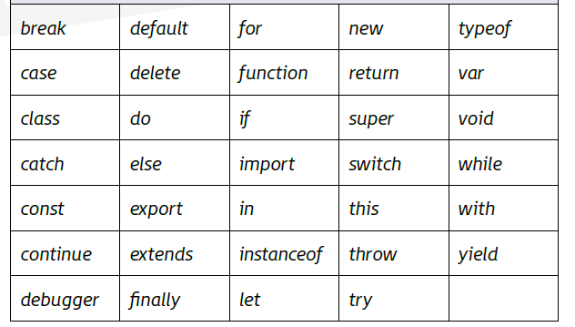
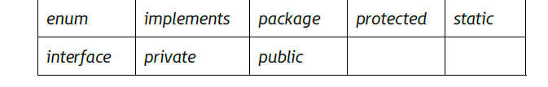
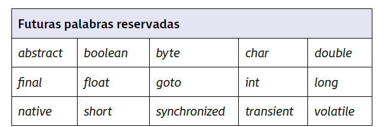
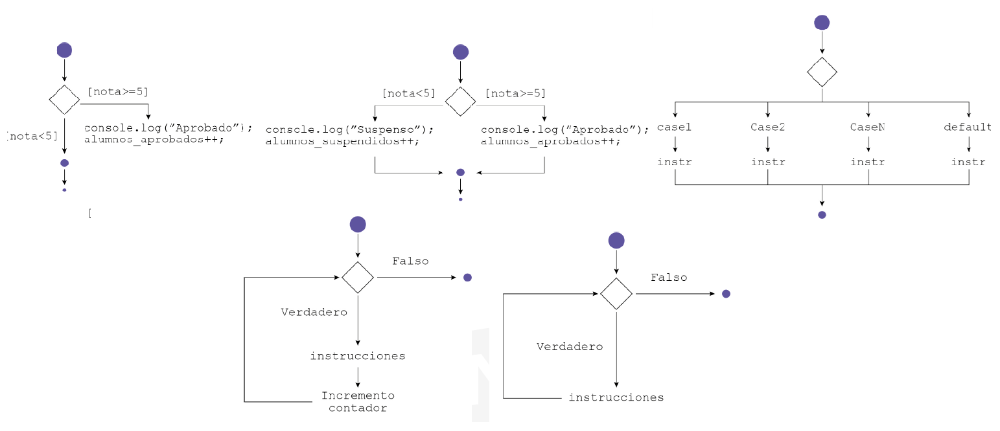

(UF1 Sintaxis del lenguaje. Objetos predefinidos del lenguaje)

## 1. Selección de lenguaje de programación de clientes web

Respecto a JavaScript:
- Hay otros lenguajes similares como **Jscript** que es una variante de JavaScript desarrollada por Microsoft
- Toma como referencia el **lenguaje C.** Los lenguajes de la programación moderna de alto nivel parten también de esa base. Eso facilita la adaptación, conversión y compatibilización de JavaScript con lenguajes de la misma base. La sintaxis de las sentencias tiene formato parecido por lo que no es complicado adquirir su semántica.
- Fue desarrollador por **Netscape**. Su nombre inicial fue **Mocha**; después **LiveScript** y finalmente **JavaScript**
- Pertenece actualmente a **Oracle Corporation,** aunque usa licencias de productos Netscape como pasa con el navegador Mozilla que pertenece a la misma empresa. 

## 2. Tipos de datos

En JavaScript no es necesario almacenar el mismo tipo de datos en una misma variable. En las declaraciones no se especifica el tipo.

Hay tres tipos de datos primitivos:
- Números
- Cadenas de texto
- Valores booleanos

Hay un tipo de dato compuesto: Object, que representa una serie de valores primitivos y de valores compuestos por otros objetos.

| Tipo          | Descripción                        |
| ------------- | ---------------------------------- |
| **String**    | Carácteres de texto                |
| **Number**    | Tipo numérico (decimal o entero)   |
| **Boolean**   | Entidad lógica (true o false)      |
| **Null**      | Con valor null                     |
| **Object**    | Pertenece a un objeto de una clase |
| **Undefined** | No inicializada                    |
**Ejemplos**

```javascript
var miEntero = 12;
var miDecimal = 2.33;
var comaFlotante = 1234.987555;
var miCadena = "Esto es cadena";
var miBooleano = true;
var miVariable = null;
var miObjecto = new Object();
```

**Conversiones de tipos de datos**
Puede ocurrir que el compilador trate la variable de un tipo y el desarrollador desee que se trabaje con otro. Existe la posibilidad de convertir los tipos de datos en el tipo deseado por el desarrollador. 

Funciones para la **conversión de cadenas de caracteres en datos numéricos** como: `parseInt(string)` o `parseFloat(string)`

Para pasar **un dato numérico a cadena de caracteres** simplemente debe concatenarse una cadena vacía al principio de la variable `"" + 5`

## 3. Variables

**Variable** es una zona de memoria identificada con un nombre y en la cual se almacenan ciertos datos.

El tiempo que dicha información permanece almacenada dependerá del desarrollador y del tipo de memoria que se esté utilizando. 
Cuando el navegador limpia la ventana, todas las variables conocidas son eliminada.

**Creación o declaración en el código**
Es el primer paso para hacer uso de la variable.
Se puede hacer:

- Inicializándola través de la palabra `var` seguida del nombre de la variable o identificador
- Inicializándola y además asignándole también un valor
```javascript
var numero;

var numero = 14;
```


**No es necesario indicar el tipo de dato**. Como ya se ha dicho la variable de JavaScript puede almacenar diferentes tipos de valores, lo cual es ventajoso porque no obliga al programador a fijar el tipo de dato a utilizar. 

- El nombre debería estar relacionado con el dato que se almacena.
- No se pueden usar palabras reservadas por el compilador para identificar a la variable
- No puede contener espacios en blanco, ni símbolos de puntuación, solo caracteres alfanuméricos y el guion bajo (_)
- La identificación de la variable no puede comenzar por un número

**Palabras reservadas**
Según la versión 6 de ECMAScript las palabras reservadas que no pueden ser usadas en variables funciones o etiquetas son:


También hay palabras reservadas a futuro cuando se encuentre el modo correcto para su estructura de código:



Y también hay palabras reservadas como futuras palabras por la antigua especificación ECMAScript1 hasta ECMAScript3. Es buena praxis mantenerlas como reservadas:



Adicionalmente null, true y false también son palabras reservadas.
## 4. Asignaciones y operadores

La **asignación** consiste en almacenar el valore n la variable correspondiente. Se lleva a cabo con el operador `=`, aunque también existen otros operadores de asignación que buscan ahorrar tiempo y disminuir la cantidad de código escrito en los programas.

Se asigna el valor a la derecha de la expresión a la variable que está a la izquierda. 

- Sobre las variables se pueden realizar **operaciones**
- Las operaciones se llevan a cabo mediante **operadores**
- Cualquier **variable** o valor sobre el que se realiza una operación se llama **operando**
- Una **expresión** puede contener un número de operandos y un operador

Los **tipos de operaciones** los podríamos clasificar en:
- Comparación
- Aritméticos
- Booleano
- Asignación
- Condicionales

### 4.1. Comparación

Devuelven como resultado un tipo booleano.

| Operador | Nombre                  | Descripción                                                                                      |
| -------- | ----------------------- | ------------------------------------------------------------------------------------------------ |
| <        | Menor que               | Si el operando de la izquierda es menor que el operando de la derecha.                           |
| <=       | Menor o igual que       | Si el operando de la izquierda es menor o igual que el operando de la derecha.                   |
| ==       | Igual                   | Si los dos operandos son iguales                                                                 |
| >        | Mayor que               | Si el operando de la izquierda es mayor que el operando de la derecha.                           |
| >=       | Mayor o igual que       | Si el operando de la izquierda es mayor o igual que el operando de la derecha.                   |
| !=       | Diferente               | Si los dos operandos son diferentes                                                              |
| ===      | Estrictamente igual     | Si el operando de la izquierda es igual y del mismo tipo que el operando de la derecha.          |
| !==      | Estrictamente diferente | Si el operando de la izquierda es diferente y/o de tipo diferente que el operando de la derecha. |

### 4.2. Aritméticos

Devuelven como resultado un tipo numérico

| Operador | Nombre         | Descripción                                         |
| -------- | -------------- | --------------------------------------------------- |
| +        | Suma           | Suma entre dos operandos                            |
| -        | Resta          | Resta entre dos operandos                           |
| \*       | Multiplicación | Multiplicación entre dos operandos                  |
| /        | División       | División entre dos operandos                        |
| %        | Módulo         | Resto del resultado de división entre dos operandos |
| ++       | Incremento     | Permite incrementar un valor                        |
| --       | Decremento     | Permite decrementar un valor                        |
### 4.3. Booleano

Operaciones de conjunción entre los operandos. Devuelve una condición a partir de dos condiciones. Combinan o manipulan expresiones lógicas evaluando si su resultado es verdadero o falso.

| Operador | Nombre | Descripción                              |
| -------- | ------ | ---------------------------------------- |
| &&       | Y      | Operación booleana AND sobre los valores |
| \|\|     | O      | Operación booleana OR sobre los valores  |
| !        | No     | Invierte el valor booleano del operando  |

### 4.4. Asignación

Además del operador de asignación `=`, JavaScript tiene operadores de asignación que tienen una característica común con los operadores aritméticos de incremento y decremento: se evita escribir dos veces el nombre de la variable que se encuentra a la izquierda del operador. 

`+=` (Suma y asigna el valor al operando de la izquierda)

`-=` (Resta y asigna el valor al operando de la izquierda)

`*=` (Multiplica y asigna el valor al operando de la izquierda)

`/=`(Divide y asigna el valor al operando de la izquierda)

`%=`(Módulo y asigna el valor al operando de la izquierda).

`<<=`
- **Desplazamiento a la izquierda con asignación**
- Mueve los bits de la variable hacia la izquierda `n` veces (multiplica por potencias de 2)
- `a <<= 2` equivale a `a = a << 2`.

`>>=`
- **Desplazamiento a la derecha con signo con asignación**.
- Mueve los bits a la derecha, conservando el bit de signo (preserva el valor negativo si lo tiene).
- `a >>= 1` equivale a `a = a >> 1`.

`>>>=`
- **Desplazamiento a la derecha sin signo con asignación**.
- Igual al anterior, pero **rellena con ceros**, ignorando el bit de signo (convierte a positivo).
- `a >>>= 1` es útil para trabajar con enteros sin signo.

`&=`
- **AND bit a bit con asignación**.
- Hace una operación AND binaria entre `a` y `b` y guarda el resultado en `a`.
- `a &= b` es como `a = a & b`.

`|=`
- **OR bit a bit con asignación**.
- Opera con OR binario entre `a` y `b`.
- `a |= b` es como `a = a | b`.

`^=`
- **XOR bit a bit con asignación**.
- `a ^= b` es como `a = a ^ b`.

`[]`
Con esto se podría crear un array... (Lo menciona como operador de asignación, supongo que por eso)
### 4.5. Condicionales

Son operadores "algo más complejos". Permite indicar al navegador que ejecute una acción en concreto después de evaluar una expresión.

- Expresión a evaluar
- Acción a realizar si es verdadera
- Acción a ejecutar si es falsa

```javascript
var estado = (edad >= 18 ? "adulto" : "menor");
```

## 5. Sentencias

- Las aplicaciones de JavaScript se forman mediante **sentencias** con sintaxis propia.
- Una sentencia puede formarse por múltiples líneas y contener varias sentencias de una sola línea si están separadas por un punto y coma.
- No es una sola palabra clave, es un grupo de palabras clave.

**Control de flujo**

| Sentencia   | Descripción                                                                                                                                          |
| ----------- | ---------------------------------------------------------------------------------------------------------------------------------------------------- |
| block       | Bloque de sentencias. Utilizado para agrupar sentencias. Está delimitado por llaves                                                                  |
| break       | Finaliza una sentencia loop, switch o label y transfiere el control a la siguiente sentencia                                                         |
| continue    | Finaliza la ejecución de sentencias en el interior del actual bucle y pasa a la siguiente iteración                                                  |
| empty       | Provee una "no sentencia", aunque la sintaxis de JavaScript esperaba recibir una.                                                                    |
| if...else   | Si las condición es true ejecuta la sentencia, si es false ejecuta otra diferente                                                                    |
| switch      | Evalúa una expresión, igualando el valor obtenido en la expresión a una cláusula case y ejecutando las sentencias si la evaluación resulta verdadera |
| throw       | Lanza excepción definida por el usuario                                                                                                              |
| try...catch | Prueba un bloque de sentencias (try) y especifica respuesta en caso de excepción                                                                     |

**Declaraciones**

| Sentencia | Descripción                                    |
| --------- | ---------------------------------------------- |
| var       | Declara una variable                           |
| let       | Declara una variable local de ámbito de bloque |
| const     | Declara una constante de solo lectura          |

**Funciones**

| Sentencia | Descripción                                                                   |
| --------- | ----------------------------------------------------------------------------- |
| function  | Declara una función con unos parámetros especificados                         |
| function* | Generadores de funciones permiten escribir iteradores de una manera más fácil |
| return    | Especifica el valor que será devuelto por la función                          |
| class     | Declara una clase                                                             |

**Iteraciones**

| Sentencia  | Descripción                                                                                                                                                                                                          |
| ---------- | -------------------------------------------------------------------------------------------------------------------------------------------------------------------------------------------------------------------- |
| do...while | Crea bucle que ejecuta una instrucción específica hasta que la condición se evalúe como falsa. La condición se evalúa después de ejecutar la instrucción por lo que, como mínimo, la instrucción se ejecuta una vez. |
| for        | Bucle con tres expresiones opcionales situadas entre paréntesis y separadas por punto y coma. Mientras se cumpla la condición, se ejecutan las sentencias                                                            |
| for...in   | Itera sobre las propiedades numerables de un objeto en orden arbitrario. Para cada propiedad distinta, las instrucciones pueden ser ejecutadas                                                                       |
| while      | Crea bucle que ejecuta la instrucción siempre y cuando la condición de prueba se evalúe como verdadera. La condición es evaluada antes de ejecutar la instrucción                                                    |

**Otros**

| Sentencia | Descripción                                                                                                  |
| --------- | ------------------------------------------------------------------------------------------------------------ |
| debugger  | Invoca funcionalidad de depuración disponible. Si no hay ninguna, la instrucción no tiene efecto             |
| export    | Permite a un script implementar propiedades, funciones y objetos a otros scripts                             |
| import    | Permitir a un script obtener propiedades, funciones y objetos desde otro script                              |
| label     | Proporciona una instrucción con un identificador que se puede referir usando la instrucción break o continue |
| with      | Extiende la cadena de alcance para una instrucción                                                           |

## 6. Estructuras de control

Las instrucciones se ejecutan de forma secuencial (de arriba a abajo y de izquierda a derecha).
Es posible controlar la toma de decisiones y los resultados posteriores a través del uso de **sentencias condicionales**: que permiten evaluar condiciones y ejecutar ciertas instrucciones si se cumplen las condiciones indicadas o ejecutar otras en caso contrario.

### 6.1. Sentencia IF

**Sentencia condicional simple**
```javascript
if (expresionlogica) {
 //Instrucciones
}
```
**Sentencia condicional compuesta**
```javascript
if (expresionlogica) {
 //Instrucciones
} else {
 // Otras instrucciones
}
```
**Anidación**
```javascript
if (expresion) {
// Instrucciones
} else {
	if (otraExpresion) {
		//Otras instrucciones
	} else {
		// Otras instrucciones diferentes
	}
}
```
La anidación podría simplificarse para hacerse más legible:
(**if-else-if**)
```javascript
if (expresion) {
//Otra
} else if (expresion2) {
//Otra
} else if (expresion3) {
//Otra
}
```
### 6.2. Sentencia SWITCH

```javascript
switch (expresion) {
case valor1:
	//Instrucciones
	break;
case valor2:
	//Instrucciones
	break;
case valor3:
	//Instrucciones
	break;	
default:
	//Instrucciones
}
```

Cada uno de los casos debe finalizar con `break` para detener la sentencia switch. Así no se pierde el tiempo evaluando el resto de los casos. 
Las instrucciones del `default` se ejecutan cuando ninguno de los casos coinciden con el valor de la expresión.

### 6.3. Bucle FOR

El bloque se repite un número limitado de veces.

```javascript
for (expresion; condicion; incremento;) {
//Instrucciones
}
```

### 6.4. Bucle WHILE

While y do-while. Usados para repetirse la ejecución de las sentencias un número definido de veces mientras que se cumpla una condición. Normalmente no se sabe cuánto será ese número de veces. 

```javascript
while (condicion) {
//Instrucciones
}
```

```javascript
do {

} while (condicion);
```


---

**Ejemplillos**

```javascript
//Ejemplo de un bucle FOR
for (var i = 1; i <= 40; i++)
{
	//Instrucciones que se ejecutarán 40 veces.
	console.log(i);
}
//Ejemplo de un bucle WHILE
var i = 0;
while (i <= 10)
{
	//Instrucciones a ejecutar dentro del bucle
	hasta que i sea mayor que 10 y no se cumpla la
	condición.
	console.log(i);
	i++;
}
//Ejemplo de un bucle DO-WHILE
var a = 1;
do{
	//Mostrará por consola 2 veces.
	console.log(“El valor de a es: “ + a);
	a++;
}while (a < 3);
```

---------
**Diagramas de flujo**

Por curiosidad, se dejan aquí:


## 7. Comentarios al código

Los **comentarios** son sentencias que el compilador del lenguaje no tiene en cuenta. Permiten a los programadores dejar anotaciones sobre las diferentes decisiones que se han ido tomando a la hora de desarrollar el código.
Ocupan espacio dentro del código de JavaScript, lo que provoca que **formen parte siempre del código fuente y siempre se puedan consultar**

En JavaScript se permiten dos tipos de comentarios según la extensión que ocupan (derivan de Java):
- Con **una sola línea** comenzando con los caracteres `//`
- Con **comentario multilínea** con los caracteres `/*` y `*/`
```javascript
// Hola, comentario de una linea
var numero = 2;
/*
	Esto es un buen comentario multilínea...
*/
```

## 8. Herramientas para programar, probar y depurar el código

Con un **editor** cualquiera se puede implementar el lenguaje JavaScript. Se usarán las mismas herramientas con el objetivo de facilitar poder escribir el código en herramientas de procesador de texto.
Aunque posible usar un bloc de notas, no es el ideal a la hora de programar. Ya que hay editores creados específicamente para crear código y facilitarán mucho el trabajo. 

**Características de los editores**
- **Colorear código**. Se distinguen palabras clave y valores de una variable en diferentes colores, facilitándose la escritura del código. Se pueden modificar estos temas de colores y predefinir preferencias.
- **Facilitar la selección de texto**. Hay combinaciones de teclado que facilitan la selección de texto y distinguen el código del texto normal
- **Navegación avanzada**. Cuando hay documentos con cientos de líneas de código los editores permiten agrupar o expandir bloques de código, miniaturas del código para acceder de forma más rápida a la zona que interese, ir a una línea específica, etc.
- **Búsqueda y reemplazo**. Resultan fundamentales. Buscar y modificar un texto entre diferentes archivos de forma que, si es necesario modificar el nombre de una variable, pueda ser modificada entre los diferentes archivos de forma rápida y cómoda.
- **Autocorrección a la hora de escribir**.  Correctores que indican la palabra correcta si el desarrollador se equivoca a la hora de escribir el código.
- **Uso de abreviaturas**. Trozos de código que se utilizan a menudo y se asocian a una abreviatura. Por ejemplo que al escribir `cl` y pulsar el tabulador se sustituya por `console.log`
- **Añadir extensiones o plugins**. Para añadir funcionalidades normalmente no incluidas en un editor.
### 8.1. Tipos de editores

- **Editores de texto multipropósito**: Especializados en facilitar la escritura de código en cualquier lenguaje, adaptándose al código que se introduzca (JavaScript, PHP,...). Son rápidos y ligeros y, aunque tienen menos herramientas que los editores especializados, dan la posibilidad de incorporar plugins y extensiones. Ejs.: Sublime Text, Notepad++, Geany y TexMate.
- **Editores específicos para el desarrollo web**: Parecidos a los anteriores. Se diferencian en que ya vienen preparados con herramientas y elementos que facilitan el desarrollo del código de las aplicaciones web (HTML, CSS y JavaScript). Ejs.: Visual Studio Code, Atom, Codekit y Brackets
- **Entornos de desarrollo integrados (IDE)**: Incorporan todas las herramientas que se necesitan. Son softwares más complejos. Entornos de trabajo más pesados que tardan más en ejecutarse que los anteriores y pueden ser de pago. Ejs..: WebStorm, Netbeans, Komodo, VisualStudio
- **Editores WYSIWYG**: (what you see is what you get). No son ideales para desarrollar aplicaciones web  pero pueden complementar el trabajo de los demás editores. Permiten visualizar inmediatamente el resultado de un código. Ejs.: Adobe Dreamweaver, SeaMonkey, Coffee Cup y Mobirise.
- **Editores online**: Permiten escribir y visualizar el contenido al instante. No requieren una instalación en la máquina para comprobar su funcionamiento. Se usan normalmente para crear pequeños trozos de código para pequeñas demostraciones. Ejs.: CodePen, Webmakerapp, CSS Deck.
### 8.2. Gestores de lenguajes HTML

Al diseñar todo el código HTML/JavaScript, queda visualizarlo en un navegador.

Para crear cualquier página web se necesita un editor de texto y un navegador web. (Se ha comentado mil veces ya)

Navegadores web... Internet Explorer, Firefox, Google Chrome. Con sus respectivas actualizaciones se va facilitando la visualización del código de la página y la identificación de posibles errores que pudiera haber en ella. 
