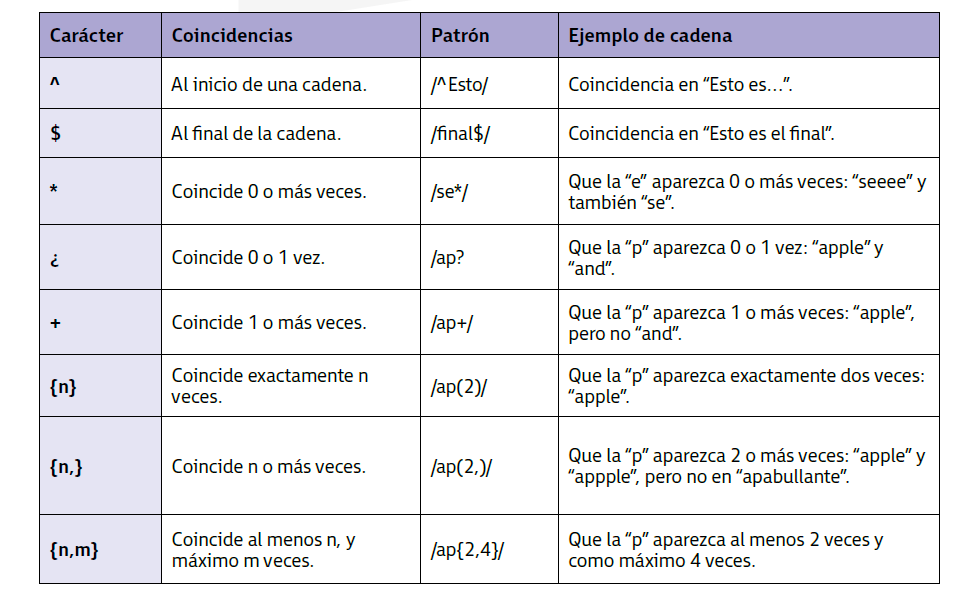
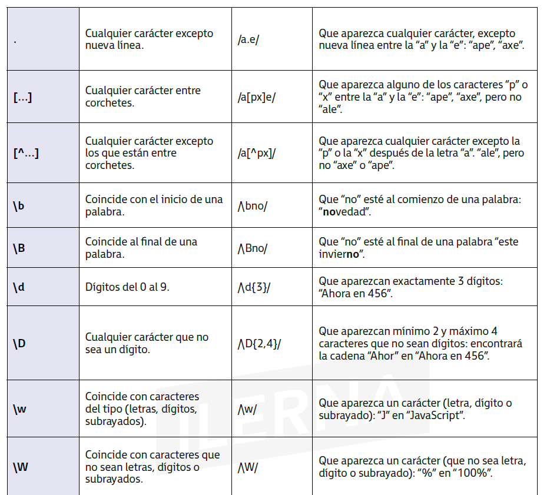
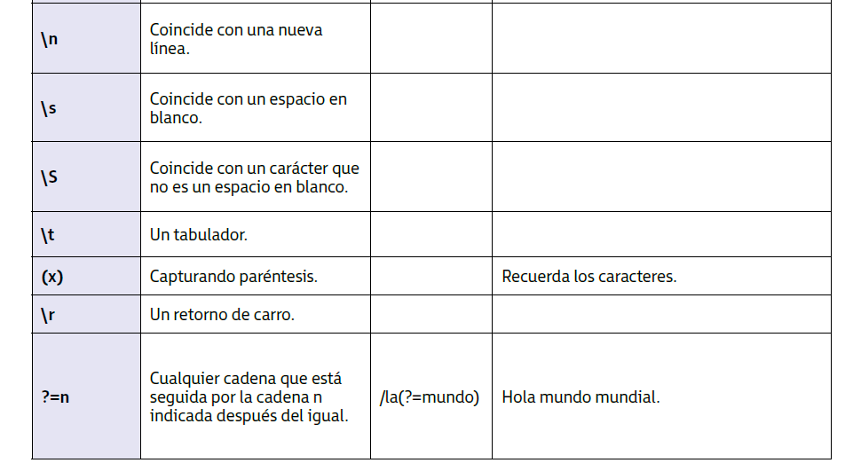

(UF3 Eventos. Manejo de formularios. Modelo de objetos del documento)

La interacción entre el usuario y la aplicación web consiste en que el usuario usa mecanismos de entrada (teclado, ratón) y la aplicación muestra la información que debe ser tratada (formularios).

Los eventos materializan los cambios que realiza el usuario sobre un objeto, viendo el gran número de posibilidades que el código debe afrontar.
## 1. Modelo de gestión de eventos

El DOM es el encargado de crear la jerarquía entre los objetos (elementos) que modelan la página web y, por tanto, el encargado de gestionar los eventos. Con JavaScript es posible referirse a los objetos del DOM sin recargar la página.

Los eventos se encuentran situados en componentes de la página HTML, es posible por ejemplo desencadenar una acción interactuando con el botón de la web. 

Al **controlar un evento** es necesario un **manejador** (que es en sí una palabra reservada: en el caso del botón puede ser `onClick`). El manejador desencadenará la función asociada cuando se produzca el evento en el componente que lo contiene. 

Como utilizar el evento `OnClick` en un elemento HTML

```javascript


```

### 1.1. Eventos de ratón

| Evento        | Manejador   | Descripción                                                                          |
| ------------- | ----------- | ------------------------------------------------------------------------------------ |
| **Click**     | onclick     | Pulsar sobre el botón izquierdo del ratón                                            |
| **Dblclick**  | ondblclick  | Doble clic sobre el botón izquierdo del ratón                                        |
| **Mousedown** | onmousedown | Pulsar un botón del ratón                                                            |
| **Mouseout**  | onmouseout  | Cuando el puntero del ratón está sobre un elemento y es desplazado fuera de este     |
| **Mouseover** | onmouseover | Cuando el puntero del ratón está fuera de un elemento y es desplazado dentro de este |
| **Mouseup**   | onmouseup   | Cuando se suelta el botón del ratón que previamente se había pulsado                 |
| **Mousemove** | onmousemove | Cuando el puntero del ratón está dentro de un elemento                               |

### 1.2. Eventos de teclado

| Evento       | Manejador    | Descripción                                           |
| ------------ | ------------ | ----------------------------------------------------- |
| **Keydown**  | `onkeydown`  | Cuando se pulsa alguna tecla del teclado              |
| **Keypress** | `onkeypress` | Cuando se pulsa una tecla de un carácter alfanumérico |
| **Keyup**    | `onkeyup`    | Cuando se suela una tecla                             |

### 1.3. Eventos HTML

| Evento     | Manejador  | Descripción                                                                                                                                                                                                                                                                            |
| ---------- | ---------- | -------------------------------------------------------------------------------------------------------------------------------------------------------------------------------------------------------------------------------------------------------------------------------------- |
| **Load**   | `onload`   | Hace referencia a la carga de las diferentes partes de la página. Actúa sobre el objeto `Window` cuando la página se ha cargado completamente. En el objeto `` se produce cuando se ha cargado la imagen y en el elemento `<object>` se acciona al cargar el objeto por completo. |
| **Unload** | `onunload` | Actúa sobre el objeto `Window` cuando la página ha desaparecido por completo. También se acciona sobre el elemento `<object>` cuando desaparece el objeto.                                                                                                                             |
| **Abort**  | `onabort`  | Se produce cuando el usuario detiene la descarga de un elemento antes de que haya finalizado. Actúa sobre el elemento `<object>`                                                                                                                                                       |
| **Error**  | `onerror`  | Actúa sobre el objeto `Window` cuando se produce un error JavaScript. En el elemento `` cuando la imagen no carga. En el elemento  `<object>` cuando no se carga correctamente.                                                                                                   |
| **Select** | `onselect` | Se acciona al seleccionar textos de las cajas de texto `<input>` o `<textarea>`                                                                                                                                                                                                        |
| **Change** | `onchange` | Se produce cuando los cuadros de texto `<input>` o `<textarea>` pierden el foco y el contenido que tenían varía. También se produce cuando el elemento  `<select>` cambia de valor.                                                                                                    |
| **Submit** | `onsubmit` | Se produce cuando se pulsa sobre un botón de tipo `submmit`                                                                                                                                                                                                                            |
| **Reset**  | `onreset`  | Se produce cuando se pulsa sobre un botón de tipo `reset`                                                                                                                                                                                                                              |
| **Resize** | `onresize` | Se produce cunado se redimensiona el navegador. Actúa sobre el objeto `Window`                                                                                                                                                                                                         |
| **Scroll** | `onscroll` | Se produce cuando varía la posición de la barra de desplazamiento o `scroll` en cualquier elemento que la tenga                                                                                                                                                                        |
| **Focus**  | `onfocus`  | Se produce cuando un elemento tiene el foco                                                                                                                                                                                                                                            |
| **Blur**   | `onblur`   | Se produce cunado un elemento pierde el foco                                                                                                                                                                                                                                           |

### 1.4. Eventos DOM

| Evento                        | Descripción                                                                               |
| ----------------------------- | ----------------------------------------------------------------------------------------- |
| `DOMSubtreeModified`          | Se produce cuando se añaden o se eliminan nodos en el subárbol de un elemento o documento |
| `DOMNodeInserted`             | Se produce cuando se añade un nodo hijo a un nodo padre                                   |
| `DOMNodeRemoved`              | Se produce cuando se elimina un nodo hijo que tiene nodo padre                            |
| `DOMNodeRemovedFromDocument`  | Se produce cuando se elimina un nodo del documento                                        |
| `DOMNodeInsertedIntoDocument` | Se produce cuando se añade un nodo al documento                                           |
## 2. Captura y uso de eventos

- Hoy en día es frecuente que la técnica de gestión de eventos varíe con tal de hacer un código JavaScript más independiente de la estructura HTML.
- En versiones anteriores de los navegadores los eventos (interacciones entre usuario y sistema) eran capturados en casi todos los casos por gestores de eventos definidos como atributos en etiquetas HTML. En la actualidad todo el modelo de gestión de eventos está activo aunque los navegadores actuales incorporan un modelo propio que proporciona un conjunto de información sobre cómo puede ocurrir un determinado evento.
- Este conjunto de propiedades es accesible a través de JavaScript ya que permite que se puedan programar respuestas más inteligentes a las distintas interacciones que puede tener el usuario con los modelos que forman parte del documento. 

Se dan cuatro modelos de registro de eventos:
- **En línea**
- **Tradicional**
- **Según W3C**
- **Según Microsoft**

### 2.1. Modelo de registro de eventos en línea
- Los eventos **se añaden como un atributo más del objeto (de la etiqueta HTML correspondiente)**
- Es un modelo no recomendado porque acopla el código JavaScript al HTML y la buena práctica es tener una separación entre estructura y programación
- En HTML es posible usar caracteres en mayúscula y en minúscula en los nombres de los eventos `onClick` y `onMouseOver`. En XHTML los atributos deben ir siempre en minúscula (`onclick` y `onmouseover`)

```javascript
<a href="pagina.html" onCLick="alertar()">Pulsa aquí</a>
```

### 2.2. Modelo de registro de eventos tradicional

- Los eventos **se asignan como una propiedad del objeto, fuera de la estructura HTML**
- Los navegadores antiguos usaban el modelo en línea aunque con la llegada de DHTML el modelo se desarrolló para conseguir ser más flexible llegando el modelo de registro de eventos tradicional.
- No es un modelo estándar de registro pero sí es ampliamente usado por Netscape y Microsoft, siendo válida hoy día.
- Permite asignar un determinado evento a un objeto desde JavaScript, separado el código de la estructura. Los nombres de los eventos están siempre en minúsculas.
- Como el gestor de eventos es una función, es posible realizar una llamada directa a ese gestor y disparar el evento de forma manual. Por ejemplo llamar a `elemento.onclick()`
- La palabra `this` se usa para hacer referencia al objeto donde se programó el evento.
- En el registro de eventos no se utilizan paréntesis. En el método `onclick` se le asignará una función completa. Al escribir `element.onclick = hacerAlgo()` se va a ejecutar la función y el resultado se asignará a `onclick`. Este no es el procedimiento ideal porque se quiere que se pueda ejecutar la función al disparar un determinado evento. 
- Se puede llamar a `alert(elemento.onclick)` que devolverá el valor `undefined` si no hay funciones registradas en ese determinado evento o devolverá el nombre de la función recomendada para ese evento.  
El evento se asigna con `elemento.evento = hacerAlgo;`
El evento se elimina con `elemento.evento  = null;`

```javascript
document.getElementById("mienlace").onclick = alertar;
```

### 2.3. Modelo de registro avanzado de eventos según W3C

- Estándar propuesto por W3C. En la especificación del DOM del nivel 2, el W3C tiene muy en cuenta los problemas que se pueden dar en el modelo tradicional de registro de eventos y propone una forma sencilla.
- Se puede programar cuándo se quiere que se dispare el evento (en la fase de captura true o de burbujeo false). Captura es cuando el evento va desde el elemento más externo hacia el objetivo. Burbujeo es cuando el evento va desde el objetivo hacia afuera (de vuelta a los ancestros).  Dicho de otra forma: true (primero manejador del contenedor y luego el del objetivo), false (primero manejador del objetivo y luego el del contenedor)
- La palabra `this` también se usa para referenciar al objeto donde se programó el evento.
- Como ventaja del método, se pueden añadir los eventos que se deseen. 
- El W3C del nivel 3 del DOM introdujo el método `enetListenerList` que permite almacenar en una lista las distintas funciones asignadas a un determinado elemento. Se debe tener cuidado porque el elemento no lo soportan toods los navegadores.

El evento se asigna con `addEventListener()`
El evento se elimina con `removeEventListener()`
Para cancelar la acción por defecto de un evento, se dispone del método `preventDefault()`
```javascript
document.getElementById("mienlace").addEventListener('click', alertar, false);
```

Ejemplo de añadir múltiples eventos:
```javascript
// Se disparan los tres, aunque no se sabrá cual se ejecutara primero
document.getElementById(“mienlaceuno”).addEventListener(‘click’, alertar,false);
document.getElementById(“mienlaceuno”).addEventListener(‘click’, avisar,false);
document.getElementById(“mienlaceuno”).addEventListener(‘click’, chequear,false);
```

### 2.4. Modelo de registro de eventos según Microsoft

- Parecido al propuesto por W3C pero con ligeras modificaciones. Desarrollado por Microsoft. 
- Los eventos siempre burbujean (del objetivo hacia afuera; no hay forma de capturarlos)
- La palabra `this` no puede usarse porque la función es copiada, no referenciada. Los eventos empiezan con "on"
- Esto implica que cuando un evento burbujea hacia arriba, no se puede conocer qué elemento HTML ha gestionado ese evento.
El evento se asigna con `attachEvent()`
El evento se elimina con `detachEvent()`

```javascript
document.getElementById("mienlace").attachEvent('onclick', alertar);
document.getElementById("mienlace").detachEvent('onclick', alertar);
```
Si se necesitan dos gestores de un mismo evento:
```javascript
document.getElementById("mienlace").attachEvent('onclick', unaCosa);
document.getElementById("mienlace").attachEvent('onclick', otraCosa);
```

### 2.5. Orden de disparo de los eventos

Si se tiene un elemento que se encuentra contenido dentro de otro elemento, debe programarse el mismo tipo de evento para ambos. 

Dos modelos diferentes:
- **Captura de eventos**: Netscape afirmó que el evento en el elemento 1 va a suceder primero
- **Burbujeo de eventos (bubbling)**: Microsoft mantiene que el evento en el elemento 2 tiene precedencia ante el otro. 
Internet Explorer soporta burbujeo mientras que Mozilla, Opera 7 y Konquerror soportan los dos modelos. Versiones anticuadas de Opera e iCab no soportan ninguno de los dos. 

#### 2.5.1. Modelo W3C en el disparo de eventos

Está definido como estándar. Todos los navegadores lo deberían seguir para sercompatibles entre ellos
Se decanta por una posición intermedia en la que se supone que al producirse un evento en su modelo de eventos:
- primero se produce una fase de captura hasta que consiga llegar el elemento de destino
- después se produce la fase de burbujeo hacia arriba
## 3. Utilización de formularios desde código

El **formulario web** es una herramienta que se usa para enviar, recibir o gestionar datos que se transmiten entre el cliente (navegador) y un servidor web.

Cada elemento de un formulario es usado para almacenar un tipo de dato o para activar funcionalidades del formulario,.
Los formularios están enmarcados en HTML y su función es dar la posibilidad a los usuarios que interactúen con los datos de una web, convirtiendo la web está tica en una aplicación web.
### 3.1. Estructura de un formulario

La etiqueta principal del formulario es `<form>`. Esta necesita de los atributos:
- `action`: Indica la URL para el envío de los datos
- `method`: Indica el método de envío de los datos. Hay dos opciones: POST o GET. En el caso de POST los datos se envían ocultos, en el caso de GET viajan a través de la URL. Si no se indica nada, el método por defecto es GET.
- `enctype`: Tipo de codificación que se usa al enviar el formulario
- `accept`: Tipo de archivos que acepta el servidor

Para indicar qué datos se quieren enviar en el formulario y cuándo se enviarán se utilizan los **elementos de formulario**. El primer elemento son los **controles de formulario** y **campos de formulario**, encargados de almacenar los datos que se enviarán en el formulario como es el caso del elemento `<input>`

### 3.1.1. Estructura de la etiqueta `<input>`

- Es una etiqueta **unaria**, usándose como `<input .../>`

Los atributos que puede tener la etiqueta son:
- `type`: Tipo de elemento que se va a definir. Los valores aceptados son: `text` (cuadro de texto), `password`(cuadro de contraseñas, ocultando los valores introducidos), `checkbox` (casilla de verificación), `radio` (opciones entre valores), `submit` (botón de envío de formulario), `reset` (botón que vacía los campos), `file` (botón de imagen de formulario, para permitir que el usuario seleccione y suba archivos), `button` (botón del formulario)
- `name`:  Asigna un nombre al elemento. Es necesario asignarlo para que el servidor lo identifique y pueda acceder a él.
- `value`: inicializa el valor elemento
- `size`: tamaño inicial del elemento, el campos de text y password
- `maxlength`: indica el número máximo de caracteres. Se utiliza para los campos de text y password
- `checked`: Elemento exclusivo para los elementos checkbox y radio. Se indica para definir qué elemento queremos seleccionar. 
- `readonly`: Evita la modificación del valor del elemento
- `src`: Permite asignar unaURL donde se encuentra la imagen del botón del formulario
- `alt`: Descripción del elemento. Al posicionar el ratón encima del elemento muestra un texto alternativo.

### 3.1.2. Tipos de input

- **Cuadro de texto** (text): El usuario puede introducir datos en formato texto
- **Cuadro de contraseña** (password): Utilizado para contraseñas. Los caracteres no se muestran por pantalla.
- **Casillas de verificación** (checkbox): Permite seleccionar diferentes opciones.
- **Opciones de radio** (radio): Permite seleccionar opciones excluyentes entre sí.
- **Botón de envío** (submit): Enviar los datos del formulario al servidor.
- **Botón de reset** (reset): Vaciar los campos del formulario.
- **Ficheros adjuntos** (file): Adjuntar archivos al formulario. Debe implementarse control del elemento ya que no se indican las limitaciones de los archivos de forma predeterminada. 

### 3.2. Manipulación de formularios

```javascript
// Se accede al formulario por id, por tagname, por nombre o lo que sea
var miFormulario = document.getElementById(‘FormularioDatos’);
var formularios = document.getElementByTagName(‘form’);
var otroFormulario = document.forms[‘infoUsuario’];
// Se accede al elemento que se este buscando
```

### 3.3. Envío de formularios

Cuando se envía el formulario se crea una colección de valores de los diferentes elementos que componen el formulario mediante una colección clave:valor.
También podría hacerse por índice pero es bastante más complejo su acceso posterior y no se recomienda. En este caso deben especificarse todos los elementos junto con las posiciones que ocupa cada uno. 

**Método de envío**
- **Método GET**: Combina todos los pares clave:valor en el interior de la URL de la petición. El inconveniente es qu ese pone en peligro la seguridad de los datos que viajan por la URL del navegador.

- **Método POST**: Almacena en el interior del cuerpo la petición realizada con los pares clave-valor. Si se observa desde el punto de vista del servidor, una vez que se reciben los datos pueden consultarse con el objeto `HttpRequest`.

**Envío mediante botones**
Se puede llevar a cabo a través de un control HTML de tipo submit con las etiquetas `<input>` o `<button>` con atributo `image` o `submit`

```html
<form id =’formularioDatosEmpresa’ name=’formularioDatosEmpresa’ method=’Get’ action=’//Direcciónpágina de Internet’>
	<p>Estas son las opciones para el envío del
	formulario</p>
	<!--Atributo submit -->
	<input type=”submit” value=”Guardar”><br/>
	<button type=”submit”>Guardar</button><br/>
	<!--Botón de la imagen image button-->
	<input type=”image” src=”//Ruta correspondiente”>
</form>
```

**Envío mediante código**
Se puede realizar usando el método  `submit()` correspondiente al objeto que representa el formulario. 
(Se accede al formulario usando algunos de los métodos para conseguir la referencia al formulario y se usa dicho método submit del objeto formulario)

```javascript
function envio{
	document.forms[“formularioDatosEmpresa”].submit();
}
```

### 3.4. Validación de envío de formulario

Es las aplicaciones de carga frecuente que haya reglas de validación en los datos para evitar peticiones erróneas y optimizar la red.
Se debe controlar el evento `onsubmit` para validar los datos antes de que sean enviados. Se puede definir este evento como un atributo dentro de la etiqueta `<form>` o creando un manejador a través de la instrucción `addEventListener`.

Si los datos no son correctos, se puede cancelar el proceso usando el método `preventDefault` para modificar el comportamiento por defecto del elemento.
### 3.5. Restablecer datos del formulario

Para restablecer el formulario con los datos iniciales (cuando por ejemplo no son correctos), se dispone del método `reset()` o se pueden introducir botones tipo `reset` en el objeto formulario.
## 4. Modificación de apariencia y comportamiento

A la hora de personalizar el aspecto de una web se hace uso de las hojas de estilo para modificar la apariencia de la web. 

Por  defecto, los formularios tienen estilos asignados que presentan colores y bordes determinados. Estos estilos pueden adaptarse al entorno web donde son incorporados.

**Modificar el aspecto de un botón**

Modificar el estilo del botón (tamaño de letra, color y bordes)

```html
<html>
	<head>
		<style type=”text/css”>
			.modificar {
			background: blue;
			color: white;
			padding: 8px;
			font-size: 16px;
			border-radius: 6px;
			border: 2px solid #0016b0;
			}
		</style>
	</head>
	<body>
		<form>
			<p>
				<input type=”button” value=”Botón normal”/>
			</p>
			<p>
				<input class=”modificar” type=”button” value=”Botón modificado”/>
			</p>
		</form> 
	</body>
</html>
```


**Suavizar el aspecto de un campo de texto**

En estos elementos se escribe por defecto justo al principio del elemento sin ningún margen con respecto a la línea situada en la parte izquierda. Con CSS se pueden modificar estos márgenes y modificar el tamaño y color de la letra. 

```javascript
<html>
<head>
	<style type=”text/css”>
		.modificar {
		padding: 8px;
		font-size: 16px;
		border-radius: 8px;
		border: 1px solid #000000;}
	</style>
</head>
<body>
	<form>
		<input type=”text” value=”Texto normal”/><br><br>
		<input class=”modificar” type=”text” value=”Texto modificado”/>
	</form>
</body>
```

**Organización de los controles de un formulario**

Un problema es cómo colocar los elementos para que queden ordenador y bien alineados unos con otros. Se usan en muchos casos tablas o contenedores para organizar el formulario.
Un ejemplo de organización en bloques:
```html
<fieldset>
	<legend>
		Formulario
	</legend>
	<div>
		<label for=”nombre”>Nombre</label>
		<input type=”text” id=”nombre”/>
	</div>
	<div>
		<label for=”apellidos”>Apellidos</label>
		<input type=”text” id=”apellido”/>
	</div>
	<input class=”btn” type=”submit” value=”Enviar”/>
</fieldset>
```

```html
<style type=”text/css”>
	div {
		margin: .4em 0;
	}
	div label {
		width: 20%;
		float: left;
	}
	.btn {
		display: block;
		margin: 1em 0;
	}
</style>
```

**Modificar el comportamiento de un formulario**

Se puede modificar el comportamiento de los elementos y evitar que realicen su función habitual.

Por ejemplo es posible que interese que los datos de un formulario se envíen a URLs distintas según las opciones marcadas.

```html
<script languaje=”javascript”>
	function enviar_formulario(form) {
		if (formulario.alta.checked == true) {
			formulario.action = “alta.html”;
		}
		if (formulario.alta.checked == baja) {
			formulario.action = “baja.html”;
		}
		form.submit();
	}
</script>
```
## 5. Validación y envío

**Validar el formulario** debe estar centrado en revisarlo para comprobar que todos los datos introducidos lo estén de forma correcta. 

Si un formulario cuenta con campo tipo texto y se quiere comprobar ese campo hay dos métodos diferentes para validarlo (consistentes en analizar si los datos introducidos cumplen con las restricciones impuestas):
- Uno en el lado del servidor: Scripts CGI, PHP, ASP,...
- Otro en el lado del cliente: Con JavaScript

El método del **servidor**: Es más complicado de programar
El método del **cliente**: Es más sencillo y rápido de realizar (no necesita conectarse al servidor; el usuario puede recibir la información sobre los errores encontrados directamente desde el lado del cliente)

Para comprobar si un formulario es válido o no, la mejor opción sería enviar los datos al servidor para que este los valide correctamente. Pero para evitar la sobrecarga, se hace un primer filtrado de los datos desde el cliente. Así la información no tiene que llegar al servidor.

**Estructura de un formulario para la validación**

Para indicar al usuario que debe realizar una validación de los datos antes de enviarlos, se indicará en la estructura con el evento `onSubmit`

**Validar campo obligatorio**: Comprobar si el usuario lo ha rellenado

```html
<form action=”URL” methor=”POST” name=”Validado”
onsubmit=”return validarForm()”>
...
</form>
```


```html
<script type=”javascript”>
	function validarForm() {
		valor = document.getElementById(“campo”).value;
		if (valor == null || valor.lenght == 0) {
		alert(“El campo no puede estar vacío”);
		return false;
	}
	return true;
</script>
```

**Validar campo numérico**
```html
<script type=”javascript”>
	function validarForm() {
		valor = document.getElementById(“telefono”).
		value;
		if (isNaN(valor)) {
		alert(“El campo tiene que ser numérico”);
		return false;
	}
	return true;
</script>
```

**Validar checkbox**

```html
<script type=”javascript”>
function validarForm() {
	valor = document.getElementById(“condiciones”).value;
	if (!valor.checked) {
		return false;
	}
	return true;
}
</script>
```

## 6. Expresiones regulares

Las **expresiones regulares** son patrones de búsqueda que se pueden usar para encontrar un texto que coincida con un patrón determinado.
Así, en distintas situaciones se hace necesario buscar cadenas que cumplan con un patrón en lugar de una cadena exacta. (Podrían hacerse con funciones de string pero esto lo hace más fácil)

En JavaScript se gestionan a través del objeto `RegExp`
```javascript
var expresion = /expresión regular/;
```

La expresión regular **debe ir entre barras `/`** y no lleva comillas. Las comillas solo se usan cuando forma parte del patrón.





**Ejemplo validación número de teléfono**

```javascript
function validarTelefono() {
	valor = document.getElementById(“teléfono”).
	value;
	if ( !(/^\d{9}$/.test(valor)) { return false }
	// Formado por digitos y con 9 caracteres
	return true;
}
</script>
```
### 6.1. Objeto `RegExp`

Puede usarse tanto como un objeto de JavaScript como una expresión literal.

Se podría crear un constructor de la siguiente forma:
```javascript
var expresionregular = new RegExp(“Este es el Texto Expresión Regular”);
```

- La expresión `RegExp` literal se puede compilar una vez se ejecute el determinado script. Es recomendable usar el literal siempre que se sepa que la función no se va a modificar por ser más eficiente que una versión compilada.
- Si se sabe que la expresión sufrirá alguna modificación, se usará el objeto.
- `RegExp` tiene sus propias propiedades y métodos.

**1. Usando el constructor `RegExp`**
Usar cuando el patrón es variable o dinámico
Esta forma es útil cuando la expresión regular se genera dinámicamente (por ejemplo, desde una variable):

```javascript
var texto = "Hola mundo";
var patron = "mundo"; // este patrón podría venir de una entrada del usuario

var expresionRegular = new RegExp(patron);
console.log(expresionRegular.test(texto));  // true
```

 **2. Usando una expresión literal**
Usar cuando el patrón no cambia. Es más rápido porque se compila al cargar el script.
```javascript
var texto = "Hola mundo";
var expresionRegular = /mundo/;

console.log(expresionRegular.test(texto));  // true
```