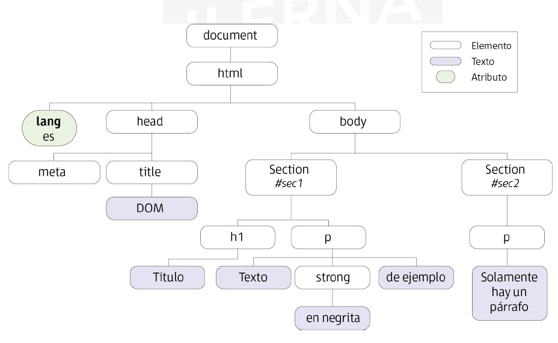

(UF3 Eventos. Manejo de formularios. Modelo de objetos del documento)

## 1. El modelo de objetos del documento (DOM)

La manipulación del contenido y apariencia de una web de forma dinámica en forma de objetos relacionados se hace gracias al DOM (Document Objects Model) que define la web como una estructura organizada de objetos formando entre ellos un árbol de recorrido.

**Tipos de modelos DOM**
El DOM se puede dividir en tres partes diferentes
- **Núcleo del DOM**: Modelo estándar para cualquier documento que esté estructurado
- **XML DOM**: Modelo estándar para documentos XML
- **HTML DOM**: Modelo estándar para documentos HTML

**El árbol**
HTML DOM se define con una estructura en forma de árbol.
El navegador para poder usar las propiedades del DOM transforma de forma automática todas las páginas del contenido web en este tipo de estructura, es decir, convierte el documento HTML en elementos conocidos como **nodos**, en los que cada nodo representa un objeto del documento y posee un nodo padre por el que se puede llegar al objeto raíz.
Esto le quita dificultad a la hora de manipularlos.

Por ejemplo, si se tiene este documento HTML:
```html
<!DOCTYPE html>
<html lagn=”es”>
	<head>
		<meta charset = “UTF-8”>
		<title> DOM </title>
	</head>
	<body>
		<section id=”sec1”>
			<h1> Título </h1>
			<p> Texto <strong> en negrita </strong>
			de ejemplo</p>
		</section>
		<section id=”sec2”>
			<p> Solamente hay un párrafo </p>
		</section>
	</body>
</html>
```

SU DOM quedaría como sigue:



- La estructura del DOM **es independiente de todo lenguaje**, aunque JavaScript es donde más se utiliza.
- **Funciona para modificar documentos HTML y XML**

## 2. Objetos del modelo. Propiedades y métodos de los objetos

Para acceder a las propiedades o métodos de objetos que se encuentran en el interior del documento se utiliza la sintaxis (ya explicada) de:

```javascript
document.getElementById(objetoID).propiedad | metodo ( [parametros])
```

### 2.1. Objetos del modelo

Se definen doce tipos de nodos en la especificación del DOM.
Por ahora, solo se definirán cinco:
- `Document`: Nodo raíz del que derivan todos los nodos del árbol
- `Element`: Cada una de las etiquetas XHTML. De él pueden derivar otros nodos y es el único capaz de contener los atributos.
- `Attr`: Para representar los atributos de las etiquetas XHTML. 
- `Text`: Contiene el texto entre las etiquetas XHTML.
- `Comment`: Representa los comentarios incluidos en la página XHTML
- `CDATAFragment`
- `DocumentFragment`
- `DocumentType`
- `EntityReference`
- `Entity`
- `Notation`
- `ProcessingInstruction`
### 2.2. La interfaz Node

- `Node` es provisto por JavaScript para gestionar la información de los nodos. En él se definen propiedades y métodos que procesarán y manipularán estos documentos. 


Se definen **constantes que identifican a los diferentes tipos de nodos**

| Valor | Tipo de nodo                | Constante relacionada              |
| ----- | --------------------------- | ---------------------------------- |
| 1     | Elemento                    | `Node.ELEMENT_NODE`                |
| 2     | Atributo                    | `Node.ATTRIBUTE_NODE`              |
| 3     | Texto                       | `Node.TEXT_NODE`                   |
| 4     | Apartado CDATA              | `Node.CDATA_SECTION_NODE`          |
| 5     | Referencia a entidad        | `Node.ENTITY_REFERENCE_NODE`       |
| 6     | Entidad                     | `Node.ENTITY_NODE`                 |
| 7     | Instrucción de procesado    | `Node.PROCESSING_INSTRUCTION_NODE` |
| 8     | Comentario                  | `Node.COMMENT_NODE`                |
| 9     | Documento completo          | `Node.DOCUMENT_NODE`               |
| 10    | Nodo de tipo documento      | `Node.DOCUMENT_TYPE_NODE`          |
| 11    | Nodo de fragmento de código | `Node.DOCUMENT_FRAGMENT_NODE`      |
| 12    | Nodo de anotación           | `Node.NOTATION_NODE`               |

Sus **propiedades y métodos**
Para acceder, crear, modificar o eliminar nodos.

| Propiedad / Método                      | Valor devuelto | Descripción                                                  |
| --------------------------------------- | -------------- | ------------------------------------------------------------ |
| `nodeName`                              | String         | Nombre del nodo                                              |
| `nodeValue`                             | String         | Valor del nodo                                               |
| `nodeType`                              | Number         | Constante definida anteriormente                             |
| `ownerDocument`                         | Document       | Referencia del documento al cual pertenece el nodo           |
| `firstChild`                            | Node           | Referencia al primer nodo de la lista                        |
| `lastChild`                             | Node           | Referencia al último nodo de la lista                        |
| `childNodes`                            | NodeList       | Lista de todos los nodos hijos del actual                    |
| `parentNodes`                           | Node           | Referencia al nodo padre                                     |
| `previousSibling`                       | Node           | Referencia al nodo hermano anterior                          |
| `nextSibling`                           | Node           | Referencia al nodo hermano siguiente                         |
| `hasChildNodes`                         | Boolean        | Si el nodo tiene hijos                                       |
| `attributes`                            | NamedNodeMap   | Nodo tipo Element                                            |
| `appendChild(nodo)`                     | Node           | Añade nuevo nodo al final de la lista                        |
| `removeChild(nodo)`                     | Node           | Elimina un nodo de la lista                                  |
| `replaceChild(nuevoNodo, anteriorNodo)` | Node           | Reemplaza el nodo anterior por un nuevo nodo                 |
| `insertBefore(nuevoNodo, anteriorNodo)` | Node           | Inserta un nuevo nodo antes de la posición del nodo anterior |

## 3. Acceso al documento desde código

- Acceder a un nodo es lo mismo que acceder a un trozo de la página del documento, pudiendo modificar los valores, crear, añadir, mover,...
- Para acceder, el DOM tiene que estar completamente construido (la página debe haberse cargado por completo)

**Es posible acceder a un nodo específico:**
1. **Partiendo del nodo raíz y a través de los nodos hijo llegar al elemento deseado**
2. **Por acceso directo**. Usando las funciones del DOM acceder directamente. Suele ser el método más utilizado

**Métodos de acceso a nodos elemento**
- `getElementsByName(...)`: Con este método se obtiene colección que contiene todos los alementos de la página cuyo atributo `name` coincida con el indicado. Será posible recorrer y referenciar sus elementos como si fuese un array (pero, ojo, no usar los métodos de array como `push` o `pop`). 
		Ej.: `var elementoSegundo = document.getElementsByName("apellidos")[1];`

- `getElementsByTagName(...)`: Devuelve colección de elementos cuya etiqueta XHTML coincida con la pasada como parámetro

- `getElementsById(...)`: Permite acceder directamente al elemento a través del ID (que debe ser único en la misma página)

**Métodos de acceso a nodos atributo**
Para referenciar los atributos de un nodo elemento se utiliza la colección `attributes`.
El par del atributo que se desea buscar se encontrará con `nodeName` y al valor se accede con `nodeValue`

**Métodos de acceso a nodos de tipo texto**
Con `childNodes` se puede acceder a los nodos hijos de un elemento, tanto de tipo elemento como de tipo texto. 

**Creación y borrado de nodos**
Es posible tanto crear nodos elementos e insertarlos en el DOM como mover nodos que ya existen insertándolos en otro lugar.
Al crear nodos elementos el elemento debe estar en minúscula (HTML no es sencible, pero XHTML sí).
Se dispone de los métodos
- `createElement()`: Crear elemento
- `createTextNode()`: Crear nodo de texto
- `appendChild()`: Añadir nuevo nodo hijo

```javascript
    // 1. Crear un nuevo elemento <p>
    var parrafo = document.createElement("p");

    // 2. Crear un nodo de texto
    var texto = document.createTextNode("Hola, este es un párrafo creado con JavaScript.");

    // 3. Añadir el nodo de texto al párrafo
    parrafo.appendChild(texto);

    // 4. Añadir el párrafo al contenedor existente en el DOM
    var contenedor = document.getElementById("contenedor");
    contenedor.appendChild(parrafo);
```
## 4. Programación de eventos

La mayoría de páginas web con JavaScript tienen eventos programados que disparan la ejecución de los scripts ("sin eventos no hay scripts"). Cuando el usuario hace algo, la página reacciona (JavaScript añade interactividad).

Se producen eventos (algunos tienen relación con el usuario y otros no como el evento de carga de un documento `load` que se dispara cuando se ha cargado un documento en el navegador).

Según el navegador también pueden existir diferencias en la gestión de eventos que el desarrollador debe considerar. 

