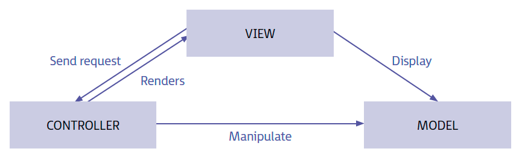

(UF2 Generación dinámica de páginas web)

## 1. Mecanismos de separación de la lógica de negocio

El desarrollo de una página web dinámica ofrece gran cantidad de posibilidades y una mayor interactividad con el usuario.

Para conseguir el mejor resultado se tendrá que detallar y separar todos los aspectos relativos al diseño de la web y el modelo de negocio --> Se usarán técnicas de diseño por capas o niveles. Los niveles permiten definir cuál es el trabajo asociado a cada parte, consiguiendo que los cambios solamente afecten a una capa en concreto.

La **separación de capas o responsabilidades** se establece en tres niveles:
- **Capa de presentación**: La que el usuario visualizará y con la que podrá interactuar. Se encarga de comunicarse con la capa de negocio. (Capa web, define cómo se presentan los datos al usuario)
- **Capa de negocio:** Encargada de procesar las peticiones del usuario. Se comunicará tanto con la capa de presentación para procesar peticiones como con la capa de datos para solicitar la información deseada. (Aplicación web. Transforma datos requeridos del mundo real en información que pueda ser mostrada y almacenada)
- **Capa de datos:** Se encargará de acceder a los datos almacenados. Después los gestores de bases de datos de los que se compone devolverán los datos a la capa de negocio. (Almacenamiento en base de datos que permite la generación dinámica de páginas web)

Las tres capas conocen lo que se conoce como **patrón Modelo-Vista-Controlador (MVC)**. Este patrón es uno de los más usados en el desarrollo de aplicaciones web, basado en el este concepto de separación.

Algunos de los lenguajes más usados en el desarrollo de páginas webs dinámicas son HTMl, JavaScript, PHP, ASP, ASP.NET, JPS, Python, Ruby y Perl

## 2. Controles de servidor web

**Controlador web**: Cualquier elemento web que permite ejecutar y mostrar una serie de secuencias de comandos, invocar todos los elementos de una página web, enviar variables a un servidor o cualquier otra que proporcione una funcionalidad en el cliente.

Los **controles de servidor web** son un estándar formado por un determinado conjunto de controles con funciones muy específicas.

Los controles de servidor web pueden estar formados por simples controles (de formularios como botones, labels, textboxes y cuadros de texto) o por controles de mayor complejidad (tablas, listas desplegables). 
Estos controles dan otras funciones que se utilizan frecuentemente por los usuarios como presentación de datos en cuadrícula, elección de fechas, visualización de menús, etc. 

Los controles web proporcionan un modelo de objetos que una vez procesados generan lo que se conoce como DOM (Document Object Model)  por lo que los controles web disminuyen la complejidad de procesamiento de una web. 

**Características añadidas**
- **Detección automática del explorador**: Los controles pueden identificar cuál es el navegador usado (ofreciendo el mejor resultado para el mismo)
- Permiten el uso de **plantillas de diseño**
- **Controlan los eventos de envío de datos al servidor** determinando cuándo se hacen y qué evento producirá dicha acción. También permiten almacenar en la caché los datos de un formulario, por ejemplo, sin enviarlos al servidor hasta un momento determinado.

**Diferencias entre lenguajes**
- **ASP.NET** da una guía de utilización y configuración detallada en su web oficial
- **PHP** da gran cantidad de funciones que permiten controlar las características anteriores y otros aspectos como conexiones, variables y permisos. Primero se confirma la conexión con el servidor (antes del envío), después se comprueba que los datos siguen el formato correcto y finalmente se verifica que el cliente tiene los permisos necesarios para realizar la petición. Así el servidor solo se encarga de procesar la información, que almacena si es necesario y devolver datos al cliente. La validación y la carga se ve aliviada.

## 3. Mecanismos de generación dinámica de la interfaz web

**El objetivo principal de una web dinámica** (diferencia con web estática) es ofrece al usuario un contenido adaptado a cada una de las peticiones que se van realizando.

Para ello debe de emplear una serie de **mecanismos o técnicas** que ofrecen un gran número de posibilidades para definir completamente el comportamiento y aspecto de una página web.

**Definir la estructura de interacción entre las distintas partes en la web**, tanto del usuario con el cliente como del cliente con el servidor. Según el cliente usado es necesario un mayor desarrollo y complejidad del servidor. Ejemplo de cliente: El navegador web (que, dicho sea de paso, es el cliente más usado por pocos recursos software e implementación simple) que es hilo de conexión entre el usuario y los datos requeridos por el servidor.

Hay clientes que pueden procesar datos y son parte de la lógica de la aplicación. Esto reduce complejidad en servidor pero la aumenta en el cliente.

**Se puede conseguir un balance entre ambos** con lenguajes como JavaServerFaces (JSF) o controles de servidor de ASP.NET. Estos lenguajes permiten además generar interfaces de usuario.

Otros lenguajes son para implementar tecnologías **íntegramente en el lado del cliente** como **JavaScript** (implementado en la mayoría de los navegadores, de uso muy extendido: permite validar entradas de formularios, ocultar o mostrar información, hacer efectos visuales) y **CSS** (separar el contenido de la presentación en las páginas web, organizar los estilos de cada uno de los contenidos que se presentarán en la página). 

JavaScript va acompañado muchas veces de **JQuery** que permite crear animaciones, controlar eventos,...

De la suma de estas tecnologías nacen otras como **AJAX**. AJAX usa JavaScript y XML para realizar peticiones asíncronas al servidor. Esto permite mayor dinamismo del contenido en una web igual que JavaScript permite controlar la información antes de que se mande al servidor.
## 4. Configuración

Toda creación o desarrollo de una web está ligado a establecer unas configuraciones que permitan definir **cuáles van a ser sus mecanismos de seguridad así como cuáles son los dominios en los que se podrá tener acceso a ella**. Estas configuraciones suelen hacerse en el lado del servidor.

El **dominio** es el conjunto de caracteres fruto de la traducción mediante sistema DNS de una IP que apunta al servidor en el que está alojada la web.
Una vez escogido el nombre de la web, se debe garantizar un acceso seguro a los usuarios (definiendo las partes y contenidos visibles en la web). Ficheros como `htaccess` permiten configurar la web indicando las restricciones de seguridad en directorios o carpetas y garantizando que el usuario que solicita acceso tenga permiso para ello antes de mostrárselo.

También se permite configurar el control de la caché del servidor almacenando documentos web y agilizando la carga de una web o petición previamente solicitada y disminuye el número de procesos del servidor.

El archivo **robots.txt** se almacena en la raíz del servidor y permite a los buscadores de Internet indexar el contenido de una web en los resultados mostrados por ellos. Además permite el acceos a estos buscadores para que relacione la búsqueda con el contenido de una web, ofreciendo el nombre de dicha web como resultado de la búsqueda.

Es útil hacer test globales o unitarios para comprobar el acceso a todos lo servicios.

## 5. Pruebas y depuración

Las **pruebas** con el mecanismo por el que es posible comprobar si una aplicación web cumple con las condiciones y requisitos especificados.

- **Forman parte del ciclo de vida** de creación de las aplicaciones.
- **Deben integrarse y realizarse de manera repetitiva** para poder detectar a tiempo el mayor número posible de errores
- Es bueno tratar de dividir el código en funcionalidades, intentando aislar unas partes de otras para que en caso de producirse algún fallo este no se arrastre a otras partes. (**Pruebas unitarias:** se ejecuta una parte del código sin que el resto de las funciones se vean afectadas. La mayoría de lenguajes de programación web permiten estas pruebas)
- En el desarrollo de cualquier aplicación o servicio web y de forma paralela a las pruebas se recomiendan los **procesos de depuración**. Permiten comprobar y realizar un seguimiento de la ejecución en tiempo real de dicha aplicación o página web. Así es posible comprobar los recursos utilizados por la aplicación. Analizar los valores que van tomando permite verificar que son correctas y controlar el flujo de ejecución. Para ello es necesario usar uso de IDEs que soporten el lenguaje de programación utilizado como Eclipse y Microsoft Visual Studio.

