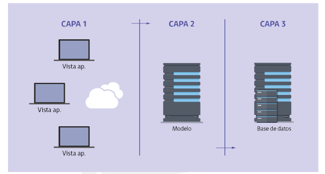

(UF3 Técnicas de acceso a datos)
## 1. Tecnologías que permiten acceder a datos desde una aplicación web

El **acceso a base de datos** es uno de los puntos clave en el desarrollo y construcción de cualquier tipo de aplicación web. La forma en la que se leen, modifican, almacenan y eliminan los datos puede tener gran influencia en el rendimiento de una web.

**Tecnologías que permiten el acceso a datos**
- **Database manager system (DBMS)**: Sistema manejador de bases de datos formado por un conjunto de programas que se encarga de gestionar el almacenamiento de una BBDD. Ej.: SQL Server, MySQL, Oracle.
- **API**: Métodos o funciones que permiten mediante llamadas el acceso a determinados servicios de la aplicación web.
- **Lenguajes de programación** Cualquiera que permita interpretar la sintaxis de acceso a datos. Ejs.: PHP, Prolog, ASP, ActionScript, ADA, Python, Pascal, C#, Basic, Java
- **Mapeo de datos**: El mapeo objeto-relacional (ORM) permite relacionar los objetos de una aplicación con su correspondiente tabla en una base de datos relacional. Así, **cada clase en el modelo de dominio tendrá su tabla en el modelo de datos**. Es la técnica más extendida y usada en el desarrollo de aplicaciones web. Ejs.: Hibernate y cualquier implementación de Java Persistence API, Doctrine, etc.

Es importante elegir qué tecnología emplear dependiendo de los requisitos de la aplicación porque será el vínculo entre esta y la base de datos.

La creación de una base de datos busca hacer uso de los registros en ellas almacenadas para mostrar esa información en las páginas web. 

**Para obtener los datos y mostrarlos en un HTML se necesita**
- Que **el software que se encarga de interpretar el lenguaje de programación escogido se comunique con el sistema gestor de la base de datos**. Debe estar identificado y autorizado en la base de datos.
- **Preparar la sentencias SQL** a ejecutar
- **Ejecutar la sentencias en la base de datos** para obtener el conjunto de datos solicitado
- **Recorrer el conjunto de datos** mediante estructuras de control proporcionadas por el lenguaje de programación


## 2. Establecimiento de conexiones

Una **conexión a base de datos** es la forma en la que un servidor de base de datos y su aplicación cliente se comunican entre sí. 

La base de datos almacena su conjunto de tablas en un dispositivo de almacenamiento. La aplicación hace uso de la conexión a base de datos para solicitar una información que el servidor facilitará.

Las **conexiones** permiten ejecutar una serie de comandos para obtener como resultado la información solicitada. Debe disponerse de una conexión **abierta** y **estable** y, tras su uso, debe cerrarse.

El **controlador** gestiona las conexiones, proporcionando una instancia al servidor donde se aloja la BBDD. Una vez identificado el cliente de la petición, se permitirá el acceso.

Pasos:
- Configurar los parámetros de conexión entre el entorno donde estará alojada la aplicación web y el entorno donde se almacenarán los datos. Previamente, conocer la arquitectura "que reflejará esto" y las técnicas empleadas para ello (según el lenguaje de programación aunque el servidor debe ser capaz de interpretar el mismo lenguaje)

Los **parámetros dentro de las funciones de conexión** son:
- **Host**: Servidor en el que se encuentra instalado el sistema gestor de bases de datos. Probablemente también está instalado en él el intérprete del lenguaje. (Si está en local, el host es localhost)
- **Usuario**: Usuario para identificarse (autenticado) y con permisos para ejecutar las sentencias (autorizado). 
- **Contraseña**: Contraseña asociada al usuario
- **Base de datos:** Nombre con el que se identifica al esquema de la base de datos.

```php
mysqli_connect('localhost', 'usuario', 'password', 'bd')
```

## 3. Ejecución de sentencias SQL. Recuperación y edición de información

El uso de **sentencias SQL** es un **estándar para el acceso a base de datos**. Es la forma en la que el sistema gestor de bases de datos comprenderá cuáles son las peticiones y el conjunto de datos requeridos por el cliente. 

Se pueden clasificar en:
- **DDL (Data Definition Language)**: Sentencias para crear y definir BBDDs
- **DML (Data Manipulation Language)**: Sentencias para hacer consultas, recuperar, ordenar y filtrar datos.
- **DCL (Data Control Language)**: Sentencias para definir los permisos sobre la BBDD.

Los **comandos** empleados:
- **SELECT**: Selecciona los datos que cumplen con el criterio establecido para mostrar este resultado después. `SELECT * FROM nombreTabla`
- **UPDATE**: Permite realizar modificaciones. `UPDATE nombreTabla SET columna1 = valor1, columna2 = valor 2 .... columnN = valorN  WHERE (condicion);`
- **INSERT**: Crear nuevos registros en una tabla específicas que se añadirán al final de los registros ya existentes. `INSERT INTO nombrETabla (columna1, columns2, columna3, ...) VALUES (valor1, valor2, valor3, ...);`
- **DELETE**: Elimina un conjunto de datos de una tabla específica. `DELETE FROM nombreTabla WHERE condicion;`

1. **Preparar orden de consulta**: Los comandos se asignan a una variable 
2. **Ejecución** y **almacenamiento en la variable especificada**
## 4. Ejecución de sentencias SQL. Utilización de conjuntos de resultados (Agrupación de datos)

- **GROUP BY**: Permite agrupar los resultados siguiendo un criterio. Solo se muestran aquellos que lo cumplen.
- **DISTINCT**: Devuelve valores únicos (sin duplicados)
- **ORDER BY:** Ordena los registros obtenidos según un criterio. Puede indicarse orden descendente o ascendente. 
- **COUNT:** Indica el número de registros o filas de una tabla devueltos que cumplan con el criterio establecido.
- **MAX** y **MIN**: Calcula el valor máximo y mínimo respectivamente de entre todos los registros obtenidos.
- **LIMIT**: Limita la cantidad de registros. (Contenido a mostrar parcialmente o uso de paginación)

```sql
-- GROUP BY
SELECT columna1, columna2, ... FROM nombreTabla GROUB BY columnaDeAgrupacion;

-- DISTINCT
SELECT DICTINCT columna1, columna2, ... FROM nombreTabla

-- ORDER BY
SELECT columna1, columna2, ... FROM nombreTabla ORDER BY columna1, columna2, ... ASC|DESC;

-- COUNT
SELECT COUNT(nombreColumna) FROM nombreTable WHERE condicion;

-- MAX Y MIN
SELECT MIN(nombrecoluimna FROM nombreTabla WHERE condicion;
SELECT COUNT(nombreColumna) FROM nombreTabla WHERE condicion;

-- LIMIT
SELECT columna1, columna2, ... FROM nombreTabla LIMIT 3; 
```

## 5. Creación de aplicaciones web con acceso de escritura a bases de datos

A la hora de ganar consistencia en la BBDD es un aspecto importante que, para que una aplicación pueda realizar modificaciones en ella, esté supervisada bloqueando todas las peticiones no controladas. 

Generalmente los permisos se establecen mediante roles, indicándose de forma explícita cuáles de ellos tienen permisos de lectura, escritura (indicando los comandos que puede ejecutar), etc. 

Se puede diferenciar entre dos tipos de usuarios:
- **Administradores**: Administradores del contenido de un sitio web. Encargados de gestionar la información para que el usuario la visualice. 
- **Usuarios**: Clientes del sitio web pueden de forma controlada añadir registros mediante el envío de formularios u otros campos.

Hay diferencias según el gestor de bases de datos utilizado.

Las bases de datos cuentan con usuarios creados de forma automática al instalar el servicio. La tabla de información de los usuarios se consulta ejecutando:
```sql
-- MYSQL
SELECT * FROM mysql.user;*
-- ORABLE
SELECT * FROM SYS.DBA_USERS;*
```

Los usuarios creados por el gestor deben ser usados para gestionar la BBDD como administrador. Deben crearse diferentes usuarios con los permisos necesarios:
```sql
-- MYSQL
CREATE USER 'usuario'@'localhost' IDENTIFIED BY 'password';
-- ORABLE
CREATE USER usuario IDENTIFIED BY 'password';
```

Para realizar una correcta configuración hay que restringir los permisos dependiendo de la labor que se vaya a desempeñar.
```sql
-- MYSQL
GRANT SELECT,INSERT,UPDATE,DELETE,CREATE,DROP
ON base_de_datos.tabla
TO 'usuario'@'localhost'
-- ORABLE
GRANT SELECT (campos_tabla,...) ON tabla TO usuario@localhost;
```

```sql
-- Eliminar usuario
DROP USER 'usuario'@'localhost';
-- Refresca los privilegios de los usuarios de la base de datos
FLUSH PRIVILEGES;
-- Elimina permisos concretos de un usuario de base de datos
REVOKE UPDATE, DELETE ON bbdd.tabla FROM 'usuario'@'localhost';
-- Elimina todos los permisos de un usuario de base de datos
REVOKE ALL PRIVILEGES ON bbdd.tabla FROM 'usuario'@'localhost';
```

El **proceso de escritura en base de datos** se divide en dos etapas:
- Cliente realiza envío de información a través de formulario HTML en página web
- La información es procesada y validada en un fichero en el lenguaje de programación utilizado. Este interpreta todos los datos y ejecuta la consulta SQL que añade los registros correspondientes en BBDD.

## 6. Transacciones

Las **transacciones** son un conjunto de órdenes cuyas tareas se ejecutan de forma atómica (independiente). 

Cumplen el principio **ACAD** (atomicidad, consistencia, aislamiento y durabilidad). Así se asegura que o se cumplen todas las operaciones requeridas o no se realizará ninguna.

**Mecanismos relacionados**
- **BEGIN TRAN|TRANSACTION**: Comienza una transacción
- **COMMIT TRAN|TRANSACTION**: Final de una transacción correcta
- **ROLLBACK TRAN|TRANSACTION**: Eliminar todas las operaciones realizadas, volviendo a un punto estable previo al comienzo de la transacción.

Las transacciones permiten mover datos de un lugar a otro, manteniendo la base de datos en un estado consistente. 

## 7. Pruebas y documentación

Las **pruebas** son el mecanismo por el cual se puede comprobar si un aplicación web cumple con las condiciones y requerimientos especificados.

Forman parte de una fase dentro del ciclo de vida de creación de estas aplicaciones, por lo que se deben integrar y realizar de forma repetitiva para poder detectar a tiempo el mayor número de errores posibles. 

Es buena idea que el código se divida en funcionalidades, aislando una unas de otras. Así al producirse un fallo, este no será arrastrado de una parte del código a otra.

En las **pruebas unitarias** solo se ejecuta una parte de código de forma que el resto de funcionalidades de la aplicación no se ven afectadas. La mayoría de lenguajes permiten estas pruebas.

De forma paralela a las pruebas es conveniente realizar **procesos de depuración**. En ellos se comprueba y realiza un seguimiento de la ejecución en tiempo real de la aplicación o página web. Así se comprueban los recursos utilizados por la aplicación, analizando los valores que toman las variables para verificar que son correctas y controlar el flujo de ejecución. Los IDE deben soportar el lenguaje de programación utilizado (en el caso de PHP: Eclipse, Microsoft Visual Studio,...)

## 8. Trabajar con bases de datos en PHP

### 8.1. Introducción. MySQL

PHP soporta más de 15 sistemas gestores de bases de datos (SQLite, Oracle, SQL Server, PostgreSQL, IBM DB2, MySQL,...)

- **Antes de la versión 5** de PHP, el acceso a base de datos se hacía usando **extensiones específicas para cada SGBD** (extensiones nativas). Ej.: Para acceder a BBDD de PostgreSQL debía instalarse y usar la extensión de PostgreSQL en concreto. 
- **Desde la versión 5** se introdujo en el lenguaje una extensión para acceder de forma común (**PDO**), permitiendo usar la misma sintaxis aunque el motor cambie. Con PDO se ofrecen un conjunto común de funciones aunque la extensiones nativas ofrecen normalmente más potencia (funciones específicas de un gestor de BBDD concreto) y, en ciertos casos, más velocidad. 

Hay dos formas de comunicarse con una base de datos desde PHP:
- Utilizar una extensión nativa programada para un SGBD concreto
- Utilizar una extensión que soporte varios tipos de datos

**MySQL** incorpora múltiples motores de almacenamiento con sus propias características. Podríamos elegir entre:
- **MyISAM**. Usado por defecto en versiones antiguas. Rápido pero sin integridad referencial, ni tablas transaccionales.
- **InnoDB**: Usado por defecto desde MySQL 5.5.5. Es algo más lento pero con integridad referenciar y tablas relacionales.

La instalación de MySQL se divide en dos paquetes:
- `mysql-server`: Servidor. Gestiona base de datos y permite las conexiones.
- `mysql-client`: Cliente. Necesarios para conectarse a un servidor MySQL. 

```shell
# Se inici y controla el servicio
sudo service mysql (status|start|stop|restart)
# En la instalacion tipica el usuario root no tiene contraseña de acceso. Se configura
mysqladmin -y root password elnuevopassword
```

Por defecto el servidor corre en el puerto TCP 3306.

El fichero de configuración del servidor MySQL se llama `my.cnf` y se encuentra alojado en `/etc/mysql`. Se contenido se divide en secciones y cada una de las opciones que contiene afecta al comportamiento de un módulo concreto:
- `[client]`: Configuración de los clientes
- `[mysql]`: Configuración del servidor

Parámetros del fichero `my.cnf`:
- **port**: Puerto TCP en el que escucha el servidor
- **user**: Nombre de usuario para ejecutar el servidor
- **datadir**: Directorio del servidor e nel que se almacenan las bases de datos

El servidor MySQL tiene algunas **herramientas de administración en línea de comandos**:
- `mysql`: Conexión al server MySQL y ejecución de sentencias
- `mysqladmin`: Cliente para la administración
- `mysqlshow`: Información sobre bases de datos y tablas

Opciones para la conexión con el servidor
- `--user=nombre_usuario`  (`-u nombre_usuario`): Usuario con permisos para establecer la conexión.
- `--password=contraseña` ( `-p contraseña`): 
- `--host=equipo_servidor` (`-h equipo_servidor`): 

```shell
mysql -u root -p
# Pedira la contraseña (Esta no quedara almacenada en el historial de comandos del sistema)
```

**Comandos**
- `connect`: Conexión con BBDD
- `use`: Seleccionar una BBDD
- `exit`  o `quit`: Salir
- `help`: Pantalla de ayuda

Se puede hacer procesamiento por lotes ejecutando todas las sentencias almacenadas en un fichero (.sql normalmente):
```shell
mysql -u root -p password < crear_bd_dwes.sql
```

Ver el estatus...
```shell
mysqladmin -yu root -p password status
```


(XAMPP usa MariaDB como alternativa a MySQL. Es derivado de MySQL con licencia GPL (General Public License) tras la compra de MySQL por Sun Microsystems, a su vez comprada por Oracle. Posee las mismas órdenes, interfaces, API y bibliotecas.)

## 8.2. Bases de datos en PHP. Extensión MySQLi

Antes se usaba la extensión nativa **mysql**. Actualmente lo habitual es elegir entre **MySQLi** (nativa) y **PDO**. Estas extensiones usan un driver de bajo nivel para comunicarse con el servidor MySQL. Antes solo estaba disponible **libmysql** pero después también se preparó PHP para usar un nuevo driver mejorado: **mysqlnd**, el driver nativo de MySQL.

MySQLi aporta:
- Interfaz orientada a objetos
- Soporte para transacciones
- Soporte para consultas preparadas
- Mejores opciones de depuración

Las opciones de configuración de  PHP se almacenan en el fichero `php.ini`. En este fichero hay una sección específica para las opciones de configuración propias de cada extensión. Entre las opciones están:
`mysqli.allow_persistent`: Permite crear conexiones persistentes
`mysqli.default_port`: Número de puerto TCP predeterminado cuando se conecta el servidor BBDD
`mysqli.reconnect`: Si debe reconectar automáticamente en caso de que la conexión se pierda
`mysqli.default_host`: Host predeterminado a usar cuando se conecta el servidor de BBDD
`mysqli.default_user`: Nombre de usuario predeterminado
`mysqli.default_pq`: Contraseña predeterminada

----------------------------
---------------------------

**MySQLi** ofrece interfaz dual permitiendo acceder a las funcionalidades de la extensión usando objetos o funciones de forma indiferente.

`new mysqli($host,$user,$password,$database)`: Realiza la conexión
`mysqli_connect_errno`: Comprueba la conexión
`mysqli_query($conexion, $query)`: Realiza una query
`mysqli_fetch_assoc($result)`: Trae resultados de una consulta en forma de query asociativo
`mysqli_autocommit($conexion, $boolean)`: Activar o desactivar el autocommit
`mysqli_commit($conexion)`: Commit de la transacción
`mysqli_rollback($conexion)`: Rollback de la transacción
`mysqli_close($conexion)`: Cerrar la conexión

**Por ejemplo, para establecer conexión y consultar su versión**
```php
// Forma 1.:Uso de constructor y metodos POO
// Instancia utilizando el constructor de la clase $a = new A();
// Acceso $a->fecha();
$conexion = new mysqli('localhost', 'usuario', 'password', 'base_de_datos');
print $conexion->server_info;

// O primero crear la instancia y despues usar el método connect
$conexion = new mysqli();
$conexion->connect('localhost', 'usuario', 'password', 'base_de_datos');
print $conexion->server_info;

// --------------------------------------------------------

// Forma 2.: Utilizando la interfaz procedimental de la extension
$conexion = mysqli_connect('localhost', 'usuario', 'password', 'base_de_datos');
print mysqli_get_server_info($conexion)
```

Seguidamente podemos **comprobar si la conexión es correcta** y consultar para **configurar la codificación de caracteres**
```php
// Comprobar si la conexion es correcta
if (mysqli_connect_errno()) { // Devuelve el numero de error y devuelve el mensaje de error
	echo "La conexion a la BBDD MySQL ha fallado: ".mysqli_connect_error();
} else {
	echo "Conexión realizada correctamente!!";
}

// Tambien puede usarse connection->connect_errno  o connection->connect_error

// Consulta para configurar la codificacion de caracterees
mysqli_query($conexion, "SET NAMES 'utf8'");
```

La base de datos puede **ser cambiada** con `select_db`
```php
mysqli_select_db('otra bd0)

// O bien
$connection->select_db('otra_bd')
```

Y cerrar con `mysqli_close()`  o `$connection->close()`

### Insertar, actualizar, eliminar

**En cuanto a INSERT, UPDATE, DELETE** se devuelve true si se ejecuta correctamente o false en caso contrario. Con la propiedad`$connection->affected_rows` se puede saber cuántos han sido los registros afectados ( con `mysqli_affected_rows`)
#####  Insertar
```php
$sql = "INSERT INTO notas VALUES(null, 'Nota desde PHP', 'Esto es una nota en PHP', 'green')";
$insert = mysqli_query($conexion, $sql);

if ($insert) {
	echo "DATOS INSERTADOS CORRECTAMENTE"
} else {
	echo "Error: ".mysqli_error($conexion);
}
```

##### Actualizar
```php
// Query para actualizar un registro en la tabla 'notas'
$sql = "UPDATE notas SET titulo = 'Nota actualizada', descripcion = 'Descripción actualizada', color = 'blue' WHERE id = 1";
$update = mysqli_query($conexion, $sql);

if ($update) {
    echo "DATOS ACTUALIZADOS CORRECTAMENTE";
} else {
    echo "Error: " . mysqli_error($conexion);
}
```

##### Eliminar
```php
// Query para eliminar un registro de la tabla 'notas'
$sql = "DELETE FROM notas WHERE id = 1";
$delete = mysqli_query($conexion, $sql);

if ($delete) {
    echo "REGISTRO ELIMINADO CORRECTAMENTE";
} else {
    echo "Error: " . mysqli_error($conexion);
}
```

### Seleccionar

#####  Consultar

El método `mysqli_query` (o `connection->query`) tiene un parámetros opcional que afecta a cómo se obtienen internamente los resultados pero no a la forma de usarlos posteriormente. Por defecto: 
- `MYSQLI_STORE_RESULT`: Los resultados se recuperan todos juntos de la BBDD y se almacenan de forma local (parecido a lo que se conoce como eager)
- `MYSQLI_USE_RESULT`: Los datos se recuperan según se vayan necesitando  (parecido a lo que se conoce como lazy)
```php
$resultado = $connection->query("SELECT producto, unidades FROM stock', MYSQLI_USE_RESULT);
```

Los resultados obtenidos se almacenarán en memoria mientras se estén usando. Cuando ya no se necesiten se pueden liberar con el método  `free` de la clase `mysql_result`
```php
$resultado->free()
```

`mysqli_fetch_`


```php
// Realizar la query
$notas = mysqli_query($conexion, "SELECT * FROM notas");


// Tomar el resultado (Variable nota con el contenido de iterar el resultado de fetch_assoc)
while($nota = mysqli_fetch_assoc($notas)) {
	var_dump($nota);
	echo '<h2>'.$nota['descripcion'].'</h2>';  // Imprimir el campo titulo del array
	echo $nota['descripcion'].'<br/>';  // Imprimir el campodescrip. del array
}

//------------------------------------------------------------

// Tambien se podria tomar el resultado pero verificando antes si hay resultados disponibles
if (mysqli_num_rows($notas) > 0) {
    // Iterar sobre los resultados
    while ($nota = mysqli_fetch_assoc($notas)) {
        echo '<h2>' . $nota['titulo'] . '</h2>'; // Imprimir el campo titulo
        echo '<p>' . $nota['descripcion'] . '</p>'; // Imprimir el campo descripcion
        echo '<hr>';
    }
} else {
    echo "No hay notas disponibles.";
}
```

---

Se obtiene en los resultados 


### Transacciones

**Para activar las transacciones lo que se hace es desactivar el autocommit (modo transaccional automático)**

(Lo mismo se puede usar `mysqli_autocommit($conexion, false)`  que `$connection->autocommit(false))`

```php
// Iniciar la conexión a la base de datos
$conexion = mysqli_connect("localhost", "usuario", "contraseña", "basedatos");

// Desactivar el modo autocommit para controlar la transacción manualmente
mysqli_autocommit($conexion, false);

try {
    // Primera consulta: Insertar una nueva nota
    $sql1 = "INSERT INTO notas (titulo, descripcion, color) VALUES ('Nota 1', 'Descripción 1', 'red')";
    $insert1 = mysqli_query($conexion, $sql1);

    // Segunda consulta: Insertar otra nota
    $sql2 = "INSERT INTO notas (titulo, descripcion, color) VALUES ('Nota 2', 'Descripción 2', 'blue')";
    $insert2 = mysqli_query($conexion, $sql2);

    // Verificar si ambas consultas se ejecutaron correctamente
    if ($insert1 && $insert2) {
        mysqli_commit($conexion); // ✅ Confirmar transacción si todo está bien
        echo "Transacción completada con éxito.";
    } else {
        throw new Exception("Error en la consulta"); // Lanzar error si una falla
    }
} catch (Exception $e) {
    mysqli_rollback($conexion); // ❌ Revertir cambios en caso de error
    echo "Transacción fallida: " . $e->getMessage();
}

// Restaurar el modo autocommit
mysqli_autocommit($conexion, true);

// Cerrar la conexión
mysqli_close($conexion);
```


PDO (PHP Data Objects)!!!!!!!


