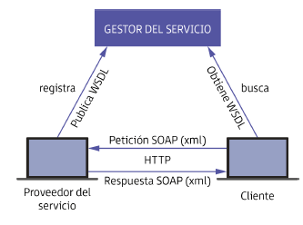
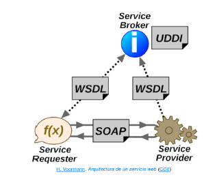
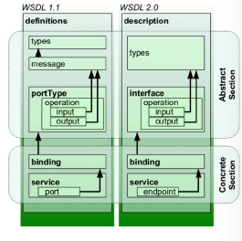
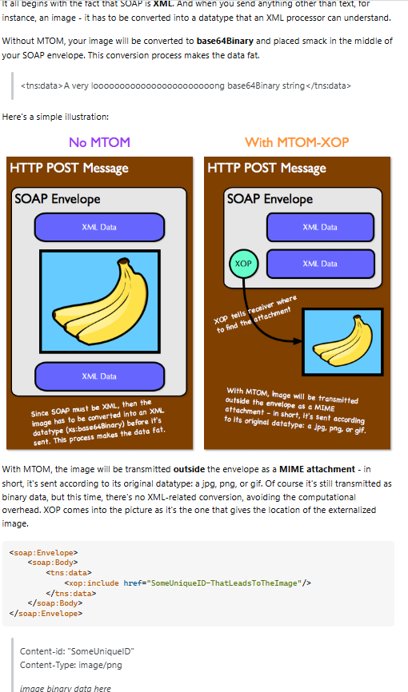

## 1. Características y ámbitos de aplicación

Un **servicio web** puede ser definido como un conjunto de protocolos que permiten comunicar diferentes aplicaciones a través de internet, permitiendo un intercambio de información entre ellas. La invocación de estos servicios web requiere del uso de los estándares web.

**Características**
- Debe estar accesible desde la red a través de protocolos como HTTP y codificando la información en un lenguaje que cualquier tipo de cliente pueda interpretar.
- Recomendable que contenga una **descripción de sí mismo** para que el cliente pueda conocer cuál es la función del servicio
- Debe estar **bien localizado** y ser **accesible** para que la aplicación web pueda localizar el servicio de forma automática. 

Los servicios web nacen de la necesidad de comunicar diferentes aplicaciones realizadas en distintos lenguajes de programación y diferentes plataformas.

- El servicio web permite **obtener y ofrecer una determinada información** a un número elevado de personas basándose en los criterios que las aplicaciones requieren.
- El desarrollo de software ha necesitado **centralizar el accceso a un recurso** y que este pueda comunicarse con todas ellas.
- Los responsables de la arquitectura y reglamentación de los servicios web son las **organizaciones OASIS** (Organization for the Advancement of Structured Information Standards).

## 2. Ventajas

- Son **independientes de la plataforma y del lenguaje de programación** utilizado
- Permiten establecer un **canal de comunicación entre aplicaciones** a través de la web
- **No se ve afectado ante cambios en los diferentes dispositivos** ya que funciona de forma independiente
- **Su creación no requiere un coste computacional elevado**. **Tampoco la comunicación** por lo que liberan de carga a los servidores.
- **Su estandarización y garantías en el mercado están comprobadas**. La mayor parte de los sitios web trabajan ofreciendo estos servicios. **Todos los protocolos que usan los servicios web están ya estandarizados y controlados**
- **Gran versatilidad**. Abanico de oportunidades ante diferentes tipos de negocio.
- **Han reducido notablemente el tiempo de desarrollo de aplicaciones**, cualquier tipo de aplicación puede usar el servicio sin necesidad una configuración de código adaptada a cada tipo de aplicación.
- Con protocolo **HTTP** casi siempre es permitido por los firewalls de red. Eso evita muchos problemas de denegación de servicios por parte de los clientes.
- **Funcionamiento sencillo y con avances tecnológicos rápidos**
- **Procesos de actualización sencillos**
- **Múltiples conexiones de usuario** de forma eficaz. 

## 3. Mecanismo y protocolos implicados

**Tipos de protocolos**
Según el tipo de servicio web creado se distingue entre:
**SOAP (Simple Object Access Protocol)**: Protocolo estándar que define cómo dos objetos en diferentes procesos pueden comunicarse mediante intercambio de datos XML. Es una evolución del protocolo XML-RPC. Se utilizan mensajes para el intercambio de información y se retorna un XML como documento de respuesta. Es necesario establecer por parámetros los datos requeridos como información. 

**File Transfer Protocol (FTP)**: Protocolo utilizado para la transferencia de archivos

**UDDI (Universal, Description, Discovery and Integration)**: Protocolo para publicar la información de los servicios web (Permite a las empresas registrar y buscar servicios web disponibles en un directorio centralizado.)

**Arquitectura REST (Representational State Transfer)**: No es un protocolo. Mediante el uso de esta arquitectura y del protocolo HTTP proporciona una API de utilización de los métodos asociads GET, POST, PUT, DELETE...

----

Los servicios web más utilizados se realizan mediante el protocolo SOAP y la arquitectura REST.

En **SOAP (Simple Object Access Protocol)** el mensaje viene encapsulado en XML: el mensaje incluye el nombre del método al que se hace la petición y los argumentos que son necesarios. Implica un esquema de desarrollo de acceso a las APIs más complejo. La seguridad ofrecida es elevada. Por eso para aplicaciones web con funcionalidades orientadas a sistemas de seguridad, bancos, telecomunicaciones,... el protocolo escogido en la mayoría de los casos será SOAP. 

En **REST (Representational State Transfer) ** se emplea el protocolo HTTP y se hace mejor uso del ancho de banda. No almacena estado: las peticiones no mantienen registros de los resultados devueltos anteriormente para otras peticiones. Cada petición debe enviar todos los datos necesarios, incluidos los datos de autenticación. La arquitectura REST para no procesar las mismas peticiones una y otra vez cuenta con sistemas de cachés. Permite que los servidores no hagan uso de una gran cantidad de recursos consistentes en insertar y eliminar información de forma continuada. El formato más habitual de comunicación en esta arquitectura es JSON (JavaScript Object Notation). 

**XML-RPC (XML Remote Procedure Call)**: Protocolo de llamada a procedimiento remoto (RPC) que usa XML para codificar sus llamadas usando como protocolo de transporte subyacente HTTP. Es protocolo más simple y fácil de usar pero carece la seguridad que presenta SOAP.

**JSON-RPC** **JSON-WSP** (JSON Remote Procedure Call, JSON Web Service Protocol): Son protocolos de llamada a procedimiento remoto que usan JSON para codificar sus llamadas. Usan HTTP como protocolo de transporte. Son más ligeros y rápidos que SOAP y XML-RPC debido a la simplicidad y menor verbosidad de JSON en comparación con XML.

**gRPC**: Protocolo de llamada a procedimiento remoto desarrollado por Google. Usa el formato de serialización binaria Protocol Buffers en lugar de XML o JSON. gRPC es compatible con múltiples lenguajes de programación y es transportado sobre HTTP/2, lo que permite aprovechar características avanzadas de este protocolo, como la multiplexación y la compresión de encabezados. 

**Websockets**: Permite establecer comunicación bidireccional y en tiempo real entre un navegador y un servidor a través de una conexión TCP persistente. Mantienen una conexión abierta, permitiendo el envío y recepción de mensajes en tiempo real sin necesidad de múltiples solicitudes y respuestas. Ideales para aplicaciones en tiempo real como juegos en línea, chats y aplicaciones de colaboración en vivo.

**GraphQL**: Lenguaje de consulta y tiempo de ejecución para APIs desarrollado por Facebook. A diferencia de los servicios RESTful donde cada recurso tiene una URL y se usa un conjunto fijo de métodos, GraphQL permite a los clientes especificar qué datos necesita y cómo deben ser entregados. Se usa un único endpoint para todas las consultas y mutaciones. Además se admite la agregación de datos de múltiples fuentes y sistemas en una única respuesta, mejorando la eficiencia y el rendimiento.

**OData** (Open Data Protocol): Protocolo de comunicación abierto que se basa en tecnologías como HTTP, AtomPub y JSON para dar acceso a datos estructurados a través de servicios web. Permite a los clientes realizar operaciones CRUD y admite funciones como paginación, filtrado y ordenación. Es compatibles con múltiples lenguajes de programación y plataformas, facilitando la integración de sistemas. 

## 4. Generación de un servicio web

La creación y configuración de un servicio web debe seguir una serie de pasos que pueden variar un poco según el lenguaje utilizado; pueden ser consultados en la API correspondiente (se facilitan todos los métodos para crear el nuevo servicio).
Es necesario generar el código que ejecutará el servicio, identificar la interfaz asociada al servicio, elegir la ruta de acceso a él en la web. Lenguajes como ASP.NET, PHP o Java automatizan todas estas tareas y permiten crear servicios de forma sencilla. 

**Pasos genéricos**
- **Configurar la base de datos**: Se deben configurar todas las columnas y tablas que proveerán el conjunto de resultados al cliente.
- **Crear el servicio**: 
	- **Archivo de configuración**: Archivo de configuración inicial que define los parámetros de configuración de la base de datos
	- **Archivo de conexión**: Ejecuta la conexión con la base de datos con los parámetros devueltos en el archivo anterior
	- **Archivo de petición**: Realiza la petición de datos mediante consultas SQL. Define el formato en el que se devuelven los datos para mostrarlos. Las consultas se recogerán en una clase diferente.
	- **Archivo de resultados**: Instancia la clase creada y llama al método correspondiente para almacenar el conjunto de datos devueltos. 
- **Comprobación de resultados**: Se ha de configurar el mensaje que retornará el servidor para la comprobación correcta de los resultados devueltos. 

Debe considerarse que el **espacio de nombres asociado por un servicio web debe ser único en la aplicación**

Se puede comprobar la ejecución de un servicio del lado del cliente observando cómo la URL del navegador ha invocado un nuevo archivo con su extensión asociada: `www.ejemplo.com/nombreServicio.extension`

La creación de servicios está automatizada de forma notable. Los lenguajes mediante sus herramientas de desarrollo dan una interfaz que permiten la creación de un servicio de forma fácil y rápida. 

## 5. Descripción de un servicio

La **descripción de un servicio web** es un documento XML denominado WSDL. Se describe el formato de los mensajes que serán enviados. En ella:
- Se deben **documentar las acciones que tienen que realizar los posibles clientes** para comunicarse con el servicio. Así el cliente puede prever el resultado que le devolverá la invocación al servicio.
- Se debe **especificar cómo será la comunicación** (bidireccional si se espera una respuesta de contestación o unidireccional si el cliente no recibirá ningún mensaje del servicio web, ni siquiera un mensaje de error)
- La descripción del servicio **puede contener opcionalmente la dirección asociada a cada punto de entrada del servicio web XML**. Puede ser una URL o una dirección de correo electrónico.
- Como parámetros principales, la descripción del servicio debe incluir el nombre del método, los parámetros que se deben enviar y su tipo y el valor de retorno de la respuesta del servidor.

La especificación del WSDL está en: https://www.w3.org/TR/wsdl/
## 6. Interfaz de un servicio web. Pruebas

La **interfaz de un servicio web** es uno de los aspectos más importantes. Es la parte que mejor define los diferentes tipos de servicios ofrecidos en la aplicación.
Si el cliente es capaz de comprender y conocer de antemano cómo y dónde debe acceder para obtener toda la información que desea, se puede decir que dicha interfaz ha quedado **bien definida**

La interfaz normalmente usará XML para su programación para la labor es costosa y es posible que pierda dinamismo y sea menos comprensiva. Los IDEs ofrecen una serie de herramientas WDL para crear de forma más eficiente estas interfaces utilizando XML como lenguaje de mensajería. 

La interfaz delega las peticiones recibidas a la lógica de negocio y procesa todas las peticiones de los clientes. 

La **realización de pruebas del servicio creado** también es importante considerarla.
- Tiempo de respuesta: Garantizar que el servidor tiene un grado de disponibilidad alto
- Comprobar que la mayoría de peticiones o su totalidad sean recibidas y procesadas permitiendo múltiples peticiones simultáneas al servicio y respondiendo correctamente a ellas

La interfaz ejecutará por debajo todos los aspectos detallados en la descripción del servicio. Es habitual encontrar un servicio como un botón con un nombre descriptivo del resultado que devolverá tras su ejecución.

Algunos de los elementos que deben tenerse en consideración en la fase de pruebas de un sitio web son: 
- **Sistema de navegación**: Definir los pasos que se deben aplicar durante la ejecución de un servicio
- **Áreas de contenidos**: En qué posición de la web se colocarán los elementos de interacción de ejecución de estos servicios
- **Áreas de interacción**: Elementos que encapsularán el nombre o el logo que iniciará el evento asociado al servicio (botón, hipervínculo, etc.)
- **Experiencia de usuario**: Analizar cómo ha sucedido cada una de las experiencias de navegación de los clientes hasta la petición de un servicio. Esto puede ayudar en la realización de un diseño web más eficiente. 

## 7. SOAP y REST ampliado
### 7.1. SOAP (Simple Object Access Protocol)

SOAP es protocolo basado en XML que permite la comunicación usando principalmente el protocolo HTTP. Comienza como XML-RPC en 1998 y luego pasó a llamarse SOAP en el año 2000. 

**Características**
- Extensibilidad: Nuevas funcionalidades a través de extensiones como seguridad (WS-Security) y WS-Addressing que define un espacio de nombres para indicar servicios web
- Neutralidad: Opera sobre cualquier protoclo de transporte
- Independencia: Puede usar cualquier modelo de programación.

El **proveedor del servicio** envía un archivo **WSDL** al registro **UDDI**. Cuando el **solicitante del servicio** necesita una funcionalidad, consulta el registro UDDI para encontrar al proveedor. Se comunica con el proveedor usando el protocolo SOAP, el proveedor verifica la solicitud y si es válida envía datos estructurados en XML usando SOAP también. 





**Estructura del mensaje SOAP**
Tiene las siguientes partes:
- **Envelope**: Contenedor principal y obligatorio del mensaje SOAP. Envuelve el mensaje y define el espacio de nombres XML para identificar el documento como mensaje SOAP válido.
- **Header**: Subelemento opcional. Puede contener información que se requiera para procesar el mensaje. Como autenticación, trazabilidad o información específica. 
- **Body**: Subelemento obligatorio. Contiene la información principal del mensaje SOAP (solicitud o respuesta de una operación específica). Se incluyen detalles de la llamada a método remoto, parámetros, valores de retorno.
- **Fault**: Subelemento opcional que puede incluirse dentro del Body si se produce un error durante el procesamiento del mensaje. Da información detallada sobre el error: código de error, descripción del error y soluciones. 

```xml
<soapenv:Envelope xmlns:soapenv="http://schemas.xmlsoap.org/soap/envelope/"
                  xmlns:bk="http://ejemplo.com/libros">
    <soapenv:Header/>
    <soapenv:Body>
        <bk:ObtenerPrecio>
            <bk:ISBN>978-3-16-148410-0</bk:ISBN>
        </bk:ObtenerPrecio>
    </soapenv:Body>
</soapenv:Envelope>
```

```xml
<soapenv:Envelope xmlns:soapenv="http://schemas.xmlsoap.org/soap/envelope/"
                  xmlns:bk="http://ejemplo.com/libros">
    <soapenv:Header/>
    <soapenv:Body>
        <bk:ObtenerPrecioResponse>
            <bk:ISBN>978-3-16-148410-0</bk:ISBN>
            <bk:Precio>29.99</bk:Precio>
            <bk:Moneda>USD</bk:Moneda>
        </bk:ObtenerPrecioResponse>
    </soapenv:Body>
</soapenv:Envelope>

```

Y en caso de error: 
Soap 1.1.
```xml
<soapenv:Envelope xmlns:soapenv="http://schemas.xmlsoap.org/soap/envelope/">
    <soapenv:Body>
        <soapenv:Fault>
            <faultcode>soapenv:Client</faultcode>
            <faultstring>El ISBN proporcionado no existe</faultstring>
            <detail>
                <codigoError>404</codigoError>
                <descripcion>Error: No se encontró el libro con el ISBN especificado.</descripcion>
            </detail>
        </soapenv:Fault>
    </soapenv:Body>
</soapenv:Envelope>
```

SOAP 1.2.
```xml
<soapenv:Fault>
    <soapenv:Code>
        <soapenv:Value>soapenv:Sender</soapenv:Value>
    </soapenv:Code>
    <soapenv:Reason>
        <soapenv:Text xml:lang="es">El ISBN no es válido.</soapenv:Text>
    </soapenv:Reason>
    <soapenv:Detail>
        <codigoError>400</codigoError>
        <descripcion>Formato incorrecto del ISBN.</descripcion>
    </soapenv:Detail>
</soapenv:Fault>
```

**WSDL**
Web Services Description Language (WSDL) es un lenguaje basado en XML para describir la funcionalidad ofrecida por un servicio web. Permite a los desarrolladores entender cómo interactuar con el sitio web, facilitando la comunicación entre los sistemas al estandarizar la descripción de la interfaz del WS.



Existen diferentes términos que describen la estructura y funcionalidad del servicio web:
- **Types**: Incluye las definiciones de los tipos de datos que se usan en el servicio. Se usa XML Schema para describir la estructura y restricciones de los datos en los mensajes. Son fundamentales para comunicarse usando un formato común. 
- **Message**. En **WSDL 1.1**, los mensajes (`message`) definían explícitamente los conjuntos de datos datos que se envían y reciben (input, output, fault); la lista de parámetros que recibe una función o los valores que devuelve. Se componen de partes (part) que indican qué elementos forman parte del mensaje. En WSDL 2.0, no existe ya que esta información se maneja directamente dentro de `types` y `interface`.
- **PortType** o **Interface**: Grupo de funciones que implementa el servicio web. Cada función se define dentro de su portType como una operation. Describe las operaciones disponibles (operation) y los mensajes (message) asociados a un servicio web. Son fundamentales para la descripción del servicio porque definen cómo los clientes deben interactuar con él. En **WSDL 2.0**, `portType` fue reemplazado por **`interface`**, que cumple la misma función pero con más flexibilidad y claridad.
- **Operation**: Acción específica que el portType puede realizar. Las operaciones consisten en una entrada (input), una salida (output) y opcionalmente mensajes de error (fault). Las operaciones pueden ser síncronas donde el cliente espera una respuesta o asíncronas donde no espera una respuesta inmediata.
- **Binding**: Especifica el protocolo y formato de datos que se usarán para interactuar con el servicio web. Cómo se transmiten las operaciones descritas en portType. Define también cómo se mapean las operaciones y mensajes a las solicitudes y respuestas HTTP.
- **Service**: Colección de endpoints que dan funcionalidades específicas. Es una lista de elementos de tipo ports  (endpoints) relacionados con un servicio web particular.
- **Port** o **Endpoint**: Combinación de dirección de red y especificación de enlace (binding). La dirección de red es la URL que permite a los clientes acceder. El binding describe cómo los mensajes deben ser formateados y enviados a través de la dirección de red.

En **WSDL 1.1**, la estructura de un servicio web sigue este flujo:

1️⃣ **`service`** → Representa el servicio web y contiene varios `port`.  
2️⃣ **`port`** → Especifica una dirección de red (address) y está asociado a un `binding`.  
3️⃣  **`portType`** → Define las **operaciones** disponibles en el servicio.  
4️⃣ **`binding`** → Define cómo se comunica (`SOAP`, `HTTP`, etc.) el `portType` y cómo se transmiten las operaciones en él definidas.
5️⃣ **`operation`** → Describe la acción que realiza el servicio con **mensajes** de entrada (`input`), salida (`output`) y errores (`fault`).  
6️⃣ **`message`** → Define los datos que se envían en una operación (`input`, `output`, `fault`).  
7️⃣ **`types`** → Define los tipos de datos XML usados en los `message`.

Si se quiere cambiar el address tras haber generado el cliente con JAX-WS, se suele hacer mediante el `BindingProvider`

```java
String nuevaURL = "http://nuevo-servidor.com/nuevaRuta";
String isbn = "978-3-16-148410-0";
    
LibrosService service = new LibrosService();
LibrosPortType port = service.getLibrosPort();

((BindingProvider)port).getRequestContext().put(BindingProvider.ENDPOINT_ADDRESS_PROPERTY, nuevaURL);

ObtenerPrecioResponse response = port.obtenerPrecio(isbn);
```

#### MTOM 



**Ejemplo de WSDL**
```xml
<wsdl:definitions xmlns:wsdl="http://schemas.xmlsoap.org/wsdl/"
                  xmlns:soap="http://schemas.xmlsoap.org/wsdl/soap/"
                  xmlns:tns="http://ejemplo.com/libros"
                  xmlns:xs="http://www.w3.org/2001/XMLSchema"
                  targetNamespace="http://ejemplo.com/libros">

    <!-- Definición de los tipos de datos -->
    <wsdl:types>
        <xs:schema xmlns="http://www.w3.org/2001/XMLSchema" targetNamespace="http://ejemplo.com/libros">
            <xs:element name="ObtenerPrecio">
                <xs:complexType>
                    <xs:sequence>
                        <xs:element name="ISBN" type="xs:string"/>
                    </xs:sequence>
                </xs:complexType>
            </xs:element>

            <xs:element name="ObtenerPrecioResponse">
                <xs:complexType>
                    <xs:sequence>
                        <xs:element name="ISBN" type="xs:string"/>
                        <xs:element name="Precio" type="xs:decimal"/>
                        <xs:element name="Moneda" type="xs:string"/>
                    </xs:sequence>
                </xs:complexType>
            </xs:element>

            <xs:element name="Fault">
                <xs:complexType>
                    <xs:sequence>
                        <xs:element name="codigoError" type="xs:int"/>
                        <xs:element name="descripcion" type="xs:string"/>
                    </xs:sequence>
                </xs:complexType>
            </xs:element>
        </xs:schema>
    </wsdl:types>

    <!-- Definición del mensaje de solicitud y respuesta -->
    <wsdl:message name="ObtenerPrecioRequest">
        <wsdl:part name="parameters" element="tns:ObtenerPrecio"/>
    </wsdl:message>

    <wsdl:message name="ObtenerPrecioResponse">
        <wsdl:part name="parameters" element="tns:ObtenerPrecioResponse"/>
    </wsdl:message>

    <wsdl:message name="ObtenerPrecioFault">
        <wsdl:part name="fault" element="tns:Fault"/>
    </wsdl:message>

    <!-- Definición de la operación -->
    <wsdl:portType name="LibrosPortType">
        <wsdl:operation name="ObtenerPrecio">
            <wsdl:input message="tns:ObtenerPrecioRequest"/>
            <wsdl:output message="tns:ObtenerPrecioResponse"/>
            <wsdl:fault name="ObtenerPrecioFault" message="tns:ObtenerPrecioFault"/>
        </wsdl:operation>
    </wsdl:portType>

    <!-- Enlace con el protocolo SOAP -->
    <wsdl:binding name="LibrosBinding" type="tns:LibrosPortType">
        <soap:binding style="document" transport="http://schemas.xmlsoap.org/soap/http"/>
        <wsdl:operation name="ObtenerPrecio">
            <soap:operation soapAction="http://ejemplo.com/libros/ObtenerPrecio"/>
            <wsdl:input>
                <soap:body use="literal"/>
            </wsdl:input>
            <wsdl:output>
                <soap:body use="literal"/>
            </wsdl:output>
            <wsdl:fault name="ObtenerPrecioFault">
                <soap:fault name="ObtenerPrecioFault" use="literal"/>
            </wsdl:fault>
        </wsdl:operation>
    </wsdl:binding>

    <!-- Definición del servicio -->
    <wsdl:service name="LibrosService">
        <wsdl:port name="LibrosPort" binding="tns:LibrosBinding">
            <soap:address location="http://ejemplo.com/libros"/>
        </wsdl:port>
    </wsdl:service>

</wsdl:definitions>
```

### 7.2. REST (Representational State Transfer)

Ejemplito:
```
GET /libros: Obtiene lista de todos los libros. No requiere parámetro adicional
POST /libros: Crea nuevo libro con los datos proporcionados en el cuerpo de la petición
PUT /libros/{id}: Actualiza el libro con el identificador {id} usando los datos dados en el cuerpo de la petición. Debe incluir todos los campos relevantes que se deseen actualizar
DELETE /libros: Elimina todos los libros. No requiere parámetros adicionales.
GET /libros/{id} Obtiene el libro con el identificador {id}. Requiere el identificador del libro en la URI y devuelve los detalles del libro en formato JSON
DELETE /libros/{id} Elimina el libro con el identificador {id}. Requiere el identificador del libro en la URI y elimina el libro en la que
```

### 7.3. Consumir un servicio REST y un servicio SOAP

**Instalar Composer**
Es un administrador de dependencias de PHP.
Se puede descargar e instalar en Windows. 

**Instalar Guzzle**
```powershell
composer require guzzlehttp/guzzle
```


```php
<?php
	require 'vendor/autoload.php';
$client = new GuzzleHttp\Client();
$response = $client->request('GET','https://api.github.com/repos/guzzle/guzzle');
$json = $response->getBody()->getContents();
$data = json_decode($json,true);

echo 'Código de estado HTTP:'.$response->getStatusCode();
echo '<br/>';
echo 'Datos recibidos:'.print_r($data,true);

?>
```


**Use**
Sirve para importar
```php
// Sin use
$client = new GuzzleHttp\Client();
// Con use
use GuzzleHttp\Client; // Asegura que usas el namespace correcto
$client = new Client(); // Falta el punto y coma en tu código original
```


**Llamada SOAP con SoapClient**

```php
<?php
// URL del WSDL proporcionada por el servicio SOAP
$wsdl = "http://example.com/servicio?wsdl";  // Reemplaza con la URL real del WSDL

// Datos de entrada para la operación SOAP (dependiendo del servicio)
$parametros = array(
    "codigoLibro" => "12345"  // Aquí debes enviar el código del libro que deseas obtener el precio
);

// Opciones del cliente SOAP, puedes configurar timeouts, autenticación, etc.
$options = array(
    'trace' => 1,  // Habilita el rastreo de la llamada (útil para depuración)
    'exceptions' => 1,  // Lanza excepciones si algo sale mal
    'cache_wsdl' => WSDL_CACHE_NONE,  // Opcional: desactiva la caché de WSDL
);

// Crear el cliente SOAP
try {
    $cliente = new SoapClient($wsdl, $options);
    
    // Realizar la llamada a la operación "ObtenerPrecio" del servicio SOAP
    $resultado = $cliente->ObtenerPrecio($parametros);
    
    // Imprimir la respuesta (puedes ajustarlo según el formato de respuesta del servicio)
    echo "Precio del libro: " . $resultado->precio . "\n";
    
} catch (SoapFault $fault) {
    // Manejar errores de la llamada SOAP
    echo "Error en la llamada SOAP: " . $fault->getMessage() . "\n";
    echo "Detalles: " . $fault->detail . "\n";
}
?>
```

Si el servicio devuelve una respuesta compleja, como un objeto o array anidado, puedes inspeccionar la respuesta con `print_r($resultado)` para ver su estructura exacta.

**Depuración**
Si estás teniendo problemas y necesitas depurar la solicitud SOAP, puedes ver los detalles de la solicitud y respuesta SOAP utilizando las propiedades

```php
echo "Última solicitud SOAP: " . $cliente->__getLastRequest() . "\n";
echo "Última respuesta SOAP: " . $cliente->__getLastResponse() . "\n";
```

**Autenticación**
```php
$options = array(
    'trace' => 1,
    'exceptions' => 1,
    'cache_wsdl' => WSDL_CACHE_NONE,
    'login' => 'usuario',    // Usuario para la autenticación básica
    'password' => 'clave'    // Contraseña para la autenticación básica
);
```

Si es autenticación por firma de certificado esta no se maneja directamente desde SoapClient. Es necesario usar alternativas como cURL 

```php
<?php
// URL del WSDL del servicio SOAP
$wsdl = 'https://example.com/servicio?wsdl';

// Certificados y clave privada
$certPath = '/ruta/a/tu/certificado_cliente.pem';  // Certificado del cliente
$keyPath = '/ruta/a/tu/clave_privada.key';        // Clave privada del cliente
$caCertPath = '/ruta/a/certificado_CA.pem';      // Certificado de la Autoridad Certificadora (si necesario)

// Cuerpo de la solicitud SOAP
$soapRequest = '<?xml version="1.0" encoding="UTF-8"?>
<soapenv:Envelope xmlns:soapenv="http://schemas.xmlsoap.org/soap/envelope/"
                  xmlns:web="http://example.com/servicio">
   <soapenv:Header/>
   <soapenv:Body>
      <web:ObtenerPrecio>
         <codigoLibro>12345</codigoLibro>
      </web:ObtenerPrecio>
   </soapenv:Body>
</soapenv:Envelope>';

// Inicializa cURL
$ch = curl_init();

// Configura cURL para la solicitud SOAP
curl_setopt($ch, CURLOPT_URL, $wsdl);  // URL del WSDL
curl_setopt($ch, CURLOPT_RETURNTRANSFER, true);  // Devuelve la respuesta en lugar de imprimirla
curl_setopt($ch, CURLOPT_POST, true);   // Utiliza POST para la solicitud
curl_setopt($ch, CURLOPT_POSTFIELDS, $soapRequest);  // El cuerpo de la solicitud SOAP

// Configura los certificados para la autenticación con firma
curl_setopt($ch, CURLOPT_SSLCERT, $certPath);        // Certificado del cliente
curl_setopt($ch, CURLOPT_SSLKEY, $keyPath);          // Clave privada del cliente
curl_setopt($ch, CURLOPT_CAINFO, $caCertPath);       // Certificado CA si es necesario

// Otras configuraciones de cURL
curl_setopt($ch, CURLOPT_HTTPHEADER, array(
    'Content-Type: text/xml;charset=UTF-8',   // Tipo de contenido SOAP
    'SOAPAction: "http://example.com/servicio/ObtenerPrecio"'  // Acción SOAP (si es necesario)
));

// Ejecuta la solicitud y obtiene la respuesta
$response = curl_exec($ch);

// Maneja errores de cURL
if ($response === false) {
    echo "Error en la llamada SOAP: " . curl_error($ch);
} else {
    echo "Respuesta SOAP: " . $response;
}

// Cierra la sesión cURL
curl_close($ch);
?>
```


### 7.4. Generar servicio REST

Se tiene la siguiente estructura de directorios
```
/mi_servicio_rest
    /public
        index.php
    /config
        .htaccess
```

En `.htaccess` habilitar la reescritura de URLs para que se vean limpias y no se tenga que escribir `index.php` en las peticiones
```
RewriteEngine On
RewriteBase /mi_servicio_rest/
RewriteRule ^([a-zA-Z0-9_-]+)$ index.php?endpoint=$1 [QSA,L]
```

**Archivo index.php**
```php
<?php
// Activamos el control de cabeceras para indicar que estamos trabajando con JSON
header('Content-Type: application/json');

// Simulamos una base de datos en un arreglo (en producción usarías una base de datos real)
$libros = [
    1 => ['titulo' => 'PHP para Principiantes', 'precio' => 29.99],
    2 => ['titulo' => 'JavaScript Avanzado', 'precio' => 39.99],
    3 => ['titulo' => 'Desarrollo Web con Node.js', 'precio' => 49.99],
];

// Obtenemos el "endpoint" que fue pasado en la URL
$endpoint = isset($_GET['endpoint']) ? $_GET['endpoint'] : '';

// Establecer el código de estado HTTP inicial (200 OK por defecto)
http_response_code(200);

// Control de las operaciones posibles
switch ($_SERVER['REQUEST_METHOD']) {
    case 'GET':
        if ($endpoint === 'libros') {
            // Devuelve todos los libros
            echo json_encode($libros);
        } elseif (isset($libros[$endpoint])) {
            // Devuelve un libro específico
            echo json_encode($libros[$endpoint]);
        } else {
            // Si no encontramos el endpoint, retornamos error 404
            http_response_code(404);
            echo json_encode(['error' => 'Recurso no encontrado']);
        }
        break;

    case 'POST':
        if ($endpoint === 'libros') {
            // Añadir un nuevo libro (usamos datos del cuerpo de la solicitud)
            $input = json_decode(file_get_contents('php://input'), true);

            if (isset($input['titulo']) && isset($input['precio'])) {
                $newId = count($libros) + 1;
                $libros[$newId] = [
                    'titulo' => $input['titulo'],
                    'precio' => $input['precio']
                ];
                echo json_encode(['message' => 'Libro creado', 'id' => $newId]);
            } else {
                http_response_code(400);
                echo json_encode(['error' => 'Datos incompletos']);
            }
        } else {
            http_response_code(404);
            echo json_encode(['error' => 'Recurso no encontrado']);
        }
        break;

    case 'PUT':
        if ($endpoint && isset($libros[$endpoint])) {
            // Actualizar un libro existente
            $input = json_decode(file_get_contents('php://input'), true);

            if (isset($input['titulo']) && isset($input['precio'])) {
                $libros[$endpoint] = [
                    'titulo' => $input['titulo'],
                    'precio' => $input['precio']
                ];
                echo json_encode(['message' => 'Libro actualizado']);
            } else {
                http_response_code(400);
                echo json_encode(['error' => 'Datos incompletos']);
            }
        } else {
            http_response_code(404);
            echo json_encode(['error' => 'Recurso no encontrado']);
        }
        break;

    case 'DELETE':
        if ($endpoint && isset($libros[$endpoint])) {
            // Eliminar un libro
            unset($libros[$endpoint]);
            echo json_encode(['message' => 'Libro eliminado']);
        } else {
            http_response_code(404);
            echo json_encode(['error' => 'Recurso no encontrado']);
        }
        break;

    default:
        // Si no es uno de los métodos permitidos
        http_response_code(405);
        echo json_encode(['error' => 'Método no permitido']);
        break;
}
?>
```

Por ejemplo (si no hemos hecho lo de `htaccess`) se puede llamar a:
`http://localhost/index.php?endpoint=libros`

```
POST /mi_servicio_rest/libros
Content-Type: application/json

{
    "titulo": "Laravel para Principiantes",
    "precio": 59.99
}
```

### 7.4. Generar servicio SOAP

```php
<?php
// Habilitamos la codificación de errores para depuración
ini_set('display_errors', 1);
error_reporting(E_ALL);

// Definimos la clase que implementa el servicio
class ServicioLibro {

    // Función para obtener el precio de un libro
    public function ObtenerPrecio($titulo) {
        // Simulamos una "base de datos" de libros
        $libros = [
            'PHP para Principiantes' => 29.99,
            'JavaScript Avanzado' => 39.99,
            'Desarrollo Web con Node.js' => 49.99
        ];

        // Comprobamos si el libro existe
        if (isset($libros[$titulo])) {
            return $libros[$titulo];
        } else {
            // Si no lo encontramos, lanzamos un error
            throw new SoapFault("Server", "El libro no está disponible.");
        }
    }
}

// Configuración del servidor SOAP
$options = array(
    'uri' => 'http://localhost/mi_servicio_soap/public/index.php', // URI para las solicitudes SOAP
    'soap_version' => SOAP_1_2,  // Usamos SOAP 1.2
    'trace' => 1, // Permite rastrear las solicitudes y respuestas
);

// Creamos el servidor SOAP y le indicamos qué clase manejará las solicitudes
$server = new SoapServer(null, $options);

// Registramos el método "ObtenerPrecio" de la clase "ServicioLibro"
$server->setClass('ServicioLibro');

// Procesamos la solicitud SOAP
$server->handle();
?>

```

### 7.5. Generar servicio REST con Laravel

**Instalar Laravel **
`composer create-project --prefer-dist laravel/laravel mi_servicio_rest`

**Configuración de BBDD (Opcional) en archivo `.env`**
```
DB_CONNECTION=mysql
DB_HOST=127.0.0.1
DB_PORT=3306
DB_DATABASE=nombre_base_datos
DB_USERNAME=usuario
DB_PASSWORD=contraseña
```

**Crear modelo y migración**
```
php artisan make:model Libro -m
```

Esto crea el modelo `Libro` en `app/Models/Libro.php` y una migración para la tabla `libros`.

En el archivo de migración `database/migrations/xxxx_xx_xx_create_libros_table.php`, añade las columnas que necesitas para los libros (como el título y el precio):

```php
public function up()
{
    Schema::create('libros', function (Blueprint $table) {
        $table->id();
        $table->string('titulo');
        $table->decimal('precio', 8, 2);
        $table->timestamps();
    });
}
```

Ejecuta las migraciones para crear la tabla en la base de datos:

`php artisan migrate`    (migrate:fresh restablece la BBDD eliminando todas las tablas y aplicando nuevamente las migraciones; solo migrate ejecuta las migraciones pendientes sin afectar a las tablas existentes)

**Crear el controlador**
Ahora vamos a crear el controlador que manejará las solicitudes REST. Puedes crear un controlador de tipo **Resource Controller** para RESTful:
Esto generará un controlador en `app/Http/Controllers/LibroController.php` con métodos predeterminados para manejar las operaciones CRUD (crear, leer, actualizar, eliminar).

`php artisan make:controller LibroController --resource`

**Definir rutas para el servicio REST**
Laravel te permite definir las rutas en el archivo `routes/api.php` para las solicitudes REST. En este caso, vamos a definir las rutas para el recurso `libros` (esto también creará las rutas para `GET`, `POST`, `PUT`, `DELETE` automáticamente).

Abre `routes/api.php` y añade la siguiente ruta:
```
use App\Http\Controllers\LibroController;  Route::resource('libros', LibroController::class);
```

**Implementar métodos del controlador**

```php
<?php

namespace App\Http\Controllers;

use App\Models\Libro;
use Illuminate\Http\Request;

class LibroController extends Controller
{
    // Obtener todos los libros
    public function index()
    {
        $libros = Libro::all();
        return response()->json($libros);
    }

    // Crear un nuevo libro
    public function store(Request $request)
    {
        $request->validate([
            'titulo' => 'required|string|max:255',
            'precio' => 'required|numeric',
        ]);

        $libro = Libro::create($request->all());

        return response()->json($libro, 201);
    }

    // Obtener un libro específico
    public function show($id)
    {
        $libro = Libro::find($id);

        if (!$libro) {
            return response()->json(['error' => 'Libro no encontrado'], 404);
        }

        return response()->json($libro);
    }

    // Actualizar un libro existente
    public function update(Request $request, $id)
    {
        $libro = Libro::find($id);

        if (!$libro) {
            return response()->json(['error' => 'Libro no encontrado'], 404);
        }

        $libro->update($request->all());

        return response()->json($libro);
    }

    // Eliminar un libro
    public function destroy($id)
    {
        $libro = Libro::find($id);

        if (!$libro) {
            return response()->json(['error' => 'Libro no encontrado'], 404);
        }

        $libro->delete();

        return response()->json(['message' => 'Libro eliminado']);
    }
}
```

Tras esto se puede probar la API desplegando en local: `php artisan serve`. 
