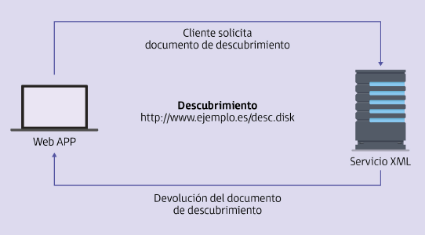

(UF4 Servicios web. Páginas dinámicas interactivas. Webs híbridas)

## 1. Reutilización del código y de la información en aplicaciones web híbridas

### 1.1. Aplicaciones web híbridas

Las **aplicaciones web híbridas** se basan en la combinación entre la versatilidad de un desarrollo web y la integración de la aplicación dentro de un dispositivo como si fuese nativa. 

**Aspectos positivos:**
Se puede hacer uso de lenguajes propios del desarrollo web como HTML y a la vez aprovechar funcionalidades  del dispositivo tales como la cámara, el GPS o los contactos para interactuar con la aplicación web.

Así, se reduce el coste de desarrollo de la aplicación (una aplicación nativa elevaría el coste). **Una única aplicación web es interpretada por los diferentes dispositivos a través de su ordenador**

**Resumen** Menor coste, reduce complejidad y especialización de desarrolladores y diseñadores y permite el acceso a todos los dispositivos independientemente del sistema operativo y características.

**Aspectos negativos**
El rendimiento del dispositivo se puede ver afectado ya que las aplicaciones web no puede gestionar los recursos internos de los dispositivos, ventaja que las aplicaciones nativas sí ofrecen.

### 1.2. Reutilización de código 

La **reutilización de código** permite un desarrollo de código más limpio y mejor estructurado. Posibilita una mayor escalabilidad de la aplicación y la integración con cualquier tipo de seguridad web. 

Se trata de un proceso que se debe considerar durante todo el desarrollo de la aplicación. Todas las funciones o partes de código susceptibles de ser reutilizadas en un futuro deben ser documentadas y detalladas. Para ello existen varios mecanismos:
- Incluir en un mismo fichero todas las constantes
- Encapsular en funciones las partes de código que se deben usar en varios sitios de la misma aplicación
- Hacer uso de comentarios o mecanismos de documentación de código
- Usar librerías externas que provean de funciones que cumplan con la funcionalidad requerida

## 2. Utilización de información proveniente de depósitos

El **catálogo de negocios de Internet (UDDI)** da un método para poder obtener y publicar información sobre diferentes sitios web. Esta organización busca la creación de una plataforma donde se publiquen los servicios web.

Se divide el proceso en tres etapas:
1. **Buscar un servicio de directorio**. Para ello es necesario ubicar el servicio web en XML dentro de UDDI
2. **Descubrimiento del servicio**. Una vez publicado el servicio, UDDI vincula una dirección a ese servicio de forma que sea localizable y accesible dentro de UDDI. En ese archivo dentro UDDI se guardarán los enlaces a los recursos especificados de este servicio
3. **Conocer la URL del servicio**. Dentro de este repositorio, cada cliente busca un determinado servicio, después UDDI le indica dónde puede encontrarlo. Una vez encontrado el archivo es posible conocer la URL asociada al servicio. 

Los **servicios web** se comunican mediante el uso de mensajes bajo el protocolo HTTP y mediante el uso del lenguaje XML.
Dentro del archivo XML se puede encontrar la descripción asociada al servicio. Si no cumple con la descripción del servicio publicada no se puede realizar la comunicación.

Para realizar las conexiones se debe establecer un formato de conexiones. Se puede modificar el protocolo HTTP por otro. No es obligatorio aunque si es recomendable ya que es un protocolo utilizado de forma global y fiable.

**Tipos de formatos de conexión**
- **HTTP**: Es el más común y recomendado, mediante el uso de los métodos GET y POST es posible el envío de los parámetros necesarios junto con la petición realizada por la URL.
- **SOAP**: Protocolo simple y ligero basado en el lenguaje XML. El mensaje es enviado separado del resto de parámetros, añadiendo seguridad y complejidad al servidor.

UDDI permite el uso centralizado de una gran cantidad de servicios web, que además son comprobados previamente.

## 3. Creación de depósitos

La **creación de repositorios** para el uso de distintos servicios web dentro de un solo dominio es algo que aún no está ampliamente aceptado. La mayor parte de las empresas cuandocrean un determinado servicio lo acaban publicando dentro de su propio dominio.

UDDI aún mantiene la esperanza (o la mantenía en el siglo en el que se escribió esto, cuando los sitios web eran relativamente nuevos) de que sea posible unificar estos servicios en un mismo repositorio un futuro.

La creación de repositorios encargados de buscar estos servicios aún no se ha planteado.

La comunicación de las diferentes plataformas es algo que nace de la necesidad propia de cada empresa, por lo que su desarrollo es implantado directamente en su propia aplicación.

## 4. Incorporación de funcionalidades específicas

El resultado obtenido tras la creación de una web, junto con sus servicios, debe ir acompañado de una documentación.

La **documentación** contiene una serie de métodos que indican de qué forma es posible comunicarse con una aplicación externa. Esto es lo que se conoce como **API**: Interfaz de programación que facilita y provee el acceso a los métodos creados dentro de un determinado servicio web.

La API:
- puede incluir una serie de especificaciones que indiquen cómo manejar todos los tipos de datos que se tendrán en la aplicación.
- su uso está fundamentalmente destinado a los desarrolladores de páginas web
- está escrita en un lenguaje de programación concreto y para hacer uso de ella debe usarse la sintaxis especificada por dicho lenguaje
- tiene como objetivo reconocer al máximo número de lenguajes posibles independientemente del que haya sido empleado para su creación 

Las funciones provistas por el lenguaje de programación han sido creadas con un propósito específico pero es posible que ninguna de ellas permita satisfacer las necesidades del servicio.
Durante las etapas de desarrollo será necesario crear mecanismos para desarrollar nuevas funcionalidades que permitan extender las posibilidades de un servicio.

El **auge de las redes sociales** ha permitido a grandes empresas hacer uso de las API como un mecanismo para facilitar que otro tipo de páginas web integren contenido de páginas web externas, incluso permiten que un programador utilice una plataforma de acceso que es ofrecida por un servicio de otra web como, por ejemplo, verificar la identidad de un usuario.

## 5. Programación de servicios y de aplicaciones web

**Diferencias entre servicio web y aplicación web**
- **Servicio web**: Tecnología que a partir del uso de una serie de protocolos actúa como canal de comunicación entre dos plataformas diferentes entre sí. Los servicios web permiten el intercambio de mensajes entre un cliente y un servidor independientemente del lenguaje de programación de cada uno de ellos.

- **Aplicación web**: Tipo de software que se codifica en un lenguaje capaz de ser interpretado por los navegadores que posteriormente se encargan de su ejecución. 

- Los servicios web están muy relacionados con las aplicaciones web pero no son iguales. 
- La aplicación web puede tener un determinado número de servicios --> La existencia de un servicio está relacionado directamente con la existencia de una aplicación web dónde se ejecute. 
- La ejecución de un servicio viene determinada por la petición de un recurso por parte del cliente. 

La creación de un servicio web es tarea compleja si se realiza por líneas de código. Los servicios web se encargan de convertir los datos recibidos por parte del cliente a un lenguaje que pueda ser interpretado por el servidor. Debe tener en cuenta todas las normas y reglas de uso de los protocolos que intervienen durante el proceso.

El continuo crecimiento de estos servicios requiere de mecanismos que permitan crear servicios webs de forma sencilla. Por eso algunos de los IDE de desarrollo de aplicaciones web permiten crear y publicar un servicio a través de una interfaz que abstrae a los programadores de esa complejidad.

## 6. Pruebas, depuración y documentación

Las **pruebas** son el mecanismo por el cual es posible comprobar si una aplicación web cumple con las condiciones y requerimientos especificados.

- **Forman parte del ciclo de vida** de creación de las aplicaciones.
- **Deben integrarse y realizarse de manera repetitiva** para poder detectar a tiempo el mayor número posible de errores
- Es bueno tratar de dividir el código en funcionalidades, intentando aislar unas partes de otras para que en caso de producirse algún fallo este no se arrastre a otras partes. (**Pruebas unitarias:** se ejecuta una parte del código sin que el resto de las funciones se vean afectadas. La mayoría de lenguajes de programación web permiten estas pruebas)
- En el desarrollo de cualquier aplicación o servicio web y de forma paralela a las pruebas se recomiendan los **procesos de depuración**. Permiten comprobar y realizar un seguimiento de la ejecución en tiempo real de dicha aplicación o página web. Así es posible comprobar los recursos utilizados por la aplicación. Analizar los valores que van tomando permite verificar que son correctas y controlar el flujo de ejecución. Para ello es necesario usar uso de IDEs que soporten el lenguaje de programación utilizado como Eclipse y Microsoft Visual Studio.
