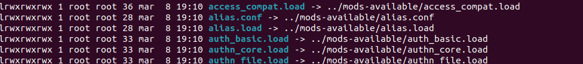
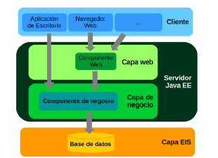
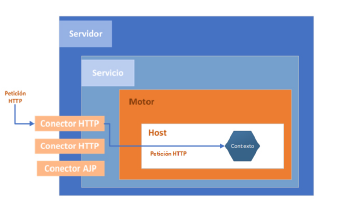
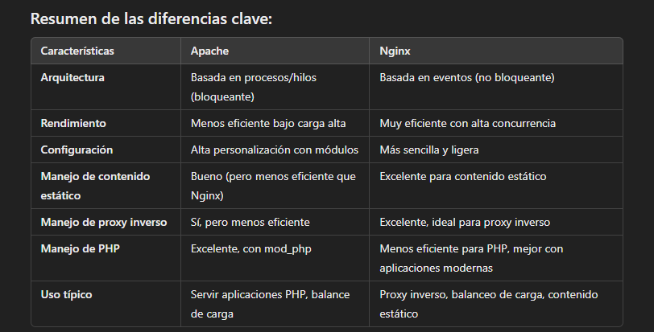

(UF1 Servidor Web y Transferencia de Archivos)
## 1. Configuración avanzada del servidor web

Bibliografía recomendada: 
- Bowen, R., Lõpez Ridruejo, D., & Liska, A. (2002). *Apache Administrator's Handbook*. Sams Publishing.
- Stein, L., & MacEachern, D. (1999). *Writing Apache Modules with Perl and C: The Apache API and mod_perl* (1st ed.). O'Reilly Media.

Una **aplicación web** puede considerarse como una extensión de un servidor de aplicaciones o un servidor web. Partes que intervienen: Cliente, Protocolo de comunicaciones, Servidor. 

La configuración de un servidor web varía según:
- el **peso de la información** (prever capacidad de almacenamiento)
- el **contenido de las páginas y de los lenguajes y compiladores que se utilizan** (página estática vs página dinámica con llamadas a BBDD y alojamiento de esta)
- **tipo de transmisión HTTP**
- **elección de servidor junto con el sistema operativo que lo controlará**
- **futuras conexiones y aplicaciones que instalar en el futuro**, es decir, **escalabilidad* y **modularidad**.

Al instalar el servidor debe ejecutarse el **plan de prueba** para comprobar el buen funcionamiento.

Se llama **página web estática** a aquella que no cambia mientras se visualiza en el cliente. En él el servidor se caracteriza por:
- Solo almacenar información
- Solo necesita soporte HTML/XHTML/CSS
- En configuración y administración el soporte es básico y, por tanto, el rendimiento es altísimo
- El procesador tiene poco trabajo --> coste mínimo, rapidez de acceso
- Tiempo de respuesta muy corto

En las **páginas webs dinámicas** se necesitan:
- Más recursos y servicios instalados por parte del servidor (PHP, BBDD,...)
- La configuración y administración es más compleja. 
- Es más importante la seguridad  en el equipo del servidor y sus métodos de acceso.

El cliente no ve la información contenida en el servidor (PHP, JSP,...) sino solo el contenido servido por este (HTML, CSS, JavaScript,...).

Un servidor debe destacar por su:
- **estabilidad** (hardware y software)
- **disponibilidad** de datos para acceder a ellos en cualquier momento
- **escalabilidad** para insertar un módulo al equipo de forma que no se obstaculice el funcionamiento de los demás componentes

El servidor está **a la escucha** en los puertos que se le indiquen.

En Xampp desde el fichero `/xampp/apache/conf/httpd.conf`
En Linux desde el fichero `/etc/apache2/ports.conf`

Por ejemplo es posible poner: 

```
# Solo el puerto
Listen 80 (Todas las interfaces de red, puerto 80)
Listen 8080

# O incluso el puerto con la IP
Listen 0.0.0.0:80  # Direccion comodin (todas las interfaces de red, puerto 80)
Listen 192.168.200.250:80 (Interfaz de red 192.168.200.250 puerto 80)
Listen 192.168.200.251:8080 
```

Por defecto se servirán contenidos de rutas desde **htdocs** en Xampp Windows según aparece en `httpd.conf`

```xml
#
# DocumentRoot: The directory out of which you will serve your
# documents. By default, all requests are taken from this directory, but
# symbolic links and aliases may be used to point to other locations.
#
DocumentRoot "C:/xampp/htdocs"
<Directory "C:/xampp/htdocs">
```

O desde **/var/www/http** en Linux (según aparece en `000.default.conf`)
```
DocumentRoot /var/www/html
```


## 2. Módulos: Instalación, configuración y uso

Con los **módulos** se pueden añadir y retirar funcionalidades de forma sencilla haciéndolo fácil de administrar. 
Los módulos compilados poseen extensión `.so`. 

Ejemplos de módulos son las comunicaciones por SSL, el soporte de PHP o el uso de LDAP como administrador de dominio. 

Mencionemos algunos de ellos:
- **mod_auth_basic**: Autenticación por Basic Auth
- **mod_auth_digest**: Autenticación por Digest Auth
- **mod_ssl**: Certificado SSL/TLS para uso de HTTPS
- **mod_rewrite**: Reescrituras de URLs
- **mod_expires**: Fechas de caducidad o cacheo de contenido estático
- **mod_userdir**: Directorios públicos para cada usuario del sistema
- **mod_headers**: Modificación de encabezados HTTP de Apache
- **mod_wsgi**: Permite alojar aplicaciones web basadas en Python
- **mod_proxy**: Uso de proxy inverso de Apache.

### 2.1. Módulos en Linux

A la hora de administrar el servidor Apache en Linux, consideraremos las siguientes cuestiones.

- Primero **iniciemos la sesión del servidor** con el usuario administrador.

Los **modulos estáticos** de Apache son componentes que están integrados directamente en el binario del servidor. No pueden ser activados o desactivados sin recompilar. Además, siempre están disponibles. Puede consultarse dónde están cargados con el comando:

```
sudo apache2ctl -l
```

Nos devuelve por ejemplo:

```
Compiled in modules:
  core.c   # Funciones básicas del servidor
  mod_so.c # Permite cargar módulos dinámicos
  mod_watchdog.c
  http_core.c  # Manejo de protocolo HTTP
  mod_log_config.c
  mod_logio.c
  mod_version.c
  mod_unixd.c
```

Para poder usar módulos no disponibles para su instalación,  habría que bajar el código fuente y compilarlo.

Los **módulos dinámicos** son componentes adicionales que se pueden cargar sin recompilar el servidor. Están cargados en el directorio **/etc/apache2/mods-enabled**. Todos los ficheros que existen aquí son **enlaces simbólicos a la carpeta** `mods-available`. 


El "fichero" de configuración sería `apache2.conf` pero aquí hay una configuración modular con archivos adicionales. (No como en Windows donde está todo en un solo archivo)

Los ficheros:
- `.conf`: Contiene las etiquetas `<ifModule nombre>` `/ifModule>` para saber el módulo que se va a cargar.

```
<IfModule alias_module>
	# ..... 
</IfModule>
```

- `.load`: Contiene la claúsula `LoadModule` seguida del módulo y la ruta donde se carga.

```
LoadModule alias_module /usr/lib/apache2/modules/mod_alias.so
```


**Instalación de módulos adicionales**

Los paquetes disponibles en el repositorio de Ubuntu para instalar módulos adicionales se ven con:
```shell
sudo apt-cache search libapache2-mod
```

Para **activar un módulo**:
```
# Activarlo
sudo a2enmod [nombre modulo]
# Reiniciar servidor 
sudo systemctl restart apache2
```

### 2.2. Módulos en Xampp Windows

Los módulos se encuentran guardados en `xampp/apache/modules` con extensión `.so`
Los módulos cargados por defecto se pueden consultar con:
```
httpd -l
```

Los módulos dinámicos son gestionados desde el fichero **/etc/conf/http.conf** y bastará con descomentar la línea correspondiente que, por ejemplo, tendrá este formato:

```
#LoadModule userdir_module modules/mod_userdir.so
```

En este caso también el fichero **httpd-userdir.conf** puede ser editado para realizar las configuraciones correspondientes. 

## 3. Servidores virtuales. Creación, configuración y utilización

Los **hosts virtuales** es una configuración que permite que un único servidor Apache sirva múltiples sitios web desde una misma máquina, usando diferentes nombres de dominio o direcciones IP. 

En  otras palabras permitiría:
- alojar múltiples sitios webs
- servir diferente contenido para las solicitudes HTTP del cliente
- que el equipo responda a diferentes direcciones IPs usando Apache
Configurar un servidor web para manejar múltiples dominios en un único servidor de forma eficiente o para configurar diferentes hosts virtuales para sesiones de hosting dedicadas. 


Se distinguirá entre:
- **Servidores virtuales basados en nombre:** Aloja múltiples sitios web en una misma IP diferenciándolos por el nombre de dominio que el cliente solicita (cabecera `Host` de la petición) y redirigiéndolos a diferentes puertos. 
- **Servidores virtuales basados en IP**: Aloja múltiples sitios webs diferenciándolos por la IP de la conexión. No aporta ventajas y, si las IPs del servidor se modifican con frecuencia puede ser un proceso difícil. No será necesario normalmente abrir puertos ya que se usa el puerto por defecto. 
- **Servidores virtuales basados en varios servidores principales**. Se gestionan múltiples servidores independientes, cada uno con sus propios recursos. 

En definitiva, en Apache, un "host virtual" es un bloque de configuración que asocia un nombre de dominio (por ejemplo, `mi-sitio.com`) o una dirección IP con un directorio específico en el sistema de archivos donde se encuentran los archivos del sitio web.

### 3.1. Gestión del servidor virtual
#### 3.1.1. Servidores virtuales en Linux

Los servidores virtuales están definidos en el directorio **/etc/apache2/sites-available**. Cada configuración de servidor virtual iría en un archivo de texto en el interior de esta misma carpeta (pero puede haber varios `VirtualHost`).

Estas configuraciones se habilitan/deshabilitan con los comandos:

```shell
# Habilitar
sudo a2ensite 000-default.conf
# Deshabilitar
sudo a2dissite 000-default.conf
```

#### 3.1.2. Servidores virtuales en Xampp Windows

No hay una carpeta sites-available sino que los servidores virtuales se gestionan en **/xampp/apache/conf/extra/httpd-vhosts.conf**

Estas configuraciones se habilitan/deshabilitan incluyéndo la directiva `Include` en el fichero `/xampp/apache/conf/httpd.conf`:

```shell
# Virtual hosts
Include conf/extra/httpd-vhosts.conf
```

----

Las claúsulas de configuración pueden ser sobrescritas en el fichero de configuración de cada sitio web **.htaccess** según lo que se haya especificado en **/xampp/apache2/etc/httpd.conf**:

    # AllowOverride controls what directives may be placed in .htaccess files.
    # It can be "All", "None", or any combination of the keywords:
    #   AllowOverride FileInfo AuthConfig Limit
    #
    AllowOverride All     (AllowOverride AuthConfig, por ejemplo)


#### 3.1.3. Permisos y logs

Podrían consultarse los logs con un comando como:

`tail -f /var/log/apache2/error.log`

Por otro lado, el usuario de Apache suele ser `www-data`

**Permisos de directorios**: Apache necesita **permisos de ejecución** en los directorios para poder acceder a ellos. También necesita **permisos de lectura** en los directorios para poder listar los archivos dentro de ellos si se necesita.  **755**
**Permisos de archivos**: Apache necesita **permisos de lectura** para los archivos para poder servirlos a los usuarios. **644**

### 3.2. Configuración de servidores virtuales

#### 3.2.1. Servidor virtual basados en nombres

Un ejemplo sería:

```xml
<VirtualHost *:80>
	ServerAdmin example@example.com
	ServerName example.com
	ServerAlias www.example.com
	DocumentRoot /var/www/example.com.conf
	ErrorLog /var/log/apache/logs/error.log
	LogLevel warn
	CustomLog /var/log/apache/los/acces.log.combined
</VirtualHost>
```

- Primera línea: Apache escucha en el puerto 80 de todas las interfaces de red disponibles en la máquina.
- **ServerAdmin**: Información de contacto del administrador del sitio web
- **ServerName**: Nombre del dominio del sitio web
- **ServerAlias** Nombre secundario del sitio web
- **DocumentRoot** Carpeta raíz del sitio web
- **ErrorLog** Archivo en el que se almacenarán los errores
- **LogLevel** Nivel de errores enviados a registro
- **CustomLog** Archivo donde se dirigirá la información de acceso. 

Cuando un cliente realiza una solicitud, por ejemplo, a través de un navegador, la solicitud HTTP contiene varias cabeceras, entre ellas la cabecera **Host**, que especifica el nombre de dominio o subdominio solicitado. Apache utiliza esta cabecera para determinar qué **host virtual** debe usar para servir el contenido adecuado.

#### 3.2. Servidor virtual basado en direcciones IP

Al inicio de la configuración se indica la dirección IP específica del servidor. Apache solo aceptará solicitudes que lleguen a esa IP específica. Si el cliente intenta conectarse a una IP diferente en el mismo servidor no se manejará por este Virtual Hosts. 

Como es obvio, para ello deberá tenerlas asignadas la máquina del servidor primero.
También podrá acceder mediante el `ServerName` configurado pero solo si dicho dominio resuelve a esa IP.
Otro `ServerName` que resuelva a una IP diferente no podrá acceder. 

A continuación se indica, por ejemplo, el directorio donde se almacenan los ficheros de la página web, seguido del nombre de dominio y de su alias. 

```xml
# Configuración para el sitio 1 (IP 192.168.1.100)
<VirtualHost 192.168.1.100:80>
    DocumentRoot "/var/www/sitio1"
    ServerName sitio1.com
    ServerAlias www.sitio1.com
</VirtualHost>

# Configuración para el sitio 2 (IP 192.168.1.101)
<VirtualHost 192.168.1.101:80>
    DocumentRoot "/var/www/sitio2"
    ServerName sitio2.com
    ServerAlias www.sitio2.com
</VirtualHost>
```

#### 3.3. Servidor virtual basado en servidores principales

Este es útil en caso de desear tener varios archivos de configuración de forma independiente, organizando en cada uno sus servidores virtuales que pudieran tener. 

Así en Xampp se incluirá en  `/xampp/apache/conf/httpd.conf` se incluirá la ruta de las configuraciones de los servidores virtuales: 

```
# Incluir la configuración para producción
Include /etc/apache2/sites-prod.conf

# Incluir la configuración para desarrollo
Include /etc/apache2/sites-dev.conf

# Incluir la configuración para pruebas
Include /etc/apache2/sites-test.conf
```

Y en Linux se habilitarán los ficheros `/etc/apache2/sites-availables` mediante: 
```
sudo a2ensite sites-prod.conf
sudo a2ensite sites-dev.conf
sudo a2ensite sites-test.conf
```

----

```bash
# Crear directorio
sudo mkdir -p /var/www/despliegue.com/public.html
# Revisar propiedad
sudo chown -R $USER:$USER /war/www/despliegue.com/public_html
# Garantizar acceso de lectura a directorios webs comunes y archivos y carpetas
sudo chmod -R 755 /var/www
# Crear un index.html para el sitio
```

## 4. Autenticación y control de acceso

El servidor web debe limitar el acceso a determinadas páginas mediante políticas rígidas de acceso.
Para ello suelen usarse gestores de bases de datos SQL o LDAP. 

**En HTTP existen varios métodos de autenticación** que permiten asegurar que solo usuarios autorizados puedan acceder a ciertos contenidos:
- **Basic Authentication**: El servidor envía código _401 Unathorized_ al intentar acceder a un recurso protegido, incluye en la respuesta una cabecera `WWW-Authenticate` que indica que se requiere Basic Authentication. Se solicitarán las credenciales al usuario y estas se envían en un header con el formato `Authorization: Basic <base64(nombre de usuario:contraseña)>`. Las credenciales en este caso viajan sin cifrar y podrían ser interceptadas.
- **Digest Authenticacion**: El cliente recibe un reto (challenge) del servidor que incluye un valor llamado (nonce) que es un número aleatorio generado por el servidor. El cliente combina el nonce, su contraseña y otros valores como método HTTP y URI y envía el resultado en cabecera `Authorization: Digest <valor>`. El servidor realiza el mismo cálculo y, si coincide con el valor enviado, permite el acceso.

Otras formas:
- **Bearer Token Authentication**: En cada solicitud el cliente obtiene un token de autenticación con tiempo de expiración de un servidor de autorización (como OAuth o la gestión por JWT). Este token se incluye en la cabecera de las solicitudes subsecuentes como `Authorization: Bearer <token>`. El servidor validará este token.
- **Certificate-based Authentication:** El cliente presenta un certificado digital (validado por una autoridad de certificación, CA) para autenticar su identidad. 
- **Form Authentication:** El usuario introduce usuario y contraseña en un formulario, que son validadas. Se usa en conjunto con otras tecnologías como sesiones y cookies para mantener la autenticación a lo largo de la navegación. 
### 4.1. Autenticación HTTP access. **Módulo auth_basic**

Debe estar habilitado el módulo **auth-basic**
Linux:
```
sudo a2enmod auth_basic
```
Xampp (httpd.conf):
```
LoadModule auth_basic_module modules/mod_auth_basic.so
```

Se realiza en el archivo **.htaccess** de los directorios de las páginas web (Siempre que `AllowOverride AuthConfig` esté declarado en la configuración del servidor)

1. Crear fichero **htpasswd** en el que se guardan credenciales de usuario permitidos
2. Instalar paquete **apache2-utils** que contiene **htpasswd** `sudo apt install apache2-utils`
3. Crear fichero para un usuario en cuestión `sudo htpasswd -c /etc/apache2/passwd usuario`. El sistema pedirá que se ingrese y confirme la contraseña que se almacenará de forma cifrada en el fichero `passwd`
4. Editar fichero de configuración `000-default.conf` (o el que proceda) para permitir acceso a usuarios. Se usará en el host virtual o en el directorio que proceda, pudiéndose emplear las etiquetas: `<RequireAll>` (requerir todas las condiciones) `<RequiredAny>` (requerir alguna de las condiciones)

---

Curiosidad. En `Directory` también se puede especificar:
- **AddType**: Indicar qué tipo MIME debe usarse para ciertas extensiones concretas. Ejemplo `.imagen`  `image/png`
- **ForceType**: Hacer que todos los archivos sean servidos con el tipo MIME que se establezca
- **DefaultType**: Establecer Content-Type a cualquier archivo cuyo MIME no pueda determinarse por extensión. Está obsoleto y no debe usarse.

---

```xml
<VirtualHost *:80>
    # Otros ajustes de configuración...

	<Directory /var/www/html/misimagenes>
		ForceType image/png
		AddType image/png imagen
	</Directory>

    <Directory /var/www/html/sitio_protegido>
        # Activar la autenticación básica
        AuthType Basic
        AuthName "Acceso Restringido"
        AuthUserFile /etc/apache2/passwd  # Ruta al archivo .htpasswd
        Require valid-user  # Requiere un usuario válido
    </Directory>
    
	<Directory /var/www/html/otro_sitio_protegido>
	    AuthType Basic
	    AuthName "Acceso Restringido"
	    AuthUserFile /etc/apache2/passwd
	    <RequireAll>
	        Require valid-user
	        Require ip 192.168.1.100  # Solo usuarios desde esta IP pueden acceder
	    </RequireAll>
	</Directory>

	<Directory /var/www/html/otro_sitio_protegido>
	    AuthType Basic
	    AuthName "Acceso Restringido"
	    AuthUserFile /etc/apache2/passwd
	    <RequireAny>
	        Require valid-user
	        Require ip 192.168.1.100  # O usuarios desde esta IP
	    </RequireAny>
	</Directory>
	
</VirtualHost>
```


### 4.2. Autenticación HTTP Digest. **Módulo auth_digest**

Debe estar habilitado el módulo **auth-digest**. El procedimiento debe realizarse sobre una página web en concreto. 

Linux:
```
sudo a2enmod auth_digest
```
Xampp (httpd.conf):
```
#LoadModule auth_digest_module modules/mod_auth_digest.so
```

Debe tenerse en cuenta que este tipo de autenticación, **debe realizarse sobre una página web en concreto**
Es necesario crear un fichero con `htdigest`
```
# Comando
sudo htpdigest -c /etc/apache2/digest dominio usuario
# Ejemplo 
sudo htdigest -c /etc/apache2/digest "MiZonaProtegida" usuario1
```

```
<Directory /ruta/a/tu/carpeta/protegida>
    AuthType Digest
    AuthName "MiZonaProtegida"
    AuthDigestFile /etc/apache2/digest
    Require valid-user
</Directory>
```


## 5. Protocolo HTTPS. Certificados. Servidores de certificados. **Módulo mod_ssl**

El **protocolo HTTPS** (protocolo de transferencia de hipertexto de forma segura) implementa técnicas de encriptación de la información antes de ser transferida desde el equipo origen, mejorando el protocolo HTTP.

El cifrado de la información requiere un tiempo de procesamiento y una implementación de métodos que ejecutar por lo que el trabajo de procesador y el tiempo de computación puede verse afectado. En todo caso, debe sopesarse la información a transmitir en forma segura para no provocar un sobreesfuerzo. Con todo, hay negocios en los que será necesario reforzar y encriptar completamente toda la página web como por ejemplo una web de un banco. 

Así el servidor web estará configurado para que en todo dominio esté cifrada su información o simplemente el intento de acceso a esta. 

Los servidores web pueden emitir certificados aunque los navegadores podrían no detectarlo si no está dentro de sus servidores de confianza. Grandes empresas crean certificados propios para sus empleados, permitiendo así que solo acceda personal autorizado por la propia empresa. 

El protocolo HTTPS utiliza como método de cifrado el basado en SSL/TLS (protocolos criptográficos para dar comunicaciones seguras por una red), dando autenticación y privacidad. 

**SSL (Secure Sockets Layer)** es un protocolo de seguridad que se usa para establecer una conexión segura y encriptada entre un cliente (navegador web) y un servidor (servidor web). Ha sido reemplazado hoy día por su sucesor TLS (Transport Layer Security) pero el término sigue empleándose para referirse a esta seguridad.

**Funciones principales de TLS/SSL**
- **Encriptación**: Información encriptada. No puede ser leída, ni modificada por terceros.
- **Autenticación**: Permite verificar que el servidor con el que se produce la comunicación es realmente quien dice ser; mediante el uso de certificados digitales emitidos por una entidad de certificación confiable (CA)
- **Integridad**: Asegura que los datos no han sido alterados durante el tránsito. Llegan de forma íntegra.

**Funcionamiento**
1. **Handshake**: El cliente se conecta al servidor que tiene SSL/TLS. El servidor responde enviando su certificado digital con su clave pública. El cliente verifica la autenticidad del certificado con una entidad de certificación (CA) y, si es válido, usa la clave pública para encriptar una clave secreta que enviará al servidor.
2. **Encriptación**: El servidor recibe la clave secreta encriptada y ambas partes pueden usarse para cifrar la comunicación.
3. **Comunicación segura**: Durante toda la sesión los datos estarán encriptados. 

**Importancia**
- **Protección de datos sensibles**: Esencial en tiendas online, bancos, redes sociales.
- **Confianza del usuario**: Al usuario se le indica mediante un icono de candado en la barra de direcciones del navegador y el uso del protocolo https que la conexión es segura.
- **Posicionamiento en motores de búsqueda**: Los motores de búsqueda priorizan sitios web que usan SSL/TLS (HTTPS) y penalizan a los que no lo hacen (HTTP).

Para que se acceda mediante protocolo HTTPS debe estar configurado el **puerto 443** (y el **puerto 80** si se quiere recibir de HTTP).

**Para verificar un certificado desde un navegador**
Al  llamar a una URL por protocolo HTTPS, puede consultarse el certificado que emite la información junto con el método de cifrado utilizado. (Opciones Avanzadas > Certificados > Ver certificado). Si el navegador no conoce el certificado que emite la información, se dará alguna indicación en una pantalla de error y la posibilidad de añadir la excepción y confiar en el sitio que se intenta visualizar. 

### 5.1. Configuración del módulo mod_ssl

1. Debe estar habilitado el módulo **ssl**
Linux:
```
sudo a2enmod ssl
```
Xampp (httpd.conf):
```
LoadModule ssl_module modules/mod_ssl.so

# (Windows) Y la linea de la configuracion SSL para añadirla
Include conf/extra/httpd-ssl.conf
```

2. Debe estar corriendo el **server HTTPS en 443**
(Windows XAMPP) En el fichero de  `xampp/apache/conf/extra/httpd-ssl.conf
(Linux) En el fichero de `/etc/apache2/ports.conf`
	- Debe estar `Listen 443`

3.- Debe **generarse clave privada y certificado autofirmado** mediante OpenSSL
```ssh
# Generar clave privada
openssl genrsa -out server.key 2048
# Generar certificado autofirmado
openssl req -new -x509 -key server.key -out server.crt -days 365
```

- `genrsa`: Genera una clave privada RSA.
- `-out server.key`: Guarda la clave privada en un archivo llamado `server.key`.
- `2048`: Especifica la longitud de la clave en bits (2048 bits es un estándar seguro).

- `req -new`: Crea una nueva solicitud de certificado.
- `-x509`: Indica que el certificado será **autofirmado** (no emitido por una CA externa).
- `-key server.key`: Usa la clave privada generada en el paso anterior (`server.key`).
- `-out server.crt`: Guarda el certificado en el archivo `server.crt`.
- `-days 365`: Especifica la validez del certificado (1 año).


Los ficheros `server.key` y `server.crt` se deben ubicar en:
```
C:\xampp\apache\conf\ssl.key\
C:\xampp\apache\conf\ssl.crt\
```

(Windows Xampp) Y confirmar que en `httpd-ssl.conf` se apunta a los certificados que se han generado
(Linux) Y confirmar que en el fichero `/etc/apache2/sites-available/default-ssl.conf`

(Deben estar en....)
```
SSLCertificateFile "C:/xampp/apache/conf/ssl.crt/server.crt"
SSLCertificateKeyFile "C:/xampp/apache/conf/ssl.key/server.key"
```

## 6. Reescrituras de URLs. **Módulo mod_rewrite**

Debe estar habilitado el módulo **rewrite**
Linux:
```
sudo a2enmod rewrite
```
Xampp (httpd.conf):
```
LoadModule rewrite_module modules/mod_rewrite.so
```

**Añadir reglas de reescritura**
Se realiza en el archivo **xamp/htdocs/.htaccess** de los directorios de las páginas web (Siempre que `AllowOverride All` esté declarado en la configuración del servidor)

Ejemplos de reglas de redirección serían: 

```
RewriteEngine On
RewriteRule ^about$ about.html [L]
RewriteRule ^.*/about$ about.html [L]
```

Esto significa que si la URL solicitada es `about` (sin la barra inclinada al final), Apache redirigirá a `about.html`. La `L` asegura que si esta regla se aplica, no se ejecutarán más reglas de reescritura después de esta.
Como vemos se puede poner la expresión regular que uno quiera. 

## 7. Fechas de caducidad del caché en contenido estático. **Módulo mod_expires**

Módulo que permite controlar los encabezados de caducidad (headers de expiración) de las respuestas HTTP. Es útil para gestionar la caché del navegador indicándole cuánto tiempo deben almacenarse los archivos estáticos (imágenes, CSS, JavaScript) antes de solicitarlos de nuevo al servidor. 

Con él:
- se **mejora el rendimiento** al reducir la carga del servidor y el tiempo de carga de las páginas para los usuarios. 
- se **reduce el ancho de banda** al reutilizar recursos, evitando descargarlos repetidamente.
- se **mejora la experiencia del usuario** que experimenta un acceso más rápido a la web.

Los encabezados agregados son:
- `Expires`: Indica la fecha y hora hasta la cual el navegador
mantendrá en caché ese recurso (HTTP/1.0 )
- `Cache-Control`: Con max-age indica el tiempo (HTTP/1.1)
en segundos que el recurso será almacenado en caché (604800 segundos es
igual a 1 semana).

Usados juntos, Cache-Control tiene prioridad en HTTP/1.1 y posteriores. 

Debe estar habilitado el módulo **rewrite**
Linux:
```
sudo a2enmod expires
```
Xampp (httpd.conf):
```
LoadModule expires_module modules/mod_expires.so
```

- `ExpiresActive On`: Habilita el uso de `mod_expires`
- `ExpiresByType`: Define la política de expiración en función del MIMEType.  (1 month, 1 week, 1 day,...)

La configuración que puede agregarse en el archivo `.htaccess` del sitio web (o en la configuración de Apache) podría ser:

```xml
<IfModule mod_expires.c>
	ExpiresActive On
	ExpiresByType image/jpg "access plus 1 month"
	ExpiresByType image/jpeg "access plus 1 month"
	ExpiresByType image/gif "access plus 1 month"
	ExpiresByType image/png "access plus 1 month"
	ExpiresByType text/css "access plus 1 week"
	ExpiresByType application/javascript "access plus 1 week"
	ExpiresByType text/html "access plus 0 seconds"
</IfModule>
```

## 8. Directorios públicos accesibles para cada usuario del  sistema. **Módulo mod_userdir**

Permite a los usuarios acceder a sus propios directorios personales a través de URLs específicas. Contenido alojado en subdirectorios dentro del home del usuario como por ejemplo: `http://example.com/~pepito`

Así:
- Cada usuario tiene su especio
- Se facilita la creación de sitios web por múltiples usuarios


Debe estar habilitado el módulo **rewrite**
Linux:
```
sudo a2enmod userdir
```
Xampp (httpd.conf):
```
LoadModule rewrite_module modules/mod_userdir.so
```


```bash
# Activar el modulo userdir
sudo a2enmod userdir
# Crear usuario pepito
sudo adduser pepito
# Le damos permisos de sudo
sudo usermod -aG sudo pepito
# Iniciamos sesión (Se crea directorio personal y configuraciones basicas)
su - pepito
# Crear archivo HTML en directorio publico del usuario 
mkdir /public_html
echo "<h1> Hola desde el directorio</h1>" > /public_html/index.html
# Reiniciar Apache
systemctl restart apache2
```

¡Cuidado con los permisos!


## 9. Modificación de los encabezados HTTP de Apache. **Módulo mod_headers** 

Permite modificar encabezados HTTP de las respuestas y solicitudes que maneja el servidor. Así se puede ajustar el caché, controlar la seguridad o personalizar cómo los navegadores manejan las solicitudes.

**Funciones**
- Añadir, modificar eliminar encabezados HTTP
- Configurar políticas de seguridad como:
		- Content-Security-Policy
		- X-Frame-Options
- Controlar manejo de caché con Cache-Control. 

Debe estar habilitado el módulo **rewrite**
Linux:
```
sudo a2enmod headers
```
Xampp (httpd.conf):
```
LoadModule rewrite_module modules/mod_headers.so
```

Editar el archivo de configuración de Apache (por defecto, `/etc/apache2/sites-available/000-default.conf` ) y añadir lo siguiente dentro de un bloque `<VirtualHost>`:
```xml
<IfModule mod_headers.c>
Header set Cache-Control "max-age=3600, must-revalidate"
</IfModule>

<!--navegador que almacene en caché el contenido
durante 1 hora (3600 segundos) y que debe validar la caché cuando expire.!-->
```

### 9.1. Realización de pruebas mediante analizadores de performance

Analizan el tiempo de carga de un sitio web y verifican si los encabezados de caché están configurados correctamente. También dan información sobre los recursos y dicen si la caducidad de la caché está bien configurada en el servidor Apache. 

- https://gtmetrix.com/
- https://www.webpagetest.org/
- **Lighthouse**

## 10. Permitir aplicaciones web basadas en Python. **Módulo mod_wsgi**

Debe estar habilitado el módulo **rewrite**
Linux:
```
sudo a2enmod rewrite
```
Xampp (httpd.conf):
```
LoadModule rewrite_module modules/mod_rewrite.so
```

```shell
# Actualizar paquetes
sudo apt update
# Instalar Apache
sudo apt install apache2
# Acceder a localhost/ (O hacer un curl)
curl localhost/
# Comprobar estado Apache
sudo systemctl status apache2
# Instalar modulo wsgi para usar pythonen Apache
sudo apt install apache2 python3 python3-pip
# Instalar mod_wsgi de Apache
sudo apt install libapach2-mod-wsgi-py3
# Habilitarlo
sudo a2enmod wsgi
# Crear app python
sudo mkdir /var/www/html/myapp
# Crear archivo python myapp.wsgi
sudo vim /var/www/html/pyapp/myapp.wsgi
# Cambiar sus permisos para asegurarnos de que se puede leer
sudo chown www-data:www-data /var/www/html/pyapp/myapp.wsgi  
sudo chmod 755 /var/www/html/pyapp/myapp.wsgi
```

```python
def application(environ, start_response):  
	status = '200 OK'  
	output = b'Hello, this is a Python application running on Apache!'  
	response_headers = [('Content-type', 'text/plain'),  ('Content-Length', str(len(output)))]  
	start_response(status, response_headers)  
	return [output]
```

Añadir a `sudo nano /etc/apache2/sites-available/000-default.conf`
La configuración para servir aplicación python: 

```
WSGIScriptAlias /pyapp /var/www/html/pyapp/myapp.wsgi  
<Directory /var/www/html/pyapp>  
Require all granted  
</Directory>
```

Reiniciar apache:
`sudo systemctl restart apache2`
Probar: localhost/pyapp

## 11. Uso de proxy inverso en Apache. **Módulo mod_proxy**

Un **proxy inverso** es un servidor que actúa como intermediario entre los clientes (por ejemplo, los navegadores de los usuarios) y uno o más servidores de backend. El proxy inverso recibe las solicitudes del cliente y las redirige a los servidores internos que realmente manejarán esas solicitudes (por ejemplo, un servidor de aplicaciones o un servidor web). En un **proxy inverso**, el cliente nunca interactúa directamente con el servidor backend; en cambio, siempre se comunica con el proxy, que redirige las solicitudes según sea necesario.

**¿Por qué usar un Proxy Inverso?**

- **Balanceo de carga**: Distribuir solicitudes entre varios servidores backend.
- **Seguridad**: Ocultar la infraestructura interna de los usuarios.
- **Caché**: Mejorar el rendimiento almacenando en caché el contenido que se sirve de manera frecuente.
- **SSL Offloading**: Descartar la carga del cifrado SSL de los servidores backend y dejarlo a cargo del proxy


Debe estar habilitado el módulo **mod_proxy**

Linux:
```
sudo a2enmod proxy
```
Xampp (httpd.conf):
```
LoadModule rewrite_module modules/mod_proxy.so
```

Además deben estar los módulos `mod_proxy_http` (HTTP) o `mod_ssl` (HTTPS).

### 11.1. Configurar el proxy inverso

Supongamos que se tiene una aplicación backend corriendo en: `http://localhost:8080` y se quiere que Apache redirija las solicitudes de `http://mi-sitio.com` a esa aplicación.

Supongamos que se tiene una aplicación backend corriendo en: `http://localhost:8080` y se quiere que Apache redirija las solicitudes de `http://mi-sitio.com` hasta esa aplicación.

```xml
<VirtualHost *:80>
	ServerName mi-sitio.com
	# Habilitar Proxy Inverso
	ProxyPass / http://localhost:8080/
	ProxyPassReverse / http://localhost:8080/
	# Opcional: Habilitar el logging
	ErrorLog ${APACHE_LOG_DIR}/error.log
	CustomLog ${APACHE_LOG_DIR}/access.log combined
</VirtualHost>
```


**ProxyPass**: Esta directiva le indica a Apache que redirija todas las solicitudes que lleguen a `/` en `http://mi-sitio.com` hacia `http://localhost:8080/`.

 **ProxyPassReverse**: Esta directiva se asegura de que cualquier respuesta que el servidor de backend envíe de vuelta se reescriba correctamente para que parezca que está llegando de Apache, no del servidor backend.

```xml
<VirtualHost *:80>
    ServerName app1.com

    ProxyPreserveHost On
    ProxyPass / http://localhost:8080/app1/
    ProxyPassReverse / http://localhost:8080/app1/
</VirtualHost>

<VirtualHost *:80>
    ServerName app2.com

    ProxyPreserveHost On
    ProxyPass / http://localhost:8080/app2/
    ProxyPassReverse / http://localhost:8080/app2/
</VirtualHost>
```

## 12. Aplicaciones web basadas en Java EE. Tomcat

### 12.0.1. JavaEE 

**Java EE** (actualmente **JakartaEE**) es una arquitectura (conjunto de especificaciones) que permite la implementación de aplicaciones web realizadas en Java que dan servicio a aplicaciones cliente. . Existen diversas implementaciones de la especificación: Wildfly (Red Hat), TomcatEE (Apache), WebSphere Application Sever (IBM), GlassFish y WebLogic Server (Oracle),...

Java EE da servicios que permiten que el equipo de desarrollo no tenga que hacer programación a bajo nivel, ni código repetitivo (boilerplate) y puedan centrarse en la lógica de la aplicación.
Al hablar de lógica debe separarse entre lógica de negocio (cerebro de la aplicación) y lógica de presentacion (lo que ve el usuario).

Para separar la **lógica de negocio** y la de **presentación**, Java EE tiene un modelo basado en componentes (unidades lógicas separadas que agrupan una o varias funciones), distribuido (cada componente se puede ejecutar en un sistema diferente) y multicapa (cada componente se aloja en una capa diferente donde los componentes de una capa pueden usar los componentes de las capas inferiores para realizar su función). 

**Capas de una aplicación Java EE**
- **Máquina cliente**: Navegador web, aplicaciones de escritorio, antiguamente las Applets de Java,... No forma parte de Java EE
- **Capa web**: Componentes web encargados de producir contenido web dinámico (HTML, CSS) o de transferencia de datos (XML, JSON). Los componentes de esta capa sí se ejecutarían en el servidor de Java EE, contenedor web. También está el contenido estático de la web (HTML, imágenes, JavaScript,..). Implementa la lógica de presentación.
- **Capa de negocios**: Componentes encargados de llevar a cabo la lógica de negocio de la aplicación como los **Enterprise Java Beans (EJB)** que se ejecutarían en un contenedor EJB. Implementa la capa de negocio.
- **Capa del sistema de información de la empresa (EIS, Enterprise Information System)**: Referencia a los sistemas donde se almacenan la información, siendo lo más normal que sea una base de datos. No forma parte de Java EE.



Así:
- el navegador web se comunicará solo con la capa web de JavaEE para obtener información en formato representable
- la aplicación de escritorio se comunica con la capa web (obteniendo información en formato XML por ejemplo) o con la capa de negocio
- la capa web puede comunicarse con la capa de negocio para pedirle realizar alguna tarea
- la capa de negocio puede comunicarse con la capa EIS para pedirle que almacene o actualice datos, por ejemplo

En el modelo de aplicación de Java EE, la capa web y la capa de negocio se denominan capa intermedia (middletier), lugar donde se sitúan las aplicaciones web.

Los componentes siguen una estructura estándar y se empaquetan de forma que pueden ser usados en cualquier servidor de aplicaciones que cumpla con la certificación Java EE en un proceso conocido como **despliegue**. Una vez desplegada, la aplicación se puede ejecutar. 


### 12.0.2. Servlets y JSP

Entre los componentes que puede ejecutarse en la capa web de servidores JavaEE están:
- **Servlets**: Clases de Java que reciben peticiones y dan respuestas de forma dinámica. Normalmente usando el protocolo HTTP y produciendo contenido web pero no tiene por qué ser necesariamente así.
- **JavaServer Pages (JSP)**: Tecnología para la generación de contenido web dinámico embebiendo pequeños trozos de código Java que modifican el contenido generado (de forma parecida a lo hecho por PHP o ASP.NET). Se utilizan etiquetas JSP como:  `<% %>` y `<jsp: >` Los archivos JSP se compilan después y se transforman un servlet. 
- **JavaServer Faces (JSF)**: Framework de Java para la creación de interfaces web mediante el uso de componentes reutilizables. Permite manejar la interacción del usuario a través de un modelo basado en eventos y facilita la conexión con la lógica de negocio. Suelen escribirse en XHTML y se procesan en el servidor para generar contenido dinámico. El contenido web se suele realizar empleado Facelets desde versión 2.x. (sistema de plantillas basado en XHTML) aunque en las primeras versiones 1.x. se hacía empleando JSP y había librerías como Woodstock JSF Components. Se utilizan etiquetas JSF como `<h: >`, `<f: >`, `<ui: >`. JSF utiliza un servlet especial llamado **FacesServlet** que actúa como contenedor central del framework (gestiona solicitudes, procesa eventos y determina qué vista mostrar). Se utilizan varias librerías de componentes que amplían las capacidades de la interfaz gráfica con elementos visuales avanzados, mejor integración con AJAX y estilos modernos. Es el caso de PrimeFaces, IceFaces (tiene el uso de push server-side para actualizar contenido automáticamente sin que el usuario tenga que hacer click y actualmente ha perdido relevancia respecto a PrimeFaces) y RichFaces (actualmente descontinuado). 

**Servlet**
```java
import java.io.*;
import javax.servlet.*;
import javax.servlet.http.*;

public class MiServlet extends HttpServlet {
    @Override
    protected void doGet(HttpServletRequest request, HttpServletResponse response) throws ServletException, IOException {
        // Establecemos el tipo de contenido
        response.setContentType("text/html");
        PrintWriter out = response.getWriter();

        // Escribimos la respuesta
        out.println("<html><body>");
        out.println("<h1>¡Hola desde el Servlet!</h1>");
        out.println("</body></html>");
    }
}
```
**JSP**
```jsp
<%@ page language="java" contentType="text/html; charset=ISO-8859-1"%>
<%@ taglib uri="http://java.sun.com/jsp/jstl/core" prefix="c" %>
<html>
<head>
    <title>Mi Página JSP</title>
</head>
<body>
    <h1>¡Hola desde JSP!</h1>
    <p>La fecha actual es: <%= new java.util.Date() %></p>
</body>
</html>

```
**JSF con JSP y Woodstock (JSF 1.x.)**
```jsp
<%@ taglib uri="http://www.sun.com/web/ui" prefix="webuijsf" %>
<webuijsf:form>
    <webuijsf:textField id="nombre" text="#{usuarioBean.nombre}" label="Nombre:" />
    <webuijsf:button id="guardar" text="Guardar" action="#{usuarioBean.guardar}" />
</webuijsf:form>
```
**JSF con XHTML y Facelets (JSF 2.x.)**
```xhtml
<h:form>
    <h:outputLabel for="nombre" value="Nombre:" />
    <h:inputText id="nombre" value="#{usuarioBean.nombre}" />
    <h:commandButton value="Guardar" action="#{usuarioBean.guardar}" />
</h:form>
```
**JSF con IceFaces, AJAX**
```xhtml
<ice:form>
    <ice:panelGrid columns="2">
        <ice:outputLabel for="nombre" value="Nombre:" />
        <ice:inputText id="nombre" value="#{usuarioBean.nombre}" />
        <ice:commandButton value="Guardar" actionListener="#{usuarioBean.guardar}" />
    </ice:panelGrid>
</ice:form>
```
**JSF con PrimeFaces**
```xhtml
<p:panel header="Formulario">
    <p:inputText id="nombre" value="#{usuarioBean.nombre}" placeholder="Nombre" />
    <p:commandButton value="Guardar" action="#{usuarioBean.guardar}" icon="pi pi-save" />
</p:panel>
```

------------------
El proceso es el siguiente:
- Usuario teclea URL
- Navegador web lanza petición HTTP al servidor web con soporte para componentes web basados en servlets (contenedor web)
- Servidor web convierte petición en `HttpServletRequest` que pasa al componente web adecuado (puede haber varios). La app web debe estar correctamente configurada para enviarlo al adecuado
- El componente web procesa la petición y genera `HttpServletResponse`
- El contenedor web transforma ese objeto en respuesta HTTP al cliente. 

La configuración de la aplicación web podría hacerse:
 - A nivel más local  a través de **anotaciones** (han convertido el descriptor de despliegue en algo opcional en muchos casos)
 - A nivel más global a través del **descriptor de despliegue**
 - Usando **descriptores de despliegue dependientes de la implementación** según el servidor JavaEE concreto que se quiera implementar.

###  Servidor de aplicaciones Tomcat

Tomcat es un servidor HTTP (recibe peticiones HTTP y las redirige al contenedor web) y un contenedor web (ejecuta los componentes web necesarios).

###  Arquitectura de Tomcat

Tomcat está formado por una serie de componentes anidados formando una jerarquía.

- **Servidor**: Representa al contenedor de servlets en sí mismo (Tomcat en su conjunto)
- Dentro del servidor hay uno o más **servicios**, cuya función es enlazar el componente encargado de comunicarse con el cliente con la parte que procesa la petición y genera una respuesta. Dentro del servicio puede haber:
	- Uno o más **conectores** (connectors): Componente encargado de recibir peticiones del cliente remoto y pasárselas al motor (engine). Una vez que el motor procesa la petición, el conector le da la respuesta al cliente remoto
	- **Motor** (engine): Encargado de procesar la petición y devolver el contenido al conector. Para lograr su cometido tendrá que ejecutar, si se requiere, la aplicación web diseñada.
		- En el motor habrá uno o varios **Hosts**. Buscan asociar un nombre de equipo al servidor Tomcat para que el servidor Tomcat pueda responder a peticiones asociadas a un nombre de equipo concreto. Dentro de Tomcat una aplicación web equivaldrá a un contexto (context) que se definirá y ejecutará dentro de un Host. 



###  Configuración de Tomcat

Podemos citar:
- **conf/server.xml**: Archivo de configuración principal (se configura servidor, servicios, conectores, motor, hosts, unos anidados dentro de otros)
- **conf/context.xml**: Archivo de configuración del contexto base de todas las aplicaciones ejecutadas en Tomcat. No debe modificarse. Cada aplicación web puede tener su propio contexto de ejecución complementando al principal (META-INF/context.xml) dentro de la aplicación desplegada. 
- **conf/web.xml**: Descriptor de despliegue base para todas las aplicaciones desplegadas en Tomcat. No debe modificarse. Cada aplicación web puede tener su propio contexto de ejecución complementando al principal (META-INF/context.xml) dentro de la aplicación desplegada. 
- **conf/tomcat-users.xml**: Configuración de los usuarios que pueden usar el gestor de aplicaciones web de Tomcat. 

**server.xml**
```xml
<?xml version="1.0" encoding="UTF-8"?>

<Server port="8005" shutdown="SHUTDOWN">

  <!-- Listener que permite a Tomcat saber que está en modo de ejecución -->
  <Listener className="org.apache.catalina.startup.VersionLoggerListener" />

  <!-- Definir un canal de escucha de eventos (Ej: aplicaciones web) -->
  <Listener className="org.apache.catalina.core.AprLifecycleListener" SSLEngine="on" />

  <!-- Configuración de la conexión de Tomcat -->
  <Service name="Catalina">

    <!-- Conector HTTP en el puerto 8080 -->
    <Connector port="8080" protocol="HTTP/1.1"
               connectionTimeout="20000"
               redirectPort="8443" />

    <!-- Conector HTTPS en el puerto 8443 (con SSL habilitado) -->
    <Connector port="8443" protocol="HTTP/1.1"
               maxThreads="150" scheme="https" secure="true" SSLEnabled="true"
               keystoreFile="conf/keystore.jks" keystorePass="changeit"
               clientAuth="false" sslProtocol="TLS" />

    <!-- Contenedor que ejecuta las aplicaciones web -->
    <Engine name="Catalina" defaultHost="localhost">

      <!-- Hosts virtuales (múltiples sitios en un solo servidor) -->
      <Host name="localhost"  appBase="webapps" unpackWARs="true" autoDeploy="true">

        <!-- Si el directorio de aplicaciones web no existe, Tomcat lo creará -->
        <Context path="
```

-----

Tomcat podría instalarse:
- Como **servidor independiente**
-  **Integración de Tomcat con un servidor web ya existente**
- **Instalación de un clúster de servidores Tomcat**. Un servidor de Apache balancea transparentemente la carga de trabajo a diferentes servidores Tomcat y estos intercambian información entre sí para dar continuidad al servicio (para que el cliente no perciba que sus peticiones están siendo atendidas por un nodo o por otro).
La comunicación Tomcat-Apache se dará a través de un protocolo AJP (Apache JServ Protocol).

- Al instalar Tomcat, este corre por defecto en el puerto **8080**
- Su directorio de aplicaciones webs es `/xamp/tomcatt/webapps`

Tomcat es capaz de detectar:
- **Aplicaciones en forma de directorio (exploded deployment)**: La aplicación JavaEE puede colocarse como directorio con todos sus archivos dentro de la carpeta `webapps`.

```
tomcat/
├── webapps/
│   ├── miapp/
│   │   ├── WEB-INF/
│   │   ├── META-INF/
│   │   ├── index.jsp
│   │   ├── ...
```

- **Desplegar un archivo .war (WAR deployment)**: Puede colocarse el archivo `.war` en `webapps` y Tomcat descomprimirá el fichero y lo desplegará. 

(Los ficheros `.jar` en cambio no son ejecutados directamente por Tomcat como sí hace Spring Boot. Para ello debe ejecutarse `java -jar miapp.jar` en lugar de desplegarla con Tomcat. 

La configuración de Tomcat se realiza en el ficheor `server.xml`. Ahí puede cambiarse en donde escucha el servidor.

`<TOMCAT_HOME>/conf/server.xml`
- Linux Ubuntu: `/var/lib/tomcat9/conf/server.xml`
- Xampp Windows: `/xampp/tomcat/conf/server.xml`

```xml
`<Connector port="8080" protocol="HTTP/1.1"            
connectionTimeout="20000"            
redirectPort="8443" />`
```

### 12.1. Tomcat manager

La administración de despliegue de archivos se archivos se realiza  a través del **Tomcat Manager** (http://localhost:8080/manager/html), que requiere autenticación. Los usuarios de dicha autenticación son administrador mediante el archivo **tomcat-users.xml**.

**Roles**
- `manager-gui` → Permite acceder a la interfaz web del Manager.
- `manager-script` → Permite desplegar WARs vía línea de comandos o scripts.
- `manager-jmx` → Permite monitorizar Tomcat vía JMX.
- `manager-status` → Permite ver el estado del servidor.

Si no lo está, se puede habilitar para que entrar a Tomcat fuera de "localhost" modificando el fichero `$TOMCAT_HOME/conf/server.xml`

**De (No escucha fuera de localhost)**
```xml
<Connector port="8080" protocol="HTTP/1.1"
           connectionTimeout="20000"
           redirectPort="8443" />
```
**A**
```xml
<Connector address="0.0.0.0" port="8080" protocol="HTTP/1.1"
           connectionTimeout="20000"
           redirectPort="8443" />
```

**De**
```xml
<Host name="localhost"  appBase="webapps"
            unpackWARs="true" autoDeploy="true">
```
**A**
```xml
 <Host name=""  appBase="webapps"
            unpackWARs="true" autoDeploy="true">
```


Por defecto, Tomcat **bloquea el acceso al Manager desde IPs remotas**. Para permitir acceso desde cualquier IP:
`$TOMCAT_HOME/webapps/manager/META-INF/context.xml`
Y cambia `allow="..."` a: `allow=".*"`

         allow="127\.\d+\.\d+\.\d+|::1|0:0:0:0:0:0:0:1" />


### 12.2. Despliegue en Tomcat vía línea de comandos

```bash
# Desplegar app
curl -u admin:admin -T miapp.war "http://localhost:8080/manager/text/deploy?path=/miapp&update=true"
# Eliminar app
curl -u admin:admin123 "http://localhost:8080/manager/text/undeploy?path=/miapp"
# Reiniciar app
curl -u admin:admin123 "http://localhost:8080/manager/text/reload?path=/miapp"
```

### 12.3. Despliegue de prueba

Dejar eso en `webapp/prueba` como index.jsp

```jsp
<%@ page language="java" contentType="text/html; charset=UTF-8" pageEncoding="UTF-8"%> 

# ¡Hola desde Tomcat!

La hora actual es: <%= new java.util.Date() %>
```

Y cuando se entra en localhost:8080/prueba podrá visualizarse.

### 12.1. Proxy en Tomcat

**Varias aplicaciones en Tomcat con distintos dominios**

```xml
<VirtualHost *:80>
    ServerName app1.com

    ProxyPreserveHost On
    ProxyPass / http://localhost:8080/app1/
    ProxyPassReverse / http://localhost:8080/app1/
</VirtualHost>

<VirtualHost *:80>
    ServerName app2.com

    ProxyPreserveHost On
    ProxyPass / http://localhost:8080/app2/
    ProxyPassReverse / http://localhost:8080/app2/
</VirtualHost>

```

**Tomcat + Otros servidores en diferentes puertos** 

```xml
<VirtualHost *:80>
    ServerName tomcat-app.com
    ProxyPass / http://localhost:8080/
    ProxyPassReverse / http://localhost:8080/
</VirtualHost>

<VirtualHost *:80>
    ServerName django-app.com
    ProxyPass / http://localhost:8000/
    ProxyPassReverse / http://localhost:8000/
</VirtualHost>

<VirtualHost *:80>
    ServerName node-app.com
    ProxyPass / http://localhost:3000/
    ProxyPassReverse / http://localhost:3000/
</VirtualHost>

```

**Mismo dominio con subrutas** 

Si se quiere que las apps sean accesibles como:

- `https://mi-sitio.com/app1`
- `https://mi-sitio.com/app2`


```xml
<VirtualHost *:80>
    ServerName mi-sitio.com

    ProxyPreserveHost On
    ProxyPass /app1/ http://localhost:8080/app1/
    ProxyPassReverse /app1/ http://localhost:8080/app1/

    ProxyPass /app2/ http://localhost:8080/app2/
    ProxyPassReverse /app2/ http://localhost:8080/app2/
</VirtualHost>
```

## 13. Nginx

Para la instalación y arranque de Nginx en Ubuntu se utilizarán los comandos usuales:
```shell
sudo apt install nginx
sudo systemctl start nginx
sudo systemctl status nginx
```

El puerto en el que corre es el 80. 
Si quisiera cambiarse basta con ir a **/etc/nginx/sites-available/default** y poner por ejemplo:
```
listen 8080;
```

Igualmente la ruta por defecto sobre la que se despliega el contenido es **/var/www/html**

### 13.1. Proxy en Nginx

Si vamos a la configuración en `/etc/nginx/sites-available/default`:

```json
server {
        listen 80;
        server_name llevalatarara.com;

        location / {
                proxy_pass http://localhost:9090/lluvia/;
                proxy_set_header Host $host;
                proxy_set_header X-Real-IP $remote_addr;
                proxy_set_header X-Forwarded-For $proxy_add_x_forwarded_for;
                proxy_set_header X-Forwarded-Proto $scheme;
        }
        error_log /var/log/nginx/mi-sitio-error.log;
        access_log /var/log/nginx/mi-sitio-access.log;
}
```

Veamos otro ejemplo más amplio:

```json
# Configuración para HTTP (puerto 80)
server {
    listen 80;
    server_name llevalatarara.com;

    # Redirigir tráfico HTTP a HTTPS
    return 301 https://$host$request_uri;
}

# Configuración para HTTPS (puerto 443)
server {
    listen 443 ssl;
    server_name llevalatarara.com;

    # Ubicación del certificado SSL y la clave
    ssl_certificate /etc/nginx/ssl/server.crt;
    ssl_certificate_key /etc/nginx/ssl/server.key;

    # Seguridad SSL: protocolos y ciphers recomendados
    ssl_protocols TLSv1.2 TLSv1.3;
    ssl_ciphers 'ECDHE-ECDSA-AES128-GCM-SHA256:ECDHE-RSA-AES128-GCM-SHA256:DHE-RSA-AES128-GCM-SHA256';
    ssl_prefer_server_ciphers on;

    # Seguridad adicional
    add_header Strict-Transport-Security "max-age=31536000; includeSubDomains; preload" always;
    ssl_stapling on;
    ssl_stapling_verify on;
    ssl_session_cache shared:SSL:10m;
    ssl_session_timeout 10m;

    # Proxy inverso: Redirige tráfico a la aplicación en el puerto 9090
    location / {
        proxy_pass http://localhost:9090/lluvia/;
        proxy_set_header Host $host;
        proxy_set_header X-Real-IP $remote_addr;
        proxy_set_header X-Forwarded-For $proxy_add_x_forwarded_for;
        proxy_set_header X-Forwarded-Proto $scheme;
    }

    # Archivos de log
    error_log /var/log/nginx/mi-sitio-error.log;
    access_log /var/log/nginx/mi-sitio-access.log;
}

```

Asegurarse de que el certificado y la clave SSL estén correctamente ubicados en `/etc/nginx/ssl/`

**Explicación**
1. **Redirección de HTTP a HTTPS (en el puerto 80):**
    
    - La primera parte redirige todo el tráfico HTTP (`listen 80`) a HTTPS utilizando un redirección permanente (301).
    - Esto garantiza que los usuarios siempre usarán HTTPS al acceder a tu dominio, incluso si escriben `http://llevalatarara.com`.
2. **Configuración HTTPS (en el puerto 443):**
    
    - Aquí es donde configuramos Nginx para servir tráfico seguro con SSL (`listen 443 ssl`).
    - **`ssl_certificate` y `ssl_certificate_key`**: Se configuran con las ubicaciones de tu certificado SSL (`server.crt`) y la clave privada (`server.key`).
    - **Protocolos y ciphers**: Definimos qué protocolos y ciphers se usarán para asegurar la conexión.
        - `TLSv1.2` y `TLSv1.3` son los protocolos recomendados, mientras que los ciphers son elegidos para asegurar una transmisión fuerte.
    - **Seguridad adicional**: Se activan características como **HSTS**, **SSL Stapling** y el **caché de sesiones SSL** para aumentar la seguridad y mejorar el rendimiento.
3. **Proxy Inverso:**
    
    - La directiva `proxy_pass` envía el tráfico hacia `http://localhost:9090/lluvia/`, que es donde se está ejecutando tu aplicación.
    - Las directivas `proxy_set_header` aseguran que la información de los encabezados HTTP se pase correctamente a tu servidor backend.
4. **Archivos de log**:
    
    - Los archivos de log (`error_log` y `access_log`) están configurados para registrar los accesos y errores de tu servidor Nginx.

### 13.2. Nginx Proxy Manager

**Nginx Proxy Manager** es una herramienta basada en una interfaz gráfica que facilita la gestión de servidores Nginx, especialmente cuando se trata de configurar proxies inversos y certificados SSL de manera rápida y sencilla. Te permite configurar múltiples dominios, subdominios y certificados SSL, sin necesidad de escribir manualmente la configuración de Nginx.

- **Generación de Configuraciones Nginx:** Cuando configuras un dominio o subdominio en Nginx Proxy Manager, él crea automáticamente las configuraciones adecuadas en Nginx, incluyendo las reglas de proxy inverso, y se asegura de que el tráfico se redirija correctamente a tus aplicaciones.
    
- **SSL Automático:** Puedes configurar Nginx Proxy Manager para que automáticamente obtenga un **certificado SSL gratuito** utilizando **Let's Encrypt**. En ese caso, se encarga de renovar el certificado de manera automática, sin necesidad de intervención manual.

#### 13.2.1. Pasos

- Instalar Nginx Proxy Manager:
```yaml
version: '3' 
services:   
	app:     
		image: jc21/nginx-proxy-manager:latest     
		container_name: nginx-proxy-manager     
		restart: always     
ports:       
	- "80:80"      
	- "443:443"      
	- "81:81"  
# Esta es la interfaz web     
volumes:       
	- ./data:/data      
	- ./letsencrypt:/etc/letsencrypt    
environment:       
	- DB_SQLITE_FILE=/data/database.sqlite
```

- **Acceder a la Interfaz de Usuario:**
Una vez que Nginx Proxy Manager está instalado y corriendo, puedes acceder a su interfaz web a través de `http://<tu-ip>:81` y configurarlo mediante la interfaz gráfica.

**Agregar un Proxy Inverso:** En la interfaz de Nginx Proxy Manager:
    
 Haz clic en "Proxy Hosts".
 Añade un nuevo **Proxy Host**. Para esto, necesitas proporcionar el nombre de dominio, la IP o el puerto de la aplicación a la que deseas redirigir el tráfico (por ejemplo, una aplicación en `localhost:9090`), y la configuración adicional para SSL.
 
- **Configurar SSL:**
    
Al configurar el dominio, Nginx Proxy Manager tiene una opción para habilitar **SSL automático** usando Let's Encrypt. Solo debes poner tu dominio y marcar la casilla que dice algo como **"Request a new SSL certificate"**.Esto generará y configurará el certificado SSL para tu dominio automáticamente.

**Configuración de Redirección HTTP a HTTPS:** Nginx Proxy Manager puede hacer esto por ti automáticamente, redirigiendo todo el tráfico HTTP hacia HTTPS para asegurar tu sitio.

**Guardar y Aplicar Configuraciones:** Después de agregar los detalles, haz clic en "Save" y Nginx Proxy Manager se encargará de crear las reglas de proxy inverso en el archivo de configuración de Nginx, además de gestionar las configuraciones de SSL.

#### 13.2.2. Challengue de Let's Encrypt

Cuando solicitas un certificado SSL a través de **Let's Encrypt**, la autoridad certificadora (CA) necesita asegurarse de que tienes control sobre el dominio para el cual estás solicitando el certificado. **Eso es lo que se conoce como un "challenge"**.

Existen dos tipos principales de challenge que Let's Encrypt utiliza para validar que tienes control sobre el dominio:

1. **HTTP-01 Challenge (Desafío HTTP):**
    
    - Este desafío verifica que el servidor web al que se está solicitando el certificado puede servir un archivo específico en una URL determinada. Let's Encrypt revisa si puedes responder a una solicitud HTTP que apunte a un archivo temporal en tu servidor web.
    - Por ejemplo, Let's Encrypt te pide que pongas un archivo de verificación en tu servidor en una ruta como `http://tu-dominio.com/.well-known/acme-challenge/<token>`.
    - Si el servidor responde correctamente, significa que tienes control sobre el dominio y Let's Encrypt te emite el certificado.
2. **DNS-01 Challenge (Desafío DNS):**
    
    - Este desafío se utiliza generalmente cuando no se puede usar el HTTP-01 challenge (por ejemplo, en entornos donde no se puede hacer acceso HTTP). En este caso, debes agregar un registro TXT específico a la zona DNS de tu dominio.
    - Let's Encrypt valida la existencia de ese registro TXT y si lo encuentra, emite el certificado.

---
El comando: `sudo certbot --apache -d app1.com -d app2.com`

sirve para **generar y configurar certificados SSL gratuitos** usando **Let's Encrypt** en un servidor Apache.
1. **Solicita certificados SSL** para `app1.com` y `app2.com`.
2. **Configura automáticamente Apache** para usar HTTPS.
3. **Redirige el tráfico HTTP a HTTPS** (si lo confirmas en la instalación).

## 14. Diferencias entre Apache y Nginx

La diferencia entre **Apache** y **Nginx** en términos de servidores web y su uso en proxy inverso, especialmente cuando trabajas con aplicaciones modernas como **React** o **Angular**, se refiere principalmente a su **arquitectura**, **rendimiento**, y cómo manejan las solicitudes. Vamos a desglosar esto en detalle para ayudarte a entender las principales diferencias y cómo se usan en el contexto actual.

#### Apache HTTP Server:

- **Arquitectura basada en hilos (Thread-based)**: Apache es tradicionalmente un servidor **basado en procesos o hilos**, lo que significa que maneja cada solicitud con un nuevo hilo o proceso. Esto puede llevar a un alto consumo de memoria y un rendimiento menos eficiente bajo carga alta.
    
- **Configuración flexible**: Apache es altamente configurable y permite manejar sitios estáticos y dinámicos de manera efectiva, sobre todo con **mod_php** o integraciones con otros lenguajes (como **mod_python**, **mod_perl**, etc.). Esto lo hace un servidor muy versátil para aplicaciones tradicionales.
    
- **Manejo de PHP y aplicaciones dinámicas**: Apache se ha usado históricamente en muchas aplicaciones con **PHP**. A menudo se usa con **mod_php**, lo que le permite manejar solicitudes PHP de manera eficiente.
    
- **Manejo de tráfico**: Apache puede ser menos eficiente cuando se trata de manejar un gran número de solicitudes simultáneas, ya que cada nueva solicitud puede requerir un hilo o un proceso adicional.

- Proxy inverso: Apache también puede ser configurado para trabajar como un proxy inverso usando el módulo **mod_proxy**. Aunque Apache puede hacer esto, a menudo no es tan eficiente como Nginx en términos de rendimiento, especialmente bajo cargas pesadas.

##### Nginx:

- **Arquitectura basada en eventos (Event-based)**: Nginx se diseñó para ser **asíncrono** y basado en **eventos**. Usa un solo hilo para manejar múltiples conexiones, lo que le permite manejar un alto volumen de tráfico sin consumir mucha memoria. Esto lo hace mucho más eficiente que Apache en situaciones con alta carga o múltiples solicitudes simultáneas.
    
- **Optimizado para servir contenido estático**: Nginx es muy rápido sirviendo archivos estáticos (como imágenes, JavaScript, CSS, etc.) y, por tanto, es muy popular como **servidor de contenido estático** junto con un **proxy inverso**.
    
- **Proxy inverso y balanceador de carga**: Nginx es conocido por su capacidad de manejar **proxy inverso** y **balanceo de carga** de manera eficiente. Es común que Nginx maneje solicitudes y las redirija a servidores backend (como aplicaciones en Node.js, Ruby, o incluso Tomcat) de manera eficiente.
    
- **Manejo de aplicaciones modernas**: Nginx se utiliza ampliamente como proxy inverso para aplicaciones modernas que están construidas con tecnologías como **React**, **Angular**, **Vue.js**, **Node.js**, etc. Cuando tienes una aplicación **SPA (Single Page Application)** como React o Angular, el contenido estático se sirve a través de Nginx, y las solicitudes de API se redirigen a un servidor backend a través de un proxy inverso.

- Proxy inverso: Nginx es muy eficiente como proxy inverso, ya que maneja las solicitudes entrantes y las pasa a un servidor backend (como una aplicación Node.js, un servidor de aplicaciones en Java, o un servidor de bases de datos). Nginx es comúnmente utilizado en configuraciones modernas donde el tráfico es direccionado a varios servicios backend, y es especialmente adecuado para aplicaciones que tienen una **arquitectura de microservicios**. En el contexto de aplicaciones como **React** o **Angular**, Nginx puede servir la **parte estática** (los archivos **JavaScript**, **HTML**, **CSS**) y actuar como proxy para todas las **solicitudes de API** (que generalmente se manejan en un backend).

- **Nginx está escrito en C**, lo que le da una gran eficiencia en términos de rendimiento. Esto lo hace mucho más rápido que Apache en la mayoría de los casos.
- **Modo asíncrono y basado en eventos**: Nginx usa un modelo **basado en eventos** y **asincrónico**. Esto significa que puede manejar miles de conexiones concurrentes con un solo hilo de proceso, lo que lo hace ideal para manejar un alto volumen de tráfico.

En aplicaciones modernas que se desarrollan con **React**, **Angular**, o **Vue.js**, la arquitectura generalmente se basa en una **SPA (Single Page Application)**. Esto significa que el frontend (la aplicación de cliente) se sirve como **contenido estático** y se comunica con **APIs backend** a través de solicitudes HTTP.

- **Frontend** (React/Angular) se puede construir en un directorio estático (por ejemplo, usando `npm run build` para crear la versión de producción).
- **Backend** (API en Node.js, Django, Flask, etc.) proporciona los servicios de datos para la aplicación frontend.

En este escenario:
1. **Nginx** maneja las solicitudes entrantes de los usuarios, sirve los archivos estáticos (HTML, CSS, JS) del frontend.
2. Para las **solicitudes de API**, Nginx actúa como un proxy inverso y redirige las solicitudes a un servidor backend (Node.js, por ejemplo).
3. La configuración de Nginx es eficiente para manejar ambos casos: servir contenido estático y redirigir el tráfico a un servidor backend.




## 15. Los requerimientos para desplegar aplicaciones dinámicas sobre servidores web

Si hablamos de desplegar aplicaciones dinámicas elaboradas mediante tecnologías **LAMP** o **WAMP** es necesario que los servidores web tengan instalado para su correcto funcionamiento:
- **Linux** o **Windows**. El sistema operativo de la máquina.
- **Apache**: El servidor web en sí
- **MySQL**: Base de datos. XAMPP viene equipado con ella y puede accederse a su gestor mediante `localhost/phpmyadmin`
- **PHP**: Lenguaje de programación que permite realizar procedimiento dinámico entre cliente y servidor. 

### 15.1. El despliegue de una arquitectura en Docker. Ejemplo


```yaml
version: '3.8'

services:
  # 1. Angular App
  angular-app:
    image: nginx:alpine
    container_name: angular-app
    volumes:
      - ./angular/dist:/usr/share/nginx/html
    networks:
      - app-network
    ports:
      - "4200:80"  # Puerto donde Angular será accesible en localhost:4200
    restart: always

  # 2. React App
  react-app:
    image: nginx:alpine
    container_name: react-app
    volumes:
      - ./react/build:/usr/share/nginx/html
    networks:
      - app-network
    ports:
      - "3000:80"  # Puerto donde React será accesible en localhost:3000
    restart: always

  # 3. Spring Boot App (Java)
  spring-boot-app:
    image: openjdk:11-jdk
    container_name: spring-boot-app
    working_dir: /app
    volumes:
      - ./spring/target:/app
    networks:
      - app-network
    ports:
      - "8080:8080"  # Puerto donde Spring Boot se expone (por ejemplo: localhost:8080)
    command: java -jar /app/app.jar  # Suponiendo que ya tengas un archivo .jar
    restart: always

  # 4. Base de datos (MySQL)
  mysql-db:
    image: mysql:8.0
    container_name: mysql-db
    environment:
      MYSQL_ROOT_PASSWORD: root_password
      MYSQL_DATABASE: app_db
      MYSQL_USER: app_user
      MYSQL_PASSWORD: user_password
    networks:
      - app-network
    ports:
      - "3306:3306"
    restart: always

  # 5. Nginx como Proxy Inverso
  nginx-proxy:
    image: nginx:alpine
    container_name: nginx-proxy
    volumes:
      - ./nginx/default.conf:/etc/nginx/conf.d/default.conf  # Configuración de Nginx
    networks:
      - app-network
    ports:
      - "80:80"
      - "443:443"  # Si usas HTTPS
    depends_on:
      - angular-app
      - react-app
      - spring-boot-app
    restart: always

networks:
  app-network:
    driver: bridge
```
