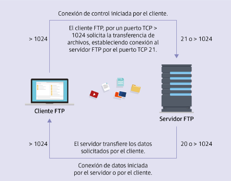
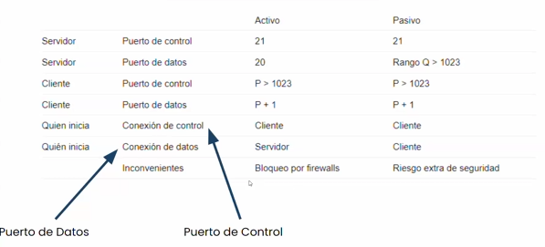
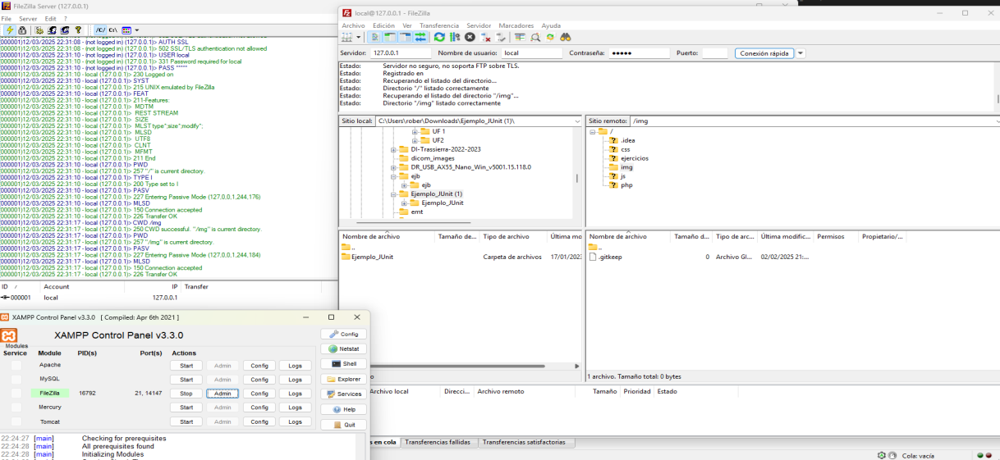

(UF1 Servidor Web y Transferencia de Archivos)
## 0. FTP (File Transfer Protocol). Concepto

La **transferencia de ficheros entre el cliente y el servidor** se realiza mediante el protocolo **FTP (File Transfer Protocol)** usándose para la **subida, modificación o descarga de archivos en Internet **o en una intranet. Este protocolo es una **transferencia más rápida** respecto a los métodos tradicionales de transmisión de archivos.

Una vez instalado y configurado este servicio de transferencias de datos en el servidor, este queda a la espera de peticiones para transferir los archivos. 

En todo momento es importante considerar la **seguridad de la información**. En el protocolo FTP se realiza sin cifrar y cualquier usuario no permitido podría visualizar la información sensible. Existen mejoras como el protocolo **FTPS que emplea el cifrado SSL/TLS.**

**Cliente FTP**: Solicita la transferencia de archivos estableciendo conexión de control al FTP por el puerto 21. El cliente indica puerto TCP > 1024 al servidor y espera la conexión del servidor (activo) o el cliente se conecta a puerto dinámico del servidor TCP > 1023, 
**Servidor FTP** Transfiere los datos solicitados por el cliente. La conexión de datos podrá ser iniciada por el servidor (modo activo) o por el  cliente (modo pasivo)



## 1. Configuración del servicio de transferencia de archivos. Permisos y cuotas

**Características**
- Emplea una arquitectura de cliente-servidor: el cliente FTP es el equipo que realiza la petición y transferencia de archivos y el servidor FTP quien ofrece los archivos.
- Es un **protocolo orientado a conexión**. Necesita establecer primero una conexión con el servidor para comenzar la transferencia de ficheros; por lo que son importantes las **credenciales**
- Su uso es **inseguro** pero también es **muy fáci**l por lo que es abundantemente utilizado.
- Se requieren de **dos puertos TCP**: Uno para el control de la conexión (21) y otro para el control de la transmisión. 
## 2. Tipos de usuarios y accesos al servicio

- **Usuarios anónimos**: Tienen acceso y permisos limitados
- **Usuarios del sistema**: Definidos por el servidor con los permisos otorgados y sobre los directorios configurados.
- **Usuarios virtuales**. Existe en ciertos servidores. Es un paso intermedio en el que, sin necesidad de ser usuarios, poseen unas credenciales para su conexión. Tienen su propia contraseña definida en un fichero de texto para su almacenamiento.

## 3. Modos de conexión del cliente

Al inicio del proceso se realiza la conexión de control a un servidor FTP abriéndose el puerto 21 en el servidor. 
La conexión de transmisión de datos a los clientes se realiza a través del otro puerto.

Según el modo de conexión podemos tener:

- **Modo activo**: El cliente inicia la conexión de control, pero el servidor abre la conexión de datos hacia el cliente. Aunque es el método original de transferencia de datos, este modo de conexión está en desuso por el aumento de la seguridad en la transferencia: puede haber problemas con los cortafuegos del cliente. 
  _Secuencia_: El cliente inicia la conexión al puerto 21 del servidor (puerto de control). El cliente solicita una transferencia de datos, le informa al servidor qué puerto (mayor a 1023) tiene abierto para recibir la conexión de datos. El servidor establece la conexión desde su puerto 20 hacia el puerto especificado por el cliente y los datos se transfieren.

- **Modo pasivo:** El cliente inicia tanto la conexión de control como la de transferencia de datos. _Secuencia_: El cliente inicia la conexión al puerto 21. El cliente solicita la transferencia de datos y el servidor abre un puerto dinámico (mayor a 1023) informando al cliente de cuál es. El cliente establece la conexión a ese puerto para realizar la transferencia de datos. 

## 4. Protocolo de transferencia de archivos seguro FTPS

El protocolo FTPS es una extensión del protocolo FTP con cifrado SSL/TLS. El tratamiento de la seguridad puede realizarse de dos formas **según cuando se inicie la conexión segura SSL/TLS**
- **Implícito o FTPS**: El cliente asume la seguridad con **SSL/TLS desde que realiza la conexión**, antes de transferir información. Se usa en estos casos un **puerto de control distinto del 21** (Por ejemplo el 990)
- **Explícito o FTPES:** El cliente **se conecta al puerto de control 21** como un FTP normal y después **cambia a un modo seguro usando TSL/SSL** para cifrar la comunicación (si el servidor lo permite). 

**Mecanismo de cifrado**
El cifrado empleado es un **cifrado asimétrico** formado por el mecanismo conjunto de clave pública y clave privada. La clave pública es conocida por otros y la clave privada solo por la maquina; interviniendo ambas en el proceso de cifrado y descifrado.
El cliente utiliza la clave pública para cifrar y luego este lo desencripta mediante la clave privada. 


¡No confundir con SFTP (Secure File Transfer Protocol) que es una funcionalidad (extensión) del propio SSH y opera en el puerto 22!. No usa múltiples conexiones (solo una) y la comunicación siempre está cifrada. 
## 5. Utilización de herramientas gráficas

- Con el **server** puede añadirse al gestor de dominio (Active Directory en Windows o LDAP en Linux) el servicio del servidor FTP. El **cliente** sería necesario para la transferencia.

- También existen herramientas en el mercado que pueden simular ser el servidor FTP y el cliente FTP (como FileZilla Server y FileZilla Client).


**Aspectos a considerar por parte del administrador del servidor**
- Debe **configurar **dirección IP** para que los clientes se conecten al servidor FTP.
- Debe **definir los usuarios** que tienen permitida la entrada y la carpeta a la que tienen acceso ya que cada usuario solo podrá acceder a su directorio.
- Debe **confeccionar una contraseña para los usuarios** (quizás luego se permita al usuario variar la contraseña y/o confeccionarlar)
- Debe **especificar la numeración de los puertos**
- Debe **elegir la carpeta sobre la que trabajará el usuario**

## 6. Utilización del servicio de transferencia de archivos desde el navegador

El navegador web también puede ejercer como cliente FTP. Para ello debe escribirse `ftp://nombredelservidorftp:puerto`. Al entrar se pedirá usuario y contraseña. 

## 7. Utilización del servicio de transferencia de archivos en el proceso de desarrollo de la aplicación web

También puede utilizarse en un lugar en el que la propia aplicación web disponga de la posibilidad de subir archivos.
A la hora de configurar dicho  sitio web tendrá que considerarse el **tiempo de espera** que puede mantenerse la conexión entre el cliente y el servidor definiendo parámetros como:
- tiempo de conexión
- tamaño máximo de subida de archivos
- tamaño máximo del archivo a subir
Será conveniente que todo este proceso quede explicado y documentado para futuras ampliaciones o mantenimientos del servicio. 

Ej.: En servicios de hosting externo se da la posibilidad de subir la página web por esta vía para que sea el propio servidor el que la cuelgue en internet.

**Algunos errores a la hora de subir datos pueden ser**
- **Al cliente se le muestra error de "Acceso denegado"**: Revisar credenciales de usuario y permisos para visualizar las carpetas
- **Al cliente FTP se le muestra que hay "Demasiadas conexiones abiertas"**: Debe revisarse que las aplicaciones abiertas no interfiera en las conexiones a realizar.
- **Revisar la posible interferencia del cortafuegos en la conexión**. 

## 7. Uso de FileZilla Server de Xampp

Tan sencillo como parece. Se levanta el FileZilla Server que tendrá puerto de control (21) y puerto de transferencia (14147).
Con FileZilla Client es posible conectarse en 127.0.0.1 Puerto 21.  Usuario local Contraseña local
En FileZilla Server queda registrada la navegación que el cliente realiza por sus directorios.



## 8. Instalación de servidor FTP en Ubuntu

Para ello es necesario instalar **vsftpd**:

```shell
sudo apt install vsftpd
```

La **configuración** debe revisarse desde el fichero `/etc/vsftpd.conf` para:
- Habilitar acceso local y subir archivos:
```
local_enable=YES
write_enable=YES
```

- Configurar permisos de archivos y directorios:
```
file_open_mode=0777
# Todos los usuarios podran acceder
```

Además se creará un usuario con permisos solo para su directorio personal:
```shell
sudo adduser usuarioftp
```

Y ya podrá verse que, situándose en el directorio en el que el cliente desee trabajar, e introduciendo en la consola:
```shell
ftp localhost
```

Será posible subir un archivo de ese directorio con:
```shell
put archivo.txt
```

Y descargarlo en ese directorio con:
```shell
get archivo.txt
```

## 9. Instalación de servidor FTP en Windows Server

**Windows Server** es un sistema operativo diseñado por Microsoft para administrar redes, aplicaciones y servicios en entornos empresariales y de servidores. Está optimizado para manejar grandes volúmenes de usuarios simultáneos, gestionar datos y ofrecer servicios críticos como hosting web, administración de bases de datos y virtualización.

**Características principales**
- **Gestión de redes:** Centraliza la administración de redes, dominios y usuarios. Tiene **Active Directory** que permite gestionar usuarios, grupos y políticas de seguridad en una red.
- **Roles de servidor**: Permite configurar roles específicos como servidor web (usando IIS, Internet Information Services) del tipo: servidor de archivos, servidor de impresión, servidor DNS, servidor DHCP...
- **Virtualización**: Tiene soporte nativo para virtualización a través de Hyper-V, plataforma de virtualización para ejecutar múltiples máquinas virtuales en un solo servidor físico.
- **Almacenamiento y compartición de archivos**: Soluciones avanzadas de almacenamiento como Storage Spaces y File Server, para gestionar y compartir archivos de forma segura en redes empresariales. 
- **Seguridad y administración centralizada**: Incluye características avanzadas de seguridad como políticas de grupo, protección avanzada contra amenazas, control de acceso basado en roles y bitlocker para cifrado de datos.
- **Alta disponibilidad**: Tiene clústeres de conmutación por error (failover clustering) que permite que los servicios continúen operando sin interrupciones como en el caso de que un servidor fallase.
- **Soporte para contenedores**: Las últimas versiones permiten usar contenedores de aplicaciones como lo que hace Docker en Linux; posibilitando despliegues eficientes y aislados.
 
**Versiones populares de Windows Server**
- **Windows Server 2012**: Fuerte integración con la nube y mejoras en virtualización.
- **Windows Server 2016**: Más soporte para contenedores y mejoras de seguridad.
- **Windows Server 2019**: Características de nube híbrida, más mejoras en contenedores y soporte para Azure.
- **Windows Server 2022**: Mejoras en seguridad, integración avanzada con Azure y soporte extendido para entornos multihíbridos y multinube.

**Usos comunes de Windows Server**
- **Gestión de dominios**: Controlar el acceso a redes empresariales a través de Active Directory
- **Servidor web**: Hospedar sitios web mediante IIS
- **Servidor de archivos**: Centralizar almacenamiento de archivos y compartirlos en red
- **Servidor de base de datos**: Usar plataformas como SQL Server para gestionar bases de datos empresariales
- **Virtualización**: Ejecutar múltiples servidores virtuales en un solo servidor físico usando Hyper-V.


### 9.1. Instalación de Windows Server en VirtualBox.

- **Descargar imagen ISO de Windows Server** (https://www.microsoft.com/es-ES/windows-server/trial)
- **Crear máquina virtual en VirtualBox**. (En Tipo: "Microsoft Windows". En Version: Si se instala Windows Server 2022, seleccionar Windows 2019)
- **Asignar memoria RAM**. Recomendable al menos 2048MB (2GB) o incluso 4GB o más.
- **Crear disco duro virtual**. Opción VDI (VirtualBox Disk Image) y almacenamiento Dinámicamente asignado. Se recomenda poner 50GB de tamaño.
- **Configurar la máquina virtual**. Asegurarse de que "Habilitar EFI" está desmarcado salvo que sea una versión que lo necesite (como Server 2022 en modo UEFI). En la pestaña Almacenamiento seleccionar la unidad de disco vacía bajo Controlador IDE y seleccionar la ISO descargada.
- **Iniciar instalación de Windows Server**. Seguir los pasos.
- **Completar instalación**. Crear cuenta de administrador. Configurar el servidor
- **Instalar Guest Additions de VirtualBox**. Para mejorar el rendimiento y ajustar la resolución. En el menú de la ventana de la máquina virtual: Dispositivos > Insertar imagen de CD de las Guest Additions.
- **Probar la instalación**

### 9.2. Activar y configurar FTP en Windows Server

**Activar FTP**
- Abrir **Administrador del servidor > Agregar roles y características > Instalación basada en características y roles**
- **Seleccionar servidor** en el que quiere instalarse el rol FTP (en nuestro caso el servidor local)
- **Agregar rol de Servidor Web (IIS)**. Si ya lo está, pasar al siguiente paso.
- **Agregar las características FTP**. Seleccionar **FTP Server**, **FTP Service**, **FTP Extensibility** en la lista de características.
- **Completar instalación**

**Configurar FTP**
- Abrir el **Administrador de Internet Information Services (IIS)**
- Crear **nuevo sitio FTP** dandole un nombre y una ruta física donde se almacenarán los archivos
- **Configurar el enlace FTP**. Seleccionar direccion IP del servidor (o 127.0.0.1 si es local), puerto 21, configurar el modo SSL según se necesite (o seleccionar Sin SSL en pruebas locales)
- **Autenticación y autorización**. Puede seleccionarse Autenticación básica y Todos los usuarios. Dar permisos de lectura y escritura.

**Ajustar permisos de la carpeta FTP**
En la carpeta: Propiedades > Seguridad y asegurarse de que el usuario o grupo que configuraste para acceder al FTP tenga los permisos adecuados (lectura y , i es necesario, escritura).

**Configurar el firewall**
Quizás sea necesario abrir el puerto 21 en **Firewall de Windows con seguridad avanzada** > **Reglas de entrada** > Puerto > TCP. Puerto específico 21. 

**Probar el servidor FTP en local**
Desde el navegador: `ftp://127.0.0.1`
Desde la línea de comandos: `ftp 127.0.0.1`
