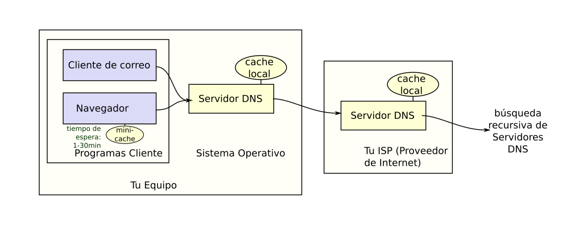
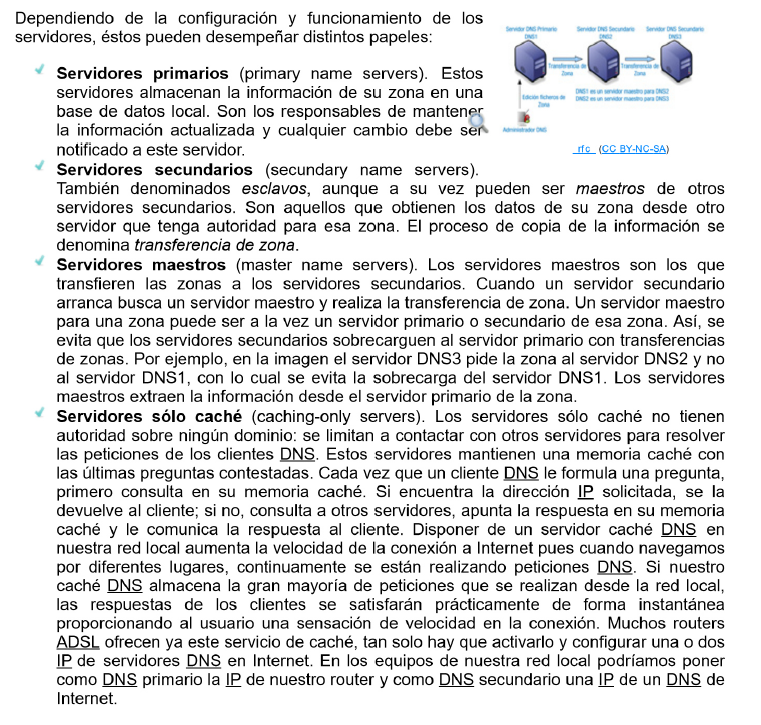

(UF3 Aplicaciones Web)
## 1. DNS. Resolución de nombres. Proceso de resolución de un nombre de dominio

El DNS (Domain Name System) es un sistema de nomenclatura jerarquico descentralizado para dispositivos conectados a redes IP. Su función más importante es la **resolución de nombres:** traducir los nombres en direcciones IP de los equipos conectados a la red.

Se trata de un servicio cliente/servidor aunque se diferencia de otros en que estos se ejecutan por sí mismos sin necesidad de una aplicación exterior. 

Normalmente el proveedor de internet proporciona direcciones para usar sus servidores DNS. Cuando una aplicación pide conectarse con un dispositivo remoto por nombre, el cliente DNS solicitante manda una petición a uno de los servidores DNS para resolverla. 

El servidor DNS usa una base de datos distribuida y **jerárquica**. Si consideramos una URL `http://www.google.es` se ve que los puntos separan dominios y subdominios comenzando desde derecha a izquierda (dominios de primer, segundo, tercer nivel,...):
- `.es`: Dominio de primer nivel. Servidor español.
- `google`: Subdominio. Dominio de segundo nivel bajo `.es`
- `www`:  Subdominio. Dominio de tercer nivel que identifica el equipo donde está catalogada la página web. Es el dominio www que el servidor DNS redirecciona a la IP del servidor web.
Por su parte `http://` es el protocolo que permite la visualización en el navegador.

Los dominios deben cumplir los siguientes requisitos:
- Solo estar compuestos  de letras, números y guiones
- No empezar y terminar en guiones
- Tener menos de 63 caracteres y tener más de uno o dos (según el dominio de primer nivel)

### 1.1. Funcionamiento del servicio DNS

1. El navegador solicita "[www.midominio.com](http://www.midominio.com)".
2. El sistema operativo consulta primero el archivo `hosts` en busca de una entrada correspondiente.
    - Si se encuentra una entrada como **"192.168.1.10 [www.midominio.com](http://www.midominio.com)"**, el sistema utiliza esa IP.
3. Si no se encuentra una entrada en el archivo `hosts`, el sistema realiza una consulta al **servidor DNS** configurado (por ejemplo, el servidor DNS de tu proveedor de Internet o uno público como Google DNS o Cloudflare DNS). Si lo tiene cacheado, responde con la IP. Si no, comienza su consulta a los DNS. 
4. **Raíz del DNS (Root DNS Server)**. Los servidores root están en la parte más alta de la jerarquía DNS. Existen 13 servidores root DNS distribuidos globalmente. No conocen la IP pero saben qué servidores tienen la autoridad para resolver los dominios de primer nivel (.com, .org, net).  ("No sé quien es www.midominio.com pero te diré qué servidor sabe resolver dominios.com" --> Redirecciona a servidor TLD)
5. **Servidor TLD (Top-Level Domain server)**. Gestiona dominios de primer nivel (.com, .org, .net). Ante la consulta de www.dominio.com el servidor TLD responde con la dirección de servidores authorizative para ese dominio
6. **Servidores Autoritarios (Authorizative DNS servers)**: Tienen la información definitivba del dominio. Almacenan los registros DNS (como registro A que asocia el dominio con una IP), este responde con la dirección IP de www.midominio.com.


```css
[Tu navegador] ---> [Resolver DNS] ---> [Root DNS Servers] ---> [TLD DNS Servers (.com, .org, etc.)] ---> [Authoritative DNS Servers] ---> [IP Address]
```

Los **registros DNS** son entradas dentro de los servidores autoritativos que proporcionan la información sobre cómo traducir un dominio a una IP. Los más comunes son:

- **Registro A**: Asocia un dominio con una dirección IP (para sitios web).
- **Registro MX**: Asocia un dominio con servidores de correo electrónico.
- **Registro CNAME**: Permite alias en los dominios.
- **Registro NS**: Indica qué servidores DNS son responsables de un dominio.

---




### 1.2. Información sobre DNS

Se tienen los comandos:
- **nslookup**: Obtención de direcciones IP asociadas a un nombre DNS. (Rápida)
- **dig**: Obtención de direcciones IP asociada sa un nombre DNS. (Detallada)
- **dig @8.8.4.4** Obtener direcciones IP asociadas a un nombre DNS preguntando a un servidor concreto (8.8.4.4)
- **dig -x**: Obtener nombres de dominio asociados a una dirección IP

`nslookup` (Consultas rápidas de DNS) y `dig` (Consultas más detalladas. )

```shell
nslookup www.elhuevodechocolate.com
Server:         10.255.255.254
Address:        10.255.255.254#53

Non-authoritative answer:
www.elhuevodechocolate.com      canonical name = elhuevodechocolate.com.
Name:   elhuevodechocolate.com
Address: 46.231.5.42
```

- **Server**: El servidor DNS que se utilizó para resolver la consulta fue **`10.255.255.254`**. Este es el servidor DNS que respondió a la consulta.
- **Address**: La dirección IP del servidor DNS es **`10.255.255.254`**, y está utilizando el puerto **53** (que es el puerto estándar para consultas DNS).

- **Non-authoritative answer**: Esta parte significa que la respuesta proviene de un servidor DNS que no es el **servidor autoritativo** para el dominio. Es decir, el servidor DNS consultado (en este caso **`10.255.255.254`**) no es el que tiene la autoridad final sobre la zona de **`elhuevodechocolate.com`**, sino que tiene esta información en caché (o la ha obtenido de otro servidor).
- Si fuera una **respuesta autoritativa**, el resultado habría sido etiquetado como **"authoritative answer"**. Esto indica que la respuesta fue directamente obtenida del servidor DNS que tiene la autoridad sobre ese dominio.
- El **nombre** final resuelto es **`elhuevodechocolate.com`**, que es el dominio real al que apunta el alias **`www.elhuevodechocolate.com`**.
- La **dirección IP** correspondiente a **`elhuevodechocolate.com`** (y, por lo tanto, también a **`www.elhuevodechocolate.com`**) es **`46.231.5.42`**.


```shell
~$ dig www.elhuevodechocolate.com

; <<>> DiG 9.18.18-0ubuntu0.22.04.1-Ubuntu <<>> www.elhuevodechocolate.com
;; global options: +cmd
;; Got answer:
;; ->>HEADER<<- opcode: QUERY, status: NOERROR, id: 55266
;; flags: qr rd ra; QUERY: 1, ANSWER: 2, AUTHORITY: 0, ADDITIONAL: 1

;; OPT PSEUDOSECTION:
; EDNS: version: 0, flags:; udp: 512
;; QUESTION SECTION:
;www.elhuevodechocolate.com.    IN      A

;; ANSWER SECTION:
www.elhuevodechocolate.com. 14400 IN    CNAME   elhuevodechocolate.com.
elhuevodechocolate.com. 14400   IN      A       46.231.5.42

;; Query time: 150 msec
;; SERVER: 10.255.255.254#53(10.255.255.254) (UDP)
;; WHEN: Thu Mar 13 00:15:38 CET 2025
;; MSG SIZE  rcvd: 85
```

- **status: NOERROR**: Esto significa que la consulta se resolvió correctamente sin errores.
    
- **flags: qr rd ra**: Estas son banderas que indican el tipo de respuesta.
    - **qr**: Respuesta de consulta (es una respuesta a una consulta).
    - **rd**: Recursión solicitada (significa que se hizo una consulta recursiva).
    - **ra**: Recursión disponible (indica que el servidor DNS puede realizar consultas recursivas).
- **QUERY: 1**: Se hizo una consulta.
    
- **ANSWER: 2**: Hubo dos respuestas en la sección de respuesta.
    
- **AUTHORITY: 0**: No hay servidores de autoridad especificados en la respuesta (no hay una sección de autoridad).
    
- **ADDITIONAL: 1**: Hay una sección adicional de datos.

- La consulta que se realizó: `www.elhuevodechocolate.com` con el tipo de registro **A** (dirección IP).

- Esta es la respuesta que se obtuvo:
1. **CNAME (Canonical Name)**:
    - **`www.elhuevodechocolate.com. 14400 IN CNAME elhuevodechocolate.com.`**
    - Esto significa que **`www.elhuevodechocolate.com`** es un alias (un CNAME) para **`elhuevodechocolate.com`**. En otras palabras, cuando consultas `www.elhuevodechocolate.com`, el DNS te dice que debes mirar a `elhuevodechocolate.com` para obtener la dirección IP.
2. **A (Address Record)**:
    - **`elhuevodechocolate.com. 14400 IN A 46.231.5.42`**
    - Esto indica que **`elhuevodechocolate.com`** se resuelve a la dirección IP **46.231.5.42**.

**Instalación en Windows Server**

En Inicio > Administrador del Servidor > Agregar funciones > Servidor DNS > Instalar. 

Se muestra un resumen de funciones al finalizar el proceso y en la parte izquierda aparecve un enlace para el servidor DNS.

Se inicia un terminal, ejecutando el comando `netstat -a -n` y se comprueba que el servidor está a la escucha en puertos **53 TCP** y **UDP**.

En Inicio > Herramientas Administrativas se crea una entrada DNS que permitirá acceder a la consola del servidor y una excepción en el firewall de Windows para el servidor DNS.

**Configuración**

Por defecto, el servidor solo se habrá configurado como caché respondiendo a consultas recursivas. 

Para comprobar que el DNS resuelve correctamente, configurar el cliente para que use el servidor DNS instalado en la máquina local usando 127.0.0.1.

## 2. Parámetros de configuración y registros del servidor de nombres afectados en el desarrollo

Se quiere configurar el DNS anterior para funcionar como primario y dar servicio de forma local.
El servidor funcionará como maestro usando el dominio `dawXX.net` sin permitir actualizaciones dinámicas y será `servidorwXX.dawXX.net`.

Se pueden configurar nombres de dominio como:
`desarrollw7XX.dawXX.net` asociado a IP 192.168.1.X6
Se pueden configurar también algunos alias:
`ns.dawXX.net` alias de `servidorw2019XX.daeXX.net`

Para configurar un sufijo en el servidor NSN se inicia como administrador, configuración avanzada, nombre de equipo, cambiar, más y en Sufijo DNS principal se introduce `dawXX.net`.

**Configuración de la zona de resolución directa**

La **zona de resolución directa** es un término que se usa en sistemas de nombres de dominio (DNS). Se refiere a la base de datos donde se almacenan los nombres de dominio y sus direcciones IP correspondientes, permitiendo la traducción de nombres de dominio legibles por humanos (como _google.com_) en direcciones IP (como _142.250.190.14_).

En un servidor DNS, la zona de resolución directa es responsable de convertir los nombres de dominio en direcciones IP, mientras que la **zona de resolución inversa** hace lo contrario: traduce direcciones IP en nombres de dominio.

----

Se iniciará sesión en el servidor como administrador. Se accede a la consola DNS desde Inicio > Herramientas administrativas > DNS. Zonas de búsqueda directa > Zona nueva.

Se selecciona Zona principal y se introduce "dawXX.net" como nombre de la zona. Se deja seleccionada la opción Crear un archivo nuevo con este nombre y se deja el nombre por defecto.
Se elige la opción No admitir actualizaciones dinámicas.
Se crea entrada en Zonas de búsqueda directa con el nombre de la zona (dawXX.net)
Al pinchar sobre esa zona, se abre consola de recursos creados automáticamente: Zona de registro SOA y registro NS.
Lo registros A se hace clic sobre la zona dawXX.net y se selecciona Host nuevo introduciendo el nombre y la IP y, si estuviese creada una zona de resolución inversa podríamos marcar la opción Crear registro del puntero (PTR) asociado.

**Comprobar la configuración**

Para comprobar la configuración se usará el comando `ns-lookup` resolviendo las consultas sobre nombres de la zona `dawXX.net`

## 3. Servicios de directorios. Características y funcionalidad

Los **directorios** permiten localizar información definiendo también qué tipo de información almacenan y de qué forma. 

**Problemas habituales de los directorios físicos** (xdddddd)
- Son **estáticos e inflexibles**. La información impresa no puede ser actualizada.
- Son **inseguros**. Difícil controlar quién accede a la información.

Los **directorios digitales** permiten:
- **Encontrar información** de forma fácil
- **Gestionar información** de forma eficaz e instantánea
- **Controlar seguridad en el acceso a la información**

Los directorios se diferencian del servicio DNS en que:
- **No realizan una acción concreta**
- Su **información no es fija** (los DNS sí tienen estructura fija)
- **Permiten actualizaciones** (DNS no)
- **Usan protocolo UDP** (DNS usa TCP)

**Organización del directorio LDAP**

El **servicio de directorio** puede ser:
- **Centralizado**: Un servidor ofrece todo el servicio de directorios, respondiendo a todas las consultas.
- **Distribuido**: Varios servidores dan el servicio de directorio. Los datos son fraccionados y/o duplicados.

El directorio LDAP presenta una estructura **en forma de árbol** llamada **DIT**. Cada entrada describe un objeto. A la ruta completa a una entrada se la llama **DN** y las partes más pequeñas **RDN**.

Un **esquema** define qué tipo de objetos se pueden almacenar, qué atributos podrá contener, cuáles son opcionales y el formato de dichos atributos. 

Una **clase objeto** (objectclass) es una descripción general de un tipo de objeto. Todos los objetos deberán tener un atributo objectclass. Los valores de los atributos los pueden cambiar los clientes pero no pueden eliminar el atributo. 
Hay dos tipos de objetos: 
- **contenedor**: contienen otros objetos. Ej.: El directorio "root"
- **hoja**: está al final de una rama y carece de objetos subordinados

- root
- dc (domainComponent)
- c (country)
- o (organization)

![[MODULOS_ESPECIFICOS_DAW/DESPLIEGUE_APLICACIONES_WEB/resources/ud04-2.png]]

## 4. Archivos básicos de configuración. Interpretación y uso

En el servidor debe existir una herramienta para administrar los servicios, **servicio directorio**.
Resulta fundamental para desplegar nuevas aplicaciones basadas entre las distintas aplicaciones ya instaladas y el servicio de directorios.

Este servicio de directorios puede actuar como aplicación para la autenticación de usuario, proveedor del servicio dhcp o gestor del dominio,...
En Linux este gestor se llama LDAP (uno de ellos es Open LDAP)

La herramienta se lleva a cabo mediante un usuario root y es necesario tener configurada una IP al servidor junto con un nombre del equipo.

Primero se deben actualizar los paquetes del repositorio de Ubuntu referentes al sistema y a Open LDAP.
En la instalación, incluir la solicitud de una contraseña de administración que servirá para la configuración del paso siguiente.
Seguidamente, se puede seguir con el proceso de configuración en el que se incluye toda la configuración del servidor en un directorio base (enconfig, sidap.conf en anteriores versiones), teniendo como ventaja que las modificaciones futuras no necesitan reiniciar el servicio. 

En el directorio base pueden encontrarse cuatro esquemas instalados por defecto. El árbol completo del servicio de directorios LDAP se genera a partir de estos esquemas, donde se definen árboles de clases y atributos permitidos para la organizacón del dominio. 

Una vez configurado el servicio debe comprobarse el estado mediante el  comando `service` con opciones `start` (arrancar), `stop` (apagar), `restart` (reiniciar)

## 5. Adaptación de la configuración del servidor de directorios para el desarrollo de la aplicación. Usuarios centralizados

La administración de usuarios y grupos con el servicio de directorios LDAP se hace mediante el paquete **ldapscripts**.
```
sudo apt-get install ldapscripts
```

Debe editarse el fichero de configuración del paquete para personalizarlo conforme a las necesidades. 
Al finalizar la instalación, se introduce contraseña para conectarse al servidor LDAP (esta contraseña se introduce en `ldapscripts.passwd`).

Por el uso de comandos se crearán, modificarán y borrarán tanto usuarios como grupos.

También se puede optar por la creación de usuarios por lotes. Esto se realizará subiendo en un archivo de texto una serie de usuarios para automatizar más fácilmente la creación en el servicio de directorios. 