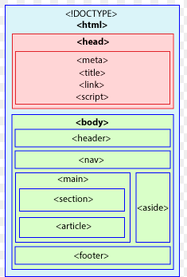
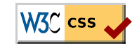
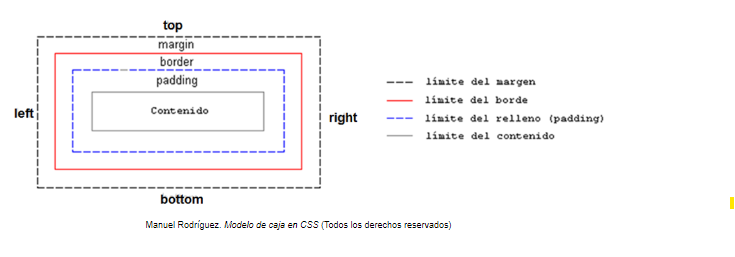
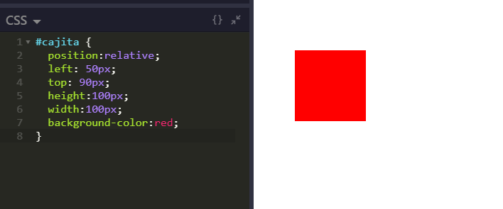
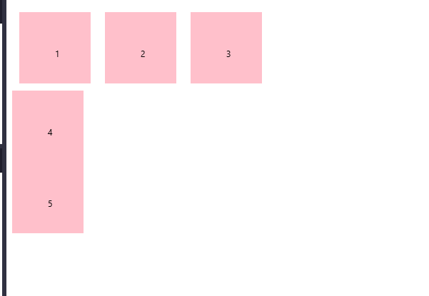

## 0. CSS. Definición.

Las **hojas de estilo en cascada** (**CSS, Cascading Style Sheets**) son la parte del diseño de las aplicaciones web.

- Permiten **ahorrar tiempo** a la hora de diseñar webs
- Consiguen **efectos potentes** que **la gran mayoría de navegadores soportan**
- Permiten **separar el contenido (información) del diseño (apariencia)**, mejorando el **mantenimiento**. En la etiqueta `<body>` del HTML se define la estructura HTML y en el `<head>` o en un archivo externo se define la apariencia.
- Se produce la **adaptación de los sitios web para diferentes dispositivos** (comportamiento **reponsive**)

CSS es desarrollado por el World Wide Web Consortium (W3C). Participan en él casi todas las empresas relacionadas con internet (Appler, Adobe, Akamai, Cisco, Google, Facebook, HP, Intel, LG, Microsoft, Twitter...)
Hay muchos grupos de trabajo (WHATWG, CSSWG, AGWG, WOTWG)

Los niveles de CSS son los siguientes:

| Nivel      | Año    | Descripción                                               |
| ---------- | ------ | --------------------------------------------------------- |
| **CSS1**   | `1996` | Propiedades para tipografías, colores, alineación, etc... |
| **CSS2**   | `1998` | Propiedades de posicionamiento, tipos de medios, etc...   |
| **CSS2.1** | `2005` | Corrige errores de CSS2 y modifica ciertas propiedades    |
| **CSS3**   | `2011` | Características de CSS como módulos independientes        |
Los módulos van evolucionando independientemente. Por ejemplo el módulo Flexbox está en nivel 1, el módulo de Grid en nivel 2, el módulo de características de texto en nivel 3.
Recientemente se está volviendo a implementar la idea de volver al versionado general de CSS (CSS4, CSS5,...). En sí el término CSS4 no se usa porque CSS pasó a ser modular desde CSS3 (se han ido agregando características gradualmente después de CSS3). 

Después de CSS3, se han creado y actualizado varios módulos independientes que han sido parte del desarrollo continuo de CSS. Algunos de los más importantes incluyen:

- **CSS Grid Layout**: Introduce un sistema de diseño en dos dimensiones.
- **CSS Flexbox**: Permite diseños flexibles y más control sobre la distribución de los elementos en una página.
- **CSS Variables**: Añade la capacidad de utilizar variables dentro de los estilos CSS.
- **CSS Transitions y Animations**: Añade efectos de transición y animaciones a los elementos HTML.
- **CSS Custom Properties**: Permiten a los desarrolladores usar variables en CSS, facilitando la reutilización de valores.

Las actuales especificaciones pueden ser consultadas en: w3.org/TR/css-2024
##### 0.1. Prefijos CSS de navegador  - Vendor prefixes (obsoleto)
Si las propiedades tienen un comportamiento diferente según el navegador, puede hacerse referencia por separado con los prefijos 
```
propiedad: /* Especificacion OFICIAL. Si no tiene soporte completo ignora la propiedad */
-webkit-propiedad: /* Chrome antiguo / Safari (Motor webkit)*/
-moz-propiedad: /* Firefox antiguo (Motor Gecko)*/
-ms-propiedad: /* Internet Explorer (Motor Trident) */
-o-propiedad: /* OPERA antiguo (Motor Presto) */
```
Autoprefixer (plugin de PostCSS) añade de forma automática los prefijos basándose en información como de CanIUse
##### 0.2. Flags CSS de navegador (lo que se lleva ahora)
Habilitar las funciones experimentales desde una ventana del navegador (avisa de que son inestables)

## 1. Estilos en línea basados en etiquetas, en clases y en identificadores

Las hojas de estilo CSS están formadas por **reglas**: pares de atributo:valor.

- **Atributo** son las características que se pretenden modificar del selector; es la característica a definir a partir de los valores posibles. El **valor** hace referencia a la instancia del atributo.

- La referencia al selector se hace sin llaves. La declaración atributo:valor sí debe estar entre llaves. 

- Los comentarios se escriben con `/* */`.

Consejos:
- Escribe una regla por línea
- Usa la identación
- Aconsejado escribir el último ; aunque sea opcional para evitar descuidos

A la hora de definir una regla debe considerarse sobre qué **selector** se va a aplicar (Elemento o elementos del documento seleccionados para aplicarles la regla)

Por ejemplo: Se define una regla que selecciona todas las etiquetas `<p>` del documento HTML y se les aplica la propiedad de cambiar su contenido a rojo:
```css
p {
	color: red
}
```

Vamos a considerar:
- El **selector basado en etiquetas**
- El **selector basado en clases**
- El **selector basado en identificadores**



### 1.0. Selector universal (No lo mencionan los apuntes)

Selecciona todos los elementos del HTM. Útil para poner estilos generales (fuentes, separaciones,...)

```css
*{
	font-family: Verdana, Geneva, Tahoma, sans-serif;
	margin:0px;
	padding:0px;
 }
```

`font-family` tiene varias fuentes porque si no coge una será otra. 
`margin` Margen exterior
`padding` Margen interior
`text-decoration` Quita la decoración de link por ejemplo si está a `none`

### 1.1. Selector de etiqueta

Selecciona un elemento con etiqueta concreta (`h1` , `div`, `h2`)
Es posible aplicarlo a cualquier etiqueta que se encuentre dentro del contenido HTML. Si se define mal una sintaxis, el navegador omitirá la declaración y continuará con la siguiente independientemente de si el error afecta a toda la propiedad, a un valor concreto o a toda la descripción.

Podemos definir **selectores con un atributo**:

```css
h1 {
	color: blue;
}
```

Podemos definir **selectores con varios atributos**: 
```css
 h1{
    color: white;
    font-size: 50px;
    padding:10px;
    background: red;
}

a{
    font-size: 18px;
    color: green;
    text-decoration: none;
}
```

Podemos definir **atributos para varios selectores**
```css
h1, h2 {
	color: blue;
}
```

### 1.2. Selector de clase

Permiten definir un estilo directamente asociado al atributo `class` indicado en una etiqueta HTML. 
Pueden definirse:
- **Clases genéricas aplicadas a cualquier etiqueta**. (Cualquier elemento de la página con dicha clase lo podrá tener)
- **Clases asociadas directamente a una etiqueta HTML**. (Se restringe para que solo dichas etiquetas con dicha clase lo puedan aplicar)

```css
h1.miClase {
	color: blue
}

miClase {
	color: red
}
```

(miClase de h1 será prioritaria en el h1)

### 1.3. Selector de id

Para seleccionar por id (como en el caso `<div id="descripcion"`) se usa la `#`. Solo pueden ser empleados por un único elemento. 

```css
#descripcion{
    border: 5px solid black;
    padding: 15px;
}
```
Solo puede haber un id en la página

---
**Etiquetas** 
**Clases**: Aplicar un estilo a uno o más elementos
**Identificadores**: Aplicar estilo con exclusividad (Ej.: Bloques o secciones principales de una página como cabecera, contenido, pie o definir un enlace hacia un elemento de la página)

---

### 1.4. Agrupación de selectores

Es buena práctica agrupar selectores o anidarlos para conseguir un fichero CSS más optimizado, concreto y definido en el que se puedan detectar antes posibles errores y solucionarlos más fácilmente. 

La agrupación se realizará separando los selectores mediante comas.

**Aplicación del mismo estilo a un conjunto de selectores**
```css
h1, p, h2 {
	font-family: Verdana
}

.color1, .color2, .color3 {
	font-family: Verdana
}

#cabecera, #contenido, #piepagina {
	font-family: Verdana
}

#cabecera, h1, .color1 {
	font-family: Verdana
}
```


### 1.5. Anidamiento de selectores

Permiten **aplicar un estilo a un elemento dependiendo de los elementos de su alrededor**. Esto posibilita conseguir un estilo más definido y concreto.

### 1.5.1. Selector anidado común

Se aplica **sobre elementos que se encuentran en el interior de otros elementos**. Entre los selectores hay **un espacio en blanco**

```css
h1 b {
	color: blue
}
```

### 1.5.2. Selector hijo anidado

Se aplica para **restringir y que solamente aplique sobre el selector hijo anidado y no sobre el resto de selectores subanidados**

```css
h1 > b {
	color: blue
}
```

---
¡Ojito!  Los selectores no es necesario que sean etiquetas. Pueden ser identificadores, clases,... pudiendo llegar a tener selecciones más complejas. 

```css
div > .mi-clase {
  color: blue;
}

div > #mi-id {
  font-size: 20px;
}

.contenedor > p {
  color: red;
}

#seccion > div {
  background: yellow;
}

ul.lista > li.item {
  font-weight: bold;
}

[aria-expanded="true"] > [data-visible="true"] {
  display: block;
}
```

### 1.6. Atributos

- **`[atributo]`** Selecciona los elementos que tienen ese mismo atributo, sin importar su valor.
- **`[atributo = valor]`** Selecciona los elementos que tienen ese mismo atributo con el valor que se le pasa
- **`[atributo -= valor]`** Selecciona los elementos que tienen ese mismo atributo con al menos un valor igual al especificado
- **`[atributo |= valor]`** Selecciona los elementos que tienen ese mismo atributo y la palabra debe comenzar por el valor que se le pasa (o está seguido de un guion). Ej.: `[class|="menu"]` se aplica a `menu`, `menu-item`  pero no a `menuitem
-  **`[atributo ^= valor]`**  Selecciona los elementos cuyo atributo comienza con un valor especifico. 
-  **`[atributo $= valor]`**  Selecciona los elementos cuyo atributo termina con un valor especifico. 
- **`[atributo *= valor]`**  Selecciona los elementos cuyo atributo contiene el valor en cualquier parte

```css
input[required] {
  border: 2px solid red;
}

input[type="text"] {
  background-color: lightgray;
}

div[class~="destacado"] {
  font-weight: bold;
}

[class|="menu"] {
  color: blue;
}

/* No vienen en el temario */
a[href^="https"] {
  color: green;
}

img[src$=".png"] {
  border: 1px solid black;
}

p[class*="warning"] {
  color: red;
}

```
### 1.7. Pseudoclases

Permiten **seleccionar elementos según las indicaciones del usuario**, **aplicando estilos a un elemento en un ESTADO específico**. Se escriben con `:`. 

- `:link` Enlaces no visitados aún
- `:visited` Enlaces visitados al menos una vez
- `:hover` Cuando el usuario pasa el cursor sobre un elemento
- `:active` Elementos que se activan
- `:focus`  Elementos que reciben el foco
- `:checked` Cuando un checkbox o radio está seleccionado
- `:disabled` Cuando un campo está deshabilitado
- `:enabled` Cuando un campo está habilitado
- `:required` Cuando un campo input tiene atributo `required`
- `:read-only` Cuando un campo de entrada es de solo lectura

**`:first-child`** → Selecciona el primer hijo de su padre.  
**`:last-child`** → Selecciona el último hijo de su padre.  
**`:nth-child(n)`** → Selecciona el enésimo hijo de su padre.  
**`:nth-last-child(n)`** → Igual a `nth-child`, pero desde el final.  
**`:only-child`** → Selecciona un elemento si es el único hijo.  
**`:first-of-type`** → Selecciona el primer hijo de un tipo específico.  
**`:last-of-type`** → Selecciona el último hijo de un tipo específico.  
**`:nth-of-type(n)`** → Selecciona el enésimo hijo de un tipo específico.

**`:not(selector)`** → Selecciona todo excepto lo que coincida con el selector.
**`:is(selector, selector)`** → Agrupa selectores y simplifica reglas.  
**`:where(selector, selector)`** → Como `:is`, pero sin especificidad.  
**`:has(selector)`** → Selecciona un elemento que contenga otro elemento específico (CSS4).

Ejemplos:
```css
/* Cambia el color del texto cuando el mouse pasa sobre un enlace */
a:hover {
  color: red;
}

/* Resalta el fondo del input cuando recibe el foco */
input:focus {
  background-color: yellow;
}

/* Estiliza los enlaces ya visitados */
a:visited {
  color: purple;
}

/* Cambia el color del botón cuando es presionado */
button:active {
  background-color: orange;
}

/* Estiliza los checkboxes que están seleccionados */
input:checked {
  box-shadow: 0 0 5px green;
}

/* Aplica estilos a campos de entrada deshabilitados */
input:disabled {
  opacity: 0.5;
}

/* Estiliza el primer hijo de un contenedor */
p:first-child {
  font-weight: bold;
}

/* Estiliza el último hijo de un contenedor */
p:last-child {
  color: blue;
}

/* Estiliza los elementos en posición impar dentro de su contenedor */
li:nth-child(odd) {
  background-color: lightgray;
}

/* Aplica estilos a los elementos que no tienen la clase 'especial' */
p:not(.especial) {
  color: gray;
}

/* Estiliza un artículo si contiene una imagen dentro */
article:has(img) {
  border: 2px solid red;
}
```
### 1.8. Pseudoelementos

Permiten **dar estilo a partes específicas del CONTENIDO de un elemento**. Se escriben con `::`
- `::first-line` Primera línea de un texto
- `::first-letter` Primera letra de un texto
- `::before` Texto antes del contenido de un elemento
- `::after` Texto después del contenido de un elemento

Ejemplos:
```css
/* Cambia el color de la primera letra de cada parrafo a rojo*/
p::first-letter {color:red;}
/* Cambia el color de la primera línea de cada parrafo a azul*/
p::first-line {color: blue;}
/* Agrega un punto después de cada encabezado*/
h1::after {content:".";}
/* Agrega texto Ejemplo de antes de cada encabezado*/
h1::before {content:"Ejemplo de ";}
```

Si te aburres aquí hay más...
- `::placeholder` Texto del marcador de entrada en inputs
- `::selection` Texto seleccionado por el usuario
- `::marker` Marcadores de listas `<li>`
- `::backdrop` Fondo de elementos en pantalla completa `fullscreen`
- `::cue` Subtítulos `<track>` en vídeos
- `::file-selector-button` Botón de selección en `input type="file">`

```css
/* Cambia el color de la primera letra de un párrafo */
p::first-letter {
  color: red;
  font-size: 2em;
}

/* Aplica estilos a la primera línea de un párrafo */
p::first-line {
  font-weight: bold;
}

/* Agrega contenido antes de un encabezado */
h1::before {
  content: "🔥 ";
}

/* Agrega contenido después de un encabezado */
h1::after {
  content: " ✨";
}

/* Estiliza el texto que el usuario selecciona */
::selection {
  background: yellow;
  color: black;
}

/* Cambia el color del texto del placeholder en los inputs */
input::placeholder {
  color: gray;
  font-style: italic;
}

/* Estiliza los marcadores de listas (<li>) */
li::marker {
  color: red;
  font-size: 1.2em;
}
```

## 2. Crear y vincular hojas de estilo

##### A. CSS externo
Los estilos están situados en un archivo externo al documento, recibiendo el nombre de hoja de estilos. Para poder hacer referencia se debe incluir un enlace `<link>` y las propiedades que se definan en esta hoja se aplican a todos los documentos que hagan rweferencia a ella. 

##### A.1. Mediante enlaces
El enlace con el CSS externo es tal que así: 
```html
<link rel="stylesheet" href="style.css" />
```

Sus atributos pueden ser 
- `rel`: indica el tipo de relación
- `type` (opcional): `type="text/css"` pero ya no es necesario en HTML5
- `href`: URL (puede ser relativa o absoluta, referenciar a algo interno o externo)
- `media` (opcional): medio en el que se aplicarán los estilos CSS

Es la técnica recomendada para que el CSS pueda ser reutilizable y enlazarlo con más documentos HTML.
(Aconsejado escribirlo lo antes posible, sobre todo antes de los scripts, obligando al navegador a aplicar estilos cuanto antes y a que la página no se vea en blanco)

##### A.2. Mediante importación del fichero CSS
Puede obtenerse el mismo resultado usando el elemento `<style>` en lugar de `<link>`
Se hace con la regla `@import "direccionurl"`   (Con comillas simples o dobles, pasando la URL del archivo. 
También vale `@import url("direccionurl")`

La regla import se evalúa en el navegador al cargar la página (cada regla es petición al servidor para cargar el .css). Herramientas como Sass, PostCSS, LightningCSS tienen mecanismos para realizar imports de forma anticipada y generar un solo fichero con todo el código CSS para que el navegador haga menos peticiones.

```html
<head>
	<title></title>
	<style>@import 'formatos.css';</style>
</head>
```


Tenemos añadidos interesantes: 
- **Con media query**: `@import url("mobile.css") (with <= 640px);`  o `@import url("mobile.css) print`  (Si se está imprimiendo la página actual).
- **Si soporta la condición**: `@import url("mobile.css") supports(not (display: grid));`
- **Colocándolo en una capa virtual de CSS** (mantener aislados los estilos de un framework sin usar `!importat` o reescribir selectores para forzarlos) `@import url("mobile.css") layer(framework)`
- **Colocándolo en nueva capa anónima**:  `@import url("mobile.css") layer()`

##### B. CSS interno. Incluir CSS en el documento HTML: Bloque de estilos en el `<head>`

Afecta globalmente a los elementos de esa misma página.
```html
<!DOCTYPE html>
<html>
  <head>
    <title>Título de la página</title>
    <style>
      div {
        background: hotpink;
        color: white;
      }
    </style>
  </head>
  ...
</html>
```

##### C. CSS en línea. Incluir CSS en el elemento HTML: Estilos en línea con etiqueta `<style>`

Afecta únicamente a este elemento.
```html
<p>¡Hola <span style="color: red; padding: 8px">amigo lector</span>!</p>
```

##### En caso de conflicto entre estilos
Es posible que una misma propiedad esté situada en diferentes sitios y, si no entran en conflicto, el navegador aplicará todos los estilos.
Ej.: En un lugar se define el color de fondo y en otro un tamaño de letra -> Se aplican los dos.

Si entran en conflicto se aplica el siguiente orden de preferencia:
1. Estilos en línea
2. Estilos internos
3. Estilos externos

Así el estilo en línea tiene la máxima prioridad y, al aplicarlo sobre un elemento, anula los demás.

En caso de que se intente aplicar un estilo diferente al mismo elemento en el mismo lugar se aplicará la **última regla indicada**.

Si se le quiere dar prioridad a una instrucción y que las siguientes no puedan modificarla se usará la palabra reservada **!important** 

```css
p {
	background-color: red !important;
}
```

## 3. Herramientas y tests de verificación

Para que los desarrolladores puedan comprobar que los estilos cumplen el estándar, el consorcio de estándares web (W3C) da herramientas para validar tanto el código HTML como las hojas de estilos CSS para comprobar si son correctas:
https://jigsaw.w3.org/css-validator/

Si en el proceso de validación no se encuentra ningún error puede incluirse un icono en la web por el que los visitantes pueden observar que los desarrolladores se han preocupado a la hora de desarrollar un sitio web interoperable y acorde con los estándares. 


## 4. Guía de estilo

Las **guías de estilo** que ayudan a diseñadores y desarrolladores a tomar decisiones en los aspectos relacionados con el diseño web también detallan la implementación de las clases CSS y la forma en la que se han desarrollado. 

## 5. Algunos conceptillos extra...

- **Tailwind CSS**: Es un framework de CSS utilitario, lo que significa que ofrece clases predefinidas para que puedas diseñar rápidamente sin tener que escribir tu propio CSS. Cada clase tiene una sola responsabilidad (como `bg-blue-500` para un fondo azul).
    
- **Bootstrap**: Es uno de los frameworks más populares de CSS y JavaScript. Incluye una colección de componentes predefinidos como botones, menús, y formularios que te permiten crear interfaces web rápidamente y de manera responsiva.
    
- **W3.CSS**: Es un framework de CSS creado por W3Schools. Es ligero, fácil de usar y no depende de JavaScript. Permite crear diseños responsivos y estilos simples para páginas web sin complicaciones.
    
- **Astro**: Es un generador de sitios estáticos que permite crear aplicaciones web rápidas y modernas. Su principal ventaja es que puede trabajar con cualquier framework de frontend (como React, Vue o Svelte) y permite renderizar solo el contenido necesario en el servidor.
    
- **SASS (Syntactically Awesome Stylesheets)**: Es un preprocesador de CSS que añade funcionalidades extra al CSS, como variables, anidamiento, mixins y herencia. Hace que escribir y gestionar CSS sea más fácil y limpio.
    
- **LESS**: Es otro preprocesador de CSS, similar a SASS. Permite usar variables, operaciones matemáticas y funciones, lo que facilita la escritura y mantenimiento de CSS, especialmente en proyectos grandes.


- Gradientes o degradados
- Cascada y herencia
- Reglas CSS
- Representación de datos
- Interacciones
-  Sombras
- Efectos
- Máscaras y recortes
- Responsive web design
- Animaciones CSS
- Transformaciones 2D/3D
-  Dibujar con CSS
- Calidad de código
- Funciones CSS

## 6. Repaso de CSS 

Para aprenderlo bien, aquí está este curso de Victor Robles https://www.udemy.com/course/master-en-css-responsive-sass-flexbox-grid-y-boostrap-4 .

Una buena extensión para practicar es WebMaker. 

### 6.1. Colores CSS

El **COLOR** puede expresarse
En el espacio de color RGB
- Mediante palabras clave predefinidas:  `red`, `aquamarine`, `brown`.... ; `transparent` (Color transparente, el por defecto que haya en `background-color`)  `currentColor` (color que se esté usando para el texto); Colores del sistema operativo: `visitedtext` (ya visitado), `mark` (marcado subrayado)... 
- Mediante la función `rgb`

`rgb(r g b)`
`rgb (r g b / a`)  
`rgb (r, g, b`)  (Legacy)
`rgb (r, g, b, a`)  (Legacy)
`rgba (r, g, b, a`)  (Legacy)
Colores: Rangos 0-255 0%-100% de oscuro a claro respectivamente.
Transparencia: Rangos 0-1 0%-100%, siendo 1 y 100% la transparencia total.

- Con **notación hexadecimal** `#rrggbb

| Palabra clave   | Función RGB    | Hexadecimal | Hex. abreviado |
| --------------- | -------------- | ----------- | -------------- |
| `red` (rojo)    | `rgb(255 0 0)` | `#FF0000`   | `#F00`         |
| `black` (negro) | `rgb(0 0 0)`   | `#000000`   | `#000`         |

- Con la función de `hsl()` (color, saturación y brillo)

`hsl(h s l)` h: Matiz de color (grados).  s: Porcentaje de saturación. l: Porcentaje de luminosidad.
`hsl(h s l / a)`
`hsl(h s l / a)`
`hsl(h,s,l)`
`hsl(h,s,l,a)`

- Con la función de `hwb()` (color claridad y oscuridad)
En el espacio de calor independiente del dispositivo
- Con la función `lab()` y `oklab()` (luminosidad CIE, eje A y eje B)
- Con la función `lch()` y `oklch()` (luminosidad CIE, saturación y color)

Por cierto, con `color-mix()`  podemos mezclar varios colores en un espacio de color, opcionalmente indicando la cantidad de color y opcionalmente indicando el método de interpolación.
Es útil usar ColorPicker para elegir colores. O Developers tools (Power Toys) para extraerlos de una web ya existente.

### 6.2. Fondos CSS

| Propiedad               | Significado                                                           | Valores                                                                                                                                                                                                                                                                                                         |
| ----------------------- | --------------------------------------------------------------------- | --------------------------------------------------------------------------------------------------------------------------------------------------------------------------------------------------------------------------------------------------------------------------------------------------------------- |
| `color`                 | Cambia el **color del texto** que está en el interior de un elemento. |                                                                                                                                                                                                                                                                                                                 |
| `background-color`      | Cambia el **color de fondo** de un elemento.                          |                                                                                                                                                                                                                                                                                                                 |
| `background-image`      | Imagen de fondo del elemento.                                         | `none`  (ninguna), `url("miUrl")` (url), `image-set(...)` (Imagen con fallbacks), //UN_GRADIENTE//<br><br>Puedo añadir fondos múltiples separando por comas (La última es la primera que se renderiza) El resto de las propiedades se puede indicar separando por comas para que se apliquen diferenciadamente. |
| `background-repeat`     | Indica si ha de repetirse la imagen de fondo.                         | `repeat-x` (solo horizontalmente)<br>`repeat-y` (Solo verticalmente)<br> `space` (rellena con espacios los huecos)<br>`round` (Amplia cada repetición para ajustar)<br>`no-repeat`(No se repite)                                                                                                                |
| `background-attachment` | Especifica si la imagen ha de permanecer fija o hacer un scroll.<br>  | `scroll`  o `fixed`                                                                                                                                                                                                                                                                                             |
| `background-position`   | Posicionar la imagen.                                                 | Porcentaje, tamaño o indicación de posicionamiento `[top, center, bottom] [left, center, right]`                                                                                                                                                                                                                |
| `background-clip`       | Área externa afectada por el fondo (modelo de cajas)                  | `border-box` (borde, espaciado y contenido)  `padding-box`  (espaciado y contenido) `content-box` (solo contenido)                                                                                                                                                                                              |
| `background-origin`     | Área interna afectada por el fondo (Modelo de cajas)                  | `border-box`  `padding-box`  `content-box`                                                                                                                                                                                                                                                                      |
| `background-size`       | Tamaño a la imagen de fondo.                                          | Si se pasa un parámetro aplica un size de (ancho x auto), mantiene la proporción. Si se pasan dos aplica un size de (ancho x alto) y no mantiene la proporción.                                                                                                                                                 |
| `background`            | Establece las propiedades de una vez.                                 | `background-color, background-image background-position` / `background-size background-repeat background-attachment background-origin background-clip`<br>(Solo esperará size si se pone la barra /)                                                                                                            |

### 6.3. Fuentes y tipografías. Cargar tipografías. 

| Propiedad      | Significado                                                                       | Valores                                                                                                                                                                                                                                                                                                                                                                      |
| -------------- | --------------------------------------------------------------------------------- | ---------------------------------------------------------------------------------------------------------------------------------------------------------------------------------------------------------------------------------------------------------------------------------------------------------------------------------------------------------------------------- |
| `font-family`  | Indica el nombre de la fuente (o una lista de ellas).                             | Si la fuente tiene espacios, se usa comilla simple. Se pone valor como `Verdana` o `'PT Sans'`... La buena práctica es establecer una lista de fotografías separadas por comas por si alguna no está admitida. La última opción debe ser una "web-safe fons" (fuente segura) con la que se designa categoría de tipografías para que busque el navegador alguna del sistema. |
| `font-size`    | Indica el tamaño de la fuente.                                                    | Tamaño absoluto, relativo o en porcentaje                                                                                                                                                                                                                                                                                                                                    |
| `font-style`   | Indica el estilo de la fuente. Por defecto, `normal`.                             | `normal`, `italic`, `oblique` (Similar a cursiva pero con inclinación de forma artificial y no la dada por el diseñador de la tipografía)                                                                                                                                                                                                                                    |
| `font-weight`  | Indica el peso (grosor) de la fuente. Por lo general, un valor entre `100`-`800`. | `normal`, `bold`, `bolder`, `lighter`, `100`, `200`,...`900`                                                                                                                                                                                                                                                                                                                 |
| `font-variant` | Normal o mayúsculas pequeñas                                                      | `normal` ,  `small-caps`                                                                                                                                                                                                                                                                                                                                                     |
| `font`         | Establecer todas de una vez                                                       | `font-style font-variant font-weight stretch font-size/line-height] font-family`.  Valores separados por espacios.                                                                                                                                                                                                                                                           |

Ejemplillo del uso del `font`

```css
.container {
  /* Opción 1 */
  font: italic normal 400 16px Arial, Verdana, sans-serif;

  /* Opción 2 */
  font: italic normal 400 normal 16px/22px Arial, Verdana, sans-serif;
}
```


Son fuentes seguras:

| Fuente       | Significado              | Fuentes de ejemplo          |
| ------------ | ------------------------ | --------------------------- |
| `serif`      | Tipografía con serifa    | Times New Roman, Georgia... |
| `sans-serif` | Tipografía sin serifa    | Arial, Verdana, Tahoma...   |
| `cursive`    | Tipografía en cursiva    | Sanvito, Corsiva...         |
| `fantasy`    | Tipografía decorativa    | Critter, Cottonwood...      |
| `monospace`  | Tipografía monoespaciada | Courier, Courier New...     |
Y más relacionadas con el sistema:

| Fuente          | Significado                                                |
| --------------- | ---------------------------------------------------------- |
| `system-ui`     | Tipografía por defecto del sistema.                        |
| `ui-serif`      | Tipografía serif por defecto del sistema.                  |
| `ui-sans-serif` | Tipografía sans serif por defecto del sistema.             |
| `ui-monospace`  | Tipografía monoespaciada por defecto del sistema.          |
| `ui-rounded`    | Tipografía con bordes redondeados por defecto del sistema. |
| `math`          | Tipografía especializada para conceptos matemáticos.       |
| `emoji`         | Tipografía diseñada especialmente para emojis.             |
| `fangsong`      | Tipografía con carácteres de estilo chino.                 |

### 6.4. Texto

#### 6.4.1. Trazos que decoran con `text-decoration`

| Propiedad                   | Significado                                       | Valores                                                                                                                                           |
| --------------------------- | ------------------------------------------------- | ------------------------------------------------------------------------------------------------------------------------------------------------- |
| `text-decoration-line`      | Indica el tipo de decoración de texto.            | **none** \| `underline` (subrayado) \| `overline` (por encima) \| `line-through` (linea tachada) \| `blink` (quizás parpadee, según el navegador) |
| `text-decoration-style`     | Trazo de la decoración.                           | **solid** \| `double` (doble subrayado) \| `dotted` (punteado) \| `dashed` (rayado)\| `wavy` (ondulado)                                           |
| `text-decoration-color`     | Indica el color de la decoración. (Trazo)         | **currentcolor** \| COLOR                                                                                                                         |
| `text-decoration-thickness` | Indica el grosor del trazo de la decoración.      | **auto** \| `from-font` \| SIZE                                                                                                                   |
| `text-underline-position`   | Indica donde aparece el trazo del subrayado.      | \|**auto** \| `from-font` \| `under`\|                                                                                                            |
| `text-underline-offset`     | Indica el desplazamiento del trazo del subrayado. | **auto** \| SIZE                                                                                                                                  |
| `text-decoration`           | Propiedad de atajo de las anteriores.             | `line thickness style color`                                                                                                                      |

#### 6.4.2. Alineaciones de texto con `text-align`

| Propiedad         | Valor                                                                                              | Significado                                     |
| ----------------- | -------------------------------------------------------------------------------------------------- | ----------------------------------------------- |
| `text-align`      | **start** \| `end` \| `justify` \| `center` \| `match-parent` \| `justify-all`                     | Alineación del texto.                           |
| `text-align-last` | **auto** \| `start` \| `end` \| `justify` \| `center` \| `match-parent`                            | Alineación de última línea del texto.           |
| `text-justify`    | **auto** \| `inter-word` \| `inter-character` \| `none`                                            | Método de justificación de textos en `justify`. |
| `vertical-align`  | **baseline** \| `sub` \| `super` \| `top` \| `middle` \| `bottom`  <br>`text-top` \| `text-bottom` | Alineado de textos respecto a elementos.        |

| Valores        | Descripción                                                           |
| -------------- | --------------------------------------------------------------------- |
| `start`        | Alinea el texto al principio. También se puede usar `left`.           |
| `end`          | Alinea el texto al final. También se puede usar `right`.              |
| `center`       | Alinea el texto en el centro.                                         |
| `justify`      | Justifica el texto, es decir, procura que ocupe toda la línea.        |
| `match-parent` | Utiliza la alineación establecida en el elemento padre.               |
| `justify-all`  | Usa `justify` en las propiedades `text-align` y en `text-align-last`. |

#### 6.4.3. Espaciado de texto e identaciones

| Propiedad        | Valor                         | Significado                                     |
| ---------------- | ----------------------------- | ----------------------------------------------- |
| `letter-spacing` | **normal** \| SIZE            | Espacio entre letras (interletraje o tracking). |
| `word-spacing`   | **normal** \| SIZE            | Espacio entre palabras.                         |
| `line-height`    | **normal** \| NUMBER  \| SIZE | Establece una altura de línea (interlineado).   |
| `text-indent`    | **0** \| SIZE                 | Indentación de texto (sangría).                 |

#### 6.4.4. Transformaciones `text-transform`

| Propiedad              | Significado                            | Valores                                                                                                 |
| ---------------------- | -------------------------------------- | ------------------------------------------------------------------------------------------------------- |
| `text-transform-line`  | Indica el tipo de decoración de texto. | **none** \| `underline` (subrayado) \| `overline` (por encima) \| `line-through` (linea tachada)        |
| `text-transform-style` | Trazo de la decoración.                | **solid** \| `double` (doble subrayado) \| `dotted` (punteado) \| `dashed` (rayado)\| `wavy` (ondulado) |

#### 6.4.5. Enfasis `text-emphasys`

| Propiedad                | Valor                                                                        | Significado                                      |
| ------------------------ | ---------------------------------------------------------------------------- | ------------------------------------------------ |
| `text-emphasis-style`    | **none** \| `dot` \| `circle` \| `triangle`  <br>`double-circle` \| `sesame` | Indica un carácter para utilizar de énfasis.     |
| `text-emphasis-style`    | String                                                                       | Indica un carácter personalizado de énfasis.     |
| `text-emphasis-color`    | Color                                                                        | Indica el color de los carácteres de énfasis.    |
| `text-emphasis-position` | **over right** \| `over left`  <br>`under right` \| `under left`             | Indica la posición de los carácteres de énfasis. |
| `text-emphasis`          | Style \| Color                                                               | Propiedad de atajo de las dos primeras.          |
La propiedad `text-emphasis-style` permite establecer unos carácteres para enfatizar los textos, que por defecto se establecen sobre los mismos. Se pueden indicar los valores `dot`, `circle`, `double-circle`, `triangle` o `sesame`, los cuales pueden combinarse con las palabras clave `open` y `filled` si queremos que sean signos huecos o rellenos, respectivamente:

#### 6.4.6. Ajustes y balanceos del texto con `text-wrap`

| Valor     | Descripción                                                                                                     |
| --------- | --------------------------------------------------------------------------------------------------------------- |
| `wrap`    | El texto se ajusta para ocupar el ancho del contenedor, y se dividirá en varias líneas si es necesario.         |
| `nowrap`  | El texto no se ajusta, por lo que sobresale del contenedor si es más largo que su ancho.                        |
| `balance` | El texto se ajusta de forma uniforme, evitando líneas muy largas o muy cortas. Ideal para títulos.              |
| `pretty`  | El texto se ajusta de forma uniforme, minimizando la diferencia de longitud de las líneas. Ideal para párrafos. |
| `stable`  |  El texto se ajusta de forma uniforme, manteniendo los espacios entre palabras uniforme.                        |
| `auto`    | El navegador determina que tipo de ajuste aplicar.                                                              |
#### 6.4.7. Espacios en blanco

Con `white-space` se puede elegir qué hacer con los espacios en blanco.

|Valor|Espacios en blanco consecutivos|Contenido|
|---|---|---|
|**normal**|Los espacios consecutivos se transforman en uno solo.|Se ajusta al contenedor.|
|`nowrap`|Los espacios consecutivos se transforman en uno solo.|Ignora saltos de línea.|
|`pre`|Respeta y muestra literalmente los espacios.|Ignora saltos de línea.|
|`pre-wrap`|Respeta y muestra literalmente los espacios.|Se ajusta al contenedor.|
|`pre-line`|Respeta literalmente los espacios y suprime los espacios del final.|Se ajusta al contenedor.|
Con `tab-size` se puede establecer el número de espacios que se mostrarán en el cliente con un TAB (visibles en elementos como `<textarea> o ``<pre>`)

#### 6.4.8. Límites de línea y de palabra

| Propiedad       | Valor                                                     | Significado                                                    |
| --------------- | --------------------------------------------------------- | -------------------------------------------------------------- |
| `word-break`    | **normal** \| `keep-all` \| `break-all` \| `break-word`   | Indica si se pueden partir palabras de forma natural.          |
| `line-break`    | **auto** \| `loose` \| `normal` \| `strict` \| `anywhere` | Determina como dividir líneas.                                 |
| `hyphens`       | **manual** \| `none` \| `auto`                            | Indica si se debe dividir las palabras por guiones.            |
| `overflow-wrap` | **normal** \| `break-word` \| `anywhere`                  | Indica si puede forzar partir palabras y evitar desbordamiento |

#### 6.4.9. Contornos con `text-shadow`

Se usa para sombras de texto. 
Puede crearse múltiples formar y desplazarlas hacia un lado. En conjunto creará una sombra exterior. 

```css
.text {
  font-family: sans-serif;
  font-weight: bold;
  font-size: 3rem;
  color: black;
  text-shadow:
    1px 0 0 white,    /* Desplaza a la derecha */
    -1px 0 0 white,   /* Desplaza a la izquierda */
    0 1px 0 white,    /* Desplaza abajo */
    0 -1px 0 white;   /* Desplaza arriba */
}
```

### 7. Modelo de cajas



- Las cajas de un documento HTML se crean automáticamente porque **cada etiqueta HTML da lugar a una caja**
- A simple vista no son visibles, puesto que no se muestran con ningún color de fondo ni bloque
- El navegador considera que:
	- Elementos de bloque no permiten a otro elemento situarse en la misma línea `<div>`, `<p>`, `<h1>`, `<form>`,`<ul>`, `<li>`
	- Elementos de línea que permiten a otros elementos situarse en la misma línea `<span>`, `<a>`, `<label>`, `<input>`, ``,`<strong>`, `<em>`
Con CSS podemos 
`display:block`: Hacemos que un elemento de línea se comporte como bloque
`display:line`: Hacemos que un elemento de bloque se comporte como línea

La caja tiene los siguientes elementos:
- **Content** (Contenido)
- **Padding** (Relleno)
- **Border** (Borde)
- **Background image** (Imagen de fondo)
- **Background color** (Color de fondo)
- **Margin** (Margen)

##### Content
Contenido HTML del elemento (palabras, imagen, texto, lista de elementos...). 
Tiene `width`, `height`, `color` , `clear` (Si tiene a su altura imágenes u otros elementos alineados a derecha o a izquierda. Limpia las partes... `none`, `left`, `right`, `both`), `float` (alinear elemento a izquierda o a derecha haciendo que el texto se agrupe alrededor de dicho elemento)

##### Padding o relleno
Espacio libre opcional existente entre el contenido y el borde. Es transparente, se muestra del color de la imagen de fondo.
Propiedades `padding-top`, `padding-right`, `padding-bottom`, `padding-left`, `padding` (Establecernos de una vez en orden superior, derecho, inferior, izquierdo)
(Longitud, unidades CSS, porcentaje). 
##### Background image
##### Border
Línea que encierra completamente su contenido y su relleno.
Ancho
Propiedades `border-top-width`, `border-left-width`, `border-rigth-width`, `border-bottom-width` `border-width`. Podría ser `thin`, `medium`, `thick` o tamaño.

Color
`border-top-color` , `border-left-color`, `border-rigth-color`, `border-bottom-color`, `border-color` Establecerlos de una vez en superior, derecho, inferior, izquierdo.

Estilo
`border-top-style`, `border-left-style`, `border-rigth-style`, `border-bottom-style` `border-style`

| Valor    | Descripción                                                            |
| -------- | ---------------------------------------------------------------------- |
| `hidden` | Oculto. Idéntico a `none`, salvo para conflictos con tablas.           |
| `dotted` | Establece un borde basado en puntos.                                   |
| `dashed` | Establece un borde basado en rayas (línea discontínua).                |
| `solid`  | Establece un borde sólido (línea contínua).                            |
| `double` | Establece un borde doble (dos líneas contínuas).                       |
| `groove` | Establece un borde biselado con luz desde arriba.                      |
| `ridge`  | Establece un borde biselado con luz desde abajo. Opuesto a **groove**. |
| `inset`  | Establece un borde con profundidad «hacia dentro».                     |
| `outset` | Establece un borde con profundidad «hacia fuera». Opuesto a **inset**. |

##### Margin o margen
Separación original existente entre la caja y el resto de cajas adyacentes. Es transparente.
Propiedades `margin-top`, `margin-right`, `margin-bottom`, `margin-left`, `margin` (Establecernos de una vez en orden superior, derecho, inferior, izquierdo)
(Longitud, unidades CSS, porcentaje). 
##### Background image
Imagen por detrás del contenido y del espacio de rellano
Propiedades: `background-image`, `background-repeat`, `background-position`, `background-attachment`, ...
##### Background color
Color que se muestra por detrás del contenido y del espacio de relleno
Propiedades: `background-color`, `background`...

### 7.1. Clasificación

| Elemento              | Descripción                                                                   | Valores                                                                                                  |
| --------------------- | ----------------------------------------------------------------------------- | -------------------------------------------------------------------------------------------------------- |
| `display`             | Determina si el elemento es de bloque, de línea, de lista o ninguno de ellos. | `block`, `inline`, `list-item`, `none`                                                                   |
| `list-style-type`     | Símbolo que se usa como viñetaen las listas                                   | `disc`, `circle`, `square`,`decimal`, `lower-roman`, `upper-roman`, `lower-alpha`, `upper-alpha`, `none` |
| `list-style-image`    | Una imagen como varcador en la lista                                          |                                                                                                          |
| `list-style-position` | Posición del marcador en la lista                                             | `outside`, `inside`                                                                                      |
| `list-style`          | Reúne las caracteristicas de tipo, posición e imagen en una sola.             |                                                                                                          |

### 7.2. Posicionamiento y visualización

| Elemento       | Descripción                                                                                                                                                  |
| -------------- | ------------------------------------------------------------------------------------------------------------------------------------------------------------ |
| **clip**       | Permite seleccionar una zona. Los valores que puede tomar son: shape o auto.                                                                                 |
| **height**     | Permite establecer la altura de un elemento. Los valores que puede tomar son: auto o un tamaño.                                                              |
| **width**      | Permite establecer la anchura de un elemento. Los valores que puede tomar son: auto, un tamaño o porcentaje.                                                 |
| **display**    | Modifica la forma en la que se visualiza un elemento.                                                                                                        |
| **visibility** | Indica si el elemento sobre el que actúa será visible o no. Los valores que puede tomar son: hidden y collapse.                                              |
| **left**       | Indica la posición del lado izquierdo del elemento. Los valores que puede tomar son: auto, un tamaño o porcentaje.                                           |
| **top**        | Indica la posición del lado superior del elemento. Los valores que puede tomar son: auto, un tamaño o porcentaje.                                            |
| **overflow**   | Indica si el elemento será visible o no en caso de superar los límites del contenedor. Los valores que pueden tomar son: **visible, hidden, scroll o auto.** |
| **position**   | Determinan si el posicionamiento de un elemento es absoluto, relativo o estático. Los valores que puede tomar son: absolute, relative o static.              |
| **z-index**    | Define la posición del elemento en el tercer eje de coordenadas, permitiendo superponer unos elementos sobre otros como si fueran capas.                     |

##### `display` y `visibility`
**display: none** Oculta por completo un elemento haciendo que los demás elementos ocupen su lugar
**visibility: hidden** Hace que el resto de elementos respeten la posición. 

| **Elemento**         | **Descripción**                                                                                                                                                                                                                                                                                                                                                           |
| -------------------- | ------------------------------------------------------------------------------------------------------------------------------------------------------------------------------------------------------------------------------------------------------------------------------------------------------------------------------------------------------------------------- |
| visibility: hidden   | Convierte una caja en invisible para que no muestre sus contenidos.                                                                                                                                                                                                                                                                                                       |
| visibility: collapse | Sólo se puede utilizar en las filas, grupos de filas, columnas y grupos de columnas de una tabla.<br>Su efecto es similar al de la propiedad display, ya que oculta completamente la fila y/o columna y se pueden mostrar otros contenidos en ese lugar.<br>Si se utiliza el valor collapse sobre cualquier otro tipo de elemento, su efecto es idéntico al valor hidden. |

### 8. Unidades de medida CSS

| Tipo de unidad              | Unidades                                     | Descripción                                              |
| --------------------------- | -------------------------------------------- | -------------------------------------------------------- |
| **Unidades absolutas**      | `px`, `cm`, `mm`, `Q`, `in`, `pt`, `pc`      | Unidades estáticas o de tamaño fijo.                     |
| **Unidades relativas**      |                                              | Unidades que dependen de otros factores.                 |
|                             | `%`                                          | Unidades basadas en el tamaño del padre inmediato.       |
|                             | `em`, `rem`                                  | Unidades basadas en el tamaño de una tipografía.         |
|                             | `ex`, `rex`                                  | Unidades basadas en la altura de una minúscula.          |
|                             | `cap`, `rcap`                                | Unidades basadas en la altura de una mayúscula.          |
|                             | `ch`, `rch`                                  | Unidades basadas en las medidas de un carácter europeo.  |
|                             | `ic`, `ric`                                  | Unidades basadas en las medidas de un carácter CJK.      |
|                             | `lh`, `rlh`                                  | Unidades basadas en en el interlineado.                  |
| **Relativas al viewport**   | `vw`, `vh`, `vmin`, `vmax`, `vi`, `vb`       | Unidades basadas en la región visible del navegador.     |
|                             | `svw`, `svh`, `svmin`, `svmax`, `svi`, `svb` | Idem, en pantallas pequeñas (small viewport)             |
|                             | `lvw`, `lvh`, `lvmin`, `lvmax`, `lvi`, `lvb` | Idem, en pantallas grandes (large viewport).             |
|                             | `dvw`, `dvh`, `dvmin`, `dvmax`, `dvi`, `dvb` | Idem, en pantallas dinámicas (dynamic viewport).         |
| **Relativas al contenedor** | `cqw`, `cqh`, `cqmin`, `cqmax`, `cqi`, `cqb` | Unidades basadas en un contenedor padre específico.      |
| **Relativas al grid**       | `fr`                                         | Unidad basada en la fracción restante (sólo para grids). |
| **Unidades de dirección**   | `deg`, `grad`, `rad`, `turn`                 | Unidades para indicar una dirección.                     |
| **Unidades de duración**    | `s`, `ms`                                    | Unidades para indicar un tiempo concreto.                |
| **Unidades de frecuencia**  | `hz`, `khz`                                  | Unidades para indicar una frecuencia.                    |
| **Unidades de resolución**  | `dpi`, `dpcm`, `dppx`                        | Unidades para indicar resoluciones.                      |

**Absolutas**: Medida indicada por unidades absolutas que está completamente definida. Su valor no depende de otro valor de referencia. Ventaja: Es directamente lo que va a usarse, sin cálculos intermedios. Desventaja: son poco flexibles y no se adaptan fácilmente a los medios. 

Pulgadas (in) 2,54cm.
Puntos (pt) 1/72 in
Picas (pc) 12 pt

**Relativas**: No están completamente definidas porque su valor siempre está referenciado a otro valor. Son más "difíciles" pero son las usadas en diseño web por adaptarse a los diferentes medios.
`em` : 1em equivale a la anchura de la letra M del tipo y tamaño de letra del elemento.  1em , si se usa una tipografía de 12 puntos, equivale a 12 puntos. 
`ex`: Equivale al tamaño de la letra "x". 1 ex podría ser 0.5 em.
`px`: Tamaño relativo respecto a la resolución de pantalla del dispositivo.


**Porcentajes**: También es una unidad de medida relativa. Siempre está referenciado a otra medida. 
Los tamaños establecidos para `<h1>` y `<h2>` son de 2em y 1.5em.


La mayoría de propiedades CSS se hereda de padres a hijos. si se establece el tamaño de un padre, todos los elementos de la página lo heredarán, salvo que se indique otro valor.
El valor de las medidas relativas no se hereda directamente sino que lo que se hereda es su valor real una vez calculado.

### 9. CSS Moderno antes vs ahora

#### A. Agrupar selectores
Antes:
```css
.container .item,
.container .parent,
.container .element {
  /* ... */
}
```

Ahora se agrupan con el combinador `:is()`
```css
.container :is(.item, .parent, .element) {
  /* ... */
}
```

#### B. Escribir colores con transparencia (canal alpha)
Antes:
```css
.container {
  background: rgba(255, 255, 0, 0.5);
}
```
Ahora:
```css
.container {
  background: rgb(100% 100% 0 / 50%);
}
```


#### C. Anidar código CSS (Un elemento dentro de otro)
Se puede anidar los componentes unos dentro de otros con `&`
Antes:
```css
.parent {
  background: grey;
}

.parent .element {
  background: darkred;
}

.parent .element:hover {
  background: red;
}
```

Ahora:
```css
.parent {
  background: grey;

  & .element {
    background: darkred;

    &:hover {
      background: red;
    }
  }
}
```

#### D. Centrar contenido de un elemento
Se puede centrar en varios ejes con una sola propiedad.
Antes:
```css
.parent {
  display: grid;
  justify-items: center;
  align-items: center;
}
```

Ahora:
```css
.parent {
  display: grid;
  place-items: center;
}
```

#### E. Variables CSS
Pueden declararse variables con `--variable: valor;` para reutilizar el valor.
```css
.parent {
  width: 300px;
  height: 300px;
  background: grey;
}
```

```css
.parent {
  --size: 300px;

  width: var(--size);
  height: var(--size);
  background: var(--color, grey);
}
```

#### F. Media Queries
Puede usarse una sintaxis más clara y amigable. 
Antes:
```css
@media (min-width: 800px) and
       (max-width: 1280px) {
  .menu {
    background: red;
  }
}
```

Ahora:
```css
@media (800px <= width <= 1280px) {
  .menu {
    background: red;
  }
}
```

### 10. Maquetación (Layout)

Las **técnicas de maquetación** han ido evolucionando a lo largo del tiempo. 

- En un inicio la maquetación se realizaba con **marcos y tablas**, actualmente desaconsejadas
- Posteriormente fue sustituida por el **posicionamiento** (que permite sacar un elemento de su flujo normal)
- Seguidamente por la **flotación**
- Actualmente las dos técnicas empleadas son el modelo de cajas flexibles (**flexbox**) y el modelo de grilla (**grid** ).

Técnicas como el flotado y el posicionamiento permiten tener el máximo control sobre el lugar que ocupa cada elemento en una web, sus condiciones de visibilidad y flotabilidad, así como controlar el manejo de capas. Sin embargo estas técnicas presentan inconvenientes a la hora de querer realizar diseños responsivos o adaptativos, siendo más complicado con ellas.

Las técnicas flexbox y grid sí que permiten realizar diseños responsive de forma cómo y rápida. 

En las webs puede convivir diferentes tecnologías, ya sea por conveniencia o porque sea necesario mantener desarrollos ya creados, luego es importante conocer y dominar todas estas técnicas, incluso las más antiguas como el posicionamiento o el flotado.

---

Se llama **flujo normal del documento** a cuando la forma en la que los elementos se disponen el a ventana del navegador coincide con el lugar que ocupan en el documento escrito (HTML), de arriba a abajo y de izquierda a derecha. Flotando y posicionando con CSS se consigue que los elementos abandonen su flujo normal y que un elemento que esté en el documento escrito más abajo que otro pueda verse en el navegador por encima de él. 

### 10.1. Posicionamiento

**Propiedades que permiten organizan los elementos**
- **`display`** Entre otras cosas, permite al documento interpretar de otra forma los elementos de tipo bloque (div, p, ul, ol, li, table, form, h1,h2,...) y los elementos de tipo línea (span, a, strong, em, img, button, label), cambiando su comportamiento.  
```css
/* inline Elemento de bloque como elemento de linea*/
h1 {
  display:inline;
}
/* block Elemento de línea como elemento de bloque*/
a {
  display: block;
}
/* none No genera caja para el elemento, no muestra contenido y no ocupa espacio en la pagina */
a {
  display: none;
}
```

				**Elementos comunes en línea:**  
				✅ `<span>`  
				✅ `<a>`  
				✅ `<strong>`  
				✅ `<em>`  
				✅ ``  
				✅ `<button>`  
				✅ `<label>`
				
				**Elementos comunes en bloque**
				✅ `<div>`  
				✅ `<p>`  
				✅ `<h1>` - `<h6>`  
				✅ `<ul>` / `<ol>`  
				✅ `<li>`  
				✅ `<table>`  
				✅ `<form>`


- **`position`** Permite posicionar los elementos en un documento. Hay cinco valores posibles
	- `static`: Permite colocar los elementos según el flujo normal. **Todos los elementos HTML lo tienen por defecto.** Se coloca donde debe. 
	- `relative`:  Permite **desplazar el elemento exactamente en un cierto lugar**. Se puede cambiar desde su punto de partida (el flujo normal en el caso más sencillo) estableciendo una distancia vertical u horizontal. 
	- `absolute`: Permite **abandonar el flujo normal haciendo que el elemento no ocupe ningún espacio de forma que el resto de elementos del flujo normal actuarán como si no estuviese ahí.** El origen de coordenadas se calcula con respecto a la esquina superior izquierda del elemento que lo contiene y, si no está contenido por ninguno, respecto al body.
	- `fixed`: De forma parecida a `absolute` pero con respecto a la ventana del navegador. **No se mueve aunque el usuario se desplace por la página con las barras de desplazamiento**
	- `sticky`: Mezcla de `relative` y `fixed`. **El elemento se posiciona en el flujo normal. Cambia su comportamiento cuando llega a una determina posición y a partir de ahí permanece en una posición fija aunque se haga scroll**. Puede usarse top,bottom, left o right para indicar cuál es esa posición. 
	

**Profundizando en el valor `relative`**



Un elemento posicionado relativamente que siga en el flujo normal del HTML inmediatamente después a otro elemento posicionado también relativamente calculará su origen de la siguiente forma:
- Si el elemento es hijo del anterior, su origen está en el final del anterior (su padre). Su punto de referencia es la posición del **padre**, pero seguirá dentro del padre.
- Si el elemento no es hijo del anterior, su origen estará donde el anterior tenga su final si no se fijaron valores distintos de cero en sus propiedades top y left.  Esto significa que si dos elementos **hermanos** tienen `position: relative`, el segundo elemento **se posicionará normalmente debajo del primero** (siguiendo el flujo del HTML), **a menos que se le apliquen desplazamientos (`top`, `left`, etc.)**.

---

- **`visibility`** Controla si el elemento será visualizado según se le asigne el valor `visible` o `hidden`. Aunque un elemento no sea visible, este continúa ocupando su espacio en el flujo normal del documento (al contrario de lo que ocurría con la propiedad `display:none`)

- **`z-index`** Permite controlar el orden en el que se presentan los elementos que quedan solapados por efecto de otras propiedades. Si cuando definimos algún elemento con posición absoluta este tiene que visualizarse en el mismo lugar ocupado por otro elemento, se producirá una superposición de elementos visualizándose solo el que esté en la "posición susperior". La propiedad `z-index` permite especificar el orden en el eje Z (profundidad) de los elementos. Por defecto los elementos se apilan en el orden en el que aparecen: el elemento situado más abajo en el flujo normal quedará encima. En la propiedad **z-index** **los elementos con mayor valor son colocados encima, tapando al resto**. Solo se aplica a elementos con `position`**absolute, sticky, relative**. 
### 10.2. Flotar

**Flotar** sirve para **mover una caja a la izquierda o a la derecha hasta que su borde exterior toque el borde de la caja que lo contiene o toque otra caja flotante.**

Las cajas flotantes no están en el flujo normal del documento. Las cajas que sí siguen el flujo normal se comportan como si las flotantes no estuviesen ahí.

Con la flotación se pueden crear diseños multicolumna, barras de navegación, de listas no numeradas, poner contenido en forma tabular sin necesidad de tablas,..

Para que pueda flotar el elemento debe tener **definido implícita o explícitamente su tamaño**

**`float`**: 
	- `none`: El objeto no es flotante
	- `left`: El elemento flota a la izquierda
	- `right`: El elemento flota a la derecha
	- `inherit`: El elemento toma el valor de esta propiedad de su elemento padre

**`clear`**: Permite mantener limpia el área que está al lado del elemento flotante. Su función principal es **evitar que un elemento se coloque junto a elementos flotantes**, **forzando** a que el elemento comience en una nueva línea, después de los elementos flotantes anteriores.
	- `left`: El elemento se mueve debajo de cualquier elemento flotante a la izquierda (se limpia el espacio a la izquierda)
	- `right`: El elemento se mueve debajo de cualquier elemento flotante a la derecha (se limpia el espacio a la derecha)
	- `both`: El elemento se moverá debajo de cualquier elemento flotante, ya sea a la izquierda o a la derecha (se limpia ambos lados). Este es el valor más común.
	- `none`: Es el valor por defecto. No hace nada en cuanto a la limpieza de flotantes, es decir, los elementos pueden colocarse al lado de otros flotantes si tienen espacio.
	- `inherit`: Toma el valor de esta propiedad de su elemento padre. 


**Usar la técnica `clearfix` en el elemento padre**
```css
.clearfix::after {
    content: "";
    display: block;
    clear: both;
}
```

```html
<div class="padre clearfix">
    <div class="hijo">Hijo flotante</div>
</div>
```

**Usar la técnica `clearfix` como elemento adicional entre los hijos**

```css
.padre {
    background-color: lightgray;
    border: 2px solid black;
}

.hijo {
    width: 100px;
    height: 100px;
    background-color: orange;
    margin: 5px;
}

.flotante {
    float: left;
}

.clearfix {
    clear: both; /* Limpia cualquier flotante anterior */
}

.siguiente {
    background-color: lightblue;
    height: 100px;
}
```

```html
<div class="padre">
    <div class="hijo flotante">Elemento flotante 1</div>
    <div class="hijo flotante">Elemento flotante 2</div>
    <div class="clearfix"></div>  <!-- Div con clase clearfix -->
    <div class="siguiente">Contenido posterior</div>
</div>
```

----
----
```html
<div id="caj1" style="width:100px;height:100px"><span>1</span></div>
<div id="caj2" style="width:100px;height:100px"><span>2</span></div>
<div id="caj3" style="width:100px;height:100px"><span>3</span></div>
<!-- Aqui ya no quiero que flote mas-->
<div id="clearfix"></div>
<div id="caj4" style="width:100px;height:100px"><span>4</span></div>
<div id="caj5" style="width:100px;height:100px"><span>5</span></div>
```



```css
#caj1 {
  float:left;
  background-color:pink;
  margin:10px;
}
#caj2 {
  float:left;
  background-color:pink;
  margin:10px;
}
#caj3 {
  float:left;
  background-color:pink;
  margin:10px;
}
/*-- Aqui ya no quiero que flote mas*/
#clearfix {
  clear:both;
}
#caj4 {
  background-color:pink
}
#caj5 {
  background-color:pink
}
span {
  position:relative;
  top:50%;
  left:50%;
}
```

### 10.3. Diseño responsivo. Viewport.

El **diseño responsivo** debe velar porque dependiendo del dispositivo en el que se visualice la web esta se adapte correctamente. 
- los elementos **deben ser flexibles** para adaptarse a las dimensiones de forma automática --> Usar técnicas como FlexBox o Grill. 
- debe tenerse la **posibilidad de modificar o cambiar los elementos de nuestra web dependiendo del dispositivo** --> Uso de las **media queries** para detectar las características de un dispositivo y mostrar, ocultar o modificar el comportamiento en función del mismo

#### Flexibilidad de los elementos

Para intentar que los elementos sean flexibles existe la etiqueta **viewport**, soportada por los navegadores más importantes.
```html
<meta name="viewport" content="width=device-width, initial-scale=1.0", maximum-scale=1, user-scalable=no>
```

- `width=device-width`: Hace que el ancho del viewport (área visible de la página en el navegador) se ajuste automáticamente al ancho de la pantalla del dispositivo
- `initial-scale=1.0`: Controla el nivel de zoom inicial cuando la página se carga. Ej.: 1.0 ningún zoom, 2.0 el doble de grande, etc.
- `user-scalable=no`: Desactiva la capacidad del usuario para hacer zoom manualmente en la página. 
- `maximum-scale=1`:  Nivel máximo de zoom que el usuario puede aplicar a la página. 1 significa que no se podrá hacer zoom más allá del tamaño original. 

Esta configuración es útil cuando deseas que tu página se muestre de manera optimizada para dispositivos móviles, pero también quieres evitar que el usuario pueda hacer zoom en el contenido, lo cual puede ser útil para ciertos diseños donde el zoom podría afectar la experiencia del usuario. Sin embargo, ten cuidado, ya que deshabilitar el zoom puede ser una mala práctica desde el punto de vista de la accesibilidad.

Una opción más flexible sería:
```html
<meta name="viewport" content="width=device-width, initial-scale=1.0">
```

Al usar la etiqueta viewport se pueden emplear en el CSS **dos unidades de medida** que favorecen el diseño responsive:
- **vw**: 1% del ancho de la ventana gráfica. 100% es todo el ancho.
- **vh**: 1% del alto de la ventana gráfica. 100% es todo el alto
- **vmin**: Valor más pequeño entre el ancho (vw) y la altura (vh) del viewport. Siempre se ajustará al valor más pequeño de esas dos dimensiones, así el tamaño nunca será mayor que el de la dimensión más pequeña de la pantalla. Ej.: Un móvil en disposición vertical el valor de vmin sería 1vw de la ventana gráfica. (800px x 500px, 1vmin = 1% de 500px = 5px)
- **vmax**: Valor más grande entre el ancho (vw) y la altura (vh) del viewport.  Ej.: Un móvil en disposición vertical el valor de vmax sería 1vh de la ventana gráfica. (800px x 500px, 1vmax = 1% de 800px = 8px). 

```css
section {
	width:90vw;
	height:60vh;
}
```
Aquí se definiría un section con dimensiones del 90% del ancho de la interfaz del dispositivo y un alto del 60%. 

#### Cambiar los elementos según el dispositico
Los media-queries se usarán según la dimensión del dispositivo. Al aplicar un media query para cambiar la maqueta se está creando un punto de ruptura o breakpoint. 
Los frameworks que incorproan diseño responsive como Boostrap usan medidas como: 576px, 768px, 992px, 1200px, 1440px.

| Breakpoint        | Class infix | Dimensions |
| ----------------- | ----------- | ---------- |
| Extra small       | _None_      | <576px     |
| Small             | `sm`        | ≥576px     |
| Medium            | `md`        | ≥768px     |
| Large             | `lg`        | ≥992px     |
| Extra large       | `xl`        | ≥1200px    |
| Extra extra large | `xxl`       | ≥1400px    |

### 10.4. FlexBox

El **flexbox** o **modelo de caja flexible** introduce mejoras respecto a las técnicas de posicionamiento y flotación de los apartados anteriores.

Es **unidimensional**. Se pueden configurar los elementos contenidos dentro de un contenedor en una dirección (horizontal o vertical).

Los elementos configurados se adaptan de forma sencilla al espacio disponible, intentando ocupar todo el espacio en el que están contenidos. Así, el desarrollo se adapta fácilmente a los diferentes dispositivos.

Debe diferenciarse entre: 
- El **elemento padre** (contenedor)
- Los **elementos hijos** (elementos)
- **Eje principal**: Eje sobre el que se alinean los elementos hijos. Por ej.: Eje horizontal que va de izquierda a derecha o viceversa.
- **Eje secundario**: Eje perpendicular al eje principal. Por ej.: Eje vertical que va de arriba a abajo o viceversa. 

1. Debe indicarse **la propiedad `display` en el elemento padre** definiéndola como: 
	- `display:flex` 
	- `display:inline-flex` Los elementos hijos se comportan como elementos definidos como `display:inline`. 

2. Debe indicarse **cómo se van a posicionar los elementos con la propiedad `flex-direction`** definiéndola como:
	- `flex-direction:row` De forma horizontal
	- `flex-direction:column`  De forma vertical
	- `flex-direction:row-reverse` De forma horizontal en orden inverso
	- `flex-direction:column-reverse`  De forma vertical en orden inverso


3. Debe definirse si se quiere que **todos los elementos estén contenidos en una única línea o distribuirse en varias líneas con `flex-wrap`** definiéndola como:
	- `flex-wrap:nowrap`  Elementos no se desbordan y se adaptan a una única línea (por defecto)
	- `flex-wrap:wrap`  Los elementos se agrupan en varias líneas usando las que se necesite
	- `flex-wrap:wrap-reverse`  Igual que la propiedad anterior pero en sentido inverso

Si se tiene `flex-wrap:nowrap` y el ancho es mayor al contenedor, el ancho del elemento se adaptará para que quepa en el objeto padre. 
Si se tiene `flex-wrap:wrap` los elementos ocuparán el ancho indicado pero utilizando varias líneas

Con `flex-flow` se puede indicar `flex-direction` y `flex-wrap` de forma simultánea. 

Si se tiene un conjunto de elementos y estos tienen un tamaño definido, ocuparán dicho espaci. Suponiendo que el espacio que ocupan es menor que el espacio el contenedor (según eje principal) se tiene un espacio disponible. **Se puede indicar cómo se quiere que se modifiquen los elementos para ocupar dicho espacio disponible con las propiedades**: 
- **`flex-basis`**: Define el **tamaño base** del elemento antes de que se distribuya el espacio sobrante. Se le puede asignar una unidad de medida o el valor content con lo que cogerá el tamaño necesario para mostrar su contenido. Partiendo de este tamaño base el objeto puede crecer o decrecer según se le indique.
- **`flex-grow`**: Indica cuánto **puede crecer** un elemento para ocupar el espacio disponible.
- **`flex-shrink`**: Indica cuánto **puede reducirse** un elemento si el espacio es insuficiente.
- **`order`**: Controla el **orden visual** de los elementos dentro del contenedor flex.

Con la propiedad `flex` se pueden definir las propiedades `flex-basic, flex-grow y flex-shrink` de forma simultánea si se indican en este orden.

**Posición de los elementos en el eje principal**: Se dispone de
- `justify-content`: En el caso de que solo haya una línea. Valores permitidos `flex-start`, `flex-end`, `center`, `space-between`, `space-around`
- `align-content`: Si se tiene estructura multilínea. Se pueden alinear las filas de forma vertical. Valores permitidos `flex-start`, `flex-end`, `center`, `space-between`, `space-around`, `stretch`

**Posición de los elementos en el eje secundario**
- `align-items`: En el caso de que solo haya una línea. Valores permitidos `flex-start`, `flex-end`, `center`, `baseline`, `stretch`

**Para alinear un elemento particular**
- `align-self`: Actúa sobre un elemento permitiendo indicar una alineación distinta de la establecida con `align-items`. Valores permitidos `flex-start`, `flex-end`, `center`, `baseline`, `stretch`, `auto`

----

**Significado de los valores** 

- **flex-start**: Elementos al principio
- **flex-end**: Elementos al final
- **center**: Elementos centrados
- **space-between**: De tal forma que se tenga el mismo espacio entre ellos
- **space-around**: De tal forma que el espacio que haya a los lados sea el mismo
- **stretch**: Aumenta el tamaño de forma que ocupe todo el espacio disponible de forma igualitaria
- baseline: Alinear los elementos teniendo en cuenta la base del contenido del resto de **elementos**
- **auto**: Hereda el valor `align-item` del objeto contenedor

```html 
<body>  
<div class="cajita-vertical">  
  <div class="green"></div>  
  <div class="cajita-horizontal">  
    <div class="pink"></div>  
    <div class="blue"></div>  
    <div class="yellow"></div>  
  </div>  
</div>  
</body>  
```


```css
.cajita-vertical {
  width: 100%;
  height: 97vh;
  display: flex;
  flex-flow: column nowrap;
}

.cajita-horizontal {
  width: 100%;
  height: 80vh;
  display: flex;
  flex-flow: row nowrap;
}

.green {
  width: 100%;
  height: 20vh;
  background-color: green;
}

.pink {
  width: 20%;
  height: 100%;
  background-color: pink;
}

.blue {
  width: 70%;  /* Ajustado para que no se desborde */
  height: 100%;
  background-color: blue;
}

.yellow {
  width: 10%;
  height: 100%;
  background-color: yellow;
}

```

### 10.5. Grid

Esta tecnología permite **definir una matriz dentro de la cual se tienen un conjunto de elementos o celdas** que pueden agruparse en zonas según las necesidades.

A diferencia de flexbox, se caracteriza por ser un **sistema bidimensional**

Se deben aclarar los siguientes conceptos
- **Contenedor o padre**: Elemento que contiene los elementos que se 
- **Elementos, hijos o items**: Cada uno de los elementos contenidos en el contenedor
- **Celda**: Unidad mínima que tiene una rejilla
- **Área**: Conjunto de celdas, separada por líneas
- **Separación** (gap): Espacio que separa cada una de las celdas. Es horizontal y vertical.
- **Pista** (track): Conjunto de celdas en sentido horizontal o vertical, puede asociarse con el concepto de fila o columna. Celdas consecutivas en una orientación o sentido.
- **Punto de inicio**: Punto en el que se inicia una celda (horizontal o verticalmente). Corresponde con una línea
- **Punto de fin**: Punto en el que finaliza una celda (horizontal o verticalmente). Corresponde con una línea. 

Para indicar que se va a trabajar con este sistema se hará con display. Se permiten los valores grid e inline-grid.

```css
#contenedor_1 {
	display:grid;
}
```

Debe **definirse el número de filas y columnas que se va a tener en la estructura**:
- `grid-template-columns`: Número de columnas
- `grid-template-rows`: Número de filas
- `grid-template`: Aglutina las dos propiedades anteriores. Primero filas separadas por las columnas por el carácter / y cada una de las filas o columnas separadas de ellas por el espacio en blanco.
```css
grid-template: 200px 200px / 100px 100px 100px;
```

Si se quiere que todas las columnas y filas sean iguales se indicará el valor `auto`. También se puede usar `fr`, relacionada con el espacio sobrante. 1fr es una parte del espacio disponible en el contenedor de la cuadrícula. 
`grid-template-columns: 2fr 1fr 1fr`. Se definen tres columnas, siendo la primera el doble de ancha que la segunda y la tercera. 

Debe definirse la **separación entre las filas y columnas**
- `grid-column-gap`: Separación a nivel de columna
- `grid-row-gap`: Separación a nivel de fila
- `grid-gap`: Separación de fila y columna

Finalmente deben **posicionarse los elementos que se desean**. Para ello se dispone de atributos para definir puntos de inicio y fin de filas y columnas:
- `grid-row-start`
- `grid-row-end`
- `grid-column-start`
- `grid-column-end`

Dentro de una estructura definida con grid podrán crearse otras estructuras usando otras tecnologías como por ejemplo flexbox. 