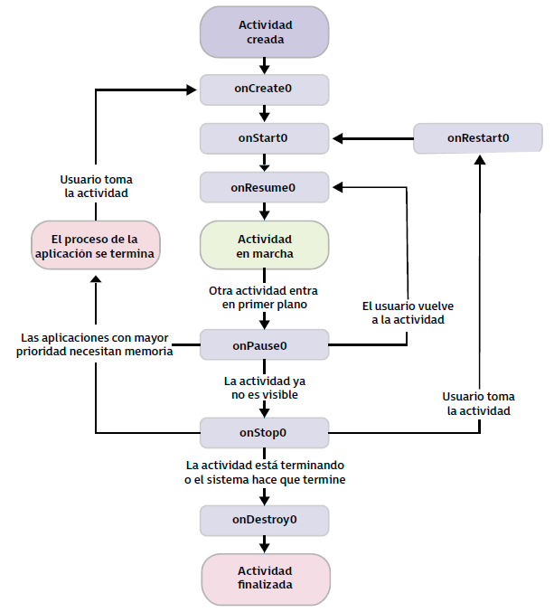

## 1. Limitaciones que plantea la ejecución de aplicaciones en dispositivos móviles: desconexión, seguridad, memoria, consumo de batería, almacenamiento

Los dispositivos móviles tienen serias limitaciones a la hora de ejecutar aplicaciones que deben tenerse en cuenta durante el desarrollo de la aplicación.

- **Desconexión**: Se pueden sufrir desconexiones totales o parciales que hace que las apps que dependan de un servidor se vean afectadas por la variabilidad de la conexión.
- **Seguridad:** Al ser ligeros y fáciles de llevar pueden ser sustraídos. Además son vulnerables al conectarse a redes de dudosa procedencia y disponen de gran cantidad de sensores. Deben considerarse los permisos mínimos necesarios y, al usar los datos, siempre viajar bajo conexión segura o cifrada para evitar la exposición.
- **Consumo de batería:** La batería es uno de los elementos más comprometidos. El diseño de aplicaciones debe considerar qué recursos usa en cada momento, liberando los que no sean necesarios para evitar el gasto excesivo.
- **Memoria y almacenamiento:** Es un recurso limitado. Las aplicaciones deben optimizar el uso de los recursos para no agotarlo.
## 2. Tecnologías disponibles

Los creadores de cada sistema operativo han designado el lenguaje y el entorno de desarrollo recomendado para la creación de aplicaciones en su plataforma.
- Android recomendaba Java hasta que en 2017 se anunció Kotlin. El IDE era Eclipse hasta que en 2013 pasó a ser Android Studio, basado en IntelliJ IDEA de Jetbrains
- iOS programa en Objective-C hasta que se creó Swift. El IDE es Xcode. 
- Terminales Windows Phone o Blackberry (ya casi no existen) usan lenguaje y entorno diferentes

La aplicación puede desarrollarse con tecnologías nativas o con tecnologías híbridas que sirvan para varios lenguajes.
El uso de tecnologías no nativas (híbridas) permite ahorrar recursos en equipos de desarrolladores (se programa una sola vez y funciona en ambas plataformas) pero conlleva inconvenientes:
- la mayoría de tecnologías híbridas están basadas en web, se crea una especie de aplicación web que se muestra en el dispositivo como si fuese nativa, usando algunas librerías para el acceso al hardware (como cámara, micrófono). Esto hace que las aplicaciones sean menos potentes, no puedan acceder a ciertos tipos de hardware y son más lentas. 
- esto motiva que las tecnologías híbridas sean populares durante un tiempo pero finalmente dejen de usarse, implicando que los desarrolladores deban cambiar de tecnología
Hay tecnologías como Unity para juegos o Xamarin para aplicaciones que son más potentes pero no son públicas e implican gasto de licencia.

Además, las plataformas móviles evolucionan rápidamente y no buscan guardar compatibilidad con los frameworks híbridos. Un desarrollador nativo se puede adaptar rápidamente a las nuevas interfaces y funcionalidades y tiene documentación. Sin embargo, el desarrollador híbrido debe esperar a que los creadores del framework saquen una actualización compatible con la nueva versión del sistema operativo.
### 2.1. Desarrollo de aplicaciones nativas

Se llama **aplicaciones nativas** a aquellas que se implementan en el lenguaje específico que facilita la plataforma/fabricante para el desarrollo. 

### 2.2. Desarrollo de aplicaciones híbridas

Se llama **aplicaciones híbridas** a aquellas que en las que un mismo código puede compilarse para dos o más plataformas diferentes.

| Plataforma   | Lenguaje   | Compañía           | Plataformas de destino                      |
| ------------ | ---------- | ------------------ | ------------------------------------------- |
| Xamarin      | C#         | Microsoft          | Android, iOs y Windows                      |
| Unity        | C#         | Unity Technologies | Plataformas de escritorio, móviles y juegos |
| Flutter      | Dart       | Google             | Android, iOS, Windows, Mac, Linux, Web      |
| Ionic        | JavaScript | Open source        | Android, iOS, Windows, Web                  |
| React native | JavaScript | Facebook           | Android, iOS, UWP, Web                      |
| PWA          | JavaScript | Google             | Android, iOS                                |

## 3. Entornos de trabajo integrado

Los **IDE** o entornos de trabajo integrados son una aplicación informática que agrupa un conjunto de herramientas para facilitar el desarrollo de aplicaciones, acompañado de una interfaz gráfica que facilita su uso para aumentar la productividad.

Android Studio es el IDE oficial para desarrollar aplicaciones en Android, basado en IntelliJ. **Funciones incluidas:**
- Integración con el emulador
- Instant run, que permite ver cambios de código sin reiniciar la aplicación
- Desarrollo unificado para todos los dispositivos Android (móvil, TV, smartwatch, Android Auto)
- Editor de código inteligente, con autocompletado
- Control de versiones de código integrado

**Herramientas**
- Editor de código: Escribir y modificar el código de los archivos que componen la aplicación
- Ventanas de herramientas: Cambian en función de la herramienta seleccionada
- Barra de ventana de herramientas: Permite expandir o contraer las ventanas de herramientas
- Herramientas de compilación y ejecución: Ver en qué dispositivo se ejecuta la aplicación
- Barra de estado: Mensajes de información y advertencias mostrados en los diferentes procesos del IDE. 

### 3.1. Registros de la aplicación. Logcat

La ventana de **Logcat** muestra los mensajes del sistema a la vez que los mensajes propios de la aplicación que pueden añadirse con la clase `Log`.
Se pueden aplicar filtros para localizar los mensajes filtrando por el paquete, por nivel (debug, info, error, warning) o por una palabra concreta.
### 3.2. Instalación del entorno de desarrollo

El IDE se instala desde la web de Android Studio.
## 4. Módulos para el desarrollo de aplicaciones móviles

Los proyectos de Android se dividen en módulos que contienen los ficheros de código, de recursos y de compilación necesarios para la construcción de la aplicación. En un proyecto Android al menos existirá un módulo.

Con los módulos el proyecto puede dividirse en funcionalidades, permitiendo crear librerías de código que se comparten en otros módulos del proyecto o incluso en otros proyectos. 

- **Módulos de aplicación**: Por defecto al crear un nuevo proyecto se crea un módulo de aplicación, que contiene los ficheros y código específico para el tipo de dispositivo. Si hay varios tipos de dispositivo, puede haber varios módulos de aplicación
- **Módulo de biblioteca (library)**: Cuando el código se comparte con otros módulos, pudiéndose reutilizar. Deben ir acompañados o usarse como dependencia en módulos de tipo aplicación ya que por sí solos no son ejecutables. 
### 4.1. Android Studio: tipos de vista

- **Vista de Android**: Vista simplificada de la jerarquía de los ficheros del proyecto, con los elementos más relevantes de la aplicación Android
- **Vista de proyecto:** Mayor detalle de la jerarquía completa de carpetas y archivos que compone el proyecto. No es la más cómoda para trabajar en el desarrollo pero útil para editar ficheros concretos que no se puedan localizar en la vista de Android.

### 4.2. Archivos y carpetas de los módulos

- `/java`: Contiene el código de la aplicación en Java o Kotlin
- `/res`: Archivos referentes al diseño de pantallas, traducciones de textos, estilos gráficos e imágenes que componen la aplicación. Se divide en carpetas para organizar el contenido. Según el tipo de recurso se encuentra:
	- `/drawable`: Recursos de tipo imágenes o gráficos en diferentes formatos (PNG, JPG, BMP,...) o vectoriales en formato XML
	- `/layout`: Ficheros que definen el diseño de las pantallas de la aplicación (XML)
	- `/values`: Ficheros que almacenan estilos y códigos de colores, textos, etc. Cadenas de texto en "strings"

```
<resources>
	<string name="hello">Hello World</string>
</resources>
```

	- `/minimap`: Archivos gráficos del icono de la aplicación. Existen varios según la resolución
- `/manifests`: Contiene el archivo `AndroidManifest` que define la configuración y otros aspectos de la aplicación
- `Gradle Scripts`: Ficheros necesarios para la compilación de la aplicación. Al menos hay dos: Uno para la compilación del proyecto y otro para cada módulo. 

### 4.3. Creación de un proyecto

Se arranca Android estudio, new Project, se elige de la plantilla predefinida, se le indica el nombre de la aplicación, el package, el directorio, el lenguaje a utilizar y el API level mínimo con el que será compatible.
## 5. Emuladores

El **emulador** incluido en Android estudio simula multitud de dispositivos junto a los sensores que incorporan (GPS, acelerómetro, brújula, nivel de batería, rotación de pantalla,...), permitiendo probar la aplicación de forma rápida y ágil. 
## 6. Integración del emulador en el entorno de desarrollo

Antes de la llegada de Android Studio, en Eclipse hacía falta un plugin para el emulador pero ahora está perfectamente integrado. 

### 6.1. Crear dispositivo virtual con el emulador de Android Studio

- Tools > AVD Manager. 
- Crear un nuevo dispositivo virtual
- Se selecciona el dispositivo deseado
- Se selecciona la versión de Android que se instalará en el dispositivo
- Se muestra la configuración del dispositivo (Show advance settings permite ver memoria RAM y todo)
- Al finalizar el asistente muestra los dispositivos configurados y se pueden encender y apagar los que se consideren clicando sobre el icono de play.

## 7. Configuraciones. Tipos y características. Dispositivos soportados

- **Smatphones y móviles**: Es el dispositivo más común. Lo caracterizan el tamaño de pantalla, tipo y número de cámaras, sensores (GPS, brújula, acelerómetros), memoria, CPU y batería
- **Smartwatch**: Han visto sus funcionalidades aumentadas gracias a la miniaturización y el desarrollo de procesadores más potentes y debajo consumo: Bluetooth, WiFi, acelerómetros, sensores de ritmo cardiaco, GPS, brújulas. Google ha creado un sistema operativo específico WearOS que está basado en Android. 
- **Android Auto:** Google ha desarrollado sistema adaptado a las necesidades de los automóviles para evitar distracciones, con interfaz minimalista e integrada con el reconocimiento de voz. Los dispositivos soportados están limitados a la integración por parte del fabricante de los modelos.
- **Smart TV** y  **Android TV**:  Mismo concepto y sistema para los televisores, consiguiendo integración con el resto de dispositivos. 

## 8. Perfiles. Características. Arquitectura y requerimientos. Dispositivos soportados

Según el tipo de aplicación que se desarrolle y el público al que vaya dirigida marcará qué tipo de dispositivo se utilizará. Se pueden establecer unos perfiles de aplicación, características y dispositivos soportados.

- Aplicaciones deportivas, salud y/o notificaciones: Ligero -> Smartwatch
- Aplicación de visualización de contenidos y juegos: SmartTV con AndroidTV
- Aplicaciones de localización, rutas, tráfico o infoentretenimiento: Automoción, Android Auto
### 8.1. Jerarquía de clases de perfil. Layout Inspector.

En versiones anteriores a 3.1. de Android Studio existía el **Hierarchy Viewer** que permitía averiguar qué parte de la interfaz causaba retardo en la ejecución. Analizaba la aplicación conectada al emulador mostrando algunas medidas de tiempo y valoraciones sobre el rendimiento.

Actualmente se tiene el **Layout Inspector** que permite analizar la interfaz gráfica por completo, comprobando qué aspecto tendrá en cualquier momento del desarrollo. También se tieen el **Layout Validation** con la que se puede observar si el layout se adapta a terminales móviles con diferentes tamaños de pantalla. 

**Paneles del Layout Inspector**
- **Component Tree o árbol de vistas**: Lista jerárquica de vistas y componentes gráficos que componen el layout.
- **Layout Display o visor  de pantalla**: Renderiza el layout tal y como se ve en la pantalla del terminal o emulador, señalando los límites de cada componente (como una captura de pantalla)
- **Layout Inspector toolbar o barra de herramientas del inspector**: Herramientas disponibles para analizar el layout.
- **Attributes o tabla de propiedades**: Propiedades gráficas del componente seleccionado actualmente.

Mediante **Select Process** puede cambiarse la aplicación que se está depurando (debe ser depurable, tener activada la depuración).
Si la aplicación se ejecuta en terminar con API Level 29 o superior, se puede hacer clic en Live Updates de modo que cada cambio de vista realizado en la aplicación será mostrado en la vista de pantalla.

Si la aplicación está en un terminal antiguo, cuando se cambie la vista de la app se podrá actualizar la vista de pantalla del Inspector mediante el icono de recarga. 

Se pueden ocultar partes de la vista y centrarse solo en algunas concretas.

Para comparar el mockup con lo desarrollado hay una opción en el Layout Inspector que permite cargar un bitmap que se muestre solapado con el diseño (Load Overlay) y ajustar la transparencia con la barra (Overlay Alpha). Al terminar (Clear Overlay)

## 9. Modelo de estados de una aplicación para dispositivos móviles. Activo, pausa y destruido

- En Android cada aplicación es un proceso separado. El usuario no decide cuándo se finaliza una aplicación, sino que esa decisión reside en la gestión de la pila de aplicaciones del propio sistema según las necesidades de memoria en cada momento. 
- Cuando el usuario vuelve a solicitar la aplicación, el sistema se encarga de crear el proceso para mostrar la aplicación en pantalla. 
- Según el estado en que se encuentre el proceso, el sistema asigna una prioridad que determina la probabilidad de que la aplicación sea cerrada. 

| Prioridad (Probabilidad de ser cerrada) | Estado de proceso             | Estado de actividad           |
| --------------------------------------- | ----------------------------- | ----------------------------- |
| **Baja o nula**                         | Primer plano, tiene el foco   | Created<br>Started<br>Resumed |
| **Media**                               | Segundo plano, perdió el foco | Paused                        |
| **Alta**                                | Segundo plano, no visible     | Stopped<br>Destroyed          |
Explicación: El sistema no cerrará nunca la aplicación que tenga el foco (se muestra en pantalla)
Si la aplicación pierde el foco debido a que el usuario cambia de aplicación, pasa a segundo plano y puede ser cerrada si necesita los recursos.

Es vital comprender el **ciclo de vida** de una aplicación para crear aplicaciones robustas, vigilando durante el desarrollo que el código se ejecute en el momento indicado (hay un conjunto de hasta seis método que el sistema invoca y que pueden ser gestionados desde la `Activity` de la aplicación):



- `onCreate()`: En una `Activity` este método siempre se debe implementar. Es el primero al ejecutarse al crear la actividad. Aquí se ejecutará el código que solo debe ejecutarse una vez en el ciclo e la aplicación (inicializaciones de la UI,...). La aplicación no es visible por el usuario
- `onStart()`: La actividad se prepara para ser visible mientras entra en primer plano y recibe el foco
- `onResume()`: La actividad es visible para el usuario; último método que se ejecuta mientras la actividad permanece en primer plano
- `onPause()`: Se ejecuta cuando el usuario va a abandonar la aplicación o pierde el foco. Aplicación parcialmente visible.
- `onStop()`: Cuando la aplicación pasa a no estar visible para el usuario. Debe liberar aquí los recursos no necesarios. 
- `onDestroy()`: Se llama antes de finalizar la actividad sea por acción del usuario o del sistema. Se llama también al rotar la pantalla. 

### 9.1. Ejecutar aplicación desde Android Studio

Poca cosa, le das al play y ya.

### 9.2. Comprendiendo el ciclo de vida de la aplicación

- **Se lanza una actividad**: onCreate, onStart, onResume
- **Cambiar de actividad**: onPause, onStop
- **Volver a la actividad**: onRestart, onStart, onResume
- **Cerrar la actividad**: onPause, onStop, onDestroy

### 9.3. Descubrimiento, instalación, ejecución, actualización y borrado

Las aplicaciones Android se empaquetan en un fichero APK que se genera en la fase de compilación y contiene todos los archivos necesarios para ejecutar la aplicación.

Se puede **instalar** en un dispositivo directamente, pero la forma más común es a través de Google Play Store (Google pone a disposición la posibilidad de subir aplicaciones aquí previo registro de alta como desarrollador y pago de la cuenta).

La **actualización** de aplicaciones se produce con un nuevo APK o actualizando la aplicación en Google Play. 

Si el usuario no quiere usar más la aplicación, puede ser **eliminada** de forma permanente desde la configuración del dispositivo.
## 10. Modificación de aplicaciones existentes

El código de la aplicación estará en un repositorio de control de versiones Git (Github, Gitlab,...) organizado en ramas. 

### 10.1. Descargar el código y realizar una modificación

Se clona el repositorio (Check out project from Version Control)
Se revisa la historia de usuario
## 11. Utilización en entornos de ejecución del administrador de aplicaciones
### 11.1 Ejecutar la aplicación en un dispositivo real

(Necesario versión superior a Android Oreo 8.0)
- Conectar el móvil al ordenador. Quizás sea necesario instalar el driver en Windows
- Habilitar opciones de depuración USB
- Aparece el dispositivo físico en Android Studio y se le da al play. 