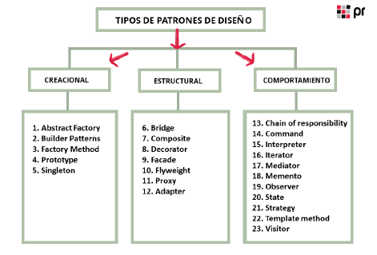
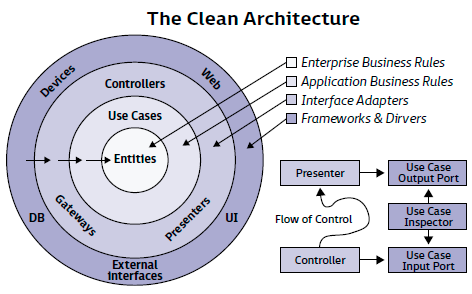
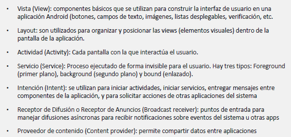
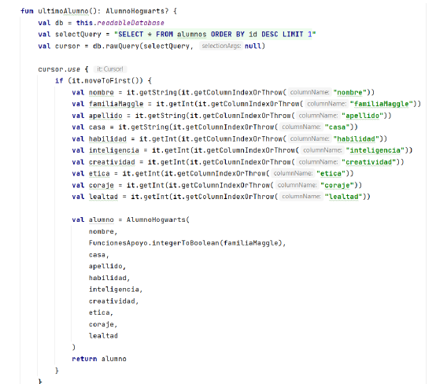

## 1. Herramientas y fases de construcción

### 1.1. Herramientas

Para programar aplicaciones Android lo único necesario es Android Studio. El instalador de Android Studio se asegurará de que se dispone de versión adecuada del JDK de Java y el SDK de Android. 

También hay otras herramientas útiles además del IDE como:

- **Git**: Herramienta de control y gestión de versiones. Permite llevar control histórico de los cambios y desarrollar app entre varios desarrolladores asegurando la integirdad del código.
- **Genymotion**: Emulador, pequeña máquina virtual que emula el hardware del terminal real. Si el ordenador soporta visualización, la velocidad de ejecución de la máquina aumentará. Las velocidades afortunadamente son mayores que las de antes y son más realistas respecto a las características del hardware. Ayuda a comprobar si la app se ve y funciona el terminales de los que no se dispone físicamente. Android Studio tiene emulador pero si no es muy potente el ordenador este puede ser algo lento por lo que se puede usar Genymotion.
- **Postman**: Permite probar servicios webs con facilidad. Hay otras como SoapUI, Vidzler o SoapSonar.
- **Axure**: Permite diseñar la interfaz gráfica antes del desarrollo. Otras son MockPlus, AdobeXD, Mock Flow, JustInMind, Cacoo, Frame Box, Fixma,... Permiten colocar los widgets de cada ventana, moverlos, cambiarlos de tamaño. Algunas también diseñar un flujo de ventanas, que será el camino que tome el usuario de una pantalla a otra mientras usa la app.
- **Jira**: Aplicación de gestión de trabajo como Jira, Redmine o Trello. Permite hacer un listado de tareas, errores a depurar y nuevas funcionalidades. Con esto se puede calcular el tiempo que se tardará en terminar el desarrollo y asignar las tareas entre los desarrolladores en el tiempo disponible. 
----

**ADB (Android Debug Bridge)** Herramienta de línea de comandos que forma parte del kit de desarrollo Android (Android SDK). Permite comunicarse con dispositivos Android conectados a través de conexión USB o Wifi para realizar desarrollo o depuración

**AVD (Android Virtual Device)**: Configuración de emulador de Android para simular dispositivos Android en Android Studio. Instancia virtual de un dispositivo Android que se ejecuta dentro de un entorno de emulador en la computadora.

### 1.2. Fases del desarrollo

Para llevar a cabo un proyecto profesional con éxito deben conocerse y aplicarse las técnicas de la **ingeniería del software**. 
#### Planificación

- Especificar cada una de las tareas que el programa debe realizar, qué hará y cómo.
- Tener un análisis funcional (lista de funcionalidades que ofrece la app)
- Diseñar la interfaz gráfica o una aproximación (pantallas, campos, cómo navegará el usuario por la app)
- Definir todos los parámetros que influirán en el desarrollo, lo que permite tener idea real del tiempo y recursos financieros y técnicos necesarios. 
#### Implementación, pruebas y documentación

La **implementación** significa que se codificarán todas las funcionalidades requeridas. Es posible que se necesiten varios equipos de desarrollo diferentes que deben estar sincronizados. El jefe de proyecto puede optar por metodologías de trabajo para incrementar la eficacia (como las metodologías ágiles: XP, Scrum, Kamban)

Sobre las **pruebas**:
Algunas pruebas se realizarán al mismo tiempo que se codifican las funcionalidades. En Android se diferencia entre **pruebas unitarias o unit tests** para probar el funcionamiento de módulos de código puro y **pruebas instrumentales** para probar el código del módulo directamente en un terminal.
Cuando varios sistemas están terminados pueden hacerse **pruebas de integración** para asegurar la coordinación entre ellos.
Normalmente se tendrá un equipo de QA (quality assurance) en el que se probarán y encontrarán fallos del código antes de que la aplicación llegue al usuario.

También hay pruebas que se realizan cuando la aplicación está completa como los tests de seguridad (El proyecto de Android Studio al compilar en release pasa por ProGuard que es un ofuscador y optimizar de código para impedir que si se desempaquetan las clases puedan ser entendidas. Otras herramientas para comprobar la seguridad son Zed Attack Proxy (ZAP), Quick Android Review Kit (QARK), Drozer o Mobile Security Framework (MobSF))

En cuanto a la **documentación** es imprescindible para disponer de descripción del funcionamiento interno de los diferentes módulos del programa. Esto permite que la transmisión de conocimientos durante el desarrollo y mantenimiento futuro de la app sean rápidos y eficientes. 
#### Despliegue y mantenimiento

**Despliegue**
El **despliegue** o lanzamiento a producción se realiza cuando el programa está completo y ha pasado todas las pruebas de calidad. Puede distribuirse a los stores para su posterior descarga en los dispositivos o directamente a los usuarios como archivo de instalación APK (Android Application Package).

La APK, un archivo comprimido con todos los recursos necesarios para el funcionamiento de la aplicación, ha sido durante mucho tiempo la forma estándar de distribución de una app Android.

Actualmente Google intenta imponer los App Bundles como método de distribución de APK por dos motivos:
- eficiencia, ya que solo se utiliza el código que cada terminal necesita (mientras que una APK necesitaba incluir todas las librerías compiladas para los diferentes procesadores de cada terminal, haciendo la descarga más lenta y necesitando más espacio)
- mantener el control de la distribución de aplicaciones en Android.

Con cualquiera de los dos tipos de paquetes se podrá subir una aplicación al store de Google si se posee una cuenta de desarrollador.

**Mantenimiento**
Consiste en detectar los fallos que aparecen cuando los usuarios usan la aplicación. Esta detección puede hacerse mediante el contacto directo con los usuarios pero también de forma más eficaz introduciendo código con el que la app pueda llamara  los servicios de Firebase Crashlytics cada vez que se detecte una excepción.
Crashlytics puede enviar una alerta a nuestro email y, entrando en la consola web, podemos ver detalles del error, línea y archivo en el que ocurrieron y desarrollar un parche para la próxima versión. 
## 2. Desarrollo del código

Para el **desarrollo de código** debe conocerse bien el lenguaje y las tecnologías con la sque se va a trabajar para obtener código legible y eficiente. 
Además debe sacársele el máximo rendimiento al entorno de desarrollo y seguir las buenas recomendaciones de desarrollo de software. 

### 2.1. Lenguajes de programación

Para desarrollar apps Android nativas puede usarse tanto Java como Kotlin, siendo preferido este último. 
Java es versátil gracias a su bytecode y a su máquina virtual JVM, procesador virtual que interpreta el bytecode, ejecutándolo como el código máquina de cada procesador físico en el que está instalada.

Versiones previas de Android 5, Lollipop, tenía **Dalvik**, máquina virtual que traducía el bytecode de Java al procesador del móvil. (De ahí vienen el formato de archivo APK y los archivos .dex).

A partir de Android 5 el sistema operativo viene con una máquina virtual más potente para la ejecución de Android llamada **Android Runtime (ART)**

Kotlin llega como sustituto a Java ya que es un lenguaje orientado a objetos que también permite la programación funcional. Dispone de potentes tipos de datos y es totalmente compatible con Java ya que se traduce al mismo bytecode. 

Los objetos de Java y Kotlin se comunican entre sí perfectamente. Incluso Android Studio permite traducir ficheros de Java a Kotlin automáticamente.
### 2.2. Entornos de trabajo

Android Studio tiene funciones de autocompletado, formateo de código, generador de código, generación de estructura de directorios automática (que deberá ser completada por el mismo desarrollador dividiendo en subdirectorios y módulos)
### 2.3. Buenas prácticas
#### 2.3.1. Patrones de diseño

Los **patrones de diseño** son estructuras de código que resultan eficaces y eficientes, impidiendo su uso de forma incorrecta. Dan soluciones a los problemas típicos de la arquitectura de código que se repiten en casi todas las aplicaciones, estandarizando el diseño de la aplicación.

Se pueden agrupar por su funcionalidad en:
- Creacionales
- Estructurales
- Comportamiento

Existen muchos patrones de diseño, algunos muy utilizados y otros escasamente. Muchas clases de Android implementan patrones ya conocidos como Singleton, MVVM, Adapter, Builder,...


#### 2.3.2. Clean code, Clean Architecture

Robert Martin (Uncle Bob) es autor de dos libros clave en el desarrollo software: Clean Code y Clean Architecture. En ellos se dan una serie de pautas para la construcción de código robusto y libre de errores de diseño y programación.

Se trata de mantener estructuras y normas en el código, con objetivo de dividir las funcionalidades en tareas cada vez más pequeñas: Cada parte del código desarrollará una y solo una de esas pequeñas tareas y la comunicación entre las partes está controlada para que cada una conozca y utiliza solo los imprescindible de otra. Así, los errores de un módulo no se trasladan al resto y son fácilmente identificables. 

**Explicación del diagrama de Clean Architecture**: Al analizar los requisitos de la aplicación se encuentran los **casos de uso** (funcionalidades, tareas que el usuario pide a la app), estos casos de uso necesitarán de estructuras básicas de datos llamadas **entidades**. Para presentar el resultado se necesita un código que formatee los datos (presenter). Y también se necesitan las clases de la interfaz gráfica para presentar el resultado al usuario.

Las flechas que se ven hacia dentro del círculo significan la dirección de uso, es decir, capas exteriores conocen y usan a las interiores pero no al revés.
Las capas interiores son abstractas y, por lo tanto, no depende de las exteriores. 



#### 2.3.3. SOLID

Son las siglas de cinco principios clean que ayudan  a mejorar la calidad del código.
- **S - simple responsibility**: Cada clase, cada método y cada variable deben tener un único objetivo
- **O - open-closed**: Entidades abiertas para ser extendidas pero no debe permitirse su modificación una vez diseñadas; la funcionalidad primordial debe seguir siendo igual
- **L - Liskov substitution**: Una clase puede ser sustituida por cualquiera de sus subclases sin modificar el funcionamiento, ya que en el principio anterior se ha asegurado que llevará a cabo las mismas funcionalidades básicas aparte de otras añadidas
- **I - interface segregation**: No deben mezclarse métodos de casos de uso diferentes en la misma interfaz, porque causará problemas. Es mejor crear diferentes interfaces, solo con los métodos quela definan
- **D - dependency inversion**: La funcionalidad de una clase o método debe depender solo de abstracciones, no de código concreto. Una clase no deberían estar compuesta en su interior de objetos de otras clases, porque al cambiar esas clases, la clase principal fallaría. Debe depender de interfaces y las clases reales que ejecuten las funciones cumplirán esas interfaces. 

## 3. Compilación, preverificación, empaquetado y ejecución

El código Kotlin debe compilarse para convertir en bytecodes dentro de archivos .dex que será en paquetados en un APK o Bundle y que luego serán instalados y ejecutados por una máquina Android.

### 3.1. Compilación

Al seleccionar Run, el compilador analiza el código y comprueba que no tenga errores. Realizará algunas mejoras para aumentar su eficiencia y lo transforma en un lenguaje comprensible para el procesador del móvil.
Si es la primera vez que se ejecuta la app, Android Studio crea algunas carpetas dentro del directorio: en la carpeta`/app` crea `build`, `outputs`, `apk` y dentro `debug` en esta última carpeta se guarda `app-debug.apk`, que es un APK diseñado para ser depurado en el emulador o el terminal que se tenga conectado (no para ser distribuido).

**Opciones de compilación**
Android Studio tiene distintos tipos de compilación para cada momento del desarrollo. 
El programa que controla todo el mecanismo de compilación se llama Gradle. Se tienen normalmente dos archivos de configuración:
- uno global para todo el proyecto o de aplicación
- y otro por cada módulo

Para elegir los tipos de compilación se tienen:
- Los **build types** o modos de compilación: Definen ciertas propiedades del compilador que representan los diferentes estadiso de desarrollo de la app. Modo debug mientras se desarrolla, modo release cuando ya está terminada.  
- Los **product flavors** o variantes de producto:  Diferentes versiones de la app que se necesiten para distribuir a diferentes usuarios (versión gratuita, versión de pago, brandings,...)
- Los **build variants** o variantes de compilación: Combinación de los build types y de los product flavors. A la hora de compilar y empaquetar la app el desarrollador debe elegir la combinación final de debug/release y los diferentes tipos de product flavors que el compilador utilizará.

Los archivos de configuración de Gradle utilizan un lenguaje llamado Groovy aunque no es necesario que lo dominemos, será conveniente que tengamos una idea de cómo funciona. 
### 3.2. Preverificación

Android Studio permite la revisión de código mediante Lint. Las herramientas darán un listado de problemas y recomendaciones, cada uno con un mensaje descriptivo y un nivel de gravedad para mejorar el código de la aplicación. 
Lint comprueba el proyecto Android para buscar posibles errores y optimizaciones de código, seguridad, rendimiento, usabilidad, accesibilidad.

Aunque mientras se desarrollo en Android Studio, Lint escanea el proyecto para recomendarte cambios en el código. Se puede lanzar Lint desde la línea de comandos `./gradlew lint`.

### 3.3. Empaquetado

Para generar el paquete en Build Bundle / APK se generará un Bundle o APK con el build variant activo actualmente.
Generate Signed Bundle llevará  a obtener el paquete que se necesita (necesario en este caso archivo Key Store para firmar el Bundle). 
Para que un paquete de instalación de Android se pueda instalar debe estar firmadso con certificado digital. Se puede crear el archivo en el proceso de empaquetado o tenerlo ya creado y usarlo cada vez que se firma una de la apps para subirla al store. 

Se puede publicar en la Store. Si no quiere hacerse en el Play Store se puede subir a otros como F-Droid, Aptoide, Getjar, Uptodown o Amazon pero debe activarse en las opciones del móvil Ajustes > Seguridad > Orígenes desconocidos. 
### 3.4. Instalación y ejecución

La instalación ya lo hemos visto como va la cosa.
Y si se quiere hacer conectando el USB deben estar activadas las Opciones de desarrollador.

**Si nos pasan un APK**
Para instalarlo, llamar al ADB (Android Debug Bridge) desde la línea de comandos.

El **ADB (Android Debug Bridge)** es una herramienta en línea de comandos que forma parte del Android SDK (Software Development Kit). Permite a los desarrolladores comunicarse con dispositivos Android (emuladores o dispositivos físicos) para realizar diversas tareas como instalación de aplicaciones, depuración, manipulación de archivos, ejecución de comandos de shell...

**En la shell:**
Para ver si está  `adb --version`
Se puede lanzar el comando `adb devices` para ver los dispositivos conectados.
Para instalar el  APK `adb install path/archivo.apk`
Para lanzar la app `adb shell am start -n nombre_app/nombre_activity`
Ayuda `adb --help`
### 3.5. Depuración

Depuración con el debug de Android Studio.
## 4. Interfaces de usuario. Layouts. Clases asociadas

Android Studio se basa en la tecnología **DMI (Direct Manipulation Interface). 

### 4.0. Conceptos

- match_parent -> Igual que el padre
- wrap_content -> Se ajusta al contenido

**Unidades de medidas. Tamaños fijos**
- dp: Pixels independientes de la densidad. Coge como base pantalla de 160dp. Tamaño propio para paddings y márgenes
- sp: Coge como base tamaño de fuente seleccionada. Se usa en texto
- pt: 1/72 de una pulgada
- px: Resolución de la pantalla
- mm,in: Basado en tamaño físico de pantalla



---

**View Group**
- Objeto invisible para contener objetos `View`y `ViewGroup` y así organizar y controlar el layout de una pantalla
- Usados para establecer jerarquía de objetos `View`
- Pueden ser instanciados igual que `View` tanto en XML como en Kotlin
### 4.1. Actividad

Es el componente de la aplicación que permite la interacción con el usuario. Está formada por dos elementos: capa lógica y parte gráfica.

Las actividades heredan de la clase `AppCompatActivity` y también, tras muchas subclases, de `Context`
El identificador de la actividad (instancia) cambia cada vez que el terminal es rotado de portrait a landcape o similar (el sistema pregunta a la app cómo desea adaptarse al cambio de formato, siendo la actividad destruida recreada con la nueva configuración)
Además de la clase de código, está el layout que se define con código XML. Cada elemento del layout tiene definido su id de la siguiente forma: `android:id="@+id/tvMiTextoPrueba`

Un **layout** en Android estudio es una estructura que define cómo se organizan y muestran los elementos de la interfaz de usuario en una pantalla. Determina cómo se disponen los controles y widgets en relación con el espacio disponible. Son esenciales para crear aplicaciones con una apariencia y funcionamiento adecuados en diferentes dispositivos y orientaciones de pantallas. Se crean con XML y se almacenan en `/res/layout`
#### Tipos de layouts

- **LinearLayout**: Agrupa vistas en su interior secuencialmente de forma lineal en dirección horizontal o vertical dependiendo del parámetro `android:orientation`. Todos sus elementos internos presentan `android:layout_width` y `layout_height` indicando el ancho y el alto de cada componente. Si se pone `android:layout_height=0dp` lo que se pretende es que la vista se extienda a todo el espacio sobrante que hayan dejado el resto de componentes.  Se puede especificar el peso de cada elemento para asignar el espacio disponible (`android:layout_weight`, a mayor importancia, mayor número, mayor espacio)

- **RelativeLayout**: Agrupa vistas en posición relativa al layout contenedor. Puede especificarse la posición de un elemento en relación con otro (derecha, izquierda, arriba, abajo)
Con `android:layout_above` se posiciona el borde inferior del elemento actual con el borde superior del view referenciado por id
Con `android:layout_centerHorizontal` se  indica que el view será centrado horizontalmente respecto al padre
Con `android:layout_alignParentBottom` se usa true para alinear el borde inferior del view con el del padre
Con `android:layout_alignStart` se alinea el borde inicial de este elemento con el borde inicial del view referido por él

- **FrameLayout**: Organiza elementos uno encima de otro comenzando desde esquina superior izquierda. Útil para superponer vistas o mostrar una única vista en el layout.
>Con android:layout_gravity se pueden poner posiciones de view dentro del layout
> left|top  center_horizontal|top right|top
> left|center_vertical  center   right|center_vertical
> left|bottom  center_horizontal|bottom  right|bottom


- **TableLayout**: Contenedor tipo tabla que usa filas y columnas para alinear los elementos en la vista. Pueden tener un tamaño particular o ampliarse. Las celdas pueden extenderse más allá de sus límites. Puede especificarse la cantidad de filas y columnas y cómo se distribuye el contenido en ellas.

Con `android:shrinkColumns` se reduce el ancho de columna hasta ajustar fila al ancho del padre
Con `android:stretchColumns` se rellena el espacio vacío que queda en el TableLayout expandiendo la columna seleccionada. 

- **GridLayout**: Diseño basado en rejilla de celdas de diferentes tamaños. Organiza sus elementos en una cuadrícula permitiendo un control más preciso sobre filas y columnas en comparación con `TableLayout`

Indice en 0.
``android:columnCount`: Número de columnas de la rejilla
``android:rowCount`: Número de filas de la cuadrícula
``android:useDefaultMargins`: Márgenes determinados entre items
`android:layout_columnSpan`: Número de columnas que ocupará una celda
`android:layout_rowSpan`: Número de filas que ocupará una celda.

- **ConstraintLayout**: Diseño más usado actualmente. Organiza sus elementos usando restricciones que definen relaciones y alineaciones entre elementos en el layout. Se evita la composición jerárquica de demasiados layouts uno dentro de otros (que provocaba la degradación de la eficiencia del layout). Permite ordenar los componentes de forma eficiente y elástica. Con el diseño mediante cajitas con enlaces laterales que pueden asociarse con el contenedor padre o entre las vistas.

**Atributos de control de posición del `ConstraintLayout`**
- `app:layout_constraintLeft_toLeftOf` o `app:layout_constraintLeft_toRightOf` 
- `app:layout_constraintRight_toLefttOf` o `app:layout_constraintRight_toRightOf`
- `app:layout_constraintTop_toTopOf` o `app:layout_constraintTop_toBottomOf` 
- `app:layout_constraintBottom_toTopOf` o `app:layout_constraintBottom_toBottomOf`

Tiene opciones para establecer márgenes, centrado, offsets,... 

**Componentes visuales**
- `TextView`: Texto estático para el usuario. Puede cambiarse desde código. Presentar información al usuario.
- `EditText `: Campo de texto rellenable por el usuario. Puede crearse filtro de entrada (para solo aceptar números o similar)
- `Button`: Componente que puede ser presioando para obtener alguna función. Se le debe asignar un `setOnClickListener` o el atributo `onClick` para definir la acción.
- `ImageButton`: Botón al que puede añadirse un icono para mejorar su aspecto visual.
- `ImageView`: Imagen estática (puede ser cambiada desde el código)
- `RecyclerView`: Lista de objetos cuya presentación se puede adaptar mediante un `Adapter`. Son eficientes ya que solo retienen en memoria los objetos que serán mostrados.
- `Switch`: Interruptor. Puede estar en on o en off. Presenta al usuario dos opciones posibles. 
- `Checkbox`: Opción seleccionable. Muestra si la opción está activa  o no.
- `RadioButton` y `RadioGroup`: Similar al `Checkbox` pero estas opciones son excluyentes entre sí.


#### Toast 

Un **toast** es una pequeña ventana emergente que proporciona retroalimentación breve y temporal al usuario. Se usan para mostrar mensajes cortos como notificaciones o información del estado, sin interrumpir la interacción del usuario con la aplicación. Aparecen en la parte inferior de la pantalla y desaparecen después de un corto periodo de tiempo. 
#### Intents

El paso de una actividad a otra se realiza mediante objetos `Intent` y llamando a `startActivity`

`Intent(contexto del paquete, contexto de la actividad destino)`

```kotlin
val intent = Intent(this, MainActivity2::class.java)
startActivity(intent)
```

Otra opción es llamar a `startActivityForResult` y utilizar un identificador para identificar el código de la actividad llamada en cada caso. Cuando la segunda actividad se cierre, volverá a la primera llamando al método `onActivityResult`

```kotlin
startActivityForResult(intent, REQUEST_SEGUNDA_ACTIVIDAD)
//////////////////////////////
override fun onActivityResult(requestCode: Int, resultCode: Int, data: Intent?)
{
	super.onActivityResult(requestCode, resultCode, data)
		if(resultCode == Activity.RESULT_OK && data != null) {
			when(requestCode) {
			REQUEST_SEGUNDA_ACTIVIDAD -> {
			val datos = data.getStringExtra(“datos”)
			}
		}
	}
}
```

- **requestCode**: Identificador que se usa al llamar a la actividad. Si hay más de una llamada a actividades diferentes, se podrá saber cuál está respondiendo.
- **resultCode**: Valor `RESULT_OK` (actividad terminó adecuadamente) o `RESULT_CANCELED` si el usuario canceló el proceso
- **data**: Objeto `Intent` con los datos requeridos por la `Activity` que pueden recuperarse mediante `getStringExtra`, `getIntExtra`, `getBooleanExtra`, `getByteExtra`,...

**Mandar parámetros de una actividad a otra**
```kotlin
fun onClick(view: android.view.View) {
	val intent = Intent()
	val datos = “Estos son datos generados en ${SecondActivity::class.simpleName}”
	intent.putExtra(“datos”, datos)
	setResult(RESULT_OK, intent)
	finish()
}
```

**Acceder a una activity fuera de la app**

```kotlin
if(tenemosPermiso()) {
	val intent = Intent(Intent.ACTION_PICK, ContactsContract.Contacts.CONTENT_
	URI)
	startActivityForResult(intent, REQUEST_CONTACTO)
}
```

**Solicitud de permisos**

La función `tenemosPermiso` utiliza la función del sistema `checkSelfPermission` para saber si el usuario ha dado ya el permiso a esta app. La función `pidePermiso` utiliza la función del sistema `requestPermissions` para requerir al usuario que acepte una lista de permisos, en nuestro caso, solo uno, el de lectura de contactos. Pero el sistema no responde a esto de forma inmediata, sino que presenta al usuario un diálogo por cada permiso para que lo acepte o lo rechace. La respuesta nos llegará en otra función de la activity que debemos sobrescribir: `onRequestPermissionsResult`. En esta función comprobamos que es la respuesta que esperábamos y que el usuario finalmente aceptó darnos permiso. Si nos denegó el permiso, mostramos un mensaje de alerta.

Si tratásemos de saltarnos este procedimiento, la llamada que hicimos a `startActivityForResult`
lanzaría una excepción que haría terminar la app.

```kotlin
private fun tenemosPermiso(): Boolean
= PermissionChecker.checkSelfPermission(this, PERMISO) ==
PermissionChecker.PERMISSION_GRANTED

private fun pidePermiso() {
	if( ! tenemosPermiso()) {
	requestPermissions(arrayOf(PERMISO), REQUEST_PERMISOS)
	}
}
override fun onRequestPermissionsResult(
requestCode: Int,
permissions: Array<out String>,
grantResults: IntArray) {
	super.onRequestPermissionsResult(requestCode, permissions, grantResults)
	if(requestCode == REQUEST_PERMISOS
	&& permissions[0] == PERMISO
	&& grantResults[0] != PermissionChecker.PERMISSION_GRANTED) {
	mensajeErrorPermiso()
	}
}
companion object {
private const val TAG = “MainActivity”
private const val PERMISO = android.Manifest.permission.READ_CONTACTS
private const val REQUEST_PERMISOS = 1
private const val REQUEST_CONTACTO = 1
private const val REQUEST_SEGUNDA_ACTIVIDAD = 2
```

**Lectura de un contacto de vuelto en el Intent**

```kotlin
private fun procesarContacto(data: Intent) {
	val contactData: Uri? = data.data
	val projection = arrayOf(
	ContactsContract.Contacts._ID,
	ContactsContract.Contacts.DISPLAY_NAME
	)
	val cursor: Cursor? = contentResolver.query(contactData!!, projection,””,
	null,null)
	cursor?.let { c ->
	c.moveToFirst()
	val id = c.getString(c.getColumnIndex(ContactsContract.Contacts._ID))
	val name = c.getString(c.getColumnIndex(ContactsContract.Contacts.DISPLAY_
	NAME))
	tvId.text = id
	tvName.text = name
	val phones: Cursor? = contentResolver.query(
	ContactsContract.CommonDataKinds.Phone.CONTENT_URI, null,
	ContactsContract.CommonDataKinds.Phone.CONTACT_ID + “ = “ + id,
	null, null
	)
	phones?.moveToFirst()
	val number = phones?.getString(phones.getColumnIndex(“data1”))
	tvPhone.text = number
	phones?.close()
	}
	cursor?.close()
}
```

-----

**Manejo de las pilas por Android. Atributo launchMode**
Android maneja las pilas de las actividades asociadas a lo que se conoce como tareas. Una **tarea** es un conjunto de actividades con las que interactúa el usuario mientras realiza una función. Normalmente una aplicación tiene una tarea con una pila de actividades, aunque no tiene por qué ser siempre así. 

El orden de las actividades en la pila no puede modificarse una vez introducidas. Sin embargo, sí puede configurarse de antemano mediante el uso de parámetros en la etiqueta `<activity` del manifest o en la función `onStartActivity`. Los parámetros de la función tendrán prioridad sobre los del manifest en caso de existir ambos y ser incompatibles.

En el manifest se puede especificar el atributo `launchMode`, que especifica cómo la actividad encajará en la tarea. Hay cuatro modos diferentes:
- **standard**: Modo por defecto. El sistema crea una nueva instancia de la actividad en la tarea. La actividad puede crearse más de una vez y cada instancia pertenecer a una tarea diferente.
- **singleTop**: Si ya hay una instancia de la actividad en la tarea, el sistema enruta el `Intent` a esa instancia. Al ya existir la actividad no se llamará a `onCreate` sino a `onNewIntent`
- **singleTask**: El sistema crea una nueva tarea e instancia la actividad como la actividad principal de la tarea. Si ya existe una instancia de la actividad en una tarea separada (que puede contener más actividades), el sistema enruta el `Intent` a esa instancia mediante `onNewIntent`
- **singleInstance:** Igual que `singleTask` pero el sistema no lanzará ninguna otra actividad en la tarea que tiene la instancia. La instancia de la actividad será siempre la única que tenga la tarea. Cualquier actividad lanzada de este modo supondrá la creación de una nueva tarea. 

```xml
<activity android:name=”.MainActivity” android:launchMode=”standard”/>
```

En la función `onStartActivity` se pueden usar como parámetros:
- **FLAG_ACTIVITY_SINGLE_TOP**: Igual que `singleTop` en el manifest. Si la actividad que se quiere lanzar es la actividad actual, situada en lo alto de la pila, recibirá una llamada a `onNewIntent` en lugar de crearse una nueva.

- **FLAG_ACTIVITY_NEW_TASK**: Igual que `singleTask` en el manifest. Comienza la actividad en una nueva tarea. Si ya existe una tarea con esa actividad, se trae al primer plano y la actividad recibe la llamada de `onNewIntent`. 

-  **FLAG_ACTIVITY_CLEAR_TOP**: Si la actividad que quiere lanzarse está ya en la tarea actual, en lugar de lanzarse una nueva instancia, todas las demás actividades que están sobre ella en la pila se destruirán y la actividad que ya existía, ahora en primer plano recibirá llamada a `onNewIntent`. Suele usarse junto con `FLAG_ACTIVITY_NEW_TASK`

### 4.2. Fragment

- El fragmento hereda de `Fragment` y suele sobreescribir `onCreateView` y `onViewCreated`. En la primera especifica el layout que diseña su contenido y en la segunda, por ejemplo, establece un `onClickListener` para uno de los botones.  (Ver ejemplo abajo)
- El fragmento puede entenderse como una unidad de presentación, una subactividad. En sí mismo, es como un componente gráfico más. 
- El paso de un fragmento a otro es más eficiente que el paso entre actividades. Además, no necesitan ser declarados en el manifest. 
- El fragment tiene su propio ciclo de vida (al igual que la actividad)

En el layout de la actividad que contendrá fragments, la etiqueta `fragment` sirve como contenedor de los fragments que se quieran mostrar. El atributo `name` referencia a la clase `NavHostFragment` que tendrá la funcionalidad de permitir la navegación entre `Fragments`. Cada `NavHostFragment` tiene un `NavController` que define los posibles caminos de navegación y que se define mediante el gráfico de navegación. En el código podemos ver que el gráfico de navegación se define con el atributo `app:navGraph` y que en este caso su valor es `@navigation/nav_graph`.
```xml
<?xml version=”1.0” encoding=”utf-8”?>
<androidx.constraintlayout.widget.ConstraintLayout
xmlns:android=”http://schemas.android.com/apk/res/android”
xmlns:app=”http://schemas.android.com/apk/res-auto”
android:layout_width=”match_parent”
android:layout_height=”match_parent”
app:layout_behavior=”@string/appbar_scrolling_view_behavior”>
	<fragment
	android:id=”@+id/nav_host_fragment”
	android:name=”androidx.navigation.fragment.NavHostFragment”
	android:layout_width=”0dp”
	android:layout_height=”0dp”
	app:defaultNavHost=”true”
	app:layout_constraintBottom_toBottomOf=”parent”
	app:layout_constraintLeft_toLeftOf=”parent”
	app:layout_constraintRight_toRightOf=”parent”
	app:layout_constraintTop_toTopOf=”parent”
	app:navGraph=”@navigation/nav_graph” />
</androidx.constraintlayout.widget.ConstraintLayout>
```

Veamos como es el gráfico de navegación. Este tiene un elemento raíz `<navigation>` que define su `id` y establece el fragment que será visible al inicio con `app:startDestination`. 
La lista de fragmentos vienen definidos con `<fragment>` y tienen varias propiedades como la clase que es definida con `android:name`, el layout con `tools:layout`. Una etiqueta hija `<action>` define la acción de navegación de una etiqueta a otra. Igual que con los layouts, es posible ver una representación gráfica de la navegación entre `Fragments` desde Android Studio. 

```xml
<?xml version=”1.0” encoding=”utf-8”?>
<navigation xmlns:android=”http://schemas.android.com/apk/res/android”
xmlns:app=”http://schemas.android.com/apk/res-auto”
xmlns:tools=”http://schemas.android.com/tools”
android:id=”@+id/nav_graph”
app:startDestination=”@id/FirstFragment”>
	<fragment
	android:id=”@+id/FirstFragment”
	android:name=”com.ilernaonline.miapp.FirstFragment”
	android:label=”@string/first_fragment_label”
	tools:layout=”@layout/fragment_first”>
	<action
	android:id=”@+id/action_FirstFragment_to_SecondFragment”
	app:destination=”@id/SecondFragment” />
	</fragment>
	<fragment
	android:id=”@+id/SecondFragment”
	android:name=”com.ilernaonline.miapp.SecondFragment”
	android:label=”@string/second_fragment_label”
	tools:layout=”@layout/fragment_second”>
  	<action
	android:id=”@+id/action_SecondFragment_to_FirstFragment”
	app:destination=”@id/FirstFragment” />
	</fragment>
</navigation>
```

Veamos el fragment:

```kotlin
class FirstFragment : Fragment() {
	override fun onCreateView(
	inflater: LayoutInflater, container: ViewGroup?,
	savedInstanceState: Bundle?
	): View? {
		// Inflate the layout for this fragment
		return inflater.inflate(R.layout.fragment_first, container, false)
	}
	override fun onViewCreated(view: View, savedInstanceState: Bundle?) {
		super.onViewCreated(view, savedInstanceState)
		view.findViewById<Button>(R.id.button_first).setOnClickListener {
		findNavController().navigate(R.id.action_FirstFragment_to_Second-
		Fragment)
	}
}
```

Se puede observar que con `findNavController().navigate(..)` se producirá la navegación al segundo fragmento. 
### 4.3. Otros tipos de ventanas

Para ventanas sencillas se pueden utilizar diálogos. El diálogo suele mostrar un mensaje al usuario con un par de botones. También puede mostrar algunos controles que faciliten al usuario la introducción de datos o la elección de alguna preferencia antes de continuar con el proceso. 

**Se puede crear un diálogo a partir de una `Activity` diseñando el layout de la forma habitual pero modificando el tema en el manifest**
```xml
<activity android:theme=”@android:style/Theme.Holo.
Dialog”>
```

Sin embargo, hay subclases de `Dialog` que ya proporciona el SDK y que para casos poco complejos sirven perfectamente.

- **AlertDialog**: Subclase de `Dialog` que muestra un título y varios botones, de forma opcional. Es capaz de mostrar una lista de elementos que el usuario podrá seleccionar. Utiliza patrón de diseño `Builder`

```kotlin
AlertDialog.Builder(context)
// Titulo
.setTitle(“Borrar elemento”)
// Mensaje
.setMessage(“¿Está seguro de que desea eliminar el elemento?”)
// Establece el boton positivo y listener de la accion que se llevara a cabo
.setPositiveButton(android.R.string.yes) { dialog, which ->
Log.d(“Dialog”, “---------------- YES ----------------”)
}
//Boton negativo. Si utilizamos null como listener, el diálogo simplemente se cierra
.setNegativeButton(android.R.string.no, null)
// Icono
.setIcon(android.R.drawable.ic_dialog_alert)
// Mostrar
.show()
```

Elección entre varias opciones:

```kotlin
val colores = arrayOf(“Rojo”, “Verde”, “Azul”)
AlertDialog.Builder(context)
.setTitle(“Elige un color”)
.setItems(colores) { dialog, which ->
Log.d(“Dialog”, “Color elegido: ${colores[which]}”)
}
.create()
.show()
```


- **DatePickerDialog** y **TimePickerDialog:** Son dos subclases diseñadas para que el usuario seleccione una fecha o una hora.  Se establece la fecha/hora por defecto y el listener. (Cuidado que muchas funciones del SDK consideran entero como el mes 0 y, por tanto, el 7 es agosto). El booleano del `TimePickerdialog` sirve para indicar si se quiere mostrar el formato de 4 horas.
```kotlin
DatePickerDialog(requireContext(),
	OnDateSetListener { view, year, monthOfYear, dayOfMonth ->
	Log.d(“Dialog”, “Fecha seleccionada: $dayOfMonth/${monthOfYear+1}/$-
	year”)
	}, 2020, 7, 16)
.show()

TimePickerDialog(requireContext(),
OnTimeSetListener { view, hourOfDay, minute ->
Log.d(“Dialog”, “Hora seleccionada: $hourOfDay:$minute”)
}, 12, 5, false
)
.show()
```

### 4.4. ScrollView

El `ScrollView` u `HorizontalScrollView` es una barra de desplazamiento invisible para mostrar todo aquello que no cabe en pantalla. 
En el `ScrollView` el nodo hijo puede ser un `LinearLayout` en `orientation` vertical, que contiene todos los elementos que quieren mostrarse al desplazar la pantalla.

### 4.5. Orientaciones de pantalla


## 5. Contexto gráfico. Imágenes

### 5.1. Drawables

En la carpeta de recursos res se puede encontrar el directorio "drawable" que guarda las imágenes como recursos `drawables` que la app utilizará donde necesite. 

Los `drawables` pueden cargarse mediante funciones de la API como `getDrawable` o ser incluidas en otros recursos XML como layouts, con algún atributo como `android:drawable` o `android:icon`
Si mostramos una imagen el layout queda como: 

```xml
<ImageView
android:layout_height=”wrap_content”
android:layout_width=”wrap_content”
android:src=”@drawable/imagen”/>
```

Y el código
```kotlin
val drawable: Drawable?= ResourcesCompat.getDrawable(
resources, R.drawable.imagen, null)
...
imageView.setImageDrawable(drawable)
```
### 5.2. Crear y presentar drawables

Al igual que las imágenes guardadas en el proyecto se pueden presentar como drawables, también hay otras opciones como dibujarlo nosotros mismos. 

Por ejemplo, con `ShapeDrawable`, una subclase de `Drawable` se puede dibujar un gráfico bidimensional relativamente sencillo. En el código de la app se podrán codificar formas básicas como cuadrados, círculos y usando las líneas y colores que se quieran.

Por ejemplo: Creamos una subclase de `View` con dos constructores: Uno que se llamará cuando se incruste la vista en un layout, y el otro para ser utilizado en una `Activity` o `Fragment`. 

En la clase se crea un `ShapeDrawable` con `OvalShape` que dibuja un óvalo. (En este caso como el ancho y el alto son 100 realmente dibujará un círculo). La vista se personaliza sobrescribiendo el método `onDraw` de `View`. 

```kotlin
//Constructor que se llamará cuando la vista se llame desde código
class CustomDrawableView(context: Context) : View(context) {
	constructor(context: Context, attributeSet: AttributeSet): this(context) {
	//Constructor que se llamará cuando la vista se utilice en un layout
	}

	private val drawable: ShapeDrawable = run {
		val x = 0
		val y = 0
		val width = 100
		val height = 100
		contentDescription = “Descripción de la imagen!”
		ShapeDrawable(OvalShape()).apply {
		// Si no establecemos el color, será negro por defecto.
		paint.color = 0xff74AC23.toInt()
		// Debemos establecer los límites del gráfico.
		setBounds(x, y, x + width, y + height)
		}
	}
	override fun onDraw(canvas: Canvas) {
		drawable.draw(canvas)
	}
}
```

¿Cómo usarlo en un layout?
```xml
<com.ilernaonline.miapp.CustomDrawableView
android:id=”@+id/view”
android:layout_width=”wrap_content”
android:layout_height=”wrap_content”
app:layout_constraintBottom_toBottomOf=”parent”
app:layout_constraintEnd_toEndOf=”parent”
app:layout_constraintStart_toStartOf=”parent”
app:layout_constraintTop_toBottomOf=”@+id/button_second” />
```

¿Cómo usarlo en un fragment?
```kotlin
class SecondFragment : Fragment() {
	override fun onCreateView(
	inflater: LayoutInflater, container: ViewGroup?,
	savedInstanceState: Bundle?
	): View? {
		return CustomDrawableView(requireContext())
	}
}
```

**Otra opción: Heredar de `Drawable` directamente**

Se crea un objeto `Paint` que se utiliza en el método `draw`. 
La clase `Canvas` es la responsable de dibujar todas las primitivas de imagen, es un lienzo virtual que contiene las llamadas a los métodos de dibujo para finalmente presentar una imagen.

Los objetos `drawables` pueden: 
- usar un bitmap, una imagen corriente para definir su apariencia
- utilizar la clase `Canvas` para definir formas básicas como óvalos y rectángulos (Clase `ShapeDrawable`utiliza las funciones de canvas para definir su aspecto)

```kotlin
class NuestroDrawable : Drawable() {
private val redPaint: Paint = Paint().apply { setARGB(255, 255, 0, 0) }
override fun draw(canvas: Canvas) {
// Obtenemos los márgenes que nos han dejado
val width: Int = bounds.width()
val height: Int = bounds.height()
val radius: Float = min(width, height).toFloat() / 2f
// Dibujamos un circulo rojo en mitad de la vista
canvas.drawCircle((width/2).toFloat(), (height/2).toFloat(), radius,
	redPaint)
}
override fun setAlpha(alpha: Int) {
// Sobrescribir este método es obligatorio aunque no lo uses
}
override fun setColorFilter(colorFilter: ColorFilter?) {
// Sobrescribir este método es obligatorio aunque no lo uses
}
override fun getOpacity(): Int =
// Puede ser PixelFormat.UNKNOWN, TRANSLUCENT, TRANSPARENT, or OPAQUE
PixelFormat.OPAQUE
}			  
```

Este `drawable` podría definirse en un `ImageView` como:

```kotlin
override fun onViewCreated(view: View, savedInstanceState: Bundle?) {
super.onViewCreated(view, savedInstanceState)
imageView.setImageDrawable(NuestroDrawable())
```
### 5.3. Cargar imágenes fuera de la app

Para cargar imágenes desde Internet pueden usarse librerías como Picasso o como Glide.

**Glide** permite manejar de forma rápida y eficiente imágenes, cargándolas y decodificándolas con gran control sobre la memoria y el cacheo en disco. Así soluciona un problema clásico en Android relativo a la carga de bitmaps como es el control de la memoria, que está mucho más limitada que en otro tipo de máquinas. 
Para presentar imágenes almacenadas en la nube, su sistema de cacheo puede ayudar a ahorrar datos y ganar velocidad.

La dependencia es:
```gradle
dependencies {
implementation ‘com.github.bumptech.glide:glide:4.11.0’
annotationProcessor ‘com.github.bumptech.glide:compiler:4.11.0’
}
```

Y su uso es muy sencillo, pudiendo cargar una imagen de Internet desde código con:

```kotlin
Glide
.with(this)
.load(“https://www.ilerna.es/themes/classic/assets/img/ilerna-online-footer.
png”)
.into(imageView)
```

## 6. Eventos del teclado

Los dispositivos móviles tienen dos tipos de teclas:
- Las físicas: Como encendido y volumen
- Las virtuales: Que se ven al colocarse sobre un campo de texto

Las pulsaciones de unos u otros pueden interceptarse mediante diferentes métodos. 

Tanto `Activity` como `View` implementan la interfaz `KeyEvent.Callback`, se pueden sobrescribir los métodos y de esa forma interceptar los eventos de teclado.

```kotlin
override fun onKeyDown(keyCode: Int, event: KeyEvent?): Boolean {
	Log.e(“Activity”, “onKeyDown: keyCode=$keyCode, $event”)
	return super.onKeyDown(keyCode, event)
}
override fun onKeyUp(keyCode: Int, event: KeyEvent?): Boolean {
	Log.e(“Activity”, “onKeyDown: keyCode=$keyCode, $event”)
	return super.onKeyUp(keyCode, event)
}
override fun onKeyLongPress(keyCode: Int, event: KeyEvent?): Boolean {
	Log.e(“Activity”, “onKeyDown: keyCode=$keyCode, $event”)
	return super.onKeyLongPress(keyCode, event)
```

- `onKeyDown`: Una tecla es presionada
- `onKeyLongPress`: Pulsación larga en una tecla
- `onKeyUp`: Una tecla es soltada
- `onKeyMultiple`: Un evento genera múltiples pulsaciones de teclas (mantener presionada tecla en un teclado físico)

Las funciones `onKey...` informan del evento mediante dos parámetros:
- **keyCode**: Entero relacionado con una constante que indica la tecla pulsada. 
- **event**: Instancia de `KeyEvent` que amplía información sobre el evento. Tiene el `keyCode` y parámetros como `action` ( ACTION_DOWN, ACTION_UP o ACTION_MULTIPLE) `repeatCount` (numero de veces que se presionó), `isAltPressed` (si la tecla Alt estaba presionada mientras se pulsó), etc.

El valor devuelto por las funciones es booleano. Si ya se ha procesado el evento y no se desea que siga propagándose por las demás vistas se debe retornar `true`. Si se quiere escuchar pero dejando que el evento siga hasta el siguiente listener se debe retornar `false`. 

Los **botones de medios** son botones físicos que tienen algunos dispositivos periféricos como los auriculares o los joysticks que se conectan la móvil. Al presionar esos botones, la aplicación recibirá también un `KeyEvent` pero el código de estos botones comienza con **KEYCODE_MEDIA** en lugar de con **KEYCODE**. 
## 7. Técnicas de animación y de sonido

Animar los gráficos puede conseguir una interacción superior con el usuario. 

### 7.1. Animaciones

Un drawable puede ser animado mediante la clase `AnimatedVector`-`DrawableCompat

1. Primero necesitamos en `drawable` recurso `Drawable`. Una imagen vectorial, por ejemplo.
2. Luego en `animator` creamos un `Animator Resource File` con el código:
```xml
<?xml version=”1.0” encoding=”utf-8”?>
<set xmlns:android=”http://schemas.android.com/apk/res/android”>
	<objectAnimator
	android:duration=”2500”
	android:propertyName=”fillColor”
	android:valueFrom=”#F00”
	android:valueTo=”#00F” />
	<objectAnimator
	android:duration=”2500”
	android:propertyName=”fillAlpha”
	android:valueFrom=”0.2”
	android:valueTo=”1” />
</set>
```

El `animator` especifica la duración del efecto, la propiedad sobre la que actuará y a qué valor pasará dicho atributo. 

3. Finalmente se crea un `Drawable Resource File` que una el drawable con el animator
```xml
<?xml version=”1.0” encoding=”utf-8”?>
<animated-vector
xmlns:android=”http://schemas.android.com/apk/res/android”
android:drawable=”@drawable/ilerna”>
	<target
	android:name=”path_ilerna”
	android:animation=”@animator/animacion” />
</animated-vector>
```


Hay muchísimos más recursos de animaciones (algunos de forma programática, por ejemplo) que no se van a comentar aquí. 

### 7.2. Sonidos

Los sonidos de la app pueden alertar al usuario de un mensaje o un estado especial. Una forma sencilla es mediante un generador de tonos con la clase `ToneGenerator`. Se le puede pedir que suene en el canal de notificaciones (Canales: `AudioManager.STREAM_NOTIFICATION`, `AudioManager.STREAM_ALARM`, `AudioManager.STREAM_RING`...) con el audio máximo `ToneGenerator.MAX_VOLUME`

```kotlin
val tg = ToneGenerator(AudioManager.STREAM_NOTIFICATION, ToneGenerator.MAX_
VOLUME)
override fun onResume() {
	super.onResume()
	tg.startTone(ToneGenerator.TONE_CDMA_ABBR_ALERT)
}
override fun onStop() {
	super.onStop()
	tg.release()
}
```

Recordar que es una buena práctica liberar los recursos del generador de tonos cuando ya no se necesiten, como por ejemplo en `onStop`. 

Para sonidos más complejos pueden usarse archivos y reproducirlos con `SoundPool`, que guardará en memoria los sonidos y los reproducirá cuando se pidan mezclándolos en el canal correspondiente. Se deja aquí un ejemplo aunque esto se ampliará en el tema siguiente:

No es absolutamente necesario, pero lo primero que haremos será  decirle al sistema que, mientras nuestra actividad esté activa, los controles de audio afecten al canal con el que estamos trabajando, estableciendo la variable `volumeControlStream`

Se crea el `SoundPool`, con un objeto `AudioAtributes` que defina las características de los objetos en él almacenados. Se establece que el uso de los sonidos será como juego (Tipos de usos: `USAGE_GAME`, `USAGE_MEDIA`, `USAGE_VOICE_COMMUNICATION`, `USAGE_ALARM`, `USAGE_NOTIFICATION_EVENT`).

Tras esto se crea el  `SoundPool` con los atributos que se han definido. Se establece el número máximo de streams a reproducir en un momento dado. Se establece un listener para saber cuándo se termina de cargar cada archivo de sonido. 
Se carga cada sonido (adquirido dese ram). Y se establece la acción al pulsar cada botón, usando el `SoundPool` para reproducir el audio identificado. 
Se observará si se pulsan varios botones como cada sonido se monta sobre sí mismo sin el menor problema. 
Finalmente en `onStop`, liberar la memoria con `soundPoool?.release()`

```kotlin
private fun prepararSonidos() {
	audioManager = getSystemService(Context.AUDIO_SERVICE) as AudioManager
	audioManager?.let { audioManager →
	val currentVolumeIndex = audioManager.getStreamVolume(streamType).to-
	Float()
	val maxVolumeIndex = audioManager.getStreamMaxVolume(streamType).to-
	Float()
	volume = currentVolumeIndex / maxVolumeIndex
	volumeControlStream = streamType
	val audioAttributes = AudioAttributes.Builder()
	.setUsage(AudioAttributes.USAGE_GAME)
	.setContentType(AudioAttributes.CONTENT_TYPE_SONIFICATION)
	.build()
	soundPool = SoundPool.Builder()
	.setAudioAttributes(audioAttributes)
	.setMaxStreams(5)
	.build()
	soundPool!!.setOnLoadCompleteListener { soundPool, sampleId, status ->
		Log.d(“Activity”, “Se completo la carga: $soundPool, $sampleId,
		$status”)
		isLoaded = true
	}
	sound1 = soundPool?.load(this, R.raw.sonido1, 1) ?: 0
	sound2 = soundPool?.load(this, R.raw.sonido2, 1) ?: 0
	btnSound1.setOnClickListener {
		playSound(sound1)
	}
	btnSound2.setOnClickListener {
		playSound(sound2)
	}
}

private fun playSound(sound: Int) {
	if(isLoaded) {
		val leftVolumn = volume
		val rightVolumn = volume
		val priority = 1
		val loop = 0
		val rate = 1f
		soundPool!!.play(sound, leftVolumn, rightVolumn, priority, loop, rate)
	}
}
```

## 8. Descubrimiento de servicios

Los **servicios** son componentes que pueden realizar tareas de larga duración en segundo plano. Su ejecución significa que el usuario no percibe la existen de dichas tareas, ya que no hay interfaz gráfica asociada. 
No debe confundirse la ejecución en background con la ejecución en paralelo (dos o más tareas lanzadas al mismo tiempo, ejecutándose de forma independiente la una de la otra. Para ello hacen falta otros mecanismos como hilos o corrutinas)

Ej 1.: App de reproducción de música. Para que la app reproduzca las canciones mientras se chatea en otra app de mensajería. Se puede usar un servicio que se ejecuta en segundo plano para hacerla sonar. 
Ej 2.: Al descargar un archivo de internet y cambiar de app antes de que termine, la descarga continúa porque hay un servicio ejecutándose en segundo plano. 

El servicio se ejecuta en el mismo proceso que la aplicación. Por eso, si lleva a cabo una tarea pesada es normal que usen también mecanismos de tarea asíncrona (creando un hilo de trabajo que lleve la tarea en paralelo).

**Tipos de servicios que pueden usarse en la app**

- **Foreground o primer plano**: Tareas de larga duración pero debe mostrar un indicador para que el usuario sepa que está activo: Una notificación en la barra de notificaciones. Ej.: App de reproducción musical que muestra mensaje indicando que lo está y que puede tener controles para detener reproducción, pasar a otra pista o cerrar la aplicación.
- **Background o segundo plano**: Realiza una tarea sobre la que el usuario no tiene ningún tipo de control como un cálculo complejo o compresión de los mensajes. A partir de la API 26 los servicios en background tienen muchísimas limitaciones ya que Android quiere mantener la seguridad y la privacidad y matará cualquier servicio en background que lleve corriendo demasiado tiempo sin que el usuario se de cuenta. 
- **Bound o enlazado:** Un servicio está enlazado cunado un componente de la aplicación llama a `bindService` para establecer una conexión con él. Establece una interfaz cliente-sevidor que permite una comunicación directa con el servicio dese la app. El servicio se mantendrá activo solo mientras el componente de la app siga enlazado a él. 

Para ejecutar proceso en foreground debe estar declarado en el manifest:

```xml
<uses-permission android:name=”android.permission.FOREGROUND_SERVICE” />

<service android:name=”.PrimosForegroundService” />
```

**Listado de servicios**

- **ActivityManager**: Este servicio es responsable de administrar el ciclo de vida de las actividades y la pila de navegación de la aplicación. Permite iniciar actividades, obtener información sobre las actividades en ejecución y administrar tareas en segundo plano.

- **NotificationManager**: Se encarga de la creación, actualización y cancelación de notificaciones en la barra de estado del dispositivo. Permite a las aplicaciones enviar notificaciones a los usuarios con información relevante, acciones rápidas y alertas.

- **LocationManager**: Este servicio permite a las aplicaciones acceder a información sobre la ubicación del dispositivo, ya sea a través de GPS, redes móviles o Wi-Fi. LocationManager permite obtener la ubicación actual, seguir cambios de ubicación y establecer geovallas para recibir eventos cuando el dispositivo entra o sale de áreas específicas.

- **ConnectivityManager**: Administra las conexiones de red del dispositivo, como Wi-Fi, datos móviles y VPN. ConnectivityManager permite a las aplicaciones obtener
  sobre el estado de la conexión, monitorear cambios en la conectividad y solicitar cambios en la configuración de la red.

- **PowerManager**: Gestiona el estado de energía del dispositivo, controlando funciones como el bloqueo/desbloqueo de la pantalla, la suspensión y la administración de modos de ahorro de energía. PowerManager permite a las aplicaciones solicitar que el dispositivo se mantenga despierto, cambiar la configuración de brillo de la pantalla y acceder a información sobre el consumo de energía.

**Ejemplo de servicio**

El servicio hereda de la clase `Service` y sobrescribe el método `onStartCommand` que se llamará cuando el sistema cree el servicio después de que la actividad llame a `startService()`.
Se recuperan los parámetros pasados en el `Intent`. Se llama a una función con la que se creará el canal de notificaciones (Desde Android 8 las notificaciones deben estar asociadas a un canal) El canal permite agrupar las notificaciones de una aplicación, establecer un icono determinado, etc. Así el usuario puede deshabilitar un canal  o establecer el volumen de las notificaciones correspondientes.

Una vez creado el canal, se crea la notificación mediante un `Intent`. Se crea un objeto de la clase `PendingIntent`para abrir la activity cada vez que el usuario presione el icono de la notificación (capacidad futura de lanzar un `Intent`). 
Una vez creada la notificación se llama a `startForeground`. La llamada es imprescindible y si se tarda mucho en llamarla, Android matará el servicio por seguridad. Una vez hecho esto, ya no se matará y se podrá ejecutar el código práctico del servicio. 

Para no paralizar la interfaz gráfica de la aplicación, se abre un nuevo hilo de proceso en el uqe se pueda realizar. 

El resultado se envía de vuelta a la actividad mediante un evento de `Eventbus` aunque también podría haberse usado un `Broadcasts`. La comunicación entre el servicio y el resto de componentes se puede realizar de varias formas. 

La librería `Eventbus` necesita de esta dependencia:
```gradle
dependencies {
...
implementation ‘org.greenrobot:eventbus:3.2.0’
}
```

La clase que quiere recibir mensajes debe registrarse llamando a: 
`EventBus.getDefault().register(this)` y desregistrarse llamando  a `EventBus.getDefault().unregister(this)` 

Los mensajes se recibirán en la función que use la anotación  `@Suscribe`

```kotlin
@Subscribe(threadMode = ThreadMode.MAIN)
fun onEventBusEvent(res: String) {
txtContenido.text = res
}
```


```kotlin
Intent(this, PrimosForegroundService::class.java).also { intent ->
	intent.putExtra(“desde”, desde)
	intent.putExtra(“hasta”, hasta)
	startService(intent)
}
```


```kotlin

class PrimosForegroundService : Service() {
override fun onStartCommand(intent: Intent, flags: Int, startId: Int): Int {
	val desde = intent.getIntExtra(“desde”, 0)
	val hasta = intent.getIntExtra(“hasta”, 0)
	createNotificationChannel()
	val notificationIntent = Intent(this, MainActivity::class.java)
	val pendingIntent = PendingIntent.getActivity(this, 0, notificationIntent,
	0)
	val notification: Notification = NotificationCompat.Builder(this, CHANNEL_
	ID)
	.setContentTitle(“Primos Foreground Service”)
	.setContentText(“Calculando primos desde $desde hasta $hasta”)
	.setSmallIcon(R.drawable.ic_launcher_foreground)
	.setContentIntent(pendingIntent)
	.build()
	startForeground(1, notification)
	Thread {
		run {
		val res = Primos.formateaPrimos(desde, hasta)
		EventBus.getDefault().post(“PrimosService: $res”)
		stopSelf()
		}
		}.start()
	return START_NOT_STICKY
}
private fun createNotificationChannel() {
	if(Build.VERSION.SDK_INT >= Build.VERSION_CODES.O) {
		val serviceChannel = NotificationChannel(
		CHANNEL_ID,
		“Foreground Service Channel”,
		NotificationManager.IMPORTANCE_DEFAULT
		)
		val manager = getSystemService(NotificationManager::class.java)
		manager.createNotificationChannel(serviceChannel)
	}
}
override fun onBind(intent: Intent?): IBinder? {
	return null
}
companion object {
	const val CHANNEL_ID = “PrimosChannel”
}
```

## 9. Bases de datos y almacenamiento

### 9.1. Persistencia. 

### 9.1.1. Shared Preferences

La clase `SharedPreferences` utiliza un archivo para escribir y leer pares clave-valor. Nos comunicamos con ella mediante una serie de métodos de interfaz. 

**Creación del archivo**
Los métodos `getSharedPreferences`  y `getPreferences` crean o abren, si ya existe, un archivo con pares clave-valor con el nombre pasado en el primer parámetro. 
El segundo parámetro controla la creación del archivo `MODE_PRIVATE` hace que este archivo sea privado para otras apps. Este archivo sería accesible desde cualquier par.

Si solo se quiere almacenar valores para una actividad en concreto, se puede crear el objeto con `getPreferences` sin necesidad de poner el nombre del archivo porque quedará asociada unívocamente con la actividad sin riesgo a confundirse con otros. 

```kotlin
// Fuera de una Activity
val sharedPref = getSharedPreferences(“configuracion”, Context.
MODE_PRIVATE)
// En Una Activity
val sharedPref = getPreferences(Context.MODE_PRIVATE)
```

**Guardar valores**

Pueden recuperarse y guardarse de la siguiente forma:

```kotlin
val sharedPref = getPreferences(Context.MODE_PRIVATE)
val valorInt = sp1.getInt(“claveInt”, 0)
val valorString = sp1.getString(“claveString”, null)
val valorBoolean = sp1.getBoolean(“claveBoolean”, false)
```

### 9.1.2. Escribir y leer de un archivo

Otra opción es escribir y leer directamente de un archivo. 

**Escritura**: Mediante el método `openFileOutput()` que da un stream. Luego este se usa para crear otro que permita escribir de forma cómoda como `OutputStreamWriter`. 

**Lectura**: Mediante el método `openInputStream` que da un stream. Luego este se usa para crear un `InputStreamReader` y un `BufferedReader` que facilita las operaciones de lectura. 

```kotlin
private fun writeToFile(data: String) {
	try {
	val file = openFileOutput(“configuracion.txt”, Context.MODE_PRIVATE)
	val outputStreamWriter = OutputStreamWriter(file)
	outputStreamWriter.write(data)
	outputStreamWriter.close()
	}
	catch(e: IOException) {
	Log.e(“Error”, “File write failed: “, e)
	}
}
private fun readFromFile(): String? {
	var ret = “”
	try {
		val inputStream: InputStream? = openFileInput(“configuracion.txt”)
		if (inputStream != null) {
			val inputStreamReader = InputStreamReader(inputStream)
			val bufferedReader = BufferedReader(inputStreamReader)
			var receiveString: String? = “”
			val stringBuilder = StringBuilder()
				while (bufferedReader.readLine().also { receiveString = it } !=
				null) {
					stringBuilder.append(“\n”).append(receiveString)
				}
			inputStream.close()
			ret = stringBuilder.toString()
		}
	}
	catch (e: FileNotFoundException) {
	Log.e(“login activity”, “File not found: “, e)
	}
	catch (e: IOException) {
	Log.e(“login activity”, “Can not read file: “, e)
	}
	return ret
}
```

### 9.2. Bases de datos en Android

Una base de datos es un software que permite almacenar y recuperar datos mediante consultas inteligentes, manteniendo la coherencia entre estructuras de datos. Existen principalmente de dos dos tipos: bases de datos relacionales y no relacionales.

Los sistemas operativos móviles tienen integrado software de gestión de bases de datos para que las aplicaciones puedan utilizarlas. 
Cuando se crea una base de datos desde la aplicación, se está creando un archivo que el sistema guardará en la carpeta privada de la app igual que hace con los archivos de almacenamiento interno. Así se mantiene la privacidad de los datos ya que el directorio de la aplicación no es accesible para otros usuarios o aplicaciones.

SQLite es un motor de base de datos ligero, de código abierto y autónomo. No requiere proceso de servidor separado. 

El sistema de datos que desde las primeras versiones de iOS y Android se ha tomado como la mejor forma de mantener una base de datos local ha sido mediante SQLite. Este sistema está escrito en C, es muy eficiente, es simple, completo y ocupa poco. 

La base de datos almacenada se puede ver en el **Device File Explorer**. data > (nombrePaqueteProyecto) > databases

Problema: El **desfase objeto-relacional**. Es decir, el lenguaje SQL (Structured Query Language) es potente pero nada tiene que ver con los lenguajes de programación orientados a objetos actuales por lo que existe un desacople entre el código de la aplicación y el que entiende la base de datos. Para solucionar esto se puede usar una librería ORM (Object Relational Mapping) que traducirá de un lenguaje a otro dentro de la aplicación. Actualmente la librería preferida es Room. 

**Lenguaje SQL**
Sus comandos se clasifican en dos grupos: DDL (Data Definition Language) y DML (Data Manipulation Language). 
- DDL: Definir la estructura de los datos. Crear, modificar, eliminar estructuras como las tablas. CREATE, ALTER, DROP, TRUNCATE.
- DML: Modificar los datos dentro de las estructuras ya existentes. SELECT, INSERT, UPDATE, DELETE. 

Veamos cómo crear y usar una base de datos SQLite desde una aplicación Android con las funciones integradas de bajo nivel, sin utilizar ningún ORM que facilite las cosas.

**Creación y gestión de base de datos SQLite**

1. Heredar de la clase `SQLiteOpenHelper` que es la responsable de mantener la estructuras de las tablas en el archivo de la base de datos. Se le debe proporcionar un contexto, el nombre del archivo donde se almacenará la base de datos y la versión actual. El método `onCreate`debe sobrescribirse para definir las tablas de la base de datos. Se llamará al método `execSQL` para introducir los DDL de crear las tablas necesarias. 

**Nota**: Heredar de la clase abstracta `SQLiteOpenHelper` nos obliga a sobrescribir los métodos `onCreate()` y `onUpgrade()`. Es obligatorio hacerlo, y ambos tienen como parámetro (entre otros) una objeto instanciado de la clase SQLiteDatabase, que será la base de datos sobre la que se ejecuten las queries.
Cuando se usa la base de datos (al llamar a los métodos `getWritableDatabase` o `getReadableDatabase`) se comprueba si existe el fichero de base de datos (en este caso, Clientes.db). Si no existe, se ejecuta el método `onCreate()` automáticamente para crear la estructura de la base de datos.


Nota: `getWritableDatabase()` es un método de la clase SQLiteOpenHelper en Android que devuelve una instancia de SQLiteDatabase que permite realizar operaciones de escritura en la base de datos asociada (pasada como parámetro del constructor del SQLiteOpenHelper, en este caso “Clientes.db”). Cuando se llama a getWritableDatabase(), si la base de datos aún no existe, SQLiteOpenHelper llamará al método onCreate() para crearla. Si la base de datos ya existe, getWritableDatabase() abrirá la base de datos y la devolverá para su uso. Cabe señalar que en Kotlin NO es necesario llamar a los métodos de una clase instanciada mediante la palabra this, ya que es opcional y solo se utiliza cuando su omisión puede dar lugar a una ambigüedad.

Nota: `ContentValues` es una clase proporcionada por Android que se utiliza para almacenar un conjunto de pares clave-valor.

Una consulta con `rawQuery` devuelve un Cursor. Una variable de tipo Cursor almacena el resultado de una consulta a una base de datos SQLite, y se utiliza para acceder a los resultados de la consulta fila por fila. Es el equivalente a Iterator en java.

```kotlin
class JuegoDbHelper(context: Context)
: SQLiteOpenHelper(context, DATABASE_NAME, null, DATABASE_VERSION) {
// Se llama cuando la base de datos aun no existe y debe crearse
override fun onCreate(db: SQLiteDatabase) {
	// Ejecutamos el SQL que crea las tablas
	db.execSQL(SQL_CREATE_JUGADORES)
	db.execSQL(SQL_CREATE_PARTIDAS)
}
// Se llama cuando hemos modificado la estructura de las tablas
// y hemos incrementado el número de la versión pero aún tenemos
// una BBDD antigua con una versión anterior, aquí se actualizará
override fun onUpgrade(db: SQLiteDatabase,
	oldVersion: Int, newVersion: Int) {
	// Ejecutamos el SQL que borra las tablas,
	// después el que las crea con la nueva versión
	db.execSQL(SQL_DELETE_JUGADORES)
	db.execSQL(SQL_DELETE_PARTIDAS)
	onCreate(db)
}
companion object {
	// Si necesitamos cambiar las tablas una vez que la
	// app está en producción, debemos incrementar este numero
	const val DATABASE_VERSION = 1
	const val DATABASE_NAME = “juego.db”
	const val TABLE_JUGADORES = “jugadores”
	private const val SQL_CREATE_JUGADORES =
	“CREATE TABLE $TABLE_JUGADORES (“ +
	“jugador_id INTEGER PRIMARY KEY,” +
	“nombre TEXT NOT NULL UNIQUE,” +
	“avatar TEXT,” +
	“cinturon INTEGER”
	private const val SQL_DELETE_JUGADORES =
	“DROP TABLE IF EXISTS $TABLE_JUGADORES”
	const val TABLE_PARTIDAS = “partidas”
	private const val SQL_CREATE_PARTIDAS =
	“CREATE TABLE $TABLE_PARTIDAS (“ +
	“partida_id INTEGER PRIMARY KEY,” +
	“jugador_id INTEGER NOT NULL,” +
	“fecha INTEGER NOT NULL,” +
	“puntos INTEGER NOT NULL,” +
	“nivel INTEGER NOT NULL”
	private const val SQL_DELETE_PARTIDAS =
	“DROP TABLE IF EXISTS $TABLE_PARTIDAS”
```

Los datos deben tener una clase de la que puedan ser objetos:
```kotlin
data class Jugador(
val id: Int,
val nombre: String,
val avatar: String?,
val cinturon: Int?)
```

**Insertar datos**

El método de insertar, recibe por parámetro un objeto `SQLiteDatabase` que se creará mediante `JuegoDbHelper`. 
Se introducen los datos en un objeto `ContentValues` (contenedor de pares clave-valor) y se llama a la función `insert` que devolverá el identificador de la fila insertada en la tabla. 


```kotlin
val dbHelper = JuegoDbHelper(context)
val db = dbHelper.writableDatabase //Creamos base de datos en modo escritura
val jugador = Jugador(69, “Ninja Rookie”, “http://img.com/ninja.png”, 0)
insertarEnBBDD(db)
```

```kotlin
fun introducirEnBBDD(db: SQLiteDatabase) {
	// Juntamos todos los campos en una colección ContentValues
	val values = ContentValues().apply {
	put(“nombre”, jugador.nombre)
	put(“avatar”, jugador.avatar)
	put(“cinturon”, jugador.cinturon)
	}
	// Insertamos la fila de datos, y el sistema devuelve el id
	id = db?.insert(JuegoDbHelper.TABLE_JUGADORES, null, values)
}
```

Leer:



#### Uso de Room

Biblioteca de persistencia desarrollada por Google como parte de Android Jetpack. Da capa de abstracción sobre SQLite. 

```gradle
implementation “androidx.room:room-ktx:$room_version”
kapt “androidx.room:room-compiler:$room_version”
```

**Se definen las clases de entidad**
```kotlin
import androidx.room.PrimaryKey
@Entity(tableName = “jugadores”)
data class JugadorEntity(
@PrimaryKey val id: Int,
val nombre: String,
val avatar: String?,
val cinturon: Int?
)
@Entity(tableName = “partidas”)
data class PartidaEntity(
@PrimaryKey val id: Int,
val jugador_id: Int,
val fecha: Long,
val puntos: Int?,
val nivel: Int?
)
```

**Se utiliza un objeto DAO**

```kotlin
import androidx.room.*
@Dao
interface JuegoDao {
//SELECT
@Query(“SELECT * FROM jugadores ORDER BY nombre”)
suspend fun getJugadores(): List<JugadorEntity>
@Query(“SELECT * FROM partidas ORDER BY fecha DESC”)
suspend fun getPartidas(): List<PartidaEntity>
@Query(“SELECT * FROM jugadores WHERE id = :idJugador”)
suspend fun getJugadorById(idJugador: Int): JugadirEntity
//INSERT
@Insert(onConflict = OnConflictStrategy.REPLACE)
suspend fun addPartida(partida: PartidaEntity)
//DELETE
@Query(“DELETE FROM partidas”)
suspend fun deletePartidas()
```

Observar que `suspend` indica que la función puede suspender la ejecución del código (se trata de un proceso lento, por lo que habrá que usar algún mecanismo para que la interfaz gráfica de la aplicación siga respondiendo al usuario).

**Creación de la base de datos**

Se hereda de `RoomDatabase`, se declara un objeto interno DAO y una función factoría que devuelve la instancia de la clase. 

Al crear la base de datos mediante las funciones de Room, podemos utilizar diferentes opciones. Por ejemplo, en lugar de tener una BBDD permanente mediante un archivo, podemos crear una BBDD en memoria que existirá solo mientras la app esté activa. También podemos definir la forma en la que migrar los datos cuando cambie la versión, etcétera.

```kotlin
import android.content.Context
import androidx.room.Database
import androidx.room.Room
import androidx.room.RoomDatabase
@Database(
entities = [JugadorEntity::class, PartidaEntity::class],
version = 1,
exportSchema = false)
abstract class JuegoDb : RoomDatabase() {
	abstract val dao: JuegoDao
	companion object {
	private const val NAME = “juego.db”
	fun buildDefault(context: Context) =
	Room.databaseBuilder(context, JuegoDb::class.java, NAME)
	.fallbackToDestructiveMigration()
	.build()
	}
}
```

### 9.3. Bases de datos en la nube

Existen servicios en la nube como Firebase o Backendless que permiten tener bases de datos en la nube para almacenar los datos de los usuarios. 

Las **bases de datos de Firebase son no relacionales**, es decir, no tienen una estructura de tablas y filas, ni utilizan SQL como lenguaje de definición o acceso a datos. 
Sus tablas colecciones de objetos con campos anidados de forma jerárquica en estructura de árbol de directorios que se podrá definir como se crea oportuno. 

Para acceder al servicio se necesita tener una cuenta en la consola de desarrollo (https://console.firebase.google.com). Desde ella se podrán gestionar usuarios, diferentes modos de autenticación, reglas de seguridad, bases de datos, almacenamiento de archivos, hostings de webs estáticas, funciones, etc. 


- **Frebase Realtime Database**: Servicio de base de datos en tiempo real. Almacenar y sincronizar datos entre dispositivos. Usa modelo de datos basado en JSON. Da reglas de seguridad, escalabilidad, soporte en línea.

Una vez creada la cuenta, puede hacerse login en la consola y crear un nuevo proyecto y una base de datos. 

Se ofrecen varias alternativas, dependiendo de las necesidades. Una vez definida, se facilita la descarga del fichero `google-services.json` que debe colocarse en la carpeta app del proyecto. Además, deben añadirse las librerías de Firebase necesarias en el build. 
- firebase-core: Núcleo de la API
- firebase-auth: Autenticación de usuarios
- firebase-database: Base de datos
- firebase-storage: Archivos de datos, imágenes, archivos de texto. 

```gradle
// Firebase
implementation “com.google.firebase:firebase-core:$core_version”
implementation “com.google.firebase:firebase-auth:$auth_version”
implementation “com.google.firebase:firebase-database:$database_version”
implementation “com.google.firebase:firebase-storage:$storage_version”
```

**Ejemplo de acceso a Firebase**

`FirebaseAuth` permite acceder a los datos de autenticación de usuarios. Firebase admite cuenta de google, email-contraseña, Facebook y otros. Una vez que el usuario esté identificado, esta clase devolverá los datos de identificación del usuario.

El id del usuario (obtenido mediante `getCurrentUserID`). 
Se obtiene la instancia de `FirebaseDatabase.getInstance` con `setPersistenceEnabled` (indicándole que almacene los datos localmente mientras no exista conexión a Internet para subirlos a la nube cuando se obtenga cobertura). 

La API de Firebase permite acceder a los elementos de una colección agrupados en forma de árbol. En el ejemplo se deciden que las ramas principales sean los identificadores del usuario y, debajo de cada una de las ramas del usuario, se guarden las colecciones de chats y contactos de cada usuario. 

- La función `getFirebase`, obtiene una referencia de la base de datos y accede a la rama del usuario
- La función `getFirebaseChat` utiliza la referencia anterior para acceder dentro e la rama de usuario a la lista de elementos Chat. 
- También se tiene la función `guardarChat` que utiliza la referencia obtenida para insertar o sobreescribir un objeto Chat

```kotlin
import com.google.firebase.auth.FirebaseAuth
import com.google.firebase.database.DatabaseReference
import com.google.firebase.database.FirebaseDatabase
class Fire {
private val CHATS: String = “ListaChats”
private val CONTACTOS: String = “ListaContactos”
data class Chat(val id: String, val otrosDatos: String)
data class Contacto(val id: String, val otrosDatos: String)
private var fbdb: FirebaseDatabase? = null
private fun getDBInstance(): FirebaseDatabase {
	if (fbdb == null) {
	fbdb = FirebaseDatabase.getInstance()
	fbdb!!.setPersistenceEnabled(true)
	}
	return fbdb!!
}
private fun getCurrentUserID(): String? {
	val a = FirebaseAuth.getInstance()
	return if(a.currentUser == null) “” else a.currentUser!!.uid
}
fun getFirebase() = getDBInstance().reference.child(getCurrentUserID()!!)
fun newFirebaseChats(): DatabaseReference? = newFirebase().child(CHATS)
fun newFirebaseContactos():DatabaseReference? = newFirebase().child(CONTACTOS)
fun guardarChat(chat: Chat) {
val chats: DatabaseReference = newFirebaseChats()?.child(chat.id)
chats?.setValue(chat)
}
fun guardarChat(chat: Chat) {
val chats: DatabaseReference = newFirebaseChats()?.child(chat.id)
chats?.setValue(chat)
}
```

## 10. Modelo de hilos 

Es importante no bloquear el hilo principal de la aplicación (main thread o UI thread) cuando se realizan operaciones que requieren cálculos complejos o manejo de grandes cantidades de datos como las operaciones de I/O (acceso a base de datos, lectura o escritura de archivo en disco, acceso a la red, dispositivo Bluetooth...)

Todas esas operaciones deben ejecutarse en paralelo al proceso normal de la aplicación o Android podría finalizar la app ante un retardo (diálogo Application Not Responding). 

Se llama **hilo de proceso** a diversos caminos por los que el código puede fluir y ser ejecutado (bifurcación como un río: por un lado sigue el hilo principal y por el otro el código de acceso a la base de datos).

### 10.1. Mecanismos de programación asíncrona

**Java Thread API**: El mecanismo más básico y antiguo. Potente y bien conocido. Debe conocerse bien su programación o pueden darse problemas graves. Es difícil de depurar. Android ofrece soluciones más sencillas y potentes.

```kotlin
Thread {
	run {
			val res = Primos.formateaPrimos(desde, hasta)
			EventBus.getDefault().post(“PrimosService: $res”)
			stopSelf()
		}
}.start()
```

**AsyncTask**: 

Clase abstracta que facilita la ejecución de tareas en segundo plano y la actualización de la interfaz de usuario en el hilo principal. Permite realizar operaciones intensivas sin bloquear la interacción del usuario.

Un `AsyncTask` tiene tres métodos principales que se pueden sobrescribir:
- `doInBackground()`: Se ejecuta en un hilo en segundo plano para realizar operaciones intensivas.
- `onPreExecute()`: Se ejecuta en el hilo principal antes de que comience la tarea, ideal para preparar la UI (mostrar un `ProgressBar`, por ejemplo).
- `onPostExecute()`: También en el hilo principal, se ejecuta cuando la tarea en segundo plano finaliza y puedes actualizar la UI con los resultados.
Adicionalmente se puede usar:
- `onProgressUpdate()`: Para reportar el progreso desde `doInBackground()` y actualizar la UI.

```kotlin
import android.os.AsyncTask
import org.greenrobot.eventbus.EventBus

class PrimosAsyncTask : AsyncTask<Int?, Int?, String>() {

    override fun doInBackground(vararg rango: Int?): String {
        if (rango.size >= 2 && rango[0] != null && rango[1] != null) {
            return Primos.formateaPrimos(rango[0]!!, rango[1]!!)
        }
        return ""
    }

    override fun onProgressUpdate(vararg progress: Int?) {
        // Método sobrescrito pero no utilizado
    }

    override fun onPostExecute(res: String) {
        EventBus.getDefault().post("PrimosAsyncTask: $res")
    }
}
```

En el ejemplo se observa que:
- La clase debe heredar de `AsyncTask`
- Indicar en el operador diamante los tipos de datos que usará en sus funciones sobrescritas: El tipo de datos recibido por `doInbackground` (función que ejecuta la tarea), el parámetro recibido por `onProgressUpdate` (función que comunica el progreso de la tarea), el parámetro  devuelto por la función `doInBackground` y recibido por la función `onPostExecute`.

A la clase se puede llamar llamando a su método de instancia `execute()`:
`PrimosAsyncTask().execute(desde, hasta)`

`AsyncTask` tiene funcionalidad algo limitada y se corre el peligro de leak memory si se crea un `AsyncTask` dentro de una `Activity`.

**Programación reactiva**:
En Android se utilizaba la librería `RxJava` con o sin el uso de la librería `RxAndroid` (Paradigma de ReactiveX). El concepto Rx se basa en el patrón de diseño Observer. Se trata de un objeto capaz de recibir petición de suscripción por parte de otros objetos a los que avisará cuando cambie de estado. También se les dotó de funciones complejas para encadenar estos flujos de eventos. 
Problema: La curva de aprendizaje de Rx es muy pronunciada y utiliza aspectos parecidos a la programación funcional. 

**Coroutines**:
Son la solución recomendada para la programación asíncrona en Android. 
Se fundamentan en las funciones suspendidas (`suspend`). Mediante la suspensión, el código asíncrono se parece al flujo de un programa síncrono facilitando la comprensión del código y su depuración.
La función suspendida indica que su ejecución no bloqueará el flujo actual porque serán ejecutadas en otro hilo, pero son tratadas como si fuesen código síncrono.
Entre sus ventajas se encuentran:
- Eficiencia: Pueden ejecutarse muchísimas corrutinas en un solo hilo gracias al sistema de suspensión de la ejecución, que ahorra memoria en comparación con otros mecanismos asíncronos.
- Cancelación: Disponen de un sistema de cancelación, sin necesidad de implementar mecanismos extra
- Menos fallos y leaks de memoria por su fácil estructura
- Jetpack: Están integradas en muchas librerías de Jetpack Compose.

```kotlin
class MainActivity : AppCompatActivity() {
    override fun onCreate(savedInstanceState: Bundle?) {
        super.onCreate(savedInstanceState)
        setContentView(R.layout.activity_main)

        progressBar.visibility = View.GONE

        btnCalcular.setOnClickListener {
            // GlobalScope.launch {
            lifecycleScope.launch {
                progressBar.visibility = View.VISIBLE
                val desde = txtDesde.text.toString().toInt()
                val hasta = txtHasta.text.toString().toInt()
                txtResultado.text = calcular(desde, hasta)
                progressBar.visibility = View.GONE
            }
        }

        btnCancelar.setOnClickListener {
            Primos.cancelar = true
            progressBar.visibility = View.GONE
        }
    }

    private suspend fun calcular(desde: Int, hasta: Int): String {
        return withContext(Dispatchers.Default) {
            Primos.formateaPrimos(desde, hasta)
        }
    }
}

```

Al llamar a la función suspendida se está haciendo uso de `withContext` que crea un contexto de ejecución diferente utilizando un hilo de trabajo para llamar a `Primos.formateaPrimos` (`Dispatchers.Default` aunque podría también indicarse `Dispatchers.Main`, `Dispatches.IO`,...)
Para llamar a una función suspendida debe hacerse desde un contexto de corrutina. Usando `lifecycleScope` de la actividad, si la actividad termina, también lo hace la corrutina liberándose los recursos necesarios.
Podría usarse un contexto global (como `globalScope`) pero en ese caso es necesario estar pendiente de cancelar la corrutina cuando fuese necesario o se malgastarían recursos.

Deben añadirse las dependencias necesarias en Gradle:

```gradle
implementation “org.jetbrains.kotlinx:kotlinx-coroutines-core:$coroutines_version”
implementation “org.jetbrains.kotlinx:kotlinx-coroutines-android:$coroutines_version”
implementation “androidx.lifecycle:lifecycle-runtime-ktx:$lifecycle_version”
```

## 11. Comunicaciones: Clases asociadas. Tipos de conexiones

Los dispositivos móviles tienen gran habilidad para conectarse con otros dispositivos (llamadas de voz, VozIP, Bluetooth, USB, Internet mediante datos del operador o wifi, IR, NFC). Se comentan brevemente alguno de estos tipos de conexiones:
- **Telecom**: El framework Telecom de Android administra llamadas y videollamadas. Eso incluye las clásicas llamadas mediante el framework Telephony y las llamadas VozIP mediante la API ConnectionService.
- **Internet**: Mediante datos del operador o mediante conexión a red Wifi. 
- **Bluetooth**: Usadas en miles de aplicaciones. Se distingue entre la conexión Classic y la Low Energy (LE). Estas últimas han tenido gran auge en los últimos años debido a la cantidad de pequeños dispositivos conectados con el smartphone que solo necesitan una cantidad limitada de datos para conectarse. LE va montado sobre Classic pero una vez establecida la conexión tiene una transmisión de datos más eficiente energéticamente. Android tiene clases necesarias para escanear el entorno en busca de dispositivos BT, parearse con ellos, conectarse y comenzar el intercambio de datos (Paquete `android.bluetooth`: `BluetoothAdapter`, `BluetoothDevice`)
- **NFC (Near Field Communication**: Tecnologías wireless de rango muy corto. La comunicación se inicia con un rango como máximo de cuatro centímetros. Es una comunicación más sencilla y rápida porque no necesita descubrimiento de dispositivos, ni emparejamiento alguno. NFC permite compartir dados entre etiqueta NFC y móvil NFC o entre dos móviles de este tipo o entre el móvil y un sistema de pago,...

Es posible usar el siguiente método para saber si se dispone de conexión a Internet o pedir al usuario que la active. Se utilizan los métodos del servicio `ConnectivityManager` para comprobar qué tipo de conexiones están disponibles.

```kotlin
private fun hayConexionInternet(context: Context): Boolean {
    var result = false
    val connectivityManager =
        context.getSystemService(Context.CONNECTIVITY_SERVICE) as ConnectivityManager

    if (Build.VERSION.SDK_INT >= Build.VERSION_CODES.M) {
        val networkCapabilities = connectivityManager.activeNetwork ?: return false
        val capabilities =
            connectivityManager.getNetworkCapabilities(networkCapabilities) ?: return false
        result = when {
            capabilities.hasTransport(NetworkCapabilities.TRANSPORT_WIFI) -> true
            capabilities.hasTransport(NetworkCapabilities.TRANSPORT_CELLULAR) -> true
            capabilities.hasTransport(NetworkCapabilities.TRANSPORT_ETHERNET) -> true
            else -> false
        }
    } else {
        connectivityManager.run {
            connectivityManager.activeNetworkInfo?.run {
                result = when (type) {
                    ConnectivityManager.TYPE_WIFI -> true
                    ConnectivityManager.TYPE_MOBILE -> true
                    ConnectivityManager.TYPE_ETHERNET -> true
                    else -> false
                }
            }
        }
    }
    return result
}
```
### 11.1. Problemas en la gestión de la comunicación inalámbrica

La comunicación inalámbrica tiene una serie de problemas comunes:

- **Estabilidad**: No usan ningún medio físico concreto para transmitirse. Se transmiten por agua, aire, vacío,... Otra señal ajena puede interponerse entre el emisor y el receptor, degradando la comunicación. Aunque los sistemas de comunicaciones están provistos de sistemas correctores de errores, llegado a un límite, la comunicación podría perderse (debe haber `listeners` que reaccionen ante desconexión e intenten reconectar, por ejemplo)
- **Seguridad**: El canal está abierto. Un agente malicioso puede adherirse al canal escuchando o enviando datos y haciéndose pasar por otro, comprometiendo la seguridad. Deben usarse protocolos y mecanismos para comunicación segura entre dispositivos (TLS, certificados,...)
- **Eficiencia**: Cada mecanismos se adaptará a una necesidad mejor que otro. Debe considerarse la velocidad de cada sistema de transmisión, el gasto de batería, el espacio que necesitarán los datos en memoria, los procedimientos manuales obligatorios para el usuario,...

## 12. Búsqueda de dispositivos. Conexión mediante bluetooth

- **Búsqueda**: Para que dos dispositivos puedan conectarse uno de ellos tiene que establecerse en modo visible y conectable. El otro debe estar visible y en búsqueda hasta en encuentre al primero.
- **Emparejamiento**: Puede ser directo o requerir una contraseña
- **Establecimiento de conexión**: Una vez emparejados puede establecerse la conexión y comenzar el intercambio de datos uno a otro. 

La manipulación del Bluetooth requerirá de los permisos:

```xml
<uses-permission android:name=”android.permission.BLUETOOTH” />
<uses-permission android:name=”android.permission.BLUETOOTH_ADMIN” />
```

 `BluetoothAdapter` es la clase más importante de este código, presente en todas las llamada.
 Se usa `by lazy` para no obtener el objeto hasta que no sea necesario. 

Para escanear los dispositivos Bluetooth cercanos se crea un `BroadcastReceiver` (recibe llamadas del sistema) (usamos `EventBus` para ello en lugar del `BroadcastReceiver`) y se programa para que solo reciba ciertos mensajes mediante el `IntentFilter`. En este caso: 
- `ACTION_NAME_CHANGE` -> Detección de nuevo dispositivo
- `ACTION_DISCOVERY_FINISHED` -> El sistema da el escaneo por terminado
Una vez preparado el receptor, se llama a `adapter.startDiscovery`
A cada `ACTION_NAME_CHANGED` se guarda en la lista y se envía un mensaje `EventBus` para que cualquier otra clase se entere del evento. 

Código:
```xml
import android.app.Activity
import android.bluetooth.*
import android.content.BroadcastReceiver
import android.content.Context
import android.content.Intent
import android.content.IntentFilter
import android.util.Log
import androidx.core.content.ContextCompat.startActivity
import org.greenrobot.eventbus.EventBus

object MiBluetooth {

    // EventBus event class
    class EscaneoTerminado

    private val appContext: Context? by lazy(LazyThreadSafetyMode.NONE) {
        App.instance
    }

    private val _adapter: BluetoothAdapter? by lazy(LazyThreadSafetyMode.NONE) {
        val bluetoothManager =
            appContext!!.getSystemService(Context.BLUETOOTH_SERVICE) as BluetoothManager
        bluetoothManager.adapter
    }

    private val adapter: BluetoothAdapter
        get() = _adapter!!

    val escaneados = ArrayList<BluetoothDevice>()

    val estaDesactivado: Boolean
        get() = !adapter.isEnabled

    fun activar() {
        adapter.enable()
    }

    fun visibilizar(context: Context, segundos: Int) {
        val discoverableIntent = Intent(BluetoothAdapter.ACTION_REQUEST_DISCOVERABLE).apply {
            putExtra(BluetoothAdapter.EXTRA_DISCOVERABLE_DURATION, segundos)
        }
        startActivity(context, discoverableIntent, null)
    }

    private val escanearBroadcastReceiver = object : BroadcastReceiver() {
        override fun onReceive(context: Context, intent: Intent) {
            when (intent.action) {
                BluetoothDevice.ACTION_FOUND, BluetoothDevice.ACTION_NAME_CHANGED -> {
                    val device: BluetoothDevice =
                        intent.getParcelableExtra(BluetoothDevice.EXTRA_DEVICE)!!
                    escaneados.add(device)
                    EventBus.getDefault().post(device)
                }
                BluetoothAdapter.ACTION_DISCOVERY_FINISHED -> {
                    EventBus.getDefault().post(EscaneoTerminado())
                }
            }
        }
    }

    fun comenzarEscaner(context: Context) {
        val intentFilter = IntentFilter()
        intentFilter.addAction(BluetoothAdapter.ACTION_DISCOVERY_FINISHED)
        intentFilter.addAction(BluetoothDevice.ACTION_NAME_CHANGED)
        context.registerReceiver(escanearBroadcastReceiver, intentFilter)
        adapter.startDiscovery()
    }

    fun finalizarEscaner(context: Context) {
        try {
            context.unregisterReceiver(escanearBroadcastReceiver)
        } catch (e: Exception) {
        }
    }

    fun listarPareados(): List<BluetoothDevice> {
        return adapter.bondedDevices.toList()
    }
}
```

Mensaje transmitido por el `EventBus` a otra clase que tiene lo siguiente:
```kotlin
@Subscribe(threadMode = ThreadMode.MAIN)
fun onBluetoothDevice(device: BluetoothDevice) {
	lstEscaner.adapter = BluetoothListAdapter(MiBluetooth.escaneados)
}
@Subscribe(threadMode = ThreadMode.MAIN)
fun onBluetoothEscaneoTerminado(escaneo: MiBluetooth.EscaneoTerminado) {
	btnEscanear.isEnabled = true
	progressBarEscaneo.visibility = View.GONE
	lstEscaner.adapter =
	BluetoothListAdapter(MiBluetooth.escaneados)
}
```

## 13. Búsqueda de servicios (BLE)

En un dispositivo Bluetooth LE se definen servicios a los que el smartphone puede conectarse y obtener información (como una pulsera fit, un servicio de control de volumen,...). Cada fabricante puede usar sus propios servicios pero debe registrarlos en bluetooth.org. Cada registro tiene un identificador único UUID, un entero de 16bits.

Para escanear dispositivos BLE debe existir en el manifest lo siguiente (por algún motivo Android asocia Low Energy con la localización)

```xml
<uses-permission android:name=”android.permission.ACCESS_FINE_LOCATION” />
<uses-feature
android:name=”android.hardware.bluetooth_le”
android:required=”false” />
```

No profundizo más porque no se va a preguntar ni de coña.
## 14. Establecimiento de la conexión. Cliente-servidor

En la arquitectura cliente-servidor el servidor no tendría por qué ser una máquina potente escondida en algún lugar de Internet. También puede ser sobre internet, bluetooth o cualquier otro medio.
Simplemente es un marco que facilita el establecimiento y control de las conexiones (uno de los pares es cliente y el otro servidor). 

El **establecimiento de la conexión del cliente*** depende de los protocolos de canal que se utilicen. En los niveles más bajos de Internet se puede usar TCP o UDP: El servidor abre un socket escuchando peticiones desde una dirección IP y un puerto preestablecido y el cliente abre otro socket que se conecta con el servidor. 
### 14.1 Envío y recepción de mensajes de texto. Seguridad y permisos

El permiso:

```xml
<uses-permission android:name=”android.permission.SEND_SMS” />
<uses-permission android:name=”android.permission.READ_SMS” />
<uses-permission android:name=”android.permission.RECEIVE_SMS” />

<!-- BroadcastReceiver que avise de la llegada de un SMS-->
<receiver
android:name=”.ReceptorSMS”
android:enabled=”true”
android:exported=”true”>
	<intent-filter android:priority=”1000”>
	<action android:name=”android.provider.Telephony.SMS_RECEIVED” />
	</intent-filter>
</receiver>
```

Para enviar, llamada al método `SmsManager.sendTextMessage`
Para recibir, una clase `ReceptorSMS` que herede de `BroadcastReceiver`
### 14.2. Envío y recepción de mensajes multimedia. Sincronización de contenidos. Seguridad y permisos

- El uso de mensajes multimedia es escaso.
- La clase `Telephone` maneja todas las actividades relativas al teléfono (APN, SMS, MMS, llamada)
- La app debe crear y registrar un `BroadcastReceiver` también para obtener notificaciones del sistema de tiempo `Telephony.Sms.Intents.WAP_PUSH_DELIVER_ACTION` (indica que se ha recibido un SMS).
- Alternativa al`BroadcastReceiver`: Tanto SMS como MMS son almacenados en la base de datos del sistema. (Podría leerse directamente de esas tablas los mensajes recibidos)

### 14.3. Tratamiento y control de conexiones HTTP y HTTPS

Las conexiones a Internet usan los protocolos HTTP/HTTPS (capa superior al TCP/IP). Inicialmente el protocolo HTTP permitía que el navegador hiciese peticiones a Internet y estos devolviesen documentos que guardaban en sus discos duros. Con el tiempo dejaron de devolver documentos estáticos y pasaron a componerlos en el momento de la petición de forma dinámica, compilando información de sus bases de datos o de otros servidores (aplicaciones web).
Otros servidores pasaron a tener servicios webs en los que los datos se devuelven de forma estructurada para que los clientes puedan parsearlo (en JSON o XML). 

La potencia de los servicios webs justifican que el protocolo HTTP sea utilizado actualmente.

Con el surgimiento de HTTP seguro o HTTPS los dispositivos pueden validar la autenticidad de los mensajes y encriptar las comunicaciones con los servidores web.

Android permite comunicarse a través de Internet con sockets de TCP/IP o UDP. 
Pero lo que se hace es utilizar alguna de las muchas librerías disponibles que construyen la pila de protocolos necesarios para llegar a usar servicios web. Las librerías más conocidas son:
- OkHttp como capa base
Y, sobre ella:
- Retrofit
- Voley

Se necesitan las dependencias:
```gradle
implementation “com.squareup.okhttp3:okhttp:$okhttp_version”
implementation(“com.squareup.okhttp3:logging-interceptor:$okhttp_version”)
implementation “com.squareup.retrofit2:retrofit:$retrofit_version”
implementation “com.squareup.retrofit2:converter-gson:$gson_version”

<!-- Y las de corrutinas tambien-->
```

Y el permiso de Internet 

```xml
<uses-permission android:name=”android.permission.INTERNET” />
```

Para hacer peticiones mediante Retrofit se debe crear la interfaz con los métodos de las peticiones:

Ejemplo de `GithubAPI`

```kotlin
interface GithubApi {
	@GET(“/repositories”)
	suspend fun getRepoList(): Response<List<RepoEntity>>
}
```

Para usarla se necesita una instancia de Retrofit (y considerar llamar a la interfaz `GithubApi`, por ejemplo, mediante un `Mutex` que eso no lo ha hecho nadie en su puta vida así, pero bueno). Con el `Mutex` el desarrollador se asegura de que no haya accesos concurrentes al código. 

```kotlin
private const val GITHUB_API_URL = “https://api.github.com/”
private val mutex = Mutex()
var lastErrorCode: Int = 0

private val api: GithubApi by lazy {
	return@lazy Retrofit.Builder()
	.baseUrl(GITHUB_API_URL)
	.client(createHttpClient())
	.addConverterFactory(GsonConverterFactory.create())
	.build()
	.create(GithubApi::class.java)
}
private fun createHttpClient(): OkHttpClient {
	val interceptor= HttpLoggingInterceptor(object : HttpLoggingInterceptor.
	Logger {
	override fun log(message: String) {
	Log.e(tag, “HttpLoggingInterceptor: $message”)
	}
	})
	return OkHttpClient.Builder().build()
}
suspend fun getRepoLista(): List<RepoEntity>? {
	mutex.withLock {
	val res = api.getRepoList()
	return if(res.isSuccessful) {
	lastErrorCode = 0
	res.body()
} else {
	lastErrorCode = res.code()
	null
}
```

Ejemplo del Pojo:

```kotlin
@Keep
data class RepoEntity(
@SerializedName(“id”)
val id: String?,
@SerializedName(“name”)
val name: String?,
@SerializedName(“description”)
val description: String?
)
```

Ejemplo del eso en la `Activity:

```kotlin
override fun onResume() {
	super.onResume()
	lifecycleScope.launch {
		val res = getRepoListSame()
		if(res != null)
		lista.adapter = RepoListAdapter(res)
	}
}
private suspend fun getRepoListSame(): MutableList<RepoEntity>? {
	val res = GithubApiImpl.getRepoLista()
	return if (res != null) {
		MutableList(res.size) { i -> res[i] }
	}
	else null
	}
```

## 15. Complementos de los navegadores para visualizar el aspecto de un sitio web en un dispositivo móvil

Aunque no se tenga una app para smartphones, se puede visualizar la propia web gracias al **responsive design** o **diseño responsivo**. Para ello:
- Utilizar **unidades relativas de tamaño**, nunca píxeles. Tamaños porcentuales (%) o estándar (em) para el tamaño de los componentes, fuentes e imágenes. Así todos los componentes tendrán su tamaño relativo a la pantalla. 
- Utilizar **la etiqueta viewport** en la cabecera. Controla el aspecto del contenido HTML en el navegador del móvil. Así la web admitirá el ancho máximo de la pantalla. 
```html
<meta name=”viewport” content=”width=device-width, initial-scale=1”>
```
- Usar la clase **@media de CSS** para usar las propiedades de la pantalla del terminal desde el código CSS para establecer un diseño u otro en función del tamaño. Alguna de las propiedades importantes son `orientation`, `height`, `width` (navegador, `device-height`, `device-width` (pantalla)
- Usar **framework** que ayude al diseño responsivo como `Skeleton`-
- Comprobar si la página es responsiva con herramientas como Lighthouse https://search.google.com/test/mobile-friendly

### 15.1. Visualizar la web desde la aplicación móvil

La visualización de una web desde nuestra aplicación en el móvil se hace con el componente `WebView`

```xml
  <WebView
        android:id="@+id/myWebView"
        android:layout_width="match_parent"
        android:layout_height="match_parent" />
```

Y desde el código: 

```kotlin
        // Configurar el WebView
        myWebView.webViewClient = WebViewClient()
        // Asegura que se abra dentro de la app

        // Habilitar configuraciones adicionales
        myWebView.settings.apply {
            javaScriptEnabled = true // Habilitar JavaScript
            loadWithOverviewMode = true
            useWideViewPort = true
        }

        // Cargar una URL
        myWebView.loadUrl("https://www.example.com")
```

Se puede implementar por ejemplo el botón atrás en el `WebView`:
```kotlin
override fun onBackPressed() { 
	if (myWebView.canGoBack()) { 
		myWebView.goBack() 
	} else { 
		super.onBackPressed() 
	} 
}
```

Se puiede depurar en el `WebView`con `setWebContentsDebuggingEnabled(true)`
## 16. Pruebas y documentación

Las pruebas son necesarias durante y al finalizar cualquier desarrollo software.
Diferenciamos en Android entre:
- **Unit test:** Prueban módulos puros de lenguaje sobre la máquina virtual (sin llamadas al sistema de Android)
- **Instrumental tests:** Módulos más complejos con llamadas al sistema operativo que deben ser ejecutadas sobre un terminar físico o emulador

Para hacer mocks de clases que imitan ser otras más complejas hay frameworks como Mockito
Para pruebas instrumentales hay frameworks como Expresso y UI Automator
### 16.1. Pruebas unitarias

Se guardan en `src/test/java`. No pueden hacer llamadas al sistema Android, si el código las tiene deberán mockearse. 
### 16.2. Pruebas instrumentales

Necesaria dependencia para `launchActivity`: 

```gradle
androidTestImplementation ‘androidx.test:core-ktx:1.2.0’
```

Por ejemplo, probar funciones de la interfaz gráfica o de una parte del hardware. 
```kotlin
@RunWith(AndroidJUnit4::class) class ExampleInstrumentedTest {
	@Test fun useMainActivity() {
		val scenario = launchActivity<MainActivity>()
		scenario.moveToState(Lifecycle.State.CREATED)
		scenario.onActivity { activity ->
		assertEquals(View.GONE, activity.progressBar.visibility)
		}
	}
}
```
### 16.3. Documentación

Documentar el código es importante. Kotlin dispone de herramientas como Dokka, generador de documentación de Kotlin desarrollado por Jetbrains. 
La **generación de documentación automática** depende de comentarios formateados adecuadamente dentro del código. La herramienta parsea el código en busca de esos comentarios y genera la documentación. 