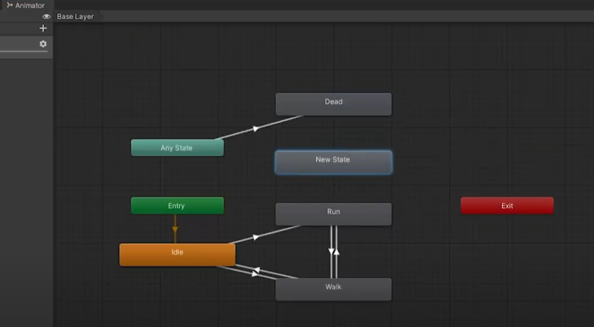

## 1. Entornos de desarrollo para juegos

Diseñar un juego requiere conocimiento de especialidades como programación, diseño y animación.

Los entornos de desarrollo ofrecen interfaz gráfica para la creación de juegos mediante el uso de herramientas.

Para la creación de juegos sencillos en plataformas 2D se puede usar:
- **Stencyl**: Creación de juegos 2D usando bloques de código que ayudan a comprender estructuras básicas de programación, no es necesario desarrollar líneas. Permite añadir imágenes para personajes que se añaden fácilmente a una escena arrastrándolos.
- **Pygame**: Entorno de desarrollo de juegos que usan el lenguaje Python. Permite creación de juegos en 2D. Se basa en el uso de sprites y bibliotecas de recursos de sonidos.
Si se requiere una potencia gráfica mayor como es el caso de 3D:
- **Unity 3D**. Una de las más usadas y mejor valoradas. Basada en C#.
- **Unreal Engine**: Permite también configuración y diseño de recursos básicos avanzados. 

## 2. Integración del motor de juegos en entornos de desarrollo

Se escoge Unity como entorno. Es necesario conocer dónde está el SDK de Android para poder compilar y enviar la aplicación al dispositivo.

Preferencias > Herramientas externas > Ruta del SDK de Android.  
Menú > Configuración de la compilación > Android.
Ajustes del proyecto > Apartados del paquete (Necesarios para Google Play):
- Resolución y presentación de la aplicación
- Icono
- Splash image previa al comienzo del juego
- Renderizado: Parámetros de renderizado para Android
- Identificación: Identificador del paquete. Nombre de la estructura del proyecto
- Versión del código
- Nivel mínimo del API de Android
- Versión de gráficos utilizados: Lugar de instalación de la aplicación por defecto en el dispositivo.
## 3. Conceptos avanzados de programación 3D

Es necesario el conocimiento de conceptos de carácter avanzado como los movimientos, las físicas y las colisiones. Unity ofrece una serie de clases para configurar y definir estas propiedades sobre modelos de personajes y objetos 3D: El `Character Controller` o controlador de personajes. 
### 3.1. La clase Character Controller
- Permite aplicar físicas y colisiones en forma de cápsula a los personajes usando un colisionador simple `Simple Collider`.
- No es un colisionador en sí mismo pero permite usar un **colisionador de cápsula** para detectar y generar colisiones con otros objetos en la escena. 
- A diferencia de los otros colisionadores basados en física, el `Character controller` no está sujeto a las fuerzas y restricciones del sistema de física de Unity. Esto permite un movimiento más fluido y controlado del personaje, ideal para personajes controladores por el jugador o NPCs. También facilita la creación de comportamientos como saltar, trepar, deslizarse.
- Al combinar un Character Controller con otros colisionadores en Unity se pueen crear personajes que interaccionan de forma realista con el entorno y otros objetos, dando una experiencia atractiva y más inmersiva al usuario. 

El **detector de colisiones** es un componente esencial que permite identificar y responder a interacciones entre objetos dentro de un entorno virtual. Utilizan primitivas de colisión como cajas delimitadores, esferas y cápsulas para definir el espacio ocupado por cada objeto y detectar posibles solapamientos o contactos entre ellos. 

Al identificar una colisión, el motor gráfico puede desencadenar eventos o acciones (reproducir sonidos, aplicar fuerzas físicas, modificar propiedades del objeto). Los detectores de colisiones son fundamentales para videojuegos y aplicaciones interactivas ya que facilitan la creación de comportamientos realistas y dinámicos en función de las interacciones entre objetos, mejorando la experiencia de usuario y la inmersión.

Los **tipos de colisionador que existen** son:
 - **Capsule Collider**: Forma de cápsula, ideal para objetos cilíndricos o personajes humanoides. 
 - **Sphere Collider:** Esfera que envuelve un objeto y detecta colisiones con otros objetos con colisionadores. Objetos esféricos o redondeados.
 - **Mesh Collider:** Muy precisos, para objetos 3D. Usa la malla del objeto para detectar colisiones. detección precisa en objetos con formas irregulares o complejas. Es más costoso en términos de rendimiento.
 - **Wheel Collider:** Especializado para simular las ruedas de vehículos. Calcula la suspensión, tracción y frenado. Interactúa con el terreno y otros colisionadores.
 - **Terrain Collider**: Trabaja con el componente Terrain de Unity para detectar colisiones en superficies con terreno irregular como montañas y valles. 
 - **Box Collider:** Colisión en forma de cubo. 

### 3.2. Sistemas de partículas de Unity

Los objetos no siempre son sólidos o con formas definidas. La representación de fluidos o líquidos en movimiento (humo, nubes, llamadas) necesita hacer uso de los efectos de los sistemas de partículas.

### 3.3. NavMesh
Basada en inteligencia artificial permite crear en Unity personajes capaces de interaccionar en escena e incluso evitar colisiones entre los elementos de la misma.

---

En el inspector de creación de un agente se definen las propiedades que caracterizarán al mismo que son:
 - **Radio**: Radio que el personaje tiene a la hora de evitar colisiones
 - **Altura**: altura máxima de los obstáculos por los que el personaje puede acceder
 - **Velocidad**: Velocidad máxima en unidades por segundo que tendrá el personaje
 - **Aceleración**: Aceleración del movimiento y acciones del personaje
 - **Área**: Camino que tomará el personaje y cuáles no puede escoger

----
## 3.4. Sistemas de coordenadas

Para determinar la dirección y orientación de los objetos, para la transformación en los modelos y para representar con exactitud todos los elementos en las escenas.
## 3.5.  Modelos y formas 3D

Mejoran la calidad de los proyectos de videojuegos. Son más reales para simuladores. En `Asset Store` de Unity hay gran cantidad de recursos gratuitos y de pagos. Gran consumo de recursos para su representación. Para ahorrar se pueden usar formas básicas con texturas para representar objetos que no serán los principales (por ejemplo, un rectángulo con textura de edificio).

## 3.6. Transformaciones. Renderización. Motor de renderizado.

Se pueden añadir transformaciones en los modelos y objetos añadidos a la escena. Por ej.: se puede cambiar el aspecto de un cubo para que adquiera el aspecto de un edificio de oficinas. 

El motor de renderizado es el encargado de aplicar transformaciones a los objetos para conseguir la representación bidimensional relativa a la cámara de la escena en 3D.

## 4. Fases de desarrollo

1. **FASE DE DISEÑO**
- Etapa previa a la programación
- Determinar aspectos más relevantes del juego
- Temática y desarrollo de la historia
- Establecer las reglas del juego
- Tras documentar la historia, separar el juego en partes. Cada una de esas partes compondrá las pantallas del juego. Debe definirse el aspecto del menú dentro de las pantallas y la colocación de objetos en la misma

3. **DISEÑO DEL CÓDIGO**
- Especificar las capas que forman el juego. Separar aspectos básicos de la funcionalidad del juego (**framework**, define cómo será el manejo de las ventanas del juego)
- El framework define el manejo y las ventanas del juego, **manejo de los ficheros**, **manejo de gráficos**, dónde se establecen los pixeles mapeados en las diferentes pantallas, y **manejo de audio**. 
- Asegurar que los objetos ocupan el espacio correcto dentro de la ventana que corresponde
- Manejo de eventos de entrada de usuario

4.  **DISEÑO DE LOS ASSETS**
- Es una de las fases más complicadas, con mayor repercusión en el juego
- Creación de elementos y modelos dentro del juego (personajes, logos, sonidos, botones, fuentes,..)

5. **DISEÑO DE LÓGICA DEL JUEGO**
- Se define cómo se comportará el juego
- Se aplican las reglas ya diseñadas y la programación del comportamiento de cada uno de los eventos del juego

6. **PRUEBAS**
- Una de las fases más importantes
- Comprobación de toda la aplicación, para valorar el comportamiento del juego, que todo concuerde, la aplicación correcta del resto de fases

7. **DISTRIBUCIÓN DEL JUEGO**
- Una vez finalizada las fases de desarrollo
- Exportar el juego y distribuirlo para que otros usuarios lo puedan adquirir, instalar y jugar, de la misma forma que se haría con una aplicación.

#### 4.1. Efectos de posprocesamiento
El posprocesamiento puede mejorar las imágenes del producto final al aplicar filtros y efectos que dotan al diseño de mayor profesionalidad.

Para añadirlos se entra en la Asset Store de Unity y se baja el Asset post-processing stack. Cuando esté listo, aparece una pestaña de Importar, la cual se selecciona. Se debe crear un perfil de posprocesado y al pulsar hay opciones como el fog o el motion blur. Este perfil debe asignarse en la cámara y Post-processing behaviour.

**Motion blur y otros efectos posprocesado**

- **Motion blur**: Simula el desenfoque de una imagen cuando los objetos principales se mueven más rápido que el tiempo de exposición de la cámara. Se usan dos técnicas: Una de ellas la simulación de velocidad de obturación, que imita el desenfoque de una cámara. No es compatible con plataformas como realidad virtual pero proporciona fuerte efecto de desenfoque y alta calidad.
- **Profundidad de campo**: Simula las propiedades de enfoque de la lente de una cámara. Le da un efecto de realidad ya que las cámaras solo pueden enfocarse plenamente en un objeto y aquellos más lejanos o cercanos están desenfocados.
- **Anti-aliasing**: Da suavidad a los gráficos porque huye del aliasing o dientes de sierra. Busca alisar y redondear los acabados de los polígonos mediante algoritmos diseñados para ello como el del antialiasing rápido y aproximado (FXAA), que es recomendada para dispositivos móviles y plataformas que no admiten vectores de movimiento. Da compensación entre el rendimiento y la calidad del borde sin difuminar demasiado el acabado de las líneas.
- **Oclusión ambiental**: Busca similitud con la realidad oscureciendo zonas como pliegues o agujeros. Es recomendable usarlo en equipos de escritorio o consolas y no en móviles porque consume bastante
- **Intensidad o grado de oscuridad producido por defecto**
- La alta precisión que alterna el uso de una textura de profundidad de mayor precisión con la ruta de reproducción adelante y la opción solo ambiente
- **Efecto niebla** (fog) para simular niebla o neblina en imágenes al aire libre ya que crea un espacio de pantalla que se vasa en la textura de profundidad de la cámara. 

#### 4.2. Valoración y análisis de resultados finales

Para los resultados finales se debe considerar si el producto satisface las necesidades o demandas para las que fue conseguido, siguiendo unos pasos concretos para una conclusión basada en hechos:

- **Análisis objetivos**: Análisis objetivo fundamentando todas las reflexiones o conclusiones de forma clara
- **Listado de aspectos positivos y negativos**: Aspectos buenos (que cumplen las expectativas esperadas en cuanto a funcionalidad y calidad y no se deben tocar) y malos (en los que es necesario introducir mejoras)
- **Ser realistas**: Evitar análisis positivistas de la situación. Analizar todos los aspectos en los que se puede evitar volver a cometer los mismos errores
- **Ser constructivos**: Aportar soluciones reales a los aspectos que no gusten o sean negativos, incidiendo en mejora de esos aspectos sin caer en la crítica. 

### 4.3. Test del producto

Se presenta el producto (generalmente prototipo) a un grupo de consumidores que lo probará y dará su opinión para crear conclusiones.

Los probadores beta (beta tester) serán usuarios con conocimientos avanzados en el campo de los videojuegos que detectarán errores para que los creadores los puedan subsanar.
La fase de testeo puede ser:
- interna: propia plantilla cuenta con varios beta tester (departamento de WA)
- externo: game tester fuera de la compañía.
Al pasar la fase de testeo, el juego obtiene la certificacion testing necesaria para poder comercializarlo. 
## 5. Propiedades de los objetos: luz, texturas, reflejos, sombras

#### Adaptación de materiales y texturas motores
- **Materiales:** Instrucciones para renderizar la superficie de un objeto
- **Shaders:** Pequeños scripts con cálculos matemáticos y algorítmicos para obtener el color de cada pixel renderizado (a partir del input de iluminación y la configuración del material). Cada uno de ellos tiene unas propiedades visibles en el Inspector. Se define el método para renderizar un objeto y puede especificar diferentes dependiendo del hardware de los gráficos del usuario final.  Para renderizar la mejor opción es la Standard shader ya que es capaz de renderizar muchos tipos de superficie de forma bastante aproximada a la realidad. 

**Propiedades de los objetos** 
- **Luz:** Definir puntos de iluminación en la escena (puede haber más de uno) así como configurar el color de la luz. Se usa para centrar atención del usuario en un punto determinado. Indica la proyección de la cámara dentro del juego.
- **Textura:** Imágenes bitmap que representan aspectos de la superficie de un material, como el color y la rugosidad. Calidad con la que se pueden apreciar todos los objetos que aparecen dentro del juego. Forman parte de esto los materiales. Para conseguir un efecto real se le aplican los shaders (color de cada uno de los pixeles que componen un objeto, algoritmo matemático)
- **Reflejos y sombras:** Representación más realista y establecer posiciones que ocupa un objeto en la escena. Se añade una especie de contorno a los componentes gráficos. Se define el color de esta sombre y la distancia aplicada a cada objeto, suelen ir acordes a la proyección de la luz de tal forma que aparece como un efecto de dicha iluminación.

### 6. Aplicación de las funciones del motor gráfico. Renderización

El **renderizado de los objetos** es el proceso de creación de una imagen 2D o 3D real dentro de una escena aplicando una serie de filtros a partir de un modelo diseñado.
Algunas de las propiedades que definen el renderizado (configurables en Unity a través de Render texture) son:
- **Tamaño**: Tamaño de la renderización en pixeles. Se llevará a cabo mayoritariamente sobre texturas
- **Antialiasing**: Aplicar filtro de suavizado sobre objetos que aparezcan con formas escalonadas
- **Depth buffer**: Definir la profundidad de los objetos 3D. Impacta sobre la calidad de la escena producida.
- **Wrap mode**: Define el comportamiento de las texturas. Por ejemplo en un terreno se define la repetición de una textura en concreto que será aplicada en toda la escena.

## 7. Aplicación de las funciones del grafo de escena. Tipos de nodos y su utilización

Unity ofrece el Animator controller que permite crear dentro de Unity un grafo de acciones para controlar todas las animaciones de un personaje, indicando un orden de ejecución en función de algunas de las reglas o condiciones del juego. 

Cada uno de estos nodos será la representación de una acción del personaje. Estos reflejarán transiciones entre los estados más básicos. Otros representan estados como muerte del personaje, caídas, colisiones con otros objetos,...

Su uso suele darse cuando se emplean movimientos directos del personaje que se repiten de forma periódica hasta el suceso de otro de los eventos.

Ej.: Personaje de forma normal camina en una dirección y al pulsar el espacio da un salto.



## 8. Análisis de ejecución. Optimización de código

**La depuración de código en Unity**
No se tiene el IDE integrado en las últimas versiones de Unity (mono develop) sino que se utiliza el IDE Visual Studio que contendrá un conjunto de herramientas para revisar el código.

El editor de texto permite añadir breakpoints al lado de las líneas necesarias y realizar depuración del código a través de Debug.

En caso de producirse errores, Unity contiene un archivo de logs llamado Debug.log donde se almacenan todos los mensajes mostrados en la consola. 
De existir errores en código, lo habitual es que Unity al compilar no permita la ejecución del código y muestre un mensaje que referencia el error o errores encontrados.

Otra herramienta útil en Unity es el Unity test runner que comprueba el código de programación en búsqueda de errores antes de realizar una compilación. Esto puede servir para corregir errores de sintaxis.

Es necesario aún así que el desarrollador tenga buenas prácticas en programación y estructuración del código para que sea lo más limpio posible y esto pueda ayudar posteriormente a la corrección y mejora de funcionalidades. 
Funciones declaradas deben ser bien definidas y no existir varias funciones con el mismo comportamiento. 

## 9. La interfaz de usuario

La **interfaz de usuario**  es el punto de interacción entre el usuario y el videojuego (conjunto de elementos gráficos y controles que permiten a los usuarios interactuar con una aplicación o sistema), tiene como objetivo brindar información necesaria para que el usuario interactúe con fluidez durante el juego. La UI facilita la comunicación entre el usuario y el software, proporcionando una representación visual y funcional de las características y opciones disponibles.

El diseño de la interfaz de usuario es crucial para la experiencia de usuario (UX), ya que incluye cómo las personas perciben y utilizan el producto.

En una **aplicación bien diseñada**, la interfaz de usuario es intuitiva, fácil de usar y atractiva visualmente. Los elementos comunes de la UI incluyen botones, menús, barra de herramientas, campos de texto, imágenes y gráficos. Estos componentes permiten a los usuarios realizar acciones, ingresar datos, navegar por la aplicación y acceder a la información.

El diseño de la UI debe tener en cuenta factores como:
- la coherencia visual
- la accesibilidad
- la eficiencia
- la retroalimentación al usuario
- adaptarse a diferentes dispositivos, resoluciones de pantalla y preferencia del usuario

En el desarrollo de aplicaciones, los diseñadores y desarrolladores trabajan juntos para crear interfaces de usuario que cumplan con los objetivos del proyecto y  satisfagan las expectativas de los usuarios, resultando en productos exitosos y agradables de usar. 

## 10. Descripción de Unity

Es uno de los motores de creación de juegos más usados en la actualidad. Puede descargarse desde la web www.unity.com/es/download

**Funcionalidades de un motor de videojuegos**
- Motor gráfico para renderizar gráficos 2D y 3D
- Motor físico que simule las leyes de la física
- Animaciones
- Sonidos
- Inteligencia artificial
- Programación o scripting

## 11. Desarrollo de proyectos 2D. Creación de Pong en Unity

El **Pong** (Tele-Pong) es un videojuego de la primera generación de videoconsolas publicado por Atari, creado por Nolan Bushnell y lanzado en 1972. ("Pong" está reservada, "pong" es genérica para videojuegos de "bate y bola"). Se produjo demanda de patentes entre Magnavox Odyssey y Atari ya que Bushnell se había inspirado de los de Magnavox cuando vió una demostración del mismo. 

### 11.0. Iniciar proyecto 
Unity Hub > New Project > 2D Core. 
El **inspector** permite visualizar y modificar las propiedades de un objeto.
1.- Seleccionar la cámara (Main Camera) y en el Inspector el Background (color de fondo)
2.- Mostrar la ventana de juego (Window > General > Game) y le indicamos que su tamaño sea de 16:9

### 11.1. Análisis del juego
Interfaz de usuario: En el Pong se necesita:
	- Paleta 1, Marcador Paleta 1, Paleta 2, Marcador Paleta 2, Linea Gol Palera 2, Linea Gol Paleta 1, Linea Decorativa, Límites del campo, Pelota. 

- **Dinámica del juego**: Jugadores se pasan la pelota entre sí. Si la pelota hace contacto con la pared superior o inferior rebota y se sigue jugando. El jugador tiene que hacer punto atravesando la línea que defiende el otro jugador. Cuando se  anota un punto se incrementa el marcador del jugador. 

### 11.2. Gráficos del juego

Se crean los elementos necesarios. Cada uno de ellos es un Sprite: Tipo de mapa de bits dibujados en la pantalla de ordenador por hardware especializado, en este caso por el motor gráfico. 

1.- Crear bola. Hierachy > 2D > Sprites > Squeare. Bola (Scale X = 0.3, Y = 0.3 para hacerla más pequeña)
2.- Crear primera pala. También un Square pero con Position X = 7.5.; Scale (X = 0.3, Y = 1.5)
3.- Crear segunda pala. También un Square pero con Position X = -7.5.; Scale (X = 0.3, Y = 1.5)
4.- Crear las las paredes.
Position = 4.5 Scale X = 17  Y = 0.2 Z = 1
Position = -4.5 Scale X = 17  Y = 0.2 Z = 1
Position = 8.4 Scale X = 0.2  Y = 9 Z = 1
Position = -8.4 Scale X = 0.2  Y = 9 Z = 1
5.- Crear la línea divisoria Position 0; Scale X = 0.01 Y = 9 Z = 1

### 11.3. Lógica del juego

La **lógica del juego** es la encargada de procesar todos los eventos del usuario y dibujar continuamente la escena del juego.

En el caso del Pong se añadirá BoxCollider2D a cada uno de los sprites, salvo a la línea central (que solo es visual). Se seleccionan todos los elementos y se pincha en "Add Component". En Physics 2D se escoge Box Collider 2D. En el inspector de ven una serie de atributos.

En los sprites se pueden aplicar físicas y colisiones de determinadas formas.

Se proporciona un colisionador simple "Simple Colider" que hace que el personaje o el objeto se mueva por la escena y no haga movimientos extraños.
El "Box Collider" es una colisión en forma de cuadrado o de cubo. Se emplean en objetos de forma cúbica como una caja o un cofre o un cuadrado en 2D.

#### Indicar los Sprites Gol como Triggers

Se activa un disperador o trigger para que en los sprites de las porterías/goles se dispare un aviso cuando la pelota les toque. Para ello en los Box Collider 2D de los Sprittes se selecciona `Is Trigger`

#### Elementos en movimiento físico (RigidBody)

Se debe añadir un componente `RigidBody` a todos los elementos que estén influenciados por las leyes físicas. 
Para simular el rebote de una pelota en paredes o palas basta con tener Colliders, pero si las paredes afectan físicamente al movimiento de la pelota y se quiere un rebote físicamente realista se necesita un Rigidbody adjunto a las paredes o las palas.
Esto permite que se ejerzan fuerzas sobre la pelota y rebote con realismo. Por ejemplo si la pelota es redonda cambiará el ángulo de rebote dependiendo de la zona donde impacte en la pala. 

Se elige el componente **Bola** y se añade el "RigidBody2D". Como no rota, se congela la rotación del eje Z (freeze rotation Z).  El tipo se mantiene como `Dynamic` y se pone el `GravityScale` a 0 (Es más fácil implementar un personaje volador apagando su gravedad en lugar de simular las fuerzas que lo mantienen en vuelo)
Para asignar `RigidBody` a las **palas** tiene que establecerse el Body Type de las 2 palas en `Kinematic` (van a controlarse por medio de un script)
En caso de asignar `RigidBody` a las **paredes**, estas serían de tipo `Static`.

#### Física de la bola

Para que la bola tenga un rebote perfecto sin pérdida de energía se añade un Physic Material como "Rebote 2D". Project > Create > Physics Material 2D > (Rebote Friction = 0 Bounciness = 1) 

#### Física de las palas

El movimiento de las palas se va a controlar mediante un Script (Create > C# Script)

- Se establece un parámetro que será el factor de velocidad en el movimiento de las palas (multiplicará ese factor por el tiempo que están presionadas las teclas correspondientes) 
`private float velocidad = 7f;`

- Se programa el método `Update` que se actualiza a cada frame. 
	- Se recoge el movimiento de las teclas arriba y abajo `Input.GetAxisRaw("Vertical");`
	- Se mueve la pala
		`transform.position += new Vector3(0, movimiento * velocidad * Time.deltaTime, 0);`


#### Componente Transform
Representa la posición, rotación y escala de un objeto en el espacio tridimensional. Cada objeto en una escena de Unity tiene un componente `Transform` que se utiliza para manipular la ubicación y el aspecto del objeto en la escena.

##### Atributos
Sus atributos principales son:
- **Position**: Representa la posición del objeto en el espacio con relación al origen de la escena, ya sea bidimensional (`Vector2`) o tridimensional (`Vector3`), mediante estructuras que representan la posición de un objeto.
- **Rotation**: Representa la rotación del objeto en el espacio tridimensional utilizando un `Quaternion`. Define cómo se orienta en relación con los ejes X, Y y Z.
- **Scale**: Representa la escala del objeto en cada uno de los ejes X, Y, Z. Define el tamaño del objeto en relación con el tamaño original. 

##### Métodos
- Translate(): Mover un objeto
- Rotate(): Rotarlo
- LocalScale(): Ajustar su escala

Time.deltaTime dice cuánto tiempo ha pasado desde que se renderizó el último cuadro de juego. Así puede asegurarse que las cosas en movimiento se muevan a la misma velocidad en diferentes dispositivos sin importar si el juego se ejecuta rápido o lento, la velocidad de fotogramas del juego o la frecuencia de refrezco del dispositivo. 

```csharp
public class Pala : MonoBehaviour
{
	// Se indica [SerializeField] para poder verlo desde el inspector de Unity
	[SerializeField] private float velocidad = 7f;

	void Update()
	{
		// Devuelve 1 o -1 si se pulsan las teclas arriba (w) o abajo (s)
		float movimiento = Input.GetAxisRaw("Vertical");
		// Movemos la Pala en base al movimiento e las teclas en ejes (x, y, z)
		transform.position = new Vector2(0,
									movimiento * velocidad * Time.deltaTime,
									0);
	}
}
```


#### Independizar el movimiento de las palas y añadir límites de las palas

Para eso se va a Edit > Project Settings y en Input Manager se observan dos entradas "Vertical". Se elimina la de más abajo. Se duplica la de más arriba.  En una se le indica que use las teclas arriba y abajo y en otra que use las teclas s y w.

Al estar establecido a Kinematic, no detecta las colisiones con las paredes de arriba y de abajo. Para evitar este problema se indican los límites de movimiento de estas.

Se modifica el script: 

```csharp
public class Pala : MonoBehaviour
{
	// Se indica [SerializeField] para poder verlo desde el inspector de Unity
	[SerializeField] private float velocidad = 7f;

	void Update()
	{
		float movimiento;
		// Devuelve 1 o -1 si se pulsan las teclas arriba (w) o abajo (s)
		if (this.name = "Pala1")
			movimiento = Input.GetAxisRaw("Vertical1");
		else
			movimiento = Input.GetAxisRaw("Vertical2");
		// Movemos la Pala en base al movimiento e las teclas en ejes (x, y, z)
		float postY = transform.position.y + (movimiento * velocidad * Time.deltaTime);
		if ((posY < 3.5f) && (postY > -3.5f))
			transform.position = new Vector2(transform.position.x,
									transform.position.y,
									0);
	}
}
```


#### Movimiento de la bola

Se crea un script `Bola` (C# Script > Create > Bola) y se asigna al elemento Bola en su Rigidbody 2D para poder trabajar con él. 

La idea es que la bola se mueva de forma aleatoria con cuatro posibles direcciones (-1,1), (1,1), (-1,-1), (1,-1)

```csharp
public class Bola : MonoBehaviour { 
	// Establecemos una velocidad inicial
	[SerializeField] private float velocidadInicial = 4f;
	// Cogemos referencia a su RigidBody
	private Rigidbody2D bolaRb;
	// Start is called before the first frame update
	void Start()
	{ 
		bolaRb = GetComponent<Rigidbody2D>();
		Lanzar(); 
	}
	// Método que se encarga de lanzar la bola en el comienzo
	private void Lanzar()
	{
		float velocidadX = Random.Range(0, 2) == 0 ? 1 : -1;
		// Range nos da 0 o 1 y lo convertimos a 1 o -1
		float velocidadY = Random.Range(0, 2) == 0 ? 1 : -1;
		// Asignamos a la velocidad de la bola un Vector2 y la multiplicamos
		// por esa velocidad inicial
		bolaRb.velocity = new Vector2(velocidadX, velocidadY) * velocidadInicial; 
		}
		// Update is called once per fram
		 void Update()
		 {
		 }
}
```

Para evitar que el juego sea monótono o predecible se puede incrementar gradualmente la velocidad de la bola cada vez que es impactada por una de las palas.
Se le puede añadir un Tag a las palas (Boton derecho, Add tag) y asignarselo a las dos palas.

En el código se puede indicar que aumente un 10% más su velocidad cada vez que es impactada la bola con una de las palas. 
```csharp
public class Bola : MonoBehaviour {
// Establecemos una velocidad inicial y valorDeMultplicacion
[SerializeField] private float velocidadInicial = 4f;
[SerializeField] private float valorDeMultiplicacion = 1.1f;
// Cogemos referencia a su RigidBody
private Rigidbody2D bolaRb;
// Start is called before the first frame update
void Start()
{ 
	bolaRb = GetComponent<Rigidbody2D>();
	Lanzar();
}


// Método que se encarga de lanzar la bola en el comienzo
private void Lanzar()
{
	float velocidadX = Random.Range(0, 2) == 0 ? 1 : -1;
	// Range nos da 0 o 1 y lo convertimos a 1 o -1
	float velocidadY = Random.Range(0, 2) == 0 ? 1 : -1;
	// Asignamos a la velocidad de la bola un Vector2 y la multiplicamos por esa velocidad inicial
	bolaRb.velocity = new Vector2(velocidadX, velocidadY) * velocidadInicial;
}
	// Método para saber cuando se produce una colisión
private void OnCollisionEnter2D(Collision2D collision)
{
	//Verificamos si colisiona con un objeto con TAG "Pala" => aumentamos velocidad
	if(collision.gameObject.CompareTag("Pala")) {
	bolaRb.velocity *= valorDeMultiplicacion;
	}
}
}
```

Para evitar que la bola incremente tanto su velocidad que los jugadores no puedan verla se puede seleccionar la opción en el Sprite: Collision Detection > Continuous.

#### Poner los marcadores

Hierachy > UI > Test - TestMeshPro
Se crea un nuevo Canvas y se indican los valores
	UI Scale Mode: Scale With Screen Size
	Reference Resolution: X=1920 , Y=1080

Se crea un objeto vacío ControladorJuego  y un script con el mismo nombre asociado al objeto. Este manejará el marcador del juego y el restablecimiento de la posición inicial del juego tanto para la bola como para las palas. 

Como tenemos los elementos dentro del visor de Hierachy podemos arrastrar visualmente los componentes a utilizar.

Se crean las etiquetas para las barras de Gol y se le asignan a los sprites de cada zona de gol.
En el script de la bola, si se lanza un trigger, indica que tocó una de las dos zonas de gol. 

```csharp
using UnityEngine;
using TMPro;// Librería para los Textos
public class ControladorJuego : MonoBehaviour {
	// Textos de los marcadores
	[SerializeField] private TMP_Text marcadorPala1;
	[SerializeField] private TMP_Text marcadorPala2;
	// Componentes transform de las palas y la bola => para reiniciar posición
	[SerializeField] private Transform pala1Transform;
	[SerializeField] private Transform pala2Transform;
	[SerializeField] private Transform bolaTransform;
	// Variables que almacen el valor de las puntuaciones
	private int golesPal1, golesPala2;
	
	// Patrón Singleton para tener una única instancia
	private static ControladorJuego instance;
	public static ControladorJuego Instance { 
		get { 
				if(instance==null) {
					 instance = FindObjectOfType<ControladorJuego>(); 
				 } 
				return instance; 
				 } 
			 }
	}
	public void GolPala1() { 
		golesPala1++;
		marcadorPala1.text = golesPala1.ToString();
	}
	public void GolPala2() { 
		golesPala2++;
		marcadorPala2.text = golesPala2.ToString();
	}
	// Cuando se anota un punto / gol reinciamos posiciones de las palas y de la bola
	public void Reiniciar() {
		pala1Transform.position = new Vector2(pala1Transform.position.x, 0);
		pala2Transform.position = new Vector2(pala2Transform.position.x, 0);
		bolaTransform.position = new Vector2(0, 0);
	}		 
}
```


## 12. Otro proyecto en Unity (Space Invaders)

**Interfaz gráfica**
Se insertarán elementos desde la parte visual y no desde código. Desde Hierarchy, se seleccionará GameObject > UI > Canvas. (Muchos componentes que pueden ser usados)

Para visualizarlo en el Canvas se añade UI Panel (GameObject > UI > Panel)

##### Texto
Se inserta un texto (Un Text o un Text MeshPro que tiene mas funciones)
En Assets aparece la carpeta del TestMesh Pro instalado y añadido al proyecto. (la primera vez en seleccionarlo lo pedirá instalar)

Se definen las propiedades de texto (posición, punto de anclaje de referencia, texto,...) en las opciones del panel. 
Con Autosize se permite que el tamaño del texto se adapte al camino de tamaño del objeto (Autosize Min y Autosize Max)

##### Botón
Se inserta un botón (Un Button o un Button MeshPro que tiene más funciones)
Se centra alineado en la parte inferior. Opciones: RectTransform. Icono. Presionando Shit + Alt. 
Se modifica el diseño del botón.  Normal color: normal; Hightlighted Color: al pasar el ratón por encima. Pressed Color: presionado. Selected Color: seleccionado. Disabled Color: no disponible. 


##### Imagen
Se arrastra la imagen al directorio `images`. Se inserta una de tipo Raw Image. Arrastrando la imagen al marco que se ha añadido en la barra de propiedades (Texture).

##### Scene
Se añade una nueva Scene. En el directorio Scripts, se crea un fichero C#. Se carga la nueba escena en la función `startGame()` SceneManagement. 
La escena puede contener un layout tan grande como se quiera. La cámara se desplazará para formar la parte que se quiera. 

**Se puede descargar contenido de Asset Store.**
Se importa en Import. Se crea nueva carpeta en Assets. Ahí están las diferentes animaciones incluidas para el personaje.
Idle es el personaje quieto.
Se selecciona la primera imagen y se arrastra a la pantalla, creándose un Game Object. 
El Sprite Renderer pinta el Sprite en el juego. 

### Space Invaders

Space invaders (Supēsuinbēdā, en Japón) fue lanzado en 1978 por la compañía de videojuegos Taito. El cañón que dispara barras laser representa al jugador. Este puede esconderse detrás de cualquiera de las cuatro torchka (pillboxes). 
Hay tres tipos de invasores: cangrejo (se ha convertido en un símbolo icónico asociado a salas de arcade y juegos en general), calamar y pulpo. Aparecen en un enjambre de múltiples filas y se mueven desde la parte superior hasta la inferior de la pantalla. 
Objetivo del juego: Eliminar a todos los invasores antes de que lleguen a la parte inferior de la pantalla mientras se esquiva y se esconde detrás de las torchkas. Además del enjambre, también hay un OVNI que aparece de vez en cuando. 

#### Empezar el proyecto
En la carpeta `Assets/RW` se encuentran los siguientes directorios:
- **Animaciones**: Animaciones prehechas y animador para prefabs (ej.: de bala y explosión)
- **Prefabs:** Prefabs usados por el proyecto
- **Recursos:** Fuentes y texturas
- **Escenas:** Escena principal con la que se trabajará
- **Scripts:** Scripts del proyecto
- **Sonidos:** Efectos de sonido y ficheros de música
- **Sprites:** Arte pixelado para el proyecto

#### Configuración del juego

Editar > Configuración del proyecto > Físicas 2D puede verse la Matriz de Colisión de Capas. (Dos capas personalizadas: Heroe y Enemigo). 

## Controles

**CannonControl**
```csharp
[SerializeField] private float speed = 500f;

// Usar la bala
[SerializeField] private Transform muzzle;
[SerializeField] private AudioClip shooting;
[SerializeField] private float coolDownTime = 0.5f;
[SerializeField] private Bullet bulletPrefab;

private void Update()
{
	if (Input.GetKey(KeyCode.D)) {
		transform.Translate(speed * Time.deltaTime, 0, 0);
	} else if (Input.GetKey(KeyCode.A)) {
		transform.Translate(-speed * Time.deltaTime, 0, 0);
	}
	// Bala
	shootTimer += Time.deltaTime;
	if (shootTimer > coolDownTime && Input.GetKey(KeyCode.Space))
	{
		shootTimer = 0f;
		Instantiate(bulletPrefab, muzzle.position,
		Quaternion.identity);
		GameManager.Instance.PlaySfx(shooting);
	}
}
```

- `speed` controla la velocidad del cañón
- `Update` verifica si el jugador mantiene presionadas las teclas D o A para mover a derecha o izquierda

Se incrementa `shootTimer` en cada fotograma hasta que alcanza `coolDownTimer`. Si el jugador mantiene presionado el espacio, el código reinicia `shootTimer` y e instancia `bulletPrefab` en `muzzeld.position`. También reproduce el efecto de sonido de disparo usando `PlaySfx` dentro de `GameManager`

**Bullet**
```csharp
private float speed = 200f;
[SerializeField] private float lifeTime = 5f;
internal void DestroySelf()
{
	gameObject.SetActive(false);
	Destroy(gameObject);
}
private void Awake()
{
	Invoke("DestroySelf", lifeTime);
}
private void Update()
{
	transform.Translate(speed * Time.deltaTime * Vector2.up);
}
private void OnCollisionEnter2D(Collision2D other)
{
	DestroySelf();
}
```

- `Update` mueve la bala cada fotograma hacia la parte superior
- `DestroySelf` para destruir el `GameObject` de la bala. Antes de llamar a `Destroy` se desactiva la bala porque la destrucción tarda algunos fotogramas en procesarse pero la desactivación es casi instantánea.
- `Awake` invoca a `DestroySelf` para destruir la bala automáticamente después de unos segundos definidos. También se llama al colisionar con otro `GameObject`

**GameManager**
```csharp
internal static GameManager Instance;
[SerializeField] private AudioSource sfx;
internal void PlaySfx(AudioClip clip) => sfx.PlayOneShot(clip);
private void Awake()
{
	if (Instance == null)
	{
		Instance = this;
	}else if (Instance != this)
	{
		Destroy(gameObject);
	}
}
```

`GameManager` se convierte en un Singleton. Además añade un método de utilidad `PlaySfx` que acepta un `Audio Clip` y lo reproduce usando la fuente de audio sfx. 

**SimpleAnimator** (Se usará para animar a los invasores)

**InvaderType**
```csharp
private struct InvaderType
{
	public string name;
	public Sprite[] sprites;
	public int points;
	public int rowCount;
}

[Header("Spawning")]
[SerializeField] private InvaderType[] invaderTypes;
[SerializeField] private int columnCount = 11;
[SerializeField] private int ySpacing;
[SerializeField] private int xSpacing;
[SerializeField] private Transform spawnStartPoint;
private float minX;

private void Start()
{
	minX = spawnStartPoint.position.x;
	GameObject swarm = new GameObject { name = "Swarm" };
	Vector2 currentPos = spawnStartPoint.position;
	int rowIndex = 0;
	foreach (var invaderType in invaderTypes)
		{
		var invaderName = invaderType.name.Trim();
		for (int i = 0, len = invaderType.rowCount; i < len; i++)
		{
			for (int j = 0; j < columnCount; j++)
			{
				var invader = new GameObject() { name = invaderName };
				invader.AddComponent<SimpleAnimator>().sprites =
				invaderType.sprites;
				invader.transform.position = currentPos;
				invader.transform.SetParent(swarm.transform);
				currentPos.x += xSpacing;
			}
		currentPos.x = minX;
		currentPos.y -= ySpacing;
		rowIndex++;
		}
	}
}
```

Este código define una estructura InvaderType.
● El array `sprites` almacena todos los sprites asociados con el tipo de invasor, que `SimpleAnimator` usa para animar al invasor.
● `rowCount` es el número de fi las que el tipo de invasor tendrá en la nube.
● `name` almacena el nombre del tipo para el invasor y points almacena la contribución a la puntuación si el jugador elimina un invasor de este tipo. Estos serán útiles más adelante

● invaderTypes: Representa todos los tipos de invasores en uso.
● columnCount: Número total de columnas para la nube de invasores.
● ySpacing: El espacio entre cada invasor en la nube a lo largo del eje Y.
● xSpacing: El espacio entre cada invasor en la nube a lo largo del eje X.
● spawnStartPoint: Punto de aparición para el primer invasor.
● minX: Almacena el valor mínimo de la posición X para la nube.

● Este código establece minX dentro de Start. Luego crea un GameObject
vacío llamado Swarm.
● xSpacing e ySpacing actualizan currentPos a lo largo de los ejes X e Y,
respectivamente.
● currentPos.x se incrementa después de cada iteración de invasor en la fi la.
● Después de que se completa una fi la, currentPos.y disminuye. Iterando
sobre los miembros de invaderTypes, para cada invaderType, iteras fi la por
fi la para crear GameObjects de invasores individuales en la posición
currentPos.
● xSpacing e ySpacing actualizan currentPos a lo largo de los ejes X e Y,
respectivamente.
Cada GameObject de invasor creado tiene su nombre establecido en
invaderName. Luego añades un componente SimpleAnimator, y asignas
su array de sprites a los sprites asociados con el invaderType.
● Finalmente, el invasor se convierte en hijo de Swarm y su posición se
establece en currentPos.

Y con esto ya debe ser más que suficiente......