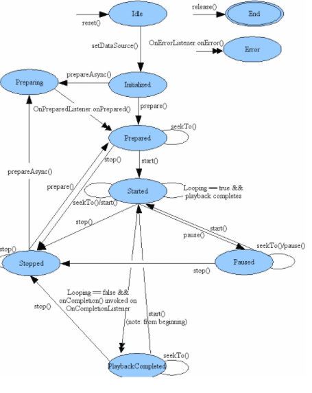

Una aplicación multimedia es aquella que puede procesar, reproducir, transmitir, almacenar contenidos multimedia. Estos están compuestos por diversos medios:
- Texto (sin formato, con formato, lineal, hipertexto)
- Imágenes (puntos/píxeles, obtenidas mediante algún medio de digitalización), múltiples formatos
- Audio (contiene voz, música, cualquier sonido registrado o sintetizado)
- Video (sucesión de imágenes a gran velocidad)
- Animaciones (similar al vídeo pero con imágenes generadas por ordenador)
- Cualquier otro medio de representación de contenidos...

**Cada medio** tiene su **propio formato**, **estructura**, **codificación**, **comprensión**.
Muchos contenidos multimedia estarán relacionados con el **tiempo** (cambian conforme este avanza...) por lo que deben de ser generados en condiciones estrictas de tiempo para que el flujo de información sea apropiado.
Además deben ser **interactivas** para decidir y seleccionar qué se quiere realizar, rompiendo estructura lineal de información. 

## 1. Gráficos

- Con la API gráfica de Android es posible realizar gráficos vectoriales, manipular imágenes, animaciones, operar con textos o gráficos 3D...
- En la creación e una aplicación es importante considerar cuáles son sus exigencias gráficas para usar la técnica más adecuada. 
- Gráficos y videos en Android: https://developer.android.com/develop/ui/views/graphics/drawables?hl=es

Los gráficos puede representarse:
- **Dibujándolos  en una `View` del layout:** Se definen los gráficos y el dibujo se gestiona por el proceso de dibujado en la jerarquía de la vista. Útil para dibujos de gráficos sencillos que no tengan que cambiar dinámicamente. (Gráfico estático, imagen predefinida...)
- **Dibujándolos directamente en un `Canvas`:** Se llama al método `onDraw()` pasándole el `Canvas` o a uno de los métodos `draw..()` como `drawPicture()`... Es lo mejor si la aplicación necesita redibujarse regularmente.


### 1.1. Clase `Canvas`

- Representa un lienzo, una superficie sobre la que dibujar.
- Se necesita un pincel (`Paint`) indicando color, grosor de trazo, transparencia..

- Lo que debe dibujarse en el lienzo debe escribirse en el método `onDraw()`, sobrescribiendo este método en la interfaz de usuario.
- Como las vistas se dibujan con frecuencia (ejecución de `onDraw()`varias veces) es necesario un método `init()` que se llamará desde el constructor de `Canvas`

- Hay métodos para dibujar líneas, círculos, rectángulos, texto... 

| Función                         | Métodos                                                                                                                                                                                                                                              |
| ------------------------------- | ---------------------------------------------------------------------------------------------------------------------------------------------------------------------------------------------------------------------------------------------------- |
| **Dibujar figuras geométricas** | - `drawCircle(float cx, float cy, float radio, Paint paint)`<br>- `drawOval(RectF rect, Paint paint)`<br>- `drawRect(RectF rect, Paint paint)`<br>- `drawPoint(float x, float y, Paint paint)`<br>- `drawPoints(float[] pts, Paint paint)`           |
| **Dibujar líneas y arcos**      | - `drawLine(float iniX, float iniY, float finX, float finY,Paint paint)`<br>- `drawLines(float[] pts, Paint paint)`<br>- `drawArc(RectF rect, float startAngle, float angle,boolean useCenter,Paint paint)`<br>- `drawPath(Path trazo, Paint paint)` |
| **Dibujar texto**               | - `drawText(String <span>text</span>, float x, float y, Paint paint)`<br>- `drawTextOnPath(String text, Path path, float hOffset, float vOffset, Paint paint`)<br>- `drawPosText(String text, float[] position, Paint paint)`                        |
| **Dibujar imágenes**            | - `drawBitmap(Bitmap bitmap, Matrix matrix, Paint paint)`                                                                                                                                                                                            |
| **Tamaño del Canvas**           | - `int getHeight()`<br>- `int getWidth()`                                                                                                                                                                                                            |

**Modificar el área a dibujar**
Área rectángular: `Canvas.clipRect(float left, float top, float rigth, float bottom`
Otro tipo de área: `Canvas.clipPath(Path path`  `Canvas.clipRegion(Region region)`

Se pueden definir matriz de 3x3 con `Canvas.setMatrix(Matrix matrix)` que permitirá transformar coordenadas aplicando traslación, escala o rotación. 
```android
concat(Matrix matrix)
traslate(float dx, float dy)
scale(float sx, float sy)
rotate(float decrees, float px, float py)
skew (float dx, float dy)
```

```java
public class CustomView extends View {
    private Paint paint;

    public CustomView(Context context, AttributeSet attrs) {
        super(context, attrs);
        init();
    }

    private void init() {
        paint = new Paint();
        paint.setAntiAlias(true);
    }

    @Override
    protected void onDraw(Canvas canvas) {
        super.onDraw(canvas);

        // Establecer el color de fondo
        canvas.drawColor(Color.WHITE);

        // Dibujar una línea
        paint.setColor(Color.RED);
        paint.setStrokeWidth(5);
        canvas.drawLine(50, 50, 200, 200, paint);

  
		// Limitar el área de dibujo canvas.clipRect(50, 50, 300, 300);
		canvas.clipRect(50, 50, 300, 300);

        // Dibujar un arco
        paint.setColor(Color.BLUE);
        paint.setStyle(Paint.Style.STROKE);
        RectF rectF = new RectF(100, 100, 300, 300);
        canvas.drawArc(rectF, 0, 180, false, paint);

        // Dibujar texto
        paint.setColor(Color.BLACK);
        paint.setTextSize(50);
        paint.setStyle(Paint.Style.FILL);
        canvas.drawText("Hola Canvas", 100, 400, paint);

        // Dibujar una imagen
        Bitmap bitmap = BitmapFactory.decodeResource(getResources(), R.drawable.ic_launcher); // Asegúrate de tener un recurso de imagen llamado ic_launcher
        canvas.drawBitmap(bitmap, 100, 450, paint);
    }
}
```


### 1.2. Clase `Paint`

Color, estilo, grosor de gráfico vectorial.
Se usan enteros de 32 bits, divididos en 4 campos de 8 bits (alfa, rojo, verde y azul, ARGB) Cada campo puede tomar 2^8 = 256 valores diferentes.
En la transparencia 0 es transparente y 255 fondo opaco. 

- `setStrokeWidth(float grosor)`: Grosor del trazado
- `setStyle(Paint.Style estilo)`: Estilo de trazado. FILL (rellena la figura), FILL_AND_STROKE (rellena figura y perímetro), STROKE (solo perímetro)
- `setShadowLayer(float radio, float dx, float dy, int color)`: Segundo trazado a modo de sombra
- `setTextAlign(Paint.Align justif`: Tipo de justificación CENTER, LEFT, RIGHT
- `setTextsize(float)`: Tamaño
- `setTypeface(Typeface fuente)`: Fuente. MONOSPACE, SANS_SERIF, SERIF. (También se puede definir negrita / itálica)
- `setTextScaleX(float escala X)`: Factor de escala horizontal. Por defecto 1.0
- `setTextSkewX(float inclinacionX)`: Factor de inclinación del eje X. Por defecto 0.
- `setUnderlineText(boolean)`: Texto subrayado

- `setColor(int)`: Color / `setAlpha(int alfa)` : Transparencia

El **color** puede definirse como:

```java
int miColor;

miColor = Color.RED ; // Rojo
miColor = Color.argb(127, 0, 255, 0) ; // Verde transparente
miColor = 0x7F00FF00 ; // Verde transparente
miColor = getResources().getColor(R.color.color_Triangulo);
```

La mejor opción no es definir los colores por código sino la última: usar el fichero de recursos `res/values/colors.xml`

### 1.3. Clase `Path`

Se puede definir un trazado a partir de segmentos de líneas y curvas (caminos geométricos con segmentos de líneas rectas, curvas, curvas cuadráticas y cúbicas). También puede dibujarse un texto sobre el trazado determinado. 

Métodos como drawColor`:
- `moveTo(int,x,int y)`: Mueve el cursor a donde se indica
- `lineTo(int x, int y)`: Dibuja línea desde el punto actual hasta donde se indica
- `cubicTo(int, int, int, int, int int)`: Cúbica desde el punto actual hasta (int, int), con dos puntos de control (int, int) e (int, int)
- `arcTo`: Dibujar un arco
- `addCircle`: Agregar un círculo
- `addRect`: Agregar un rectángulo

```java
// Definir trazo
Path path = new Path();

// Definir círculo
path.addCircle(160, 160, 120, Directoion.CCW);
path.drawColor(Color.GRAY);

// Crear pincel y definir caracteristicas del pincel para dibujar
Paint paint = new Paint();
paint.setColor(color.RED);
paint.setStrokeWidth(5);
paint.setStyle(Style.FILL_AND_STROKE);

// Dibujar trazo sobre el canvas con los datos del pincel
canvas.drawPath(path, paint);

// Caracteristicas de pincel para escribir texto
paint.setStrokeWith(1);
paint.setStyle(Style.FILL);
paint.setTextSize(20);
paint.setTypeface(Typeface.MONOSPACE);
// Escribir texto
canvas.drawTextOnPath("Hola a todos", path, 10, 40, paint);
```

### 1.4. Movimiento a objetos

El dibujo en 2D en Android puede ser:
- Gráficos y animaciones dentro de un View: El sistema dibuja y anima por nosotros. Es recomendada para objetos estáticos o de poco procesamiento. Ej.: Ajedraz, mahjong, sudoku
- Dibujar dentro de un canvas: Si el objeto está en movimiento es mejor usar un Canvas donde el desarrollador tome el control: Ya sea sobre el hilo principal de la aplicación (UI Thread) si hay no consume demasiado tiempo o en un hilo aparte que diuje tan rápido como sea posible. 

### 1.4.1. Clase `SurfaceView`

- Superficie de dibujo dedicada dentro de la herencia de `View`. Ofrece superficie de dibujo a un hilo secundario de la aplicación para que esta no tenga que esperar. El subproceso podrá dibujar en su `Canvas` a su ritmo. 

Pasos
1. Clase que hereda de `SurfaceView`
2. Clase que implementa `SurfaceHolder.Callback` (notificará la información sobre la superficie subyacente: crea, cambia o es destruida)
	- Debe crearse una variable global `SurfaceHolder` e inicializarla llamando al método `getHolder()`
	- Debe notificarse a `SurfaceHolder` que se quieren recibir devoluciones de llamada `SurfaceHolder` llamando a `addCallback()`
	- Deben implementarse los métodos `surfaceCreated`, `surfaceDestroyed` . `surfacesChanged`
3. Añadir la clase creada al `activity_main.xml`

```xml
<com.example.surfaceview.GameSurfaceView
        android:id="@+id/gameSurfaceView"
        android:layout_width="match_parent"
        android:layout_height="match_parent"
        app:layout_constraintBottom_toTopOf="parent"
        app:layout_constraintEnd_toEndOf="parent"
        app:layout_constraintStart_toStartOf="parent"
        app:layout_constraintTop_toTopOf="parent" />
```
### 1.4.2. Implementación del hilo secundario

El hilo secundario llevará a cabo todos los procedimientos de dibujo al Canvas. Esta es la que tiene la mayor carga de trabajo. 
En caso de ser un juego, es el motor de juego (Game Engine) porque manejará la lógica del juego (cargar recursos, mover personajes, controlar colisiones), procesará las entradas del usuario, dibujará en pantalla y actualizará los componentes.

Por ejemplo: Crear un juego que pinte un círculo en la pantalla de la superficie en el lugar donde se ha pulsado.
Para eso
	a. Se crea una clase interna `GameThread`
	b. Se crea método `update()` para la ejecución principal del juego. No hay que controlar nada ahora mismo (vacío)
	c. Se crea método que dibuje sobre la pantalla `doDraw()`. Dibuja el círculo en el punto (x,y) del evento `MotionEvent`
	d. Sobrescribir el método `run()` que obtiene un objeto `Canvas` a través de `SurfaceHolder`; actualiza la lógica del juego llamando a `update()`, dibuja sobre el objeto `Canvas` llamando a `doDraw()`, se le indica a la pantalla principal que debe mostrar lo dibujado sobre el Canvas con `unlockCanvasAndPost(canvas)`

```java
public class GameSurfaceView extends SurfaceView implements SurfaceHolder.Callback {
    private SurfaceHolder surfaceHolder;

    // Constructor de la clase GameSurfaceView
    public GameSurfaceView (Context context, AttributeSet attrs) {
        super(context, attrs);
        surfaceHolder=getHolder();
	    surfaceHolder.addCallback(this);
    }
 
    public void surfaceCreated(SurfaceHolder holder) {
    }
 
    public void surfaceDestroyed(SurfaceHolder holder) {
    }
 
    public void surfaceChanged(SurfaceHolder holder, int format, int width,  int height) {
    }

	class GameThread extends Thread {
        //Flag que usamos para indicar si el hilo debe correr o no.
        private boolean flagRun = false;
        private Canvas canvas = null;
        
        @Override
        public void run() {
            //empieza el ciclo principal del juego
            while (flagRun) {
                try {
            //obtenemos una instancia al canvas de la superficie
                canvas = surfaceHolder.lockCanvas(null);
            //nos aseguramos de que solo un hilo a la vez manipule la superficie
	                synchronized (surfaceHolder) {
	                    update();//actualizamos la lógica del juego
	                    doDraw();//dibujamos sobre el canvas
	                }
                } finally {
                    if (canvas != null) {
		              surfaceHolder.unlockCanvasAndPost(canvas);
                    }
                }
            }
        }
        private void update() {
            //actualiza la lógica aquí
        }
        private void doDraw() {
            drawBall();
        }
        public void setRunning(boolean b) {
            flagRun = b;
        }
        /* This method will be invoked to draw a circle in canvas. */
        public void drawBall() {
            // Get and lock canvas object from surfaceHolder.
            Paint surfaceBackground = new Paint();
            // Set the surfaceview background color.
            surfaceBackground.setColor(Color.CYAN);
            // Dibujamos una superficide de un color
           canvas.drawRect(0, 0, GameSurfaceView.this.getWidth(), GameSurfaceView.this.getHeight(), surfaceBackground);
            // Dibujamos el círculo en las coordenadas iniciales
            canvas.drawCircle(circleX, circleY, 100, paint);
        }
    }
}
```

## 1.5. Clase `Drawable`

`Drawable` es clase abstracta que representa algo que puede ser dibujado. 
- `BitmapDrawable`: Basado en **mapas de bits** (JPG, GIF, PNG). Definible en recursos con `<bitmap>`
- `ShapeDrawable`: Gráficos a partir de primitivas **vectoriales** (fácil reescalado).  Líneas, círculos, cuadrados, trazados (Path). No es definible en XML.
- `LayerDrawable`: **Array**  de `Drawables` que son visualizados por **capas**. El que tiene mayor índice está encima. Definible en XML por `<layer-list>`
- - `StateListDrawable`: Lista de objetos `Drawable` pueden visualizarse o no a través de un máscara de bits. Definible en XML por `<selector>`
- `GradientDrawable`: **Degradado** de color que puede usarse entre botones o  fondos
- `TransitionDrawable`: **Transición** entre dos `Drawables`. Es realmente una extensión de `LayerDrawable` con transición entre la primera y la segunda capa. Definible por XML con `<transition>`
- `AnimationDrawable`: Animación **frame a frame** (fotograma a fotograma) a partir de `Drawables` Definible por XML con `<animation-list>`
- `AnimationSet`: Animación a partir de gráficos vectoriales. Animación tween (transformaciones simples posición, tamaño, rotación, transparencia). Etiquetas XML `<set>`, `<alpha>`, `<scale>`, `<translate>`, `<rotate>`


La clase `VectorDrawable` para Gráficos Vectoriales Escalables (SVG). Es útil para imágenes que no sean complejas,, ni patrones, ni degradados (para esos supuestos será mejor un mapa de bits). 


Pueden crearse descendientes de `Drawable`

##### Métodos 

- `setBounds(Rect)`: Rectángulo donde debe dibujarse el Drawable. El tamaño preferido puede averiguarse mediante `getIntrinsicHeigth()` y `getIntrinsicWith()`
- `getPadding(Rect)`: Información sobre márgenes recomendados
- `setState(int[])`: Indicar al Drawable en qué estado debe ser dibujado (con foco, seleccionado)
- `setLevel(int)`: Indicar el nivel en que se encuentra el Drawable (activo, en reposo, esperando...) o nivel de progreso entre 1-100

- Animaciones con llamada a `Drawable.Callback`.  Todo cliente debe implementar `setCallback(Drawable.Callback)`


Hay tres formas de instanciar objeto:
- Usando **imagen guardada en recursos **del proyecto
- Usando **fichero XML con las propiedades** del objeto y recuperarlo mediante `getDrawable()` y el ID que se le asigne
- Usando los **constructores de la clase**

Ejemplo: `ShapeDrawable` para dibujar un rectángulo:
```java
public class FormasDibujables extends View {
	ShapeDrawable sdRectan ;
	public FormasDibujables(Context context, AttributeSet attrs) { 
		super(context, attrs);
 		// Crear un rectángulo
		sdRectan = new ShapeDrawable(new RectShape());
		sdRectan.setBounds(200, 5, 300, 100) ; 
		// De color verde
		sdRectan.getPaint().setColor(Color.GREEN) ;
	}
	@Override 
	protected void onDraw(Canvas canvas) { 
		// Pintar el rectángulo
		 sdRectan.draw(canvas) ;
	}
}
```

### 1.5.1. Cargar imágenes

Carga de imágenes almacenadas en recursos Drawable (res/drawable-mdpi). Puede mostrarse mediante `ImageView`.
Los atributos que ayudan a configurar esta clase (y sus equivalentes de forma programática) son:
- id
- src - Archivo fuente de la imagen (`setImageResource()`)
- background - establecer color o dibujo en el fondo (`setBackgroundColor(Color.BLACK)`)
- padding - relleno de la imagen paddingRight, paddingLeft, paddingTop, paddingBottom o padding para todos
- scaleType - controlar cómo debe cambiarse el tamaño o mover la imagen para que coincida con el tamaño del componente `ImageView`. Los valores pueden ser center (centrada sin escala), center_crop (ajusta de forma que las dimensiones x e y sean iguales que la vista; centra imagen en la vista), center_inside (ajusta la imagen para que quepa en la vista), fit_center (por defecto, ajusta la imagen para que quepa en la vista y lo centra), fit_start (parte superior izquierda), fit_end (parte inferior derecha), fit_xy (establecer tamnaño exacto)

### 1.5.2. Efectos: Transiciones con `TransitionDrawable`

- Se debe llamar al método `startTransition(int tiempo)` para comenzar la transición entre las dos capas
- Puede volverse a la primera capa con `restTransition()`

1. Creamos fichero de recursos `res/drawable/transicion.xml`
```xml
<transition xmlns:android="http://schemas.android.com/apk/res/android">
    <item android:drawable="@drawable/primera"/>
    <item android:drawable="@drawable/segunda"/>
</transition>
```

2. Añadimos imagenes de recursos `primera.png` y `segunda.png` en `res/drawable` 

3. `TransitionActivity`

```java
public class TransicionActivity extends AppCompatActivity {

    @Override
    protected void onCreate(Bundle savedInstanceState) {
        super.onCreate(savedInstanceState);
        setContentView(R.layout.activity_transicion);

        ImageView imageView = findViewById(R.id.imageView);
        imageView.setImageResource(R.drawable.transicion);

        TransitionDrawable transitionDrawable = (TransitionDrawable) imageView.getDrawable();
        imageView.setOnClickListener(new View.OnClickListener() {
            @Override
            public void onClick(View v) {
                transitionDrawable.startTransition(2000);  // Duración de la transición en milisegundos
            }
        });
    }
}
```

```xml
<?xml version="1.0" encoding="utf-8"?>
<RelativeLayout xmlns:android="http://schemas.android.com/apk/res/android"
    android:layout_width="match_parent"
    android:layout_height="match_parent">

    <ImageView
        android:id="@+id/imageView"
        android:layout_width="match_parent"
        android:layout_height="match_parent"
        android:scaleType="centerCrop" />
</RelativeLayout>
```
### 1.5.3. Fondos

Se pueden definir diferentes formas de fondo (oval, anillo, rectángulo, línea, bordes redondeados, sólidos, degradados)

Archivo `rectangulo.xml`:

```xml
<shape xmlns:android="http://schemas.android.com/apk/res/android"
    android:shape="rectangle">
    <solid android:color="#FF0000"/> <!-- Color rojo -->
    <corners android:radius="8dp"/> <!-- Esquinas redondeadas -->
    <stroke android:width="2dp" android:color="#000000"/> <!-- Borde negro -->
</shape>
```

Configurar el fondo en `activity_main.xml`

```xml
<?xml version="1.0" encoding="utf-8"?>
<RelativeLayout xmlns:android="http://schemas.android.com/apk/res/android"
    android:layout_width="match_parent"
    android:layout_height="match_parent"
    android:background="@drawable/rectangulo">

    <TextView
        android:id="@+id/textView"
        android:layout_width="wrap_content"
        android:layout_height="wrap_content"
        android:text="@string/mensaje"
        android:layout_centerInParent="true"
        android:textSize="18sp"
        android:textColor="#FFFFFF"/>
</RelativeLayout>
```

### 1.5.4. Animaciones

Podemos distinguir cuatro tipos de animaciones:
- Animaciones de marcos o **Drawable**: Animaciones sencillas. Sucesión de varios `Drawable` a intervalos de tiempo específicos. Se usa `AnimationDrawable` ( en el XML `<animation-list>`)
- Animaciones de **layouts**: Para animar transición entre layouts y actividades. Tanto si se quiere cambiar toda la interfaz como solo una vista de la interfaz. Solo es necesario el diseño inicial y final para hacer la transición. 
- Animaciones de **vistas**: Conocidas como `Tween`. Permiten crear efectos de rotación, traslación, zoom y transparencia en cualquier vista. La animación se calcula entre el punto inicial y final de un objeto `View` y se suele definir en XML usando como elemento raíz una etiqueta según tipo de animación en base a su posición `<translate>`, tamaño `<scale>`, rotación `<rotate>` o transparencia `<alpha>`. Si la animación consta de un grupo de elementos se debe usar `<set>`
- Animación de **propiedades**: Animar las propiedades de un objeto. Son más completas que las animaciones de vistas que se basan en el cambio de tamaño o rotación, ya que es posible especificar qué propiedades se modificarán en el tiempo, establecer un conjunto de animaciones que se reproducen juntas, frecuencia con la que queremos actualizar cada frame, etc. Se suelen utilizar los elementos `<objectAnimator>, <valueAnimator>` y `<set>` para agruparlos cuando se definen en el XML.

##### Ejemplito de animación frame a frame

1. Se crea el XML

```xml
<?xml version="1.0" encoding="utf-8"?>
<animation-list xmlns:android="http://schemas.android.com/apk/res/android" >
    <item android:drawable="@drawable/s1" android:duration="50" />
    <item android:drawable="@drawable/s2" android:duration="50" />
    <item android:drawable="@drawable/s3" android:duration="50" />
    <item android:drawable="@drawable/s4" android:duration="50" />
    <item android:drawable="@drawable/s5" android:duration="50" />
</animation-list>
```

2. Se carga el objeto `ImageView` que alojará la animación y se establece que su fondo será el recurso XML `AnimationDrawable`
3. Se obtiene la animación compilada en `AnimationDrawable`
4. Se inicia la animación que, por defecto, se reproduce en bucle. 

```java
ImageView imgView = (ImageView)findViewById(R.id.imagen);

imgView.setVisibility(ImageView.VISIBLE);

imgView.setBackgroundResource(R.drawable.frame_animation);

AnimationDrawable frame = (AnimationDrawable) imgView.getBackground();

if(frame.isRunning()) {
    	frame.stop();
} else {
    	frame.start();
}
```
## 1.6. Gráficos 3D

**Gráficos 3D**:
 -OpenGL
 -Renderscript (3D a bajo nivel, programadas en C99, compilado a código nativo)

Android incluye soporte para gráficos mediante la API OpenGL (OpenGL ES, un aderezo a la especificación OpenGL pensado para dispositivos embebidos).
La API es similar a la API j2ME, JSR239 de OpenGL ES.

Los pasos a seguir serían:
- Escribir una subclase `View` personalizada
- Obtener un identificador para un OpenGL Context que da acceso a la funcionalidad de OpenGL
- En el método `onDraw()` de la vista, obtener un identificador para un objeto GL y usar sus métodos para realizar las operaciones. 

Más material: https://academiaandroid.com/post-series/graficos-2d-3d-en-android-opengl/

## 2. Reproducción multimedia

Recordemos:
- Android tiene elementos básicos de visualización (actividades)
- Android tiene servicios
- Las actividades controlan el ciclo de vida de las aplicaciones; el usuario cambia de actividad; el sistema guarda pila con actividades previamente visualizadas para que el usuario regrese a la actividad anterior. 
- El sistema determina cuando destruir el proceso
- Si tras eliminar el proceso, el usuario vuelve a ella, se crea un nuevo proceso pero se ha perdido el estado que tenía la aplicación. Es responsabilidad del desarrollador almacenar el estado de las actividades para que al ser reiniciada conserve su estado si se quiere. 

### 2.1. Clase `Mediaplayer`

Puede usarse para gestionar **reproducción de los archivos y secuencias de audio y vídeo**:
Pasa por diversos estados
- **initialized**: Inicializados sus recursos
- **preparing**: Preparando la reproducción
- **prepared**: Preparado para reproducir
- **started**: Reproduciendo, **paused**: En pausa
- **stopped**: Parado
- **playback completed**: Reproducción completada
- **end**: Finalizado.  **error**: Con error.

Es importante saber en qué estado se encuentra porque muchos métodos solo pueden ser llamados desde ciertos estados. Ej.: No puede ponerse en reproducción (`start()`) si no está en estado preparado. Si se hace llamada a método no admitido para ese estado, se producirá error de ejecución. 


### 2.2. Reproducir sonidos y vídeos

Es posible incluir audio y vídeo como recurso.
1. Creación de paquete `res.raw` y ubicar en ella un recurso `miCancion.mp3`
2. Incluir el código

```java
MediaPlayer mep = MediaPlayer.create(this, R.raw.miCancion);
mep.start() ;
```

3. Para parar la reproducción utilizar `stop()`. Si se quiere volver a reproducirlo, utilizar `prepare()` y luego `start()`. También puede usarse `pause()` y `start()`.

En lugar de meterlo como recurso puede reproducirse desde un fichero. Es necesario llamar al método `prepared()` (En el otro no era necesario porque la llamada a `prepare()` se hace desde `create())

```java
MediaPlayer mep = new MediaPlayer();
mep.setDataSource(Ruta_al_fichero_a_Reproducir);
mep.prepare();
mep.start();
```

Sonido en segundo plano: https://www.maestrosdelweb.com/curso-android-servicios-sonido/
Reproducir sonidos: https://trucosandroidstudio.blogspot.com/2015/03/sonido-en-android-studio-clase-soundpool.html  /Clase `Soundpool`)
Inclusión de videos http://www.androidcurso.com/index.php/recursos-didacticos/tutoriales-android/37-unidad-6-multimedia-y-ciclo-de-vida/165-la-vista-videoview

## 3. Aplicaciones multimedia

El contenido multimedia podría capturarse fácilmente usando aplicaciones que incorpora de serie el terminal Android, pero también puede ser programado mediante:
- **android.hardware.Camera**: Imágenes y vídeo
- **android.view.SurfaceView**: Renderizar imágenes capturadas por cámara
- **android.media.MediaRecorder**: Audio y vídeo
### 3.1. Captura de imagen y vídeo

Debe indicarse que la aplicación necesita del uso de la cámara del móvil en el manifest:
```xml
    <uses-feature android:name="android.hardware.camera" />
```

Si no es imprescindible puede añadirse el atributo `android:required="false"` para que google permita a los terminales sin cámara descargar la aplicación.

El programador debe comprobar la disponibilidad de cámara en tiempo de ejecución llamando a:
```java
hasSystemFeature(PackageManager.FEATURE_CAMERA);
```

La acción se delega a otra aplicación mediante un `Intent` conllevando:
1.- El `Intent`
2.- Llamada para iniciar la `Activity`
3.- Código para gestionar los datos de la imagen cuando se retorne a la aplicación.

```java
private void dispatchTakePictureIntent(int actionCode) { 
  Intent takePictureIntent =
	 new Intent(MediaStore.ACTION_IMAGE_CAPTURE);
  startActivityForResult(takePictureIntent, actionCode);
}
```


Para comprobar si el `Intent` puede ser gestionado por la aplicación:
```java
public static boolean isIntentAvailable(Context context, 
	String action) {
  final PackageManager packageManager = context.getPackageManager();
  final Intent intent = new Intent(action);
  List list = pacackageManager.queryIntentActivities(intent,
	 PackageManager.MATCH_DEFAULT_ONLY);
  return list.size() > 0; 
}
```

-------------------------

La rotación de la pantalla se puede modificar en el manifest:

```xml
<activity android:name=".MainActivity" android:screenOrientation="portrait"> </activity>
```

Permisos:
```xml
<uses-permission android:name="android.permission.CAMERA" />
<uses-permission android:name="android.permission.RECORD_AUDIO" />
<uses-permission android:name="android.permission.WRITE_EXTERNAL_STORAGE" />
```

- Con `SurfaceView`:  Permite tener espacio dedicado a dibujar los frames del vídeo para la vista y la reproducción. Muestra vista previa y reproduce el video
- Con `MediaRecorder`: Captura audio y vídeo
- Con `MediaPlater`: Reproduce el vídeo grabado
- Los botones controlan la grabación, detención y reproducción del vídeo

```java
public class MainActivity extends AppCompatActivity implements SurfaceHolder.Callback {// Deben implementar la interfaz SurfaceHolder.Callback para el manejo del SurfaceView
    private MediaRecorder mediaRecorder;
    private MediaPlayer mediaPlayer;
    private String fileName;
    private boolean recording = false;

    @Override
    protected void onCreate(Bundle savedInstanceState) {
        super.onCreate(savedInstanceState);
        setContentView(R.layout.activity_main);

// Variable del nombre del archivo
        fileName = Environment.getExternalStorageDirectory() + "/test.mp4";
// Donde se reproducira el video
		SurfaceView surface = findViewById(R.id.surface);
        SurfaceHolder holder = surface.getHolder();
        holder.addCallback(this);

// Botones de grabar, parar, reproducir
        final Button btnRec = findViewById(R.id.btnRec);
        final Button btnStop = findViewById(R.id.btnStop);
        final Button btnPlay = findViewById(R.id.btnPlay);

// Boton de grabar. Se deshabilita el de grabar y reproducir, se habilita el de detener.
// Se llama al metodo que configura el Media recorder, indicando archivo de salida.
// Se llama al metodo prepare que deja todo listo y se inicia la grabacion, actualizando el estado de recording
        btnRec.setOnClickListener(new View.OnClickListener() {
            @Override
            public void onClick(View v) {
                btnRec.setEnabled(false);
                btnStop.setEnabled(true);
                btnPlay.setEnabled(false);
                prepareRecorder();
                mediaRecorder.setOutputFile(fileName);
                try {
                    mediaRecorder.prepare();
                } catch (IOException e) {
                    e.printStackTrace();
                }
                mediaRecorder.start();
                recording = true;
            }
        });

// Boton de detener. Se deshabilita el de detener. Se habilita grabar y reproducir. Se se graba, se detine la grabacion y se reinicia la configuracion. 
// Si se reproduce, se detiene la reproduccion y se reinicia la configuracion
        btnStop.setOnClickListener(new View.OnClickListener() {
            @Override
            public void onClick(View v) {
                btnRec.setEnabled(true);
                btnStop.setEnabled(false);
                btnPlay.setEnabled(true);
                if (recording) {
                    recording = false;
                    mediaRecorder.stop();
                    mediaRecorder.reset();
                } else if (mediaPlayer.isPlaying()) {
                    mediaPlayer.stop();
                    mediaPlayer.reset();
                }
            }
        });

// Boton de reproducir: Se deshabilitan botones de grabar y reproducir y se habilita parar. Si concluye la reproduccion se habilitan los botones. Se configura el archivo a partir del cual se preoducira, se prepara el mediaPlayer y se inicia la reproduccion
        btnPlay.setOnClickListener(new View.OnClickListener() {
            @Override
            public void onClick(View v) {
                btnRec.setEnabled(false);
                btnStop.setEnabled(true);
                btnPlay.setEnabled(false);
                mediaPlayer.setOnCompletionListener(new MediaPlayer.OnCompletionListener() {
                    @Override
                    public void onCompletion(MediaPlayer mp) {
                        btnRec.setEnabled(true);
                        btnStop.setEnabled(false);
                        btnPlay.setEnabled(true);
                    }
                });
                try {
                    mediaPlayer.setDataSource(fileName);
                    mediaPlayer.prepare();
                } catch (IOException e) {
                    e.printStackTrace();
                }
                mediaPlayer.start();
            }
        });
    }

// Se coloca SurfaceHolder como display para la vista previa de grabacion y reproduccion
    @Override
    public void surfaceCreated(SurfaceHolder holder) {
        if (mediaRecorder == null) {
            mediaRecorder = new MediaRecorder();
            mediaRecorder.setPreviewDisplay(holder.getSurface());
        }
        if (mediaPlayer == null) {
            mediaPlayer = new MediaPlayer();
            mediaPlayer.setDisplay(holder);
        }
    }

// No lo implementamos
    @Override
    public void surfaceChanged(SurfaceHolder holder, int format, int width, int height) {}

//Liberacion de los recursos
    @Override
    public void surfaceDestroyed(SurfaceHolder holder) {
        if (mediaRecorder != null) {
            mediaRecorder.release();
            mediaRecorder = null;
        }
        if (mediaPlayer != null) {
            mediaPlayer.release();
            mediaPlayer = null;
        }
    }

// Se agrega metodo para preparar la grabicion configurando atributes de fuente para audio y vidoe, formato y codificado
    private void prepareRecorder() {
        mediaRecorder.setAudioSource(MediaRecorder.AudioSource.MIC);
        mediaRecorder.setVideoSource(MediaRecorder.VideoSource.CAMERA);
        mediaRecorder.setOutputFormat(MediaRecorder.OutputFormat.MPEG_4);
        mediaRecorder.setAudioEncoder(MediaRecorder.AudioEncoder.DEFAULT);
        mediaRecorder.setVideoEncoder(MediaRecorder.VideoEncoder.MPEG_4_SP);
    }
}

```

### 3.2. Captura de audio

1. **Crear `Intent`**: Para iniciar la grabación de audio.
2. **Iniciar Actividad de Grabación**: Con `startActivityForResult`.
3. **Grabar Audio**: La actividad externa maneja la grabación.
4. **Regresar y Procesar Resultado**: URI del audio grabado es procesada en `onActivityResult`.
5. **Reproducir Audio**: Usar `MediaPlayer` para reproducir el archivo grabado.

Hagamos un diseño simple de dos botones: "Grabar audio" y "Reproducir":

```xml
<!-- res/layout/activity_main.xml -->
<LinearLayout xmlns:android="http://schemas.android.com/apk/res/android"
    android:orientation="vertical"
    android:layout_width="match_parent"
    android:layout_height="match_parent">

    <Button
        android:id="@+id/btnRecordAudio"
        android:text="Grabar Audio"
        android:layout_width="wrap_content"
        android:layout_height="wrap_content" />
    <Button
        android:id="@+id/btnPlayAudio"
        android:text="Reproducir Audio"
        android:layout_width="wrap_content"
        android:layout_height="wrap_content"
        android:enabled="false" />
</LinearLayout>
```

```java
public class MainActivity extends AppCompatActivity {
    private static final int R_GRABADOR = 1;
    private Uri audioFileUri;
    private MediaPlayer mPlayer;

    @Override
    protected void onCreate(Bundle savedInstanceState) {
        super.onCreate(savedInstanceState);
        setContentView(R.layout.activity_main);

        Button btnRecordAudio = findViewById(R.id.btnRecordAudio);
        Button btnPlayAudio = findViewById(R.id.btnPlayAudio);

        btnRecordAudio.setOnClickListener(new View.OnClickListener() {
            @Override
            public void onClick(View v) {
                Intent intent = new Intent(MediaStore.Audio.Media.RECORD_SOUND_ACTION);
                startActivityForResult(intent, R_GRABADOR);
            }
        });

        btnPlayAudio.setOnClickListener(new View.OnClickListener() {
            @Override
            public void onClick(View v) {
                if (audioFileUri != null) {
                    mPlayer = MediaPlayer.create(MainActivity.this, audioFileUri);
                    mPlayer.start();
                }
            }
        });
    }

    @Override
    protected void onActivityResult(int requestCode, int resultCode, Intent data) {
        super.onActivityResult(requestCode, resultCode, data);
        if (requestCode == R_GRABADOR && resultCode == RESULT_OK) {
            audioFileUri = data.getData();
            Button btnPlayAudio = findViewById(R.id.btnPlayAudio);
            btnPlayAudio.setEnabled(true);
        }
    }
}
```