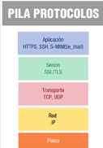

## 1. Introducción. Objetivos de seguridad

Al desarrollar aplicaciones con comunicaciones debe proporcionarse seguridad a **la aplicación** y a **los datos transmitidos**. Esta dependerá de:
- **El diseño**
- **La selección de protocolos de comunicación**
- **El método de autentificar al usuario**

Los **objetivos de seguridad** son los siguientes:
- **Confidencialidad**: Los datos transmitidos por la aplicación solo disponibles para entidades (personas, procesos) autorizados.
- **Integridad**: Los datos originales no han sido modificados durante la transmisión
- **Autenticación**: La entidad emisora es quien dice ser
- **No repudio**: Acciones de un usuario han sido realizadas exactamente por dicho usuario. Se garantiza la participación de las partes en la comunicación:
	- No repudio en origen: La persona que envía el mensaje no puede negar que es el emisor del mismo (receptor tiene pruebas de la emisión)
	- No repudio en destino: El receptor no puede negar que recibió el mensaje (emisor tiene pruebas de la recepción)
- **Autorización**: Asegurar que una entidad puede hacer una acción en concreto: Autorización valida acciones del usuario para verificar si tiene privilegios para realizar dicha acción. 

## 2. Criptografía

**Criptografía**, del griego "cripto" (secreto) y "grafía" (escritura), tiene como finalidad enmascarar o codificar una información original mediante alguna técnica que haga que el resultado sea ininteligible para las personas no autorizadas. 

Lo usual es: Aplicar técnicas criptográficas para enmascara el mensaje; mandar el mensaje por una línea de comunicación insegura y susceptible de interceptar; el receptor lee el mensaje enmascarado.

**Criptoanálisis**: Analiza la robustez de los sistemas criptográficos y comprueba si realmente son seguros. Se intenta romper la seguridad de la criptografía, deshaciendo el sistema y accediendo a la información secreta en su formato original. 

**Criptología**: Ciencia que engloba a la criptografía y al criptoanálisis. 
### 2.1. Encriptación de la información

Se llama **encriptación o cifrado** de la información al proceso por el que la información o los datos a proteger son traducidos o codificados como algo que parece aleatorio y que no tiene ningún significado (datos encriptados)

La **desencriptación o descifrado** es el proceso inverso: los datos encriptados son convertidos a su forma original.

**Conceptos asociados a la encriptación**
- Texto plano, llano, claro: Información original. Sin cifrar ni encriptar.
- Criptograma o texto cifrado: Información tras la encriptación
- Algoritmo criptográfico o algoritmo de cifrado: Conjunto de pasos u operaciones (función matemática) usada en encriptación / desencriptación. Asociado al algoritmo hay una **clave** o **llave** (número, palabra, frase, contraseña)
- La **clave** controla las operaciones del algoritmo dentro del proceso de cifrado y descifrado, de manera que usando el algoritmo con llaves diferentes, se obtienen textos cifrados diferentes. 

En los esquemas el algoritmo se representa con un candado, la clave mediante una llave. 

### 2.2. Principios criptográficos

Auguste Kerckhoff define las propiedades deseables de un sistema criptográfico (1883):
- Si el sistema no es teóricamente irrompible, al menos debe serlo en la práctica
- La efectividad del sistema no debe depender de que su diseño permanezca en secreto (Consiste en mantener en secreto la clave y no de ocultar el diseño del programa, que puede ser público y conocido)
- La clave debe ser fácilmente memorizable para que no haya que recurrir a notas escritas
- Los criptogramas deben dar resultados alfanuméricos
- El sistema debe ser operable por una única persona
- El sistema debe ser fácil de usar

Claude Shannon reformula el segundo principio con la máxima de Shannon: "El adversario o enemigo conoce el sistema". 
Es lo adoptado por los criptólogos en oposición a la seguridad a través de la oscuridad (ocultación del diseño e implementación del sistema criptográfico a los usuarios)

La **seguridad de un sistema criptográfico** depende de:
- El **diseño o robustez del algoritmo**: Cuantos menos fallos tenga, más seguro
- La **longitud de la clave**: A mayor longitud, más seguro. (Estimada actualmente en mínimo de 128 bits, existiendo algoritmos para seleccionar el tamaño de la clave)

### 2.3. Criptografía de clave privada o simétrica

Solo se la misma **una clave secreta**, conocida por el emisor y por el receptor para la encriptación y la desencriptación. 

**Ventajas**: Algoritmo muy rápido. No aumenta el tamaño del mensaje. Adecuados para cifrar grandes volúmenes de datos

**Inconvenientes**: El receptor debe conocer la clave que se va a utilizar, por lo que el emisor debe habérsela enviado. No pueden usarse medios inseguros para el intercambio de claves. Se necesitaría un gran número de claves entre cada dos personas del grupo (complicado si el grupo de personas que puede comunicarse de forma privada es muy grande)

Ejemplos: **AES** o Rinjndael (estándar mundial) , DES, 3-DES, DES-X, IDEA, RC5
### 2.4. Criptografía de clave pública o asimétrica

Se utilizan **claves diferentes para la encriptación y la desencriptación**.
- Cada parte posee una pareja de claves: Una pública, conocida por todos y su inversa privada, solo -conocida por el poseedor. 
- Cada pareja de claves son complementarias. Lo que una cifra solo puede ser descifrado por su inversa.
- Solo puede generarse una vez: No es posible que casualmente obtengan la misma pareja de claves
- Al **cifrar un mensaje con la clave pública, tan solo puede descifrarlo quien posea la clave privada inversa a esa clave pública**. Ej.: A le envía información a B, usando la clave pública de B para cifrar el mensaje, que solo podrá descifrar B con su clave privada. 
- Conocer la clave pública no aportar información sobre la clave privada, ni permite descifrar 
- Cifrar un mensaje con clave privada equivale a demostrar la autoría del mensaje (autenticación) porque nadie más ha podido cifrarlo con la clave privada. El mensaje cifrado lo podrá descifrar todo aquel que conozca la clave pública inversa. 

**Ventajas**: No hay problema de distribución de claves. Cada parte tiene su juego de claves
**Inconvenientes**: Más lentos que los algoritmos simétricos. Garantizar que la clave pública es de quien dice ser su poseedor. Puede haber man in the middle (el atacante observa e intercepta mensajes entre las dos partes sin que ninguna de ellas sepa que el enlace ha sido violado)

Ejemplos: DSA, **RSA** (estándar de facto), algoritmo de Diffie-Hellman

### 2.5. Otras técnicas criptográficas

- **Resumen de mensajes, basado en HASH**: Entrada de un mensaje de longitud variable y conversión a un resumen de longitud fija. Misma salida, aleatorio, unidireccional. Busca proporcionar integridad. Combinado con clave pública se puede proporcionar identificación. Los más usados son MD5 y SHA.
- **Firmas digitales**: Equivalente de las firmas personales. Se basa en criptografía de clave pública y resumen de mensajes HASH. 
	- En la transmisión de mensaje entre emisor y receptor, el emisor transmite junto con el texto deseado, la firma digital del mensaje para comprobar la integridad del mensaje y la autenticidad del emisor
	- El emisor debe tener clave pública y clave privada. Para enviar el mensaje a un receptor, codifica el mensaje con función HASH y el resultado lo cifra con clave privada, generando firma digital que transmitirá al receptor junto con el texto deseado. Receptor separa el mensaje en dos partes: texto y firma. Con la clave pública del emisor descifra la firma y al texto la aplica la misma función HASH que el emisor, comparando la salida de la función con el mensaje descifrado incluido en la firma. Si coinciden, queda probada la integridad del mensaje y la autenticidad del emisor. 
- **Certificados digitales:** Es un mensaje firmado por una autoridad (Entidad certificadora) que autentifica a las partes, certificando que la clave pública pertenece a quien dice ser su poseedor. Se resuelve el problema de confianza delegando la responsabilidad en un tercero. Los certificados digitales (**estándar X.509**) deben contener: número de versión, número de serie del certificado, información. La Entidad certificadora crea, da mecanismo para revocación, búsqueda de certificados, comprobación del estado y lo valida. 

```
FIRMAR
El emisor aplica una función hash (función resumen) al documento, con la que se obtiene una lista de caracteres llamada resumen, que la función garantiza que sólo se puede hacer con el documento original. Luego, el emisor cifra ese resumen con su clave privada y lo envía al destinatario junto con el documento original. En el destino, se aplica la misma función hash al documento para obtener su resumen, y  se descifra el resumen usando la clave pública del emisor. Si ambos resúmenes coinciden se confirma que el origen del documento es el dueño de la clave pública.


CIFRAR el documento, se usa la clave pública del receptor con el siguiente procedimiento:
a) El emisor aplica al documento  original la función hash para generar el resumen.  
b) El emisor toma su clave privada para aplicar el algoritmo asimétrico al documento resumen. Así se obtiuene un resumen cifrado.  
c) El emisor toma la clave pública del receptor para aplicar el algoritmo al documento inicial y al resumen. Se obtiene un documento conjunto cifrado que se envía al receptor.  
d) El receptor usa su clave privada para descifrar los documentos y la clave pública del origen para comprobar la firma.
```

### 2.6. Principales aplicaciones de la criptografía

- **Seguridad de las comunicaciones**: Canales seguros sobre redes que no lo son. Gracias a potencia de cálculo actual y a algoritmos de cifrado simétrico se consigue no perder velocidad de transferencia.
- **Identificación y autentificación**: Identificar a individuo o validar el acceso a un recurso en un entorno de red, con más garantías que sistemas de usuario y clave tradicionales. 
- **Certificación**: Agentes fiables validan la identidad de agentes desconocidos. Es la extensión lógica del uso de la criptografía para identificar y autentificar. 
- **Comercio electrónico**: Gracias a canales seguros y a mecanismos de identificación se posibilita el comercio electrónico. Empresas y usuarios tienen garantías de que las operaciones no pueden ser espiadas. Se reduce el riesgo de fraudes y robos. 

## 3. Protocolos seguros de comunicaciones

Criptografía + Tecnologías de comunicación en red -> Protocolos seguros de comunicaciones o protocolos criptográficos. 

Un protocolo criptográfico o de seguridad o de cifrado es un protocolo que realiza funciones relacionadas con la seguridad, aplicando métodos criptográficos.

Algunos de ellos son:
- **SSL**: Comunicación segura en cliente/servidor frente a ataques de red (evita por ejemplo el man in the middle de la criptografía asimétrica)
- **TLS**: Evolución de SSL, amplía los algoritmos critográficos que puede usar. 



SSL y TLS se ejecutan en una capa intermedia (sesión) entre protocolo de aplicación y protocolo de transporte (TCP y UDP), pueden usarse para el cifrado de protocolos de aplicación como Telnet, FTP, SMTP, IMAP o HTTP. 

Cuando un protocolo de aplicación se ejecuta sobre un protocolo criptográfico se habla de la versión segura de ese protocolo como SSH (reemplazo de Telnet para comunicaciones seguras) o HTTPS (comunicaciones seguras de hipertexto)
### 3.1. Protocolo criptográfico SSL/TLS

Protocolo **SSL** (Secure Sockets Layer) fue diseñado para proporcionar comunicaciones seguras entre un navegador y un servidor web (por Netscape) pero puede usarse para cualquier **conexión cliente/servidor**. 

SSL proporciona: Autenticación, Confidencialidad, Integridad. 

Protocolo **TLS** (Transport Layer Security) es **evolución del protocolo SSL**, con más algoritmos criptográficos y mayor seguridad frente a nuevos ataques. Opera igual que SSL.

**Funcionamiento**
Antes de iniciar comunicación segura, se acuerdan parámetros de comunicación en fases precias (handshake) **SSL/TSL Handshake Protocol**. El protocolo SSL/TSL Record Protocol, especifica cómo encapsular los datos transmitidos y recibidos, incluso los de negociación.

**Es un protocolo de cifrado híbrido:** Usa **criptografía asimétrica** en **negociación** y **criptografía simétrica** en **transmisión de datos**

**Fases con SSL**
1. **Fase inicial**: Negociar algoritmos criptográficos a usar
2. **Fase autenticación y clave de sesión**: Intercambio de claves de autenticación por certificados con criptografía asimétrica. Se crea la clave para cifrar los datos transmitidos con criptografía simétrica para agilizar las transacciones. 
3. **Fase fin**. Verificación del canal seguro
4. Comienza la comunicación segura. 

Si falla la negociación, la comunicación o canal no se establece.

Pueden usarse estos algoritmos:
- Algoritmos de cifrado simétrico: DES, 3DES, RC2, RC4, IDEA
- Algoritmos de clave pública: RSA
- Algoritmos de resumen: MD5, SHA
- Certificados: DSS, RSA
- Clave de sesión distinta en cada transacción.

Auge: Comercio en internet, creación de VPN...

### 3.2. Otros protocolos seguros

#### HTTPS
HTTPS crea canal seguro sobre red insegura, usando cifrado basado en SSL/TLS en el puerto 443. 

La confianza en HTTPS se basa en una Autoridad de Certificación preinstalada en el software del navegador. La conexión solo puede ser validada si:
- El usuario confía en la autoridad de certificación
- El sitio web proporciona certificado válido
- El certificado identifica correctamente el sitio web
- Cada uno de los nodos involucrados en Internet son confiables o el usuario confía en que el protocolo SSL/TLS es inquebrantable.

#### SSH
Diseñado para dar seguridad al acceso a computadores de forma remota.

- Cumple la función de Telnet pero usando el puerto 22.
- Usa criptografía, logrando seguridad en la conexión
- Requiere que en el servidor haya un daemon que mantenga en el puerto 22 el servicio

Forma:
- Cliente envía señal a servidor pidiendo comunicación por puerto 22
- Servidor acepta comunicación en caso de poder mantenerla bajo encriptación y le envía clave pública al cliente para que descifre los mensajes
- Cliente recibe la clave y puede guardar para futuras comunicaciones o destruirla después de la sesión actual. 

## 4. Criptografía en Java

Con las APIs de comunicaciones seguras de Java se puede encriptar información con clave pública y privada, firma digital y verificación, hash o resúmenes de mensajes, certificados digitales y validación de certificados, comunicaciones de red seguras con protocolos SSL. 

Pueden usarse diferentes algoritmos criptográficos (DES, RSA, MD5...) proporcionados por el **proveedor de servicios criptográficos de Java (PSC).**

### 4.1. Arquitectura criptográfica de Java (JCA)

Fue introducida en Java 1.1, incluyendo bibliotecas con acceso a funciones criptográficas de propósito general (Arquitectura, Criptográfica de Java, JCA) y otras utilidades criptográficas que complementan (Extensión Criptográfica de Java, JCE). 
A partir de 1.4 JCE viene en el JDK. Se puede considerar JCA como core de la API de seguridad en Java y JCE como parte de JCA. 

La arquitectura criptográfica la forman los paquetes
- **`java.security`**
- **`javax.crypto`**

También hay otras bibliotecas en el JDK que usan la arquitectura proveedor de JCA como
**Comunicaciones seguras**
- JSSE Extensión Java Sockets Seguros  `javax.net.ssl.SSLSocket`
- JGSS Servicio General de Seguridad a través de Kerberos
- SASL Capa de autenticación y seguridad `javax.security.sasl.Sasl`
**Autenticación y control de acceso**
- JAAS Servicio de Autenticación y Autorización `javax.security.auth.login`

------------

Sigue los siguientes principios:
- **Independencia de la aplicación**: El programa no tiene que implementar algoritmos critográficos. Lo usa a través de la JVM con solicitud a un PCS. La misma aplicación puede usar varios PCS.
- **Interoperabilidad**: Los PCS son compatibles con todas las aplicaciones. PCS no ligado a aplicación. Aplicación no ligada a PCS.
- **Extensibilidad**: Java incluye PCS integrados con básicos de seguridad y además permite la instalación de proveedores personalizados. 

En la arquitectura JCA habrá dos tipos de componentes:
- Bibliotecas de clases e interfaces `java.security`
- Proveedores de servicios criptográficos que proporcionan implementaciones (r)

JCE mismo modelo que JCA. Paquetes `javax.crypto` `javax.crypto.spec`, `javax.crypto.interfaces`. 

En definitiva (Para repetirlo mil veces más como están hacinedo estos insufribles apuntes)

JCA se compone de:
- Las **bibliotecas de clases e interfaces** que proporcionan las diferentes funcionalidades de seguridad, como son:
    -**java.security**. manejo de certificados, claves, resúmenes de mensajes y firmas digitales.
    -**javax.crypto**. operaciones criptográficas como encriptación/desencriptación, generación de claves y acuerdo de claves, así como generación de códigos de autentificación de mensajes (MAC).
    -**javax.crypto.spec**.especificación de claves y de parámetros de algoritmos.
    -**javax.crypto.interfaces**. claves empleadas en los algoritmos de tipo Diffie-Hellman (clases `DHKey`, `DHPrivateKey` y `DHPublicKey`).
- Los **proveedores de servicios criptográficos**, tales como Sun, SunRsaSign, SunJCE, que contienen las implementaciones de diferentes algoritmos criptográficos. (Arquitectura de proveedores coexisten múltiples implementaciones de algoritmos criptográficos)

### Proveedores y motores criptográficos

**Proveedor de servicios criptográficos**: Empresa de seguridad que generar sus servicios de seguridad en Java, implementando las clases definidas en JCA/JCE siguiente el estándar definido por JCA.

**Motor criptográfico** clases e interfaces que debe implementar el proveedor de servicios criptográficos. Clases que tienen método estático `getInstance()` para dar algoritmo criptográfico de un proveedor dado como:
- `MessageDigest`: Hash. Resúmenes de mensajes.
- `Signature`: Firmas digitales.
- `KeyFactory`: Manejo de claves seguras.
- `KeyPairGenerator`:Generación de claves públicas y privadas.
- `Cipher`: Encriptado y desencriptado de información.

**Más de un proveedor criptográfico**: Fichero `java.security` de `/lib/security`
```
security.provider.n=nombre_de_la_clase
```

Un ejemplo:
```java
MessageDigest.getInstance("MD5"); //Obtiene el algoritmo MD5 del proveedor por defecto de más prioridad.
MessageDigest.getInstance("MD5", "ProveedorA"); //Obtiene el algoritmo MD5 del proveedor ProveedorA.
```

```java
Que proveedores y algoritmos tenemos instalados en nuestro sistema. Que algoritmos implementan

Provider[] listaProv = Security.getProviders();
for (int i = 0; i < listaProv.length; i++) {
System.out.println("Núm. proveedor : "    + (i + 1));
System.out.println("Nombre         : "    + listaProv[i].getName());
System.out.println("Versión        : "    + listaProv[i].getVersion());
System.out.println("Información    :\n  " + listaProv[i].getInfo());
System.out.println("Propiedades    :");

Enumeration propiedades = listaProv[i].propertyNames();
while (propiedades.hasMoreElements()) {
    String clave = (String) propiedades.nextElement();
    String valor = listaProv[i].getProperty(clave);
    System.out.println("  " + clave + " = " + valor);

```

### Gestión de claves con el paquete `java.security`

API https://docs.oracle.com/en/java/javase/17/docs/api/index.html

Se usan números aleatorios que se generan en base a una semilla (valor utilizado para inicializar un algoritmo). Es muy difícil determinar valores sin conocer la semilla.

Importante: Mayor tamaño de clave, mayor seguridad pero también mayor tiempo de cálculo. Puede hacer que la administración de claves no sea ágil para gestionar la aplicación. 

**Interfaz `Key`: **Representación de claves, almacenamiento y envío de forma serializada. 
- `getAlgorithm()`: Nombre del algoritmo con el que se generó la clave (RSA, DES)
- `getEncoded()`: Clave como array de Bytes
- `getFormat()`: Formato en el que está codificada la clave

**Clase `KeyPairGenerator`:** Generación de claves públicas y privadas (asimétricas). Son objetos de tipo `KeyPair` que contienen un objeto `PublicKey` y otro `PrivateKey`. Con `initialize()` se establece tamaño de la clave y  valor del número aleatorio a partir del que será generada.

**Clase `KeyGenerator`:** Generación de claves privadas simétricas. Objetos de tipo `SecretKey`. Con el método `init()` tamaño de clave y valor del número aleatorio a partir del que será generada.

**Clase `SecureRandom`**: Números aleatorios seguros. `setSeed()` (semilla), `secureRandom()` (semilla de proveedor SUN), `next()` , `nextBytes()` valor de los números generados.

```java
KeyPairGenerator keyGen = KeyPairGenerator.getInstance("DSA", "SUN");
SecureRandom random = SecureRandom.getInstance("SHA1PRNG", "SUN");
keyGen.initialize(1024, random);
```


### Resúmenes de mensajes con la clase `MessageDigest`

Creación de resúmenes de mensajes con algoritmo y proveedor especificados.
- **getInstance()**: Algoritmo de resumen
- **update()**: Resumen
- **digest()**: Completa obtención del resumen.

Está disponible:
- MD5. 128 bits. Longitud fija
- SHA-1. 160 bits.

```java
try {
	MessageDigest messageDigest = MessageDigest.getInstance("SHA1");
	String texto = "Texto de ejemplo";
	byte[] resumen = messageDigest.update(texto.getBytes());
	for (int i = 0; i < resument.length, i++) {
		System.out.println(resumen[i]);
	}
	catch(NoSuchAlgorithmException e) {
		e.printStrackTrace();
	}
}
```

### Firma digital con la clase `Signature` de `java.security`

Para firmar un mensaje y verificarlo se deben seguir los siguientes pasos.
1. Generar claves públicas y privadas mediante `KeyPairGenerator`
	1. `PrivateKey` para firmar
	2. `PublicKey` para verificar la firma
2. Realizar firma con `Signature` y algoritmo asimétrico como DSA
	1. Instanciar un `Signature`
	2. A `initSign()` se le pasa clave privada
	3. A `update()` se le pasa resumen de mensaje
	4. A `sign()` se le devuelve clave digital
3. Verificar firma creada mediante clave pública generada
	1. `initVerify()` se le pasa clave pública
	2. `update()` actualiza el resumen del mensaje para comprobar si coincide
	3. `verify()` verifica la firma

El algoritmo DSA viene en el JDK, es parte de firmas digitales y se pueden usar sobre él algoritmo de resumen MD5 y SHA-1. 

```java
// Generar claves publica y privada
KeyPairGenerator keyGen = KeyPairGenerator.getInstance("DSA", "SUN");
KeyPair pair = keyGen.generateKeyPair();
PrivateKey priv = pair.getPrivate();
PublicKey pub = pair.getPublic();

// Obtencion de objeto Signature, inicializacion, entrega, de los datos a firmar, generacion de la firma
Signature dsa = Signature.getInstance("SHA1withDSA", "SUN");
dsa.initSign(priv);
FileInputStream fis = new FileInputStream(args[0]);
BufferedInputStream bufin = new BufferedInputStream(fis);
byte[] buffer = new byte[1024];
int len;
	while (bufin.available() != 0) {
    		len = bufin.read(buffer);
    		dsa.update(buffer, 0, len);
	};
bufin.close();
byte[] realSig = dsa.sign();
/* guardamos la firma en un archivo */ 
FileOutputStream sigfos = new FileOutputStream("sig");
sigfos.write(realSig);
sigfos.close();
/* guardamos la llave publica en un archivo */ 
byte[] key = pub.getEncoded(); 
FileOutputStream keyfos = new FileOutputStream("pk");
keyfos.write(key); 
keyfos.close();
```

Para poder verificar una firma digital incluida junto a algun archivo de datos se necesita:
- Los datos
- La firma
- La llave pública necesaria para verificar la firma

```java
// Ingreso y conversión de los bytes encodeados de la llave pública
FileInputStream keyfis = new FileInputStream(args[0]);
byte[] encKey = new byte[keyfis.available()];  
keyfis.read(encKey);
keyfis.close();
// Especificación de la llave, asumiendo que fue encodeada de acuerdo a el estándar X.509
X509EncodedKeySpec pubKeySpec = new X509EncodedKeySpec(encKey);
// Ahora podemos generar la llave pública de la especificación
KeyFactory keyFactory = KeyFactory.getInstance("DSA", "SUN");
// Bytes de la firma
FileInputStream sigfis = new FileInputStream(args[1]);
byte[] sigToVerify = new byte[sigfis.available()];
sigfis.read(sigToVerify);
sigfis.close();
// Signature de la verficiacion y entrega al objeto Signature de los datos para ser verificados 
Signature sig = Signature.getInstance("SHA1withDSA", "SUN");
	sig.initVerify(pubKey);
FileInputStream datafis = new FileInputStream(args[2]);
	BufferedInputStream bufin = new BufferedInputStream(datafis);

	byte[] buffer = new byte[1024];
	int len;
	
	while (bufin.available() != 0) {
   		len = bufin.read(buffer);
		sig.update(buffer, 0, len);
	};
// Verificar firma
boolean verifies = sig.verify(sigToVerify);
System.out.println("signature verifies: " + verifies);
```


```shell
%java GenSig data
%java VerSig pk sig data
signature verifies: true
```

#### XML Signature

https://adictosaltrabajo.com/2008/04/03/xml-signature/
##### Firmar digitalmente documento XML

Primero se genera clave privada y certificado (puede hacerse con keytool)
```shell
keytool -genkey -alias mi_cert_ejemplo -keyalg DSA -dname "CN=Usuario, O=Autentia, C=ES" -keypass abc1234 -storepass abc12345 -keystore myKeyStore.jks -validity 365
```

----
### (Offtopic) Para añadir el certificado a `cacerts`

Si deseas agregar el certificado generado a `cacerts`, que es el keystore de confianza predeterminado de Java, puedes hacerlo utilizando el siguiente comando:

1. **Exportar el certificado desde `myKeyStore.jks`:**

```shell
keytool -export -alias mi_cert_ejemplo -file mi_cert_ejemplo.cer -keystore myKeyStore.jks -storepass abc1234`
```

Este comando exportará el certificado del alias `mi_cert_ejemplo` desde `myKeyStore.jks` al archivo `mi_cert_ejemplo.cer`.

----

**DOMUtils.java**
```java
public class DOMUtils {
	
    /**
     * Serializa un objeto Document en un archivo
     */
    public static void outputDocToFile(Document doc, File file) throws Exception {
        FileOutputStream	f			   = new FileOutputStream(file);
        TransformerFactory factory	   	   = TransformerFactory.newInstance();
        Transformer		   transformer	   = factory.newTransformer();
        
        transformer.setOutputProperty(OutputKeys.OMIT_XML_DECLARATION, "yes");
        
        transformer.transform(new DOMSource(doc), new StreamResult(f));

        f.close();
    }
    
    /**
     * Lee un Document desde un archivo
     */
    public static Document loadDocumentFromFile(java.io.File file) throws Exception {
        DocumentBuilderFactory	factory = DocumentBuilderFactory.newInstance();
        DocumentBuilder			builder = null;
        
        factory.setNamespaceAware(true);
        
        builder = factory.newDocumentBuilder();
        
        return builder.parse(file);
    } 
    
	/**
	 * @return Crea un elemento value
	 */
	public static Element createNode(Document document, String tag, String value){
        Element node = document.createElement(tag);
        if (value != null){
        	node.appendChild(document.createTextNode(value));
        }
		return node;
	}  
	
	/**
	 * @return Devuelve un Document a firmar
	 * @throws Exception Cualquier incidencia
	 */
	public static Document createSampleDocument() throws Exception {
    	DocumentBuilderFactory	factory  = DocumentBuilderFactory.newInstance();
        DocumentBuilder 		builder	 = factory.newDocumentBuilder();
        Document				document = builder.newDocument();
        
        Element person = document.createElement("persona");
        person.setAttribute("id", "468300000");
        
        person.appendChild(DOMUtils.createNode(document, "nombre",	 "Pepito"));
        person.appendChild(DOMUtils.createNode(document, "apellidos", "Pérez Luna"));
        person.appendChild(DOMUtils.createNode(document, "email",	 "pepito.perez@servidor.com"));

        document.appendChild(person);

        return document;
	}	
}
```

**Firma digital**

```java
public class CreateSignature {

	private static final String KEYSTORE_TYPE		  = "JKS";
	private static final String KEYSTORE_FILE		  = "myKeyStore.jks";
	private static final String KEYSTORE_PASSWORD	  = "abc12345";
	private static final String PRIVATE_KEY_PASSWORD  = "abc1234";
	private static final String PRIVATE_KEY_ALIAS	  = "mi_cert_ejemplo";


	/**
	 * Punto de entrada al ejemplo
	 */
	public static void main(String args[]) throws Exception {
		org.apache.xml.security.Init.init();

		Document doc = DOMUtils.createSampleDocument();
		
		Constants.setSignatureSpecNSprefix("");	// Sino, pone por defecto como prefijo: "ns"


		// Cargamos el almacen de claves
		KeyStore ks  = KeyStore.getInstance(KEYSTORE_TYPE);
		ks.load(new FileInputStream(KEYSTORE_FILE), KEYSTORE_PASSWORD.toCharArray());

		// Obtenemos la clave privada, pues la necesitaremos para encriptar.
		PrivateKey privateKey = (PrivateKey) ks.getKey(PRIVATE_KEY_ALIAS, PRIVATE_KEY_PASSWORD.toCharArray());
		File	signatureFile = new File("signature.xml");		
		String	baseURI       = signatureFile.toURL().toString();	// BaseURI para las URL Relativas.
		
		// Instanciamos un objeto XMLSignature desde el Document. El algoritmo de firma será DSA
		XMLSignature xmlSignature = new XMLSignature(doc, baseURI, XMLSignature.ALGO_ID_SIGNATURE_DSA);

		 
		// Añadimos el nodo de la firma a la raiz antes de firmar.
		// Observe que ambos elementos pueden ser mezclados en una forma con referencias separadas
		doc.getDocumentElement().appendChild(xmlSignature.getElement());

		// Creamos el objeto que mapea: Document/Reference
		Transforms transforms = new Transforms(doc);
		transforms.addTransform(Transforms.TRANSFORM_ENVELOPED_SIGNATURE);
		
		// Añadimos lo anterior Documento / Referencia
		// ALGO_ID_DIGEST_SHA1 = "http://www.w3.org/2000/09/xmldsig#sha1";
		xmlSignature.addDocument("", transforms, Constants.ALGO_ID_DIGEST_SHA1);

		// Añadimos el KeyInfo del certificado cuya clave privada usamos
		X509Certificate cert = (X509Certificate) ks.getCertificate(PRIVATE_KEY_ALIAS);
		xmlSignature.addKeyInfo(cert);
		xmlSignature.addKeyInfo(cert.getPublicKey());
		
		
		// Realizamos la firma
		xmlSignature.sign(privateKey);
		
		// Guardamos archivo de firma en disco
		DOMUtils.outputDocToFile(doc, signatureFile);
	}
}
```


**Validar documento digitalmente firmado**

```java
public class VerifySignature {
	
	/**
	 * Punto de inicio
	 */
	public static void main(String args[]) throws Exception {
		org.apache.xml.security.Init.init();

		String signatureFileName = "signature.xml";

		DocumentBuilderFactory dbf = DocumentBuilderFactory.newInstance();

		dbf.setNamespaceAware(true);
		dbf.setAttribute("http://xml.org/sax/features/namespaces", Boolean.TRUE);
		
		File			f	= new File(signatureFileName);
		DocumentBuilder db	= dbf.newDocumentBuilder();
		Document	 doc	= db.parse(new java.io.FileInputStream(f));
		Element		 sigElement = (Element) doc.getElementsByTagName("Signature").item(0);
		XMLSignature signature  = new XMLSignature(sigElement, f.toURL().toString());

		KeyInfo keyInfo = signature.getKeyInfo();
		if (keyInfo != null) {
			X509Certificate cert = keyInfo.getX509Certificate();
			if (cert != null) {
				// Validamos la firma usando un certificado X509
				if (signature.checkSignatureValue(cert)){
					System.out.println("Válido según el certificado");	
				} else {
					System.out.println("Inválido según el certificado");	
				}
			} else {
				// No encontramos un Certificado intentamos validar por la cláve pública
				PublicKey pk = keyInfo.getPublicKey();
				if (pk != null) {
					// Validamos usando la clave pública
					if (signature.checkSignatureValue(pk)){
						System.out.println("Válido según la clave pública");	
					} else {
						System.out.println("Inválido según la clave pública");	
					}
				} else {
					System.out.println("No podemos validar, tampoco hay clave pública");
				}
			}
		} else {
			System.out.println("No ha sido posible encontrar el KeyInfo");
		}
	}

}
```


### Encriptación con clase `Cipher` del paquete `javax.crypto`

Clase `Cipher` permite realizar encriptado y desencriptado, con clave pública y privada. 
- `getInstance()`: Inicia el algoritmo y el proveedor
- `init()`: Inicia modo de operación de Cipher.
- `update()`y `doFinal()` insetan datos en objeto cifrado.

**Modos de operación:**
- `ENCRYPT_MODE` Encriptado
- `DECRYPT_MODE` Desencriptado
- `WRAP_MODE` Clave en secuencia de bytes
- `UNWRAP_MODE` Obtener las claves generadas por WRAP_ MODE.

La encriptación puede ser:
- **De bloque o Block Cipher**: El texto a cifrar se divide en bloques de tamaño fijo de bits (64 bits normalmente). Cada bloque se cifra de forma independiente y después se construye todo el texto cifrado. Si el texto a cifrar no es múltiplo de 64 se completa con relleno o padding.

Ejemplo: `Cipher.getinstance("Rijndael/ECB/PKCS5Padding")` indica qué
- Algoritmo Rikndael
- Modo ECB (electronic Bode Book)
- Relleno PKCS5 Padding

- De **flujo o Stream Cipher**: Texto se cifra bit a bit, byte a byte, carácter a carácter en lugar de bloques completos. Útil cuando debe transmitirse información cifrada a medida que se crea. 

### Ejemplos de encriptación simétrica y asimétrica con `Cipher`

```java
public class Utils {

    public static void escribirFichero(String file, String message) throws Exception {
        FileWriter fileWriter = new FileWriter(file);
        fileWriter.write(message);
        fileWriter.close();
    }

    public static String cifrarFichero(String file) throws Exception {
        FileInputStream fileInputStream;
        FileOutputStream fileOutputStream;
        int bytesLeidos;

        // Crear clave
        KeyGenerator keyGenerator = KeyGenerator.getInstance("DES");
        keyGenerator.init(56); // Tamaño de clave simetrica
        SecretKey clave = keyGenerator.generateKey(); // Generar clave simetrica
        System.out.println("Genero clave");
        String claveBase64 = Base64.getEncoder().encodeToString(clave.getEncoded());
        System.out.println(claveBase64);
        System.out.println("Cifro el documento" + file);

        // Instanciar Cipher, indicando algoritmo DES y la clave, con modo cifrar
        Cipher cipher = Cipher.getInstance("DES");
        cipher.init(Cipher.ENCRYPT_MODE, clave);

        byte[] buffer = new byte[1000];
        byte[] bufferCifrado;
        fileInputStream = new FileInputStream(file);
        fileOutputStream = new FileOutputStream(file+".cifrado");
        bytesLeidos = fileInputStream.read(buffer, 0, 1000);
        while (bytesLeidos != -1) {
            // Pasa texto claro al cifrador y lo cifra, asignandolo a buffer cifrado
            bufferCifrado = cipher.update(buffer, 0, bytesLeidos);
            fileOutputStream.write(bufferCifrado); // Graba cifrado en fichero
            bytesLeidos = fileInputStream.read(buffer, 0, 1000);
        }
        bufferCifrado = cipher.doFinal(); // Completa el cifrado (lo que falte)
        fileOutputStream.write(bufferCifrado);
        fileInputStream.close();
        fileOutputStream.close();

        return claveBase64;
    }

    public static void descifrarFichero(String file1, SecretKey clave, String file2) throws Exception {
        FileInputStream fileInputStream;
        FileOutputStream fileOutputStream;
        int bytesLeidos;

        // Instanciar Cipher, indicando algoritmo DES y la clave, con modo descifrar
        Cipher cipher = Cipher.getInstance("DES");
        cipher.init(Cipher.DECRYPT_MODE, clave);

        fileInputStream = new FileInputStream(file1);
        fileOutputStream = new FileOutputStream(file2);
        byte[] bufferClaro;
        byte[] buffer = new byte[1000]; // Array de bytes
        bytesLeidos = fileInputStream.read(buffer, 0, 1000);
        while (bytesLeidos != -1) {
            // Pasa texto claro al cifrador y lo cifra, asignandolo a buffer de texto claro
            bufferClaro = cipher.update(buffer, 0, bytesLeidos);
            fileOutputStream.write(bufferClaro); // Graba cifrado en fichero
            bytesLeidos = fileInputStream.read(buffer, 0, 1000);
        }
        bufferClaro = cipher.doFinal(); // Completa el descifrado (lo que falte)
        fileOutputStream.write(bufferClaro);
        fileInputStream.close();
        fileOutputStream.close();
    }

}
```

```java
public class Main {

    public static void main(String[] args) throws Exception {
        Utils.escribirFichero("mificherito.txt", "Hola este fichero esta chulisisisimo");
        String clave = Utils.cifrarFichero("mificherito.txt");

        byte[] claveBytes =  Base64.getDecoder().decode(clave);
        SecretKey recomposed = new SecretKeySpec(claveBytes, 0, claveBytes.length, "DES");
        Utils.descifrarFichero("mificherito.txt.cifrado",  recomposed,"midescifrado.txt");
    }
}
```

## 5. Sockets seguros en Java (JSSE)

Es con **JSSE** (Extensión Java Sockets Seguros): Usa la arquitectura proveedor de JCA. Da comunicación segura mediante SSL a través de `javax.net.ssl`
**Sockets**: Mecanismo de bajo nivel entre dos  ordenadores (**cliente** que **inicia conexión** y servidor **que** está a **la espera de conexiones**).
**Socket seguro**: Basado en SSL (autentificación, integridad, confidencialidad)

Se tienen las clases `SSLSocket` y `SSLServerSocket`

### KeyTool

- **KeyTool** permite la gestión de claves y certificados.
- Los usuarios pueden administrar pares de claves pública/privada y certificados de uso en una autenticación. Almacenar en caché las claves públicas en forma de certificados de las personas con las que se comunican.
- **Keytool** permite almacenar claves y certificados en el **almacén de certificados** (**keystore**) (Base de datos de los pares llaves y los certificados que se usan para la autentificación del SSL)
- **Truststore**: Almacena certificados de las Autoridades de certificación para verificar las identidades de otros clientes y servidores. 

- Cuando un cliente o un servidor inicia una sesión del SSL, extrae sus certificados y claves de su almacén de certificados
- Cuando verifica las identidades de otros clientes o servidores extrae certificados de la Autoridad de Certificación (CA) de su truststore. 

Un comando para crear un certificado de clave pública con algoritmo SSA y almacenarlo en el keystore almacenSSL. Se pide introducir contraseña.
```shell
 keytool -genkey -alias claveSsl -keyalg RSA -keystore AlmacenSSL
```

Se exporta el certificado de nombre claveSsl almacenado en el keystore AlmacenSSL al fichero claveSSL.crt. Se pide la contraseña.

```shell
keytool -export -alias claveSsl -keystore AlmacenSSL -rfc -file claveSSL.crt
```

Importar el certificado al Trustore (TrustSSL) (se pide contraseña del almacén de claves)
```shell
keytool -import -alias clave_TSsl -file claveSSL.crt -keystore TrustSSL
```

**Generar `KeyStore`**

```bash
keytool -genkeypair -alias serverkey -keyalg RSA -keystore serverkeystore.jks -keysize 2048 -validity 365
```

**Exportar certificado de servidor**
```bash
keytool -export -alias serverkey -file servercert.cer -keystore serverkeystore.jks
```

**Exportar certificado de cliente**

```bash
keytool -import -alias servercert -file servercert.cer -keystore clienttruststore.jks
```

Tenemos `servercer.cer` `serverkeystore.jks` `clientruststore.jks`

### Programar un socket seguro de servidor


```java
package src.socketssl;  
  
import javax.net.ssl.*;  
import java.io.*;  
  
public class SecureServerSocketExample {  
    public static void main(String[] args) {  
  
        System.setProperty("javax.net.ssl.keyStore", "serverkeystore.jks");  
        System.setProperty("javax.net.ssl.keyStorePassword", "robert");  
  
        SSLServerSocketFactory sslServerSocketFactory = (SSLServerSocketFactory) SSLServerSocketFactory.getDefault();  
  
        try (SSLServerSocket sslServerSocket = (SSLServerSocket) sslServerSocketFactory.createServerSocket(5000);  
             SSLSocket sslSocket = (SSLSocket) sslServerSocket.accept();  
             BufferedReader entrada = new BufferedReader(new InputStreamReader(sslSocket.getInputStream()));  
             PrintWriter salida = new PrintWriter(sslSocket.getOutputStream(), true)) {  
  
            System.out.println("Cliente conectado");  
  
            String line;  
            while ((line = entrada.readLine()) != null) {  
                System.out.println("Mensaje recibido: " + line);  
                salida.println("Mensaje recibido: " + line); // Enviar respuesta al cliente  
            }  
        } catch (Exception e) {  
            e.printStackTrace();  
        }  
    }  
}
```
### Programar un socket seguro cliente

```java
package src.socketssl;  
  
import javax.net.ssl.*;  
import java.io.*;  
  
public class SecureClientSocketExample {  
    public static void main(String[] args) {  
  
        System.setProperty("javax.net.ssl.trustStore", "clienttruststore.jks");  
        System.setProperty("javax.net.ssl.trustStorePassword", "robert");  
  
        try {  
            SSLSocketFactory sslSocketFactory = (SSLSocketFactory) SSLSocketFactory.getDefault();  
            try (SSLSocket sslSocket = (SSLSocket) sslSocketFactory.createSocket("localhost", 5000);  
                 PrintWriter salida = new PrintWriter(sslSocket.getOutputStream(), true);  
                 BufferedReader entrada = new BufferedReader(new InputStreamReader(sslSocket.getInputStream()))) {  
  
                salida.println("Hola desde el cliente SSL");  
                String response;  
                while ((response = entrada.readLine()) != null) {  
                    System.out.println("Respuesta del servidor: " + response);  
                }  
            }  
        } catch (Exception e) {  
            e.printStackTrace();  
        }  
    }  
}
```

**También podría ponerse en la VM de la configuración (sin necesidad de hacerlo en el código)**

- Del servidor
`-Djavax.net.ssl.keyStore=serverkeystore.jks -Djavax.net.ssl.keyStorePassword=robert`
``
- Del cliente

`-Djavax.net.ssl.trustStore=clienttruststore.jks -Djavax.net.ssl.trustStorePassword=robert`


