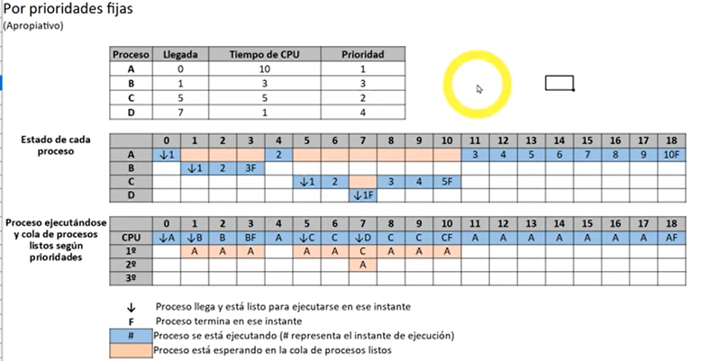
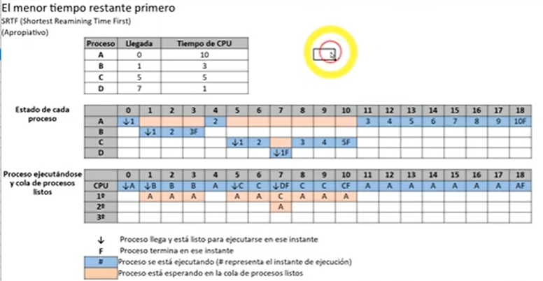
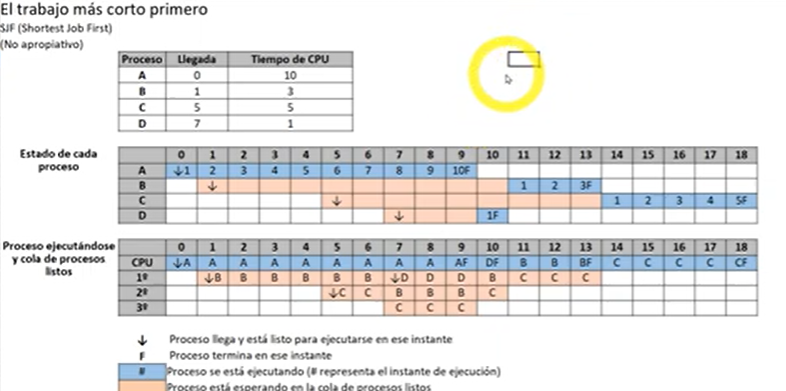
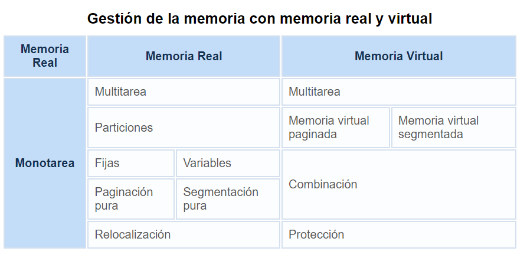
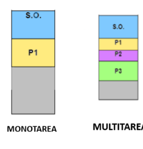
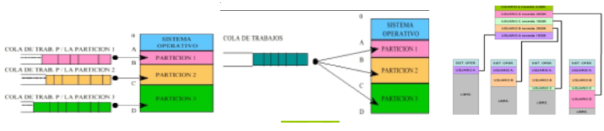

## A. SOFTWARE DE UN SISTEMA INFORMÁTICO

**Sistema informático**: Conjunto de elementos que hacen posible el tratamiento automatizado de la información. 

**Software de un sistema informático**: Formado por **programas**, **estructuras de datos** y **documentación** asociada. Está distribuido en el ordenador, los periféricos y el subsistema de comunicaciones.
Podemos distinguir dos tipos:
- **Software base o sistema operativo**: Necesarios para que el hardware tenga capacidad de trabajar
- **Software de aplicación**: Los maneja el usuario
## A.1. Tipos de aplicaciones informáticas

Podemos clasificarlas en 
- **Aplicaciones de propósito general**: Funciones no específicas (informes, documentos, presentaciones, hojas de cálculo) usada muchas veces por usuarios no expertos.
- **Aplicaciones de propósito específico**: Funciones específicas científicas, técnicas o de gestión.  
## A.2. Requisitos e instalación de una aplicación

Siempre debe cumplirse la:
1. Determinación del equipo necesario
2. Ejecución del programa de instalación
3. Configuración de la aplicación
### A.2.1. Determinación del equipo necesario

Qué **características** o **requisitos** necesita la aplicación para que funcione correctamente en el ordenador. Las aplicaciones son desarrolladas enfocadas a plataformas concretas, con necesidades de hardware y software necesarias para su funcionamiento. Debe reunirse información sobre el hardware del ordenador y verificar que permite realizar la instalación que se quiere efectuar.

- De naturaleza **hardware**: 
	- Plataforma hardware
	- Procesador: Fabricante y velocidad
	- Memoría RAM mínima
	- Espacio mínimo disponible en el soporte de almacenamiento
	- Tarjeta gráfica
	- Resolución recomendada de monitor

- De naturaleza **software**: Sistema operativo bajo el que funciona la aplicación. Otros paquetes software adicionales como actualizaciones concretas de seguridad, la JVM,...

##### Niveles de requisitos para la implantación de aplicaciones
Los fabricantes establecen tres niveles de requisitos para sus aplicaciones:
- Equipo **básico**
	- Plataforma hardware.
	- Tipo de microprocesador.
	- RAM mínima necesaria.
	- Espacio mínimo necesariamente disponible en el soporte de almacenamiento.
	- Plataforma software.
	- Resolución recomendada del monitor
	- Tarjeta gráfica necesaria.

- Equipo **opcional**. Requisitos para funcionamiento eficaz de la aplicación, rendimiento satisfactorio.
	- Plataforma hardware recomendada.
	- Cantidad de memoria adicional recomendada.
	- Presencia de coprocesador matemático (para aplicaciones que realicen gran cantidad de cálculos).
	- Tipo de impresora.
	- Capacidad recomendada para la tarjeta gráfica.

- Equipo en **red**. Si está diseñada para trabajar en red, el fabri cante indica las configuraciones para el servidor y los clientes así como los sistemas operativos en red. La configuración de la red no depende de la aplicación sino del sistema operativo. También se indicará si hay alguna limitación en cuanto al número máximo de clientes.

### A.2.2. Ejecución del programa de instalación

La mayoría de aplicaciones presentan dos niveles según conocimientos del usuario:
- **Instalación básica**: Con pocos conocimientos informáticos. Instalación según elementos que encuentre en el equipo y parámetros básicos establecidos por defecto.
- **Instalación personalizada o avanzada**: El usuario experto puede incluir o eliminar elementos para optimizar recursos. 

Al adquirir la aplicación informática se encuentra con manuales de instalación y el CD/DVD (si vives en 2004). La aplicación está comprimida y el traspaso del programa al soporte de almacenamiento suele hacerse por el programa de instalación. Este es el encargado de **extraer los bloques de la aplicación**, descomprimiéndolos, crear la estructura de directorios necesaria, ubicar los archivos y modificar el registro del sistema. 

En Windows está Microsoft Store para instalación de software y en Linux repositorios oficiales con ayuda de Ubuntu Software o de aplicaciones como Synaptic (sistema gestor de paquetes). Estas herramientas se conectan a un repositorio como puede ser el de Ubuntu que contienen binarios o paquetes precompilados y se encargan de realizar la instalación de la aplicación en el sistema automáticamente descargando cualquier paquete del que dependa. 
### A.2.3. Configuración de la aplicación

Configurar las opciones de la aplicación y, a veces, del sistema operativo y el entorno de trabajo. Deben definirse una serie de parámetros de funcionamiento que adecuen el funcionamiento de la aplicación a las exigencias del usuario. Este proceso se realizará en caso de que no sea satisfactoria la configuración por defecto. Entre ellos:
- Ajuste y distribución de pantalla
- Definición de directorios de trabajo

En algunos contraseña de administrador, cambiar puertos por defecto, activación de cookies, modificación de la configuración de seguridad  en el navegador.

## A.3. Licencias software

Las **licencias software** sirven para establecer un contrato entre el autor de una aplicación software (propiedad intelectual, derechos de autor) y el usuario. Se definen los derechos y deberes de ambas partes (actos de explotación legales)

El **derecho de autor** es la forma de protección proporcionada por las leyes vigentes en la mayoría de los países para los autores de obras originales.  Puede haber tantas licencias fotware como acuerdos concretos se den entre autor y usuario. 

Vamos a clasificarlas en:
- Software con licencia de **código abierto**
- Software con licencia de **código cerrado**
- Software de **dominio público** (sin licencia): Derechos de explotación para toda la humanidad. Puede usarse, modificarse, redistribuirse o licenciarse sin limitaciones. Si el autor lo dona a la humanidad o si los derechos de autor expiran (70 años desde la muerte del autor). Cualquier licencia, por débil que sea, lo excluye del software de dominio público.

### A.3.1. Licencia software con código abierto

Se pone a disposición de los usuarios el código fuente. Se distingue entre:
- **Licencias permisivas** (con permisos): El software puede modificarse o dar lugar a otro nuevo (redistribuirse) sin que el resultado tenga que mantener la misma licencia del software original. Ej.: Apache Software License, PHP License, Perl License, Python License, W3C Software Notice and License, CSD License, MIT License, Open LDAP License, Perl License, VMS License
- **Licencias no permisivas** (con restricciones): Copyleft.
	-1. **Copyleft fuerte**: Software puede modificarse o dar lugar a otro nuevo pero debe mantener la licencia del software original (software libre). Ej.: Common Public License, GNY General Public License, Eclipse Public License, Sleepycat Software Product License, Affero License, OpenSSL License
	-2. **Copyleft débil**: Las modificaciones mantienen la misma licencia pero si da lugar a software nuevo, sí puede tener licencia distinta del software original. Ej.: GNU Lesser General Public License, Mozilla Public License, Open Source License, Apple Source License, CDDL, EUPL 

El software libre suele estar disponible gratuitamente o a precio de costo pero no tiene por qué ser así. No debe confundirse con software gratuito (freeware).

El **software libre** proporciona al usuario las **cuatro libertades** siguientes:

- **Libertad 0. Utilizar el programa**, para cualquier propósito.
- **Libertad 1. Estudiar cómo funciona el programa** y adaptarlo a las necesidades, debe proporcionarse las fuentes, directa o indirectamente, pero siempre de forma fácil y asequible.
- **Libertad 2. Distribuir copias exactas del programa**.
- **Libertad 3. Modificar el programa y hacer públicas las modificaciones a los demás**.
### A.3.2. Licencia software con código cerrado

También llamado software propietario o privativo. No permiten la distribución del código fuente con el que está construido el software.
Se limitan las posibilidades para utilizar, copiar, modificar, redistribuir o ceder el software.  Ofrecen servicios de soporte y actualización durante el tiempo de vida del producto dado en la licencia.

Ejemplos:
- **Licencias ALUF** (CLUF, EULA | Acuerdo Licencia Usuario Final, Contrato Licencia Usuario Final, End User License Agreement): Uso de software solo permitido a un único usuario (comprador)
- **Freeware**: Se distribuye gratuitamente y por tiempo indefinido. Registro opcional de forma gratuita. Permitida distribución pero no modificación. No incluye código fuente.
- **Shareware**: Permite que el software se evalúe aunque el tiempo de uso o sus funcionalidades están limitadas. Para adquirir el producto sin limitaciones debe pagarse.

Las licencias propietarias pueden adquirirse vía:
- **Retail**: (FPP, Full Packaged Product): Forma habitual en la que un usuario compra el software en un establecimiento. No más de cinco licencias. Variantes: Producto completo o Actualización (Upgrade) que parte de una versión previa de software para la que ya se tiene licencia.
- **OEM**: Viene preinstalado cuando se adquiere un equipo nuevo. Está prohibida su venta si no forma parte de un todo. Ni siquiera si hay que sustituir un equipo por otro, salvo por garantía. Puede cederse el equipo completo a un usuario diferente.
- **Licencias por volumen**: Para empresas o entidades que necesiten un número de licencias mayor de un usuario normal. Puede incluir derechos específicos como derechos de transferencia a usuarios con características completas. Además de producto completo y actualización, puede haber derechos de **downgrade** para dar soporte a sistemas más antiguos.

## B. SISTEMA OPERATIVO

Conjunto de programas que gestionan los recursos hardware y software del ordenador. Es interfaz entre los programas de aplicación del usuario y el hardware puro. 

## B.1. Objetivos y evolución de los sistemas operativos

#### Objetivos

- **Abstraer al usuario de la complejidad hardware**
- **Eficiencia**. Por ejemplo, **optimiza** los accesos a disco para acelerar operaciones E/S.
- **Ejecución de programas**: El SO realiza todas las tareas necesarias para ejecutarlos como cargar instrucciones y datos del programa en memoria, iniciar dispositivos de E/S, preparar otros recursos.
- **Acceso a dispositivos de Entrada/Salida**: Interfaz homogénea para los dispositivos de entrada/salida para que el usuario pueda usarlos de forma sencilla.
- **Estructura y conjunto de operaciones** para el **sistema de archivos**
- **Control de acceso al sistema y a los recursos**
- **Detección y respuesta ante errores**
- **Capacidad de adaptación**
- **Gestionar las comunicaciones en red**
- **Permitir a los usuarios compartir recursos y datos**

#### Evolución histórica de los Sistemas Operativos

El hardware y el software de los sistemas informáticos ha evolucionado de forma paralela y conjunta en las últimas décadas. La evolución de los sistemás operativos está relacionada con los avances en arquitectura de computadores.

**Primera generación (1945-1955)**
Ordenadores formados por **tubos de vacío.** Se programaba directamente sobre el hardware. Hechos en código máquina y control de funciones mediante paneles enchufables.
Aparecen las **tarjetas perforadas** en sustitución de los paneles enchufables: Codificar instrucciones de un programa y datos en una cartulina con puntos que el ordenador podía interpretar.
Los programas usan rutinas de E/S y un programa cargador (automatiza carga de programas ejecutables en la máquina) Una forma rudimentaria de sistema operativo.

**Segunda generación (1955-1965)**
Aparecen los **transistores** que permiten la construcción de ordenadores más pequeños y potentes. 
Programación en lenguaje ensamblador y en FORTRAN sobre tarjetas perforadas. 
Aparece el **procesamiento por lotes**: mientras el sistema operativo está ejecutando un proceso, este dispone de todos los recursos hasta su finalización. La preparación de los trabajos se realiza a través de un lenguaje de control de trabajos (JCL).
El sistema operativo reside en memoria y tiene un programa de control que interpreta las tarjetas de control (escritas en JCL), dependiendo del contenido de la tarjeta el sistema operativo hace una acción determinada. Esto son antecedentes de los intérpretes de órdenes. 

**Procesamiento fuera de línea (Offline)**
Aparecen las **cintas magnéticas** y las **impresoras de línea**.
Es una mejora del procesamiento por lotes. En este las operaciones de carga de datos y salida de resultados se pueden hacer de forma externa, sin afectar al tiempo que el procesador dedica a los procesos. Ejemplos de sistemas operativos de la época: FMS (Fortran Monitor System) y IBSYS.

**Tercera generación (1965-1980)**
Aparecen los **circuitos integrados**. Menor tamaño  y relación precio/rendimiento respecto a generaciones anteriores.
Se desarrolla la **multiprogramación** (se cargan varios programas en memoria simultáneamente, alternando su ejecución y maximizando el uso del procesador) y los **sistemas compartidos** (el tiempo del procesador se comparte entre programas de varios usuarios). Ejemplos de sistemas operativos de la época: OS/360, CTSS, MULTICS, UNIX.

**Cuarta generación (1980-hasta hoy)**
Creación de **circuitos LSI** (integrados a gran escala). Aparecen ordenadores personales. Son ejemplos los sistemas operativos de los primeros ordenadores personales: MS-DOS (por Microsoft para IBM PC), MacOS (de Apple Computer con primera interfaz gráfica basada en ventanas, iconos, menús y ratón a partir de investigación realizada por Xeros).
También aparece MS Windows. Y Linux a partir del núcleo desarrollado por Linus Torvalds. 
Se evoluciona a sustemas interactivos con interfaces amigables al usuario.
Sistema Windows (Windows 3.x, 98, 2000, XP, Vista, 7, Server 2003, 2008...), Linux (Ubuntu, Debian, RedHat, Mandrake...), Mac (Mac OS 8, OS 9, OS x, OS X 10.6...)

A mediados de los 80 se ejecutan **sistemas operativos en red**: Los usuarios tienen conocimiento de la existencia de múltiples ordenadores, pueden acceder a máquinas remotas y copiar archivo de un ordenador a otro. 
Y  **sistemas operativos distribuidos**: Los usuarios no saben dónde se están ejecutando sus programas, ni dónde están ubicados, los recursos de procesamiento, memoria y datos están distribuidos y son transparentes al usuario.

Existen **sistemas operativos integrados** para dispositivos electrónicos como móviles, PDAs.. Ejemplos: PalmOS, WindowsCE, Android OS (basado en linux, diseñado para dispositivos móviles como smartphones y tablets...)

## B.2. Tipos de sistemas operativos

| Estructura interna             | Servicios que ofrecen | Forma de ofrecer los servicios |
| ------------------------------ | --------------------- | ------------------------------ |
| Monolítico                     | Monousuario           | Centralizado                   |
| Jerárquico                     | Multiusuario          |                                |
| Máquina Virtual                | Monotarea             | En red                         |
| Microkernel o Cliente-Servidor | Multitarea            |                                |
| Híbrido                        | Monoprocesador        | Distribuido                    |
|                                | Multiprocesador       |                                |
## B.2.1. Según su estructura interna

Diseño de los sistemas a la hora de ser creados. (Puede haber interrelación entre las clasificaciones)

- **Monolítico**: El sistema operativo es un único programa con rutinas entrelazadas que pueden llamarse entre sí. Usada en los primeros sistemas operativos, todas las funciones se implementan en el núcleo. Sistema operativo hecho a medida pero difícil de mantener.

- **Jerárquico:** El sistema operativo se diferencia en niveles (partes más pequeñas) con funciones e interfaz clara para interoperar con los demás elementos. Cada uno se comunica con el nivel inmediatamente superior e inferior para estar coordinados. Ej.: MULTICS.

- **Máquina virtual:** Integrar distintos sistemas operativos dando la sensación de ser máquinas diferentes. Tienen una interfaz a cada proceso mostrando una máquina que parece idéntica a la máquina real subyacente. Son una réplica de la máquina real (no son máquinas extendidas) para que en cada una de ellas se pueda ejecutar un sistema operativo diferente que es el que ofrece la máquina extendida al usuario. VMware, VirtualBox, VM/CMS son algunos ejemplos.

- **Microkernel o Cliente/Servidor:** Las tareas se distribuyen en porciones de código modulares y sencillas. Se busca aislar del sistema su núcleo, las operaciones de E/S, la gestión de memoria. Mayor tolerancia a fallos, mayor seguridad y portabilidad. Ejemplos: Mach, MINIX 3, AIX.

- **Híbrido:** Combinación entre monolítica y microkernel. En el núcleo se incluyen ciertas funciones para que se ejecuten más rápido que si estuviesen en el espacio de usuario. 

## B.2.2. Según los servicios que ofrecen

1. **Número de usuarios**
	1. Monousuario: Un usuario a la vez. MS-DOS, Microsoft Windows 9x y ME, MAC OS...
	2. Multiusuario: Más de un usuario, varios terminales conectadas al ordenador o sesiones remotas de red de comunicaciones. UNIX, GNU/Linux, Windows Server, MAC OS X
2. **Número de procesos o tareas**
	1. Monotarea: Solo una tarea por usuario. Puede ser multiusuario y monotarea. Ejemplos de monotarea: MS-DOS, Windows 3x y 95 (simulan la multitarea)
	2. Multitarea: Varias tareas al mismo tiempo. Ejemplos: MAC OS, UNIX, Linux, Windows 98, 2000, XP, Vista y 7
3. **Número de procesadores**
	1. Monoprocesador: Solo capaz de manejar un procesador. MS-DOS, MAC OS
	2. Multiprocesador: Varios procesadores para distribuir su carga e incrementar el procesamiento (simétricamente, indistintamente a cualquiera de los disponibles; asimétricamente, uno como maestro o servidor y distribuye la carga de procesos a los demás)

## B.2.3. Según la forma en la que ofrecen los servicios

- **Sistemas operativos centralizados**: Usar los recursos de un solo ordenador (memoria, CPU, discos, periféricos). El ordenador es único, no necesita trabajar en paralelo con ningún otro. Uso ocasional de la red (transferir ficheros, logins remotos) pero son funciones agregadas que permite realizar el sistema operativo centralizado sin ser el objetivo principal.

- **Sistemas operativos en red:** Interactúan con los sistemas operativos de otras máquinas a través de la red para intercambiar información, transferir archivos... El usuario debe conocer la ubicación de los recursos en red a los que quiere acceder.

- **Sistemas operativos distribuidos:** Servicios de red, funciones distribuidas entre diferentes ordenadores. Integran recursos en una única máquina virtual a la que el usuario accede transparentemente, sin saber la ubicación de los recursos. Ej.: MOSIX.
## B.3. Funciones del sistema operativo

El sistema operativo **administra los recursos** para tener control sobre las **funciones básicas del ordenador**.  Los recursos que administra son:
- El procesador
- La memoria
- Los dispositivos de entrada/salida
- El sistema de archivos

El **núcleo o kernel** es una pequeña parte del sistema operativo pero suponiendo la parte principal del código del sistema operativo, controlando y administrando los servicios y las peticiones de recursos. Reside en la memoria principal, mientras que otras partes del sistema operativo son cargadas en la memoria solo cuando se necesitan. Se divide en:
- **Gestión de procesos**
- **Gestión de memoria**
- **Gestión de entrada/salida**
- **Gestión del sistema de archivos**
- **Mecanismos de seguridad y protección**
## C. GESTIÓN DE PROCESOS

**Proceso**: Programa en ejecución.
**Proceso simple**: Aquel que tiene un hilo de ejecución (subproceso)
**Hilo**: Tarea del programa, ejecutada en paralelo con otra tarea. 

Los proceso pueden tener diferentes estados:
- **LISTO** o **PREPARADO**: Puede pasar al estado de ejecución si el planificador lo selecciona cuando llegue su turno
- **EN EJECUCIÓN**: Ejecutando en el procesador en un momento dado
- **BLOQUEADO**: Esperando la respuesta de algún proceso para continuar su ejecución (ej. operación de entrada/salida)

El sistema operativo gestiona los cambios en el estado de los procesos.
Estos pueden comunicarse entre sí o ser independientes. Si se comunican, necesitan sincronizarse  y establecer mecanismos de comunicación.
## C.1. Planificación del procesador

**Planificador del procesador**: Decide cuánto tiempo de ejecución se le asigna a cada proceso del sistema y en cada momento.

(Ojo: Un sistema monousuario y monotarea no tendría que decidir nada)

El sistema operativo almacena en una **tabla de control de procesos** la información de cada proceso:
- Identificador del proceso
- Identificador del proceso padre
- Usuario y grupo que lo lanzó
- Estado del procesador: Contenido de registros internos, contador de programa (entorno volátil del proceso)
- Información de control de proceso
- Información del planificador
- Segmentos de memoria asignados
- Recursos asignados

La **estrategia de planificación** debe buscar que los procesos obtengan turnos de ejecución de forma apropiada, junto con buen rendimiento y minimización de sobrecarga.

Se buscan como objetivos:
- **Equidad**: Todos los procesos obtienen su turno de ejecución hasta terminación con éxito
- **Rendimiento**: Finalizar el mayor número de procesos por unidad/tiempo.
- **Tiempo de respuesta**: No deben ser demasiado largos
- **Tiempo de retorno**: No aplazar indefinidamente. El usuario no debe percibir el programa como "colgado"
- **Eficacia**: Procesador ocupado el 100% del tiempo.

Los sistemas informáticos tendrán carga diferente según las características de los procesos. Puede haber:
- Procesos que hacen uso intensivo de la CPU
- Procesos con gran cantidad de operaciones de Entrada/Salida
- Procesos por lotes, interactivos, en tiempo real
- Procesos de menor o mayor duración

Según como sean la mayoría de los procesos habrá que decidir unos u otro algoritmos que darán mejor o peor rendimiento.

## C.2. Planificación apropiativa y no apropiativa

**Planificación no apropiativa**: Cuando al proceso le toca su turno, no puede ser suspendido hasta que no termina. Problema: Ciclos infinitos podrían aplazar indefinidamente a otros programas. Procesos largos penalizan a procesos cortos si entran primero.

**Planificación apropiativa**: El sistema puede suspender el proceso (arrebatarle el uso de la CPU). Hay un reloj que lanza interrupciones periódicas en las cuales el planificador toma el control y decide si el proceso sigue ejecutándose o se le da su turno a otro. 

-----

Algunos algoritmos para decidir el orden de ejecución de procesos son: 
- Algoritmo de **Round Robin**: Apropiativo. Algoritmo rotativo. Se le da a cada proceso un pequeño periodo de tiempo (quantum) y si no termina, pasa a cola. 

- Algoritmo por **prioridades fijas**: Apropiativo. Los procesos tienen asignada una prioridad (por ejemplo prioridad número más altos, alta prioridad). En el momento en el que llega un proceso de alta prioridad y se está ejecutando uno de baja, queda suspendido y se atiende el siguiente.

- Algoritmo **tiempo restante más corto** (SRTF, Shortest Remaining Time First): Apropiativo. Le da prioridad al que le quede menos. Este algoritmo en la vida real no podría ser implementado a la perfección porque no es posible estimar el tiempo restante de CPU muchas veces... Prioriza los procesos cortos. Pero un proceso largo podría quedarse indefinidamente en espera por culpa de una llegada de muchos de ellos. 

- Algoritmo el **trabajo más corto primero** (SJF, Shortest Job First): No apropiativo. No es interrumpido por otros. Penaliza a procesos cortos que llegan después y deben esperar a los largos. 

- Algoritmo **primero en llegar, primero en ejecutarse** (FCFS, FIFO, First Come First Served): No apropiativo. Se ejecutan en orden de llegada. Su tiempo de respuesta puede ser alto, especialmente si varían mucho los tiempos de ejecución. La sobrecarga del sistema es mínima. Penaliza los procesos cortos y los procesos con operaciones de Entrada/Salida

Información adicional: Comunicación y sincronización de procesos https://www.cartagena99.com/recursos/alumnos/apuntes/Tema3.L1-Introduccion-y-Conceptos.pdf
## D. GESTIÓN DE MEMORIA

Para que el proceso se pueda ejecutar además de tiempo de procesamiento necesita estar cargado en memoria principal. Los procesos **no se pueden activar sin tener asignado el espacio de memoria que necesitan**. 

El **gestor de memoria** se encarga de:
- **Controlar zonas de memoria** asignadas y cuales no
- **Asignar memoria a los procesos cuando la necesiten** y retirársela cuando la terminen
- **Evitar que un proceso acceda a la zona de memoria asignada a otro proceso**
- **Gestionar intercambio de datos entre memorias** (memoria principal y memoria secundaria)

La gestión de memoria tiene que cumplir los requisitos de:
- **Reubicación:** Decidir qué zonas de memoria asigna a cada proceso y qué zonas descarga.
- **Protección:** Evitar que los procesos cargados en memoria interfieran unos con otros accediendo a zonas de memoria que no le corresponden. Se comprueba que las referencias a memoria generadas por un proceso en ejecución solo hacen referencia a memoria de ese proceso y no acceden a zonas prohibidas.  
- **Control de memoria**: Controlar zonas de memoria libres y asignadas, saber cuales corresponden a cada proceso.
- **Controlar y evitar fragmentación de memoria**: Se da fragmentación interna (se malgasta el espacio interno porque el proceso es más pequeño que la partición) y fragmentación externa (la memoria externa a las particiones se divide cada vez más y quedan huecos difícilmente reutilizables)
- **Organización lógica y física**: Cuando la memoria principal no es suficiente, los procesos pueden ser intercambiados a disco y más tarde vueltos a cargar en memoria. Debe gestionarse esta transferencia de información entre memoria principal y secundaria. 

## D.1. En sistemas operativos monotarea

Inicialmente no se incluía gestor de memoria, el programador tienen control completo. La memoria real almacena el programa que se ejecuta en un momento dado. En cada momento la memoria alberga un solo proceso y reserva otra zona para el sistema operativo. Necesita mecanismo de protección para evitar accesos a partes del sistema operativo de los procesos de los usuarios.

## D.2. En sistemas operativos multitarea

Para la multitarea, los procesos deben estar simultáneamente en memoria (condición para que un proceso se pueda ejecutar). Debe haber mecanismos de gestión para distribuir la memoria entre todos los proceoss que quieren ejecutarse.

**Intercambio o swapping**: Cuando hay más procesos esperando a ser cargados en emmoria que zonas libres, el gestor de memoria sacará algunos procesos (bloqueados, suspendidos, en espera de E/S...) y los lleva a un área del disco (memoria secundaria, área de intercambio o swap) hasta que existan huecos en memoria y puedan ser recuperados del disco y reubicados en memoria principal.

Cuando hay varios procesos que quieren ser cargados...
### D.2.1. Asignación de particiones fijas

Dividir el espacio en memoria en un cierto número de particiones fijas (del mismo tamaño o de distintos tamaños), establecidas de forma lógica por el sistema operativo y predefinidas antes de que lleguen los procesos. 

La asignación puede realizarse con:
- **Una cola por partición**: Se coloca cada trabajo en la cola de partición más pequeña en la que quepa dicho trabajo, para evitar desperdiciar memoria. La planificación de cada cola se hace por separado, no hay competencia entre colas por la memoria. Problema: Cola de una partición grande puede estar vacía y cola de partición pequeña llena.
- **Cola común a todas las particiones**: El sistema operativo decide en qué partición se ubica cada proceso en función de particiones disponibles y necesidades del proceos. 

Puede surgir fragmentación, área ocupadas intercaladas con áreas libres. No hay una única área ocupada, ni una única área libre. 

### D.2.2. Asignación de particiones variables

Con las particiones fijas no se aprovecha todo el tamaño. Otra idea es crear particiones dinámicamente conforme llegan los procesos y en función de los tamaños de estos. Es una técnica más realista que aprovecha mejor el espacio, aunque tiene una mayor complejidad. 
El sistema operativo debe llevar control de qué partes están disponibles y cuáles libres. 

### D.2.3. Memoria virtual

La memoria virtual permite solucionar el problema de procesos grandes que no caben en particiones de la memoria. Permite dividir los procesos en varias partes y cargar solo algunas de ellas en memoria.

- Se basa en el uso de técnicas de paginación o segmentación. 

##### Gestión de memoria. Técnicas de memoria virtual

**Paginación pura**
La memoria principal se divide en particiones (marcos de página) de igual tamaño. Cada proceso se divide en partes (páginas) del mismo tamaño que los marcos. El proceso se carga en memoria situando todas sus páginas en los marcos de la página de la memoria, aunque las páginas no tienen por qué estar contiguas en memoria.
Ventaja: Reduce la fragmentación externa de la memoria principal
Inconvenientes: Puede aparecer fragmentación interna

**Segmentación pura**
El proceso se divide en una serie de segmentos de tamaño variable (hasta un límite máximo). El proceso se carga situando todos sus segmentos en particiones dinámicas que no tienen por qué estar contiguas en memoria. Reduce la fragmentación interna de la memoria principal.

----

Cuando un proceso hace referencia a una parte que no se encuentra asignada en memoria, provocará un fallo de página o segmento y el gestor de memoria traerá dicha parte del proceso de disco a memoria. 

Las técnicas de paginación o segmentación se conocen como:
- **Memoria Virtual Paginada**: Paginación simple pero sin ser necesario cargar todas las páginas de un proceso para que pueda ejecutarse. Las que no se encuentren se traen de forma automática. Reduce fragmentación.
- **Memoria Virtual Segmentada**: Igual que en segmentación simple pero tampoco es necesario cargar todos los segmentos. Si se necesitan más segmentos se traerán en el momento en que sean segmentados.

**Combinación de segmentación y paginación:**

## E. GESTIÓN DE ENTRADA/SALIDA

La entrada/salida se clasifica en periféricos
- De **entrada**: Reciben información y la transmiten para su procesamiento (raton, teclado, escáner)
- De **salida**: Presentan la información procesada (monitor, impresora, plóter)
- De **entrada-salida** Monitor táctil, disco duro, unidad de lectura...

El sistema operativo abstrae de la complejidad a cada periférico para que las aplicaciones puedan hacer uso de forma estandarizada y más sencilla. Actúa como intermediario gracias a los **controladores de dispositivo**

## E.1. Controladores de dispositivo

Los controladores de dispositivo (device drivers) estandarizan el acceso a los dispositivos. 
El periférico tiene el controlador que se encarga de comunicación con la CPU y el dispositivo mecánico, electromecánico o electromagnético. 
Los controladores son interfaces entre programas y hardware.
## E.2. Estructura de datos de E/S

Los dispositivos periféricos y la estructura de datos que actualizan para manejar la información.

- **Spools**: Datos de salida se almacenan en una cola situada en un dispositivo de almacenamiento masivo (spool) hhasta que el periférico se encuentre libre. Para dispositivos que no admiten intercalación como la impresora. 
- **Buffers:** Para dispositivos que pueden atender peticiones de distintos orígenes. Los datos pueden enviarse en porciones que el buffer retiene de forma temporal. También para acoplar velocidades de distintos dispositivos. Ej.: Grabadora de DVD y disco duro.

## E.3. Técnicas de E/S

|                                                   | Sin interrupciones | Con interrupciones             |
| ------------------------------------------------- | ------------------ | ------------------------------ |
| Transferencia de E/S a memoria a través de la CPU | E/S programada     | E/S por interrupciones         |
| Transferencia de E/S directa a memoria            |                    | Acceso directo a memoria (DMA) |
**E/S programada**: La CPU inicia y lleva a cabo la transferencia. Repercute en la velocidad porque debe dejar todo lo que hace para ocuparse de eso.

**E/S por interrupciones**: La CPU ejecuta la transferencia pero el inicio es pedido por el periférico. CPU no pregunta, los dispositivos avisan.

**Acceso directo a memoria (DMA)** Controlador especializado. Se acelera el proceso de E/S y libera a la CPU de trabajo. La CPU inicia el proceso pero luego este continúa sin necesidad de la CPU por lo que se acelera el proceso E/S y se libera la CPU.

## E.4. Planificación de discos

Forma u orden en que el sistema operativo atiende las peticiones de lectura o escritura en disco.

Los algoritmos más importantes son:
- **FCFS** (First Come, First Served): Se da servicio a las solicitudes de acceso a disco de la cola según el orden de llegada. Puede dar lugar a tiempos grandes. 
- **SSF** (Shortest Seek First): Atiende primero la solicitud de cola de solicitudes pendientes que quiere acceder al cilindro más cercano al de la solicitud actual que está procesando. Si hay solicitudes con cilindros más alejados, podrían quedar bloqueadas indefinidamente.
- **Scan** (Algoritmo del ascensor): Da servicio a las solicitudes que se va encontrando en el sentido de las cabezas de escritura. Cuando no hay más solicitudes en ese sentido o se llega al extremo, se invierte para hacer lo mismo hacia el otro lado. (Bit que indique el sentido del movimiento). Evita el bloqueo indefinido de SSF. Es apropiado para sistemas con gran uso de disco.
- **C-Scan** (Scan circular): La cabeza se mueve de un extremo al otro atendiendo las solicitudes que se va encontrando. Al llegar al extremo opuesto, regresa de inmediato al otro sin servir ninguna ya que en ese extremo habrá pocas solicitudes al haber sido atendidas. 

## F. GESTIÓN DEL SISTEMA DE ARCHIVOS

Gestionan el servicio de almacenamiento permitiendo crear, modificar y borrar archivos y directorios usando una **estructura jerárquica**. 

El sistema de archivos provee al sistema operativo, a los programas de aplicación y a los usuarios de funciones para operar con archivos y directorios almacenados en disco con protección y seguridad.

Los objetivos más importantes son:
- Optimizar el rendimiento mediante acceso rápido
- Fácil actualización
- Economía de almacenamiento
- Mantenimiento sencillo
- Fiabilidad para la confianza en los datos (minimizar pérdidas, destrucción)
- Mecanismos de seguridad y permisos
- Control de concurrencia

## F.1. Organización lógica y física

A **nivel físico** el almacenamiento de datos en un disco consisten en formateo en pistas, sectores, cilindros y platos. 

A **nivel lógico,** los sistemas de archivos proveen capa de abstracción que oculta los detalles hardware al usuario.
Es la organización del sistema de archivos en carpetas o directorios. 

Los **archivos** poseen atributos como: Nombre, Extensión, Permisos, Creador, Propietario, Fecha de creación, Fecha de último acceso, Fecha de modificación, Tamaño actual. 

Los **directorios** son archivos especiales que almacenan archivos y otros subdirectorios. En forma de árbol invertido comenzando por un directorio principal (raíz) que se va ramificando. Los atributos de un directorio coinciden con los atributos de los archivos.
## F.2. Operaciones soportadas por un sistema de archivos

Las operaciones básicas sobre archivos son:
- Crear
- Borrar
- Abrir
- Cerrar
- Leer (especificar cantidad de datos necesarios y buffer donde colocarlos)
- Escribir
- Renombrar
También crear un enlace o eliminarlo para acceder desde puntos de la organización de directorios sin tener que duplicar o copiar el archivo en cuestión.

## F.3. Rutas de acceso

Para localizar de forma exacta un archivo o directorio en el árbol de directorios existen rutas de acceso.
En Windows se usa '\', en Linux '/'.

- **Ruta de acceso absoluta**: Desde el directorio raíz y va descendiendo hasta llegar al buscado. 
Ej.: `D:\Documentos` o `/home/pepe/Escritorio/Documento.odt'

- **Ruta de acceso relativa:** Junto con el directorio de trabajo o directorio activo. Se escribe la ruta a partir de él indicándolo con `.` o escribiendo directamente el nombre del directorio al que se quiere subir. (También se puede bajar niveles usando `..`)

## G. MECANISMOS DE SEGURIDAD Y PROTECCIÓN

Es importante la protección del sistema y de los usuarios sobre acciones accidentales o malitencionadas.
- **Seguridad**: Política que decide qué acceso están permitidos, qué usuarios puede acceder, en qué forma y a qué recursos.
- **Protección**: Mecanismo para llevar a cabo la política de seguridad. 

Un sistema operativo debe cumplir:
- **Confidencialidad**: Solo visibles por usuarios o grupos autorizados
- **Integridad**: Solo modificados por usuarios o grupos autorizados
- **Disponibilidad**: Solo disponibles para usuarios o grupos autorizados

Elementos amenazados son Hardware, Software, Datos, Lineas de Comunicación.

|Elemento amenazado|Confidencialidad|Integridad|Disponibilidad|
|---|---|---|---|
|Hardware|||Robo o sobrecarga de equipos, eliminando el servicio.|
|Software|Realización de copias no autorizadas del software.|Alteración de un programa en funcionamiento haciéndolo fallar durante la ejecución o haciéndolo que realice alguna tarea para la que no está programado.|Eliminación de programas, denegando el acceso a los usuarios.|
|Datos|Lecturas de datos no autorizadas.  Revelación de datos ocultos de manera indirecta por análisis de datos estadísticos.|Modificación de archivos existentes o invención de nuevos.|Eliminación de archivos, denegando el acceso a los usuarios.|
|Líneas de comunicación|Lectura de mensajes.  Observación de la muestra de tráfico de mensajes.|Mensajes modificados, retardados, reordenados o duplicados. Invención de mensajes falsos.|Destrucción o eliminación de mensajes. Las líneas de comunicación o redes no se encuentran disponibles.|
El sistema agrupa la seguridad según tres aspectos:
- **Seguridad en el uso de recursos y servicios de control de acceso**: Mecanismos de control de acceso, establecimiento de políticas de permisos para acceder y operar con recursos y servicios
- **Seguridad en el acceso al sistema**: Sistema de contraseñas eficaz con niveles de acceso diferentes
- **Seguridad en el uso de redes**: Evita que se produzcan escuchas y alteraciones en los datos que viajan por la red. Técnicas de cifrado y descifrado de las comunicaciones a través de la red.

## H. DOCUMENTACIÓN Y BÚSQUEDA DE INFORMACIÓN TÉCNICA

El software viene acompañado de documentación en forma de manuales, tutoriales y otras guías de referencia para mostrar al usuario cómo implantar y usar una aplicación.

- **Manual de usuario**: Para el usuario no experto. Explica la forma de operar con la aplicación. Se divide en niveles básico, intermedio, avanzado.

- **Manual de instalación y Configuración del programa**: Para la persona encargada de poner en funcionamiento el programa. Explica instalación, configuración, carga inicial de datos, pruebas de aceptación.. Podría venir dentro del manual del administrador. Se requieren ciertos conocimientos técnicos en la configuración de aplicaciones en empresas grandes donde está claramente diferenciado del usuario final. En otras ocasiones la persona que instala, configura y utiliza es la misma.

- **Manual del administrador**: Para la persona responsable del funcionamiento, seguridad y rendimiento de la aplicación. Es la misma que instala y configura muchas veces.

- **Guía de referencia rápida**: Funciones imprescindible para instalar, con opciones por defecto, para comenzar a usar una aplicación. 

Para problemas o dudas técnicas que no quedan resueltas siempre se puede: Consultar al soporte técnico, a foros de expertos, en bases de conocimiento, en FAQS... 